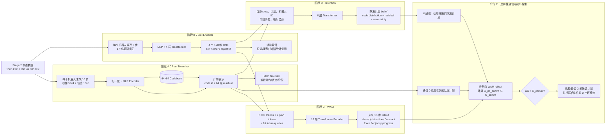
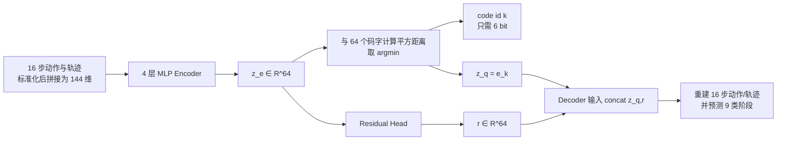
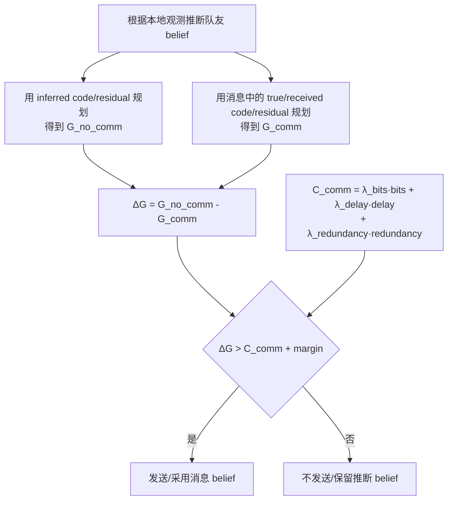

# FE-PC-WAM 模型信号流、原理、参数与指标说明

> 本文依据当前仓库实现整理。训练状态快照取自 2026-07-10；训练仍在进行时，最新数值应以各阶段的 `train_log.csv`、checkpoint 和 `artifacts/*/metrics.json` 为准。

## 1. 一句话理解系统

FE-PC-WAM（Free-Energy-Guided Selective Plan Communication World Action Model）让两个机器人分别把“最近看到了什么”和“未来准备怎么做”压缩成结构化 latent，利用 WAM 同时预测未来场景、联合动作、接触、受力和任务进度，再比较“通信”和“不通信”两种情况下的预期自由能，只在通信收益高于通信成本时发送计划。

这里的“自由能”是工程化的 expected-free-energy proxy，即多个任务代价的加权和，不是热力学自由能，也不是 VAE 中训练生成模型的 ELBO。

## 2. 总体信号流



训练顺序是严格分阶段的：tokenizer → slot encoder → WAM → intention。训练后续模块时，前面模块被冻结，用它们生成监督目标或输入 latent。

## 3. 张量和语义如何流动

| 位置 | 张量形状（省略 batch `B`） | 含义 |
|---|---:|---|
| 单机器人局部历史 | `[8, 17]` | 8 个历史步；每步为 11 维 proprio + 4 维上一动作 + force + contact |
| 单机器人未来动作 | `[16, 4]` | 平面底座 3 维控制 + 夹爪 1 维控制 |
| 单机器人未来轨迹 | `[16, 5]` | robot `(x,y,yaw)` + object `(x,y)` |
| tokenizer 离散计划 | `[]` | `code_indices`，范围为 0…63 |
| tokenizer 连续补充 | `[64]` | learned residual，用于补足单个离散 code 无法表达的细节 |
| 单机器人 slots | `[4, 128]` | self、other、两个 object slot |
| WAM 当前 slots | `[2, 4, 128]` | 两个机器人的场景表示 |
| WAM 计划输入 | codes `[2]`，residuals `[2,64]` | 两个机器人的计划 latent |
| WAM token 序列 | `[26, 1024]` | 8 slots + 2 plans + 16 future queries |
| WAM 联合动作输出 | `[16, 8]` | 两机器人未来动作拼接 |
| WAM 其他输出 | slots `[16,2,4,128]`；其余 `[16]` | future slots、contact logit、force、object-y progress |

所有连续输入在 tokenizer/slot encoder 前使用训练集统计量标准化。损失中的 MSE 因而通常是在标准化空间中计算，不能直接当成米、弧度或原始动作单位。

## 4. Codebook 是什么，如何使用

### 4.1 直观解释

Codebook 是一个可学习的“计划原型词典”。当前词典有 64 个词条，每个词条是一个 64 维向量：

\[
E=\{e_0,e_1,\ldots,e_{63}\},\qquad e_k\in\mathbb{R}^{64}.
\]

它类似聚类中心，但中心与 encoder/decoder 一起通过反向传播学习。理想情况下，不同 code 会对应不同的高层行为，例如接近、对齐、抓取、穿过狭窄通道或恢复；code 的含义不是人工指定的，必须通过 `token_phase_table.csv`、重建轨迹和按 code 聚合的样本事后解释。

### 4.2 编码过程



最近邻选择为：

\[
k=\arg\min_j \|z_e-e_j\|_2^2,\qquad z_q=e_k.
\]

`argmin` 不可导，所以实现采用 straight-through estimator：前向使用 `z_q`，反向把 decoder 对 `z_q` 的梯度近似传给 `z_e`。

### 4.3 Codebook 如何学到东西

VQ 损失为：

\[
L_{VQ}=\|e_k-\operatorname{sg}(z_e)\|^2
+\beta\|z_e-\operatorname{sg}(e_k)\|^2,
\]

其中 `sg` 表示 stop-gradient，当前 `β = commitment_weight = 0.25`。

- `codebook_loss` 把选中的码字拉向 encoder 输出；
- `commitment_loss` 约束 encoder 输出靠近选中的码字，避免 latent 任意漂移；
- 重建损失通过 straight-through estimator 教 encoder 保留对未来计划有用的信息。

### 4.4 Residual 到底是什么

当前实现中的 residual 是 `residual_head(z_e)`，不是 `z_e - z_q`。它是一个学习到的 64 维连续旁路：

- code id 表示粗粒度、可分类的计划原型；
- residual 表示速度、精确轨迹、动作幅值等细节；
- WAM 同时使用 `Embedding(code id)` 和 `Linear(residual)`；
- 通信时也同时发送二者。

这带来一个重要权衡：residual 提高重建能力，但也可能让 decoder 绕过 codebook。当前用 `0.05 × mean(r²)` 抑制 residual 过强，不过 `residual_dropout=0`，所以 ***codebook collapse 仍需重点监控***。

### 4.5 当前 codebook 使用状况

在训练完成 epoch 21 的快照中：

| 指标 | train | val | 解读 |
|---|---:|---:|---|
| used codes | 5 / 64 | 5 / 64 | 只有 7.8125% 码字被使用 |
| entropy | 1.5068 | 1.5343 | 使用分布的自然对数熵；上限为 `ln(64)=4.159` |
| perplexity | 4.5122 | 4.6383 | 有效使用的等概率码字数 `exp(entropy)` |

这已经是明显的低利用率/部分 codebook collapse。它不表示重建一定失败，但表示“64 类计划语言”实际上只有约 4.6 个有效类别。后续应以 tokenizer 评估生成的 code 使用柱状图、`token_behavior_summary.csv` 为准，并让闭环策略的 `active_codes` 来自本次训练真实活跃 code，而不是长期硬编码。

## 5. 四个可学习模块的原理

### 5.1 Plan Tokenizer：把连续未来压成“离散词 + 连续细节”

输入是单个机器人未来 16 步的动作和轨迹。模型先压成 `z_e`，量化为 code，再与 residual 一起解码。

总损失：

\[
L_{plan}=L_{action}+L_{traj}+L_{VQ}
+0.1L_{phase}+0.05L_{residual}.
\]

- `L_action`：标准化动作重建 MSE；
- `L_traj`：标准化轨迹重建 MSE；
- `L_phase`：每个未来步的 9 类阶段交叉熵；
- `L_residual=mean(r²)`：限制连续旁路容量。

模型约有 0.465M 个可训练参数。

### 5.2 Slot Encoder：把局部历史拆成实体化场景表示

每个机器人只能看到自身 8 步局部历史。`history_encoder` 先把 `[8,17]` 展平，生成上下文；机器人 ID 和阶段 embedding 加入上下文后，四个可学习 query 经 Transformer 形成：

1. self slot；
2. teammate/other slot；
3. object slot 0；
4. object slot 1。

辅助任务迫使 slots 包含可解释信息：自身绝对位姿、队友相对位姿、物体相对位姿、接触、力、任务阶段和未来计划 code。当前 full pipeline 配置约 1.781M 参数。

注意：两个 object slots 没有逐个对象的独立标签，object pose head 使用两者的均值；因此不能自动假设它们已经稳定分工。

### 5.3 WAM：条件式、多任务、整段并行预测

WAM 输入 token 为***（有其它机器人的输入，在推理时怎么获得）***：

```text
[robot0 的 4 slots] [robot1 的 4 slots]
[robot0 plan] [robot1 plan]
[future query t=0] ... [future query t=15]
```

slot token 加上 agent id、slot id 和 token type embedding；plan token由 code embedding、residual projection、agent-specific plan type embedding 相加；future query 加时间 embedding。

16 层 Transformer Encoder 后，只取最后 16 个 future-query token，通过五个 head 并行预测整段未来。它没有 causal mask，也不***逐步自回归***，因此是“一次预测完整 horizon”的条件模型。full 配置约 310.989M 参数。

WAM 损失为：

\[
L_{WAM}=L_{slots}+L_{actions}+0.2L_{contact}
+0.2L_{force}+0.5L_{progress}+0.02L_{smooth}.
\]

其中未来 slot 的监督不是人工真值，而是冻结 slot encoder 在未来各时刻产生的 latent；因此 `loss_slots` 是 latent consistency/distillation error。

### 5.4 Intention：从自身信息推断队友计划 belief

输入包括自身 4 个 slots、自身 code/residual、自身 ID、8 步阶段历史、***队友相对位姿和物体相对位姿***。Transformer query 输出：

- `target_code_logits[64]`：队友离散计划分布；
- `target_residual_mu[64]`：队友 residual 预测；
- `target_residual_logvar[64]`：受限在 `[-3,3]`；
- `uncertainty ≥ 0`：独立 softplus head 输出的标量不确定性。

full 配置约 52.045M 参数。实际训练损失为：

\[
L_{intent}=L_{CE}+L_{residual}+0.01L_{KL}-0.001H(code).
\]

当前训练脚本的 `consistency_weight` 默认和 pipeline 实际值都是 0，而且训练时始终传入 `consistency=None`，所以 WAM consistency 项并未参与当前 intention 训练。更重要的是，`uncertainty` 输出没有进入任何 loss：该 head 自身没有训练梯度，只有其输入的共享表示会因其他任务变化。因此当前 uncertainty 不能视为已经学会或校准的不确定性，直接用于通信触发前必须补充监督/校准，并检查它与实际预测错误的相关性。

## 6. 自由能评分和选择性通信

### 6.1 WAM rollout 的评分

对每个候选联合计划，系统计算：

\[
G=\alpha_gL_{goal}+\alpha_sL_{safety}+\alpha_cL_{collab}
+\alpha_uU_{intent}+\alpha_{ctrl}C_{ctrl}.
\]

当前权重为 `1.0, 2.0, 1.0, 0.5, 0.05`：安全代价权重最高。

| 分量 | 实现含义 | 越小表示 |
|---|---|---|
| `L_goal` | 终点及全程 object-y 到 `goal_y=3.05` 的剩余 gap | 更接近目标 |
| `L_safety` | 平均接触概率 + 超过 `force_limit=1.0` 的力 + 少量平均力 | 更少碰撞/过载 |
| `L_collab` | 两机器人底座动作 MSE + 夹爪不同步绝对误差 | 协作更同步 |
| `U_intent` | intention 模块输出的不确定性 | 对队友意图更确定 |
| `C_ctrl` | 动作幅值 + 动作时间差分 | 控制更小、更平滑 |

这里所有量都来自 WAM 的模型预测，所以低 `G` 只代表“模型认为更好”。闭环策略最终必须用真实环境成功率、安全和回报验证，不能只看离线 `G`。

### 6.2 通信触发规则



当前消息估算为：

\[
6\text{ code bits}+64\times8\text{ residual bits}
+32\text{ envelope bits}+8\text{ uncertainty bits}=558\text{ bits}.
\]

离线 communication eval 默认 `λ_bits=1e-4, λ_delay=0.05, λ_redundancy=0.1`，所以非冗余/冗余消息成本分别约为 0.1058/0.2058。闭环 `PolicyConfig` 使用更严格的 `2e-4, 0.1, 0.2`，对应约 0.2116/0.4116。评估和闭环的阈值不同，比较结果时必须注明配置。

当前在线闭环还有一个需要区分于离线训练的简化：`base_codes` 和 `base_residuals` 初始化为 0，自身候选从 hard-coded active codes 中采样，并在零 residual 周围加噪；它没有先用 tokenizer 从一个在线 future segment 编码当前计划（在线时本来也没有真实未来）。因此 tokenizer 在闭环中主要定义计划词表/维度，候选生成器才定义实际搜索空间。若活跃 code 随本次训练改变，必须同步候选列表。

## 7. 参数说明

### 7.1 训练与数据窗口参数

| 参数 | 当前 full 值 | 作用与影响 |
|---|---:|---|
| `history` | 8 | slot/intention 看多少历史步；太短不利于判断速度与阶段，太长增加输入复杂度 |
| `horizon` | 16 | tokenizer/WAM 预测未来长度；越长越难，但计划语义更完整 |
| `stride` | 2（训练） | 滑窗起点间隔；越小样本更多且相关性更强 |
| `batch_size` | 256；WAM 16 | 单次 batch；WAM 因模型大使用较小 batch |
| `grad_accum_steps` | WAM 4 | 有效 batch 约为 64，但最后不足 4 个 batch 的梯度当前不会 step |
| `epochs` | 100 | 每个阶段最大训练轮数；没有 early stopping |
| `lr` | `1e-4` | AdamW 学习率 |
| `weight_decay` | `1e-4` | AdamW 权重衰减 |
| `amp` / `amp_dtype` | 开；WAM/intention bf16 | 降低显存和提高吞吐；tokenizer/slot 使用 fp16 autocast |

### 7.2 容量参数

| 模块 | 关键参数 | 当前 full 值 | 含义 |
|---|---|---:|---|
| Tokenizer | `codebook_size` | 64 | 最大离散计划类别数；通信 code 需要 6 bit |
| Tokenizer | `latent_dim` | 64 | 每个码字和 residual 的维度 |
| Tokenizer | `hidden_dim` | 256 | encoder/decoder MLP 宽度 |
| Slot | `slot_dim` | 128 | 每个实体 slot 的容量 |
| Slot | `num_object_slots` | 2 | 物体 query 数；总 slots 为 4 |
| Slot | layers / heads | 4 / 4 | slot 内部 Transformer 深度和注意力头数 |
| WAM | `model_dim` | 1024 | WAM token 宽度 |
| WAM | layers / heads / FFN | 16 / 16 / 4096 | 主要决定约 311M 参数量和显存 |
| Intention | `model_dim` | 512 | intention token 宽度 |
| Intention | layers / heads / FFN | 8 / 8 / 2048 | 主要决定约 52M 参数量 |
| 通用 | `dropout` | 0.1 | Transformer/MLP 正则化，仅训练时生效 |
| WAM | `use_checkpoint` | true | activation checkpointing；省显存但增加计算 |

checkpoint 中的 tokenizer 配置是后续模块的尺寸真源。pipeline 会从 frozen checkpoint 自动覆盖 `horizon`、`codebook_size`、`latent_dim`、`slot_dim` 等依赖项，避免只看 dataclass 中仍为 32 的旧默认值而误判当前模型。

## 8. 训练、验证和最终评估指标如何看

### 8.1 通用规则

- `train_*`：模型参与参数更新的数据；用于看优化是否收敛。
- `val_*`：每个 epoch 在不更新参数的验证集上计算；`best.pt` 按最低 `val_loss` 保存。
- `test_*`：当前 pipeline 没有在训练过程中用于选模型；应只在模型和超参数冻结后做最终泛化报告。
- loss 最好同时看 train/val：两者都下降是正常学习；train 降而 val 升是过拟合；两者都高可能欠拟合或目标/归一化有问题。
- 当前日志是“各 batch 指标的平均”，不是严格按样本数加权；最后一个较小 val batch 与其他 batch 权重相同。

### 8.2 Tokenizer 指标

| 指标 | 含义 | 方向/注意点 |
|---|---|---|
| `loss` | 各分量按权重求和 | 越低越好 |
| `loss_action` | 标准化未来动作重建 MSE | 越低越好；需反归一化图判断实际误差 |
| `loss_traj` | 标准化未来轨迹重建 MSE | 越低越好 |
| `loss_phase` | 9 类阶段交叉熵 | 越低越好；随机均匀基线约 `ln(9)=2.197` |
| `loss_vq` | codebook + commitment loss | 过高表示量化困难，极低也可能伴随 collapse |
| `loss_residual` | residual 均方幅值 | 是正则项，不是预测误差 |
| `used_codes` / `usage_ratio` | 至少出现一次的码字数/比例 | 通常希望覆盖更多，但需结合语义纯度 |
| `entropy` / `perplexity` | 使用分布熵/有效码字数 | collapse 时显著偏低 |

epoch 0 → 21 的当前趋势：`val_loss 0.6625 → 0.0701`，`val_action 0.5156 → 0.0251`，说明重建快速改善；但 val perplexity 一直约 4.6，说明改善很可能较多依赖 residual 和少数活跃 code，而不是形成丰富的 64-code 计划词汇。

### 8.3 Slot Encoder 指标

| 指标 | 含义 |
|---|---|
| `loss_self_pose` | 标准化自身 `(x,y,yaw)` MSE |
| `loss_other_pose` | 标准化队友相对位姿 MSE |
| `loss_object_pose` | 标准化物体相对位姿 MSE |
| `loss_contact` | 二元接触 BCE |
| `loss_force` | force proxy 的 Smooth-L1；force 未在该 loss 内标准化 |
| `loss_phase`, `phase_acc` | 阶段 CE 与准确率 |
| `loss_plan`, `plan_acc` | 预测 tokenizer code 的 CE 与准确率；受 code 不平衡影响很大 |
| `contact_acc` | 以 0.5 阈值计算的接触准确率；类别极不平衡时还应看 precision/recall/AUROC |
| `*_pose_mae` | eval 时反归一化后的平均绝对误差；x/y/yaw 混合平均，最好再按维度报告 |

### 8.4 WAM 指标

| 指标 | 含义 |
|---|---|
| `loss_slots` | 预测 future slots 与 frozen slot encoder 目标的 MSE |
| `loss_actions` | 未来 16 步 8 维联合动作 MSE |
| `loss_contact` / `contact_acc` | 接触 BCE / 0.5 阈值准确率 |
| `loss_force` | 受力 Smooth-L1 |
| `loss_progress` | object-y 进度 MSE |
| `loss_smooth` | 预测动作相邻步差分的平方均值；低不一定准确，只说明平滑 |
| `slot_error_h1/hmid/hlast` | 近、中、远期 slot MSE；随 horizon 增长可反映误差扩散 |

### 8.5 Intention 指标

| 指标 | 含义 |
|---|---|
| `loss_ce` | 队友 code 分类交叉熵 |
| `code_acc` / `code_acc_direct` | 预测队友 code 的准确率 |
| `loss_residual`, `residual_mse` | residual 均值预测误差；当前二者只差很小的 logvar 正则 |
| `loss_kl` | residual 分布到标准正态的 KL 正则 |
| `entropy` | 预测 code 分布熵；损失中以负号鼓励少量探索性熵 |
| `uncertainty_mean/std` | 当前未受 loss 直接训练的 head 输出统计，不等同于准确率或已校准概率 |

codebook 只使用 5 个 code 时，随机猜 64 类不是合适基线；至少还应报告 majority-class baseline、macro-F1、按活跃 code 的混淆矩阵。

### 8.6 Free-energy、通信和闭环指标

| 指标 | 含义 | 期望方向 |
|---|---|---|
| `gt_selected_rate` | 候选 0（数据中的原计划）被最低 G 选中的比例 | 诊断排序，不是越高绝对越好 |
| `mean_selected_G` | 被选候选的平均预测 G | 越低越好，但只在同配置下比较 |
| `trigger_rate` | 发生通信的样本比例 | 不是越高越好；看性能/带宽折中 |
| `mean_delta_G` | 通信带来的平均自由能降低 | 越高越好 |
| `mean_C_comm` | 平均通信成本 | 越低越省资源 |
| `physical_gain_positive_rate` | 通信改善物理 rollout 评分的比例 | 越高越好 |
| `mean_info_gain` | 通信降低 intention uncertainty 的幅度 | 越高表示消息更有信息 |
| `redundancy_rate` | 推断 code 已等于消息 code 的比例 | 高时通信通常不值得 |
| `mean_bits` | 单条消息估算位数；当前通常 558 | 越低越省带宽 |
| `success_rate` | 闭环真实环境成功比例 | 最重要的终局指标之一 |
| `mean_return` | 真实环境累计 reward | 同一环境配置下越高越好 |
| `collision/force/distance` | 真实安全与协作指标 | 按具体定义判断，通常碰撞/峰值力越低越好 |
| `comm_per_episode` | 每回合通信次数 | 与成功率一起形成效率前沿 |

最终应并列比较 `no_comm`、`always_comm` 和 `selective_comm`：选择性通信的目标不是单独最大化成功率或最小化通信量，而是在接近 always-comm 的任务表现下显著减少消息，或在相同消息预算下优于 no-comm。

## 9. 当前数据和训练状态快照

### 9.1 数据集

| split | episodes | valid | success rate | mean T | mean reward |
|---|---:|---:|---:|---:|---:|
| train | 1360 | 1360 | 79.63% | 204.34 | 285.57 |
| val | 160 | 160 | 85.63% | 207.07 | 300.63 |
| test | 80 | 80 | 85.00% | 202.23 | 292.97 |

数据来自 1000 scripted、500 noisy、100 recovery episodes。三个 split 都无坏文件，但 val/test 成功率比 train 高约 6 个百分点；解释泛化指标时应记住 split 难度并非完全相同。

### 9.2 模型产物

检查时只有 plan tokenizer 正在训练并存在 `best.pt`、周期 checkpoint 与训练日志；slot encoder、WAM、intention、free-energy、communication 和闭环 rollout 尚未产生本次重建后的 active artifacts。因此目前不能把归档目录中的旧指标当作当前模型结果。

当前 tokenizer 已完成 epoch 21，最新 val 指标为：

| `val_loss` | `val_action` | `val_traj` | `val_phase` | `val_vq` | `val_residual` |
|---:|---:|---:|---:|---:|---:|
| 0.07009 | 0.02508 | 0.01526 | 0.17300 | 0.01212 | 0.00643 |

这些数值主要用于观察训练趋势，尚不是最终 100-epoch 结果。训练结束后应优先读取：

```text
artifacts/plan_tokenizer/metrics.json
artifacts/slot_encoder/metrics.json
artifacts/wam/metrics.json
artifacts/intention/metrics.json
artifacts/free_energy/metrics.json
artifacts/communication/ego_0/metrics.json
artifacts/communication/ego_1/metrics.json
outputs/policy_rollouts/{no_comm,always_comm,selective_comm}/summary.json
```

## 10. 阅读结果时最重要的检查清单

1. tokenizer 不只看重建 loss：同时看 codebook usage、perplexity、各 code 的样本和阶段纯度。
2. ***若保持当前 hard-coded `active_codes=(2,3,6,24,32,44,51)`，必须确认它们确实是本次 tokenizer 的活跃 code***。
3. slot/contact/phase/code 任务可能类别不平衡，accuracy 需要配合混淆矩阵、macro-F1、precision/recall。
4. intention 的 uncertainty 当前没有直接校准监督；触发通信前应验证“错误样本的不确定性是否更高”。
5. 离线自由能是模型评分，不是环境真值；最终结论以三种闭环策略在相同 seeds/scenarios 下的成功、安全、回报和消息量为准。
6. test split 应留到模型与阈值冻结后使用，避免把 test 变成第二个 validation set。
