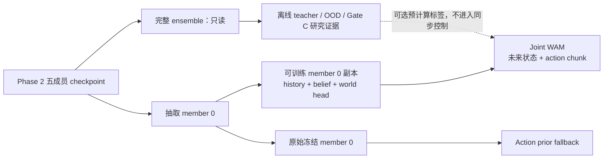

# Proprioceptive Joint WAM 技术计划 V2.3（历史归档）

> 归档日期：2026-07-17
>
> 本文记录阶段性设计、失败路线与验收过程，仅用于历史追溯。当前入口、资产路径和
> 复现命令以根目录 `README.md` 与仍在维护的 benchmark/baseline 计划为准。

> 更新日期：2026-07-17
>
> 当前结论：Phase 0 / Gate A、Phase 1 / Gate B、Phase 2 / Gate C、action prior baseline，以及 Phase 3-J v2 的 J0/J1/J2/J3 均已完成。Gate D-J 在 standard/challenge 各 500 个未见 seeds 上通过，关闭 fallback 的 Joint WAM direct 与相同 seeds 的 action prior 均为 100%，`policy_acceptable=true`；Phase 4 已解锁但尚未开始。Phase 3-M 已停止并删除，Phase 3-J v1 已判定失败并删除。完整五成员 Phase 2 ensemble 继续只作离线 teacher、OOD 探测器和研究证据；`joint_benefit` 仍未评测，不声称 joint world modeling 改善了控制。

## 1. 一句话目标

项目要做的是一个只使用双机器人 22 维 proprioception 的 Joint World-Action Model：模型既要预测接下来会发生什么，也要用 Flow Matching 直接生成一段动作；部署时不使用 MPPI 搜索，而是持续接收真实观测、复用短动作块，并在不安全时退回已经验证过的 action prior。

## 2. 最新判断

不需要推倒整个项目，也不需要丢掉全部 checkpoint。Phase 2 世界模型已经通过完整 Gate C，action prior 在 standard 和现有 challenge 环境上都达到 100% 成功率，这两部分是可靠底座；失败集中在 Phase 3 的动作生成和执行方式，因此只重做 Phase 3-J。

Phase 2 的职责现在拆成两条互不混淆的路径。在线路径只加载 member 0：以它的 history encoder、recurrent belief 和 world rollout head 初始化新的 Joint WAM，再新增一个 action flow head，直接训练未来状态与动作。完整五成员 ensemble 不再参与在线动作生成、同步 risk veto 或全量联合微调，只在离线/非阻塞 shadow 流程中产生 epistemic uncertainty、OOD 分数和 teacher targets，并保留 Gate C 的研究证据。

action prior 继续使用原始、冻结的 Phase 2 member 0。若 Joint WAM 后期解冻自己的 member 0 副本，fallback 必须加载独立的原始冻结副本，不能把已经联合微调的 belief 偷换成 prior 的输入。

旧 MPPI 路线不再保留。它在相同 3 个 seeds 上分别得到 `66.7% vs 100%` 和 `33.3% vs 100%`，明显差于 action prior；这些小样本结果不足以估计总体成功率，但足以停止把 MPPI 当作当前任务的主控制器。

旧 Joint FM v1 也不继续修补。关闭延迟 fallback 后，FM-JWAM 与 standalone-FM 在 standard 和 challenge 各 20 个 seeds 上都是 `0/20`，而 action prior 都是 `20/20`；正式 500-seed 运行中 FM 又因超时全部退回 prior，直接动作执行率为 0，因此报告中的 100% 成功率不是 Joint WAM 的成功。

## 3. 当前状态

| 阶段 | 状态 | 结论 | 保留资产 |
|---|---|---|---|
| Phase 0：数据、接口、单步基线 | ✅ 已完成 | Gate A 通过 | 数据集、采集与基线代码、正式配置 |
| Phase 1：RWM-AR | ✅ 已完成 | Gate B 通过 | 训练与评测代码、正式配置；checkpoint 已被 Phase 2 替代并删除 |
| Phase 2：RWM-U ensemble | ✅ 已完成、在线降级 | Gate C 通过；完整 ensemble 仅作离线 teacher、OOD 探测与研究证据 | 完整 Phase 2 checkpoint、校准与 Gate C 报告、训练与评测代码；member 0 是在线初始化源 |
| Action prior baseline | ✅ 已完成 | standard/challenge 均已饱和 | 独立 action-prior checkpoint、训练/加载/rollout 代码 |
| Phase 3-M：MPPI | 🛑 已停止 | 闭环效果比 prior 差 | 只在本文保留结论；代码、配置、checkpoint、输出已删除 |
| Phase 3-J v1：Joint FM | ❌ 已失败 | 直接动作灾难性失败，正式运行被 fallback 掩盖 | 只在本文保留结论；代码、配置、checkpoint、输出已删除 |
| Phase 3-J v2：Joint WAM | ✅ J0/J1/J2/J3 已完成 | 严格 joint coupling、最小闭环 gate 与两套 500-seed 正式评测均通过 | J1/J2 checkpoint、J0–J3 报告与视频证据；在线不依赖完整 ensemble |
| Gate D-J | ✅ 已通过 | `policy_acceptable=true`；direct/prior 两套 suite 均为 100%，回归 0pp | `outputs/wam_phase3_j3_v2/gate_d_j` |
| Phase 4 | 🟢 已解锁、未开始 | 本地 Gate 前置条件已满足；不得把当前 proprioception 结果宣传为 VLA | 无 |

## 4. 已完成结果

### 4.1 Phase 0 / Gate A：✅ 已完成

正式数据包含 10,000 个 episodes 和 1,097,241 个 transitions，其中成功 5,506 个、失败 4,494 个；train / validation / test 按 episode 与 seed 严格分成 8,000 / 1,000 / 1,000，无重叠；数据 schema 是 `wam.proprio/1.0`；Linear / MLP test state NRMSE 为 `0.13803 / 0.04186`；Gate A 全部检查通过。

### 4.2 Phase 1 / Gate B：✅ 已完成

256-fragment overfit continuous NRMSE 为 `0.01731`，门槛为 `≤0.02`；gripper-closed RMSE 为 `0.000422`，门槛为 `≤0.05`；test H=1 的 RWM / Phase 0 MLP / 常速度 NRMSE 为 `0.03140 / 0.03590 / 0.37113`；test H=16 finite rate 为 `1.0`，constraint violation rate 为 `0`；strict reload 差异为 `0`；Gate B 通过。

### 4.3 Phase 2 / Gate C：✅ 已完成

| 判据 | 结果 | 门槛 | 状态 |
|---|---:|---:|---|
| H=20 ensemble NRMSE 相对 Phase 0 MLP | `0.18434 vs 0.32066`，改善 42.51% | ≥20% | ✅ |
| H=20 AR member 0 相对 teacher forcing | `0.22030 vs 0.25155`，改善 12.42% | ≥5% | ✅ |
| H=20 uncertainty-error Spearman | `0.89098` | ≥0.30 | ✅ |
| H=20 OOD AUROC / epistemic ratio | `0.98853 / 29.25` | ≥0.70 / ≥1.25 | ✅ |
| H=5 dominant-agent accuracy / ambiguous rate | `97.58% / 2.24%` | ≥60% / ≤25% | ✅ |
| 完整 test split / finite / constraint violation | `true / 1.0 / 0` | `true / 1.0 / 0` | ✅ |

Gate C 证明当前世界模型在这个模拟任务上有可用的多步预测和不确定性信号，但不等于真实机器人安全认证，也不证明它已经能帮助动作生成。它足以支持保留完整 ensemble 做离线诊断，却不足以证明五成员 ensemble 是当前在线控制的必要组件。

### 4.4 Action prior：✅ 已完成

action prior 是一个以 Phase 2 member 0 的 recurrent belief 为输入的 tanh-Gaussian 行为克隆策略。它只从成功、高回报、oracle-like 数据学习动作，不做世界模型搜索；test selected-action RMSE 为 `0.02982`，在 standard 500 seeds 和现有 challenge 500 seeds 上成功率均为 100%。

本次清理已把 prior 从旧 MPPI planning-head checkpoint 中精确抽出：新模型包含 142,864 个 action 参数，旧 value head 已删除，新旧 action 参数最大差异为 `0`，新 checkpoint 使用 `wam.action_prior/1` 格式并继续严格绑定 Phase 2 指纹。

## 5. Phase 3-J v1 为什么失败

第一，训练目标没有形成足够强的 world-action 耦合。v1 的 world loss 主要使用专家动作预测未来，flow loss 单独学习动作速度场，因此 world branch 可以学得很好，但不必帮助 flow 生成更好的动作。

第二，控制语义不合理。v1 每个控制 step 都从新噪声重新生成完整动作块，却只执行第一步；这会放大第一步偏差和采样抖动，也丢掉动作块内部已经学到的时序结构。

第三，五个 flow member 的聚合容易把不同动作模式平均成一个并不存在的中间动作。对多峰动作分布，平均速度场不一定对应可执行策略。

第四，离线 flow loss 下降不代表闭环可用。训练和 evaluate 都没有在进入 500-seed rollout 前强制通过“关闭 fallback 的 20-seed 直接执行”门槛，导致大量计算花在一个已经灾难性失败的 checkpoint 上。

第五，50 ms 延迟预算与实现不匹配。直接运行的 P50 约 79 ms；正式评测触发 sticky fallback 后，FM 的成功率完全来自 prior，不能用于宣称 Joint WAM 可部署。

## 6. Phase 3-J v2 的系统结构

### 6.1 保留的底座

输入仍是最近 32 步的 proprioception 与已执行动作，不允许 policy 读取 `privileged_state`、`braking_agent` 或 `braking_time`。Phase 3-J v2 只抽取 Phase 2 member 0 作为可训练 Joint WAM 的初始化：history encoder、GRU belief 和 world rollout head 复制 member 0 权重；J1 的 action flow residual 网络随机初始化，同时把 accepted action prior 的动作头精确复制进 flow artifact 作为冻结 anchor。完整五成员 checkpoint 作为只读离线资产，不进入在线主链路。

系统保留两个用途不同的 member 0 实例：Joint WAM 使用可分阶段解冻的训练副本；action prior 使用原始冻结副本并继续作为强 baseline 与安全 fallback。二者必须在 checkpoint manifest 中显式区分，禁止静默共享联合微调后的 world trunk。



### 6.2 新的动作生成器

J0 已将 v2 接口锁定为：Flow Matching 每次生成 8 步动作块，正常连续执行 2 步，ODE solver 使用 4 步。warm start 严格按实际已执行步数左移上一动作块，尾部重复上一块的末动作，新观测在 J1 中只修正剩余动作；观测相对预测偏离、risk veto 或动作块耗尽时立即重生成。该配置不允许在不同评测之间静默改变。

J1 实际采用 anchored residual flow：冻结 anchor 用当前 member-0 belief 和确定性 world rollout 产生 8-step 基准 chunk，stateful flow 从 cold/shifted warm start 产生修正，运行时应用 `anchor + 0.10 × flow_residual`。anchor 被封装并冻结在 J1 flow checkpoint 内；direct policy 不加载外部 action-prior checkpoint，也不启用 fallback。验收额外要求 `flow_residual_applied=true`，避免用 anchor-only 路径伪装成 flow 成功。

默认只由一个 action expert 产生动作，避免多个 action modes 被平均。在线候选评估只使用 Joint WAM 自身的 member 0 world head；若以后需要多动作候选，应显式采样少量完整动作块并逐块评估，不再使用数百候选的 MPPI/CEM。完整 ensemble 可以离线复核这些候选的 epistemic/OOD 特征，但其结果不参与当前同步动作选择。

### 6.3 真正的 joint 训练

v2 必须从 Phase 2 member 0 直接开始未来状态与动作的联合训练。初始化关系为：

\[
(\theta_{\mathrm{hist}},\theta_{\mathrm{belief}},\theta_{\mathrm{world}})
\leftarrow \theta_{\mathrm{Phase2}}^{(0)},
\qquad
\theta_{\mathrm{action}} \sim \mathrm{Init}.
\]

模型使用共享 history encoder 和 recurrent belief，同时输出未来状态 \(\hat{s}_{t+1:t+H}\) 与 action chunk \(\hat{a}_{t:t+K-1}\)。world head 既看专家动作，也按训练进度看 flow 生成的动作，生成动作比例从 0 逐步升高；对生成动作的 world consistency、failure risk 和任务进展损失可以回传到 action branch，但开始阶段冻结 member 0 的 world 参数，避免随机 action 梯度破坏已通过 Gate C 的预测能力。

主要训练目标为：

\[
\mathcal{L}_{J}
= \mathcal{L}_{\mathrm{FM}}(\hat{a},a^{*})
+ \lambda_{w}\mathcal{L}_{\mathrm{world}}(\hat{s}\mid a^{*},s^{*})
+ \lambda_{g}\mathcal{L}_{\mathrm{consistency}}(\hat{s}\mid\hat{a})
+ \lambda_{r}\mathcal{L}_{\mathrm{risk/progress}}.
\]

其中专家动作 \(a^{*}\) 的 world loss 使用数据集真实未来状态 \(s^{*}\)；生成动作 \(\hat{a}\) 通常与原示范动作不同，因此不得把同一条示范的 \(s^{*}\) 当作它的真实结果。\(\mathcal{L}_{\mathrm{consistency}}\) 的 target 只能来自原始冻结 member 0、离线 ensemble teacher 或真实环境 relabel，且必须标记 target 来源。

完整 ensemble 只可离线生成 teacher targets，例如 ensemble mean、epistemic disagreement 和 OOD 标签。训练时优先把这些结果预计算进数据或缓存，不在每个 batch 中同步运行五个成员，也不把完整 ensemble 变成 Joint WAM 的部署依赖。

训练分三步：先冻结 member 0 的 history/belief/world 参数，只训练 stateful action flow；再加入 generated-action world consistency；最后以远小于 action head 的学习率解冻 Joint WAM 内部的 member 0 副本，使 shared history/belief、world head 和 action head 接受联合目标的梯度。原始 Phase 2 member 0 与完整 ensemble 始终只读。任何一步失败都停止；不再规划全量五成员联合训练。

训练数据要保留完整动作块，不能跨 episode；继续使用成功与高回报样本作为主动作监督，同时保留失败数据训练 world/risk。现有 standard/challenge 被 prior 饱和不再阻塞 v2 验收；更难且 prior 未饱和的 challenge-v2 只作为后续研究 world modeling 是否带来额外收益的可选压力测试，不能反过来成为接受当前工程实现的前置条件。

### 6.4 “Joint World-Action Model”的名称边界

J1 冻结 member 0、只训练 action flow head 时，模型虽然能从同一 belief 输出未来状态和动作，但训练形式实际是：

\[
h_t=f_{\psi_0}(o_{\le t},a_{<t}),\qquad
p_{\phi}(a_{t:t+K-1}\mid h_t)\,
p_{\theta_0}(s_{t+1:t+H}\mid h_t,a),
\qquad \psi_0,\theta_0\ \text{frozen}.
\]

这一阶段更准确的名称是 **WAM-conditioned action policy** 或 **frozen-backbone action warm-up**，不能单独作为“联合训练提升控制”的证据。

进入 J2 后，模型使用统一条件上下文，并对共享 member 0 副本和 action head 优化联合目标：

\[
h_t=f_{\psi}(o_{\le t},a_{<t}),\qquad
p_{\psi,\theta,\phi}(a,s\mid o_{\le t},a_{<t})
=p_{\psi,\phi}(a\mid o_{\le t},a_{<t})\,
 p_{\psi,\theta}(s\mid o_{\le t},a_{<t},a),
\qquad \psi,\theta,\phi\ \text{trainable}.
\]

只有当 shared history/belief 或 world-action coupling 参数确实收到 action/world 联合损失的梯度，并在训练日志和 checkpoint parameter-delta 中可验证时，本文才把 J2 产物称为 **Joint World-Action Model**。不要求联合更新后的控制效果优于 action prior；若最终选择始终冻结 member 0，则控制器仍可验收，但应使用 WAM-conditioned action policy 的名称，不宣称完成了严格的 joint training。

### 6.5 部署流程

1. 读取真实 proprioception，更新 recurrent belief。
2. 如果已有动作块仍有效，平移并小幅修正；否则从 warm start 生成新动作块。
3. 用在线 member 0 检查预测机器人距离、failure probability、action OOD、状态约束和真实观测相对预测的残差；当前在线 veto 不使用 ensemble epistemic uncertainty。
4. 安全时执行动作块的下一步；风险过高时调用“原始冻结 member 0 + action prior”路径；prior 也不可用时执行 fixed-grip safe stop。
5. 完整 ensemble 只在离线或非阻塞 shadow 模式复算 epistemic uncertainty/OOD，不影响当前动作，也不计入主控制器延迟预算；shadow latency 单独报告。
6. 每一步记录实际动作来源，FM、prior 和 safe stop 的覆盖率必须分开报告。

## 7. Phase 3-J v2 实施顺序

### J0：接口与数据审计——✅ 已完成

已锁定 `action_chunk_horizon=8`、`execution_steps=2`、`solver_steps=4` 和 `shift_repeat_last` warm-start 语义；shift 使用实际已执行步数，尾部重复末动作。已增加单 member checkpoint loader、相互独立的 Joint 训练副本与原始冻结 fallback 副本，并把 action-prior 在线加载从完整 ensemble 改为仅校验/加载 member 0；J1 初始冻结 Joint 副本，J2 可显式解冻，fallback 副本与 action prior 始终冻结。

全量 J0 审计读取了 10,000 个 episodes、1,097,241 个 transitions，得到 1,027,241 个完整 8-step 动作块，所有 episode 均至少包含一个完整动作块。train / validation / test 为 8,000 / 1,000 / 1,000，三组 seed overlap 均为 0；成功/失败分别为 train `4388/3612`、validation `557/443`、test `561/439`；状态链最大绝对误差为 `0`，动作 NaN/Inf 和越界计数均为 `0`，数据中没有 privileged 字段。asset contract 同时证明仅加载 `members/member_00.safetensors`、两个副本参数存储不共享、初始权重差异为 `0`、J2 解冻 Joint 副本不会解冻 fallback，并且审计前后 Phase 2 member 0 与 action-prior SHA-256 不变。定向测试 `15 passed`，项目全量测试 `49 passed`；正式证据见 `outputs/wam_phase3_j0_v2/j0_audit.json`。

### J1：Frozen-backbone action warm-up——✅ 已完成

J1 冻结 Phase 2 member 0 的 history encoder、recurrent belief 和 world head，只训练单 expert stateful rectified-flow residual。训练先在完整 8-step 数据块上完成 5,520 个优化 steps，再在与验收 seeds 隔离的 standard/challenge 教师闭环轨迹上完成两轮 stateful warm-start 蒸馏；两轮均为 32 episodes、成功率 100%，分别得到 1,186 / 1,165 个请求和 75 / 75 个 solver-aware fine-tune steps。action-prior anchor 只作为冻结、内嵌的动作基准，外部 prior 不进入 direct policy，也不作为 fallback。

test offline 共评估 100,945 个完整 chunks，其中 48,333 个满足动作监督条件；cold / warm 相对冻结教师的 chunk RMSE 为 `0.00680 / 0.00682`，首动作 RMSE 为 `0.00528`。生成动作 non-finite / 越界计数均为 `0 / 0`；专家动作条件下的 dataset-next-state world NRMSE 为 `0.08710`。member 0 参数变化、anchor 相对 accepted prior 参数变化、strict checkpoint reload 最大误差均为 `0`；flow 参数最大变化为 `0.75536`，源 checkpoint 保持不可变，在线只加载 member 0、不加载 ensemble。

| J1 闭环门槛 | standard | challenge | 结论 |
|---|---:|---:|---|
| 3-seed smoke：flow / prior | `3/3 / 3/3` | `3/3 / 3/3` | ✅ |
| 20-seed gate：flow / prior | `20/20 / 20/20` | `20/20 / 20/20` | ✅ |
| direct flow / fallback / seed overlap | `100% / 0% / 0` | `100% / 0% / 0` | ✅ |
| flow residual mean / max | `0.00251 / 0.05637` | `0.00355 / 0.05012` | ✅ 实际参与执行 |
| latency P50 / P95 | `11.59 / 14.23 ms` | `11.67 / 14.08 ms` | ✅ 报告项 |

两套 20-seed suite 的动作均 finite/bounded，无 privileged-state leakage、无提前静止成功，Phase 2/action-prior/flow 源文件评测前后指纹不变。J1 的工程门槛已经通过，但 member 0 保持冻结，因此该产物仍称为 **WAM-conditioned action policy**，不能作为 joint world-action training 带来收益的证据。项目全量测试为 `56 passed`；正式证据见 `outputs/wam_phase3_j1_v2/{smoke,gate_20_seed}`。

### J2：Joint coupling——✅ 已完成

J2 从已通过的 J1 action flow 和 Phase 2 member 0 初始化，使用全部完整动作块训练：train / validation / test 分别为 `824,397 / 101,899 / 100,945`。正式训练共 `704` steps，依次执行 `flow_only=64`、`world_heads=128`、`full_joint=512`；flow 学习率为 `2e-5`，member 0 学习率依次为 `0 / 1e-6 / 5e-7`。动作监督继续按 action quality 加权，expert-action world loss 覆盖成功和失败轨迹，完整五成员 ensemble 不进入在线或梯度路径。

generated/deployed-action consistency 使用**原始冻结 Phase 2 member 0 在同一生成动作上的预测**作为 teacher target，target 来源固定记录为 `frozen_phase2_member_0_same_generated_actions`；接口和 checkpoint 都显式记录 `generated_action_demo_state_is_ground_truth=false`，从而禁止把示范未来状态伪装成不同生成动作的真实结果。冻结 teacher 与内嵌 action-prior anchor 的参数变化均为 `0`。

| J2 离线验收 | validation | test | 门槛 / 结论 |
|---|---:|---:|---|
| expert-action world state NRMSE | `0.08192` | `0.08692` | `≤0.11`，✅ |
| generated/deployed-action teacher state NRMSE 最大值 | `0.00341` | `0.00355` | `≤0.10`，✅ |
| cold/warm generated actions | finite / bounded | finite / bounded | ✅ |
| strict reload 最大差异 | `0` | `0` | ✅ |

训练后的 member 0、shared history、world 和 action flow 最大参数变化分别为 `3.93e-4 / 2.51e-4 / 3.93e-4 / 3.84e-3`。必要的分支梯度均非零：action→flow/backbone 为 `4.30e-2 / 2.40e-2`，world→backbone 为 `1.45e1`，generated-action consistency→flow/backbone 为 `7.91e-4 / 2.82e-2`；按损失图设计，world→flow 的直接梯度为 `0`，不作为联合性判据。原始 Phase 2 member 0、完整 ensemble、action prior、J1 flow、冻结 teacher 和 anchor 在训练/验收前后保持不可变，checkpoint 严格重载误差为 `0`。这些证据满足本文对严格 **Joint World-Action Model** 的命名要求。

| J2 闭环门槛 | standard | challenge | 结论 |
|---|---:|---:|---|
| 3-seed smoke：Joint WAM / prior | `3/3 / 3/3` | `3/3 / 3/3` | ✅ |
| 20-seed gate：Joint WAM / prior | `20/20 / 20/20` | `20/20 / 20/20` | ✅ |
| direct flow / fallback / seed overlap | `100% / 0% / 0` | `100% / 0% / 0` | ✅ |
| flow residual mean / max | `0.00368 / 0.05937` | `0.00523 / 0.05394` | ✅ 实际参与执行 |
| latency P50 / P95 | `10.50 / 11.08 ms` | `10.51 / 11.10 ms` | ✅ 报告项 |

两套 direct gate 均关闭 fallback，动作 finite/bounded，无 privileged-state leakage、无提前静止成功；standard 有 `1` 次大于 50 ms 的 deadline miss，但不影响 P95 或闭环成功。验收额外锁定 canonical config，禁止用 CLI 自降 episode 数、成功率门槛或 challenge 难度；J2 manifest 内嵌原始 partitions 和 J1 on-policy 蒸馏 seeds，当前祖先训练 seed overlap 为 `0`。checkpoint 以 schema-last 的 fail-closed 写入绑定 joint/flow 权重、config、manifest、metrics 和 provenance 的 SHA-256，四项 formal-run guard 与 `formal_protocol=true` 均通过。项目全量测试为 `70 passed`；正式证据见 `checkpoints/wam_cooperative_stop_phase3_j2_v2/metrics.json` 和 `outputs/wam_phase3_j2_v2/{smoke,gate_20_seed}`。现有任务被 prior 与 J1/J2 同时饱和，且尚未运行未饱和任务上的配对消融，因此这里只确认 J2 的联合训练和直接执行通过，不声称 joint training 带来额外控制增益。

### J3：正式全量评测与 Gate D-J——✅ 已完成

J3 不再训练模型，而是严格重载已通过 J2 的 joint member 0 与 action flow，在 standard `120000–120499` 和 challenge `220000–220499` 上各运行 500 个未见 seeds。每个 suite 对 direct Joint WAM、action prior、stationary、scripted oracle 和 report-only fallback deployment 使用完全相同的 seeds；正式 direct 路径关闭 fallback。Phase 2、J1、action prior 和 J2 的离线分区清单已交叉验证，J1 manifest 与训练 metrics 的 on-policy seed 证据一致；10,064 个祖先训练 seeds 与 1,000 个评测 seeds overlap 为 `0`。

| J3 正式结果 | standard | challenge |
|---|---:|---:|
| Joint WAM direct / action prior | `500/500 / 500/500` | `500/500 / 500/500` |
| stationary / scripted oracle | `0/500 / 500/500` | `0/500 / 500/500` |
| report-only fallback deployment | `500/500`，trigger `0%` | `500/500`，trigger `0%` |
| direct return / response delay / coordination error | `68.405 / 0.203 s / 0.01508` | `58.111 / 0.263 s / 0.03356` |
| direct latency P50 / P95 / P99 | `9.569 / 14.476 / 17.419 ms` | `9.598 / 14.366 / 17.307 ms` |
| online world state NRMSE mean / RMS | `0.00918 / 0.02079` | `0.02499 / 0.03590` |
| 实际执行 flow residual mean / max | `0.00137 / 0.02540` | `0.00206 / 0.02179` |
| direct action-source / residual 样本 | `45,238 / 45,238` | `27,665 / 27,665` |

两套 direct 运行的动作均 finite/bounded，无 privileged-state leakage、无提前静止成功，action-source coverage 为 100%，fallback trigger 为 0。raw episode records 与聚合指标逐项一致，J2 strict-joint evidence、checkpoint 严格重载和评测前后源指纹均通过。按每套排序后最小的 3 个成功 seeds 生成 6 条 640×360 direct/no-fallback 视频；本次没有失败 episode，因此失败视频为 0。MP4 的哈希、帧数、sidecar、重放结果与动作来源均通过验证。正式证据见 `outputs/wam_phase3_j3_v2/gate_d_j`，项目全量测试为 `110 passed`。

## 8. Gate D-J

由于当前环境与任务设置较简单，action prior 在 standard 和现有 challenge 上均已达到 100%，Gate D-J 的目标改为验证 Joint WAM 能否稳定直接执行并达到接近 prior 的效果，而不是要求它在已经饱和的任务上显著胜出。

### 8.1 必要结论：`policy_acceptable`

- 在 standard 与现有 challenge 上各运行 500 个未见 seeds，训练 seed overlap 为 0；验收运行关闭 action-prior fallback，确保统计的是 Joint WAM 自身的直接控制结果。
- 每个 suite 的 Joint WAM 成功率相对同 seeds 的 action prior 回归不超过 10 个百分点。当前 prior 为 100%，因此对应最低可接受成功率为 90%；不要求 Joint WAM 优于 action prior。
- 动作全部 finite 且位于 `[-1,1]`，无 privileged-state leakage，也不允许通过提前静止刷成功。
- 至少渲染 3 条成功 evaluation 视频；若存在失败，渲染最多 3 条失败视频，失败少于 3 条时全部渲染。视频 seed 选择采用排序后最小的相应 seeds，禁止人工挑选最好看的轨迹。
- 每条视频及其 sidecar metadata 必须包含 seed、suite、success/failure、failure reason、实际动作来源和是否启用 fallback。正式验收视频必须标记 `fallback=false`。
- 平均 return、response delay、coordination error、P50/P95/P99 latency、world NRMSE、action-source coverage 和带 fallback 的部署成功率继续完整报告，但不再作为“必须优于 action prior”的硬门槛。
- 若 J2 产物使用 Joint World-Action Model 名称，必须额外证明 member 0 训练副本存在非零梯度和参数变化；原始冻结 member 0、action prior 和完整 ensemble 的 checkpoint 必须保持不变、可严格重载。

以上条件在 J3 正式运行中已全部满足：两套 suite 的 direct/prior 都是 100%，成功率回归为 0pp，`policy_acceptable=true`，Gate D-J 通过。是否优于 action prior、standalone flow 或 frozen-backbone 版本不再阻塞 Gate D-J。

### 8.2 可选研究结论：`joint_benefit`

- 如需声称“联合 world-action 训练改善了控制”，再在可选 challenge-v2 或其他未饱和任务上，用配对 seeds 比较 J2、frozen-backbone action policy 与 standalone flow。
- 对照应使用相同数据、action-expert 参数量、训练 steps、solver steps 和部署限制；显著性与效应量单独报告。
- `joint_benefit=false` 或未评测不影响 `policy_acceptable`，但此时只能声称实现了可用的联合状态/动作模型，不能声称 joint world modeling 带来了控制增益。

## 9. 资产规则

### 9.1 保留

- `datasets/cooperative_stop_wam_proprio`：正式数据集。
- `refs/`：四篇本地参考工作。
- `checkpoints/wam_cooperative_stop_phase2_rwm_u_v1`：唯一保留的 Phase 2 world-model checkpoint；完整 ensemble 用于离线 teacher、OOD 探测和研究证据，member 0 用于 Phase 3-J v2 初始化与原始 prior belief。
- `checkpoints/wam_cooperative_stop_action_prior_v1`：唯一保留的 policy baseline checkpoint。
- `configs/wam/phase3_j2_joint_coupling_v2.yaml`：J2 三阶段训练、离线 guard 与 direct-gate 契约。
- `configs/wam/phase3_j3_gate_d_v2.yaml`：J3 两套 500-seed 正式评测、视频与 Gate D-J 契约。
- `checkpoints/wam_cooperative_stop_phase3_j1_v2`：通过离线、smoke 和 20-seed gate 的 J1 frozen-backbone anchored residual-flow checkpoint。
- `checkpoints/wam_cooperative_stop_phase3_j2_v2`：通过严格联合训练离线验收、smoke 和 20-seed direct gate 的 J2 checkpoint；包含 joint member 0、action flow、父资产指纹、schema、metrics 与 provenance。
- `outputs/wam_phase2_uncertainty_v1`：Gate C 与 variance calibration 的最小证据。
- `outputs/wam_phase3_j0_v2/j0_audit.json`：Phase 3-J0-v2 的全量数据、资产隔离与接口契约证据。
- `outputs/wam_phase3_j1_v2/{smoke,gate_20_seed}`：J1 direct-flow 最小闭环指标与报告；fallback 关闭。
- `outputs/wam_phase3_j2_v2/{smoke,gate_20_seed}`：J2 Joint WAM 最小闭环指标与报告；fallback 关闭。
- `outputs/wam_phase3_j3_v2/gate_d_j`：J3 正式 metrics、5,000 条 episode records、报告、视频 manifest，以及 6 条 direct/no-fallback 成功视频与 sidecar。
- Phase 0/1/2、action prior、环境、数据与通用评测代码。

### 9.2 删除

- Phase 1 checkpoint、overfit checkpoint、Phase 0/1 冗余输出与数据 cache，因为正式指标已记录且 Phase 2 checkpoint 自包含。
- 所有 MPPI 配置、planner/policy、value head、训练/rollout 脚本、测试、checkpoint 和输出。
- 所有 Joint FM v1 模型、loss/trainer、policy、训练/rollout 脚本、测试、config、checkpoint 和输出。
- `__pycache__`、pytest/ruff cache 与其他可再生临时文件。

## 10. 当前可运行命令

验证保留的 action prior：

```bash
python scripts/evaluate_action_prior.py --config configs/wam/action_prior.yaml --device cuda --episodes 100 --output-dir outputs/action_prior_eval
```

重新训练 action prior：

```bash
python scripts/train_action_prior.py --config configs/wam/action_prior.yaml --data-dir datasets/cooperative_stop_wam_proprio/hdf5 --phase2-checkpoint-dir checkpoints/wam_cooperative_stop_phase2_rwm_u_v1 --checkpoint-dir checkpoints/wam_cooperative_stop_action_prior_v1 --device cuda
```

验证 Phase 3-J0-v2 接口、资产隔离与全量数据：

```bash
python scripts/audit_phase3_j0_v2.py --device cpu
```

训练并严格审计 Phase 3-J1-v2：

```bash
python scripts/train_phase3_j1_v2.py --config configs/wam/phase3_j1_frozen_action_v2.yaml --device cuda
```

复现 J1 smoke 与 20-seed gate：

```bash
python scripts/evaluate_phase3_j1_v2.py --config configs/wam/phase3_j1_frozen_action_v2.yaml --device cuda --protocol smoke
python scripts/evaluate_phase3_j1_v2.py --config configs/wam/phase3_j1_frozen_action_v2.yaml --device cuda --protocol gate
```

训练并严格审计 Phase 3-J2-v2：

```bash
uv run python scripts/train_phase3_j2_v2.py --config configs/wam/phase3_j2_joint_coupling_v2.yaml --device cuda
```

复现 J2 smoke 与 20-seed direct gate：

```bash
uv run python scripts/evaluate_phase3_j2_v2.py --config configs/wam/phase3_j2_joint_coupling_v2.yaml --device cuda --protocol smoke
uv run python scripts/evaluate_phase3_j2_v2.py --config configs/wam/phase3_j2_joint_coupling_v2.yaml --device cuda --protocol gate
```

复现 J3 两套 500-seed 正式 Gate D-J：

```bash
uv run python scripts/evaluate_phase3_j3_v2.py --config configs/wam/phase3_j3_gate_d_v2.yaml --device cpu
```

J1/J2/J3 在线评测都不要求加载其余四个 ensemble 成员；任何沿用 `phase3_joint_fm_v1` 的命令和 checkpoint 都已经失效，不应继续运行。

## 11. 参考工作的直接启发

`World Action Models are Zero-shot Policies` 和 `Native Video-Action Pretraining for Generalizable Robot Control` 支持“从同一上下文生成未来状态与动作、动作块执行、闭环重新对齐”，而不是每个控制 step 从全新噪声生成完整块后只取第一步；`COMBO` 支持保留 world model 做反事实预测和离线评估；`Gamma-World` 支持多主体结构化建模，但不意味着当前双机器人简单任务必须在线运行五成员 ensemble 或平均多个动作策略。这里采用这些原则，不复制它们的视觉输入或大模型规模。

## 12. 最终决策

J0/J1/J2/J3 已完成。J2 用同一生成动作上的冻结 member-0 teacher target 实现 generated-action world consistency，并以可审计的非零联合梯度和参数变化证明 shared history、world head 与 action flow 已发生严格 joint coupling；J3 随后在关闭 fallback 的 standard/challenge 各 500 个未见 seeds 上得到 direct `500/500`，相同 seeds 的 action prior 也是 `500/500`，所有 Gate 与视频证据检查通过。当前可以使用 **Joint World-Action Model** 名称，Gate D-J 已通过且 `policy_acceptable=true`，Phase 4 已解锁但尚未开始。

现有任务被 Joint WAM 与 prior 同时饱和，尚未在未饱和任务上完成 Joint、frozen-backbone 与 standalone flow 的同预算配对消融，因此 `joint_benefit` 保持未评测；本计划不声称 joint world modeling 带来了控制增益，也不把当前 22 维 proprioception 系统宣传为 VLA。
