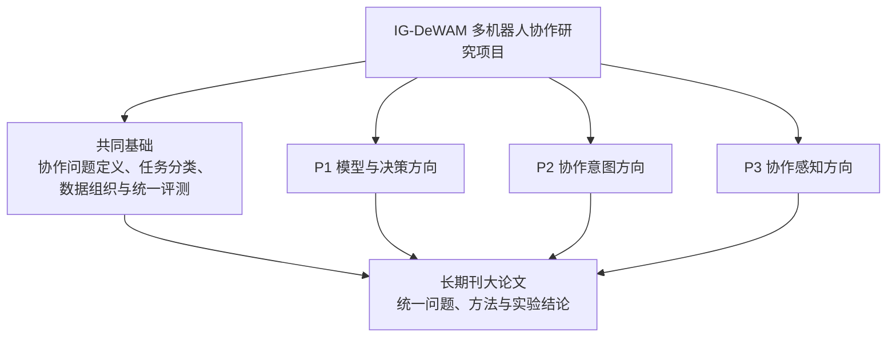
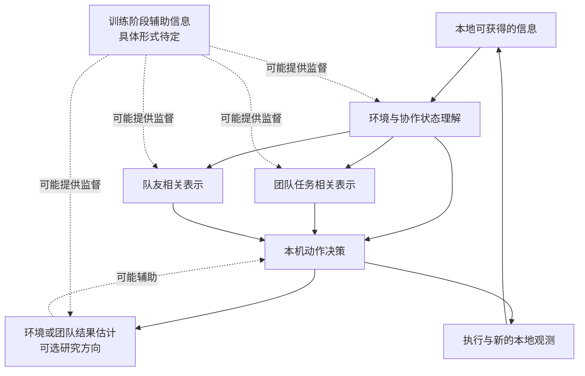

# Intent-Grounded Decentralized World-Action Models for Multi-Robot Collaboration 研究方案 V2.0

> 大论文题目暨整体方案代号：**Intent-Grounded Decentralized World-Action Models for Multi-Robot Collaboration（IG-DeWAM）**
>
> 中文题目：**面向多机器人协作的意图落地去中心化世界—动作模型**
>
> 本次实质更新：2026-07-24；上一版：CoBelief-WAM V1.0（2026-07-22）
>
> 研究边界：训练阶段可以讨论联合轨迹或较完整的环境信息；如果后续开展去中心化部署验证，每台机器人原则上只能使用本地可获得的信息。
>
> 方案成熟度说明：第 2 部分给出当前用于讨论的学术化问题定义；第 3、4 部分只描述候选研究框架和实验方向，不代表已经确定的数据格式、模型接口、部署流程或实验协议。相关内容需要在子课题取得进展后逐步补充。

本文围绕一个主张展开：**团队任务意图与队友意图需要被区分讨论，不能始终混在无法分析的策略内部；最终方法还需要说明协作相关表示怎样参与动作生成，并检验它是否影响闭环团队表现。** 两类意图是否分别建模或训练、采用何种接口，目前仍属于待研究问题。本文不把多任务泛化作为主线，而专门研究多机器人协作带来的动力学耦合、局部观测、意图推断和团队贡献分配问题。

文中的“意图落地（intent grounding）”不是要猜出机器人的真实心理，而是检验一件更具体的事：保持本机观测不变，只替换模型对团队任务或队友行为的判断，本机动作是否会按照任务需要发生变化，并进一步影响团队在闭环执行中的表现。

## 1. 整体路线

### 1.1 大论文的中心问题与核心主张

大论文回答以下问题：

> 在部分可观测、低带宽通信和机器人数量可变的条件下，能否学习一个严格去中心化的世界—动作模型，使每台机器人分别维护团队任务意图与队友意图，并让这两类意图通过一条可以验证的路径参与本机动作生成，从而完成单机无法完成的协作任务？

核心主张分为四层：

1. **问题层：** 多机器人协作不等于“多台机器人得到同一个奖励”。只有当任务需要联合能力、机器人之间存在时间或空间耦合，而且本机决策需要利用队友信息时，才属于本文研究的协作。建模时还需要同时考虑场景中的机器人总数和当前真正参与协作的机器人数量。
2. **表示层：** 团队任务意图与队友意图是两个需要区分讨论的概念。它们具体包含哪些信息、采用何种表示以及是否分别训练，仍需结合子课题研究进一步确定。
3. **模型层：** 模型需要建立协作相关信息与动作生成之间可以分析的联系，但目前不限定融合模块、世界模型、价值模型或训练方式。
4. **证据层：** 仅报告意图预测准确率不足以支持核心主张。后续还需要观察协作相关表示是否影响动作和闭环团队结果，具体实验形式尚待设计。

用一句话概括技术路线：

```text
本机观察环境
→ 判断团队当前要做什么、队友接下来可能做什么
→ 形成考虑协作关系的本机动作
→ 在需要时估计动作可能带来的团队结果
→ 执行后重新观察并更新判断
```

### 1.2 子课题分解与论文路线

大论文可以暂时分解为模型结构、协作意图和协作感知三个研究方向，再根据各方向的实际进展考虑形成子文章，并最终整合为长期刊文章。

**以下子课题仅为当前阶段的初步想法，不是已经确定的问题定义、技术路线、论文题目或人员分工。各个合作者需要根据自身研究基础、数据条件、实验进展和投稿计划进行调整；必要时可以修改题目与研究范围，也可以合并、拆分或重新组织子课题。文中的 P1、P2 和 P3 只用于指代研究方向。**

| 编号 | 暂定方向 | 初步关注内容 | 与大论文的可能联系 |
|---|---|---|---|
| P1 | **多机器人协作模型结构与动作生成** | 笼统关注模型怎样组织多机器人协作信息，并将其用于本地动作决策；暂不限定具体主干、生成方法或模块接口 | 可能为大论文提供模型与决策方法方面的探索 |
| P2 | **多机器人协作中的意图研究** | 笼统关注团队任务、队友行为或其他协作相关信息应如何理解，以及这些信息是否有助于动作与团队协作；暂不限定意图定义和验证方法 | 可能为大论文提供协作信息表示与作用机制方面的探索 |
| P3 | **面向多机器人协作的感知研究** | 笼统关注深度、空间关系、遮挡和感知不确定性对多机器人协作的影响；暂不限定传感器组合、三维表示或输出形式 | 可能为大论文提供本地协作感知方面的探索 |
| J | **Intent-Grounded Decentralized World-Action Models for Multi-Robot Collaboration** | 在子课题取得阶段性结果后，讨论哪些内容可以组成统一的多机器人协作方法 | 形成统一的问题定义、模型框架和实验结论 |

各子课题是否形成独立文章、文章之间如何划分，以及长期刊文章最终整合哪些内容，均需以后续研究结果为依据。现阶段只需保持总体目标一致，并注意不同方向之间可以共享问题定义、实验平台和基础数据。

### 1.3 大项目分解图

整个项目暂按一项共同基础、三个可调整的研究方向和最终的大论文整合来理解：



P1、P2 和 P3 表示当前可以并行探索的方向，而不是固定的研究边界。各方向可以根据实际情况调整，长期刊大论文再从已经得到充分验证的结果中选择可整合的内容。

### 1.4 研究范围与声明边界

主实验聚焦**协作专精**，而非开放世界或任意多任务泛化：

- 主要训练/测试在预先定义的多机器人协作任务族内进行；
- 未见过的场景、队友策略、机器人数量和遮挡条件只用于检验鲁棒性，不作为论文主线；
- 机器人数量扩展不等于任务泛化，相关实验需要尽量控制场景与工作量；
- 真实视频、游戏视频或互联网视频是否用于预训练，以及能够提供哪些监督，需要在数据方案明确后讨论；
- ChatGPT/VLM 等工具可以作为离线辅助方法的候选，但是否使用以及如何使用暂不作规定。

在证据不足前，本文不声称恢复“真实心理意图”、保证团队最优、证明生成视频质量必然提升控制，也不把 CTDE、共享奖励或多机同时成功本身称为协作。

## 2. 问题定义

### 2.1 不同机器人数量下的去中心化决策问题

对含 $N$ 台机器人的任务，定义一个合作式去中心化部分可观测马尔可夫决策过程

$$
\mathcal G_N=
\left\langle
\mathcal S,\{\mathcal A^i\}_{i=1}^{N},
\mathcal P_N,\{\mathcal O^i\}_{i=1}^{N},
\mathcal Z_N,r_g,\gamma
\right\rangle .
$$

其中，$N$ 是当前一次任务中的机器人总数；$\mathcal S$ 是全局状态空间；$\mathcal A^i$ 和 $\mathcal O^i$ 分别是机器人 $i$ 的动作空间与本地观测空间；$\mathcal P_N$ 是由团队规模 $N$ 决定的状态转移规律；$\mathcal Z_N$ 描述全局状态如何产生每台机器人的本地观测；$r_g$ 是共享任务目标 $g$ 对应的团队奖励；$\gamma\in(0,1]$ 是时间折扣因子；$i\in\{1,\ldots,N\}$ 是机器人编号。

记 $S_t\in\mathcal S$ 为时刻 $t$ 的全局状态，$A_t=(a_t^1,\ldots,a_t^N)$ 为联合动作，$E^{1:N}$ 为所有机器人的硬件形态与能力描述，则真实环境动力学写为

$$
S_{t+1}\sim
\mathcal P_{\mathrm{env}}
\left(
\cdot\mid S_t,A_t,E^{1:N}
\right)
\equiv
\mathcal P_{\mathrm{env}}^{(N,n_t^{\mathrm{col}})}
\left(
\cdot\mid S_t,A_t,E^{1:N}
\right).
$$

其中，$\mathcal P_{\mathrm{env}}$ 是环境的状态转移分布，圆点表示尚未发生的下一状态；$E^{1:N}$ 包含每台机器人的负载、工作空间、传感器和可操纵度等能力；$n_t^{\mathrm{col}}$ 是时刻 $t$ 附近真正参与当前协作事件的机器人数量。右侧的 $(N,n_t^{\mathrm{col}})$ 表示：研究时需要区分“场景中一共有多少台机器人”和“其中有多少台正在一起执行当前步骤”。它不是额外输入给环境的人为标签，而要通过“从同一起点出发、每次只改变一个条件”的对照实验计算。下文把这种实验简称为反事实实验。

这一写法区分了两个常被混淆的量：

- $N$ 决定联合动作空间、潜在交互者数量和系统容量；
- $n_t^{\mathrm{col}}\le N$ 只计算当前时间窗内对同一耦合约束有实质贡献的机器人，其余机器人可以处于等待、导航或无关状态。

### 2.2 “协作”的数学化定义

下面给出一种用于继续讨论的工作定义，不代表已经确定的数据标注和评测协议。一种可操作思路是在有限事件窗 $W=[t,t+H]$ 上描述协作，因为同步搬运、阀门保持和交接难以由单个瞬时动作概括。这里 $H\ge1$ 是评估窗长度。令 $J_g(\tau_W)$ 为联合轨迹片段 $\tau_W$ 在任务目标 $g$ 下的归一化团队得分，令 $\pi^0$ 为所有机器人均保持当前位置、主动让行或安全停止的默认策略。对机器人子集 $C\subseteq\{1,\ldots,N\}$，暂定义

直观地说，下面的定义依次回答四个问题：这组机器人能不能完成任务、少一台后是否还能完成、多台一起做是否产生额外收益、每台机器人的动作是否真的使用了队友信息。

$$
V_g^\pi(C;W)
:=
\mathbb E
\left[
J_g(\tau_W)
\mid
\operatorname{do}(\pi^C,\pi^{-C}=\pi^0),S_t
\right].
$$

其中，$V_g^\pi(C;W)$ 是使用待评估策略 $\pi$ 时，机器人集合 $C$ 在时间窗 $W$ 内可以取得的平均团队得分；$\pi^C$ 是集合 $C$ 中机器人的联合闭环策略；$\pi^{-C}$ 是其余机器人的策略；$\operatorname{do}$ 表示在尽量相同的初始条件下主动改变指定策略；$\mathbb E$ 表示对环境和策略中的随机性取平均。具体如何构造可比较的初始条件，需要结合实验平台确定。

为避免把“单机策略没有训练好”误判成“任务本身无法由单机完成”，还需要定义：在相同物理、时间和安全约束下，单机理论上能够达到的最好结果。

$$
V_g^\star(C;W)
:=
\sup_{\pi^C\in\Pi_C}
V_g^\pi(C;W),
$$

其中，$V_g^\star(C;W)$ 是机器人集合 $C$ 在所有允许策略中能够达到的最好得分；$\Pi_C$ 是满足预先规定的动作、观测、时间和安全约束的策略集合；$\sup$ 表示取可能达到的最大上界。实验中可以用掌握完整状态的规划器、搜索算法或充分训练的集中式策略近似这个值，但不能把某一个学到的基线策略直接当成理论上限。

机器人 $i\in C$ 的反事实边际贡献，以及机器人集合 $C$ 的协同增益，分别定义为

$$
\Delta_i^\pi(C;W)
:=
V_g^\pi(C;W)-V_g^\pi(C\setminus\{i\};W),
$$

$$
\Gamma^\pi(C;W)
:=
V_g^\pi(C;W)-V_g^\pi(\varnothing;W)
-\sum_{i\in C}
\left[
V_g^\pi(\{i\};W)-V_g^\pi(\varnothing;W)
\right].
$$

其中，$\Delta_i^\pi(C;W)$ 表示移除机器人 $i$ 后团队损失了多少；$C\setminus\{i\}$ 表示从机器人集合中去掉 $i$；$\Gamma^\pi(C;W)$ 表示多台机器人一起执行带来的额外协同增益；$\varnothing$ 表示没有机器人执行任务策略。对于成败明确的任务，严格同步或联合承载通常会产生正的 $\Gamma^\pi$；对于可以简单累加进度的任务，$\Gamma^\pi$ 可能接近零，因此它只用于衡量协作强度，不能单独决定任务是否属于协作。

进一步对窗内每个决策时刻 $\ell\in\{t,\ldots,t+H\}$，把机器人 $i$ 当时可用的信息分为不含队友线索的本机历史 $H_{\mathrm{ego},\le\ell}^i$ 和截至 $\ell$ 已实际可见的队友行为/已送达消息 $Y_{\mathrm{peer},\le\ell}^i$。使用逐时刻条件互信息描述机器人集合内部的信息—决策耦合：

$$
D^\pi(C;W)
:=
\sum_{i\in C}
\sum_{\ell=t}^{t+H}
I\!\left(
a_\ell^i;Y_{\mathrm{peer},\le\ell}^i
\mid H_{\mathrm{ego},\le\ell}^i,g
\right).
$$

其中，$D^\pi(C;W)$ 衡量机器人动作对队友信息的依赖程度；$\ell$ 是窗口内的某个决策时刻；$I(X;Y\mid Z)$ 是给定 $Z$ 后，$X$ 与 $Y$ 之间还剩多少统计联系。估计时原则上只使用动作产生前已经看到或收到的信息。遮挡队友信息、改变消息或构造对照轨迹都可以作为后续候选验证方法，但目前不规定具体实验形式。

给定成功阈值 $v_\star$、最小边际贡献 $\epsilon_\Delta>0$ 和最小决策依赖 $\epsilon_D>0$，当前最小有效协作机器人集合定义为

$$
C_t^\star
\in
\arg\min_{C\subseteq\{1,\ldots,N\}} |C|
\quad
\text{s.t.}\quad
\begin{cases}
V_g^\pi(C;W)\ge v_\star,\\
\max_{i\in\{1,\ldots,N\}}V_g^\star(\{i\};W)<v_\star,\\
\min_{i\in C}\Delta_i^\pi(C;W)\ge\epsilon_\Delta,\\
D^\pi(C;W)\ge\epsilon_D,
\end{cases}
\qquad
n_t^{\mathrm{col}}:=|C_t^\star|.
$$

其中，$C_t^\star$ 是满足条件且机器人数量最少的集合，$|C|$ 是集合大小；四行约束分别对应团队完成、单机能力边界、成员贡献和协作信息使用；$n_t^{\mathrm{col}}$ 是有效协作机器人的数量。如果没有集合满足工作定义，可以暂记 $n_t^{\mathrm{col}}=0$。成功阈值、贡献阈值、依赖度量、并列集合处理方式和实际估计方法，都需要在任务确定后再设计。

这一工作定义尝试保留“共同目标、相互协调、联合能力超过单机能力”三项要求，并给出未来可能测量这些要求的数学形式。

### 2.3 去中心化信息与策略

在去中心化执行假设下，机器人 $i$ 的本地历史暂记为

$$
h_t^i=
\left(
o_{t-H_o+1:t}^i,\,
p_{t-H_o+1:t}^i,\,
a_{t-H_o:t-1}^i,\,
g,\,
\mathcal M_{\le t}^{\rightarrow i}
\right).
$$

其中，$h_t^i$ 是本机能够使用的历史信息；$H_o\ge1$ 是向前回看的步数；$o^i$ 是 RGB-D、局部点云、鸟瞰表示（BEV）和物体观测；$p^i$ 是本体状态，包括关节、里程计、末端和控制器状态；$a^i$ 是低层控制器实际执行的动作；$g$ 是共享目标或分配给本机的子目标；$\mathcal M_{\le t}^{\rightarrow i}$ 是在时刻 $t$ 之前真正送达机器人 $i$ 的消息。

严格去中心化策略满足

$$
a_t^i\sim\pi_\theta^i(\cdot\mid h_t^i),
\qquad
\pi_\theta^i
\left(\cdot\mid h_t^i,S_t^{\mathrm{priv}}\right)
=
\pi_\theta^i
\left(\cdot\mid h_t^i\right),
$$

其中，$\pi_\theta^i$ 是参数为 $\theta$ 的本地策略，同构机器人可以共享参数；$S_t^{\mathrm{priv}}$ 是只在训练时可见的完整全局状态。第二个等式表达去中心化执行的原则：未来如果开展执行验证，改变仅供训练使用的信息不应直接改变本机动作。具体哪些信息在某一实验中属于本地可用、通信可用或训练专用，需要结合系统设定说明。

### 2.4 团队任务意图与队友意图

为组织当前讨论，暂时把意图（intent）区分为团队任务意图和队友意图，并用下式作为工作记号：

$$
Z_t^i
:=
\left(
Z_{t,\mathrm{task}}^i,\,
\{Z_{t,\mathrm{peer},j}^i\}_{j\ne i}
\right).
$$

其中，$Z_t^i$ 表示机器人 $i$ 使用的协作相关表示；$Z_{t,\mathrm{task}}^i$ 暂指**团队任务意图**；$Z_{t,\mathrm{peer},j}^i$ 暂指机器人 $i$ 对机器人 $j$ 的**队友意图**判断；$j\ne i$ 表示不包含本机。任务阶段、角色、共享对象、同步条件、短期行为和不确定性都可能成为具体内容，但目前不把这些例子规定为完整定义。

两类意图都面向控制问题，不代表唯一的内在心理状态。核心假设是它们需要与动作生成建立明确联系，一种候选写法是

$$
\mathbf u_t^i
\sim
\pi_\theta
\left(
\cdot\mid
h_t^i,Z_{t,\mathrm{task}}^i,
\{Z_{t,\mathrm{peer},j}^i\}_{j\ne i}
\right).
$$

其中，$\mathbf u_t^i=(u_{t,0}^i,\ldots,u_{t,H_a-1}^i)$ 表示机器人 $i$ 的候选动作序列；$H_a$ 是候选动作范围；$u_{t,k}^i$ 是其中第 $k$ 步动作。最终采用单步动作、动作序列还是其他控制形式，需要在模型方向明确后确定。

“意图是否真正影响动作”可以从以下三个方面寻找证据：

1. **模型关系：** 模型中是否存在可以分析的“协作相关表示—动作”连接；
2. **训练关系：** 与动作或团队结果有关的训练信号是否影响了协作相关表示；
3. **行为关系：** 在其他条件尽量相近时，改变协作相关表示是否会带来合理的动作或团队结果变化。

动作层和结果层的模型内干预效应可以作为候选量化方式：

$$
\mathrm{ACE}_{\mathrm{act}}^i
:=
\mathbb E
\left[
d_{\mathcal A}
\left(
\pi_\theta(\cdot\mid h_t^i,Z_t^i),
\pi_\theta(\cdot\mid h_t^i,Z_t^{i\prime})
\right)
\right],
$$

$$
\mathrm{ACE}_{\mathrm{team}}^i
:=
\mathbb E
\left[
R_{\mathrm{team}}
\mid\operatorname{do}(Z_t^i=z)
\right]
-
\mathbb E
\left[
R_{\mathrm{team}}
\mid\operatorname{do}(Z_t^i=z')
\right].
$$

其中，$\mathrm{ACE}_{\mathrm{act}}^i$ 表示替换意图后动作平均改变了多少；$d_{\mathcal A}$ 是待选的动作差异度量；$Z_t^{i\prime}$ 是用于比较的另一种意图；$\mathrm{ACE}_{\mathrm{team}}^i$ 表示受控改变模型内部意图后团队结果的平均变化；$R_{\mathrm{team}}$ 是团队结果；$z$ 与 $z'$ 是两种意图取值。这里的 $\operatorname{do}$ 只表示对模型内部变量进行受控改变。是否采用这两个指标、如何构造可比较样本以及怎样定义团队结果，都需要在 P2 的问题范围明确后再决定。

### 2.5 任务分类的初步讨论

任务分类可以先从耦合形式和协作必要性两个维度进行讨论。它们是否足以构成稳定且彼此独立的分类轴，仍需结合任务和实验进一步检验。

第一个候选维度描述**耦合形式**。令 $\mathcal C_T(g)$ 为任务规范中跨机器人开始时间、结束时间、持续时间或重叠窗口的约束集合，令 $\mathcal C_S(g)$ 为跨机器人相对位姿、共同对象、工作空间或视角覆盖的约束集合，可以暂时写为

$$
c_T(g):=\mathbb 1[\mathcal C_T(g)\ne\varnothing],
\qquad
c_S(g):=\mathbb 1[\mathcal C_S(g)\ne\varnothing].
$$

其中，$c_T(g)$ 和 $c_S(g)$ 分别是严格时间与空间耦合指示量；$\mathbb 1[\cdot]$ 是条件成立时取 1、否则取 0 的指示函数；$\varnothing$ 是空集。这里 $c_T=0$ 只表示不要求跨机器人同步、重叠或时限关系，不表示任务执行没有普通的时间顺序。

| $c_T$ | $c_S$ | 候选类别 | 代表例子 | 可能用途 |
|---:|---:|---|---|---|
| 0 | 0 | 独立并行/弱合作 | 各自在独立区域拣取 | 负对照，不作为严格协作的主要结果 |
| 1 | 0 | 纯时间耦合 | 不同空间内同时打开阀门 | 检验同步意图和动作承诺 |
| 0 | 1 | 纯空间耦合 | 互补视角覆盖、静态协同感知 | 检验深度/3D 感知与空间分工 |
| 1 | 1 | 时空强耦合 | 协同搬运、交接、共同装配 | 检验完整模型和团队贡献分配 |

第二个候选维度描述**为什么需要协作**。令 $\mathcal F_i(g)$ 为机器人 $i$ 在相同时间、安全和动作约束下完成目标 $g$ 的单机可行轨迹集合，$\mathcal F_C(g)$ 为机器人集合 $C$ 的联合可行轨迹集合。能力边界型任务可以用下式作初步描述：

$$
\forall i,\ \mathcal F_i(g)=\varnothing,
\qquad
\exists C,\ |C|\ge2,\ \mathcal F_C(g)\ne\varnothing.
$$

其中，$\mathcal F_i(g)=\varnothing$ 表示所有单机均因负载、可达域、可操纵度、传感范围或其他能力边界而不可行；$\mathcal F_C(g)\ne\varnothing$ 表示至少存在一种多机器人组合可以完成任务。

情景或状态约束型任务可以用某个状态条件在一段时间内持续成立来描述：

$$
\exists [t_1,t_2],\quad
\underbrace{q_{\mathrm{hold}}(S_t)=1}_{\text{机器人子集持续维持}}
\ \forall t\in[t_1,t_2],
\qquad
\underbrace{q_{\mathrm{progress}}(S_{t_2})=1}_{\text{另一子集完成推进}}.
$$

其中，$q_{\mathrm{hold}}$ 判断门、阀、支撑物或视野是否保持在要求状态；$q_{\mathrm{progress}}$ 判断后续任务是否取得进展；$[t_1,t_2]$ 是必须维持状态的时间区间。此类任务不一定由负载不足引起，但单机在同一时窗中无法同时维持状态并执行后续动作。

“受策略限制”是否应成为独立类别目前仍有疑问。一个初步处理方式是先把物理可行性、情景约束与算法或信息不足区分开：前两者描述任务本身的限制，后者描述给定方法为什么没有解决任务。策略限制能否构成另一种有意义的任务分类，以及它与观测、通信和队友差异之间是什么关系，需要在后续讨论中进一步完善。

### 2.6 多机器人数据的时序组织：待验证问题

多机器人训练数据是否需要在不同机器人之间严格对齐、哪些学习目标依赖联合出现的数据，以及哪些数据可以打散使用，目前尚未形成确定结论。本节只给出一个便于开展实验的初步描述，不把某种数据组织方式预先规定为最终方案。

需要进一步回答的问题包括：

1. 学习联合动力学、队友意图和意图—动作关系时，是否必须使用同一次任务执行中的多机器人对应片段；
2. 视觉、深度、物体表示和单机动作生成等模块，是否可以充分利用未对齐的单机器人数据；
3. 数据对齐需要达到何种时间精度，以及严格插值到同一时刻是否会掩盖真实的通信延迟和异步执行；
4. 联合出现的数据与打散数据应该分别使用，还是可以通过多阶段或混合训练共同使用。

为描述其中一种可能的数据形式，对第 $e$ 次任务执行和选定时刻 $t$，暂定义同步联合窗口

$$
d_{e,t}^{\mathrm{sync}}
:=
\left(
\{h_{e,t}^i,\mathbf a_{e,t:t+H_f-1}^i\}_{i=1}^{N_e},
S_{e,t:t+H_f},
g_e,
R_{e,t}^{\mathrm{team}}
\right),
\qquad
\mathcal D_{\mathrm{sync}}
:=
\{d_{e,t}^{\mathrm{sync}}\}_{e,t}.
$$

其中，$d_{e,t}^{\mathrm{sync}}$ 表示从同一次任务执行中取得的候选联合窗口；$N_e$ 是第 $e$ 次任务执行中的机器人数量；$H_f\ge1$ 是向未来观察的候选步数；$\mathbf a_{e,t:t+H_f-1}^i$ 是机器人 $i$ 在未来 $H_f$ 步中真正执行的动作；$S_{e,t:t+H_f}$ 是可用于训练监督的联合状态；$g_e$ 是任务目标；$R_{e,t}^{\mathrm{team}}$ 是这段时间内的团队收益；$\mathcal D_{\mathrm{sync}}$ 是此类窗口组成的候选数据集。该定义并不意味着所有训练数据都必须转化成这种形式。

后续可以考虑比较以下数据组织方案，实际选择其中哪些方案取决于数据来源和具体学习目标：

| 方案 | 数据组织方式 | 初步用途假设 | 需要观察的问题 |
|---|---|---|---|
| 完整对齐 | 从同一次任务执行、同一参考时刻提取所有机器人的数据 | 可能更适合学习联合未来、队友意图和团队结果 | 对齐成本是否必要，是否过度依赖仿真中的完整信息 |
| 容差对齐 | 允许不同传感器和机器人在给定时间误差内进行最近邻匹配或插值 | 可能在保留联合关系的同时适应采样频率差异 | 时间误差多大时开始破坏协作关系 |
| 保留异步 | 不强制插值到同一时刻，而是保留动作、观测和消息的各自时间戳 | 可能更符合通信延迟和异步执行的真实情况 | 模型能否利用时间戳恢复事件顺序 |
| 单机打散 | 分别抽取单机器人片段，不要求来自同一次任务执行 | 可能适合感知、深度表示和单机行为预训练 | 是否会削弱队友关系和联合结果的学习 |
| 混合训练 | 在不同训练阶段或批次中组合对齐数据与打散数据 | 可能兼顾单机数据规模与多机关系 | 两类数据的比例、训练顺序和损失是否相互干扰 |

这些方案应在模型结构、训练数据量和任务分布尽量一致的条件下比较。评测可以包括联合未来预测误差、队友意图预测、动作生成质量、意图替换后的动作变化以及闭环团队成功率。只有在这些对照实验完成后，才能进一步确定哪些模块需要保持多机器人数据的时间对应，哪些模块可以使用打散数据，以及采集和训练阶段应采用怎样的时间戳与对齐规则。

## 3. 模型框架

### 3.1 IG-DeWAM 总体结构构想

IG-DeWAM 初步考虑“训练阶段可以利用较完整的信息、执行阶段以本地信息为主”的总体思路。下图只表达大论文关心的概念关系，不对应已经确定的网络结构或部署流程。



当前阶段只保留两个框架约束：第一，未来如果开展去中心化执行，机器人不能依赖部署时不可获得的信息；第二，团队任务相关表示和队友相关表示需要能够被区分，并与动作决策建立实际联系。

是否采用世界预测、价值评估、风险预测、快速/慢速路径或集中式训练模块，都属于后续可以比较的方案。两类意图是否分别训练、怎样与动作连接以及是否端到端更新，也不在当前方案中预先确定。

**下面的 P1、P2 和 P3 仍然只是初步研究方向。各个合作者可以结合自身情况选择其中一部分问题，并调整具体对象、方法和实验；本节列出的例子不构成统一的实现要求。**

### 3.2 子课题 P3 初步方向：面向协作的感知研究

该方向初步关注机器人怎样利用本地视觉、深度或其他空间信息理解协作环境，包括共享物体、其他机器人、遮挡关系和空间约束等内容。研究重点可以放在感知信息是否真正有助于后续协作，而不必预先限定为某一种深度网络或三维表示。

深度图、点云、鸟瞰表示、以物体为中心的表示以及不确定性估计都可以作为后续探索对象，但目前不规定输入组合、输出接口、通信内容和实验方法。具体问题应结合已有感知基础、可获得的传感器与任务需求进一步收缩。

### 3.3 子课题 P2 初步方向：多机器人协作中的意图研究

该方向初步关注多机器人协作中是否需要显式描述团队当前要完成的事情、其他机器人接下来可能采取的行为，以及这些信息如何帮助机器人理解协作过程。“意图”在这里暂时作为一个研究概念使用，其具体含义、表示形式、监督来源和评价方式仍需继续讨论。

后续可以根据研究进展选择关注意图识别、协作阶段建模、队友行为预测、角色关系或意图对动作的影响，但不要求同时解决这些问题，也不预设必须使用概率变量、教师模型、结构化 token 或特定的干预实验。

### 3.4 子课题 P1 初步方向：模型结构与动作生成

该方向初步关注怎样构建适用于去中心化多机器人协作的模型，并研究感知信息、协作相关信息、环境变化预测和动作生成之间可能存在的联系。核心兴趣是模型能否根据团队与队友情况产生合适的本机动作，而不是提前确定某一种网络结构。

多模态主干、注意力或门控连接、生成式动作模型、世界模型和价值估计都只是可供选择的技术方向。具体采用哪些模块、模块如何连接、是否进行联合训练以及使用何种损失，应由后续实验和实际工程条件决定。

### 3.5 候选方向：联合未来与团队结果建模

世界—动作模型的一种可能作用，是研究“本机采取某个动作后，环境、队友和团队任务可能怎样变化”。但目前尚未确定是否需要显式生成联合未来，也没有确定未来表示应包含哪些内容。

这一部分可以保留为大论文的候选研究问题：

- 是否需要同时建模环境变化与队友响应；
- 未来预测是否能够帮助动作选择，而不只是提高预测指标；
- 团队结果或风险是否需要单独估计；
- 未来预测应作为训练辅助、在线决策依据，还是不进入最终模型。

具体采用生成式世界模型、潜在状态预测、价值估计、候选动作比较或其他方法，应以后续 P1、P2 的研究结果为依据。当前不规定候选动作数量、未来内容、价值函数形式、训练专用模块或在线触发流程。

### 3.6 训练目标与组织方式的初步讨论

整体训练可能涉及本地感知、协作信息建模、动作生成、未来预测、团队价值和不确定性等目标，但现阶段不预先规定统一的损失函数，也不要求所有子课题同时实现这些部分。

训练可以采用分阶段或联合方式，也可以只围绕某一子问题展开。实际组织应取决于各方向已有模型、数据规模和实验结果；完整信息辅助、配对数据、知识传递和不同决策路径都只是备选思路。

对于大论文最终采用的模型，需要检查协作相关表示是否真正参与了动作生成，并说明训练信息与部署信息的边界。至于使用何种损失、怎样传递梯度和哪些模块共同更新，应在各子课题完成初步探索后再确定。

### 3.7 数据与未来部署的信息边界：初步原则

当前项目尚未进入统一数据格式设计和部署实现阶段，因此本节只保留与研究问题有关的信息边界，不定义字段名称、数据版本、软件接口、缓存方式或模型导出流程。

| 方面 | 当前可以保留的原则 | 后续需要确定的内容 |
|---|---|---|
| 数据来源 | 区分单机本地信息、多机器人联合信息和仅用于研究分析的辅助信息 | 实际采集内容、数据结构、标注方式与存储格式 |
| 时间关系 | 尽可能保留原始来源和时间信息，以支持 2.6 节的数据时序研究 | 是否对齐、怎样对齐以及不同模块使用哪些数据 |
| 去中心化执行 | 如果以后进行去中心化验证，动作决策应以机器人当时能够获得的信息为依据 | 本地传感器、通信内容、历史范围和系统运行方式 |
| 训练辅助信息 | 较完整的环境或团队信息可以作为候选训练监督，但应与未来执行输入区分 | 是否需要完整信息教师、中心化价值或其他辅助模块 |
| 安全与部署 | 后续真机或系统部署需要单独考虑控制与安全边界 | 控制频率、安全机制、运行实例、故障处理和验证流程 |

现阶段不指定已有工程中的某个数据版本、视觉输入或模型模块应当如何处理。等子课题明确了所需观测、监督信号和实验任务后，再据此设计共享数据格式；等出现可运行的去中心化原型后，再补充部署信息边界和系统验证方法。

## 4. 实验设置

### 4.1 实验问题与研究方向的初步对应

下表只用于说明各研究方向可能关注哪些实验问题，不是对子课题范围和评价指标的正式规定。各个合作者可以根据实际研究内容重新选择问题和指标。

| 编号 | 候选实验问题 | 可能关联的方向 | 可参考的观察角度 |
|---|---|---|---|
| EQ1 | 任务是否真的需要多机协作，而不是简单并行执行？ | 整体项目 | 单机与团队的可行性、成员贡献和协作程度 |
| EQ2 | 更丰富的空间与深度信息是否有助于协作？ | P3 | 环境与队友状态理解、风险判断和任务表现 |
| EQ3 | 是否有必要显式描述团队任务或队友行为？ | P2 | 协作阶段、队友行为预测和团队表现 |
| EQ4 | 协作相关信息是否真正参与动作生成？ | P1、P2 | 动作变化、闭环结果和模型内部信息流 |
| EQ5 | 不同模型结构是否会影响去中心化协作能力？ | P1 | 任务表现、稳定性和运行开销 |
| EQ6 | 环境或团队未来预测是否有助于动作选择？ | P1，也可能与 P2 关联 | 预测质量、动作选择和计算成本 |
| EQ7 | 未来执行验证能否满足去中心化信息边界？ | 整体项目 | 本地可用信息、通信条件和独立决策能力 |

### 4.2 候选任务类型

当前尚未确定正式任务集。实验任务可以从 2.5 节的初步分类中选择，用来覆盖不同形式的协作关系，而不是提前固定具体环境和任务名称。

| 候选任务特征 | 例子 | 可能用于观察的问题 |
|---|---|---|
| 以时间关系为主 | 不同位置的同步操作 | 团队阶段、时机与协作信息 |
| 以空间关系为主 | 互补视角或协同感知 | 本地感知与空间分工 |
| 同时具有时间和空间关系 | 协同搬运、交接或共同操作 | 动作耦合与队友响应 |
| 不要求严格耦合 | 独立并行任务 | 作为是否产生不必要协作行为的参考 |

这些例子可以根据现有仿真平台、机器人能力和各子课题需要替换。正式确定任务前，可以先考察单机与团队的基本可行性、任务是否确实体现目标协作现象，以及任务难度是否具有比较空间；具体检查方法和判定标准留待小规模预实验后确定。

### 4.3 数据采集、对齐与划分

可以考虑采集以下几类数据，具体是否全部需要以及如何组合，仍需通过 2.6 节提出的对照实验确定：

- 多机器人联合轨迹，可用于研究机器人之间的时间关系和联合行为；
- 从相近初始条件出发的多组执行，可用于比较不同行为及其结果；
- 单机器人轨迹、被动视频和独立感知数据，可用于研究是否能够支持预训练或混合训练。

数据划分首先应避免同一次执行或高度相关的执行同时进入训练集和测试集。在此基础上，可以比较按任务、场景、队友方式、机器人数量和传感条件划分数据所产生的差异。联合数据是否必须严格对齐、单机数据能否打散使用，以及哪些数据适合某一训练目标，现阶段不作绝对规定。

如果实验涉及时间对齐，应记录彩色图像与深度图的时间差、观测到动作的延迟、机器人之间的时钟偏差、插值比例和消息延迟等信息，以便后续判断结果究竟来自协作关系还是数据处理方式。

### 4.4 候选基线类别

正式基线需要在模型和任务明确后选择。当前只保留几类可能的比较对象：

| 基线类别 | 可能回答的问题 |
|---|---|
| 只使用本地观测的直接动作策略 | 不显式建模协作信息时能够达到什么水平 |
| 使用不同协作信息表示的策略 | 显式区分团队与队友信息是否有价值 |
| 带有环境或团队未来预测的模型 | 预测能力是否改善动作选择 |
| 经典多智能体学习方法 | 新方法相对已有协作学习路线是否有增益 |
| 使用较完整信息的方法 | 任务可行性以及本地信息带来的差距 |

具体算法、模型规模和训练预算不在当前阶段确定。后续比较时应尽量控制可见信息、数据量和计算资源，并清楚说明不同方法使用了哪些训练信息与执行信息。

### 4.5 候选评测维度

现阶段不固定完整指标集合。可以根据最终研究问题从以下维度选择：

| 维度 | 可参考的观察内容 |
|---|---|
| 团队任务 | 成功、进度、完成效率与安全情况 |
| 协作关系 | 单机与团队的差异、成员贡献和协作耦合程度 |
| 协作意图与动作 | 对团队或队友的判断是否准确，以及这些判断是否影响动作和闭环结果 |
| 感知 | 环境、物体与队友状态的估计质量，以及感知变化是否影响协作表现 |
| 未来预测 | 对环境或团队变化的预测是否有助于决策 |
| 系统开销 | 在涉及实际运行时再考虑延迟、通信和计算资源 |

具体指标应由各子课题根据研究对象确定。大论文最终需要优先报告能够直接支持多机器人协作主张的闭环结果，表示质量和模块内部量可以作为辅助证据。

### 4.6 可考虑的对照实验方向

以下内容只是大项目和各子课题可以参考的实验方向，不要求每个子课题全部实施，也不预先规定具体对照组、扰动幅度或判断阈值。各个合作者应根据最终选择的问题和可获得的数据自行调整。

**A. 协作意图或协作信息：** 可以比较模型使用、移除或改变相关信息时，预测、动作和团队结果是否发生变化，用于判断这些信息是否真的参与决策。

**B. 数据时序组织：** 可以比较严格对齐、允许时间误差、保留异步时间戳、打散和混合训练等方案，用于讨论不同学习目标对多机器人时间关系的需求。

**C. 协作感知：** 可以比较不同视觉、深度或空间信息及其在遮挡和噪声条件下的表现，用于判断感知改进是否能够传递到协作任务。

**D. 模型与未来预测：** 可以比较直接动作策略与加入环境或团队未来预测的模型，用于研究更复杂的模型是否带来足以抵消计算成本的收益。

**E. 去中心化执行：** 可以改变通信、可见信息和队友状态，用于检查模型是否遵守本地信息边界，以及在现实信息条件变化下是否仍能工作。

### 4.7 统计与结果判断的初步原则

当前还不能预先确定训练随机种子数量、评测次数、显著性检验方法或性能提升门槛。这些设置应在任务、指标、计算成本和实验波动范围明确后，通过预实验或样本量分析决定。

后续实验可以遵循以下一般原则：

- 对主要结果进行重复实验，并同时报告平均表现与不确定性；
- 在条件允许时使用相同任务实例比较不同方法，减少环境差异造成的影响；
- 在实验开始前明确主要指标，避免只选择有利结果；
- 区分表示或预测指标的改善与闭环协作结果的改善；
- 真机实验如果样本较少，应明确将其作为可行性展示，而不是直接作出统计性优越结论。

具体统计方法、置信区间和判定阈值在形成正式实验协议时再补充。

### 4.8 各子课题的初步成果方向

本节不设置统一的投稿门槛。每个子课题能否形成论文、需要回答什么问题以及采用哪些证据，应由各个合作者根据实际结果和目标投稿要求调整。

| 子课题 | 初步成果方向 | 调整空间 |
|---|---|---|
| P1 模型与决策 | 围绕去中心化多机器人协作探索一种模型或动作决策方法 | 可以根据结果聚焦模型结构、动作生成、未来预测或其他相关问题 |
| P2 协作意图 | 围绕团队任务、队友行为或其他协作信息开展表示、预测或作用分析 | “意图”的定义、研究对象和验证方式均可继续调整 |
| P3 协作感知 | 围绕深度、空间关系、遮挡或感知可靠性开展研究 | 可以根据已有基础选择输入、表示、任务和评价方式 |
| J 大论文 | 整合多个方向中已经得到充分验证、能够共同支持多机器人协作主张的结果 | 最终范围由各子课题的实际进展决定 |

### 4.9 与当前工程的可能联系

当前工程可能成为三个方向共享的实验基础。它最终能够提供哪些任务、观测、轨迹和基础模型，需要结合已有条件进一步确认。P1、P2 和 P3 与工程之间的联系仍然只是初步设想。

现阶段不规定必须实现的类、模块、数据格式或接入顺序。各个合作者可以根据自身已有代码、数据和实验条件选择合适的切入点；只有在子课题方向进一步明确后，再确定共享接口和需要共同建设的工程内容。

### 4.10 参考依据

**本地已审阅论文：**

1. [Karam et al., 2026, Collaboration in Multi-Robot Systems: Taxonomy and Survey](<../../refs/Karam et al. - 2026 - Collaboration in Multi-Robot Systems Taxonomy and Survey over Frameworks for Collaboration.pdf>)
2. [Park et al., 2026, CLS-DP](<../../refs/Park et al. - 2026 - Distilling Collaborative Dynamics into Latent Space for Implicit Coordination in Decentralized Multi.pdf>)
3. [Zhang et al., 2025, COMBO](<../../refs/Zhang et al. - 2025 - COMBO Compositional World Models for Embodied Multi-Agent Cooperation.pdf>)
4. [Liu et al., 2026, Gamma-World](<../../refs/Liu et al. - 2026 - Gamma-World Generative Multi-Agent World Modeling Beyond Two Players.pdf>)
5. [Ye et al., 2026, DreamZero](<../../refs/Ye et al. - 2026 - World Action Models are Zero-shot Policies.pdf>)
6. [Zhang et al., 2026, LingBot-VA 2.0](<../../refs/Zhang et al. - 2026 - Native Video-Action Pretraining for Generalizable Robot Control.pdf>)
7. [Qwen-RobotManip](../../refs/Qwen_RobotManip.pdf)
8. [NVIDIA et al., 2026, Cosmos 3](<../../refs/NVIDIA et al. - 2026 - Cosmos 3 Omnimodal World Models for Physical AI.pdf>)
9. [Lu et al., ASPIRE](<../../refs/Lu et al. - ASPIRE Agentic Skills Discovery for Robotics.pdf>)

**定向补充：**

- [CHORUS: Decentralized Multi-Embodiment Collaboration with One VLA Policy](https://arxiv.org/abs/2606.12352)
- [MIMIC-D: Decentralized Diffusion Policies](https://arxiv.org/abs/2509.14159)
- [Latent Theory of Mind for Cooperative Manipulation](https://arxiv.org/abs/2505.09144)
- [MADiff: Offline Multi-agent Learning with Diffusion Models](https://arxiv.org/abs/2305.17330)
- [WLA-0: Unified World-Language-Action Model](https://arxiv.org/abs/2606.05979)
- [OA-WAM: Object-Addressable World-Action Model](https://arxiv.org/abs/2605.06481)
- [World Action Models: A Tutorial](https://arxiv.org/abs/2607.00836)
- [Learning for Multi-robot Cooperation in Partially Observable Stochastic Environments with Macro-actions](https://arxiv.org/abs/1707.07399)

本版本相对 V1.0 的主要变化是：以大论文题目替换 CoBelief-WAM 代号；将全文整理为“整体路线—问题定义—模型框架—实验设置”四部分；增加有效协作机器人集合与 $n_t^{\mathrm{col}}$ 的反事实定义；将时空耦合、协作必要性和策略限制作为待完善的任务分类线索；区分团队任务意图和队友意图，并强调协作相关信息需要参与动作生成；将多机器人数据的时序组织改为待验证问题；把模型与决策、协作意图和协作感知列为可调整的初步子课题方向；删除尚未具备实施基础的数据字段、模型接口、部署步骤、固定任务、基线编号和数值判定门槛。
