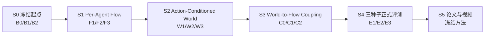

# P1 多机器人 World-Action Flow Matching 技术路线 V2.1（ICRA Fast Track）

> 文档更新：2026-07-28
> 工程起点：当前 `feat/model-improvements` 分支
> 投稿目标：ICRA 2027，[官方 Call for Papers](https://2027.ieee-icra.org/contribute/call-for-icra-2027-papers-now-accepting-submissions/) 截稿时间为 2026-09-15 11:59 PM PST
> 当前状态：M0、M1 已完成；旧 M2 尚未形成可靠闭环结论，不再要求先完整走完旧 M2 才启动论文快线
> 相关长期方案：[Intent-Grounded Decentralized World-Action Models 多机器人协作研究方案](20260724_INTENT_GROUNDED_DECENTRALIZED_WORLD_ACTION_MODELS_MULTI_ROBOT_COLLABORATION_RESEARCH_PLAN_V2.0_ZH.md)

## 1. 本次路线调整的结论

ICRA 截稿临近，后续不再按旧版 M3–M11 的长串行路线推进。当前分支直接作为工程起点，压缩成一条可以在约七周内形成论文闭环的主线：

> 按机器人组织多模态上下文，用 Rectified Flow / Flow Matching 生成每台机器人的动作；再用动作条件的多机器人未来表示显式调制 Flow 速度场，使预测未来真正参与协作动作生成。

本次调整包含四项硬决策：

1. **当前分支就是起点。** 不重写已经验证的数据、DINOv3、按机器人视图、共享解码器、dense/MoE、时间集成、采样、checkpoint 和闭环评测基础。
2. **最终目标是 World Action Model 与 Flow Matching。** 旧的 CVAE 动作分块模型仅保留为历史基线；论文标题、方法名和主张不以 ACT 为目标。
3. **每个关键阶段至少保留三种候选。** 候选从同一父提交、同一数据和同一随机种子启动，允许多卡同时验证；下一阶段只继承通过门槛的前一至两个方案。
4. **暂时舍弃 active-agent loss weighting。** 训练目标不再根据动作幅度、active/inactive 标签或机器人活跃比例调整权重。所有 agent 使用相同损失规则，activity 只允许作为评估诊断，不参与反向传播。

## 2. 论文目标与边界

### 2.1 暂定论文题目

**Agent-Factorized World-Action Flow Matching for Multi-Robot Collaboration**

中文工作名：

**面向多机器人协作的按智能体分解 World-Action Flow Matching**

最终方法类建议命名为 `AgentFactorizedFlowWAM`，避免把旧类名直接改包装后当作新方法。

### 2.2 核心研究问题

论文只回答一个主要问题：

> 动作条件的多机器人未来表示，能否直接调制按机器人分解的 Rectified Flow 速度场，并在真实闭环中改善协作成功率、同步和交接？

目标计算图为：

$$
\hat{\mathbf z}_{t+1:t+H}
=
W_\phi
\left(
\mathbf h_t^{1:N},
\mathbf x_\tau^{1:N},
\tau
\right),
$$

$$
\mathbf v_\theta^i
=
F_\theta
\left(
\mathbf x_\tau^i,
\tau,
\mathbf h_t^i,
\hat{\mathbf z}_{t+1:t+H}
\right),
$$

其中：

- $\mathbf h_t^i$ 是第 $i$ 台机器人的视觉、状态、动作历史和任务上下文；
- $\mathbf x_\tau^i$ 是 Flow 中间状态或候选动作；
- $W_\phi$ 预测动作条件的多机器人未来 latent；
- $F_\theta$ 预测第 $i$ 台机器人的速度场；
- 推理时只能向动作路径输入**预测未来**，不能输入真实未来。

如果未来分支只作为辅助损失、没有回到速度场，它只能叫 `Flow + auxiliary future prediction`，不能作为最终 WAM 主张。

### 2.3 ICRA 快线不做什么

以下内容保留为长期方向，但不进入本次主线：

- 全分辨率视频生成式 world model；
- 任意机器人数量的严格理论泛化；
- 严格去中心化通信协议和真实网络部署；
- 大规模语言意图 grounding；
- 强化学习或在线探索；
- 5B/14B 模型扩展；
- 自建大量新任务或重新采集大规模数据。

本次使用低维、可验证的未来目标：未来 proprioceptive state、未来 DINO latent、物体或团队进度。论文价值来自“world prediction 如何进入 action flow”，不是视频生成规模。

## 3. 当前分支：保留什么，替换什么

### 3.1 直接保留

| 当前能力 | 快线中的位置 |
|---|---|
| RoboFactory 原生数据、状态/动作 mask、多任务 contract | 所有候选共用的数据基础 |
| 冻结 DINOv3 与完整 spatial patch tokens | 视觉上下文与未来视觉 latent 目标 |
| 18D 状态视图、8D 动作槽等按机器人数据视图 | agent factorization 起点 |
| 共享 decoder、dense 与 top-2 MoE 两种实现 | S1 并行结构候选 |
| temporal ensemble 与 latest-chunk 路径 | 统一推理协议及消融 |
| task-balanced sampler | 多任务训练公平性 |
| checkpoint、严格 reload、provenance、Gate20、视频与统计工具 | 实验可复现与晋级门槛 |
| M2 中已有的 Rectified Flow、block-causal 上下文和未来预测代码 | 新 Flow/WAM 的实现参考 |

当前静态候选的初步闭环结果可以证明这条分支适合继续改，但不能直接作为论文结果。已有不同提交间的结果变化还混合了多项改动，正式表格必须从冻结的数据、评测种子和候选父提交重新跑。

### 3.2 必须替换

- CVAE posterior、KL 目标和直接动作 MSE 不再是最终动作生成目标；
- 旧类名及 `static_act` 路径只作为 legacy baseline，不作为新方法命名空间；
- 只预测未来但不影响动作的旁路结构不能作为最终方法；
- 固定拼接整队动作的单头输出要改成按 agent slot 组织、共享参数的 Flow expert；
- 旧 M2 不再因“还没完整跑完”阻塞论文快线。

### 3.3 active-agent loss weighting 决策

从 2026-07-28 起，所有快线训练使用与 activity 无关的损失约定：

$$
\mathcal L_b =
\frac{
\sum_{t,d} m_{btd}\,q_t\,e_{btd}
}{
\sum_{t,d} m_{btd}\,q_t
},
\qquad
\mathcal L = \frac{1}{B}\sum_b \mathcal L_b.
$$

其中 $m$ 只表示有效时间步和有效维度，$q_t$ 只允许表达对所有 agent 一致的 executed-prefix 等时序权重。禁止让 $q$ 依赖动作幅度、active/inactive 判定或 agent 身份。

具体约束：

- 删除训练配置中的 `active_agent_weight`、`active_delta_threshold`、`active_agent_loss_weight` 和 `active_agent_delta_threshold`；
- Flow velocity、部署端点、平滑项、未来状态和 legacy reconstruction loss 均不做 active-agent 重加权；
- 不记录会被误认为训练目标一部分的 `active_agent_fraction` loss metric；
- teacher-context 可继续按 active/inactive 拆分误差，但阈值是独立评估参数，不能读取训练配置；
- ICRA 截稿前不把该机制重新加回主线。若以后重启，必须作为单独、受控且多随机种子的消融。

## 4. 快线总览



各阶段采用“低风险 / 主方案 / 高收益高风险”三卡并行。晋级不是把三项合并，而是选择证据最强且最简单的一至两个方案。

## 5. S0：冻结工程起点与协作任务（07-28 至 08-01）

### 5.1 三个并行参考方案

| 卡 | 方案 | 作用 |
|---|---|---|
| B0 | 当前 sparse MoE legacy chunk policy + temporal ensemble | 当前分支行为参考 |
| B1 | compute-matched dense legacy chunk policy + temporal ensemble | 判断 MoE 是否值得继续 |
| B2 | 现有 M2 Rectified Flow，关闭或旁路旧 future head | Flow 工程参考 |

三卡使用相同数据 manifest、DINO 权重、动作归一化、训练 update、推理频率和 Gate20 初始条件。旧 checkpoint 只用于工程 smoke test；公平比较必须重新训练。

### 5.2 必须并行完成的任务审计

对 LiftBarrier 和 LongPipelineDelivery 至少检查：

- 移除一名成员或令其安全停止；
- 对某一 agent 注入固定动作延迟；
- 各 agent 独立执行、取消协作上下文；
- 可行时交换角色或初始位置。

如果某任务对成员缺失、动作延迟和独立执行都不敏感，它不能支撑“协作”主张。最晚 08-03 从现有 RoboFactory 任务中替换，不在此时开发自建任务。

### 5.3 进入 S1 的门槛

- 数据、agent slot、camera slot、动作解码和 validity mask 全部通过；
- 模型动作覆盖率 100%，无旧策略或手写动作 fallback；
- 至少两个任务能区分完整团队与破坏协作条件；
- B0/B1/B2 的训练、闭环、视频、P50/P95 latency 和失败类型可追溯；
- active-agent loss weighting 已从代码与所有候选配置中移除。

## 6. S1：Per-Agent Rectified Flow Action Expert（08-02 至 08-08）

统一 Flow 目标：

$$
\mathbf x_\tau=(1-\tau)\mathbf x_0+\tau\mathbf a^\star,
\qquad
\mathbf v^\star=\mathbf a^\star-\mathbf x_0,
$$

$$
\mathcal L_{\mathrm{FM}}
=
\operatorname{MaskedMean}
\left[
\left\|
\mathbf v_\theta-\mathbf v^\star
\right\|_2^2
\right].
$$

每个 agent 使用共享参数的 action expert，agent identity、task token 和本地/团队上下文通过显式 token 进入，输出保持按 agent slot 组织。

### 6.1 三个并行候选

| 卡 | 方案 | 主要变量 | 风险 |
|---|---|---|---|
| F1 | Gaussian cold-start Rectified Flow + dense FFN | 最简单、最可解释 | 低 |
| F2 | Gaussian cold-start Rectified Flow + top-2 MoE | 检查稀疏 expert 是否有协作收益 | 中 |
| F3 | previous-chunk warm-start Rectified Flow | 利用控制连续性、减少 solver 步数 | 中高 |

所有方案默认 4-step Euler 做训练后统一评估，同时记录 1-step Euler 和 2-step Heun 作为 latency/quality 消融。temporal ensemble 的开关是推理消融，不与模型候选混在一起。

### 6.2 进入 S2 的门槛

- 直接动作闭环无 NaN、越界或 fallback；
- Gate20 上至少一个 Flow 方案接近当前最佳 legacy baseline，且失败不是系统性动作顺序错误；
- 1-step/4-step solver 的收益与时延清楚；
- F1 与 F2 接近时晋级 F1；MoE 没有稳定收益就从论文主张中删除；
- 最多晋级两个 Flow 方案，S2 主实验固定一个，另一个只作备份。

如果 08-08 前所有 Flow 方案都明显差于当前基线，暂停 world coupling，优先修复 Flow；不能用 future head 掩盖动作生成器尚未成立的问题。

## 7. S2：Agent-Factorized Action-Conditioned World Model（08-09 至 08-15）

本阶段冻结 S1 的 Flow 主干，只比较未来表示怎样组织。world predictor 必须读取当前候选动作或 Flow 中间状态，否则只是 action-independent representation model。

### 7.1 三个并行候选

| 卡 | 方案 | 预测内容 | 假设 |
|---|---|---|---|
| W1 | Local Future WAM | 每个 agent 的未来 state + local DINO latent | 本地动力学已足够 |
| W2 | Masked-Set Joint Future WAM | 所有 agent、共享物体和团队进度的联合 latent | 联合未来有助于协作 |
| W3 | Peer-Conditioned WAM | local future + 有界 peer/team message | 少量协作信息优于完整集中输入 |

三者都使用相同 horizon、latent width、训练更新数和 Flow checkpoint。优先预测 latent，不生成 RGB 视频。

### 7.2 可信度检查

- 相比不读取动作的 predictor，action-conditioned predictor 的未来误差更低；
- 打乱候选动作后未来预测显著变差；
- 打乱 agent 顺序并同步打乱 mask 后满足 permutation equivariance；
- 被 mask 的 agent slot 不改变有效 agent 的输出；
- 真实未来只作为监督目标，永远不进入动作输入；
- 报告 state、visual latent 和 team progress 的分项误差，不能只报告合并 loss。

### 7.3 进入 S3 的门槛

- 至少一个 W 方案同时通过 action shuffle、slot permutation 和 mask invariance；
- W2/W3 必须优于 W1 才能支撑多机器人联合未来主张；
- 最多晋级一个联合方案，并保留 W1 作为 local negative control；
- 若所有方案对 action shuffle 不敏感，停止把它称为 action-conditioned world model，先检查数据动作多样性和网络连接。

## 8. S3：让预测未来真正调制 Flow（08-16 至 08-22）

本阶段只比较 world-to-action 的连接方式，不再改变数据、Flow 主干或 world target。

### 8.1 三个并行候选

| 卡 | 方案 | 连接方式 | 论文角色 |
|---|---|---|---|
| C0 | Auxiliary-only future prediction | future loss 与 Flow 共享 backbone，但 future token 不进入 velocity head | 必需负对照 |
| C1 | Future-conditioned Flow | predicted future tokens 通过 cross-attention 或 gated residual 调制每层 velocity | 主方案 |
| C2 | World-scored Flow proposals | 生成 $K=4$ 个 action chunks，由 world feasibility/progress head 评分选择 | 高风险备选 |

C1 的每个 ODE/Flow step 都执行：

1. 从当前 $\mathbf x_\tau$ 与上下文预测 $\hat{\mathbf z}_{future}$；
2. 将 $\hat{\mathbf z}_{future}$ 接回 velocity network；
3. 更新 $\mathbf x_\tau$。

不能先独立生成一个未来摘要、随后在推理时缓存不变，却声称 world model 在评估候选动作。

### 8.2 防止信息泄漏

- world target 可以使用数据中的真实未来；
- velocity/action path 只能使用模型预测的 future latent；
- world predictor 输入候选动作、当前历史和 task context，不能输入隐藏的真实未来；
- 所有比较使用相同观测、相同数据和相同 DINO；
- C2 的 proposal 数和评分开销必须计入 P95 latency。

### 8.3 因果性与晋级门槛

必须同时报告：

- C1/C2 与 C0 的闭环成功率和团队指标；
- predicted future 正常、置零、跨样本 shuffle 三种动作输出；
- 正确配对 future 与错误配对 future 在协作关键阶段的动作差异；
- world target 误差改善是否与闭环改善一致；
- P50/P95 推理时延和 solver 调用次数。

只有 C1 或 C2 在相同信息条件下优于 C0，且 zero/shuffle future 会在正确阶段改变动作，才能写“world prediction guides action generation”。08-22 冻结最终结构。

若 C2 引入大量工程失败或 P95 latency 不可接受，立即删除；若 C1 与 C0 无闭环差异，论文降级为 per-agent Flow，不强行包装成 WAM。

## 9. S4：正式训练、评测与统计（08-23 至 08-31）

### 9.1 三卡并行方式

冻结模型后，三张卡不再训练三种新结构，而是并行训练同一正式方案的三个随机种子：

| 卡 | 训练随机种子 | 作用 |
|---|---:|---|
| E1 | 101 | 正式复现 1 |
| E2 | 202 | 正式复现 2 |
| E3 | 303 | 正式复现 3 |

若 S3 保留两个候选，先用一个 seed 做 paired Gate20，24 小时内淘汰一个，再启动三种子，避免把最终算力摊薄。

### 9.2 主表

1. 当前分支最佳 legacy per-agent chunk baseline；
2. S1 最佳 Per-Agent Flow；
3. C0：Per-Agent Flow + auxiliary world prediction；
4. C1 或 C2：World-Conditioned Action Flow；
5. centralized joint policy，作为信息上限而不是最终方法。

### 9.3 核心消融

- dense vs top-2 MoE；
- local future vs joint/peer-conditioned future；
- auxiliary-only vs world-to-flow coupling；
- normal vs zero vs shuffled predicted future；
- temporal ensemble on/off；
- 1-step Euler、4-step Euler、2-step Heun。

active-agent loss weighting 不进入主表和消融表。

### 9.4 评测指标

至少覆盖两类协作关系，例如同步搬运与顺序交接。每个任务记录：

- 成功率、完成进度和完成时间；
- 掉落、碰撞、失稳、超时和错误交接；
- agent 参与率、同步时间差和 handoff delay；
- 动作全覆盖率与 fallback 次数；
- P50/P95 推理时延和显存；
- paired initial conditions 下的逐回合结果。

二项成功率报告 Wilson 区间；同一初始条件的模型比较使用 paired test（例如 McNemar）；训练随机种子作为独立重复，不能把所有 rollout 混成一个超大样本。

## 10. 多卡实验纪律

每个结构阶段使用下面的固定流程：

1. 从同一个 winner commit 创建三个 worktree/分支；
2. 只允许改候选卡声明的一个主要变量；
3. 固定数据 manifest、DINO revision、训练更新数、seed、Gate20 初始条件和推理协议；
4. 探索阶段三卡统一使用 seed 101，避免把结构差异和种子差异混在一起；
5. 每卡产出 config、commit、checkpoint hash、训练日志、Gate20 JSON、视频索引和 latency；
6. 根据门槛选择 winner commit，下一阶段重新从 winner fork；
7. 临时 worktree 可以删除，正式 artifact 和失败记录不能删除。

候选命名建议：

```text
s1/f1-flow-dense
s1/f2-flow-moe
s1/f3-flow-warm-start
s2/w1-local-future
s2/w2-joint-future
s2/w3-peer-future
s3/c0-aux-world
s3/c1-future-conditioned-flow
s3/c2-world-scored-proposals
```

## 11. 代码落地顺序

当前分支保留为可运行参考，新主线不要继续堆进 legacy 类：

```text
models/wam_multimodal/
  agent_factorized_flow_wam.py
  action_conditioned_world_model.py
  world_conditioned_flow.py

train/
  agent_factorized_flow_training.py
  world_action_flow_training.py

configs/wam_flow/
  s1_f1_dense.yaml
  s1_f2_moe.yaml
  s1_f3_warm_start.yaml
  s2_w1_local_future.yaml
  s2_w2_joint_future.yaml
  s2_w3_peer_future.yaml
  s3_c0_aux_world.yaml
  s3_c1_future_conditioned_flow.yaml
  s3_c2_world_scored_proposals.yaml
```

实现顺序：

1. 抽取当前 per-agent token、DINO、decoder 和 inference contract；
2. 建立 `AgentFactorizedFlowWAM` 与纯 Flow 单测；
3. 保持相同 rollout API，先替换动作 generator；
4. 再加入独立的 action-conditioned world predictor；
5. 最后加入 future-to-flow coupling；
6. checkpoint schema 显式记录 `action_generator=rectified_flow`、`world_conditioning` 和 solver；
7. legacy checkpoint 只通过 legacy loader 读取，禁止静默加载到新方法。

## 12. 时间表与论文并行

| 日期 | 工程主线 | 论文主线 |
|---|---|---|
| 07-28–08-01 | S0 起点与任务冻结 | 写问题、相关工作、实验协议 |
| 08-02–08-08 | S1 Per-Agent Flow | 写方法 1：agent factorization + Flow |
| 08-09–08-15 | S2 Action-Conditioned World | 写方法 2：world targets 与可信度检查 |
| 08-16–08-22 | S3 World-to-Flow；冻结模型 | 完成方法图和主张草稿 |
| 08-23–08-31 | S4 三种子正式训练与闭环 | 主表、统计脚本、失败分类 |
| 09-01–09-07 | 必要消融与补跑 | 完整初稿、图表和附录 |
| 09-08–09-09 | 只修关键缺口 | 完成 supplementary video |
| 09-10–09-14 | 禁止新增方法 | 压缩到 8 页、内部审稿、最终检查 |
| 09-15 | 只做提交检查 | 提交 |

写作从 S0 同时开始，不能等实验全部结束再写。

## 13. 停止、降级与回退条件

1. **08-03 前任务不体现协作：** 从现有 RoboFactory 任务替换，不开发新环境。
2. **08-08 Flow 明显落后于当前基线：** 停在 S1 修复，暂停 S2/S3。
3. **dense 与 MoE 无稳定差异：** 保留 dense，MoE 只作实现消融。
4. **08-15 world predictor 对 action shuffle 不敏感：** 不宣称 action-conditioned dynamics。
5. **联合未来不优于本地未来：** 论文使用 local future，不宣称 team world representation。
6. **08-22 C1/C2 不优于 C0：** 不能宣称 world prediction 指导动作；降级为 Per-Agent Flow 论文。
7. **C2 过慢或不稳定：** 删除 proposal scoring，不再投入工程时间。
8. **active-agent weighting 看起来可能有效：** 记录为截稿后的待办，不在快线中临时恢复。
9. **正式种子方差过大：** 缩小论文主张，报告完整失败，不用挑种子。

## 14. 从现在开始的执行清单

### 07-28 当天

- 完成 active-agent loss weighting 的代码、配置、日志和测试清理；
- 保留 teacher-context activity split 作为纯诊断；
- 冻结 S0 数据 manifest、DINO revision、Gate20 seeds 和当前分支起点；
- 建立 S1 三个候选配置和统一实验表格；
- 开始写论文问题定义和方法符号。

### 07-29 至 08-01

- 重跑 B0/B1/B2 的最小公平基线；
- 完成两个任务的协作必要性审计；
- 建立 `AgentFactorizedFlowWAM` 最小实现；
- 确认训练、checkpoint、reload、inference 和 rollout 全链路；
- 08-01 晚上冻结 S1 父提交。

### 不可推迟的证据

- World latent 必须对 action 有响应；
- predicted future 必须真实进入 Flow velocity；
- zero/shuffle future 必须在协作关键阶段改变动作；
- 变化必须转化为闭环团队收益；
- 所有结果必须来自相同信息条件、相同数据和可复现实验协议。

满足以上证据，论文主张才是 World-Action Flow Matching；缺少其中任何一环，就按停止条件主动降级，而不是继续增加模块。
