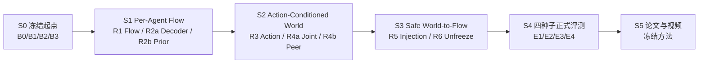
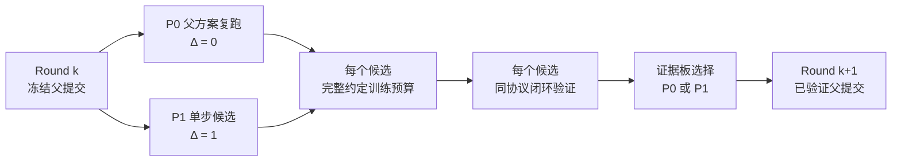

# P1 多机器人 World-Action Flow Matching 技术路线 V2.4（ICRA Fast Track）

> 文档更新：2026-07-28
> 工程起点：当前 `feat/model-improvements` 分支
> 投稿目标：ICRA 2027，[官方 Call for Papers](https://2027.ieee-icra.org/contribute/call-for-icra-2027-papers-now-accepting-submissions/) 截稿时间为 2026-09-15 11:59 PM PST
> 当前状态：M0、M1 已完成；旧 M2 尚未形成可靠闭环结论，不再要求先完整走完旧 M2 才启动论文快线
> 相关长期方案：[Intent-Grounded Decentralized World-Action Models 多机器人协作研究方案](20260724_INTENT_GROUNDED_DECENTRALIZED_WORLD_ACTION_MODELS_MULTI_ROBOT_COLLABORATION_RESEARCH_PLAN_V2.0_ZH.md)

## 1. 本次路线调整的结论

ICRA 截稿临近，后续不再按旧版 M3–M11 的长串行路线推进。当前分支直接作为工程起点，压缩成一条可以在约七周内形成论文闭环的主线：

> 按机器人组织多模态上下文，用 Rectified Flow / Flow Matching 生成每台机器人的动作；再用动作条件的多机器人未来表示显式调制 Flow 速度场，使预测未来真正参与协作动作生成。

本次调整包含五项硬决策：

1. **当前分支就是起点。** 不重写已经验证的数据、DINOv3、按机器人视图、共享解码器、dense/MoE、时间集成、采样、checkpoint 和闭环评测基础。
2. **最终目标是 World Action Model 与 Flow Matching。** 旧的 CVAE 动作分块模型仅保留为历史基线；论文标题、方法名和主张不以 ACT 为目标。
3. **每个候选只做一个单步改进。** 相对冻结父提交，只允许改变一个研究变量、回答一个假设，并能用一个 flag 或一个 commit 完整回退；禁止同时改变数据、表示、损失、模型接口和推理协议中的多个维度。
4. **使用两卡微轮次和远程 GPU 并行闭环。** 一个微轮次固定为 `P0=父方案复跑` 与 `P1=父方案+一个 Δ` 两个候选；两个互不依赖的微轮次可以四卡同时运行。每个候选完成约定训练预算和相同闭环，再选单一 winner；多个正交 winner 必须通过新的两卡组合轮才能成为下一轮父提交。
5. **暂时舍弃 active-agent loss weighting。** 训练目标不再根据动作幅度、active/inactive 标签或机器人活跃比例调整权重。所有 agent 使用相同损失规则，activity 只允许作为评估诊断，不参与反向传播。

## 2. 论文目标与边界

### 2.1 暂定论文题目

**Cross-Agent World-Conditioned Flow Matching for Multi-Robot Collaboration**

中文工作名：

**面向多机器人协作的跨智能体世界条件 Flow Matching**

最终方法类建议命名为 `CrossAgentFlowWAM`。`AgentFactorizedFlowWAM` 可以保留为 S1 纯 Flow 基类，避免把旧类名直接改包装后当作新方法。

### 2.2 核心研究问题

论文只回答一个主要问题：

> 候选联合动作所诱导的跨机器人未来后果，能否直接调制按机器人分解的 Rectified Flow 速度场，并在真实闭环中改善协作成功率、同步和交接？

目标计算图为：

$$
\hat{\mathbf z}_{t+1:t+H}^{1:N,\mathrm{shared}}
=
W_\phi
\left(
\mathbf h_t^{1:N},
\mathbf x_\tau^{1:N},
\tau
\right),
$$

$$
\mathbf v_\theta^i
=
F_\theta
\left(
\mathbf x_\tau^i,
\tau,
\mathbf h_t^i,
\hat{\mathbf z}_{t+1:t+H}^{i},
\hat{\mathbf z}_{t+1:t+H}^{-i,\mathrm{shared}}
\right),
$$

其中：

- $\mathbf h_t^i$ 是第 $i$ 台机器人的视觉、状态、动作历史和任务上下文；
- $\mathbf x_\tau^i$ 是 Flow 中间状态或候选动作；
- $W_\phi$ 根据整队候选动作预测各 agent 与共享对象的联合未来 latent；
- $F_\theta$ 预测第 $i$ 台机器人的速度场，并显式读取自己的未来、其他 agent 的后果和共享对象后果；
- 推理时只能向动作路径输入**预测未来**，不能输入真实未来。

如果未来分支只作为辅助损失、没有回到速度场，它只能叫 `Flow + auxiliary future prediction`，不能作为最终 WAM 主张。

### 2.3 截至 2026-07-28 的新颖性研判

**结论：当前宽泛目标不具备足够新颖性；收紧后的核心目标具有条件性的新颖性，但尚未被实验建立。**

代码现状也支持这一判断：当前 `block_causal_transformer.py` 明确禁止 action query 读取 future query，Flow solver 又以 `include_future=False` 调用 velocity model。因此当前分支实现的是 S0/S1 工程起点和近似 R5-P0 的 `Flow + auxiliary future prediction`，**还没有实现本文拟主张的 cross-agent world-to-flow coupling**。目前能评价的是最终目标的潜在新颖性，不能把现有代码直接称为新方法。

以下组件不能单独作为论文贡献：

| 路线组件 | 最接近工作与碰撞 | 判断 |
|---|---|---|
| Flow Matching 动作生成 | [$\pi_0$](https://arxiv.org/abs/2410.24164) 等已有 Flow action expert | 非新颖基础组件 |
| previous-chunk warm start | [Streaming Flow Policy](https://arxiv.org/abs/2505.21851) 从上一动作附近的窄高斯出发并流式积分 | 只作为工程候选 |
| latent future 进入 action generation | [LaWAM](https://arxiv.org/abs/2606.15768) 已用动作条件 latent world model 预测视觉 subgoal 并条件化动作生成；[AGRA](https://arxiv.org/abs/2606.12217) 已研究 world-action 表示接口并使用因果干预诊断 | 直接碰撞，不能泛称首创 |
| 只在训练期使用未来表示 | [Being-H0.7](https://arxiv.org/abs/2605.00078) 以未来 posterior 对齐部署 prior；[Fast-WAM](https://arxiv.org/abs/2603.16666) 质疑测试时显式未来预测的必要性 | auxiliary future 不足以支撑 WAM 主张 |
| 生成候选并由 world model 评分 | [Cortex 2.0](https://arxiv.org/abs/2604.20246) 在视觉 latent 空间生成、评分并选择候选未来 | 移出 ICRA 主线 |
| 多机器人 Flow 轨迹/动作协同 | [GCo](https://arxiv.org/abs/2511.10874) 已做多机器人接触与轨迹 Flow co-generation；[Flow-Opt](https://arxiv.org/abs/2510.09204) 已做带置换不变编码的集中式多机器人 Flow 轨迹优化 | “multi-robot + Flow” 本身不新颖 |
| action-conditioned multiview world model | [A2World](https://arxiv.org/abs/2606.29501) 已建模动作驱动的多视角场景演化 | 多视角预测不是核心贡献 |

在本轮检索到的最接近工作中，尚未发现与以下完整机制相同的公开方案：

> **对联合候选 action chunk 建模其跨 agent 与共享对象的后果，再将“自己的未来 + peer 后果 + shared-object 后果”逐 Flow step 注入共享参数、按 agent 分解的速度场，并以跨 agent 因果干预证明该耦合改善闭环协作。**

因此论文贡献必须收敛为：

1. **方法贡献：** `joint candidate action → cross-agent future consequences → factorized velocity fields` 的可变 agent-slot 结构，而不是 WAM 或 Flow Matching 的简单组合；
2. **因果证据：** 对 peer action、peer future、agent slot 和共享对象 future 做 zero/shuffle/intervention，证明第 $i$ 个 agent 的动作会因其他 agent 的预测后果而在协作关键阶段改变；
3. **闭环证据：** 在必须同步或交接的任务中，优于 `joint Flow without world`、`local-future WAM` 和 `auxiliary-only future` 三类公平基线，并同时报告 centralized joint policy 信息上限。

新颖性判定使用以下门槛：

- **绿色：** R3 证明 action conditioning 有效；R4 得到可信的 cross-agent future；在相同 gated injection 下，R5 的 cross-agent 方案优于 no-injection 与 local-future 两个对照；peer-action/future 干预产生符合任务阶段的动作变化，并在至少两类协作关系上有稳定收益；
- **黄色：** 只有联合表示或 future loss 有收益，但无法证明跨 agent future 因果进入速度场；可以写成结构/训练分析，不能写强 WAM 贡献；
- **红色：** 最终实现只是把预测 latent 拼到现有 Flow head，或只做多机器人 Flow co-generation、候选评分、训练期辅助预测；与上述近邻高度重叠，不足以作为当前论文主贡献。

投稿前不得使用 “first” 或 “首次”。最晚 08-22 根据实验证据重新做一次近邻检索和 claim audit。

### 2.4 ICRA 快线不做什么

以下内容保留为长期方向，但不进入本次主线：

- 全分辨率视频生成式 world model；
- 任意机器人数量的严格理论泛化；
- 严格去中心化通信协议和真实网络部署；
- 大规模语言意图 grounding；
- 强化学习或在线探索；
- 5B/14B 模型扩展；
- 自建大量新任务或重新采集大规模数据。

本次使用低维、可验证的未来目标：未来 proprioceptive state、未来 DINO latent、物体或团队进度。论文价值来自“world prediction 如何进入 action flow”，不是视频生成规模。

## 3. 当前分支：保留什么，替换什么

### 3.1 直接保留

| 当前能力 | 快线中的位置 |
|---|---|
| RoboFactory 原生数据、状态/动作 mask、多任务 contract | 所有候选共用的数据基础 |
| 冻结 DINOv3 与完整 spatial patch tokens | 视觉上下文与未来视觉 latent 目标 |
| 18D 状态视图、8D 动作槽等按机器人数据视图 | agent factorization 起点 |
| 共享 decoder、dense 与 top-2 MoE 两种实现 | S1 并行结构候选 |
| temporal ensemble 与 latest-chunk 路径 | 统一推理协议及消融 |
| task-balanced sampler | 多任务训练公平性 |
| checkpoint、严格 reload、provenance、Gate20、视频与统计工具 | 实验可复现与晋级门槛 |
| M2 中已有的 Rectified Flow、block-causal 上下文和未来预测代码 | 新 Flow/WAM 的实现参考 |

当前静态候选的初步闭环结果可以证明这条分支适合继续改，但不能直接作为论文结果。已有不同提交间的结果变化还混合了多项改动，正式表格必须从冻结的数据、评测种子和候选父提交重新跑。

### 3.2 必须替换

- CVAE posterior、KL 目标和直接动作 MSE 不再是最终动作生成目标；
- 旧类名及 `static_act` 路径只作为 legacy baseline，不作为新方法命名空间；
- 只预测未来但不影响动作的旁路结构不能作为最终方法；
- 固定拼接整队动作的单头输出要改成按 agent slot 组织、共享参数的 Flow expert；
- 旧 M2 不再因“还没完整跑完”阻塞论文快线。

### 3.3 active-agent loss weighting 决策

从 2026-07-28 起，所有快线训练使用与 activity 无关的损失约定：

$$
\mathcal L_b =
\frac{
\sum_{t,d} m_{btd}\,q_t\,e_{btd}
}{
\sum_{t,d} m_{btd}\,q_t
},
\qquad
\mathcal L = \frac{1}{B}\sum_b \mathcal L_b.
$$

其中 $m$ 只表示有效时间步和有效维度，$q_t$ 只允许表达对所有 agent 一致的 executed-prefix 等时序权重。禁止让 $q$ 依赖动作幅度、active/inactive 判定或 agent 身份。

具体约束：

- 删除训练配置中的 `active_agent_weight`、`active_delta_threshold`、`active_agent_loss_weight` 和 `active_agent_delta_threshold`；
- Flow velocity、部署端点、平滑项、未来状态和 legacy reconstruction loss 均不做 active-agent 重加权；
- 不记录会被误认为训练目标一部分的 `active_agent_fraction` loss metric；
- teacher-context 可继续按 active/inactive 拆分误差，但阈值是独立评估参数，不能读取训练配置；
- ICRA 截稿前不把该机制重新加回主线。若以后重启，必须作为单独、受控且多随机种子的消融。

## 4. 快线总览



S0 是起点审计，不计作结构改进。S1–S3 由若干“两卡单变量微轮次”组成：



两个独立微轮次可以占用四张卡并行。例如：

```text
卡 0/1：P vs P + Δdecoder
卡 2/3：P vs P + Δsource_prior
```

如果 $\Delta_{\mathrm{decoder}}$ 与 $\Delta_{\mathrm{source\_prior}}$ 都胜出，再单独启动两卡组合轮：`M0=较强单项` 对 `M1=P+两个已验证 Δ`。组合通过闭环后才能进入下一阶段。

“单步改进”必须同时满足：

1. 只回答一个研究假设；
2. 只改变一个配置轴或一条模型接口；
3. 数据、seed、训练预算、闭环协议和其他模型路径不变；
4. 可以通过一个 flag 或一个 commit 完整回退；
5. 失败后能明确归因到该 Δ，而不是多个改动的交互。

唯一例外是 R1 的 `legacy action generator → cold-start Rectified Flow`。head、FM loss 和 ODE solver 必须作为一个可运行的原子垂直切片共同替换，但其研究变量只有 `action_generator`；上下文、decoder、数据、action chunk、ensemble 和评测协议全部保持不变。

所有微轮次仍遵守：

- 候选数为 2；两个微轮次并行时总候选数为 4，不使用三卡池；
- 有可训练参数的对照/改进候选完成相同训练更新数；冻结或 no-injection P0 可以复用 manifest 指定的 immutable parent checkpoint，但所有候选都必须完成相同闭环；
- 本地只做单测、数据检查和最小 rollout smoke test，正式训练与闭环在远程 GPU 上完成；
- 下一轮只继承通过闭环的单一 winner 或 verified merge commit。

## 5. S0：冻结工程起点与协作任务（07-28 至 08-01）

### 5.1 四个并行参考方案

| 卡 | 方案 | 作用 |
|---|---|---|
| B0 | 当前 sparse MoE legacy chunk policy + temporal ensemble | 当前分支行为参考 |
| B1 | compute-matched dense legacy chunk policy + temporal ensemble | 判断 MoE 是否值得继续 |
| B2 | 现有 M2 Rectified Flow，关闭或旁路旧 future head | Flow 工程参考 |
| B3 | 当前 sparse MoE legacy chunk policy + latest chunk | 隔离 temporal ensemble 的实际贡献 |

四卡使用相同数据 manifest、DINO 权重、动作归一化、训练 update、推理频率和 Gate20 初始条件。B0 与 B3 允许复用同一公平训练 checkpoint，因为二者只改变推理聚合；其他结构不得复用 checkpoint。旧 checkpoint 只用于工程 smoke test。

S0 只建立参考坐标，不产生结构 winner：B1/B3 分别诊断 decoder 与推理聚合，B2 是旧 M2 工程参考而不是可直接晋级的“改进分支”。正式的 Flow 改进必须在 R1 中从冻结父提交以原子垂直切片重新实现和验证。

### 5.2 必须并行完成的任务审计

对 LiftBarrier 和 LongPipelineDelivery 至少检查：

- 移除一名成员或令其安全停止；
- 对某一 agent 注入固定动作延迟；
- 各 agent 独立执行、取消协作上下文；
- 可行时交换角色或初始位置。

如果某任务对成员缺失、动作延迟和独立执行都不敏感，它不能支撑“协作”主张。最晚 08-03 从现有 RoboFactory 任务中替换，不在此时开发自建任务。

### 5.3 进入 S1 的门槛

- 数据、agent slot、camera slot、动作解码和 validity mask 全部通过；
- 模型动作覆盖率 100%，无旧策略或手写动作 fallback；
- 至少两个任务能区分完整团队与破坏协作条件；
- B0/B1/B2/B3 的训练、闭环、视频、P50/P95 latency 和失败类型可追溯；
- active-agent loss weighting 已从代码与所有候选配置中移除。

## 6. S1：Per-Agent Rectified Flow Action Expert（08-02 至 08-08）

统一 Flow 目标：

$$
\mathbf x_\tau=(1-\tau)\mathbf x_0+\tau\mathbf a^\star,
\qquad
\mathbf v^\star=\mathbf a^\star-\mathbf x_0,
$$

$$
\mathcal L_{\mathrm{FM}}
=
\operatorname{MaskedMean}
\left[
\left\|
\mathbf v_\theta-\mathbf v^\star
\right\|_2^2
\right].
$$

每个 agent 使用共享参数的 action expert，agent identity、task token 和本地/团队上下文通过显式 token 进入，输出保持按 agent slot 组织。

### 6.1 R1：只替换动作生成器（必做，两卡）

| 候选 | 相对父提交的唯一变量 | 固定不变 |
|---|---|---|
| R1-F0 | `action_generator=legacy_cvae`，父方案复跑 | 数据、context、当前 decoder、chunk、ensemble、训练预算 |
| R1-F1 | `action_generator=rectified_flow_cold` | 与 F0 相同 |

F1 的 head、FM loss 和 ODE solver 作为一个原子垂直切片共同实现；不得同时把 MoE 改成 dense、加入 warm start、改变 temporal ensemble 或接入 future latent。默认使用 4-step Euler，1-step Euler 与 2-step Heun 延后为冻结 checkpoint 上的推理消融。

R1 通过条件：

- F1 直接动作闭环无 NaN、越界或 fallback；
- F0/F1 完成相同更新数、seed 101 和 paired Gate20；
- F1 接近或优于当前最佳 legacy baseline，且失败不是系统性动作顺序错误；
- 若 F1 未通过，本阶段只修复这一个原子切片，不启动 R2、S2 或 S3。

### 6.2 R2a/R2b：两个可选单变量微轮次（可四卡并行）

R1-F1 通过后冻结为父提交 `P_flow`。以下两对候选可以同时租用四张卡：

| 微轮次 | P0 控制 | P1 单步改进 | 唯一变量 |
|---|---|---|---|
| R2a Decoder | 当前 `P_flow` decoder | 仅切换 `top-2 MoE ↔ dense FFN` | decoder family |
| R2b Source prior | Gaussian cold start | previous-chunk warm start | Flow source distribution |

R2a 不改变 source prior；R2b 不改变 decoder。两轮各自独立完成训练与 paired Gate20：

- dense 与 MoE 接近时选择 dense；
- warm 与 cold 接近时选择 cold；
- 没有稳定收益的变量从论文主张中删除；
- 如果 R2a 与 R2b 的 P1 都胜出，新建 R2m 两卡组合轮，以较强单项为 M0、`decoder winner + warm start` 为 M1；禁止直接把两个分支当成已验证组合。

### 6.3 进入 S2 的门槛

- R1-F1 已通过完整训练、checkpoint reload 和 paired Gate20；
- R2a/R2b/R2m 如运行，均有独立闭环结果；未完成的可选轮次不得阻塞主路径；
- 选出的 Flow 父提交只包含已经单独验证或经过组合复验的 Δ；
- solver 步数和 temporal ensemble 仍作为冻结模型上的推理消融，不混入结构 winner。

如果 08-08 前 R1-F1 仍明显差于当前基线，暂停 world coupling，优先修复 Flow；不能用 future head 掩盖动作生成器尚未成立的问题。

## 7. S2：Agent-Factorized Action-Conditioned World Model（08-09 至 08-15）

本阶段冻结 S1 的 Flow 主干，future predictor 保持在动作路径之外。先只验证“是否读取候选动作”，再只改变“未来表示覆盖范围”。S2 的闭环用于证明增加 predictor 没有破坏基础能力；world-to-action 收益统一留到 S3，不能在 off-path 阶段提前声称。

### 7.1 工程脚手架：Local Future Predictor

在冻结的 Flow 旁路建立相同 horizon、latent width 和 target 的 local future predictor，优先预测 future proprioceptive state 与 DINO latent，不生成 RGB。脚手架预先分配固定的最大 agent/shared slots、统一 masked-set 接口和 action adapter；local 模式只用 mask 关闭 peer/shared slots。脚手架本身不是候选改进，不进入 action velocity；完成单测、target 对齐和 checkpoint reload 后才能启动 R3。

### 7.2 R3：只增加 action conditioning（必做，两卡）

| 候选 | Predictor 输入 | Future target | 唯一变量 |
|---|---|---|---|
| R3-W0 | 当前 context；action adapter 输入置零并 mask | local state + local DINO latent | 无候选动作信息 |
| R3-W1 | 当前 context + $\mathbf x_\tau^i$ | 与 W0 完全相同 | `action_conditioning=on` |

W0/W1 使用相同 action adapter，因此 Flow、target、horizon、width、参数量、训练更新和评测协议相同。只有 W1 能稳定满足以下条件，才冻结为下一轮父提交：

- 相比 W0，公共 future target 的 held-out error 更低；
- 打乱候选动作后预测显著变差；
- 真实未来只作为监督目标，永远不进入 predictor 输入；
- W0/W1 都完成 paired Gate20，且基础动作能力没有退化。

如果 W1 对 action shuffle 不敏感，停止把它称为 action-conditioned world model，不启动 R4。

### 7.3 R4a/R4b：只扩展 future scope（四卡并行）

从 R3-W1 分别启动两个两卡微轮次：

| 微轮次 | P0 控制 | P1 单步改进 | 唯一变量 |
|---|---|---|---|
| R4a Joint | `future_scope=local` | `future_scope=all_agents+shared` | slot scope mask |
| R4b Peer | `future_scope=local` | `future_scope=bounded_peers` | slot scope mask |

两轮复用脚手架中相同的 masked-set aggregator、最大 slots 和参数量，只改变哪些 peer/shared slots 可见及受监督；action conditioning、Flow、target horizon、latent width、训练预算保持不变。每个候选都完成闭环能力保持验证，并检查：

- peer action shuffle 是否显著改变 peer/shared future，而 own action 不变；
- 同步打乱 agent slot 与 mask 后是否满足 permutation equivariance；
- masked agent slot 是否不改变有效 agent 输出；
- state、visual latent、peer/shared progress 分项误差是否可追溯；
- latency 与显存是否在预算内。

R4a 与 R4b 属于同一设计轴的互斥表示方案，选择一个作为 cross-agent parent，不直接合并。R3-W1 必须保留为 local-future negative control，S3 将在相同注入接口下比较 local 与 cross-agent。

### 7.4 进入 S3 的门槛

- R3-W1 通过 action shuffle 与能力保持门槛；
- 至少一个 R4a/R4b 的 P1 通过 peer-action、slot permutation 和 mask invariance；
- R3、R4 的所有候选均完成各自完整训练和 paired Gate20；
- 冻结一个 local parent 与一个 cross-agent parent，二者除 future scope 外使用相同 Flow 和 world-model 接口；
- 若 R4a/R4b 都不能形成可信 cross-agent future，Cross-Agent 核心路线停止，不能直接跳到注入阶段。

## 8. S3：让预测未来真正调制 Flow（08-16 至 08-22）

本阶段固定数据、Flow、world target 和 future representation，先只增加一个可关闭的 world-to-flow 接口。注入必须是基础 Flow 的受控残差，而不是替换原有动作路径：

$$
\mathbf v_{\mathrm{new}}^i
=
\mathbf v_{\mathrm{base}}^i
+
g^i
\Delta \mathbf v^i
\left(
\mathbf h_t^i,
\hat{\mathbf z}_{\mathrm{own}},
\hat{\mathbf z}_{\mathrm{peer}},
\hat{\mathbf z}_{\mathrm{shared}}
\right),
\qquad
g_{\mathrm{init}}=0.
$$

实现时使用有界 gate，例如 $g=g_{\max}\tanh(\alpha)$ 且 $\alpha_{\mathrm{init}}=0$；future 无效或全部被 mask 时强制 $g=0$。`gate=0` 时必须退化为冻结的 S1 Flow。第一版不允许用直接 cross-attention 覆盖所有 action layers，不做 proposal scoring 或 energy guidance；这些高跨度方案移到 ICRA 后。

### 8.1 R5L/R5J：只增加 gated residual injection（四卡并行）

使用 S2 冻结的 local parent 与 cross-agent parent，各启动一个两卡微轮次：

| 微轮次 | P0 控制 | P1 单步改进 | 固定范围 |
|---|---|---|---|
| R5L Local | local future auxiliary-only，不进入 velocity | 加入 residual adapter，并将 gate 初始化为 0 | Flow 与 world predictor 均冻结 |
| R5J Cross-Agent | cross-agent future auxiliary-only，不进入 velocity | 加入同构 residual adapter，并将 gate 初始化为 0 | Flow 与 world predictor 均冻结 |

P1 只训练 adapter 与 gate。两组使用相同 adapter 宽度、初始化、优化器、训练更新、solver 和闭环协议，因此 `R5J-P1 vs R5L-P1` 只反映 future scope，`P1 vs P0` 只反映 injection。

每个 solver step 必须重新执行：

1. 从当前 $\mathbf x_\tau^{1:N}$ 与上下文预测 future latent；
2. 计算 gated residual correction；
3. 更新 $\mathbf x_\tau$。

不能缓存一个与 $\mathbf x_\tau$ 无关的 future summary，却声称 world model 正在评估候选动作。

### 8.2 能力保持硬门槛

能力保持是硬门槛，不能用协作任务收益抵消明显的基础能力损失：

- `gate=0` 的 velocity 与 S1 frozen Flow 在数值容差内一致；
- 非协作或弱协作任务不显著退化；
- future zero/noise 时安全退化到接近基础 Flow，而不是出现 NaN、越界或系统性失败；
- 报告 $\lVert g\Delta v\rVert/\lVert v_{\mathrm{base}}\rVert$、gate 分布、solver 稳定性和 P50/P95 latency；
- masked/缺失 peer 不得破坏有效 agent 的动作；
- 模型动作覆盖率保持 100%，无 fallback。

### 8.3 防止信息泄漏与因果检查

- world target 可以使用数据中的真实未来；
- velocity/action path 只能使用模型预测的 future latent；
- world predictor 输入候选动作、当前历史和 task context，不能输入隐藏真实未来；
- 正常、置零、跨样本 shuffle、队内 agent shuffle future 必须分别评测；
- own context/future 不变时，单独 zero/shuffle peer action 与 peer future；
- 正确配对 future 与错误配对 future 的动作差异应集中在协作关键阶段；
- 必须同时比较 R5J-P1、R5J-P0 和 R5L-P1 的闭环成功率与团队指标。

只有 R5J-P1 同时优于 cross-agent no-injection 控制与 local gated-injection 控制，且 peer intervention 产生符合任务阶段的动作变化，才能写“cross-agent world prediction guides action generation”。

### 8.4 R6a/R6b：逐模块解冻（可选，四卡并行）

R5J-P1 通过后，将其冻结为 `P_inject`，再运行两个独立微轮次：

| 微轮次 | P0 控制 | P1 单步改进 | 唯一变量 |
|---|---|---|---|
| R6a World adaptation | world predictor 冻结 | 仅以小学习率解冻 world predictor | world gradient scope |
| R6b Flow adaptation | Flow 冻结 | 仅以小学习率解冻 Flow | Flow gradient scope |

两轮都保留同一 gated residual。若两个 P1 都胜出，必须以“较强单项 vs 同时解冻 world+Flow”启动新的 R6m 两卡组合轮。若没有稳定收益，最终方法停在更安全的 R5J-P1。

### 8.5 R7：Future dropout（可选，两卡）

只有 R5/R6 已冻结且仍有时间时，比较 `future_dropout=off` 与 `future_dropout=on`。除了训练时随机 zero/drop predicted future 外不改变任何变量；正常、zero/noise future 的闭环结果必须分别报告。R7 不得阻塞 08-22 冻结方法。

若 R5J-P1 不能通过能力保持门槛或不优于两个必要对照，路线降级为 per-agent Flow 工程结果，不强行包装成 WAM 论文。

## 9. S4：正式训练、评测与统计（08-23 至 08-31）

### 9.1 四卡并行方式

冻结模型后，四张卡不再训练新结构，而是并行训练同一正式方案的四个随机种子：

| 卡 | 训练随机种子 | 作用 |
|---|---:|---|
| E1 | 101 | 正式复现 1 |
| E2 | 202 | 正式复现 2 |
| E3 | 303 | 正式复现 3 |
| E4 | 404 | 正式复现 4 |

S4 启动前必须只有一个冻结的最终代码/config 提交。如果 S3 选择了多个互补 winner，先完成组合分支的重新训练和完整闭环；组合失败就回退到闭环证据最强的单一 winner。随后四张卡只用于同一最终方案的四个正式种子，不再继续结构搜索。

### 9.2 主表

1. 当前分支最佳 legacy per-agent chunk baseline；
2. R1/R2 冻结的 Per-Agent Flow；
3. Joint/team-context Flow without world prediction，隔离“多机器人联合建模”本身；
4. R5J-P0：Cross-agent auxiliary world prediction，不注入 velocity；
5. R5L-P1：Local-future gated residual injection，隔离单机器人 latent WAM；
6. R5J-P1 或 R6/R7 verified winner：Cross-Agent World-Conditioned Action Flow；
7. centralized joint policy，作为信息上限而不是最终方法。

### 9.3 核心消融

- dense vs top-2 MoE；
- local future vs joint/peer-conditioned future；
- joint/team-context Flow without world vs cross-agent world-conditioned Flow；
- auxiliary-only vs world-to-flow coupling；
- zero-init gate 的 residual injection：`gate=0` 等价性与 correction norm；
- frozen base vs 仅解冻 world vs 仅解冻 Flow；
- normal vs zero vs shuffled predicted future；
- own action/future 不变时，normal vs zero/shuffled peer action 和 peer future；
- temporal ensemble on/off；
- 1-step Euler、4-step Euler、2-step Heun。

active-agent loss weighting 不进入主表和消融表。

### 9.4 评测指标

至少覆盖两类协作关系，例如同步搬运与顺序交接。每个任务记录：

- 成功率、完成进度和完成时间；
- 掉落、碰撞、失稳、超时和错误交接；
- agent 参与率、同步时间差和 handoff delay；
- 动作全覆盖率与 fallback 次数；
- P50/P95 推理时延和显存；
- paired initial conditions 下的逐回合结果。

二项成功率报告 Wilson 区间；同一初始条件的模型比较使用 paired test（例如 McNemar）；训练随机种子作为独立重复，不能把所有 rollout 混成一个超大样本。

## 10. 远程 GPU 多分支闭环迭代协议

### 10.1 Round 定义

每个结构阶段可以包含一轮或多轮实验。一个微轮次固定包含两个候选：`P0=父方案复跑`、`P1=父方案+一个 Δ`。两个独立微轮次可以并行，但各自单独选 winner。每轮建立一份不可修改的 `round manifest`，至少包含：

- `round_id`、父提交 hash、P0/P1 分支、P1 唯一的 Δ 和对应单一假设；
- 数据 manifest、DINO revision/hash、动作归一化统计和容器镜像 digest；
- GPU 型号/数量、CUDA/PyTorch 版本、训练更新数、batch/token 数、seed；
- 闭环任务、初始条件、控制频率、solver、action chunk/ensemble 协议和 Gate20 seeds；
- 预先写明的硬门槛、主指标、次指标、选择规则和最大 GPU-hour/租赁费用；
- 该轮允许的组合关系：`exclusive`、`orthogonal` 或 `unknown`。

candidate card 必须声明 `changed_axis`、`unchanged_axes` 和 `rollback_flag/commit`。P1 只允许修改声明的一个变量；若运行中发现必须改第二个变量，该候选关闭并以新 ID 重启，不能覆盖原结果。R1 的 action-generator 原子垂直切片是唯一预先批准的例外，其 head/loss/solver 必须列成一个不可拆的 `action_generator` package。

### 10.2 远程租卡与可复现环境

1. 每个微轮次从同一个父提交创建 P0/P1 两个本地 worktree/分支；并行两个微轮次时共四个分支；
2. 每个候选构建或拉取同一个容器镜像，上传 config 和只读数据引用；
3. 尽量在同一 GPU 型号上比较同一轮候选；显存容量不同可以接受，但质量比较固定 optimizer update/token 数，不能只对齐 wall-clock；
4. P50/P95 latency 只能在同一 GPU 型号、相同 precision、batch 和 solver 下比较；
5. 租赁实例可以释放，但释放前必须同步 checkpoint、日志、环境快照、闭环 JSON 和视频；
6. GPU 故障、抢占、OOM、数据损坏和人工中止都作为失败状态记录，不允许无记录地重跑到成功。

每个远程 run 的 provenance 至少记录：

```text
provider / instance_id / gpu_model / gpu_count
container_digest / cuda / torch
git_commit / config_hash / dataset_hash / dino_hash
seed / optimizer_updates / checkpoint_hash
train_log / closed_loop_json / video_index
gpu_hours / estimated_cost / exit_status
```

### 10.3 每个候选都必须闭环

候选流程统一为：

1. 本地或低成本实例完成 unit test、checkpoint reload 和 1–2 episode smoke test；
2. 有可训练参数时，远程完成 round manifest 约定的全部训练更新；immutable P0 明确记录 `optimizer_updates=0`；
3. 使用冻结 checkpoint 跑完全相同的 paired Gate20；
4. 输出成功率、任务进度、团队指标、失败分类、动作覆盖率、P50/P95 latency 和视频；
5. 只有闭环产物齐全的候选才能进入选择表。

纯推理协议候选或冻结/no-injection P0 可以复用 manifest 指定的公平 checkpoint（例如 B0/B3、R5-P0），但必须分别完成完整闭环，并把共享 checkpoint hash 写入 manifest。所有改变训练图、模型参数或损失的 P1 都必须独立训练。

训练 loss、future prediction error、单个成功视频和部分预算曲线只能用于诊断，不能替代闭环，也不能成为提前淘汰某一候选的唯一依据。若成本迫使训练预算缩短，必须对该 round 的**所有**候选同步缩短并仍完成闭环。

### 10.4 选择一个或多个 winner

先应用硬门槛：

- 训练和推理数值稳定；
- 模型动作覆盖率 100%，无 fallback；
- 全部指定任务和初始条件完成；
- checkpoint/reload/provenance 可复现；
- latency、显存和租赁成本不超过 round manifest 上限。

通过硬门槛后，不使用一个可临时调权的黑盒总分。按以下顺序选择：

1. paired 闭环成功率与任务进度；
2. 同步、交接、掉落/碰撞等团队与失败指标；
3. P95 latency、显存、GPU-hour 和实现复杂度；
4. 指标接近时选择结构更简单、推理更快的方案。

每个微轮次只选择 P0 或 P1。只有两个并行微轮次的 P1 分别胜出，且改动属于不同模块、改善不同且预先定义的失败模式、没有接口冲突时，才允许进入组合验证。处于同一设计轴的 alternatives（例如 dense vs MoE、Joint Future vs Bounded Peer Future）默认互斥。

### 10.5 多分支组合不是直接 Git 合并

选择多个 winner 后，先建立兼容性表，再创建新的 merge candidate：

| 证据 | A | B | A+B |
|---|---:|---:|---:|
| 相同父提交与数据 | 必需 | 必需 | 必需 |
| 单项完整训练 + 闭环 | 必需 | 必需 | 重新执行 |
| 主要收益对应预定义失败模式 | 必需 | 必需 | 两类收益均需保留 |
| 新系统性失败 | 无 | 无 | 必须无 |
| P95 latency/成本 | 可接受 | 可接受 | 必须可接受 |

`A+B` 必须拥有新的 config、commit、checkpoint 和闭环结果。只有当其主指标优于 `max(A, B)` 或在预先定义的 Pareto 指标上同时保留 A、B 的互补收益时，才成为 `verified merge commit`。否则回退到证据最强的单一 winner。严禁：

- 直接平均或拼接不同模型权重；
- 先合并代码、发现结果好后再补写假设；
- 从不同父提交挑模块造成不可归因的“超级分支”；
- 让下一阶段继承一个没有独立闭环结果的 merge commit。

### 10.6 分支与产物命名

候选命名建议：

```text
round/s0-b0-legacy-moe-ensemble
round/s0-b1-legacy-dense-ensemble
round/s0-b2-flow-reference
round/s0-b3-legacy-moe-latest
s1/r1-f0-legacy
s1/r1-f1-flow-cold
s1/r2a-p0-decoder-current
s1/r2a-p1-decoder-alternative
s1/r2b-p0-cold
s1/r2b-p1-warm
s1/r2m-verified-merge
s2/r3-w0-action-independent-local
s2/r3-w1-action-conditioned-local
s2/r4a-p0-local
s2/r4a-p1-joint
s2/r4b-p0-local
s2/r4b-p1-bounded-peer
s3/r5l-p0-local-aux
s3/r5l-p1-local-gated
s3/r5j-p0-cross-agent-aux
s3/r5j-p1-cross-agent-gated
s3/r6a-p1-unfreeze-world
s3/r6b-p1-unfreeze-flow
s3/r6m-verified-merge
s3/r7-p1-future-dropout
```

每轮保留 parent、winner、verified merge 的 Git tag/commit 和完整证据板。临时 worktree 和租赁实例可以删除；正式 checkpoint、配置、失败记录、评测 JSON、视频索引和费用记录不能删除。

## 11. 代码落地顺序

当前分支保留为可运行参考，新主线不要继续堆进 legacy 类：

```text
models/wam_multimodal/
  agent_factorized_flow_wam.py
  action_conditioned_world_model.py
  cross_agent_world_conditioned_flow.py

train/
  agent_factorized_flow_training.py
  world_action_flow_training.py

experiments/wam_flow/
  round_manifest.schema.yaml
  candidate_card.schema.yaml
  evidence_board.schema.yaml

configs/wam_flow/
  s1_r1_f0_legacy.yaml
  s1_r1_f1_flow_cold.yaml
  s1_r2a_decoder_current.yaml
  s1_r2a_decoder_alternative.yaml
  s1_r2b_cold.yaml
  s1_r2b_warm.yaml
  s1_r2m_verified_merge.yaml
  s2_r3_action_independent_local.yaml
  s2_r3_action_conditioned_local.yaml
  s2_r4a_joint_future.yaml
  s2_r4b_bounded_peer_future.yaml
  s3_r5l_local_aux.yaml
  s3_r5l_local_gated.yaml
  s3_r5j_cross_agent_aux.yaml
  s3_r5j_cross_agent_gated.yaml
  s3_r6a_unfreeze_world.yaml
  s3_r6b_unfreeze_flow.yaml
  s3_r6m_unfreeze_world_flow.yaml
  s3_r7_future_dropout.yaml
```

实现顺序：

1. 抽取当前 per-agent token、DINO、decoder 和 inference contract；
2. 完成 R1 原子垂直切片：保持 rollout API 与其他路径不变，只把 action generator 替换为 cold-start Rectified Flow；
3. R1 通过后，R2a 只切换 decoder、R2b 只切换 source prior；
4. 建立 off-path local future predictor，R3 只增加 candidate-action 输入；
5. R3 通过后，R4a/R4b 只扩展 future scope，冻结 local 与 cross-agent 两个 parent；
6. 建立 `CrossAgentFlowWAM` residual adapter，并只将 gate 初始化为 0；R5 只训练 adapter/gate，Flow 与 world predictor 冻结；
7. R5 通过后才允许 R6 分别解冻 world predictor 或 Flow；future dropout 单独放在 R7；
8. checkpoint schema 显式记录 `action_generator`、`future_scope`、`injection`、`trainable_modules`、gate 和 solver；
9. 加入 peer-action/future zero/shuffle intervention 和 joint-Flow-without-world baseline；
10. legacy checkpoint 只通过 legacy loader 读取，禁止静默加载到新方法。

## 12. 时间表与论文并行

| 日期 | 工程主线 | 论文主线 |
|---|---|---|
| 07-28–08-01 | S0 起点/任务冻结；远程 round 基础设施 | 写问题、近邻碰撞图、实验协议 |
| 08-02–08-05 | S1 R1：legacy vs cold Flow 两卡完整闭环 | 写方法 1：agent factorization + Flow |
| 08-06–08-08 | S1 R2a/R2b 可选微轮次四卡并行；必要时 R2m | Flow 工程消融 |
| 08-09–08-11 | S2 R3：action-independent vs action-conditioned local future | 写方法 2：action-conditioned latent dynamics |
| 08-12–08-15 | S2 R4a/R4b：joint 与 bounded-peer 两个微轮次并行 | 写 cross-agent future 与可信度检查 |
| 08-16–08-19 | S3 R5L/R5J：local/cross-agent 安全注入四卡并行 | 完成方法图、能力保持和因果干预 |
| 08-20–08-22 | S3 R6 可选逐模块解冻；R7 不得阻塞；冻结模型 | 完成主张 audit |
| 08-23–08-31 | S4 四种子正式训练与闭环 | 主表、统计脚本、失败分类 |
| 09-01–09-07 | 必要消融与补跑 | 完整初稿、图表和附录 |
| 09-08–09-09 | 只修关键缺口 | 完成 supplementary video |
| 09-10–09-14 | 禁止新增方法 | 压缩到 8 页、内部审稿、最终检查 |
| 09-15 | 只做提交检查 | 提交 |

写作从 S0 同时开始，不能等实验全部结束再写。

## 13. 停止、降级与回退条件

1. **08-03 前任务不体现协作：** 从现有 RoboFactory 任务替换，不开发新环境。
2. **R1 Flow 明显落后于当前基线：** 只修复 action-generator 原子切片，暂停 R2/S2/S3。
3. **R2a dense 与 MoE 无稳定差异：** 选择 dense；R2b warm 与 cold 无差异时选择 cold。可选轮次不得拖住主路径。
4. **R3-W1 对 action shuffle 不敏感：** 不宣称 action-conditioned dynamics，不启动 R4。
5. **R4a/R4b 都不能形成可信 cross-agent future：** Cross-Agent 核心主张失败；local future 只保留为工程方案和消融。
6. **R5 的 `gate=0` 不能复现基础 Flow，或正常注入破坏非协作能力：** 立即回退 adapter，不允许靠协作收益抵消能力退化。
7. **R5J-P1 不优于 R5J-P0 与 R5L-P1：** 不能宣称 cross-agent world prediction 指导动作；Per-Agent Flow 只能作为工程结果，不能自动包装成 ICRA 主贡献。
8. **R6 解冻没有稳定收益或造成遗忘：** 保留冻结 Flow/world 的 R5J-P1；R7 来不及时直接删除。
9. **active-agent weighting 看起来可能有效：** 记录为截稿后的待办，不在快线中临时恢复。
10. **正式种子方差过大：** 缩小论文主张，报告完整失败，不用挑种子。
11. **多 winner 组合不优于最佳单项：** 放弃 merge candidate，下一轮从最佳单一 winner 启动。
12. **peer intervention 不改变动作或只造成无意义扰动：** 不宣称 cross-agent future causal coupling。
13. **任何候选运行中需要第二个未声明变量：** 关闭该候选并创建新 round，禁止在原 ID 上继续补丁。
14. **08-22 新近论文与完整机制直接重合：** 立即收缩 claim 到仍有证据支持的差异，不能依靠换名规避。

## 14. 从现在开始的执行清单

### 07-28 当天

- 完成 active-agent loss weighting 的代码、配置、日志和测试清理；
- 保留 teacher-context activity split 作为纯诊断；
- 冻结 S0 数据 manifest、DINO revision、Gate20 seeds 和当前分支起点；
- 建立 R1-F0/F1 两个候选配置，明确 `changed_axis=action_generator`；
- 为 R2a/R2b 分别建立 P0/P1 candidate card，不创建 2×2 组合配置；
- 建立 `round manifest`、candidate card、远程镜像 digest 和 artifact 回传目录；
- 开始写论文问题定义和方法符号。

### 07-29 至 08-01

- 在远程 GPU 并行重跑 B0/B1/B2/B3 的公平训练与完整闭环；
- 完成两个任务的协作必要性审计；
- 建立只替换 action-generator package 的 `AgentFactorizedFlowWAM` 最小实现；
- 确认训练、checkpoint、reload、inference 和 rollout 全链路；
- 生成 S0 evidence board，冻结 R1 父提交；
- 08-01 晚上冻结 S1 父提交。

### 不可推迟的证据

- World latent 必须对 action 有响应；
- predicted future 必须真实进入 Flow velocity；
- own context 不变时，peer action/future 的 zero/shuffle 必须在协作关键阶段改变动作；
- 变化必须转化为闭环团队收益；
- 每个 P1 必须只有一个 `changed_axis`，且有明确 rollback flag/commit；
- 所有候选和所有 merge candidate 都必须有自己的完整闭环结果；
- 所有结果必须来自相同信息条件、相同数据和可复现实验协议。

满足以上证据，论文主张才是 Cross-Agent World-Conditioned Flow Matching；缺少其中任何一环，就按停止条件主动降级，而不是继续增加模块。
