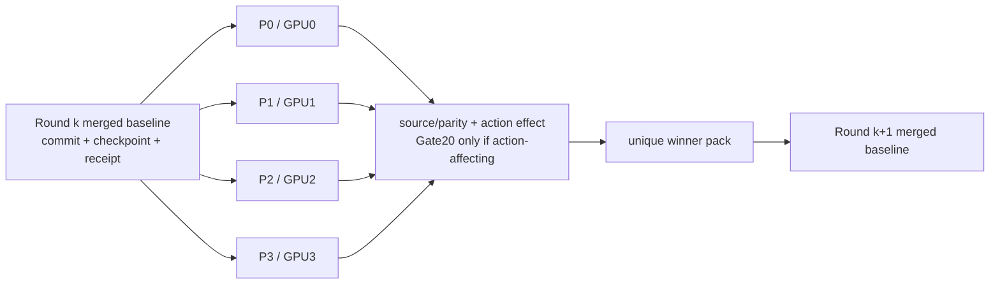
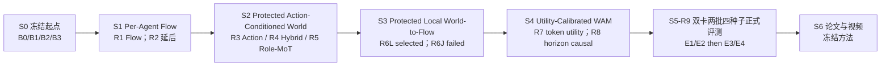
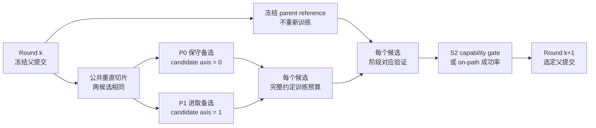
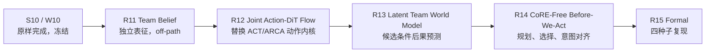
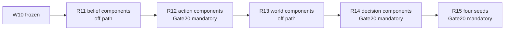

# P1 多机器人 Before-We-Act 技术路线 V4.5（S10 冻结 / 上游组件代码移植优先 / Benchmark-First Gate20）

> 文档更新：2026-08-07（V4.5 + R13-P0 winner-only 晋级为唯一 W13）
> 工程起点：`bwa/r9-core-native@06ba780`；R10 四路已全部失败并固定 `W10=B9-CoreNative`；R11 四路于 2026-08-05 完成并全部 PASSED，冻结排名 `P0>P3>P1>P2`
> 投稿目标：ICRA 2027，[官方 Call for Papers](https://2027.ieee-icra.org/contribute/call-for-icra-2027-papers-now-accepting-submissions/) 截稿时间为 2026-09-15 11:59 PM PST
> 当前状态：历史 M0–R8 与 R10 结论已冻结；`Peer-NoWrist=71.4%`；R11 终态审计见 10.14.1，W12 晋级见 10.15.5。R13 四路 Candidate-Conditioned Latent World 组件移植已于 2026-08-06 完成，四路均通过 `11/11` 工程硬门；冻结 `world_screen_score` 排序为 `P0 > P1 > P2 > P3`。2026-08-07 收到后续显式授权后，仅 P0 TD-MPC2 winner-only 代码与正式 checkpoint 晋级为唯一 W13；P1/P2/P3 未合入。W13 仍为 off-path、W12 action hash bit-exact。R14 四路 World-Guided Decision 正式 Gate20 已于 2026-08-07 完成：P0/P1/P2/P3 分别为 `77/77/75/76`，均未严格高于 W12 `77/100`，故 `no winner/no merge`，不进入下一阶段
> 评测原则：S10 原样完成；R11/R13 保持 off-path，R12/R14 会改变动作轨迹。任何候选只要可能改变最终执行动作、候选选择、动作后处理或策略权重，就必须在同一五任务、同一 seeds 上完成**每任务 20 回合**闭环（简称 `Gate20`，即每候选共 `5×20=100` episodes）后才有 winner 资格；其它表征、排序、校准、因果和 oracle 指标降为可选诊断，不再挡住 benchmark 更优候选
> 相关长期方案：[Intent-Grounded Decentralized World-Action Models 多机器人协作研究方案](20260724_INTENT_GROUNDED_DECENTRALIZED_WORLD_ACTION_MODELS_MULTI_ROBOT_COLLABORATION_RESEARCH_PLAN_V2.0_ZH.md)

> **V4.5 最高优先级执行覆盖：** 用户所称正在运行的 `S10` 视为当前第 10 轮及其最终产物 `W10`；无论远程 run ID 写作 `S10` 还是文档旧编号 `R10`，其代码、配置、数据、训练、评测、候选、选择规则和运行进程一律不改、不停、不重启。第 10.2 节完整保留为冻结执行账本。V4.5 只从 `W10` 之后开始，活动路线以第 10.13–10.18 节为准；第 10.3–10.12 节及被本版替换的“由 AI 按论文自写算法/多重研究 hard gate”条款均降为历史预案。冲突时按以下优先级执行：`S10 冻结 > 安全/许可证/数据合法性 > 上游组件来源与 commit parity > 动作影响判定 > Gate20 benchmark > 可选研究诊断`。

## 1. 本次路线调整的结论

这次不是在 R7/R8 上继续调参，而是更换**方法父节点、代码基座和搜索制度**。已有闭环证据已经足够说明：把同事的 capability-routing 原理映射到旧 World-to-Flow 主干，不能保留 Stereo-CoRE 的动作能力；反过来，直接保留同事的 ACT/CoRE 主干并只替换无腕感知输入，已经得到明显更强的 `71.4%`。V4.3 先将 `NoWristPAIRRoute` 作为 S10 的直接代码父节点；V4.5 不回滚这一步，也不改正在运行的 S10，而是把 `W10` 限定为**性能教师、数据生成器和公平基线**。R11 起不再让 AI 根据论文描述重写核心算法，而是优先锁定作者/机构官方仓库的 commit、许可证、官方配置与可复现实验，再通过最薄的无腕多机器人 adapter 迁移；AI 只负责兼容层、配置、测试和运行编排。新的活动主线固定为：

> **冻结完成 S10 → 迁移官方 Team Belief/World Representation 代码 → 迁移官方 Flow/DiT/Consistency action policy → 迁移官方 latent world model → 迁移官方 world-guided planner/post-training。CoRE 在过渡期提供教师动作和对照，但最终模型的 forward、backbone、loss 与部署依赖均不得包含 ACT/ARCA、PAIR router、role adapters、forced-role bank 或 CoRE checkpoint。**

### 1.1 触发转向的闭环证据

所有任务列统一按 `LiftBarrier / CameraAlignment / ThreeRobotsStackCube / LongPipelineDelivery / TakePhoto` 排列：

| 方案 | 输入/协议 | 五任务成功率 | macro | 阶段结论 |
|---|---|---|---:|---|
| 同事 `Peer-Exact Stereo-CoRE` | 单机腕部 RGB-D + own qpos；frozen-100 SR@1 | `99/100/99/94/29` | `84.2%` | 方法来源上界；与无腕协议不作同协议 SOTA 比较 |
| `Peer-NoWrist Stereo-CoRE` | 当前全局固定 RGB + 对应 agent 固定 RGB + own qpos；同一 frozen-100 seeds | `100/60/0/100/97` | `71.4%` | **S10 冻结父节点；S10 后只作 teacher/baseline**；相对同事数值差 `12.8pp` |
| 历史 R6L-P1 | 第三人称 RGB 的 local-future gated Flow；Gate20 | 见 8.1.2 | `39%` | 历史正结果，不再是新方法 parent |
| R7-P0 / no-WUC | 全量拟合后 normal Gate20 | `20/70/0/70/10` | `34%` | 未通过，no merge |
| R7-P1 / WUC | 全量拟合后 normal Gate20 | `5/65/0/80/10` | `32%` | utility calibration 亦失败，no merge |
| R8 两候选 | 用户确认已完成验证 | 逐任务互有优劣，整体显著低于 Stereo-CoRE | 不写入未经 hash 绑定的数字 | 方法方向关闭；完整 per-task/hash 仍须回填档案 |

这里有两条必须分开的事实：第一，`84.2%` 使用腕部 RGB-D，不能被当成当前无腕部署协议的公平 baseline；第二，`Peer-NoWrist=71.4%` 与当前环境、数据和 frozen seeds 对齐，已经足以证明“保留同事 action trunk”比“继续扩写旧 WAM trunk”更接近项目目标。

任务级差异同样决定了下一步：无腕迁移相对同事在 LiftBarrier、LPD、TakePhoto 分别为 `+1pp/+6pp/+68pp`，但 CameraAlignment、StackCube 为 `-40pp/-99pp`。macro 会掩盖这种两极化，后续任何候选都必须同时报告五任务，不能用 TakePhoto 的巨大提升抵消 StackCube 的完全失败。

### 1.2 V4.3/S10 冻结硬决策（仅约束 S10 及历史复现）

以下十七项保留用于解释正在运行的S10为什么采用CoRE-native bank，不得在S10运行中追改；其中关于R11–R14继续扩展`stereo_core`、forced-role/Flow bank、由AI自写核心或以CoRE为最终parent的表述，均不是V4.5执行指令。S10结束后只执行第10.13–10.18节的组件级移植路线。

1. **方法 parent 改为 `Peer-NoWrist`。** 新模块从其冻结 checkpoint `54cb21e7…f19f34d` 加载；旧 R6L-P1 只作论文历史对照和工程参考。
2. **CoRE 源码成为直接工程父节点。** 新路线不再把 CoRE 复制到 `third_party` 后包一层 `StereoCoREParentAdapter`；R9 直接以 `no_wrist_stereo_core/stereo_core/no_wrist_pair_model.py`、`train_no_wrist_pair.py`、`evaluate_no_wrist_pair.py` 的原代码结构建立 Git 管理的 CoRE-native 基线。冻结 DINOv3、ACT posterior/decoder、100-step chunk、四个 rank-32 role adapters、top-2 PAIR router、capability-only teacher、normalization、temporal aggregation和评测契约仍原样继承。
3. **R7/R8 正式关闭。** 不组合其 checkpoint，不再追加 125k 扩训，不把 `34%/32%` 包装成潜力结果；其中可复用的 dataset、causal-audit、monitor 工具迁移到新主线，模型路径不迁移。
4. **Before-We-Act 保护 parent，而不是拒绝生成式动作模型。** 原 Stereo-CoRE 的 top-2 sparse router 混合后只产生**一个** native base chunk，并非两个动作候选；R9 新增 CoRE-native inference API 后，才会额外得到四个 forced-role chunks。R11 允许 Flow Matching 作为增量 proposal/refinement branch 扩大候选集，但 candidate 0/base 永远保留。world model 不直接驱动电机，只预测候选后果，planner 决定是否偏离原动作。
5. **先证明候选集合有闭环上限，再训练 world model。** 若真实短期后果 oracle 都不能靠现有 role candidates 恢复 CameraAlignment/StackCube，任何 scorer 都不可能大幅提分；此时先修 proposal/perception，不允许用更大 world model 掩盖候选无解。
6. **把无腕感知错配列为 P0 根因。** 原 `RGBDPatchFusion` 假设同一腕部传感器的 RGB/depth patch 几何对齐；当前无腕实现却将不同相机外参的 local/global RGB 送入同一 aligned-fusion 归纳偏置。新路线必须通过 view-shuffle、单视角、相机标定/射线特征和 unaligned cross-view adapter 消融验证该嫌疑。
7. **感知修复也必须精确回退。** 无腕 predictive-state extension 以 zero-init residual 挂到 CoRE-native 冻结 tokens 上；`perception_gate=0` 必须逐元素复现 `B9-CoreNative/Peer-NoWrist`，不能先破坏 71.4% 再指望 world branch 补救。
8. **world model 先 off-path。** 在不改变任何动作的情况下训练 action-conditioned future latent、progress、failure-risk 与 uncertainty；只有 action-shuffle、prefix-causality、candidate ranking 和校准门槛都通过，才允许 selector 上线。
9. **原动作永远在候选集合中。** uncertainty 过高、候选分差过小、输入越界或 evaluator 失效时，必须选择 bit-exact parent action；不允许 silent fallback 到零动作、随机动作或另一个 checkpoint。
10. **数据从“只模仿成功演示”升级为“成功演示 + parent 成败 rollout + 候选分支后果”。** sampler 只在训练分布上平衡 task/outcome/stage，task ID 不进入部署模型；CameraAlignment 与 StackCube 的失败数据优先补齐，但评测种子永久隔离。
11. **论文边界改为 base-preserving consequence planning。** base proposer 仍是同事的共享 per-agent policy，R11 只额外增加有界的 centralized joint Flow proposals；team consequence evaluator 可读取全局固定视角及全体候选动作，因此最终系统不得再声称严格去中心化，而应准确写成“共享 per-agent base proposer + centralized Flow proposal/world-model planner”。
12. **以“接近同事”预注册目标。** 当前部署 parent 为 `71.4%`，同事数值锚点为 `84.2%`；正式目标为无腕 frozen-100 macro `>=80%`（闭合至少 `67%` 的 12.8pp 差距），同时 CameraAlignment `>=80%`、StackCube `>=50%`，其余三任务相对 parent 下降不超过 `5pp`。达不到就不能宣称“大幅提升”或“贴近同事”。
13. **每个模型修改轮固定四路。** R11–R14 都从上一轮唯一 merged winner 的同一个代码提交、checkpoint、数据receipt和normalization克隆P0/P1/P2/P3，一张GPU负责一个组件的抽取、parity、适配、训练和评测；冻结parent/control只评测、不占候选名额。
14. **每个候选先过 recent-first Paper Evidence Card。** 论文组合仍须覆盖经官方页面核验的获奖论文、oral/plenary、发表至少三年且有独立后续工作的经典论文，以及本轮 citation snapshot 达阈值的高引用论文；同时每张卡至少有一篇与候选直接对应的 2024–2026 年 target-venue 正式论文。优先级为 RSS/ICLR/ICML/CoRL/RA-L 最新 award/oral → 最新正式接收 → 经典根源，spotlight 不冒充 oral。
15. **arXiv-only 论文必须高引用才具备准入资格。** 未达到 `cited_by_count>=80` 或同子领域 top-quartile 的最新预印本只能进入 frontier watchlist，供碰撞检查和灵感参考，不能替代 award/oral/accepted/high-citation anchor；每篇入选论文都必须写清“吸收什么、落到哪个 symbol/test、如何被反证”。
16. **V4.3 的“AI直接改核心算法”只解释S10历史，不适用于R11+。** R11–R14的P0–P3必须先冻结`component_lock.yaml + adaptation_card.yaml`，绑定官方仓库、commit、许可证、复制进本项目的最小源文件/符号、原生parity结果和本地replacement site。不是全量部署上游模型。AI不得按论文重写backbone/loss/solver/scheduler/attention/memory/planner objective；只允许复制已实现组件并完成raw observation/dataset/action schema、mask、normalization、checkpoint和evaluator适配，以及逐行登记的兼容性补丁与测试。
17. **每轮只合并一个胜者。** 只有相对该轮冻结 baseline 取得预注册进步且无灾难性回归的候选才有资格；多路通过时按预注册排序选唯一胜者，将其代码、配置、权重和报告组成 winner pack 合并为下一轮 baseline。四路全失败时保留原 baseline 并重写下一轮，不得为了赶进度强行合并，也不得把两个独立训练权重用 Git merge 假装成可加和收益。

V4.5 从 `W10` 起只保留其中的实验治理原则：同父节点四路、先锁上游再做组件级移植、唯一胜者、失败不合并、数据与评测隔离。模型原则改为：`R11=Belief/Representation Component Transplants`、`R12=Action-Generator Component Transplants`、`R13=Latent-World Component Transplants`、`R14=World-Guided Decision Component Transplants`。不是全量部署开源模型：只把所需源文件、类或函数复制到本项目的 `before_we_act/upstream_components/`，保留逐文件来源/许可证，再用 `before_we_act/adapters/` 接入现有数据、训练、评测和整体计算图；不得继续把 CoRE 内部张量接入新方法。

### 1.1 S10 起点覆盖决策（2026-08-04）

用户最终决定：**S10 直接以 `core` 为起点，并继续使用用户自己的五任务数据集。** 该决定覆盖本节第 2、8 项中“ACT 仅作历史基线”和“不复制 Stereo-CoRE 代码”的 S10 执行边界，也覆盖第 9–10 节原 R7/R8/R9 的后续执行顺序；这些内容继续保留为既有研究证据和历史计划，不改写成已执行结果。

工程上已将官方 Stereo-CoRE `f60995c082a18cc849fcf3537ac4b89f1ac9b19f` 及用户服务器完成的 no-wrist 适配直接接入 `feat/model-improvements`。该适配用用户数据完成 `batch 40 × 120,000 updates = 4.8M` local action chunks，并在五任务 frozen100 上得到 `100/60/0/100/97`、宏平均 `71.4%`。这不是原 R9 四种子方案的完成结果，也不与同事的腕部 RGB-D 结果作同条件横比；详细来源、manifest/checkpoint/result hashes 见 [S10 `core` 用户数据复现与接入记录](../reports/20260804_S10_CORE_USER_DATA_REPRODUCTION_ZH.md)。

本次接入不创建 S10 候选分支、不预选改进方向。代码和结果提交后，由用户从该单一起点自行开展多分支渐进修改。

### 1.2 R9/R10 执行覆盖与事实源校正（2026-08-04）

本节是本次 R10 执行的规范入口，覆盖本文后续“R9 四种子正式复现”和“后续由用户自行开始”的旧含义，但不改写其历史结果。规则来源是同机旧工程克隆中尚未提交的用户 V4.3 草稿；为避免覆盖该克隆的未提交工作，本次只把 R9/R10 的必要规则审计迁入当前目标仓库。事实冲突按已经提交并验收的 S10 产物解决：V4.3 草稿曾写 parent hash `54cb21e7…`，但可访问的原复现服务器、当前 S10 报告和完整文件三方共同证明正式 checkpoint 为 `061b7a4acea8fa10f146779e7a1206822179920dfe573db536d237df81eb541d`、大小 `734,197,493` bytes；R9/R10 只接受后者。

R9 是 R10 的强制前置且不训练模型。完整无腕 `stereo_core/` 源码必须从 `vendor/stereo-core/stereo_core/` 逐字导入顶层，MIT 许可证与逐文件源 SHA256 由 `UPSTREAM_CORE_MANIFEST.json` 绑定；活动源码只允许做无参数的结构拆分。`NoWristPAIRRoute` 的冻结公共接口为 `encode_view_tokens()`、`_sample_training_latent()`、`encode_context()`、`decode_with_gates()` 与 `propose_core_bank()`，结构化类型为 `CoreViewTokens`、`CoreDeploymentContext`、`CoreContext` 与 `CoreCandidateBank`。新 bank 固定为 normalized `[B,5,H,D]`，candidate 0 是原 top-2 sparse route 的单一 base chunk，随后是四个 forced-role chunks。原训练 forward 仍只对 batch 首样本生成旧 counterfactual，且 posterior、clamp、`randn_like`、dropout 与 RNG-after-state 顺序不得改变。评测端固定拆出 `prepare_no_wrist_batch()`、`denormalize_action_chunks()` 与 `TemporalChunkEnsembler`，禁止更改归一化、chunk append 顺序、衰减或 action cadence。

R9 exact gate 同时要求：真实 checkpoint `strict=True`；state-dict key/value hash 不变；不新增 parent 参数或 persistent buffer；`actions=None/eval` 的 prediction/route/tuple 逐元素一致；固定 CPU/CUDA RNG 后 `actions!=None/train` 的 prediction、posterior、counterfactual 与 RNG-after-state 逐元素一致；normalization 和 temporal output 逐元素一致。任一 exact 项失败即在 R9 停止，不能用近似容差进入 R10。

R9 还运行七路归因：`normal`、`local-only`、`global-only`、同任务异 episode 的 `shuffle-global`、`shuffle-local`、只置换 global patch 的 `patch-permute`、关闭 cross-view relative bias 的 `no-relbias`。它们用于判断把不同外参 local/global RGB 强按同 patch 对齐是否拖累 CameraAlignment/StackCube，不直接选择模型。原生 action bank 另以 snapshot/restore（证明连续十步可复现）或同 seed 严格 replay 测不可部署 oracle；go/no-go 报告门槛为 frozen Gate20 macro headroom `>=+10pp`、CameraAlignment+StackCube `>=+8/40`、有效候选贡献 `>=80%` 且 forced-role action 无 NaN/越界。bank headroom 不足不阻止 R10，但会使后续 proposal 扩展成为强制项。

R10 的共同 parent 固定为通过 exact gate 的 `B9-CoreNative` 同一 commit/checkpoint。DINO、ACT posterior/decoder、ARCA、role adapters/prototypes、PAIR router、out head、normalization 与 temporal ensembler 全冻结；每路只训练一个 zero-init `CorePerceptionExtension`，并且只能通过

$$
\mathbf x=\mathbf x_0+\tanh(g)\Delta_\psi
$$

把 residual 注入原 `parent_fused`。gate 与最后投影均 zero-init，固定相机 calibration/ray metadata 必须进入 config hash，deployment schema 禁止 future label、task/agent ID、simulator/privileged state。

| 候选 / GPU / 分支 | 唯一新增机制 | 预注册反证 |
|---|---|---|
| P0 / GPU0 / `bwa/r10-p0-calibrated-crossview` | `CalibratedUnalignedBridge`：两路各自 2-D position、camera embedding、可选 ray Fourier 与 latent-query cross-attention | ray/view shuffle 无效，或 Camera+Stack 不升 |
| P1 / GPU1 / `bwa/r10-p1-object-slots` | `ObjectSlotBridge`：共享 slots 与迭代 binding | slot permutation/object mask 无效，或跨帧/跨视角不稳定 |
| P2 / GPU2 / `bwa/r10-p2-predictive-state` | `RecurrentPredictiveStateBridge`：合法 tokens/qpos/executed-action history 的 causal GRU/RSSM | history/action-prefix shuffle 无效，或仅离线预测改善 |
| P3 / GPU3 / `bwa/r10-p3-jepa-bridge` | `JEPAFutureFeatureBridge`：当前/history 预测 `h={5,15,30}` 的冻结 DINO latent，部署只保留 predictor state | target/action shuffle 无效，或预测提升不转成闭环提升 |

四路复用单一 `train_bwa_perception.py` 与 `NoWristFrameDataset/ExactFiveTaskBatchSampler`，只由 `bridge.kind` 注册结构；统一执行 `10k screen → 最多 30k selection`，updates、batch、五任务数据、seed schedule、precision 与 cutoff 完全相同。每路晋级必须同时满足：

1. `perception_gate=0` 与 `B9-CoreNative` 的 base/forced chunks、route 和 temporal output 逐元素一致；
2. paired Gate20 五任务 macro 严格高于 B9，任一任务下降不超过 `1/20`；
3. CameraAlignment+ThreeRobotsStackCube 合计至少增加 `4/40`，LiftBarrier+LongPipelineDelivery+TakePhoto 合计不下降；
4. 本路预注册 intervention 方向正确，episode-bootstrap 95% 下界 `>0`；
5. P95 control latency不超过 B9 的 `1.15×`，且 privileged-key audit 为零。

winner 顺序固定为“全部硬门槛 → Camera+Stack 增量 → macro 增量 → causal delta → latency/参数量 → P0<P1<P2<P3”。四路全失败则 R10 明确为 `no winner`，`W10=B9-CoreNative`，任何 R10 权重均不得进入后续阶段。本任务参数指定 `[NEXT_STAGE]=无`，因此无论 R10 通过或失败，本轮都在结构化结论写回后停止，不创建 R11。

### 1.3 R9/R10 实际执行记录（2026-08-04）

#### 1.3.1 仓库、父方案与分支

用户在执行中明确把后续目标仓库从旧目录 `fe_pc_wam` 切换为 **Before We Act**。因此所有 R9/R10 实现、四个候选分支、运行脚本与本节结果均落在 GitHub 仓库 `Jeong-zju/before-we-act`；本地含用户未提交修改的 `/home/jeong/zeno/wam/before-we-act` 主工作树没有被覆盖或纳入提交，本轮使用 `/home/jeong/zeno/wam/before-we-act-r10.dhj2NO/` 下的独立 worktree。远程仓库位于 `/workspace/fe-pc-wam`，其 `origin` 已指向同一 Before We Act 仓库；目录旧名只作为远程 checkout 路径，不代表另一个 Git 仓库。

冻结模型 parent 为 `bwa/r9-core-native@f782c6e9cbc7116c3906aafb89be152ce97430ea` 与 `/workspace/bwa_runs/shared/parent/checkpoint_120000.pt`，checkpoint SHA256 为 `061b7a4acea8fa10f146779e7a1206822179920dfe573db536d237df81eb541d`，tensor SHA256 为 `6abec931342b543d0cbffd9d2f995845d47489c2a773a082e5bfe49526611107`。R9 对真实 checkpoint 的 state、eval/train 输出、CPU/CUDA RNG-after-state、candidate bank、normalization 与 temporal output exact audit 全部通过，结构化结果是 `/workspace/bwa_runs/r9_core_native/exact_audit_f782c6e.json`。运行设施与文档继续在 `bwa/r9-core-native` 上演进，但不得把其后续运维提交误写成模型 parent。

| 候选 | 分支 | 正式 commit | 唯一实现 | GPU |
|---|---|---|---|---:|
| P0 | `bwa/r10-p0-calibrated-crossview` | `eba405ff04685963f1278a2353cfd5358be3844e` | calibrated unaligned cross-view bridge | 0 |
| P1 | `bwa/r10-p1-object-slots` | `551f30cd81f435e5779ce52f11a90d90b0cb7261` | object-slot binding bridge | 1 |
| P2 | `bwa/r10-p2-recurrent-predictive-state` | `b2e4eebc34dca86b712035a29084748dfcf3fc80` | causal recurrent predictive state | 2 |
| P3 | `bwa/r10-p3-jepa-future-feature` | `f30280bc900afe18cbea7877476599cb5ba6190d` | JEPA multi-horizon future feature | 3 |

每个候选只修改自己的 `configs/before_we_act/r10_perception/pN.yaml`、`experiments/before_we_act/r10/pN/{implementation_card.yaml,change_manifest.json}`、`stereo_core/bwa_perception.py` 与对应单元测试；候选差异审计以 `f782c6e` 为 parent 全部通过。白名单/注册入口集中在 `stereo_core/bwa_perception.py` 的 `BRIDGE_REGISTRY`、`load_r10_config()` 与 `build_perception_extension()`；共同训练、部署输入和验收入口分别为 `stereo_core/train_bwa_perception.py`、`stereo_core/evaluate_bwa_perception.py`、`scripts/before_we_act/audit_r10_gate_zero.py` 与 `scripts/before_we_act/accept_r10.py`。各分支注册且只注册一个 bridge kind，未知 kind、未知 config key、非法 parent、future/privileged deployment key 均 fail closed，避免在四个分支中混入第二种改进。

本地最终公共回归命令与结果为：

```bash
cd /home/jeong/zeno/wam/before-we-act-r10.dhj2NO/r9
/home/jeong/zeno/wam/before-we-act/.venv/bin/python -m pytest -q \
  tests/before_we_act/test_r10_common_runtime.py \
  tests/before_we_act/test_r10_hf_assets.py
```

结果为 `13 passed`。候选最终定向回归分别为 P0 `16 passed`、P1 `19 passed`、P2 `16 passed`、P3 `16 passed`；此前每路全量分支回归分别为 `24/27/24/24 passed`。公共运行设施最终 head 为 `bwa/r9-core-native@a1f62d48b80e3e9092a04973e0febc6acdd006ec`；它只包含下载/审计/运行/monitor/诊断设施和测试，不改变冻结模型 parent 或四个候选 commit。P0 另以 1000 次稳态样本复核部署延迟，`p95_ratio=1.124505183463078 <= 1.15`，结果位于 `/workspace/bwa_runs/r10_trained_smoke_gate/p0/gate_zero_latency_c010f03_1000.json`。

#### 1.3.2 数据只经 S0 Hugging Face 路径准备

用户明确禁止跨服务器同步本轮数据集。已经启动的旧分片传输在确认其 PID 不存在后标为 `STOPPED`，部分文件原样保留以供 Hub 断点复用；R10 launcher 不读取旧 rsync 状态，也没有运行任何 rsync/跨服务器 dataset child。正式资产完全使用 S0 合同：官方 `hf download`、不可变 revision、dataset Xet 开启、CLI 默认 8 workers、`HF_HUB_DOWNLOAD_TIMEOUT=600`、`HF_HUB_ETAG_TIMEOUT=60`、最多 5 次指数退避、相同 `--local-dir`/Hub cache/`.incomplete` 原位续传；鉴权只经 mode-0600 FIFO 注入，不进入 argv、环境导出、tmux command、代码、日志或 Git。

| 任务 | Hub repository | revision |
|---|---|---|
| LiftBarrier | `zeno-ai/robofactory-lift-barrier-multiview` | `6ab620091677e69370412f08cd7adecacc28c146` |
| LongPipelineDelivery | `zeno-ai/robofactory-long-pipeline-delivery-multiview` | `fee628311ff52a3ae0ddfddf82379c63d28f7533` |
| TakePhoto | `zeno-ai/robofactory-take-photo-multiview` | `3966385a4c688a5610d4b6cde044150f6b73d320` |
| ThreeRobotsStackCube | `zeno-ai/robofactory-three-robots-stack-cube-multiview` | `d0ae346bf2ce63ec801af1f036c08a4a91faf366` |
| CameraAlignment | `zeno-ai/robofactory-camera-alignment-multiview` | `e204af13f7191dfd86dab3da529316a51558f479` |

正式下载 tmux 为 `bwa-r10-hf-assets`，UTC `2026-08-04T07:18:12Z` 开始、`07:29:43Z` 完成，状态 `/workspace/bwa_runs/shared/r10_hf_assets/state.json` 为 `PASSED`、`750/750`，日志为 `/workspace/bwa_runs/shared/r10_hf_assets/download.log`。共享数据目录为 `/workspace/datasets/robofactory_multitask`，共享缓存为 `/workspace/.cache/huggingface`。可直接复现的命令为：

```bash
cd /workspace/fe-pc-wam
scripts/before_we_act/launch_r10_hf_assets_tmux.sh \
  --session bwa-r10-hf-assets \
  --run-root /workspace/bwa_runs/shared/r10_hf_assets
scripts/before_we_act/monitor_r10_hf_assets.sh \
  --run-root /workspace/bwa_runs/shared/r10_hf_assets --once
/venv/robofactory-act/bin/python scripts/before_we_act/audit_r10_hdf5_assets.py \
  --data-root /workspace/datasets/robofactory_multitask \
  --expected-files 750 \
  --output /workspace/bwa_runs/shared/r10_hf_assets/hdf5_integrity_reproducible_v2.json
```

可复现深读审计对全部 750 个 HDF5 执行 h5py open、每个 panda agent 的 9-D qpos/8-D commanded action、global/agent RGB、时间长度一致性以及首尾 state/action/RGB 实读；结果 `750/750`、错误数 0、总计 `252,873` episode steps、HDF5 apparent bytes `754,719,954,926`，结构化结果为 `/workspace/bwa_runs/shared/r10_hf_assets/hdf5_integrity_reproducible_v2.json`。第一次固化脚本把真实 9-D qpos 错写为 8-D，因而 fail closed；失败输出 `/workspace/bwa_runs/shared/r10_hf_assets/hdf5_integrity_reproducible.json` 被保留，修正经测试和 Git 提交后用新文件名重跑，没有覆盖历史结果。

#### 1.3.3 正式运行身份、环境和入口

正式 run 为 `/workspace/bwa_runs/r10-20260804`，manifest 为 `/workspace/bwa_runs/r10-20260804/run_manifest.json`，UTC `2026-08-04T07:36:20Z` 创建。远程环境为 Linux `6.8.0-60-generic`、Python `3.10.20`、PyTorch `2.7.1+cu128`、CUDA `12.8`、h5py `3.16.0`、NVIDIA driver `570.169` 与四张 32,607 MiB NVIDIA GeForce RTX 5090。四个独立 tmux 为 `bwa-r10-p0`、`bwa-r10-p1`、`bwa-r10-p2`、`bwa-r10-p3`；每路的输出、日志、checkpoint、status 与 heartbeat 均隔离在 `/workspace/bwa_runs/r10-20260804/candidates/pN/`。

```bash
# 安全部署检查，不创建产物/session
cd /workspace/fe-pc-wam
scripts/before_we_act/launch_r10_4gpu_tmux.sh \
  --run-id r10-20260804 --candidate all --dry-run

# 四路正式启动；也可用 --candidate p0、A、p0,p1、A,B 等选择单路/两路
scripts/before_we_act/launch_r10_4gpu_tmux.sh \
  --run-id r10-20260804 --candidate all

# 四路单次快照或持续刷新；--candidate 可换成 p0/p1/p2/p3
scripts/before_we_act/monitor_r10.sh \
  --run-root /workspace/bwa_runs/r10-20260804 \
  --candidate all --once
scripts/before_we_act/monitor_r10.sh \
  --run-root /workspace/bwa_runs/r10-20260804 \
  --candidate all --interval 5

# 精确列出目标但不发信号；去掉 --dry-run 才会优雅停止并保留全部产物
scripts/before_we_act/stop_r10_4gpu_tmux.sh \
  --run-root /workspace/bwa_runs/r10-20260804 \
  --candidate all --dry-run
```

launcher 先核对基础/候选分支、commit、parent/checkpoint hash、实现卡、候选 diff、HF asset `PASSED`、五个 manifest/frozen100、GPU 与 tmux 冲突，再执行每路 2-update 全路径预检、1000 样本 gate-zero/latency audit、10k screen、五任务 paired Gate20 normal+intervention 与特殊验收；只有“已有正向信号但尚未全通过”的候选才从同一 checkpoint 续到 30k，不能通过重启或换 seed 绕过 screen。统一 monitor 的存活依据是 runner 每 20 秒写入的真实 heartbeat，并显示 program/stage/PID/持续时间/心跳 age、GPU、update/loss/ETA、checkpoint、日志、OOM/NaN/Traceback/进程消失/无心跳告警以及 manifest 中的五项真实验收规则。安全退出脚本通过 `BWA_R10_RUN_ROOT` 与 `BWA_R10_CANDIDATE` 精确匹配 `/proc/*/environ`，先 Ctrl-C、再仅对仍存活的本轮 PID 发 TERM/KILL，绝不按模糊进程名误杀。

**预算可比性边界：** B9 的 120k 不是与 R10 10k 从头训练相比较的独立预算；四路都完整继承同一个 120k B9，且只用 10k（batch 40，即约 40 万窗口）训练 zero-init extension。因此本轮可回答的是“同一强基线上的 perception/state repair 能否在预注册有限增量预算内带来闭环且因果可归因的提升”，不能回答“各架构充分训练后的固有上限”。相同 update/sample 使四候选的数据口径一致，但可能偏向较易优化的 P0/P1，并使 recurrent/JEPA 的 P2/P3 欠拟合；有 signal 才续 30k 还带有预注册 survivor-budget 条件。最终若通过，只声明该固定协议下的 winner；若四路失败，只声明 `no winner`，不得把它扩大解释成四种架构在 120k 或 compute-matched 训练下均无效。统一 30k/120k 或按 FLOPs 匹配属于新的预注册实验，而本任务 `[NEXT_STAGE]=无`，本轮不擅自启动。

#### 1.3.4 已冻结的 10k screen 证据

B9 在相同 Gate20 seeds 上的五任务顺序为 LiftBarrier、CameraAlignment、ThreeRobotsStackCube、LongPipelineDelivery、TakePhoto，计数为 `20/14/0/20/20`、macro `74/100`。四个候选均已产生下列不可再解释为“仍在运行”的 10k 结果；P2 selection 的最终结果在 30k 结构化验收文件完成后续写，不用训练 loss 代替闭环结论。

| 候选/口径 | Gate20 五任务计数 | macro | Camera+Stack 增益 | 其他三任务增益 | causal mean / 95% lower | P95 ratio | 10k 决策 |
|---|---|---:|---:|---:|---:|---:|---|
| P0 official | `20/12/0/20/19` | `71/100` | `-2` | `-1` | `+0.01 / 0.00` | `0.8260716515` | FAILED；无 signal，不续 30k |
| P1 latency-waived diagnostic | `20/13/0/20/19` | `72/100` | `-1` | `-1` | `-0.01 / -0.05` | official `1.1535992768` | official FAILED；忽略延迟仍失败，不续 30k |
| P2 official screen | `20/15/0/20/19` | `74/100` | `+1` | `-1` | `+0.04 / +0.01` | `0.8609025423` | 3/5 gates 通过；弱 signal，从同一 run 续到 30k |
| P3 official | `20/12/0/20/20` | `72/100` | `-2` | `0` | `-0.01 / -0.03` | `1.0157427541` | FAILED；无 signal，不续 30k |

P0 的 exact 与 latency/input 两门通过，但 macro、Camera+Stack/其他任务和 causal lower 三门失败；`screen_continue=false`，runner 以预注册筛选码 10 退出，不是进程异常。结构化结果为 `/workspace/bwa_runs/r10-20260804/candidates/p0/validation/screen/acceptance.json`，SHA256 `fee66e212670af079bc6e00eff52f549c918a21b34749e569730ae57e17b6509`；10k checkpoint SHA256 为 `03fbf8d5eaeb92c6cf41c2c9e8743d40fd76e2bf6cc803dbef91c45090f68176`。

P1 的 gate-zero exact 与 privileged-input audit 通过，但 1000 样本 P95 为 base `30.050587 ms`、candidate `34.666336 ms`，ratio `1.1535992768 > 1.15`，因此在闭环前 official fail closed。用户随后要求暂时忽略推理开销、只看闭环 performance；独立诊断保留 official FAILED 且不改写正式状态，补跑同一 Gate20 normal/intervention 后仍未超过 B9，因果方向也为负。诊断摘要为 `/workspace/bwa_runs/r10-20260804/candidates/p1/diagnostics/latency_waived/screen/performance_summary.json`，SHA256 `44f64f278ebf97633608c7580ed7d9f1d95deaabf29ea3fd1badf312ceba51f3`；其 source acceptance SHA256 为 `7c7fa6fc5eedbb9ee7a5ea3715d0f589c2cab87fdddc07663e014ac36f519531`。

P2 的 exact、causal 和 latency/input 三门通过；macro 只与 B9 持平，Camera+Stack 只增加 1/40，且其他三任务因 Photo 少 1 次而合计下降 1，所以 10k 尚未通过。Camera normal/intervention 为 `15/11`，使 100 个 paired episodes 的 causal mean `+0.04`、bootstrap lower `+0.01`，是本轮第一个通过因果门的候选；`screen_continue=true` 只表示有资格从同一 10k checkpoint 续到锁定的 30k cutoff，不是 R10 PASSED。

P3 的 exact 与 latency/input 两门通过，但 macro、Camera+Stack/其他任务和 causal 三门失败。Camera normal/intervention 为 `12/13`，干预后反而多 1 次成功；100 个 paired episodes 的 causal mean `-0.01`、bootstrap lower `-0.03`，没有证据表明 JEPA future feature 改善闭环。`screen_continue=false`，runner 以筛选码 10 正常退出。结构化结果为 `/workspace/bwa_runs/r10-20260804/candidates/p3/validation/screen/acceptance.json`，SHA256 `da5c3e963723b2447e8e79f1d28a5f96e3cf006d70ab33f3459ad63d80e63671`；10k checkpoint SHA256 为 `c5eea8b8ea16650a66c29cbff1785e1efe8590f5c0582b12d9f9bbce8de65473`，gate audit SHA256 为 `966911c337ad2013aa637dc7a2bf07e570811a05cebe6e73951478c1ec46225e`。candidate log 共 `203,016` bytes，OOM、NaN、Traceback 与 Killed 命中均为 0，最后 heartbeat 为 UTC `2026-08-04T15:07:14.571122Z`，P3 tmux 随 runner 正常退出。

StackCube 继续严格使用 RoboFactory 官方 `@register_env("ThreeRobotsStackCube-rf", max_episode_steps=800)`，不修改 horizon。B9 frozen100 的 100 个 Stack 回合也全部按 800 steps 结束；同一 Hub 数据的 150 条成功示范均在 396--427 steps 内成功（median 408、P95 417），因此没有证据把候选的 0/20 归因于 runner 提前截断。应项目方决定，本轮不运行或采用 extended-horizon 结果。

#### 1.3.5 P2 30k selection、正式验收与 R10 终态（2026-08-05）

正式 run 于 UTC `2026-08-04T07:36:20Z`（北京时间 `15:36:20`）创建。P2 从原 10k checkpoint 和同一 optimizer/model 轨迹续训，未重启、未换 seed、未改 config；update `30000` 后自动串联正式 gate-zero、normal 五任务各 20 episodes、预注册 `history_order_shuffle` 五任务各 20 episodes和五项验收。全流水线于 UTC `2026-08-04T23:04:26Z`（北京时间 `2026-08-05 07:04:26`）终止，状态 `FAILED`。退出码 `1` 是 `accept_r10.py` 对“正式五项未全通过”的预注册返回值，不是训练/环境崩溃。

P2 最终训练记录为 loss `0.0093145659`、action loss `0.0034477136`、future-latent loss `0.0028288399`、future-qpos loss `0.0014821882`、trained gate `0.1689407974`、parent-imitation `0.0330855772`、gradient norm `0.0171509758`。正式 checkpoint 为 `/workspace/bwa_runs/r10-20260804/candidates/p2/train/selection/checkpoints/checkpoint_030000.pt`，SHA256 `1049c814b40540f1e2d9f884c839371b915b552163c1c9dd7f71d7abb2d9d116`。Gate audit 为 `/workspace/bwa_runs/r10-20260804/candidates/p2/validation/formal/gate_zero_latency.json`，SHA256 `f11165d860a0f447f19a69a302385b634f9175b684475218d0263a464cca5132`；最终 acceptance 为 `/workspace/bwa_runs/r10-20260804/candidates/p2/validation/formal/acceptance.json`，SHA256 `7fd987085c87d9266d5b3cdb3318d324a2f85b8689daa1b589c8657958225aac`。

| 任务 | B9 normal | P2 30k normal | P2 intervention | normal 相对 B9 |
|---|---:|---:|---:|---:|
| LiftBarrier | `20/20` | `20/20` | `20/20` | `0` |
| CameraAlignment | `14/20` | `13/20` | `11/20` | `-1` |
| ThreeRobotsStackCube | `0/20` | `0/20` | `0/20` | `0` |
| LongPipelineDelivery | `20/20` | `20/20` | `20/20` | `0` |
| TakePhoto | `20/20` | `19/20` | `19/20` | `-1` |
| 合计 | `74/100` | `72/100` | `70/100` | `-2` |

P2 的五项正式验收逐条为：

| 验收项 | 规则 | 实测 | 结论 |
|---|---|---|---|
| Gate-zero exact | base/forced chunks、routes、temporal output 逐元素一致 | 六类检查均 `exact=true`、`max_abs=0`，parent state exact | **PASS** |
| Paired Gate20 | macro 严格高于 B9，且每任务下降不超过 `1/20` | 各任务最差只降 `1/20`，但 `72/100 < 74/100` | **FAIL** |
| Camera+Stack/其他任务 | 前两者至少 `+4/40`，其他三任务不下降 | Camera+Stack gain `-1`；其他三任务 gain `-1` | **FAIL** |
| Causal intervention | 方向正确且 episode-bootstrap 95% lower `>0` | mean delta `+0.02`，95% lower `-0.02` | **FAIL** |
| 延迟与输入 | P95 `<=1.15×` 且无 privileged input | base/candidate P95 `38.552741/39.034814 ms`，ratio `1.012504255`；privileged audit 通过 | **PASS** |

因此 P2 30k 为 `2/5 PASS`。续训没有把 10k 的 Camera `15/20` 与 causal lower `+0.01` 固化为可靠收益：正式 30k Camera 回落到 `13/20`，causal lower 回落到 `-0.02`，而 Stack 仍为 `0/20`。这属于模型能力/优化稳定性证据，不是 loss、数据或运行环境错误；不能用正的 causal mean `+0.02` 掩盖置信下界跨零。

四路最终决策如下。P1 的闭环数字是用户要求的 latency-waived **诊断**，不改写其在正式 latency gate 处 fail closed 的官方状态。

| 候选 | 最终预算/口径 | normal 五任务 | macro | causal mean/lower | P95 ratio | 正式结论 |
|---|---|---|---:|---:|---:|---|
| P0 | 10k official | `20/12/0/20/19` | `71/100` | `+0.01/0.00` | `0.8260716515` | `2/5`，FAILED |
| P1 | 10k official gate；闭环为 latency-waived diagnostic | `20/13/0/20/19` | `72/100` | `-0.01/-0.05` | `1.1535992768` | official latency FAIL；其余三项未正式执行，忽略延迟仍失败 |
| P2 | 30k formal | `20/13/0/20/19` | `72/100` | `+0.02/-0.02` | `1.0125042550` | `2/5`，FAILED |
| P3 | 10k official | `20/12/0/20/20` | `72/100` | `-0.01/-0.03` | `1.0157427541` | `2/5`，FAILED |

终态审计显示四个 candidate runner PID 均已退出，`bwa-r10-p0/p1/p2/p3` 四个 tmux session 均已自动消失；四张 GPU 均为 `0%`、`2/32607 MiB`，没有残留 `train_bwa_perception.py`、`evaluate_bwa_perception.py` 或 `run_r10_candidate.sh`。只保留统一 `bwa-r10-monitor` 与用户已有 `ssh_tmux`，两者未被停止。P0/P1/P2/P3 candidate log 分别为 `204696/198493/630593/203016 bytes`，OOM、out-of-memory、NaN、Traceback、CUDA error 与 exception 命中均为 0。P2 最后 heartbeat 为 UTC `2026-08-04T23:04:26.003187Z`，与终态写入相差约 2 ms；07:36--23:04 的全程结构化轮询采样均保持新鲜且从未进入 `STALE`。run root 没有另存 heartbeat history 流，因此该连续性结论来自全程在线采样而不是可事后重放的逐心跳文件，文档不伪称存在后者。

终态 monitor 首次暴露一个展示层问题：候选顶层 `state=FAILED` 正确，但旧 monitor 只读取候选根目录 `acceptance.json`；runner 的 `run_child()` 又在非零验收码路径中错误恢复 shell `errexit`，使 root copy 与具体失败 detail 未执行，因而子栏错误显示 `FAILED/PENDING`。这不改变 validation 下已经落盘的 gate/acceptance、checkpoint 或任何指标。本地提交 `ffd5d255cd9df88aeee412eb2d2f4f63009dad55` 修复了两点：monitor 按 root→formal→screen 选择权威 acceptance，并在 P1 fail-closed 时读取结构化 gate audit；runner 保留调用方的 `errexit` 语义且不再用 EXIT trap 覆盖已写终态。该提交还为 `nvidia-smi` 增加 5 秒监测超时。随后提交 `683294af9f3303d54dea003ac0e23ee07a06b4ac` 让终态 duration 固定使用 `updated_at-created_at`，P2 最终显示 `15.47 h`，不再随查看时间增长。本地与远程均执行：

```bash
/home/jeong/zeno/wam/before-we-act/.venv/bin/python -m pytest -q \
  tests/before_we_act/test_r10_common_runtime.py \
  tests/before_we_act/test_r10_hf_assets.py
bash -n scripts/before_we_act/run_r10_candidate.sh \
  scripts/before_we_act/monitor_r10.sh
```

结果为 `17 passed`，shell 语法与 `git diff --check` 通过。远程 `/workspace/fe-pc-wam` 从 `a1f62d48b80e3e9092a04973e0febc6acdd006ec` 分两次以 `git pull --ff-only` 更新到 `683294af9f3303d54dea003ac0e23ee07a06b4ac` 后，同组测试仍为 `17 passed`。最终统一 monitor 对 P0/P2/P3 显示 `acceptance=FAILED progress=5/5 passed=2` 与三条实际失败 gate；P1 显示 `FAILED progress=2/5 passed=1`、原因 `latency_and_inputs`，并明确把其余三项列为 `not_evaluated`。

失败归因汇总：代码问题仅限上述终态展示/退出详情保留，已修复且不影响实验数值；配置、官方 Stack horizon、共享数据和 S0 Hub 下载均通过审计；四卡环境无 OOM/NaN/卡死/异常重启；决定性失败属于闭环模型能力与有限增量预算下的优化稳定性，具体是四路均未产生所需的 Camera+Stack 增益，P2 的 30k 因果下界也跨零。由于四路没有任何一个同时通过五项硬门槛，R10 最终结论固定为 **FAILED / no winner / `W10=B9-CoreNative`**。不合并 P0/P1/P2/P3 中任何候选分支，不把“分数最高但未通过”冒充 winner；按本任务 `[NEXT_STAGE]=无`，不创建或运行 R11。若后续收到新的、明确覆盖该停止条件的阶段 prompt，只能把本轮作为失败诊断输入，不能追溯修改 R10 门槛或结论。

## 2. 论文目标与边界

### 2.1 论文工作标题

**Before We Act: Learning Multi-Robot Policies from Predicted Consequences**

中文工作名：

**行动之前：从预测后果学习多机器人策略**

项目与论文统一使用 **Before We Act**。V4.5 中该名称表示：本项目从合法无腕多视角历史形成 team belief，由组件级移植的动作内核生成联合候选，由组件级移植的 latent world core 在执行前预测候选后果，再由移植的 decision core选择或退回 W12 base。`Stereo-CoRE-BWA` 名称永久停用；**LT-WADiT 仅当 R12 winner确为DiT/Flow组件时才可保留**，否则按真实winner冻结中性方法名。CoRE在正文结构图中只能作为灰色teacher/baseline方框；每个上游组件必须在图注、正文和代码中准确署名，不把移植写成我方原创算法。

### 2.2 核心研究问题

V4.5 的论文问题不再围绕 CoRE 的角色候选，也不预设某个动作backbone必胜，而是：

> **在无腕多机器人操作中，能否把经公开代码验证的 predictive representation、动作生成、latent dynamics与planning组件，以最小代码移植接入一个新的team-belief→candidate-action→predicted-consequence→decision流向，并在不依赖CoRE推理内核的条件下显著提高闭环benchmark？**

最终活动计算图为：

$$
\underbrace{o_{\le t}^{\mathrm{team}}}_{\text{legal fixed views/qpos/history}}
\xrightarrow{E_\eta}
\underbrace{b_t=(z_t^{\mathrm{ego}},z_t^{\mathrm{object}},z_t^{\mathrm{consensus}},z_t^{\mathrm{intent}})}_{\text{team belief}}
\xrightarrow{A_{\psi}^{\mathrm{transplant}}}
\{\mathbf a_t^{(k)}\}_{k=0}^{K}
\xrightarrow{W_\phi(b_t,\mathbf a_t^{(k)})}
\{\hat b_{t+h}^{(k)},\hat p_{\mathrm{progress}}^{(k)},\hat p_{\mathrm{fail}}^{(k)},\hat\sigma^{(k)}\}
\xrightarrow{\Pi_\omega}
\mathbf a_t^*.
$$

这里的 `intent` 不是 task ID、robot ID 或人工角色标签，而是从同步轨迹中预测的伙伴未来动作分布、共享对象转移和团队进度 latent。`E_\eta`、`A_\psi^{\mathrm{transplant}}`、`W_\phi` 与 `\Pi_\omega` 的**复制组件和我方adapter**均位于 `before_we_act/`；正式 `core_free=true` forward只允许读取原始合法观测、qpos、已执行动作历史和固定标定。CoRE仅可在训练数据生成、可选蒸馏和对照评测中离线调用。

动作生成的具体目标不在文档中提前自创：若W12 winner来自OpenPI/SmolVLA，则保留其官方Flow Matching path/loss/sampler；若来自RDT则保留官方diffusion objective/scheduler；若来自Consistency Policy则保留官方consistency objective。共同创新接口是`TeamBeliefState → ActionProposalBatch`和多机器人joint-action codec，而不是宣称重新发明上游动作算法。

world model 不追求像素生成质量，而学习候选条件的 team-belief 转移、进度、失败风险、伙伴动作/意图一致性和 epistemic uncertainty。planner 的公共效用为：

$$
J_k=
\hat p_{\mathrm{progress}}^{(k)}
-\lambda_f\hat p_{\mathrm{fail}}^{(k)}
-\lambda_u\hat\sigma^{(k)}
+\lambda_i\operatorname{Align}(\hat z_{t+h}^{\mathrm{intent},(k)},\hat z_{t+h}^{\mathrm{consensus},(k)}).
$$

最终 fallback 是W12 winner自身的base proposal，而不是CoRE action。投稿模型必须同时通过：删除`stereo_core/`和CoRE checkpoint后输出hash不变；移走所有临时上游完整clone后仍可import/train-smoke/eval-smoke；每个本地复制文件可回溯到官方commit/license。

#### 2.2A V4.3 CoRE-bank 研究问题（历史，已由 V4.4 覆盖）

以下公式保留用于解释 S10 之前的设计演化与失败/迁移证据，不再定义最终论文模型。论文不再问“怎样把更多 future token 注入 Flow”，而问一个更直接、也更贴合当时证据的问题：

> **当高性能 Stereo-CoRE 已经给出可靠 base 和若干能力反事实时，能否用 Flow Matching 扩大局部可执行候选、用 world model 预测它们的多机器人后果，并只在证据充分时选择比 base 更好的动作？**

对第 $i$ 个机器人，冻结的 CoRE proposer 产生原生 top-2 mixture 与四个 forced-role 动作块：

$$
\mathcal C_t^i
=
\left\{
\mathbf a_{t:t+H}^{i,\mathrm{base}},
\mathbf a_{t:t+H}^{i,(1)},\ldots,
\mathbf a_{t:t+H}^{i,(4)}
\right\}
=
\operatorname{CoRE}_{\theta_0}(o_t^i, q_t^i).
$$

部署时不枚举 $5^A$ 个组合。对 $A\le4$ 台机器人，继承候选集合固定包含 base joint tuple，以及每次只替换一个 agent role 的 unilateral deviations，因而最多 `1 + 4A <= 17` 个联合候选：

$$
\mathcal H_t^{\mathrm{CoRE}}
=
\left\{\mathbf a_t^{\mathrm{base}}\right\}
\cup
\left\{
\mathbf a_t^{\mathrm{base}}[i\leftarrow e]
\mid i\in[1,A],e\in[1,4]
\right\}.
$$

R11 以后，Flow Matching branch 以 base、上一动作块和当前合法观测为条件，最多再生成 $K_{\mathrm{flow}}\le8$ 个 joint residual proposals；它不能删除、覆盖或原地修改 CoRE bank：

$$
\mathcal H_t
=
\mathcal H_t^{\mathrm{CoRE}}
\cup
\left\{
\operatorname{ProjectSafe}
\left(
\mathbf a_t^{\mathrm{base}}+
F_\psi(\epsilon_k,o_t,\mathbf a_{t-1})
\right)
\right\}_{k=1}^{K_{\mathrm{flow}}},
\qquad |\mathcal H_t|\le25.
$$

`ProjectSafe` 只做动作范围、速度、mask 与 prefix continuity 投影；任何 Flow 数值异常都丢弃该 proposal，而不是影响 candidate 0。R11 的胜者由真实后果 oracle headroom 与动作可执行性选择，R12/R13 才学习预测和在线选择。

Before-We-Act consequence model 只读取当前合法部署观测与一个联合候选动作，预测多 horizon 未来 latent、团队进度、失败风险与 epistemic uncertainty：

$$
(\hat{\mathbf z}_{t+h},\hat p_{\mathrm{progress}},
\hat p_{\mathrm{fail}},\hat\sigma)
=
W_\phi(o_t^{\mathrm{team}},\mathbf a_{t:t+H}),
\quad h\in\{5,15,30,60\}.
$$

候选效用为：

$$
J_\phi(\mathbf a)
=
\hat p_{\mathrm{progress}}
-\lambda_r\hat p_{\mathrm{fail}}
-\lambda_u\hat\sigma.
$$

只有当最佳候选相对 base 的效用 margin 超过预注册阈值、uncertainty 低于阈值且所有输入审计通过时，selector 才允许改变 parent decision；否则严格返回 base：

$$
\mathbf a_t^*
=
\begin{cases}
\arg\max_{\mathbf a\in\mathcal H_t}J_\phi(\mathbf a),
& \Delta J>\tau_J\land\hat\sigma<\tau_\sigma,\\
\mathbf a_t^{\mathrm{base}}, & \text{otherwise}.
\end{cases}
$$

系统保持原 Stereo-CoRE 的 action-query 频率、100-step chunk、temporal aggregation 与实际执行前缀；world model 不直接输出机器人动作。其训练目标由 future latent prediction、progress/failure calibration、paired candidate ranking 和 uncertainty calibration 组成：

$$
\mathcal L_{\mathrm{BWA}}
=
\lambda_z\mathcal L_{\mathrm{latent}}
+\lambda_p\mathcal L_{\mathrm{progress}}
+\lambda_f\mathcal L_{\mathrm{failure}}
+\lambda_r\mathcal L_{\mathrm{rank}}
+\lambda_c\mathcal L_{\mathrm{calibration}}.
$$

训练和评测中的真实未来只生成监督标签，永远不进入部署 forward。`planner_gate=0` 时不仅结构上旁路 evaluator，还必须逐元素复现 `Peer-NoWrist` 的 action chunk、temporal aggregation 和控制输出。

### 2.3 截至 2026-08-04 的新颖性研判

**V4.5 结论：** DiT、Flow Matching、latent world model、team belief、intent prediction、MPC以及本版复制的各个组件均已有直接先例，任何一个词或上游算法都不能单独成为我方贡献。可投稿的方法边界必须来自完整的 `no-wrist team interface → transplanted belief component → transplanted action component → candidate-conditioned latent consequence component → transplanted decision component` 新流向、组件间我方contract、多机器人数据/训练适配和闭环benchmark，以及最终对CoRE runtime与上游完整仓库runtime的完全删除。

| 审计面 | Stereo-CoRE | V4.5 Before We Act |
|---|---|---|
| 动作 backbone | ACT posterior/decoder + ARCA role adapters | R12 Gate20胜出的复制动作组件；按真实结果可能为Flow/DiT/Consistency |
| 表示 | 单机器人局部 observation/state | R11复制predictive组件 + 我方无腕team contract/readout |
| 训练信号 | forced-expert action error → capability-router KL | 原样保留各复制组件的核心loss；我方只增加contract允许的监督/readout |
| 推理流向 | local input → top-2 role mixture → one action chunk | team history → K joint proposals → predicted consequences → planner → one action chunk |
| 信息边界 | 严格去中心化局部策略 | 无腕合法固定视角下的集中式 team policy/planner |
| CoRE 依赖 | 方法本体 | 仅 S10 教师/对照；正式 runtime 为零 |

论文只有在以下三项同时由实验支持时才能成立：

1. **组件组合形成不同于CoRE和任一单独上游仓库的新系统流向。** 任一上游完整模型都不包含本项目全部的无腕多机器人team interface、候选后果接口和benchmark protocol。
2. **闭环是主证据。** R12/R14每个动作影响候选五任务各跑20回合，winner严格提高直接父baseline；R15四seed复现。shuffle、oracle和calibration只辅助解释，不再作为晋级硬门。
3. **方法同时独立于CoRE和上游完整runtime。** `core_free=true`不加载CoRE源码/checkpoint，`full_repo_runtime_dependency=false`，复制文件逐个有官方commit/license/SOURCE_MAP/parity receipt。

即使满足上述边界，也不得泛称“首次使用 world model/Flow/intent”。[ICLR 2026 World-In-World](https://iclr.cc/virtual/2026/oral/10006575) 已强调 closed-loop controllability 与 inference-time compute，[ICLR 2026 MAC-Flow](https://iclr.cc/virtual/2026/poster/10011753) 已将联合多智能体行为建模为 Flow 并蒸馏到快速策略，[CoRL 2025 LatentToM](https://proceedings.mlr.press/v305/he25a.html) 已学习协作机器人的 consensus/partner belief，[ICLR 2026 LPWM](https://iclr.cc/virtual/2026/poster/10007676) 已做 object-centric stochastic latent dynamics。本文必须以无腕多机器人闭环、候选条件team-belief dynamics、组件级而非全量模型迁移、来源透明和CoRE-free系统证据区分。

#### 2.3A V4.3 新颖性研判（历史，已由上文覆盖）

**历史结论：R6–R8 已经否定“不断增强 future-to-Flow 注入即可获得高闭环性能”的工程假设。V4.3 当时不把 Flow Matching、world-model scoring、multi-view prediction 或 MoE routing单独声称为新颖；其旧前提是完整证明 `CoRE-native protected base → Flow-augmented executable proposals → joint multi-robot consequence prediction → uncertainty-gated planning → exact parent fallback`。该 CoRE-bank 中心叙事已由 V4.4 撤销。**

旧 `CrossAgentWorldConditionedFlow` backend、R6L 的 `+10pp` 与 R6J/R7/R8 的负结果进入方法演化和失败分析，不再作为新方法实现父节点。当前主线的可发表性必须来自“保留强 proposer 后，用可证伪的后果选择改善决策”，而不是从类名、预测 loss 或参数规模推断。

以下组件不能单独作为论文贡献：

| 路线组件 | 最接近工作与碰撞 | 判断 |
|---|---|---|
| Flow Matching 动作生成 | [$\pi_0$](https://arxiv.org/abs/2410.24164) 等已有 Flow action expert | 非新颖基础组件 |
| previous-chunk warm start | [Streaming Flow Policy](https://arxiv.org/abs/2505.21851) 从上一动作附近的窄高斯出发并流式积分 | 只作为工程候选 |
| latent future 进入 action generation | [LaWAM](https://arxiv.org/abs/2606.15768) 已用动作条件 latent world model 预测视觉 subgoal 并条件化动作生成；[AGRA](https://arxiv.org/abs/2606.12217) 已研究 world-action 表示接口并使用因果干预诊断 | 直接碰撞，不能泛称首创 |
| 只在训练期使用未来表示 | [Being-H0.7](https://arxiv.org/abs/2605.00078) 以未来 posterior 对齐部署 prior；[Fast-WAM](https://arxiv.org/abs/2603.16666) 质疑测试时显式未来预测的必要性 | auxiliary future 不足以支撑 WAM 主张 |
| 生成候选并由 world model 评分 | [Cortex 2.0](https://arxiv.org/abs/2604.20246) 在视觉 latent 空间生成、评分并选择候选未来 | 是基础机制而非独立贡献；必须靠 CoRE 反事实 action bank、多机器人联合选择、uncertainty abstention 与 exact fallback 区分 |
| 多机器人 Flow 轨迹/动作协同 | [GCo](https://arxiv.org/abs/2511.10874) 已做多机器人接触与轨迹 Flow co-generation；[Flow-Opt](https://arxiv.org/abs/2510.09204) 已做带置换不变编码的集中式多机器人 Flow 轨迹优化 | “multi-robot + Flow” 本身不新颖 |
| action-conditioned multiview world model | [A2World](https://arxiv.org/abs/2606.29501) 已建模动作驱动的多视角场景演化 | 多视角预测不是核心贡献 |

V4.3 预注册的完整机制为：

> **冻结高性能 CoRE action proposer，把其原生 top-2 与 forced-role counterfactuals 作为受保护 bank，再由 Flow Matching 只在该 bank 外产生少量安全 joint residual proposals；在执行前预测每个候选对本地机器人、伙伴和共享对象的后果，并以 calibrated uncertainty 决定选择、规划或退回 base。**

只有正式实验通过后，正文才允许写三项条件贡献：

1. **base-preserving 架构：** Before-We-Act 不覆盖主动作分布，而是在 `flow_gate=0`、`world_gate=0` 或 `planner_gate=0` 时 bit-exact 保留 Stereo-CoRE parent；
2. **CoRE/Flow-to-consequence 接口：** policy 内已有的 capability roles 提供受保护 counterfactual bank，Flow Matching 只补充受动作投影和数量预算约束的 proposals，world model 对两种来源使用同一个因果后果接口；
3. **多机器人因果闭环证据：** oracle headroom、action shuffle、candidate ranking、uncertainty fallback、planner-zero 和 paired frozen-100 共同证明增益来自预测后果后的选择。

在这些门槛通过之前，`Before We Act` 只是项目假设，不是已成立方法。投稿前不得使用 “first” 或“首次”；`Peer-Exact=84.2%` 也只能作为不同输入协议下的数值锚点。

### 2.4 V4.5 对 Stereo-CoRE 与上游组件的吸收边界

V4.5把继承分成两个时间段：S10及以前仍按原CoRE-native契约执行；从R11起，CoRE只允许以冻结teacher/baseline process存在，不得把`CoreContext`、route probability、role ID、forced-role chunks、ARCA feature或capability target输入任何新模块。R12允许离线action distillation；teacher-removal是可选论文诊断，但R14/R15正式部署不得加载`stereo_core`或CoRE checkpoint。上游论文代码只允许按10.13复制最小组件；完整仓库、launcher、demo、dataset和evaluator不得成为最终依赖。

活动边界按轮次固定：R11 只从原始合法 observation/history 学 team belief，CoRE 最多生成对照动作与 rollout；R12 只可读取带来源 hash 的离线 teacher action cache，且蒸馏权重在训练后半程退火到 0；R13 只读取冻结 W11/W12 的 belief 与 action candidates；R14/R15 的训练、评测和导出包均不得存在 teacher handle。吸收的是数据、评测、公平对照和可选动作监督，不是 CoRE 的模型结构或内部表示。

#### 2.4.1 V4.3/S10 的 CoRE-native 继承账本（历史）

以下 anchor、继承表和“bit-exact parent fallback”只解释S10的来源与复现责任；R11后的active fallback已改为W12胜出动作组件的base proposal。

V4.3 使用两个不能混写的 anchor：

| Anchor | 证据身份 | 冻结结果/哈希 | 用途 |
|---|---|---|---|
| `Peer-Exact` | 同事 release；腕部 RGB-D + own qpos | config SHA256 `a424f5a0423d186a6bab2246ea1052d127e9fbafedc6c733750dab0efcdf8a4a`；frozen-100 `99/100/99/94/29` | 代码祖先、方法事实与跨协议数值上界 |
| `Peer-NoWrist` | 基于同事源码的当前无腕迁移；global RGB + matching-agent RGB + own qpos | checkpoint `54cb21e7dd7c9a7fdab0a28e62cda1ca64fbe1a2346199a3a070495b2f19f34d`；config `cb330d494a3a20e4108f1e68859d0ef96805d8afd9392ae5a06c81efde3a4f96`；summary `2e44e2fbf54c86b7884c2234de86a0095e27651fdcf7bf8c65529d6aa46458af`；frozen-100 `100/60/0/100/97` | 唯一公平部署 parent 与所有新候选的 bit-exact fallback |

同事 release 的事实入口仍为本仓库 `docs/peer/` 两份报告，以及同级 `peer_stereo_core_release` 中的 `docs/METHOD.md`、`docs/RESULTS.md`、最终 config、五任务 raw JSON 和源码。无腕 parent 的事实入口为同级 `no_wrist_stereo_core/docs/NO_WRIST_DEPLOYMENT.md`、`stereo_core/no_wrist_pair_model.py`、训练/评测脚本与本地 `remote_backups/no_wrist_stereo_core_120k/` 冻结产物。任何迁入本仓库的代码都必须附 `upstream_path`、原文件 SHA256、许可证和本地 diff manifest；禁止复制后失去 provenance。

V4.3 的继承边界如下：

| 处理 | 组件 | 具体约束 |
|---|---|---|
| **原样继承** | 冻结 DINOv3-B/16、ACT 4-layer posterior / 7-layer decoder、100-step query、四个 rank-32 ARCA role adapters、PAIR top-2 router、forced-role counterfactual、capability-only KL、qpos/action contract、normalization、temporal aggregation | 第一阶段全部 frozen + optimizer-excluded；必须能加载 parent checkpoint 并复现 frozen-100 输出 |
| **保留当前无腕实现** | global fixed RGB、matching-agent fixed RGB、own qpos；不使用 wrist/depth/task ID/agent ID/language/peer state | 这是当前部署协议，不能为追分偷偷恢复腕部或 privileged state |
| **受控修复** | R10 predictive perception/state 的四种 gated extensions | 只读 parent tokens；只用 deployment 合法的相机/history/action prefix；zero-init residual，gate-zero 精确回退 |
| **新增候选** | forced-role bank 与 R11 Safe Flow proposal bank | Flow 只能追加通过投影的 joint residual proposals，不覆盖或删除 base |
| **新增旁路** | R12 consequence world model 与 R13 planner | 训练真实未来只作 label；world 不直接输出动作；planner/OOD/超时失效必回 base |
| **明确禁用** | relation/spec/anchor auxiliary、team action teacher、route-entropy winner、task/agent ID、旧 R7/R8 world-evidence router、R6/R7/R8 checkpoint 拼接 | 同事消融或本项目闭环证据已否定；不得在新名字下复活 |

最重要的代码复用原则不再是“模仿同事的训练思想”，而是：**先把可复现的 peer policy 当作不可变产品接口，再在接口外做最小增量。** 新模块只有在关闭时严格等价 parent、开启后通过逐任务闭环门槛，才能进入下一阶段。

### 2.4A V3.3 的“只吸收原理、不移植策略”记录（历史，已被 V4.3 覆盖）

以下内容完整保留，用于解释 R7/R8 当时为何把 CoRE 从 policy expert 映射到 world evidence。该映射现已被闭环结果否定；其中所有“R7/R8 应继续执行”的措辞只具有历史预注册含义，不是当前操作指令。

以下事实来自同事冻结代码、`docs/METHOD.md`、`docs/RESULTS.md`、最终 `configs/stereo_core/checkpoint_120000.json` 与对应评测 JSON，而不是从腕部视角结果反推机制。最终 Stereo-CoRE 是 **Stereo-ACT + Local-ARCA + capability-only CoRE**；FFN-MoE 只完成了容量验证，没有叠加进最终方法。正式训练使用单机器人本地样本 `batch_size=40`、`updates=120000`、总预算 `4,800,000`；输入严格是单机腕部 RGB-D 与 own qpos，不含 task/agent ID、语言、通信、global/peer view 或 peer action。其冻结 SR@1 为 `99/100、100/100、99/100、94/100、29/100`，宏平均 `84.2%`；这些数字只证明同事路线在其输入协议下有效，与本路线的固定第三人称 RGB 结果不作数值横比。

证据入口固定为本仓库 `docs/peer/P3｜多机协作(1).pdf`、`docs/peer/Stereo-CoRE｜导师汇报(1).pdf`，以及同级冻结 release 的 `docs/METHOD.md`、`docs/RESULTS.md`、`stereo_core/pair_route_model.py`、`stereo_core/stereo_decoder_variants.py`、`stereo_core/five_task_contract.py`、`stereo_core/train_pair_route_single_b40_120k.py` 与 `configs/stereo_core/checkpoint_120000.json`。若报告中的阶段数字与 release 最终冻结数字不同，以最终 config、SR@1 JSON 和 release docs 为准。

同事最终消融给出的结论必须按“正结论直接吸收、负结论明确禁用、协议差异做等价改写”处理，而不能只模糊借鉴一个 MoE 名称：

| 同事冻结结论（事实） | 本路线的工程决策 | 落地轮次/配置 |
|---|---|---|
| 无约束 Local-ARCA router 接近均匀且语义不稳定；普通 imitation/balance loss 不足以形成能力分工 | router 必须直接由“该分支能否降低动作误差”监督，不能把 attention weight 自动解释成 utility | R7-P1 `utility_coupling_weight=0.05` |
| 每 4 个 optimizer updates，对一个样本依次强制 4 个 expert，按逐 action-query MSE 形成 stop-gradient capability target | 每 4 个 updates 对一个 team sample 依次强制 12 个 `source×horizon` evidence groups；逐 agent、逐 action-query 计算 Flow velocity error | R7 公共 forced-evidence audit；P1 反传 WUC，P0 只记录 |
| capability target 已 detach，只监督 router；正常 imitation 负责训练 policy/expert，避免 winner-take-all 自强化 | `q_util`、Flow query 与 evidence summary 在 WUC 分支全部 detach；WUC 只能更新 `FutureEvidenceRouter`，正常 Flow loss 才更新低秩 evidence adapters、router 与 residual gate | R7 trainer 的梯度白名单与单元测试 |
| 最终 capability-only 配置把 `relation/specialization/anchor` 全设为 0；同规模 full variant 虽路由更尖锐，但 LPD first20 为 `1/20`，capability-only 为 `19/20` | R7/R8 正式配置都锁死 `relation_weight=0`、`specialization_weight=0`、`anchor_weight=0`；不加 partner-intent teacher、route entropy 奖励或旧模型 anchor | R7/R8 pair checker 必须拒绝非零值 |
| 更尖锐、更可解释的 routing 不等于 expert 真有能力 | 不用 route entropy、top-1 占比或可视化分离度选 winner；只认 held-out error、因果干预与闭环成功率 | R7/R8 验收 |
| 最终 weighted-items 按 `task→episode→local arm→time` 分配采样概率，sampling label 不进入 policy | 改成 `task→episode→time→all-valid-agent`：team window 必须整体保留，agent 轴用 team 内等权 mean 实现，不把 task label 输入模型 | R7/R8 共用 sampler |
| Local-ARCA 在 7 层 decoder 中使用 4 个 rank-32 role adapter，证明低秩分支足以承载差异化能力 | 独立实现 rank-32 future-evidence adapters；不复制 policy decoder/role 权重，路由对象改为 12 个 world-evidence groups | R7 公共结构 `evidence_rank=32` |
| counterfactual 训练强制单 expert，但正常推理 top-2；报告未覆盖所有 6 个 expert pair，是其已知限制 | 不继承这个错配：正常训练与推理都用相同 dense masked-softmax；强制单组仅生成 detached target/诊断 | R7 公共结构 `route_mode=dense` |
| relation teacher、team-belief distillation 没有形成稳定的本地可恢复协作增益 | 不引入同事 teacher、同步 team action target 或“显式伙伴意图”claim；peer/shared 证据只有通过 shuffle/utility gate 后才可写入贡献 | R7/R8 全程 |
| RGB→RGB-D/腕部视角是其最大感知增益来源之一，但 TakePhoto 仍只有 `29/100` | 按用户约束保持第三人称 RGB、无深度、不换相机；不能期待 capability routing 单独解决 TakePhoto，必须保留任务级失败分析 | 全程冻结输入协议 |
| 最终优化配方为 body LR `2e-4`、router LR `3e-4`、weight decay `1e-4`、clip `1.0`、workers `8`、500-step warmup + cosine、120k updates | 新模块沿用 `2e-4/3e-4`；旧 Flow/world clones 为防灾难性遗忘降到 `2e-5/5e-5`，但使用相同 warmup/cosine、样本量上限和 checkpoint 节奏 | 第 9.4 节 |

这里的“充分吸收”不是复制同事代码或把 policy expert 改名成 world expert，而是把已经被他消融支持的因果训练原则完整映射到本模型，并把已经被他否定的辅助目标从正式配置中删除。具体边界如下：

| 层级 | Stereo-CoRE | 本路线 R7/R8 | 处理结论 |
|---|---|---|---|
| 感知 | 腕部 RGB-D、本地 qpos | 固定第三人称 RGB、无深度、原 18D state | 不吸收，遵守输入约束 |
| 被路由对象 | 4 个 policy role/expert | own/peer/shared × 4 horizons 的 12 个 future-evidence groups | 吸收 capability routing，改写对象 |
| 低秩容量 | decoder 内 rank-32 role adapters | world-to-Flow 外挂 rank-32 evidence adapters | 吸收小参数分支原则，独立实现 |
| 能力监督 | 强制 expert 后的动作重建误差 | 强制 evidence group 后的 Flow velocity error | 直接吸收下游能力监督 |
| 推理 | top-2 expert | dense utility mixture + query-wise residual gate | 修复已知 train/inference mismatch |
| 训练数据 | local arm item | 含 2–4 agent 的完整 team window | 用层级采样与 team-mean 做等价适配 |
| 负结论 | relation/spec/anchor 不进入 final | 三项权重永久为 0 | 直接吸收失败消融 |
| 研究判断 | 优势可能同时来自 RGB-D、能力耦合、均衡采样和更大预算 | R7 隔离 capability-only，R8 隔离 action-aware dynamics | 必须由配对实验验证，不能当作既成结论 |

可证伪预测如下：

1. 若 R7-P1 的 dense router probability 与强制 evidence 的真实负误差在 held-out episode 上无正相关，说明 CoRE 原理没有成功迁移到 world evidence，应保留 R7-P0 或退回 R6；
2. 若 normal future 与 force-gate-zero/shuffled future 的闭环结果没有严格差异，则 world branch 仍可能只是相关旁路，R7 不得作为因果贡献；
3. 若 R8 的 action-prefix shuffle 不增加相应 horizon 的 future loss，或更改 $h$ 之后的动作会改变 horizon $h$ 输出，则新的 action conditioning 没有建立预期因果结构，R8 失败；
4. 若扩大预算只继续降低训练 loss 而 held-out future/Flow error 与闭环成功率在两个 milestone 内不改善，则判为过拟合并提前停止，不以“尚未跑满 4.8M”为由继续烧卡。

### 2.5 ICRA 快线不做什么

以下内容保留为长期方向，但不进入本次主线：

- 全分辨率视频生成式 world model；
- 任意机器人数量的严格理论泛化；
- 严格去中心化通信协议和真实网络部署；
- 大规模语言意图 grounding；
- 强化学习或在线探索；
- 5B/14B 模型扩展；
- 自建大量新任务或重新采集大规模数据。

本次使用低维、可验证的未来目标：未来 proprioceptive state、未来 DINO/team-belief latent、伙伴动作分布、共享对象转移与团队进度。论文价值来自“显式 team belief 如何连接 joint Action-DiT 与候选条件 latent dynamics，并在 CoRE-free 闭环中安全决策”，不是视频生成规模，也不是把某个生成式 backbone 名称当贡献。

## 3. 当前分支：独立 `before_we_act/` 主线，CoRE 只作冻结 teacher/baseline

S10 结束后，活动代码图只允许 `raw legal observations → TeamBeliefState → JointActionDiT → TeamConsequencePrediction → PlannerDecision`。新参数、optimizer、checkpoint 和 runtime imports 全部位于 `before_we_act/`；`stereo_core/` 只保留为带 hash/许可证的只读来源和单独评测 process。W10 teacher action 必须先离线缓存并带 provenance，训练后半程蒸馏权重归零，R14/R15 导出包不包含 teacher loader。

### 3.1 V4.3/S10 的 CoRE-native 分支账本（历史，不再扩展）

V4.3 不再建立 `third_party/stereo_core_parent`，也不再用 `StereoCoREParentAdapter` 把 CoRE 当黑盒。新主线把无腕 CoRE 的原代码布局作为活动代码基座：在 `before-we-act` 的 Git 管理范围内建立顶层 `stereo_core/`，逐字导入完整 `no_wrist_stereo_core/stereo_core/` 发布目录，再直接修改/扩展 `NoWristPAIRRoute`。这仍是“直接使用 CoRE 代码”，而不是重写一个相似模型；之所以需要纳入当前 Git 仓库，是因为本地 `no_wrist_stereo_core` 与 `peer_stereo_core_release` 都只是无 `.git` 的发布目录，无法支持四路 worktree、唯一 winner merge 和逐提交审计。

R9 导入时必须记录以下已核对的源身份；若正式执行前文件变化则重新计算，不沿用旧值：

| 直接源文件 | 当前 SHA256 | V4.3 身份 |
|---|---|---|
| `no_wrist_stereo_core/stereo_core/no_wrist_pair_model.py` | `056fae41…ae8673` | `NoWristPAIRRoute` 原生模型、唯一 policy source |
| `no_wrist_stereo_core/stereo_core/train_no_wrist_pair.py` | `ba9d07fa…99b20` | 600 demonstrations、batch40、120k 的训练真值 |
| `no_wrist_stereo_core/stereo_core/evaluate_no_wrist_pair.py` | `be474a41…19b6` | 相机预处理、反归一化、temporal ensemble 与 frozen evaluator 真值 |
| `no_wrist_stereo_core/LICENSE` | `19e67a9e…293f` | MIT 许可证；导入后原样保留 |

| 来源 | V4.3 保留内容 | 身份 |
|---|---|---|
| `no_wrist_stereo_core` | 完整 `NoWristPAIRRoute`、原训练器/evaluator、normalization、checkpoint | **直接代码父节点**；R9 后形成 `B9-CoreNative` |
| `peer_stereo_core_release` | 原版 wrist RGB-D `StereoPAIRRoute`、PAIR/ARCA 实现、capability training、消融和 raw results | 上游方法与跨协议 provenance reference，不作部署 parent |
| `before-we-act` 当前分支 | Git/worktree、RoboFactory grouped HDF5、causal audit、Gate20/frozen seeds、远程 launcher/monitor/stop | 承载 CoRE-native 活动代码与实验基础设施 |
| R6–R8 模型代码 | future target builder、action shuffle、prefix-causal tests 中与新 evaluator 通用的部分 | 只移植工具；不加载旧策略权重，不反向依赖旧 `models/wam` policy |

必须在 CoRE 原生代码中建立五个稳定接口：

1. `CoreViewTokens/CoreDeploymentContext/CoreContext/CoreCandidateBank`：`encode_view_tokens()` 保留融合前 local/global tokens 和原 `RGBDPatchFusion` 的 `parent_fused`，typed deployment context 只容纳当前/过去观测、qpos、已执行动作与固定标定，`encode_context()` 只编码一次，`decode_with_gates()` 按 native/forced gate 解码，`propose_core_bank()` 在**无训练 actions/future label**的推理模式对全 batch 返回一个 base chunk、四个 forced-role chunks、dense/sparse routes 与 provenance；原 `forward()` 仅委托这些函数且输出 bit-exact；
2. `CorePerceptionExtension`：承载 R10 四种无腕表征候选；它可读取 `CoreViewTokens` 与合法 history/qpos，但新 observation 只能通过 `parent_fused + tanh(g)Δx` 进入原 route/decoder，`g=0` 回到 `_paired_tokens()` 的原输出；
3. `SafeFlowProposalBank`：承载 R11 四种 Flow proposal/refinement 候选，只 append 到 `CoreCandidateBank`，输出 masks、provenance 与投影报告，绝不覆盖 candidate 0；
4. `JointConsequenceWorldModel`：承载 R12 四种 world-model 候选，直接读取 detached `CoreContext` 与不超过 25 个 joint candidates，批量预测 future latent、progress、failure 与 uncertainty；
5. `BeforeWeActPlanner`：承载 R13 四种有限预算 planner，返回 bank 内 candidate ID；选出的 joint chunk 在原 evaluator 的 temporal history append 之前替换“本次新 chunk”，之后仍使用原 exponential temporal ensemble，任何异常都 append 原 base chunk。

以下路径退出新主线：Rectified Flow **取代** Stereo-CoRE 的做法、World-to-Flow residual 直接改写 base、future-evidence dense router、R7 WUC、R8 causal-prefix adapter、R6/R7/R8 active clone 续训。Flow Matching 只以“新增有界候选”的身份重新进入；历史实现与结果继续保留在本文 5–9 节，不删除、不改写。

#### 3.1.1 V4.3/S10 的冻结与可训练边界（历史）

| 阶段 | 本轮四路共同冻结 | 四路唯一允许的可训练增量 |
|---|---|---|
| R9 CoRE-native refactor/headroom audit | checkpoint 参数、normalization、相机/动作/temporal contract全部冻结 | 只允许无参数 API 拆分、全 batch forced-role inference、provenance/tests；不训练、不改变 state dict key/value |
| R10 predictive perception | `B9-CoreNative` DINO/ACT/ARCA/router/out head/normalization/temporal ensembler | 各自的 bridge/slot/recurrent/JEPA `CorePerceptionExtension` 与 gate |
| R11 Flow proposals | merged R10 winner 全部 | 各自的 Flow action proposal/refinement head；base action 只读 |
| R12 consequence world model | merged R11 winner 全部 | 各自的 action-conditioned latent dynamics、outcome 与 uncertainty heads |
| R13 Before-We-Act planner | merged R12 winner 的 proposer/world encoder | 各自的有限预算 selector/planner 与 calibration；不得回训 proposer |
| R14 formal reproduction | R13 recipe、阈值算法和代码全部冻结 | seeds `101/202/303/404` 独立重训已选新模块；不得再选结构 |

active-agent weighting、task label conditioning、router entropy 正则和 task-specific action head 均不进入新主线。数据 sampler 可以按 task/outcome/stage 平衡，但这些 label 不进入 deployment forward。R10 开始后，`NoWristPAIRRoute.forward()`、`encode_view_tokens()`、`encode_context()`、`decode_with_gates()`、`propose_core_bank()`、normalization 与 temporal ensembler 都是冻结公共 API；候选只能通过注册式 extension 扩展，不能各自改 native 行为。

## 3A. V3.3 当前分支取舍记录（历史）

### 3A.1 直接保留

| 当前能力 | 快线中的位置 |
|---|---|
| RoboFactory 原生数据、状态/动作 mask、多任务 contract | 所有候选共用的数据基础 |
| 冻结 DINOv3 与完整 spatial patch tokens | 视觉上下文与未来视觉 latent 目标 |
| 18D 状态视图、8D 动作槽等按机器人数据视图 | agent factorization 起点 |
| 共享 decoder、dense 与 top-2 MoE 两种实现 | S1 并行结构候选 |
| temporal ensemble 与 latest-chunk 路径 | 统一推理协议及消融 |
| task-balanced sampler | 保留接口，S4 升级为 task→episode→time 层级均衡 |
| checkpoint、Gate20 与成功率统计工具 | 闭环迭代基础 |
| M2 中已有的 Rectified Flow、block-causal 上下文和未来预测代码 | 新 Flow/WAM 的实现参考 |

当前静态候选的初步闭环结果可以证明这条分支适合继续改，但不能直接作为论文结果。已有不同提交间的结果变化还混合了多项改动，正式表格必须从冻结的数据、评测种子和候选父提交重新跑。

### 3A.2 必须替换

- CVAE posterior、KL 目标和直接动作 MSE 不再是最终动作生成目标；
- 旧类名及 `static_act` 路径只作为 legacy baseline，不作为新方法命名空间；
- 只预测未来但不影响动作的旁路结构不能作为最终方法；
- 固定拼接整队动作的单头输出要改成按 agent slot 组织、共享参数的 Flow expert；
- 旧 M2 不再因“还没完整跑完”阻塞论文快线。

### 3A.3 active-agent loss weighting 决策

从 2026-07-28 起，所有快线训练使用与 activity 无关的损失约定：

$$
\mathcal L_b =
\frac{
\sum_{t,d} m_{btd}\,q_t\,e_{btd}
}{
\sum_{t,d} m_{btd}\,q_t
},
\qquad
\mathcal L = \frac{1}{B}\sum_b \mathcal L_b.
$$

其中 $m$ 只表示有效时间步和有效维度，$q_t$ 只允许表达对所有 agent 一致的 executed-prefix 等时序权重。禁止让 $q$ 依赖动作幅度、active/inactive 判定或 agent 身份。

具体约束：

- 删除训练配置中的 `active_agent_weight`、`active_delta_threshold`、`active_agent_loss_weight` 和 `active_agent_delta_threshold`；
- Flow velocity、部署端点、平滑项、未来状态和 legacy reconstruction loss 均不做 active-agent 重加权；
- 不记录会被误认为训练目标一部分的 `active_agent_fraction` loss metric；
- teacher-context 的 active/inactive 拆分最多保留为 debugging log，不进入 evidence board；
- ICRA 截稿前不把该机制重新加回主线。若以后重启，必须作为单独、受控且多随机种子的消融。

## 4. V4.5 快线总览：组件移植与 Benchmark-First

```mermaid
flowchart LR
    PE["Peer-Exact<br/>84.2%, wrist RGB-D anchor"]
    S10["S10 / W10<br/>CoRE frozen run"]
    R11["R11 Belief components<br/>four transplants, off-path"]
    W11["W11 belief winner"]
    R12["R12 Action components<br/>four transplants, Gate20"]
    W12["W12 action winner"]
    R13["R13 World components<br/>four transplants, off-path"]
    W13["W13 world winner"]
    R14["R14 Decision components<br/>four transplants, Gate20"]
    W14["W14 method winner"]
    R15["R15 Formal reproduction<br/>four independent seeds"]
    P["Paper freeze"]

    PE -. different-input anchor .-> S10
    S10 -. teacher / baseline only .-> R11
    R11 --> W11 --> R12 --> W12 --> R13 --> W13 --> R14 --> W14
    W14 -->|four-seed Gate20 + source audit| R15 --> P
```



这条快线有一个不可绕过的逻辑顺序：

1. **freeze first**：S10 按原进程结束，任何新路线不得污染其代码、数据或 winner decision；
2. **copy proven component**：R11从V-JEPA2/LPWM/DINO-WM/LeRobot只复制belief相关最小代码闭包，action hash不变，离线诊断不设强门；
3. **benchmark action core**：R12从OpenPI/SmolVLA/RDT/Consistency Policy复制动作内核，接入本项目统一接口，每路五任务各20回合；
4. **copy latent dynamics**：R13从TD-MPC2/LPWM/V-JEPA2-AC/DINO-WM复制world核心，保持off-path，ranking/calibration只作screen与解释；
5. **benchmark decision core**：R14从World-In-World/DINO-WM/TD-MPC2/mbrl-lib复制决策组件，每路五任务各20回合；
6. **separation/source proof**：R15用相同seeds/协议证明闭环收益、物理删除CoRE、无需完整上游仓库且逐文件来源/许可证可追溯。

四卡服务器在R11–R14固定为`GPU0=P0、GPU1=P1、GPU2=P2、GPU3=P3`。四路共享父提交、数据split和评测协议，但允许保留各上游组件的官方optimizer/solver；必须完整报告GPU-hours、updates、batch、precision和peak memory。R11/R13按冻结screen score选一个有效组件；R12/R14只有完整Gate20且macro严格高于父baseline才有winner资格。任一轮只合并唯一胜者的最小复制组件、来源/许可证、adapter和权重；不合并上游完整仓库。



R11/R13没有可运行且合规的组件，或R12/R14没有任何候选提高benchmark时，箭头返回原baseline，记录`no winner/no merge`。若两个以上候选合格，按11.2预注册排序只选一个；互补组件必须成为下一轮一个显式组合候选重新训练和验证。详细复制/替换边界以10.13–10.18为准。

## 4A. V3.3 快线总览（历史，已被上图覆盖）



S0 是起点选择，不计作结构改进。S1–S4 由若干“两卡配对微轮次”组成。R7/R8 的 P0/P1 共享各自 round 的公共垂直切片，只在表中预注册的候选轴上分叉；两者还必须共同对照冻结的前一轮 winner：



当前服务器有两张卡，每轮优先保留两个完整备选，而不是用两卡 DDP 只训练一个候选：

```text
R7 GPU 0/1：token-preserving / token-preserving + WUC
R8 GPU 0/1：prefix-mean / causal-prefix-attention
R9 第一批 GPU 0/1：E1 / E2
R9 第二批 GPU 0/1：E3 / E4
```

如果 $\Delta_{\mathrm{decoder}}$ 与 $\Delta_{\mathrm{source\_prior}}$ 都没有造成成功率退步，可以启动组合闭环；组合相对其 P0 不退步即可进入下一阶段。

“单步改进”保持轻量：

1. 只回答一个研究假设；
2. 只改变一个配置轴或一条模型接口；
3. 数据、seed、训练预算、闭环协议和其他模型路径不变；
4. 可以通过一个 flag 或一个 commit 完整回退；
5. 尽量保持改动可独立回退。

结构例外有两项。第一项是 R1 的 `legacy action generator → cold-start Rectified Flow`：head、FM loss 和 ODE solver 必须作为一个可运行的原子垂直切片共同替换，但其研究变量只有 `action_generator`；上下文、decoder、数据、action chunk、ensemble 和评测协议全部保持不变。第二项是新 R4 的 hybrid checkpoint 诊断：它不训练、不拟合统计量、不产生可晋级模型，只验证“冻结 P0 own 路径 + 旧 P1 team 路径”是否在函数组合后已经满足 R5 的目标。

所有微轮次至少保留三条规则：

- P0/P1 使用相同数据 split、训练预算与阶段对应协议；
- 公共垂直切片、P0/P1 唯一差异与冻结 parent reference 分开记录；
- S2 采用 prediction/shuffle capability gate；R6 使用已经冻结的五任务宏平均规则；R7/R8 同时要求闭环不低于 parent 和 world branch 的 causal intervention 有效。主动停止的候选直接退出比较，不阻塞另一候选。

## 5. V3 历史 S0：冻结工程起点与协作任务（07-28，已完成）

### 5.1 四个并行参考方案

| 卡 | 方案 | 作用 |
|---|---|---|
| B0 | 当前 sparse MoE legacy chunk policy + temporal ensemble | 当前分支行为参考 |
| B1 | compute-matched dense legacy chunk policy + temporal ensemble | 判断 MoE 是否值得继续 |
| B2 | 现有 M2 Rectified Flow，关闭或旁路旧 future head | Flow 工程参考 |
| B3 | 当前 sparse MoE legacy chunk policy + latest chunk | 隔离 temporal ensemble 的实际贡献 |

四卡使用相同数据 manifest、DINO 权重、动作归一化、训练 update、推理频率和 Gate20 初始条件。B0 与 B3 允许复用同一公平训练 checkpoint，因为二者只改变推理聚合；其他结构不得复用 checkpoint。旧 checkpoint 只用于工程 smoke test。

S0 只建立参考坐标，不产生可外推的结构 winner：B1/B3 分别诊断 decoder 与推理聚合，B2 是旧 M2 工程参考。由于 B2 训练耗时超过 fast-track 预算，operator 决定在 Gate20 前主动终止 B2，并以已完成成功率评测的 B0 作为 R1 工程父方案。该处置不等于证明 legacy action generator 优于 Rectified Flow；正式 Flow 改进仍在 R1 中从 B0 父方案以原子垂直切片重新实现和验证。

#### 5.1.1 Vast.ai 四卡从零一键部署与运行

以下命令假设远程服务器已经自动进入唯一的永久 tmux session，且 `/workspace/fe-pc-wam` 不存在。命令不执行 `apt update`，也不允许通过 `export HF_TOKEN=...` 传递 Hugging Face token：

```bash
cd /workspace

# 1. 检查服务器必需命令；不执行 apt update。
for s0_cmd in git tmux jq python3 nvidia-smi flock df sha256sum; do
  command -v "${s0_cmd}" >/dev/null || {
    echo "缺少服务器命令：${s0_cmd}"
    exit 1
  }
done

# 2. 确认当前就在 Vast.ai 提供的永久 tmux session 中。
test -n "${TMUX:-}" || {
  echo "错误：当前终端不在 tmux session 中"
  exit 1
}

test "$(tmux list-sessions -F '#S' | wc -l)" -eq 1 || {
  echo "错误：服务器必须有且仅有一个 tmux session"
  tmux list-sessions
  exit 1
}

echo "当前 tmux session：$(tmux display-message -p '#S')"

# 3. 确认正好有四张 GPU。
nvidia-smi -L

test "$(nvidia-smi -L | wc -l)" -eq 4 || {
  echo "错误：没有检测到正好四张 GPU"
  exit 1
}

# 4. 检查磁盘空间。
df -h /workspace

# 5. 确保目标目录不存在，防止覆盖已有文件。
test ! -e /workspace/fe-pc-wam || {
  echo "错误：/workspace/fe-pc-wam 已存在，请不要覆盖"
  exit 1
}

# 6. 下载模型改进分支代码。
git clone \
  --branch feat/model-improvements \
  --single-branch \
  https://github.com/Jeong-zju/fe-pc-wam.git \
  /workspace/fe-pc-wam

cd /workspace/fe-pc-wam

# 7. 校验代码至少包含已验证的一键启动、B2 路由和安全终止能力。
git rev-parse --short HEAD

git merge-base --is-ancestor 2de5656 HEAD || {
  echo "错误：远程代码早于最低安全版本 2de5656"
  exit 1
}

test -x ./scripts/launch_s0_4gpu_tmux.sh
test -x ./scripts/stop_s0_4gpu_tmux.sh

# 8. 先检查一键部署计划；不会下载、训练或创建窗口。
./scripts/launch_s0_4gpu_tmux.sh \
  --run-id s0-round1 \
  --dry-run

# 9. 正式一键启动。
./scripts/launch_s0_4gpu_tmux.sh \
  --run-id s0-round1
```

正式启动时在隐藏提示中粘贴同时具备 DINOv3 gated 模型、两个训练数据集和 `RoboFactory_asset` 读取权限的 HF token。launcher 只在永久 session 中创建 `s0-round1-prepare`、`s0-round1-b0`、`s0-round1-b1`、`s0-round1-b2`、`s0-round1-b3` 和 `s0-round1-monitor`，不会创建、attach 或退出 tmux session。

#### 5.1.2 当前 S0 run 一键终止与窗口关闭

必须从永久 session 中不属于目标 run 的基础 `bash` window 执行。以下命令先核验工具、session、代码和 run manifest，打印只读终止计划，然后终止 `s0-round1` 的训练、验证、RoboFactory rollout server、dataloader 和 monitor 进程，最后关闭上述六个 window：

```bash
cd /workspace/fe-pc-wam

# 1. 检查终止器依赖；不执行 apt update。
for s0_stop_cmd in tmux jq grep nvidia-smi realpath sleep; do
  command -v "${s0_stop_cmd}" >/dev/null || {
    echo "缺少服务器命令：${s0_stop_cmd}"
    exit 1
  }
done

# 2. 确认仍在唯一的永久 tmux session 中。
test -n "${TMUX:-}" || {
  echo "错误：当前终端不在 tmux session 中"
  exit 1
}

test "$(tmux list-sessions -F '#S' | wc -l)" -eq 1 || {
  echo "错误：服务器必须有且仅有一个 tmux session"
  tmux list-sessions
  exit 1
}

cd /workspace/fe-pc-wam

# 3. 更新终止器并校验最低安全版本。
git switch feat/model-improvements
git pull --ff-only

git merge-base --is-ancestor 2de5656 HEAD || {
  echo "错误：代码不包含安全终止器 2de5656"
  exit 1
}

test -x ./scripts/stop_s0_4gpu_tmux.sh
test -f ./outputs/s0_runs/s0-round1/run_manifest.json

# 4. 只读检查：不发送信号、不关闭窗口。
./scripts/stop_s0_4gpu_tmux.sh \
  --run-id s0-round1 \
  --dry-run

# 5. 正式终止该 run 并关闭它创建的六个 window。
./scripts/stop_s0_4gpu_tmux.sh \
  --run-id s0-round1

# 6. 核对永久 session 仍存在，并查看是否还有 GPU 计算进程。
tmux list-windows \
  -F '#{window_index}: #{window_name} pane_dead=#{pane_dead}'

nvidia-smi \
  --query-compute-apps=pid,process_name,used_memory \
  --format=csv,noheader
```

终止器只匹配 manifest 中记录的 session/window 前缀，以及进程环境中与本轮绝对路径完全一致的 `S0_RUN_ROOT`。它先发送 Ctrl-C，等待 10 秒，再按需发送 SIGTERM 和 SIGKILL。它禁止从目标 run window 内自我终止，也不会调用 `tmux kill-session`，不会删除数据集、DINO/RoboFactory 权重、worktree、checkpoint、partial/resume checkpoint、日志、视频或 Gate JSON。

### 5.2 S0 Round 1 闭合决策（2026-07-28）

`s0-round1` 的 monitor 在 `2026-07-28T14:10:34.935096+00:00` 显示 B0、B1、B3 已完成 Gate20；冻结协议规定使用 seed `900–919`。B0/B1 均完成 80,000 updates，monitor 舍入后的末端 loss 均为 `0.002`；B3 按设计复用 B0 immutable checkpoint、只改变 chunk aggregation，因此其 `not started` 训练状态不是缺失实验。B2 在该快照中仅完成 `4,684/80,000` updates（5.9%）；因训练耗时过长，operator 已请求在 Gate20 前主动终止，不再等待其完成后才进入 R1。

| 候选 | LiftBarrier | LongPipelineDelivery | 相对 B0 | 阶段处置 |
|---|---:|---:|---|---|
| B0 sparse MoE + temporal ensemble | 17/20（85%） | 19/20（95%） | — | 选为 R1 工程父方案 |
| B1 compute-matched dense + temporal ensemble | 11/20（55%） | 0/20（0%） | `-30pp / -95pp` | 不替换 sparse MoE；待训练 seed 复验后再作架构级外推 |
| B2 Rectified Flow reference | — | — | 不可比较 | Gate20 前 operator stop；不作模型结论 |
| B3 B0 checkpoint + latest chunk | 6/20（30%） | 0/20（0%） | `-55pp / -95pp` | 否决 latest chunk；保留 temporal ensemble |

阶段判断如下：

- **B0 是后续 R1 的工程父方案。** 它是三条已完成分支中唯一在两个任务都有成功的坐标，因此 S0 不再等待 B2，可以进入下一阶段。该选择不是正式验收，也不构成 legacy action generator 普遍优于 Flow 的结论。
- **B2 记为主动停止，不记为模型失败。** 原因是训练 wall time 超出 fast-track 预算；它没有完成相同 update、没有 Gate20 成功率，因此不能按 0% 计分，也不能用于比较 B0 与 Flow。保留最后 progress、日志、partial/resume checkpoint 和 operator-stop 原因即可。
- **B0/B3 是本轮最干净的受控对比。** 冻结 manifest 与 launcher 要求 B3 复用 B0 checkpoint 和 paired seeds，且 B3 的 `not started` 与该协议一致；latest chunk 下 LPD 从 19/20 降至 0/20，说明 temporal ensemble 是有效策略的一部分，后续 legacy 对照保留 temporal ensemble。
- **B0/B1 明确否决当前 dense 替代方案，但结论强度低于 B0/B3。** 两者训练协议一致但 checkpoint 来自独立训练；当前结果足以作工程选型，不足以用单个训练 seed 声称 MoE 普遍优于 dense。
- **LPD 是更有区分力的回归任务。** B1/B3 在 LiftBarrier 尚有 11/20 和 6/20，却在 LPD 同时为 0/20；后续轮次不得用 LiftBarrier 单任务成功掩盖长时程协调与时序稳定性失败。
- **训练 loss 不参与闭环选型。** B0/B1 的 monitor 舍入末端 loss 同为 `0.002`，但 LiftBarrier 相差 30pp、LPD 相差 95pp；后续只按各任务闭环成功率选择候选。

monitor 中 `gate=pass` 对应 `gate_summary.passed=true`，`gate=done` 对应 gate 已完成但 `passed=false`。S0 已直接选择 B0 进入 R1，不再等待额外审计、正式 100-episode gate、checkpoint SHA 或 B2 结果。相关信息可以继续记录，但不阻塞推进。

### 5.3 S0 推进规则

S0 不再设置协作必要性审计或额外准入清单。B0 直接作为 R1 父方案；R6 以前进入动作路径的候选与 B0 或各自父方案比较闭环成功率，S2 off-path predictor 使用第 7 节的 capability gate，新 R7/R8 则执行第 9.5 节预注册的 world/action 因果门槛。

### 5.4 B0 进入 S1/R1

使用 `round/s0-b0-legacy-moe-ensemble` 作为 R1 工程父方案即可。除能够完成闭环并输出成功率外，不增加其他进入条件。

## 6. V3 历史 S1：Per-Agent Rectified Flow Action Expert（07-29，已完成）

统一 Flow 目标：

$$
\mathbf x_\tau=(1-\tau)\mathbf x_0+\tau\mathbf a^\star,
\qquad
\mathbf v^\star=\mathbf a^\star-\mathbf x_0,
$$

$$
\mathcal L_{\mathrm{FM}}
=
\operatorname{MaskedMean}
\left[
\left\|
\mathbf v_\theta-\mathbf v^\star
\right\|_2^2
\right].
$$

每个 agent 使用共享参数的 action expert，agent identity、task token 和本地/团队上下文通过显式 token 进入，输出保持按 agent slot 组织。

### 6.1 R1：只替换动作生成器（必做，两卡）

| 候选 | 相对父提交的唯一变量 | 固定不变 |
|---|---|---|
| R1-F0 | `action_generator=legacy_cvae`，父方案复跑 | 数据、context、当前 decoder、chunk、ensemble、训练预算 |
| R1-F1 | `action_generator=rectified_flow_cold` | 与 F0 相同 |

F1 的 head、FM loss 和 ODE solver 作为一个原子垂直切片共同实现；不得同时把 MoE 改成 dense、加入 warm start、改变 temporal ensemble 或接入 future latent。默认使用 4-step Euler，1-step Euler 与 2-step Heun 延后为冻结 checkpoint 上的推理消融。

R1 只比较 F0/F1 的同任务闭环成功率。若 F1 在每个任务都不低于 F0，则通过并进入后续阶段，成功率持平也算通过；若任一任务下降，则保留 F0。

#### 6.1.1 S1-R1 两分支与两卡隔离契约

S1-R1 从 `feat/model-improvements` 的同一公共基础设施提交创建两个分支：`s1/r1-f0-legacy` 只把 S0-B0 固化为 R1-F0 复跑坐标，`s1/r1-f1-flow-cold` 只完成 `legacy_cvae → rectified_flow_cold` 原子替换。两个分支分别使用 GPU 0/1、独立 worktree、独立 checkpoint/output/log，但通过符号链接只读共享模型改进分支中的 `datasets/` 与 `artifacts/`，并共享同一个 uv 环境、uv cache 和 RoboFactory 安装。F0/F1 都固定 80,000 updates、训练 seed 101、Gate20 seeds 900–919、sparse top-2 MoE、DINOv3、100-step chunk 和 temporal ensemble；F1 默认使用标准高斯 cold source、FM velocity MSE 和 4-step Euler，不开启 warm start、future path、dense decoder 或 active-agent weighting。

截至 2026-07-28，本轮公共父提交为 `65ad9de`，F0 实现提交为 `f0043ff`，F1 实现提交为 `00a29c6`。这三个提交只表示代码与运行契约已冻结，不表示 F1 已通过：只有远程训练结束后 F1 在 LiftBarrier 与 LongPipelineDelivery 的 Gate20 成功率都不低于 F0，R1 才能选择 Flow。

##### S1-R1 Round 2 结果与决策（2026-07-29）

`s1-r1-round2` 的 F0/F1 都完成 `80,000/80,000` updates；monitor 舍入后的末端 loss 分别为 `0.003` 和 `0.012`。相同 Gate20 协议下，F0 在 LiftBarrier/LongPipelineDelivery 分别为 `11/20`、`20/20`，F1 分别为 `13/20`、`20/20`。F1 在 LiftBarrier 提高 `2/20`（10 个百分点），在 LongPipelineDelivery 持平，因此满足“每个任务均不低于 F0”的 R1 推进规则，选择 F1 并将 `s1/r1-f1-flow-cold` 合入 `feat/model-improvements`。

| 候选 | 训练 | 末端 loss（monitor） | LiftBarrier | LongPipelineDelivery | R1 决策 |
|---|---:|---:|---:|---:|---|
| F0 legacy CVAE | 80,000/80,000 | 0.003 | 11/20（55%） | 20/20（100%） | 控制组 |
| F1 Rectified Flow cold | 80,000/80,000 | 0.012 | 13/20（65%） | 20/20（100%） | 通过并晋升 |

F1 monitor 的 `failed` 不是闭环失败：两个任务的 40 个 rollout 均已完成，退出码来自 `build_lpd_gate_summary.py` 只接受 `wam/static_act`、不接受 F1 的 `agent_flow` policy kind。合入后的汇总器已把 `agent_flow` 纳入文件型 checkpoint 路径；同步远程原始 rollout 后只需重建 `gate_summary.json`，不需要重新训练或重跑 40 个回合。在汇总 JSON、checkpoint 哈希与 episode-level 记录同步前，本节数字仍按 operator-reported Gate20 结果使用，不外推为正式 100 回合验收或统计显著性结论。

launcher 复用服务器已经存在的唯一永久 tmux session，只创建 `<run-id>-prepare`、`<run-id>-f0`、`<run-id>-f1` 和 `<run-id>-monitor` 四个 window，并为每个 window 设置 `remain-on-exit=on`；它不会创建、attach 或退出 tmux session。monitor 同时显示两条训练的 update/loss、两个闭环任务的成功数、候选 phase 和两张 GPU 的利用率/显存。训练或验证进程退出后 window 仍保留，便于查看日志。

#### 6.1.2 Vast.ai 两卡从零一键部署、训练、验证与监控

以下命令假设 Vast.ai 已经自动进入唯一的永久 tmux session，服务器恰好暴露两张 GPU，且 `/workspace/fe-pc-wam` 尚不存在。命令不会执行 `apt update`，HF token 只会通过隐藏输入和 mode-0600 FIFO 交给共享准备 window，不写进 shell export、tmux command 或 argv：

```bash
cd /workspace

for s1_cmd in git tmux jq python3 nvidia-smi flock df sha256sum; do
  command -v "${s1_cmd}" >/dev/null || {
    echo "缺少服务器命令：${s1_cmd}"
    exit 1
  }
done

test -n "${TMUX:-}" || {
  echo "错误：当前终端不在 Vast.ai 的永久 tmux session 中"
  exit 1
}

test "$(tmux list-sessions -F '#S' | wc -l)" -eq 1 || {
  echo "错误：服务器必须有且仅有一个 tmux session"
  tmux list-sessions
  exit 1
}

test "$(nvidia-smi -L | wc -l)" -eq 2 || {
  echo "错误：S1-R1 必须恰好暴露两张 GPU"
  nvidia-smi -L
  exit 1
}

df -h /workspace

test ! -e /workspace/fe-pc-wam || {
  echo "错误：/workspace/fe-pc-wam 已存在，请不要覆盖"
  exit 1
}

git clone \
  --branch feat/model-improvements \
  --single-branch \
  https://github.com/Jeong-zju/fe-pc-wam.git \
  /workspace/fe-pc-wam

cd /workspace/fe-pc-wam
git rev-parse --short HEAD

test -x ./scripts/launch_s1_r1_2gpu_tmux.sh
test -x ./scripts/stop_s1_r1_2gpu_tmux.sh

./scripts/launch_s1_r1_2gpu_tmux.sh \
  --run-id s1-r1-round1 \
  --dry-run

./scripts/launch_s1_r1_2gpu_tmux.sh \
  --run-id s1-r1-round1
```

正式启动时在隐藏提示中粘贴同时具备 DINOv3 gated 模型、两个训练数据集和 `RoboFactory_asset` 读取权限的 HF token。启动后 launcher 默认切到 `s1-r1-round1-monitor`；可随时从永久 session 的任意非目标 window 执行以下只读监测指令：

共享准备只调用官方基础下载命令 `hf download`：固定关闭 Xet，并用 `--max-workers 1` 串行走普通 HTTP，以避免云主机共享出口请求 `xet-read-token` 时出现 `429 Too Many Requests`。脚本不包含并发下载或重试封装；下载失败后，以新 run-id 重新启动会原地复用已完成文件并续传。

```bash
cd /workspace/fe-pc-wam

python3 scripts/s1_r1_runtime.py monitor \
  --once \
  --run-root outputs/s1_r1_runs/s1-r1-round1

tmux select-window \
  -t "$(tmux display-message -p '#S'):s1-r1-round1-monitor"
```

所有运行产物位于 `/workspace/fe-pc-wam/outputs/s1_r1_runs/s1-r1-round1/`。共享准备日志和哈希分别为 `prepare.log`、`shared_artifact_sha256.txt`；F0/F1 的训练进度、checkpoint、验证 JSON、视频和完整候选日志分别位于 `candidates/f0/` 与 `candidates/f1/`。monitor 中 Gate20 的 `lift=x/20`、`lpd=y/20` 是本轮唯一推进依据：只有 F1 两个任务都不低于 F0 才进入 R2。

共享准备完成后，两个候选还要分别完成数据 manifest/HDF5 身份校验、DINOv3 权重装载、模型与 optimizer 构建、resume 检查、DataLoader worker 启动和首批数据读取。两张 RTX 5090 的常见冷启动时间为 3–15 分钟；云盘较慢时可能达到 20–30 分钟。候选 window 在等待共享准备时每 30 秒打印一次心跳；训练器把上述子阶段写入 `candidates/<f0|f1>/train/stages.jsonl`。monitor 每 5 秒显示当前 startup 子阶段、该阶段持续时间以及 GPU 利用率，产生第一个 optimizer step 后自动切换为 `training` 并显示 update/loss。

#### 6.1.3 S1-R1 一键退出但保留永久 tmux 与全部产物

退出脚本必须从永久 session 中不属于 `s1-r1-round1-prepare/f0/f1/monitor` 的基础 `bash` window 执行。它只根据 run manifest 和进程环境中的绝对 `S1_R1_RUN_ROOT` 定位本轮进程，依次发送 Ctrl-C、SIGTERM、必要时 SIGKILL，再关闭本轮四个 window；不会调用 `tmux kill-session`，不会删除共享数据、DINO/RoboFactory 权重、worktree、checkpoint、resume、日志、视频或验证结果：

```bash
cd /workspace/fe-pc-wam

git switch feat/model-improvements
git pull --ff-only

test -f ./outputs/s1_r1_runs/s1-r1-round1/run_manifest.json
test -x ./scripts/stop_s1_r1_2gpu_tmux.sh

./scripts/stop_s1_r1_2gpu_tmux.sh \
  --run-id s1-r1-round1 \
  --dry-run

./scripts/stop_s1_r1_2gpu_tmux.sh \
  --run-id s1-r1-round1

tmux list-windows \
  -F '#{window_index}: #{window_name} pane_dead=#{pane_dead}'

nvidia-smi \
  --query-compute-apps=pid,process_name,used_memory \
  --format=csv,noheader
```

一键退出完成后，Vast.ai 的永久 tmux session 必须仍存在；若之后要恢复训练，保留的 `resume.pt` 会被各候选训练器读取，但为避免复用已经关闭的 window/run manifest，应使用新的 `--run-id` 启动并按需把对应 resume/checkpoint 放入新 run 的候选隔离目录。

若 `s1-r1-round1` 在共享下载阶段失败且尚未执行上述退出指令，应先切到永久 session 中任意非 S1-R1 基础 window，再执行：

```bash
cd /workspace/fe-pc-wam

./scripts/stop_s1_r1_2gpu_tmux.sh --run-id s1-r1-round1

git switch feat/model-improvements
git pull --ff-only

./scripts/launch_s1_r1_2gpu_tmux.sh --run-id s1-r1-round2
```

该流程只关闭 round1 的四个 window，不删除 `/workspace/fe-pc-wam/datasets`、`/workspace/fe-pc-wam/artifacts`、`/workspace/RoboFactory`、Hub 下载缓存或 round1 日志；round2 会继续使用这些已有内容。

若 F1 已完成 80,000 updates、仅在闭环握手、rollout 或汇总阶段失败，不得重新训练。应进入 F1 worktree，明确切换并更新 `s1/r1-f1-flow-cold`，然后用新的 retry-id 复用 round2 checkpoint，只重跑 F1 Gate20：

```bash
cd /workspace/worktrees/s1-r1-f1-flow-cold
git switch s1/r1-f1-flow-cold
git pull --ff-only origin s1/r1-f1-flow-cold

./scripts/retry_s1_r1_f1_gate.sh \
  --run-id s1-r1-round2 \
  --retry-id retry1
```

retry 输出写入 round2 的 `candidates/f1/validation/gate_s1-r1-round2_retry1/`，日志写入 `candidates/f1/logs/gate_s1-r1-round2_retry1.log`；已有 checkpoint、训练进度和首次失败的验证目录全部保留。

### 6.2 R2a/R2b：两个可选单变量微轮次（可四卡并行）

R1-F1 已通过并随合并提交 `ae7dc95` 进入 `feat/model-improvements`，冻结为后续阶段的 Flow 工程父方案 `P_flow`。以下两对候选可以同时租用四张卡：

| 微轮次 | P0 控制 | P1 单步改进 | 唯一变量 |
|---|---|---|---|
| R2a Decoder | 当前 `P_flow` decoder | 仅切换 `top-2 MoE ↔ dense FFN` | decoder family |
| R2b Source prior | Gaussian cold start | previous-chunk warm start | Flow source distribution |

R2a 不改变 source prior；R2b 不改变 decoder。每个 P1 只要各任务闭环成功率不低于对应 P0 就可以保留，持平也算通过。若两项都通过，可以直接进入组合闭环；组合方案相对组合父方案没有成功率退步即可继续。

**2026-07-30 决策：主路径不运行 R2。** R2a 在 S0 已有同方向证据：dense B1 相对 MoE B0 闭环明显退步，再花完整训练预算只会重复一个低信息量问题；R2b 的 previous-chunk warm start 改变 source distribution，既不是 S2 所需依赖，也会把跨回合分布漂移带入新的 world-model 对照。R2a 标记为跳过，R2b 移入非阻塞 backlog；以后若有空闲卡，R2b 只能作为独立 sidecar ablation，不能更换 S2 父方案或阻塞主线。

### 6.3 进入 S2

S2 固定从当前 `feat/model-improvements` 上的 F1 `rectified_flow_cold` 父方案进入；模型修改父提交为 `caa5ed3`，Flow checkpoint 优先采用已经完成 Gate20 的 R1-F1 checkpoint。S2 不再等待 R2a/R2b。正常情况下不增加 Flow 训练；若租用的新实例和持久盘都已经没有该 checkpoint，则 S2 launcher 会按已经晋升的冻结 F1 配方自动重建，而不是因缺文件永久阻塞。

## 7. V3 历史 S2：Agent-Factorized Action-Conditioned World Model（07-30 至 08-01，已完成）

本阶段冻结 F1 Flow 与 DINOv3，future predictor 严格保持在动作路径之外。S2 回答三个能力问题：local predictor 是否真正读取自己的候选 action chunk，team predictor 是否真正读取 peer action 并预测跨机器人/共享场景后果，以及 team capability 能否在结构上不改写合格的 own predictor。因为 predictor off-path 时不可能改变策略动作，S2 不用闭环成功率比较 W0/W1 或 P0/P1；只运行一次 predictor-disabled action-equivalence smoke，world-to-action 收益统一留到 S3。

### 7.1 S2.0：先建立 grouped trajectory contract

复用当前 manifest 与轨迹文件，不重采数据。新增 S2 专用 grouped adapter，保留 episode 内的 agent 维与共享视角；不得修改 S1 已冻结的 legacy `_local_batch` 语义。adapter 必须输出以下张量：

| 字段 | 固定 contract |
|---|---|
| current agent state | `[B, A, 18]` |
| executed/candidate action chunk | `[B, A, H, 8]` |
| agent-view observation | `[B, A, ...]` |
| global/shared-view observation | `[B, ...]`，与 agent slots 分开保留 |
| valid-agent mask | `[B, A]`，第一版 `A_max=4` |
| future targets/masks | `k ∈ {1, 25, 50, 100}`，越过 episode 边界的 target 必须 mask |

S2.0 必须先通过四类单元测试：group/agent/global shape 保持、future index 与 episode 边界 mask 正确、invalid-agent slot 对 loss 为零、predictor disabled 时 F1 输入动作与输出动作逐元素一致且 Flow/DINO checkpoint hash 不变。任一测试失败都不启动 R3。

### 7.2 Future representation 与损失

第一版不生成 RGB。每个 horizon 预测两类增量 target：归一化 proprioceptive state delta `s_{t+k}^i-s_t^i`，以及冻结 DINOv3 patch feature 的空间池化 latent delta。DINO feature 先按固定网格池化，再用仅在 train split 拟合的 PCA 从 1024 维压到 256 维；PCA basis、归一化统计、DINO checkpoint 与数据 manifest hash 都写入 checkpoint，验证/测试阶段不得重拟合。

state 使用 masked Smooth-L1，DINO delta 使用 masked cosine distance；两项先用 train split 统计量标准化，再固定等权相加：

$$
\mathcal L_{\mathrm{future}}
=
\mathcal L_{\mathrm{state}}
+
\mathcal L_{\mathrm{dino}}.
$$

真实 future 只能作为训练/验证 target，禁止作为 predictor 输入。local predictor 输出 own-state/own-view future；team predictor 额外输出所有 valid peer 的 state/view future 与 global/shared-view future。

### 7.3 Candidate-action contract

训练时使用数据中的归一化 executed action chunk 作为干净的 causal candidate。R3-W0 使用同构 action adapter，但 action 输入置零并 mask；R3-W1 输入自己的完整 action chunk。不能把单个 noisy $\mathbf x_\tau$ 作为唯一 action condition，因为早期 $\tau$ 的信号主要是噪声，容易把“模型没读动作”误判成 world model 不成立。

为 S3 预留的推理 contract 是：每个 solver step 先由冻结 base Flow 给出 provisional clean endpoint，再以 stop-gradient 方式连同 $\tau$ 送入 predictor：

$$
\hat{\mathbf a}_1^i
=
\operatorname{clip}
\left(
\mathbf x_\tau^i
+
(1-\tau)\,
\mathbf v_{\mathrm{base}}^i(\mathbf x_\tau,\tau,\mathbf h_t)
\right).
$$

local 模式只可读取本 agent 的 context 与 candidate action；team 模式可读取所有 valid agents 的 context/action 和 global slot，使用共享参数与显式 masks，不按 agent 数复制独立网络。

### 7.4 R3：Action conditioning capability（必做，两卡）

| 候选 | Predictor 输入 | Future target | 唯一变量 |
|---|---|---|---|
| R3-W0 | local context；action adapter 输入置零并 mask | own state + own DINO latent | 无候选动作信息 |
| R3-W1 | local context + own executed action chunk | 与 W0 完全相同 | `action_conditioning=on` |

W0/W1 必须从相同初始化开始，使用相同网络、target、horizon、width、参数量、训练更新、optimizer 与固定 held-out trajectory split。R3 只有同时满足以下条件才通过：

1. 每个任务上 W1 的 held-out composite future loss 都不高于 W0，且至少一个任务严格改善；
2. 每个任务分别做 paired action shuffle，`L_shuffled-L_normal>0`，episode-level paired bootstrap 的 95% 下界也必须大于 0；
3. predictor disabled 时通过 F1 action-equivalence smoke，且 Flow/DINO 无梯度、无参数或 buffer 变化。

若 action shuffle 不能稳定增大误差，结论是 predictor 没有利用候选动作；停止进入 R4，优先检查 action normalization、temporal alignment 与 adapter，再只允许一次修复重跑。不能用闭环持平把 W1 判为通过。

#### 7.4.1 S2-R3 两分支、五任务和两卡运行契约（2026-07-30）

S2.0 公共基础设施先落在 `feat/model-improvements`，再从同一个公共父提交创建 `s2/r3-w0-action-independent` 和 `s2/r3-w1-action-conditioned`。W0/W1 使用同一个 `LocalActionConditionedFuturePredictor` 类、相同参数量、seed `303`、10,000 updates、batch size `1`、optimizer、五任务 train/validation split、DINOv3/PCA 工件和 S1-R1 F1 checkpoint；分支配对检查器会删除候选 identity 与隔离输出路径后逐字段比较配置，除 `action_conditioning=false/true` 外存在任何差异都会拒绝启动。训练与验收白名单显式加入 `s2_r3_local_action_independent` 和 `s2_r3_local_action_conditioned`，未知 model kind fail closed。

五任务联合训练、联合 held-out 验证固定使用以下不可变 Hugging Face dataset revision，并通过同一个基础仓库下的 `datasets/robofactory_multitask/` 只读共享给两个 worktree：

| 任务 | Hugging Face dataset | revision | 本地目录 | 实际 RGB 相机 |
|---|---|---|---|---|
| LiftBarrier | `zeno-ai/robofactory-lift-barrier-multiview` | `6ab620091677e69370412f08cd7adecacc28c146` | `lift_barrier/` | `global, agent_0, agent_1` |
| LongPipelineDelivery | `zeno-ai/robofactory-long-pipeline-delivery-multiview` | `fee628311ff52a3ae0ddfddf82379c63d28f7533` | `long_pipeline_delivery/` | `global, agent_0..3` |
| TakePhoto | `zeno-ai/robofactory-take-photo-multiview` | `3966385a4c688a5610d4b6cde044150f6b73d320` | `take_photo/` | `global, agent_0, agent_1, agent_2, agent_3` |
| ThreeRobotsStackCube | `zeno-ai/robofactory-three-robots-stack-cube-multiview` | `d0ae346bf2ce63ec801af1f036c08a4a91faf366` | `three_robots_stack_cube/` | `global, agent_0, agent_1, agent_2` |
| CameraAlignment | `zeno-ai/robofactory-camera-alignment-multiview` | `e204af13f7191dfd86dab3da529316a51558f479` | `camera_alignment/` | `global, agent_0, agent_1, agent_2` |

补齐全部 agent 相机后，五仓库固定 revision 的 Hub `used_storage` 合计约 784 GiB。launcher 不再用不适用于原地升级的固定空闲门槛，而是按每个 revision 的目标字节数减去当前本地目录字节数计算净增长，再额外要求 32 GiB 单文件替换/续传余量；全新实例与旧 global-only 数据原地升级使用同一检查。2026-07-30 的服务器实测确认，关闭 Xet 且单 worker 时普通 HTTP 单连接只有约 `4.6 MiB/s`，而 LongPipelineDelivery 单个 HDF5 平均约 `2.37 GiB`；因此五个大型训练集恢复 S0 `9bf88ff` 的已验证传输策略：官方 `hf download` 保持 Xet 开启、不传 `--max-workers`（当前锁定 CLI 的默认值为 8）、失败后最多 5 次指数退避。DINOv3 仍关闭 Xet并固定 `--max-workers 1`。两类下载都固定不可变 revision、`HF_HUB_DOWNLOAD_TIMEOUT=600`、`HF_HUB_ETAG_TIMEOUT=60` 和最终 `--local-dir`，不调用 `snapshot_download`，也不创建第二份 snapshot。

网络抖动时官方客户端在同一本地 cache/`--local-dir` 恢复；只有 prepare 变为 `failed` 才是本轮失败。脚本每 15 秒把当前任务已完成的 episode 数写入 shared status。重启时不能只凭已经先行下载的 `training_manifest.json` 判定完成：快速完整性检查会确认该任务全部 150 个 HDF5、normalization 和 conversion manifest 均已落盘，否则继续复用已完成文件和本地 cache。S0 模式可能重新获取由普通 HTTP 留下但尚未完成的单文件 `.incomplete`，不得手工删除 cache 或已经完成的 HDF5。

grouped adapter 保留 current state `[B,4,18]`、candidate chunk `[B,4,100,8]`、五个固定相机槽位、独立 global RGB `[B,...]`、valid-agent mask `[B,4]` 和 `k={1,25,50,100}` future mask。五个正式数据集均保留 global 加全部实体 agent 相机，local predictor 的 current/future DINO target 只读取真实 agent-view；loader 的 canonical-prefix/global fallback 兼容路径仅供不完整数据诊断，正式 artifact preflight 会拒绝使用。DINOv3 patch feature 固定池化到 `2×2` 网格，再用只读取 train split 的 PCA 从 1024 维压到 256 维；PCA basis、projected std、state/DINO delta normalization、五个 manifest hash、每任务实际相机契约和 DINO hash 保存在 `artifacts/s2_r3/dino_pca_statistics.pt`，并完整嵌入候选 checkpoint。future state/RGB 只用于 target builder，不进入 predictor input。

正式五任务 R3/旧 R4 训练启动前，quick local verifier 还必须逐任务确认训练 manifest 的相机顺序严格等于 `global + 全部实体 agent`（LiftBarrier 2、LongPipelineDelivery/TakePhoto 4、ThreeRobotsStackCube/CameraAlignment 3）；只有 `global` 的过渡数据会在 DINO/PCA 之前 fail closed，不能产生正式 artifact。PCA/statistics 对 episode 边界的全 false future-view mask 作空批次跳过，绝不把零帧张量传入 DINO；若整个 horizon 最终没有任何有效 visual target，则以明确的 `empty horizon` 数据错误停止，而不是产生无效统计量。

R3 验收器不运行无区分力的成对闭环。它在每个 validation episode 固定选择 4 个时间窗，分别输出 normal 与 own-action-shuffle composite future loss，再按 episode 聚合并运行 10,000 次 paired bootstrap。`acceptance.json` 只有在五个任务上同时满足 W1 loss 不高于 W0、至少一个任务严格改善、W1 `L_shuffled-L_normal>0` 且 bootstrap 95% 下界大于 0时才通过；同时还要求 predictor-disabled F1 action output 逐元素相等、Flow/DINO 文件 hash 前后不变、predictor checkpoint 不含 Flow/DINO state。monitor 直接读取这套特殊规则，不把闭环成功率或 W0 的零 shuffle delta 误当作 R3 通过条件。

#### 7.4.2 S2-R3 正式验收结论（2026-07-31）

正式 run `s2-r3-round1-full-cameras` 已在两张 RTX 5090 上完成 W0/W1 各 10,000 updates、五任务 held-out 验证和成对 own-action shuffle 验收。两个训练进程退出码均为 0，501 个训练记录点中的 total/state/visual loss 与 gradient norm 均为有限值，无 NaN、OOM 或 Traceback。训练前 1,000 步与最后 1,000 步的均值如下：

| 候选 | 前 1,000 步 loss | 最后 1,000 步 loss | 最后 1,000 步 state loss | 最后 1,000 步 visual loss |
|---|---:|---:|---:|---:|
| R3-W0 | 1.092161 | 0.729984 | 0.146621 | 0.583363 |
| R3-W1 | 1.087506 | 0.721665 | 0.140173 | 0.581492 |

正式 `acceptance.json` 的五任务结果如下。`W1 改善` 为 `(W0-W1)/W0`；shuffle 指标为 W1 的 `L_shuffled-L_normal`，置信区间使用 15 个 episode、每 episode 4 个固定窗口和 10,000 次 episode-level paired bootstrap：

| 任务 | W0 held-out loss | W1 held-out loss | W1 改善 | W1 action-shuffle Δ | bootstrap 95% 下界 |
|---|---:|---:|---:|---:|---:|
| CameraAlignment | 0.776281 | 0.768086 | 1.06% | 0.005730 | 0.004727 |
| LiftBarrier | 1.019633 | 1.013257 | 0.63% | 0.004874 | 0.002807 |
| LongPipelineDelivery | 0.571899 | 0.565914 | 1.05% | 0.064856 | 0.060579 |
| TakePhoto | 0.749629 | 0.739450 | 1.36% | 0.033809 | 0.030487 |
| ThreeRobotsStackCube | 0.693697 | 0.683910 | 1.41% | 0.025696 | 0.023503 |
| **五任务宏平均** | **0.762228** | **0.754123** | **1.06%** | — | — |

正式验收的七项检查全部通过：

1. 任务集合严格等于预注册的五任务；
2. Flow 与 DINOv3 在训练/验证前后保持冻结且文件 hash 不变；
3. predictor disabled 时 F1 动作输出逐元素相等，最大绝对差为 `0.0`；
4. W0/W1 的初始化、模型预算、训练和验证选择契约相同，唯一研究变量是 `action_conditioning=false/true`；
5. 五任务 W1 action-shuffle 均值和 bootstrap 95% 下界全部大于 0；
6. 五任务 W1 held-out loss 均不高于 W0；
7. 至少一个任务严格改善；本次实际为五个任务全部严格改善。

额外的非门槛配对复核中，W1 held-out loss 优于 W0 的 episode 数分别为 CameraAlignment `14/15`、LiftBarrier `12/15`、LongPipelineDelivery `15/15`、TakePhoto `15/15`、ThreeRobotsStackCube `13/15`；对 W0-W1 episode 差重新 bootstrap 后，五任务探索性 95% 区间也均位于 0 以上。LiftBarrier 有 2/15 个 episode 的 action-shuffle delta 为负，但正式的任务聚合均值与预注册 episode-bootstrap 下界仍明确为正，因此不触发回退。

**正式结论：S2-R3 PASS，选择 R3-W1 作为当时旧 R4 的 local parent。** 该结论证明 local predictor 确实读取 own candidate action，并在同预算 held-out future prediction 上一致优于 action-independent W0；它不声称 off-path predictor 已提高闭环成功率，world-to-action 收益仍留到 S3 检验。当前证据来自固定 seed `303` 的一轮训练，后续可以补多 seed 作为论文稳健性分析，但不阻塞新 R4/R5 protected-own 路线。

正式产物：

- pair-level 验收：`outputs/s2_r3_runs/s2-r3-round1-full-cameras/acceptance.json`，decision=`pass_enter_r4`；
- W1 checkpoint：`outputs/s2_r3_runs/s2-r3-round1-full-cameras/candidates/w1/checkpoints/predictor.pt`；
- W1 checkpoint SHA256：`1a7fab018777b37803e4457406ed8893556e029fd331549a9f9ed51ffac524aa`；
- 五任务 PCA/statistics SHA256：`692abb2d5476091549a40c00e8653903089a3a4231da71aebe8472c833211e5e`。

candidate status 中 W0 的 detail 显示 `PASS: enter R4`、W1 显示 `pending peer evaluation` 仅由 W0 最后完成并负责写入 pair-level `acceptance.json` 导致，不表示 W0 获胜；最终选择以 `acceptance.json` 和本节的成对结果为准。

#### 7.4.3 两张 RTX 5090 一键部署、训练、验证与 monitor

以下命令假设服务器已经自动进入唯一的永久 tmux session，恰好暴露两张 RTX 5090，并能通过上述“缺失数据净增长 + 32 GiB”动态磁盘检查。S2 按以下顺序获取父 Flow：先使用有效的 `S2_R3_FLOW_CHECKPOINT`，再复用 `artifacts/s1_r1_f1/checkpoint_080000.pt`，然后搜索 `outputs/s1_r1_runs/*/candidates/f1/checkpoints/s1_r1_f1_flow_cold/checkpoint_080000.pt`；三处都不存在时，在五任务数据和 DINO 准备完成后自动用 GPU0 重训冻结的 S1-R1 F1 配方。恢复训练固定 seed `101`、batch size `4`、80,000 updates、标准高斯 cold source 和 4-step Euler；W0/W1 此时持续报告等待心跳，重训和验证完成后才分别占用 GPU0/GPU1。

自动恢复的完成 checkpoint 固定写到 `artifacts/s1_r1_f1/checkpoint_080000.pt`，每 1,000 updates 写入可跨 S2 run-id 复用的 `artifacts/s1_r1_f1/recovery/resume.pt`。中断后以新 run-id 启动会自动从该 resume 续训；训练完成后 resume 自动删除，并生成 `artifacts/s1_r1_f1/recovery/recovery_receipt.json`。receipt/验证器会 fail closed 地核对 checkpoint format、80k update、F1 method、模型/训练/DINO/generation 配置、config SHA256 以及原两任务 manifest SHA256。这里重建的是路线中已经完成 F0/F1 Gate20 并晋升的冻结 F1 配方，不重新开启 R1 模型选择，也不要求已经丢失的 F0 checkpoint。

```bash
cd /workspace

for s2_cmd in git tmux jq python3 nvidia-smi flock df sha256sum find sort grep; do
  command -v "${s2_cmd}" >/dev/null || {
    echo "缺少服务器命令：${s2_cmd}"
    exit 1
  }
done

test -n "${TMUX:-}" || {
  echo "错误：当前终端不在永久 tmux session 中"
  exit 1
}

test "$(tmux list-sessions -F '#S' | wc -l)" -eq 1 || {
  echo "错误：服务器必须有且仅有一个 tmux session"
  tmux list-sessions
  exit 1
}

test "$(nvidia-smi -L | wc -l)" -eq 2 || {
  echo "错误：S2-R3 必须恰好暴露两张 GPU"
  nvidia-smi -L
  exit 1
}

df -h /workspace

test ! -e /workspace/fe-pc-wam || {
  echo "错误：/workspace/fe-pc-wam 已存在，请不要覆盖"
  exit 1
}

git clone \
  --branch feat/model-improvements \
  --single-branch \
  https://github.com/Jeong-zju/fe-pc-wam.git \
  /workspace/fe-pc-wam

cd /workspace/fe-pc-wam
git rev-parse --short HEAD

test -x ./scripts/launch_s2_r3_2gpu_tmux.sh
test -x ./scripts/stop_s2_r3_2gpu_tmux.sh

./scripts/launch_s2_r3_2gpu_tmux.sh \
  --run-id s2-r3-round1 \
  --dry-run

./scripts/launch_s2_r3_2gpu_tmux.sh \
  --run-id s2-r3-round1
```

正式启动时只在隐藏提示中输入一次 HF token；token 通过 mode-0600 FIFO 交给 prepare window，不写入 shell export、tmux command、argv、manifest 或日志。launcher 复用当前唯一永久 session，只创建 `s2-r3-round1-prepare`、`s2-r3-round1-w0`、`s2-r3-round1-w1`、`s2-r3-round1-monitor` 四个 window，并全部设置 `remain-on-exit=on`；不会创建、attach、kill 或退出 tmux session。prepare 在需要时先使用 GPU0 恢复 S1-R1 F1，再使用 GPU0 完成 PCA/statistics；共享 ready 文件产生后两候选才开始分别占用 GPU0/GPU1。若操作员另有有效 checkpoint，仍可在启动前设置 `S2_R3_FLOW_CHECKPOINT=/absolute/path/checkpoint_080000.pt`，但它不是全新实例的一键启动前置条件。

monitor 每 5 秒显示 shared prepare 当前程序/阶段、20 秒共享心跳及其 age；触发 Flow 自动恢复时额外显示 startup 子阶段或 `S1-R1 F1 recovery update/80000、百分比、loss`。它还显示 W0/W1 当前程序、phase、各自心跳、update/total/loss、当前验证 task/batch/shuffle delta、两卡利用率/显存和 GPU process PID。两个 evaluation 都完成后还会逐任务显示 W0/W1 held-out loss、`W0-W1`、W1 shuffle delta、bootstrap 95% lower bound，以及每条特殊 gate 的 PASS/FAIL，明确给出 `PASS -> enter R4` 或 `FAIL -> stop before R4`。可随时从永久 session 的任意 window 执行只读查询：

```bash
cd /workspace/fe-pc-wam

python3 scripts/s2_r3_runtime.py monitor \
  --once \
  --run-root outputs/s2_r3_runs/s2-r3-round1

tmux select-window \
  -t "$(tmux display-message -p '#S'):s2-r3-round1-monitor"
```

若旧版本 prepare 使用关闭 Xet的单 worker，单个 episode 的预计时间持续升高，先从本轮四个 window 之外的基础 window 安全停止旧 run，再拉取 S0 加速传输修复并使用新 run-id。不得删除 `datasets/robofactory_multitask/*/.cache/huggingface/`、任何 `.incomplete` 或已经完成的 HDF5；新 run 会复用全部已完成文件与本地 cache：

```bash
cd /workspace/fe-pc-wam

./scripts/stop_s2_r3_2gpu_tmux.sh \
  --run-id s2-r3-round1

git switch feat/model-improvements
git pull --ff-only origin feat/model-improvements

./scripts/launch_s2_r3_2gpu_tmux.sh \
  --run-id s2-r3-round1-resume1
```

所有 run 产物位于 `outputs/s2_r3_runs/s2-r3-round1/`：`prepare.log`、`prepare_progress.jsonl`、自动恢复触发时的 `flow_recovery_{stages,progress}.jsonl`、`shared_artifact_sha256.txt`、`candidates/<w0|w1>/train/{stages,progress}.jsonl`、candidate checkpoint/resume、`candidates/<w0|w1>/validation/{progress.jsonl,evaluation.json}` 和最终 `acceptance.json`。跨 run 保留的 Flow checkpoint/resume/receipt 位于 `artifacts/s1_r1_f1/`。心跳超过 75 秒会显示 `STALE`；这表示当前程序没有健康回报，应先看对应 candidate/prepare log 和 GPU process，而不是把最后一个 loss 当作仍在运行。

#### 7.4.4 一键退出但永久 tmux 和全部数据/结果必须保留

从永久 session 中不属于本轮四个目标 window 的基础 `bash` window 执行：

```bash
cd /workspace/fe-pc-wam

test -f ./outputs/s2_r3_runs/s2-r3-round1/run_manifest.json

./scripts/stop_s2_r3_2gpu_tmux.sh \
  --run-id s2-r3-round1 \
  --dry-run

./scripts/stop_s2_r3_2gpu_tmux.sh \
  --run-id s2-r3-round1

tmux list-windows \
  -F '#{window_index}: #{window_name} pane_dead=#{pane_dead}'

nvidia-smi \
  --query-compute-apps=pid,process_name,used_memory \
  --format=csv,noheader
```

退出脚本只定位进程环境中绝对匹配 `S2_R3_RUN_ROOT` 的本轮进程，依次发送 Ctrl-C、SIGTERM、必要时 SIGKILL，再关闭本轮四个 window；禁止调用 `tmux kill-session`，也不删除共享五任务数据、Hub 原地下载缓存、DINO/PCA/Flow、worktree、checkpoint、resume、日志或验证 JSON。中断后使用新的 `--run-id` 重启；Flow 自动恢复会直接读取共享 `artifacts/s1_r1_f1/recovery/resume.pt`。W0/W1 candidate trainer 的 resume 仍属于 run 隔离目录，如需续训，应先把保留的 candidate `resume.pt` 放入新 run 对应 candidate checkpoint 目录，禁止复用已关闭 run 的 manifest/window 名。

### 7.5 新 R4：零训练 hybrid checkpoint 诊断（必做，单卡即可）

#### 7.5.1 旧 R4 的实验结论与路线变更依据

旧 R4 从同一个 R3-W1 parent 分别训练 Local P0 与 Team+shared P1。P1 已在五个任务上通过 peer/shared persistence baseline 与 peer-action-shuffle 因果门槛，说明模型已经具备跨 agent/shared future capability；但 P1 在 `LiftBarrier` 和 `ThreeRobotsStackCube` 的 own-target no-regression 门槛失败，因此不能晋级。

针对 own 回归已依次完成三项隔离诊断：

| 隔离项 | 结果 | 排除的解释 |
|---|---|---|
| 将旧 P1 checkpoint 的 `own_residual_gate` 临时置零后重评估，不训练 | 五个任务 own loss 全部变差；以 `P0 loss - P1 loss` 计，LiftBarrier/ThreeRobotsStackCube 分别恶化到 `-0.004902/-0.006259`，peer/shared 结果基本不变 | own residual 不是回归根因，当前 gate 实际在补偿 own 预测 |
| local 与 team/shared 参数分组裁剪，避免全模型 gradient norm 耦合 | 仍未满足逐任务 own no-regression | 全局梯度裁剪不是充分原因 |
| team dropout 使用独立 RNG 作用域，不再消耗 local dropout 序列 | 重新训练后仍未满足逐任务 own no-regression | 随机数流串扰不是充分原因 |

**实验事实：** 当前 shared/multi-head P1 可以学习 peer/shared consequence，但不能可靠地在逐任务层面同时保持 own predictor。该结论只否定当前结构与训练配方，不证明 own 与 team prediction 在任务本质上不可兼得。

因此旧 R4 不再继续做第四次软隔离修补，而是拆为：

1. **新 R4：** 不训练的 hybrid checkpoint 诊断，验证硬保护路径能否直接复用现有 team 能力；
2. **R5：** 从共同 protected-own parent 正式训练 Protected Role-MoT，建立可以晋级的结构与公平对照。

#### 7.5.2 Hybrid 组成与不可训练 contract

新 R4 只组合两个已经完成的 checkpoint：

- `own source`：旧 R4-P0 Local checkpoint，作为唯一 own state/view 输出来源；
- `team source`：旧 R4-P1 的 team encoder、peer decoder 与 shared decoder；旧 P1 的 local/own 输出和 `own_residual_gate` 一律丢弃。

前向依赖必须是单向的：

```text
own context/action ──> frozen P0 own tower ──> own prediction
                              |
                         detach K/V
                              v
all-agent context/action + global slot ──> old P1 team tower ──> peer/shared prediction
```

实现必须满足：

1. 全模型 `eval()`，不创建 optimizer/scheduler，不执行 backward，不更新 buffer，不重新拟合 PCA/normalization；
2. own prediction 直接返回 P0 输出，禁止经过旧 P1 own head、team residual 或可学习 gate；
3. team tower 只能读取 `detach()` 后的 P0 feature；shape/schema 不兼容时 fail closed，禁止静默退回旧 P1 local feature；
4. hybrid checkpoint 只保存组合 manifest 或轻量引用，不复制和改写两个 source checkpoint；必须记录两者 SHA256、model kind、PCA/manifest hash 与代码提交；
5. 固定 validation episode/window、normalization、persistence baseline、shuffle 配对和 bootstrap seed，完全复用旧 R4 验收协议。

#### 7.5.3 R4 诊断规则

R4 同时报告四项结果，但不产生正式 winner：

1. **protected-own 等价：** 固定窗口上 hybrid own state/view 张量与 P0 逐元素一致，`max_abs_diff == 0`，逐任务 own loss 也必须完全相等；
2. **team capability：** peer/shared loss 在每个任务上优于 persistence/context-only baseline；
3. **cross-agent causality：** own action 保持不变、只 shuffle peer action 后，peer/shared composite loss 增大，且每任务 episode-level paired bootstrap 95% 下界大于 0；
4. **off-path 安全：** predictor disabled 时 F1 action-equivalence 仍为逐元素一致，Flow/DINO/source checkpoint hash 不变。

诊断解释固定如下：

| R4 结果 | 结论 | R5 动作 |
|---|---|---|
| own 精确等价，team/shuffle 全通过 | 现有 team tower 与 protected P0 表示兼容，硬隔离足以保留两类能力 | 仍进入 R5；hybrid 只证明可行性，不作为正式训练候选 |
| own 精确等价，team 或 shuffle 失败 | own 保护已解决，但旧 team tower 依赖其原训练轨迹中的 local 表示 | R5 从 protected P0 重新训练 team 模块，不能复用旧 P1 team 权重作为正式结果 |
| own 不精确等价 | hybrid 接线或状态管理错误 | 停止 R5，先修复加载、dropout/buffer 或输出旁路 |

`outputs/s2_r4_hybrid/<run-id>/hybrid_diagnostic.json` 必须包含逐任务结果、source hash、exact-equivalence 最大差值和最终诊断；monitor 需要显示当前程序、当前 task/window、心跳与 age、已完成比例、own max-abs-diff、peer/shared loss、persistence、peer-action-shuffle delta/CI，以及上述三种结论之一。R4 不需要占用两张 GPU，也不得因为服务器有两张卡就启动任何训练。

#### 7.5.4 新 R4 远程零训练诊断结果（2026-08-01）

新 R4 已从本地分支 `s2/r4-hybrid-diagnostic` 提交 `30c1729` 实现、推送后在远程服务器更新代码，并在永久 tmux `ssh_tmux` 中运行 `s2-r4-hybrid-round1`。launcher 只创建 `prepare/evaluate/monitor` 三个 `remain-on-exit` window，评估进程仅看到物理 GPU0，GPU1 全程空闲；组合 manifest 明确记录 `training_performed=false`、`optimizer_created=false`、`statistics_fitted=false`，没有训练或重新拟合统计量。

本轮 source 与固定协议如下：

- protected P0 SHA256：`c04f8ea12c5b6d8f7c04992d7dd4a8c0a33aa7d0058987679e6553b17e410a2f`；
- old P1 team SHA256：`8edeac6a7825a7658ca9ece24b4c894236f351072e6a181cfe40d46d15ac5f2e`；
- PCA/statistics SHA256：`a0d236540b2fbe58b2771573f0d5674ac39ff4a6a65b16e2b39691de186483b9`；
- validation selection SHA256：`5cd7d23998eaba7535b7242706591a273f672b572475bef3be8565dae115285d`；
- 每个 episode 固定 4 个窗口，paired bootstrap `10,000` 次，seed `40404`；
- 完整结果：`/workspace/fe-pc-wam/outputs/s2_r4_hybrid/s2-r4-hybrid-round1/hybrid_diagnostic.json`。

| 任务 | P0/hybrid own loss | own max-abs-diff | hybrid peer/shared | persistence | peer shuffle Δ | bootstrap 95% lower | 单任务结论 |
|---|---:|---:|---:|---:|---:|---:|---|
| CameraAlignment | `0.679914 / 0.679914` | `0` | `1.471217` | `2.123150` | `+0.009684` | `+0.007828` | 通过 |
| LiftBarrier | `0.931190 / 0.931190` | `0` | `1.757456` | `2.279464` | `+0.001628` | `-0.002375` | **失败：CI 跨零** |
| LongPipelineDelivery | `0.497391 / 0.497391` | `0` | `1.237946` | `1.485248` | `+0.125985` | `+0.120350` | 通过 |
| TakePhoto | `0.674406 / 0.674406` | `0` | `1.455406` | `1.893244` | `+0.054611` | `+0.051215` | 通过 |
| ThreeRobotsStackCube | `0.552356 / 0.552356` | `0` | `1.222832` | `2.055176` | `+0.057249` | `+0.049337` | 通过 |

额外不变量全部通过：五任务 own state/view 与 loss 均逐元素精确相等；predictor-disabled F1 action output 的 `maximum_absolute_difference=0`；Flow/DINO/P0/P1 文件 SHA256 在评估前后不变；hybrid manifest 与 predictor checkpoint 都不包含 Flow/DINO 参数。monitor 最终显示 `75/75 (100%)`、`status=complete`、独立 heartbeat、当前程序/任务、两卡利用率与完整特殊 gate。

**正式结论：新 R4 FAIL，诊断为 `fail_old_team_incompatible_with_protected_own`。** 失败不是 own 硬保护、team 绝对预测能力或 source 安全问题：它只来自 LiftBarrier 的 peer-action-shuffle episode-bootstrap 95% 下界 `-0.002375 < 0`。这说明把旧 P1 team tower 事后接到 protected P0 projections 后，LiftBarrier 的跨机器人动作因果依赖不再稳定；不能用正的均值 `+0.001628` 或优于 persistence 掩盖该特殊门槛失败。按预注册路线进入 R5，从同一个 protected P0 parent 重新训练 team modules，旧 P1 team 权重不作为 R5 初始化或正式结果。

### 7.6 R5：Protected Role-MoT team predictor（必做，两卡）

#### 7.6.1 为什么不是再加一个 multi-head 或普通 MoE

旧 P1 已经有独立 own/peer/shared 输出头；失败说明只分 decoder 不能隔离前面的表示和优化轨迹。普通 top-k MoE 依赖学习路由，仍可能让 own 与 team 共享同一可训练专家，因此也不能提供严格 no-regression。

R5 采用 role-level hard routing：借鉴 [Mixture-of-Transformers](https://arxiv.org/abs/2411.04996) 将 Attention、FFN 与 LayerNorm 按语义角色拆开，同时借鉴 [TwinBrainVLA](https://arxiv.org/abs/2601.14133) 的冻结通用分支/可训练专用分支和单向信息读取。这里按 `own/peer/shared` 角色分专家，而不是按五个任务或固定机器人编号分专家；第一版不使用 learned top-k router、load-balancing loss 或大规模稀疏专家。

#### 7.6.2 Protected Role-MoT 结构 contract

```text
                                      ┌─> exact own state/view
P0 own checkpoint ──> Protected Own ──┤
        frozen/eval                    └─> detached own tokens (K/V only)
                                                   |
all valid agent context/action ──> shared agent encoder ──> team tokens ─┬─> Peer Role Transformer ──> peer future
global/shared slot ──────────────> shared-slot encoder ───> shared token └─> Shared Role Transformer ──> shared future
```

硬约束如下：

1. **Protected Own Tower：** 两个候选都加载同一个旧 R4-P0 checkpoint；参数与 buffer 冻结、固定 `eval()`、不进入 optimizer/EMA/gradient clipping，own 输出直接旁路返回；
2. **单向读取：** Peer/Shared query 可以 cross-attend 到 detached own tokens，但 own tower 不能读取任何 team token，team loss 不允许反向进入 own tower；
3. **Role-MoT：** peer 与 shared 分别拥有私有 Attention、FFN、LayerNorm 和 decoder；可以共享输入投影与 agent encoder，但共享部分只服务 team 路径；
4. **agent 等变性：** 所有实体 agent slot 共享 encoder 参数，通过 `self/peer/shared` role embedding、valid-agent mask 与 pairwise query 保留身份，禁止为 `agent_0..3` 各复制一套网络；
5. **优化隔离：** team optimizer、gradient clipping、dropout RNG、checkpoint state 与 heartbeat 独立；protected own forward 使用确定性路径；
6. **禁止 own residual：** R5 不包含 team-to-own residual。以后若研究 team 信息改善 own，必须另开可回退轮次，不能修改本阶段 parent；
7. **checkpoint 身份：** 显式记录 `protected_own_sha256`、`protected_own_exact=true`、`team_mixer`、role blocks、trainable parameter names、PCA/manifest hash 和 team-training budget。

#### 7.6.3 两卡公平候选与训练范围

先把旧 R4 中已经验证的 grouped/team 数据、模型加载、训练/验收和运行基础设施以公共提交落回 `feat/model-improvements`，不把 P0/P1 candidate identity 或 checkpoint 写入 Git。新 R4 从该公共提交创建单独诊断分支；R4 结论写回公共文档后，再从同一个 `feat/model-improvements` 提交创建 R5 两个正式分支。两分支都通过显式 checkpoint path/hash 加载同一个 protected P0 parent，禁止从彼此分支创建：

| 候选 | protected own | 可训练 team mixer | 唯一变量 |
|---|---|---|---|
| R5-P0 Protected Shared | 同一 P0，冻结且直接输出 | peer/shared 共用一个 team Transformer，decoder 分开 | `team_mixer=shared` |
| R5-P1 Protected Role-MoT | 同一 P0，冻结且直接输出 | peer/shared 私有 Attention/FFN/LN，单向读取 own K/V | `team_mixer=role_mot` |

P0/P1 使用相同数据、固定 split、team 输入输出 contract、active depth/width、每样本激活 FLOPs、seed、updates、optimizer、batch size、normalization、validation windows 和 bootstrap。Role-MoT 因私有 block 复制允许拥有更多静态参数，但每个 role token 只走一个 hard-routed block；必须同时报告总参数、激活参数和实测吞吐，不能把它表述为严格 parameter-matched。只训练 team modules；两者的 protected own 前向和输出必须完全相同。R4 hybrid 的结果用于判断旧 team 表示是否可复用和定位风险，但旧 P1 team 权重不作为正式 R5 winner；正式 R5 必须从共同 parent 按上述配对协议训练。

训练、验证、checkpoint loader 和验收白名单必须加入并只接受以下新 model kind，未知值继续 fail closed：

- `s2_r4_protected_hybrid_diagnostic`，仅 evaluate，trainer 必须明确拒绝；
- `s2_r5_protected_shared_team`；
- `s2_r5_protected_role_mot_team`。

#### 7.6.4 R5 验收与选择

每个候选先独立满足：

1. protected own checkpoint hash 不变，固定窗口 own 输出逐元素等于 P0，`max_abs_diff == 0`；
2. 每个任务 peer/shared loss 优于 persistence/context-only baseline；
3. 每个任务 peer-action-shuffle delta 与 bootstrap 95% 下界大于 0；
4. predictor disabled 时 F1 action-equivalence 与 Flow/DINO 冻结检查通过。

选择规则：只有一个候选通过全部门槛时选择该候选；两个都通过时选择五任务 macro peer/shared held-out loss 更低者，差值相等时选择结构更简单的 R5-P0；两个都失败则停止进入 S3，优先检查 team target、agent 对齐和表示容量，不允许用 own 精确等价掩盖 team capability 失败。任何一个任务未通过都不能用 macro 平均抵消。

R5 monitor 除训练 loss、update/total、GPU/PID、当前程序和心跳外，必须把 `protected own exact` 单列为结构不变量，并按旧 R4 的特殊规则显示每任务 persistence、peer-action-shuffle delta/CI 与最终 R5 winner。数据、Hugging Face 下载、共享 cache、DINO/PCA/Flow/P0 artifact 和永久 tmux 规则继续完整复用 S0、7.4.3 与旧 R4 最近一版脚本；不得改回 `snapshot_download`，不得删除 `.cache/huggingface/`、`.incomplete` 或已完成 HDF5。

#### 7.6.5 一键部署、monitor 与退出脚本约束

R4/R5 实现时继续沿用 7.4.3 的分层：外层一键 Bash 只做依赖、唯一永久 tmux、GPU 数量、仓库 origin、磁盘和 dry-run 检查；仓库/worktree 检测、缺失项补齐、source checkpoint 定位、共享数据/artifact 链接、断点恢复、窗口修复和最终验收全部放入版本化 `.sh`。所有新 Bash/`.sh` 都禁止使用 `set -euo pipefail`，错误必须显式打印到当前终端和对应日志后再返回非零状态。

计划脚本固定为：

```text
scripts/launch_s2_r4_hybrid_tmux.sh
scripts/stop_s2_r4_hybrid_tmux.sh
scripts/launch_s2_r5_existing_server.sh
scripts/launch_s2_r5_2gpu_tmux.sh
scripts/stop_s2_r5_2gpu_tmux.sh
scripts/s2_r4_hybrid_runtime.py
scripts/s2_r5_runtime.py
```

R4 在当前唯一永久 session 中创建 `prepare/evaluate/monitor` 窗口；R5 创建 `prepare/p0/p1/monitor` 窗口，P0/P1 分别固定 GPU0/GPU1，全部 `remain-on-exit=on`。已有服务器必须先自动识别仓库、旧 R4 source、数据、Hub cache、DINO/PCA/Flow、有效 run/checkpoint/resume 和 monitor，只补齐缺失部分；数据与不可变 artifact 在 worktree 间只读共享，checkpoint/output/log 保持 run 隔离。停止脚本只能停止本 run 并关闭本轮窗口，禁止 `tmux kill-session`，不得删除数据、Hub cache、source checkpoint、resume、日志或验收 JSON。

Hugging Face 下载继续保持 S0 约定：token 只经 mode-0600 FIFO 进入 prepare，不写 export/argv/tmux/log；dataset 使用固定 revision、官方 `hf download`、Xet 开启与默认并发，DINOv3 使用 Xet 关闭和单 worker；下载中断复用原位 cache 与 `.incomplete`。R4/R5 monitor 的心跳超时继续使用 75 秒，`STALE` 必须同时提示当前程序、最后心跳 age、日志路径和 GPU PID，不能把最后一个 loss 当作仍在运行。

R4 不重新拟合视觉子空间：`artifacts/s2_r4/dino_pca_statistics.pt` 必须复用 R3 train-only artifact 的不可变 DINO `1024→256` PCA、local state/view 统计和五任务 manifest identity，只在同一批 train-only 固定窗口上新增 global shared-view delta 的独立 mean/std。P0/P1 共同记录这个扩展 artifact 的 hash；P1 的 shared target 与 persistence baseline 都使用 shared-view 统计，禁止把 local camera 分布的 mean/std 套到 global slot，也禁止用 validation 数据拟合归一化。

基础仓库只保存一份约 784 GiB 的五任务数据和一份 `artifacts/`；P1 worktree 通过只读语义的符号链接共享 `datasets/` 与 `artifacts/`，候选 checkpoint/output/log 则全部写入 run 隔离目录。P0 固定 GPU0、P1 固定 GPU1。prepare 需要 GPU0 时先恢复缺失的 S1-R1 F1 Flow、PCA/statistics 或 R3-W1 parent，两候选在此期间每 20 秒持续等待心跳；共享 ready 后才同时占用两卡训练。

#### 7.6.6 R5 实现、分支身份与两卡一键运行

R5 公共基础设施已经先在本地落到 `feat/model-improvements` 提交 `f2b8da1` 并推送。该提交包含 protected-own 模型、team-only trainer、固定窗口 evaluator、特殊验收器、fail-closed model-kind 白名单、配对配置校验、共享准备、两卡 launcher、常驻 monitor 和保留产物的 stop 脚本，但不包含 P0/P1 候选配置；随后提交 `22dd49e` 补齐受限远程 ref 的显式抓取，`1944058` 使已完成任务的 heartbeat 稳定显示 `finished` 而不是误报 `STALE`。两个正式分支都直接从同一个 `f2b8da1` 创建，不从彼此创建：

| 分支 | 提交 | model kind | 唯一变量 | GPU |
|---|---|---|---|---:|
| `s2/r5-p0-protected-shared` | `f551ceb` | `s2_r5_protected_shared_team` | `team_mixer=shared` | 0 |
| `s2/r5-p1-protected-role-mot` | `094613d` | `s2_r5_protected_role_mot_team` | `team_mixer=role_mot` | 1 |

配对校验器会在创建任何 GPU 任务前，拒绝 data/split、seed、10,000 updates、optimizer、batch size、normalization、validation windows、bootstrap 或 protected P0 路径的任何漂移。两个候选每个样本都执行两次同形状 role mixer：P0 两次复用同一 Transformer 参数，P1 分别硬路由到 peer/shared 私有 Transformer，因此 active depth/width 和 mixer 调用数一致；checkpoint 同时报告总参数、每角色激活参数和实测 updates/s，不宣称静态参数严格匹配。protected tower 永久 `eval()`、不在 optimizer/gradient clipping/checkpoint team state 中，team loss 不会回传到 P0，且没有 team-to-own residual。

已有服务器的一键更新、检查和启动如下。launcher 会自动找到最新有效 R4-P0，复用唯一永久 tmux、共享五任务数据和 `artifacts/`，创建或修复 `<run-id>-prepare/p0/p1/monitor`，并对已有 checkpoint/resume/evaluation 只补齐缺失步骤：

```bash
cd /workspace/fe-pc-wam
git fetch --no-tags origin \
  +refs/heads/feat/model-improvements:refs/remotes/origin/feat/model-improvements \
  +refs/heads/s2/r5-p0-protected-shared:refs/remotes/origin/s2/r5-p0-protected-shared \
  +refs/heads/s2/r5-p1-protected-role-mot:refs/remotes/origin/s2/r5-p1-protected-role-mot
git switch feat/model-improvements
git merge --ff-only origin/feat/model-improvements

bash scripts/launch_s2_r5_2gpu_tmux.sh \
  --run-id s2-r5-round1 --dry-run
bash scripts/launch_s2_r5_existing_server.sh \
  --run-id s2-r5-round1 --no-focus-monitor
```

若已有服务器确实缺少 HF 数据或 DINO artifact，只在最后一条启动命令追加 `--prepare-from-s0`，然后在隐藏提示中输入 token。该路径直接调用已验证的 S0 下载链：token 只经 mode-0600 FIFO；dataset 固定 revision、使用官方 `hf download`、Xet 开启和默认并发；DINO 关闭 Xet 且单 worker；原位复用 Hub cache 与 `.incomplete`。现有 asset 完整时不请求也不传 token。

任意非本轮窗口可执行以下只读 monitor；它每 5 秒显示 shared prepare、P0/P1 当前程序和 phase、20 秒心跳及 age、update/total/loss、验证 task/batch、两卡利用率/显存和 GPU PID。75 秒无心跳标为 `STALE`，同时显示最后程序、heartbeat PID 和 candidate log。两项 evaluation 完成后，它逐候选单列 `protected own exact`，逐任务显示 peer/shared、persistence、shuffle delta/CI lower 和 PASS/FAIL，最后显示 R5 winner；不会把最后一个 loss 或单纯训练完成误报为验收通过。

```bash
cd /workspace/fe-pc-wam
python3 scripts/s2_r5_runtime.py monitor --once \
  --run-root /workspace/fe-pc-wam/outputs/s2_r5_runs/s2-r5-round1
tmux select-window -t "$(tmux display-message -p '#S'):s2-r5-round1-monitor"
```

需要中止本轮但保留所有可恢复信息时，从永久 session 的非本轮窗口执行：

```bash
cd /workspace/fe-pc-wam
bash scripts/stop_s2_r5_2gpu_tmux.sh s2-r5-round1
```

stop 只终止该 run 的进程并关闭该 run 的四个窗口；不会 `tmux kill-session`，不会删除共享数据、Hub cache、DINO/PCA/Flow/P0、checkpoint、resume、日志、evaluation 或 acceptance JSON。永久 tmux session 必须继续存在。

#### 7.6.7 远程 `s2-r5-round1` 正式结果（2026-08-01）

本轮严格按“本地修改与测试 → 推送 → 远程 fast-forward → 永久 tmux 自主运行 → 结果分析 → 文档回写”执行。远程 run root 为 `/workspace/fe-pc-wam/outputs/s2_r5_runs/s2-r5-round1`；`ssh_tmux` 中的 `prepare/p0/p1/monitor` 四个 window 全部 `remain-on-exit=on`，训练结束后 session 和结果窗口仍保留。prepare 自动复用约 784 GiB 的单份五任务数据、DINO/PCA/Flow 和旧 R4-P0，没有触发 HF 下载，也没有使用或落盘 token。run 从 `2026-07-31T17:52:02Z` 到 acceptance `2026-07-31T19:21:41Z`，P0/P1 分别固定 GPU0/GPU1；两者都完成 10,000 updates、五任务 75 个 validation batches、10,000 次 episode bootstrap 和 action-equivalence 检查。

固定比较身份完全一致：training seed `505`、batch size `1`、validation selection SHA256 `5cd7d23998eaba7535b7242706591a273f672b572475bef3be8565dae115285d`、R4 train-only PCA/statistics SHA256 `a0d236540b2fbe58b2771573f0d5674ac39ff4a6a65b16e2b39691de186483b9`、protected P0 checkpoint SHA256 `c04f8ea12c5b6d8f7c04992d7dd4a8c0a33aa7d0058987679e6553b17e410a2f`。两个 candidate 在训练终点同一 update 的 own monitor loss 完全一致，固定验证上 own state/view 逐元素精确相等，`maximum_absolute_difference=0`；protected checkpoint hash 和 model hash 前后不变、P0 不在 optimizer 中。predictor-disabled F1 action output 也逐元素相等且 `maximum_absolute_difference=0`，Flow/DINO 文件 hash 稳定，checkpoint 不含 Flow/DINO state。

| 任务 | persistence | P0 peer/shared | P0 shuffle Δ | P0 CI95 lower | P1 peer/shared | P1 shuffle Δ | P1 CI95 lower |
|---|---:|---:|---:|---:|---:|---:|---:|
| CameraAlignment | 2.123150 | 1.449888 | 0.011614 | 0.009701 | 1.452008 | 0.012267 | 0.009953 |
| LiftBarrier | 2.279464 | 1.734023 | 0.008674 | 0.005269 | 1.736676 | 0.008584 | 0.005387 |
| LongPipelineDelivery | 1.485248 | 1.223233 | 0.125159 | 0.120173 | 1.229281 | 0.142079 | 0.136959 |
| TakePhoto | 1.893244 | 1.432410 | 0.069215 | 0.065682 | 1.435911 | 0.074079 | 0.069543 |
| ThreeRobotsStackCube | 2.055176 | 1.191338 | 0.063531 | 0.055491 | 1.208192 | 0.065140 | 0.057289 |

两候选在五个任务上均同时满足 `peer/shared < persistence`、shuffle mean `>0` 和 episode-bootstrap 95% lower `>0`，因此都通过独立 special gate。P0 五任务 macro peer/shared loss 为 `1.4061783383`，P1 为 `1.4124135508`；按预注册选择规则，P0 更低 `0.0062352125`，选择 `s2_r5_protected_shared_team` 进入 S3。该选择不是依赖训练 loss，也没有用 macro 掩盖单任务失败；P0 在五个单任务的绝对 peer/shared loss 上也都略低于 P1。

| 候选 | 总参数 | protected 参数 | trainable team 参数 | active peer/shared 参数 | 实测 updates/s | macro peer/shared | R5 决策 |
|---|---:|---:|---:|---:|---:|---:|---|
| P0 Protected Shared | 10,621,784 | 6,173,254 | 4,448,530 | 4,201,362 / 4,045,824 | 3.0776 | 1.406178 | **PASS / winner** |
| P1 Protected Role-MoT | 14,170,712 | 6,173,254 | 7,997,458 | 4,201,362 / 4,045,824 | 3.0981 | 1.412414 | PASS / not selected |

Role-MoT 增加约 3.55M 静态参数，但每角色激活参数、active depth/width 与每样本两次 mixer 调用和 P0 相同；本轮吞吐没有实质劣化。P1 在四个任务上得到略大的 shuffle delta/CI，但没有转化成更低的 held-out predictive loss。因而本结果支持“在当前五任务、seed `505` 和 10k team-only 预算下，共享 team Transformer 已足够，额外 role 私有化不值得作为正式 parent”，不外推为 Role-MoT 在多 seed、更大数据或进入闭环后的普遍劣势。

正式产物与哈希：P0 checkpoint `fcc0af76c2acd6805750f12e828a1249eb91e466e51f4aa77c118b6e9d330c67`、P0 evaluation `8a636942f7d96a9cb0365bad36555a51f471fc67fe2ea9d51412ecf1df8fd8a0`；P1 checkpoint `58f2997c6625a6421a07d8805054a66c75101b897fd15640080622dbe42ffc78`、P1 evaluation `7989444828dbcad2b0eb59ac70f964d25b351a895cead9c36993fd5828632cf1`；最终 `acceptance.json` SHA256 为 `2c7778ecfe7f0b53ff2ffb29ceebe0f62313850ff3dea54427f6b517049289e0`，结论为 `pass_select_p0_enter_s3`。monitor 最终显示两个 candidate `complete/finished`、`own-exact=yes`、`peer-CI+=5/5`、两套逐任务特殊 gate 和 `PASS -> select P0, enter S3`，GPU 进程为 none；永久 `ssh_tmux` 未退出。

**正式结论：S2-R5 PASS，选择 R5-P0 Protected Shared 作为 S3 的 team parent。** 新 R4 暴露的 LiftBarrier 因果不稳定已经被“从 protected P0 重新训练 team modules”修复：LiftBarrier 的 P0 shuffle mean/CI lower 从 hybrid 的 `0.001628/-0.002375` 提升到 `0.008674/0.005269`，同时保持 own 严格不变。S2 的结论仍只证明 off-path future prediction 与跨机器人动作因果依赖，不声称闭环动作收益；下一阶段必须用 gate 初始为零、可关闭且可回退的 world-to-Flow residual 在闭环中验证价值。

工程晋级已完成：正式 winner 分支 `s2/r5-p0-protected-shared` 通过 merge commit `b59cc9e` 合并回 `feat/model-improvements`，保留其独立分支历史；P0 的 config、candidate env 与 candidate card 现已成为模型改进主线的一部分。S3 必须从该主线创建分支并固定本节记录的 P0 checkpoint/hash，不允许从未入选的 P1 分支继续派生。

### 7.7 S2 产物与进入 S3 的硬门槛

S2 必须产出 R3-W1、旧 R4-P0 protected-own、R4 hybrid 诊断和 R5 protected team predictor，对应配置、固定 validation split、normal/action-shuffle/peer-action-shuffle episode-level JSON、target normalization/PCA artifact 及其 hash。R3 与 R5 的全部门槛通过，且 protected own 精确等价成立后，才能把 protected-own/R5 team predictor 作为 S3 的 local/team parents。R4 hybrid 是诊断，不是可晋级 checkpoint。

以下任一情况直接判 S2 无效：predictor disabled 后动作不再与 F1 等价；Flow/DINO/protected-own 任一参数或 buffer 改变；future target 泄漏进输入；action shuffle 不增大 local error；peer-action shuffle 不增大 peer/shared error；R5 own 输出不能逐元素复现 P0。S2 不声称闭环提升，也不因 off-path 闭环持平而晋升模型；S3 才检验预测未来是否改善动作。

## 8. V3 历史 S3：让受保护的联合未来真正调制 Flow（08-01 至 08-02，已完成）

本阶段固定数据、Flow、world target、future representation、R5 protected-own 与 R5 team predictor，先只增加一个可关闭的 world-to-flow 接口。S3 可以改变动作生成，但永远不能解冻或旁路 protected own predictor。注入必须是基础 Flow 的受控残差，而不是替换原有动作路径：

$$
\mathbf v_{\mathrm{new}}^i
=
\mathbf v_{\mathrm{base}}^i
+
g^i
\Delta \mathbf v^i
\left(
\mathbf h_t^i,
\hat{\mathbf z}_{\mathrm{own}},
\hat{\mathbf z}_{\mathrm{peer}},
\hat{\mathbf z}_{\mathrm{shared}}
\right),
\qquad
g_{\mathrm{init}}=0.
$$

实现时使用有界 gate，例如 $g=g_{\max}\tanh(\alpha)$ 且 $\alpha_{\mathrm{init}}=0$；future 无效或全部被 mask 时强制 $g=0$。这里的 gate 只控制 **world-to-Flow velocity residual**，与旧 R4 已废弃的 `own_residual_gate` 不是同一个参数。`gate=0` 时必须退化为冻结的 S1 Flow。第一版不允许用直接 cross-attention 覆盖所有 action layers，不做 proposal scoring 或 energy guidance；这些高跨度方案移到 ICRA 后。

### 8.1 R6L/R6J：只增加 gated residual injection（双卡两两执行）

使用 S2 冻结的 protected-own parent 与 R5 team parent，各启动一个两卡微轮次：

| 微轮次 | P0 控制 | P1 单步改进 | 固定范围 |
|---|---|---|---|
| R6L Protected Local | protected own predictor off-path，`injection=off` | 只用 own future 加入 residual adapter，gate 初始化为 0 | Flow、protected own 与 team predictor 均冻结 |
| R6J Protected Team | R5 predictor off-path，`injection=off` | 用 own + peer + shared future 加入同构 residual adapter，gate 初始化为 0 | Flow、protected own 与 team predictor 均冻结 |

P1 只训练 adapter 与 velocity gate。两组使用相同 adapter 宽度、初始化、优化器、训练更新、solver 和闭环协议，因此 `R6J-P1 vs R6L-P1` 只反映 future scope，`P1 vs P0` 只反映 injection。R6J 中的 own latent 必须来自 protected P0 路径，peer/shared latent 来自 R5 team tower；不得恢复旧 P1 own head 或 team-to-own residual。

#### 8.1.1 四分支实现、双卡两两排程与白名单（2026-08-01）

S3-R6 公共基础设施已先在本地写入 `feat/model-improvements` 提交 `50d64bd`、完成相关回归测试并推送；五任务全量重训、分支 head 记录与 action-horizon 修复随后落在公共 head `b0e2532`。公共实现包含 `CrossAgentWorldConditionedFlow`、同构 local/team residual adapter、有界 `max_gate*tanh(alpha)` velocity gate、训练/闭环 inference、四分支矩阵校验器、S3 特殊验收器、常驻 monitor、S0 下载复用、双卡两两 launcher 和保留产物的 stop 脚本；不包含候选身份配置。四个分支全部直接从同一个公共父提交创建，不从彼此派生。2026-08-01 的重置指令进一步要求四个候选各自从随机初始化完整训练五任务 Flow，不再复用旧两任务 S1 Flow：

| 执行批次 | GPU | 分支 | 候选身份提交 / 当前 head | model kind | 训练 |
|---|---:|---|---|---|---|
| 1 | 0 | `s3/r6l-p0-protected-local-aux` | `b61ee77` / `8e95778` | `s3_r6l_protected_local_aux` | fresh 五任务 Flow 80,000；off-path 控制 |
| 1 | 1 | `s3/r6l-p1-protected-local-gated` | `1479aa3` / `a4faf38` | `s3_r6l_protected_local_gated` | fresh 五任务 Flow 80,000 + adapter/gate 10,000 |
| 2 | 0 | `s3/r6j-p0-protected-team-offpath` | `21e36fa` / `18b84d1` | `s3_r6j_protected_team_offpath` | fresh 五任务 Flow 80,000；off-path 控制 |
| 2 | 1 | `s3/r6j-p1-protected-team-gated` | `84db555` / `a4901cc` | `s3_r6j_protected_team_gated` | fresh 五任务 Flow 80,000 + adapter/gate 10,000 |

训练、checkpoint loader、闭环服务端和验收器的 fail-closed 白名单只增加上表四个 kind；未知 kind、kind 与 `micro_round/candidate_id/future_scope/injection` 不一致、R6J 不是 accepted R5-P0 Shared team parent、protected-own/R5-P0 hash 漂移时均在创建有效结果前失败。四个候选都使用 `s3_r6_flow_five_task.yaml` 的相同五任务 manifest、seed `606`、80,000 updates、optimizer、标准高斯 cold source 和 4-step Euler，从 update 0 独立训练 Flow；S3 模式强制 deterministic algorithms，pair 内完成 Flow 的 model-state SHA256 必须精确相同，否则结构验收失败。P1 随后使用 adapter seed `60606` 训练 10,000 updates，P0 只形成同一 fresh Flow 上的 off-path 控制。accepted protected-own/R5-P0 与 PCA 继续只读共享，因为它们本身已在 S2 用五任务训练并且是本阶段需要保护的固定研究变量。

实现按每次 velocity evaluation 计算 `clean_action = x_tau + (1-tau)*v_base`，以 stop-gradient clean action 调用冻结 future predictor；Euler 的每一步都重新预测，Heun 若以后启用则 predictor/corrector 两次 evaluation 都重新预测。`injection=false` 完全不执行 future predictor；`injection=true` 时只 adapter 与 gate 进入 optimizer、gradient clipping、resume 和 S3 checkpoint，Flow、DINO、protected-own 与 team predictor 参数不写入 S3 trainable state。gate 精确为零时动作与 base Flow 逐元素相等会记录为诊断，但按 8.2 不被错误提升为额外候选门槛。

双卡 launcher 会在永久 tmux 中创建 `<run-id>-prepare`、四个 candidate 和 `<run-id>-monitor` 六个 `remain-on-exit` window。R6L-P0/P1 先分别占用 GPU0/GPU1，各自训练 fresh 五任务 Flow；P1 再训练 adapter/gate，之后两路跑五任务 Gate20。R6J 两个 window 在不占 GPU 的 queued 状态持续报告 20 秒心跳，拿到完整 R6L pair acceptance 后才同样从 update 0 分别使用 GPU0/GPU1。数据集、Hub cache、DINO/PCA/R4-P0/R5-P0 只在基础仓库保存一份；Flow checkpoint/resume、S3 checkpoint/resume、日志、闭环视频和结果按 candidate 隔离，禁止指向旧 run 或共享旧 Flow。

已有双 5090 服务器从零检查、更新和一键启动如下；正式 launcher 会自动发现现有约 784 GiB 五任务数据及最新 accepted R4-P0/R5-P0，只补齐缺失 worktree、parent link、run、resume、window 或 monitor：

```bash
cd /workspace/fe-pc-wam
git fetch --no-tags origin \
  +refs/heads/feat/model-improvements:refs/remotes/origin/feat/model-improvements
git switch feat/model-improvements
git merge --ff-only origin/feat/model-improvements

bash scripts/launch_s3_r6_2gpu_tmux.sh \
  --run-id s3-r6-five-task-retrain-round1 --dry-run
bash scripts/launch_s3_r6_existing_server.sh \
  --run-id s3-r6-five-task-retrain-round1 --no-focus-monitor
```

`launch_s3_r6_existing_server.sh` 会同时检查五任务数据、DINO 与 `/workspace/RoboFactory` 的 Python/scene asset；RoboFactory 缺失时自动追加 `--prepare-from-s0` 并在当前终端做一次隐藏 token 提示，手动调用底层 launcher 时也可显式追加该参数。提交 `ea93741` 将 RoboFactory 纳入 shared-ready 条件，并让同一次隐藏输入在进程内依次经两个 mode-0600 FIFO 复用 S0 环境准备和必要的五任务/PCA 补齐；token 不进入 export、argv、tmux command、manifest、普通文件或日志。dataset 仍使用固定 revision、官方 `hf download`、Xet 开启与默认并发，DINOv3/RoboFactory asset 使用 Xet 关闭和单 worker，中断后原位复用 Hub cache 与 `.incomplete`；已有完整五任务/PCA 时不重算也不复制。accepted S2 parent checkpoint 不是 HF 数据，缺失时必须显式提供 `--protected-own PATH --protected-team PATH`，不能静默重训或换 parent。`--flow` 与 `S3_R6_FLOW_SOURCE` 在本轮 fail closed 禁用，防止旧两任务 Flow 被重新接入。

monitor 每 5 秒显示 shared prepare 与四个 candidate 的当前程序、queued/waiting/startup/training/validating/accepting/complete 状态、20 秒心跳及 age、update/10,000、loss、gate、当前闭环 task/episode/step/success/stage、两卡利用率/显存和 GPU process PID。提交 `8dd88e0` 进一步让 rollout 从环境初始化、等待 inference、连接到每 25 step 都原子更新进度，因此第 0 个 episode 也不会回退成旧训练阶段。75 秒没有新心跳标记 `STALE`，同时显示最后程序和 candidate log；最后一个 loss 绝不被当作仍在运行。R6L/R6J 结果产生后，monitor 单列五任务宏平均 `P0/P1/delta/PASS|FAIL` 硬门槛，并逐任务显示 `P0 success、P1 success、delta`，明确标记为 `report-only`；protected-own 结构不变量仍为模型加载硬约束，zero/noise/shuffle/fallback 和 gate-zero 诊断不会变成额外准入 gate。只读查看：

```bash
cd /workspace/fe-pc-wam
python3 scripts/s3_r6_runtime.py monitor --once \
  --run-root /workspace/fe-pc-wam/outputs/s3_r6_runs/s3-r6-five-task-retrain-round1
tmux select-window -t "$(tmux display-message -p '#S'):s3-r6-five-task-retrain-round1-monitor"
```

需要停止本轮时只能从永久 session 的非本轮窗口执行：

```bash
cd /workspace/fe-pc-wam
bash scripts/stop_s3_r6_2gpu_tmux.sh s3-r6-five-task-retrain-round1
```

stop 只终止本 run 的进程并关闭上述六个 window；禁止 `tmux kill-session`，不会删除共享数据、Hub cache、父 checkpoint、candidate checkpoint/resume、日志、视频、Gate summary 或 acceptance JSON。永久 tmux session 始终保留。

#### 8.1.2 正式远程结果（2026-08-01 至 2026-08-02）

旧 run `s3-r6-round1` 使用了两任务 S1 Flow，并曾产生 R6L-P0/P1 的 LiftBarrier/LongPipelineDelivery `5/20,19/20` 与 `12/20,16/20`；之后补跑五任务时 TakePhoto 尚在第 3 回合。2026-08-01 operator 明确要求全部重新训练，已终止远程全部项目进程、销毁永久 tmux 中除 index 0 外的所有窗口并确认 GPU process 为 0。该 run 的 checkpoint、resume、partial rollout 和旧 acceptance 仅保留作失败审计，全部标记 superseded，不得被新训练、汇总或论文结果复用。

正式重跑 `s3-r6-five-task-retrain-round1` 于 `2026-08-01T09:53:27Z` 创建。四个候选都从 update 0 训练独立五任务 Flow，R6L 完成 pair acceptance 后才自动启动 R6J；P1 再训练 adapter/gate，P0 形成 off-path 控制。双卡两两排程、共享数据、单份 Hub cache/DINO/PCA/protected parent 与 candidate 隔离输出均按 8.1.1 执行。Hugging Face 下载继续原样复用 S0 的固定 revision、官方 `hf download`、受保护 token FIFO、Xet/worker 分流与 `.incomplete` 原位恢复方案，本轮没有另建下载路径或把 token 写入环境、参数、manifest、日志。

四个 Flow 均完成 `80,000/80,000`；最终记录完全相同：flow-matching loss `0.0252816416`、total loss `0.0254137516`、router aux `1.0132110119`，model-state SHA256 均为 `78cc8a56b4201f40e97d826c0e48d0e477e8c01895967972794f4fb20d4071d4`。checkpoint 文件 hash 因 candidate identity/path metadata 不同而允许不同；pair gate 比较 model-state hash。R6L-P1 与 R6J-P1 又分别完成 10,000 adapter/gate updates，最终 gate 为 `-0.0145405652` 与 `-0.0132108815`。训练日志无 NaN、OOM 或 Traceback；四个 policy 的 `protected_own_elementwise_exact`、`protected_parent_model_hashes_unchanged`、`parent_files_unchanged`、`parents_excluded_from_optimizer` 与 `gate_zero_base_action_elementwise_exact` 全为 `true`。

R6L 在五个任务上完成相同 seeds `900–919` 的 Gate20，正式结果如下；每任务列是附加报告，唯一硬门槛是最后一行宏平均：

| 任务 | R6L-P0 | R6L-P1 | P1-P0 | 准入作用 |
|---|---:|---:|---:|---|
| LiftBarrier | `4/20 = 20%` | `5/20 = 25%` | `+5pp` | report-only |
| LongPipelineDelivery | `17/20 = 85%` | `14/20 = 70%` | `-15pp` | report-only |
| TakePhoto | `0/20 = 0%` | `5/20 = 25%` | `+25pp` | report-only |
| ThreeRobotsStackCube | `0/20 = 0%` | `0/20 = 0%` | `0pp` | report-only |
| CameraAlignment | `8/20 = 40%` | `15/20 = 75%` | `+35pp` | report-only |
| **五任务宏平均** | **`29%`** | **`39%`** | **`+10pp`** | **PASS，`pass_r6l_p1`** |

R6L pair acceptance 在 `2026-08-01T23:21:15Z` 生成，`paired_five_task_flow_model_exact=true` 且两候选结构不变量通过。P1 的主要收益来自 CameraAlignment 与 TakePhoto，足以覆盖 LongPipelineDelivery 的下降；这正是本阶段采用宏平均而不是逐任务 no-regression 后的预期判定。R6L-P1 晋级，不能把 LongPipelineDelivery 单项下降隐去。

R6J-P0 完成全部五任务 Gate20；R6J-P1 完成前三任务和 ThreeRobotsStackCube 后进入 CameraAlignment。2026-08-02 operator 在结果已数学不可逆失败后授权中断剩余 eval；正式和中断结果如下：

| 任务 | R6J-P0 | R6J-P1 已完成结果 | P1-P0 / 状态 |
|---|---:|---:|---:|
| LiftBarrier | `4/20 = 20%` | `4/20 = 20%` | `0pp`，report-only |
| LongPipelineDelivery | `16/20 = 80%` | `16/20 = 80%` | `0pp`，report-only |
| TakePhoto | `4/20 = 20%` | `0/20 = 0%` | `-20pp`，report-only |
| ThreeRobotsStackCube | `0/20 = 0%` | `0/20 = 0%` | `0pp`，report-only |
| CameraAlignment | `16/20 = 80%` | 已跑 `6/20`：`4` 成功、`2` 失败；其余 `14` 未运行 | operator early-stop |
| **五任务宏平均/上界** | **`40/100 = 40%`** | **最多 `(20+4+14)/100 = 38%`** | **FAIL，P1 不可能满足 `>=40%`** |

R6J-P1 CameraAlignment 已完成 seeds `900–905`：seed `900/905` 各跑满 1,500 steps 失败，seed `901–904` 在 `91–95` steps 成功。由于前三个完整任务加堆叠合计只有 `20` 次成功，即使未运行的 14 个相机回合全部成功，最终也最多 `38/100`，严格小于 P0 的 `40/100`。因此 `2026-08-02T13:14:39Z` 向 candidate window 发送 `Ctrl-C`，status 正确记录为 `phase=failed, exit_code=130`，partial rollout summary 记录 `completed=false`、`episodes_completed=6`、`fatal_error.type=KeyboardInterrupt`。这是有上界证明且经 operator 授权的节省算力 early-stop，不是训练崩溃，也不伪造五任务完整 `r6j_acceptance.json`；按第 14 节规则 R6J-P1 退出本轮、不晋级，保留 R6J-P0。

结果与审计路径/哈希：

- run root：`/workspace/fe-pc-wam/outputs/s3_r6_runs/s3-r6-five-task-retrain-round1`；
- R6L acceptance：`pairs/r6l_acceptance.json`，SHA256 `81ac4acb895adce2e6a936200d4ccd8ca26a176aab8a5b5bddd88b096c0b9042`；
- R6J-P0 Gate summary：`candidates/r6j_p0/validation/gate_s3-r6-five-task-retrain-round1/gate_summary.json`，SHA256 `1c903d746a0e499f791ba6b477958a5c0d85419ca9ff8b16519b051706ab4ae2`；
- R6J-P1 partial CameraAlignment summary：`candidates/r6j_p1/validation/gate_s3-r6-five-task-retrain-round1/camera_alignment/rollout_summary.json`，SHA256 `8faca7a513175839287f1a256bf877b647b67020fae8784f73a02830f48082b1`；
- policy SHA256：R6L-P0 `93c574624e4b46abfc72b6c55a8b83e4322a94e7c4e0c7a20b02952b53822e77`，R6L-P1 `5f3a05628563a0b2e26ea62941cda6ae49a6f161739d26abb351cdc483a18fc9`，R6J-P0 `3320897428b40f588e760f10882f16433361c7dce2d4b34fa8d8f1586126dc63`，R6J-P1 `c83b3c2198d4264acec60745464eb7bf3c5659a3ed553e14f512d8028d88d1ef`。

中断后 R6J-P1 的 RoboFactory、inference 和 Gate 进程全部退出，`nvidia-smi` 无 compute PID；永久 `ssh_tmux`、index 0 和 monitor window 保留，candidate window 以 130 留作审计。提交 `0c0765f` 让 monitor 把该候选显示为终态 `failed/finished`，从 partial summary 显示 `camera_alignment episode=6/20 success=4 reason=KeyboardInterrupt`，并且只在 `exit_code=130`、P0 五任务 Gate 完整且 partial summary 确认人工中断时计算保守上界；本轮实际显示 `observed=24/100 max=0.38 < P0=0.4` 和 `FINAL: R6L pass P1; R6J early-stop fail retain P0`，不会误报为待运行、心跳过期或完整 pair acceptance。后续如需重跑，应使用新的 run id，不能在本 run 上补写一个貌似完整的 R6J acceptance。

#### 8.1.3 工程晋级与主路线收敛（2026-08-02）

正式 winner 分支 `s3/r6l-p1-protected-local-gated` 已通过 merge commit `7308f5e` 合并回 `feat/model-improvements`，merge 的两个 parent 分别为主线 `69fbe52` 与候选 head `a4faf38`，因此独立实验历史仍可审计。主线新增获胜候选的 `configs/wam_flow/s3_r6.yaml`、`experiments/wam_flow/s3_r6/candidate.env` 和 `candidate_card.yaml`；candidate card 已按真实实验修正为 pair-exact fresh 五任务 Flow 和五任务宏平均假设，不再声称冻结旧 S1 两任务 Flow 或逐任务均不下降。

R6L-P0、R6J-P0 和 R6J-P1 都不合并：两个 P0 是控制/回退身份，不是新增改进；R6J-P1 未通过硬门槛。它们的远程分支、checkpoint、Gate/partial summary 与 hash 继续保留作负结果和复现实验审计，但不得成为 `feat/model-improvements` 的 parent。S3 正式选型固定为 R6L-P1 policy SHA256 `5f3a05628563a0b2e26ea62941cda6ae49a6f161739d26abb351cdc483a18fc9`；合并的是可复现代码与候选身份，不把远程大 checkpoint 提交进 Git。

R6 原路线据此停止横向解冻：旧 R7a/R7b 原本只允许从通过的 R6J-P1 解冻 team 或 Flow，前提已经失败；旧 R8 又依赖该冻结方案。因此旧 R7a、R7b、R7m 与 future-dropout R8 永久记为 `closed/not-run`，不从 R6L-P1 偷换 parent。2026-08-02 的新路线不复活这些分支，而是用新的 R7/R8 编号从已合并 R6L-P1 向前：先把 R6 中被整体平均的 future evidence 做 token-preserving utility coupling，再只在通过后修复 world predictor 内部的 action-horizon 因果结构。正式四种子评测相应顺延为 S5-R9。

每个 solver step 必须重新执行：

1. 用冻结 base Flow 从当前 $\mathbf x_\tau^{1:N}$ 计算 base velocity 与 provisional clean action $\hat{\mathbf a}_1^{1:N}$；
2. 按 S2 的 candidate-action contract，用 stop-gradient 的 $\hat{\mathbf a}_1^{1:N}$、$\tau$ 与上下文预测 future latent；
3. 计算 gated residual correction；
4. 更新 $\mathbf x_\tau$。

不能直接用 raw $\mathbf x_\tau$ 代替 clean action contract，也不能缓存一个与 $\mathbf x_\tau$ 无关的 future summary，却声称 world model 正在评估候选动作。

### 8.2 闭环保持规则

R6L/R6J 的 P1 分别与对应 P0 在 LiftBarrier、LongPipelineDelivery、TakePhoto、ThreeRobotsStackCube、CameraAlignment 五个任务上使用相同 Gate20 seeds `900–919`。令每任务成功率为 $s_t$，阶段唯一闭环硬门槛为宏平均：

$$
\frac{1}{5}\sum_t s_t(P1) \ge \frac{1}{5}\sum_t s_t(P0).
$$

持平也算通过。每任务成功数、总数、成功率和 P1-P0 delta 必须作为附加结果完整输出，但单个任务下降不强制判失败；不得用 micro average 按 episode 数重新加权，也不得遗漏困难任务。`gate=0` 等价性、zero/noise、mask、fallback 和数值诊断不再作为额外准入门槛；protected own hash/输出等价属于模型加载不变量，不是可以被宏平均持平豁免的候选指标。

### 8.3 实现说明

真实未来只用于训练 target，部署动作路径使用模型预测的 future latent。R6L-P1 已按第 8.2 节规则通过并成为 S3 winner；R6J-P1 的可证明上界低于 R6J-P0，因此“把 joint/team future 做全局平均后直接注入”的路线终止。新 R7 只能把 R5 已有 own/peer/shared 预测当作带 source 标签的候选 evidence，并通过 forced-evidence utility test 重新取得使用资格，不能把 R6J 的失败 checkpoint 当 parent。

### 8.4 历史 R7 完整档案：设置、结果与报告永久保留

本节是 R6 验收合并时冻结的**原 R7 实验档案**。新 R7 只覆盖后续执行编号，不删除、改名或重解释这里的设置、结果和报告。原 R7 的前置条件是 R6J-P1 通过后将其冻结为 `P_inject`；其研究问题是分别检验 team tower adaptation 与 Flow adaptation，而不是 token-preserving utility routing。

#### 8.4.1 原 R7 设置

| 微轮次 | P0 控制 | P1 单步改进 | 唯一变量 |
|---|---|---|---|
| R7a Team adaptation | R5 team tower 冻结 | 仅以小学习率解冻 peer/shared Role-MoT team modules | team gradient scope |
| R7b Flow adaptation | Flow 冻结 | 仅以小学习率解冻 Flow | Flow gradient scope |

原分支和配置身份继续按原名称保留：

| 身份 | 原名称 | 状态 |
|---|---|---|
| R7a branch | `s3/r7a-p1-unfreeze-team` | `closed/not-run` |
| R7b branch | `s3/r7b-p1-unfreeze-flow` | `closed/not-run` |
| R7 merge branch | `s3/r7m-verified-merge` | `closed/not-run` |
| R7a config | `s3_r7a_unfreeze_team.yaml` | 原计划配置名，未创建正式运行产物 |
| R7b config | `s3_r7b_unfreeze_flow.yaml` | 原计划配置名，未创建正式运行产物 |
| R7m config | `s3_r7m_unfreeze_team_flow.yaml` | 原计划配置名，未创建正式运行产物 |

原计划的固定 parent 必须是验收通过的 R6J-P1；不允许把 parent 偷换为 R6L-P1 后继续运行，因为这会同时改变 future scope 与梯度范围，破坏原单变量配对。原路线没有在前置条件失败前冻结新的 batch、updates、learning rate 数值，因此不得事后把新 R7 的 `effective batch 12 / 125k` 回填成旧 R7 设置。

#### 8.4.2 原 R7 实际结果

原 R7 的正式结果是 `closed/not-run`，而不是“结果被删除”或“训练失败”：

- R6J-P1 在四个完整任务及 CameraAlignment 6 个回合后，观测成功 `24/100`，剩余回合全部成功时的最终上界仍只有 `38/100=38%`；
- R6J-P0 已完成五任务并得到 `40/100=40%`；因此 R6J-P1 无法满足进入原 R7 所需的宏平均 no-regression 条件；
- 原 R7a/R7b/R7m 没有创建正式训练分支 head、checkpoint、resume、Gate20、acceptance JSON 或 merge commit；这些 artifact 的“缺失”是预注册前置条件生效的结果；
- 原 R7 不得借用新 R7 的 checkpoint 或结果补写成已运行实验，论文中只能报告为 planned-but-closed route。

#### 8.4.3 原 R7 关闭报告与证据

关闭决定冻结于 `2026-08-02`，其直接证据全部保留在 R6 正式 run：

- run root：`/workspace/fe-pc-wam/outputs/s3_r6_runs/s3-r6-five-task-retrain-round1`；
- R6J-P0 Gate summary：`candidates/r6j_p0/validation/gate_s3-r6-five-task-retrain-round1/gate_summary.json`，SHA256 `1c903d746a0e499f791ba6b477958a5c0d85419ca9ff8b16519b051706ab4ae2`；
- R6J-P1 partial CameraAlignment summary：`candidates/r6j_p1/validation/gate_s3-r6-five-task-retrain-round1/camera_alignment/rollout_summary.json`，SHA256 `8faca7a513175839287f1a256bf877b647b67020fae8784f73a02830f48082b1`；
- R6J-P1 policy SHA256：`c83b3c2198d4264acec60745464eb7bf3c5659a3ed553e14f512d8028d88d1ef`；
- monitor 终态报告：`observed=24/100 max=0.38 < P0=0.4`，`FINAL: R6L pass P1; R6J early-stop fail retain P0`；
- 主线只通过 merge commit `7308f5e` 合并 R6L-P1；没有原 R7 merge。

因此原 R7a、R7b 和 R7m 的结论永久保持 `closed/not-run`。下文新 R7 使用新的 S4 分支身份，不能覆盖本节的历史名称、空产物结论或关闭依据。

### 8.5 旧 R8 Future Dropout：关闭，不执行，编号由新 R8 覆盖

Future dropout 原本是 R6/旧 R7 冻结后、仍有余量时的可选微轮次。当前正向证据只支持 R6L-P1，且 LongPipelineDelivery 已有 `-15pp` 单任务代价；继续增加这一正则化变量不能补足 world model 的 action-awareness。因此旧 R8 状态为 `closed/not-run`，future dropout 移回 ICRA 后研究列表；下文新 R8 专指 Horizon-Causal Action Conditioning。

## 9. S4：Utility-Calibrated WAM 两轮实验档案（R7/R8 已关闭）

> **V4.3 覆盖声明：** 9.1–9.6 保留 R7/R8 的预注册设计、远程账本、失败恢复和实际结果，供论文负结果与工程审计使用。用户已确认 R7/R8 均验证完成且总体显著落后 Stereo-CoRE；因此其中所有“继续训练、启动下一轮、创建 R9”的将来时措辞均已失效，不得作为当前执行指令。当前路线从 9.7 与第 10 节接续。

R7/R8 当时只从 merge commit `7308f5e` 对应的 R6L-P1 出发，不读取 R6J-P1 权重，不改变固定第三人称 RGB、DINOv3、无深度、4-step Euler、100-step action chunk 和 temporal ensemble。历史目标不是把 Stereo-CoRE policy 移进现有系统，而是把它最有价值的训练原则改写成 world-model 语言：**future evidence 只有在能降低下游 action-flow error 时才应获得更大权重。** 闭环结果表明这次映射没有保住同事策略的总体能力。

### 9.1 两轮共用的数据、表示与回退契约

扩大训练前先按“有效机器人窗口”审计现有模块，而不是把 `frozen` 当作质量标签：

| 组件 | 既有训练量（事实） | 相对 4.8M | R7/R8 决策 |
|---|---:|---:|---|
| DINOv3 | 大规模预训练；本项目始终只作特征抽取 | 不按 RoboFactory 窗口比较 | **继续冻结**；小数据解冻风险高且违背当前单变量边界 |
| PCA basis / normalization / 数据 contract | 在固定五任务 artifact 上拟合/审计 | 非 optimizer 模块 | **继续冻结**；只审计层级采样后的均值/方差漂移，不换 basis |
| Base Flow | `80k × team batch 4 × 3.2 ≈ 1.024M` | `21.3%` | **正式候选中低 LR 续训 clone**；新 run 前 26,667 updates 冻结，余下 98,333 updates 正好把累计曝光补到约 4.8M |
| Local future predictor | `10k × team batch 1 × 3.2 ≈ 0.032M` | `0.67%` | **必须从 update 1 续训 clone**，否则是最明显的 upstream bottleneck |
| R5-P0 team future provider | `10k × team batch 1 × 3.2 ≈ 0.032M` | `0.67%` | **必须从 update 1 续训 clone**，继续保留 source/mask 契约 |
| R6 world-to-Flow adapter/gate | `10k × team batch 1 × 3.2 ≈ 0.032M` | `0.67%` | **必须续训 active clone**；不可变 R6L 副本仍保留回退 |
| R7/R8 新模块 | 0 | 0 | 按 125k/4.8M 正式训练 |

因此本节以后“冻结 parent”专指**不可变 reference/rollback 实例**，不再表示 active candidate 复用同一组欠训练参数且永不更新。每个正式候选有两个逻辑路径：`legacy_reference` 从 merge `7308f5e` 载入并全冻结；`scale_aligned_candidate` 从相同 checkpoint clone 后按白名单续训。训练时只把 active clone 放在 GPU；exact legacy audit/回退通过独立加载冻结 checkpoint 完成，避免同时驻留两份模型耗尽显存。

1. **层级均衡 sampler：** 先在 `S2GroupedTrajectoryDataset.__init__` 构建 `task_id → episode_index → [dataset_index by decision_t]` 索引；每个 micro-batch item 使用独立 RNG 依次均匀采 `task → episode → time`，再一次取出该 team 的全部有效 agent。当前 `_TaskBalancedBatchSampler` 的 `task → flattened window` 会让长 episode 占更大概率，R7 开始禁止继续使用。resume key 固定为 `(seed, optimizer_update, accumulation_index, item_index)`，恢复后必须产生完全相同的 dataset indices。
2. **agent 等权而不拆 team：** 同事 sampler 的 local-arm 层不能原样照搬，因为 peer/shared world target 必须保留同步 team window。等价实现是 loss 先在每个 agent 的有效 action horizon/dimension 内求 mean，再对 team 内有效 agent 求 mean，最后对 batch 求 mean；4-agent task 不得仅因 agent 更多而获得 2-agent task 两倍权重。日志同时写入 `team_windows_seen` 与 `valid_agent_windows_seen=sum(valid_agent_mask)`。
3. **token contract：** future evidence 统一 pad 成 `[B, focal_agent, source=3, source_agent=4, future_horizon=4, token=5, dim=384]` 和同形无 `dim` 的 bool mask。`source={own,peer,shared}`；`future_horizon={1,25,50,100}`；`token=0` 是 state，`token=1..4` 是 `2×2` visual grid。own 仅开放 focal 对应的 source-agent slot；peer 只开放其他有效 agent，明确 mask 掉 `source_agent==focal_agent`；shared 只开放一个公共 slot 且 state token 无效。路由 group 仍固定为 `m=(source,horizon)` 共 12 组，peer group 内保留各 source-agent 与 spatial token，不先平均。
4. **scale-aligned evidence provider：** R7 的初始化 parent 是 merge `7308f5e` 的 R6L-P1，它只含 own/local future；peer/shared 初始化另取 R5-P0 Protected Shared checkpoint。`S4WorldEvidenceProvider` 记录 `r6l_parent_sha256`、`r5_team_provider_sha256` 与 PCA artifact hash；active clone 的 own 只初始化自 R6L local predictor，peer/shared heads/mixer 只初始化自 R5-P0，禁止重复 own。active team path 复用 trainable local clone 的 state/visual/action projections，不调用 legacy `ProtectedTeamFuturePredictor.load_protected_own()` 的 `eval()+no_grad()` 保护逻辑；旧类和 legacy reference 仍保持原行为。普通 Flow/future loss 可以更新 active clone；WUC 仍不得更新它。
5. **两级回退与两种干预：** `legacy_reference` 始终逐元素复现已合并 R6L-P1；active candidate 内的 `world_evidence_gate=0` 只关闭新 world evidence residual，返回**同一规模续训后的 active Flow/旧 R6 adapter path**。前者回答“能否安全退回已验收系统”，后者回答“当前成功是否因新 world evidence 而来”，两者不能再混写成一个 flag。任何 candidate checkpoint 都不得覆盖 legacy 文件。
6. **推理一致：** 正常训练与部署都对 12 个有效 groups 使用同一个 dense masked-softmax；不在训练时强制单组、推理时突然改成 top-2。强制单组只用于每 4 updates 构造 stop-gradient utility target 和 causal audit，不进入常规 rollout。
7. **共同初始化与独立满预算重训：** R6L-P1 只作为冻结 reference，不在两张卡上原位修改。R7/R8 的 P0/P1 从完全相同的 parent/provider hashes 创建 active clones，只加载 model weights，不加载旧 optimizer/scheduler state；新 round 的 optimizer、warmup 和 counters 从 0 开始。pair checker 删除 `candidate_id`、`utility_weight` 或 `action_aggregator` 这一项预注册差异后，逐字段核对 trainable-name list、数据 indices、阶段解冻点、预算、optimizer、solver、sampler 与评测协议。R8 只继承 R7 winner 的**方法设置**，不继承其已训练 125k 权重；它从相同已验收 ancestors 重新训练 125k，避免累计成 250k 后再与 125k 的 R7 假比较。

### 9.2 新 R7 / Round 1：Token-Preserving World Utility Coupling

R6 当前的 `WorldToFlowResidualAdapter.forward()` 在 `cross_agent_world_conditioned_flow.py` 中对 future horizon、visual grid 和 peer agent 连续求 mean，随后把一个 `[B,A,D]` 向量复制到 100 个 action queries；`LocalActionConditionedFuturePredictor.encode_context()` 又在更上游把 100 个 action tokens 先平均。R7 先只改变前一种 world-to-action 压缩结构：第 $j$ 个 Flow query 直接读取带 source/agent/horizon/token embedding 的 future tokens，输出 dense evidence mixture 与零初始化 residual。为消除旧 10k×batch1 的欠训练瓶颈，active Flow/world/旧 R6 adapter clones 同时做规模对齐续训；但 action→world 仍保留旧整段平均，严格留给 R8，避免一轮同时改变两个结构假设。

#### 9.2.1 对 Stereo-CoRE 结论的本轮映射

| 同事有效结论 | R7 的等价实现 | 明确不做 |
|---|---|---|
| 低秩 role adapter 足以形成多能力分支 | 12 个 `source×horizon` group 各有 rank-32 Q/K/V/O evidence adapter；共享 R6 Flow 主干 | 不复制 4 个 policy role、7 层 decoder 或任何权重 |
| router 要读取当前状态/观察与 action query | router 读取 detached Flow query 和 detached group summary，并加 learned group prototype | 不输入 task label 或语义 agent identity；仅保留现有 padded slot position，不输入真实 future |
| capability-only CoRE 是最终有效设置 | forced evidence 的 velocity error 形成 `q_util`，KL 权重 `0.05` | `relation/spec/anchor/entropy-balance` 全为 0 |
| capability target 只训 router | WUC 分支 detach target、query、evidence；梯度白名单只有 `FutureEvidenceRouter.*` | 不用 forced winner 反向更新 evidence adapter |
| 正常 imitation 训练 policy/expert | 正常 Flow/future loss 训练 scale-aligned Flow/world clones、evidence adapter、router、residual head/gate | 不把 counterfactual loss 当第二个 Flow/future loss |
| top-2 mismatch 是未验证限制 | normal train/inference 均用 dense masked-softmax | 不加 top-k 或 noisy routing |

#### 9.2.2 模块、张量和初始化规格

新增 `models/wam_multimodal/world_evidence_router.py`，至少包含下列四个组件；命名可以调整，但 checkpoint keys 和 tensor contract 不得变：

| 组件 | 输入 | 输出 / 必须实现的行为 |
|---|---|---|
| `S4WorldEvidenceProvider` | 当前 state/local/shared visual、active clean action、valid masks | 从 R6L/R5-P0 初始化的 trainable clones 取 own/peer/shared；返回 `tokens [B,A,3,4,4,5,384]`、`token_mask [B,A,3,4,4,5]` |
| `LowRankEvidenceAdapterBank` | Flow query `q [B,A,100,384]`、上述 tokens/mask | 12 个 group 分别做 rank-32 cross-attention，返回 `z [B,A,100,12,384]`；禁止在 attention 前平均 source-agent 或 token 轴 |
| `FutureEvidenceRouter` | `stopgrad(q)`、每组 masked summary、12 个 learned prototypes | logits/`pi [B,A,100,12]`；无效 group 在 softmax 前置 `-inf`；WUC 输入和普通 Flow 输入共享同一 router 参数 |
| `UtilityCalibratedResidual` | `q`、`z`、`pi` | `sum_m(pi*z)` 后输出 `[B,A,100,8]`；query-wise gate `[B,A,100,1]` 以全部 weight/bias 为 0 初始化并限制到 `[-0.25,0.25]` |

每个 group 的低秩读取固定为：

$$
\mathbf z_{j,m}
=
W^O_m\operatorname{softmax}
\left(
\frac{(W^Q_m\mathbf q_j)(W^K_m\mathbf T_m)^\top}{\sqrt{32}}
\right)W^V_m\mathbf T_m,
$$

其中 $W^Q_m,W^K_m,W^V_m:\mathbb R^{384}\rightarrow\mathbb R^{32}$、$W^O_m:\mathbb R^{32}\rightarrow\mathbb R^{384}$。own/peer state 先各自 `18→384`，visual 各自 `256→384`；加 learned `source + source_agent + horizon + token_type/grid_position` embedding 后再送入 adapter。`source_agent==focal_agent` 的 peer token 必须 mask，shared 的 state token 必须 mask。不能为了方便退回当前 `mean(dim=...)`。

新增 `models/wam_multimodal/utility_calibrated_world_flow.py::UtilityCalibratedWorldFlow`，创建 R6L/R5-P0 的 active clones，不原位改写任何旧 checkpoint。先对 `CrossAgentWorldConditionedFlow.velocity()` 做无数值变化重构，使 active path 可选返回 cache：`active_parent_velocity [B,A,100,8]`、`flow_features [B,A,100,384]`、`clean_actions [B,A,100,8]` 与 local futures；默认 legacy API 和旧 checkpoint load 行为保持不变。R7 velocity 为：

$$
\mathbf v^{R7}_{i,j}
=
\mathbf v^{\mathrm{scale}}_{i,j}
+g_{i,j}\,W_{out}\!\left[
\mathbf q_{i,j};\sum_m\pi_{i,j,m}\mathbf z_{i,j,m}
\right].
$$

其中 $\mathbf v^{\mathrm{scale}}$ 是从 R6L checkpoint 初始化、按本节白名单续训后的 active Flow + 旧 R6 adapter 输出，不冒充冻结 R6L。新 adapter/router 使用独立随机初始化，只有 query gate 精确零初始化。`world_evidence_gate=0` 必须在 evidence provider 执行和不执行两种情况下都返回同一 active-parent tensor，最大绝对差为 0；另行加载 `legacy_reference` 时必须逐元素复现原 R6L。

两张卡的公共结构完全相同，只比较 utility supervision：

| GPU | 候选 | 公共改动 | 唯一候选轴 | 训练范围 |
|---:|---|---|---|---|
| 0 | `R7-P0 Token-Preserving` | scale-aligned active clones + query→future token cross-attention + dense conditional gate | `utility_coupling_weight=0` | 按共同白名单续训 active clones 与新模块 |
| 1 | `R7-P1 WUC` | 与 P0 完全相同 | `utility_coupling_weight=0.05` | 与 P0 相同；WUC 额外只更新 router |

共同 trainable 白名单为 active clone 的 `base_flow.*`、local future predictor、R5 team modules、旧 R6 adapter，以及 `LowRankEvidenceAdapterBank + FutureEvidenceRouter + UtilityCalibratedResidual`；DINO、PCA 和外部 `legacy_reference` 永不进入 optimizer。updates `1..26667` 暂时冻结 `base_flow.*`，先让欠训练的 world clones 与 zero-init residual 稳定；从 update `26668` 起才以 `2e-5` 解冻 Flow，余下 98,333 steps 使其既有 1.024M 加新增约 3.776M，累计约 4.8M。P0/P1 初始化 RNG、阶段解冻点和除 `utility_coupling_weight` 外的 config 必须相同。

#### 9.2.3 forced-evidence 与梯度路径

每 4 个 optimizer updates，从当前 effective batch 以 `(update/4) mod effective_batch` 轮换选一个 team sample，缓存 parent Flow query 与 future tokens。在 `eval()` dropout 状态下，对每个有效 evidence group $m=(source,horizon)$ 强制 `pi_m=1`、其他为 0；peer group 内的全部合法 source-agent 与 spatial tokens 仍完整保留。计算逐 focal agent、逐 action-query 的 velocity error：

$$
\ell_{i,j,m}
=
\frac{1}{D_a}
\left\|
\mathbf v_{i,j,m}-\mathbf u_{i,j}
\right\|_2^2,
\qquad
T_{i,j}=\operatorname{std}_{m}(\operatorname{stopgrad}\ell_{i,j,m}).\operatorname{clamp\_min}(10^{-3}),
\qquad
q_{i,j,m}^{\mathrm{util}}
=
\operatorname{softmax}_m
\left(
-\frac{\operatorname{stopgrad}\ell_{i,j,m}}{T_{i,j}}
\right).
$$

令 $\pi^{\mathrm{route}}_{i,j,m}$ 为 router 用 `stopgrad(q,evidence)` 重新计算的 dense distribution，则只在 valid agent、valid action query 和至少两个有效 groups 上计算：

$$
\mathcal L_{\mathrm{WUC}}
=
\operatorname{masked\ mean}_{i,j}
D_{\mathrm{KL}}
\left(
q_{i,j}^{\mathrm{util}}
\parallel
\pi^{\mathrm{route}}_{i,j}
\right).
$$

R7 不再让 active world clones 只靠 Flow residual 的间接梯度学习；使用与第 9.3 节相同定义的 own/peer/shared state/visual target，固定：

$$
\mathcal L_{R7}
=\mathcal L_{Flow}
+0.25\mathcal L_{state}
+0.25\mathcal L_{visual}
+\lambda_u\mathcal L_{WUC},
\qquad
\lambda_u\in\{0,0.05\}.
$$

所有项使用第 9.1 节 per-agent→per-team→batch mean；active clean action 在进入 future predictor 前 detach，future target 不反向更新 Flow。forced velocity forward 全程 `torch.no_grad()`；`q_util` 完全 detach；`pi_route` 的 inputs detach、router parameters 不 detach。因此 P1 的 WUC-only backward 后必须满足：router gradient norm `>0`，active Flow/world clones、旧 R6 adapter、evidence adapter/residual/gate、legacy reference 与 DINO 的梯度 norm 全部 `==0`。正常 `L_flow+L_state+L_visual` backward 则要求对应 active clone、新 adapter/router/residual 都存在非零梯度。两个 gradient-scope test 是开训前硬门槛。

P0 也每 4 updates 运行相同 forced audit 并写入 `ell/q_util/pi`，只是 `utility_coupling_weight=0`，避免候选间诊断数据不对称。peer/shared evidence 只有在 learned `pi` 与 forced utility 排名一致，且 peer/shared shuffle 使表现变差时才能进入正向主张；若它们被稳定压低，这是对 R6J 负结果的机制解释，不强迫“多机器人信息一定有用”。

#### 9.2.4 需要实际修改/新增的文件与配置

| 文件 | 明确改动 |
|---|---|
| `train/s2_grouped_trajectory.py` | 缓存 task/episode/time hierarchy，暴露 `hierarchical_indices()`；保持原 `grouped_s2_batch()` tensor contract |
| `train/s4_hierarchical_team_sampler.py`（新增） | 实现 resume-exact `task→episode→time` sampler、gradient-accumulation key 与 agent-window counters |
| `models/wam_multimodal/cross_agent_world_conditioned_flow.py` | 只增加 `return_cache`/cache dataclass，不改变默认 forward 数值 |
| `models/wam_multimodal/world_evidence_router.py`（新增） | 实现 provider、rank-32 adapter bank、dense router、mask 与 zero-init query gate |
| `models/wam_multimodal/utility_calibrated_world_flow.py`（新增） | 创建 scale-aligned active clones，组合 active parent velocity 与新 residual；legacy reference 只用于独立 audit/rollback |
| `scripts/train_s4_r7_world_utility.py`（新增） | effective batch 12、Flow/future/WUC 联合损失、10k 阶段解冻、每 4 updates forced audit、resume/checkpoint |
| `scripts/evaluate_s4_r7_causal.py`（新增） | normal/new-gate-zero/future-shuffle、forced ranking、Spearman + episode bootstrap |
| `train/s3_model_registry.py` 或新 `train/s4_model_registry.py` | 注册 `s4_r7_token_preserving` 与 `s4_r7_world_utility_coupling`，拒绝未知 auxiliary weights |

两份 YAML 都必须显式包含以下字段；pair checker 只允许 `candidate_id`、`model_kind` 和 `utility_coupling_weight` 不同：

```yaml
model:
  evidence_sources: [own, peer, shared]
  evidence_horizons: [1, 25, 50, 100]
  evidence_rank: 32
  route_mode: dense
  new_gate_max: 0.25
training:
  effective_team_batch: 12
  micro_team_batch: 2
  gradient_accumulation: 6
  updates: 125000
  counterfactual_every: 4
  counterfactual_team_samples: 1
  flow_unfreeze_update: 26667
  flow_learning_rate: 2.0e-5
  future_body_learning_rate: 5.0e-5
  future_head_learning_rate: 1.0e-4
  legacy_adapter_learning_rate: 1.0e-4
  evidence_adapter_learning_rate: 2.0e-4
  router_learning_rate: 3.0e-4
  flow_loss_weight: 1.0
  future_state_loss_weight: 0.25
  future_visual_loss_weight: 0.25
  utility_coupling_weight: 0.0  # P1 only changes to 0.05
  relation_weight: 0.0
  specialization_weight: 0.0
  anchor_weight: 0.0
  warmup_updates: 500
  flow_warmup_updates: 500
  scheduler: warmup_cosine
  weight_decay: 1.0e-4
  gradient_clip_norm: 1.0
  num_workers: 8
```

### 9.3 新 R8 / Round 2：Horizon-Causal Action Conditioning

#### 9.3.0 2026-08-03 并行执行覆盖（正式启动前冻结）

本节覆盖 9.3、9.4、9.5 以及时间表中所有“R8 必须等待 R7 winner”“继承 R7 winner 的 WUC 设置”“125k/update 26668”描述；未冲突的模型结构、因果门槛和 winner 规则继续有效。覆盖原因是新增一台独立双卡 5090 服务器，目标是并行验证两个互相正交的方法轴，而不是融合 checkpoint 权重。

- R7 继续在原服务器比较 `utility_coupling_weight: 0 vs 0.05`，使用 legacy trajectory mean；R8 在新服务器比较 `prefix_mean vs causal_prefix_attention`，两个 R8 候选都固定 `utility_coupling_weight=0`。因此 R8 不读取 R7 候选 checkpoint，也不依赖 R7 winner 才能启动。
- R8-P0/P1 都从完全相同的 R6L-P1 Flow/R6L legacy adapter、R4-P0 local future、R5-P0 team future 与 PCA ancestors 创建 fresh active clone。`parent_identity.r7_candidate_checkpoint_consumed=false` 是硬门槛。
- 本轮把 R7 与 R8 看成两个独立方法轴。若二者各有通过者，S5-R9 从共同 ancestors **重新训练**组合后的方法配方；不做 checkpoint averaging、parameter interpolation、state-dict 拼接或任何权重融合。R8 结论只证明 `WUC=0` 条件下的 horizon aggregator 主效应；WUC×aggregator 交互只允许由 R9 正式组合训练或额外预注册 factorial ablation 支持。
- R8 使用已在 R7 冻结的 fast-selection 配方：`30000` optimizer updates、`micro_team_batch=4`、`gradient_accumulation=3`、effective team batch `12`、Flow 在 update `6400` 解冻、milestones `5k/10k/15k/20k/25k/30k`、全 `750` episodes、DINO inference batch `16`、fused AdamW、workers `8`、prefetch `4`，200-step paired preflight 吞吐门槛 `>=0.75 update/s`。如显存门槛触发，只允许 P0/P1 成对修改配方并重新启动新 run。
- `train/s4_model_registry.py` 对 R8 fail closed：只接受两个已注册 `model_kind`、上述 30k/cache/split 配方、`future_horizons=[1,25,50,100]`、rank `32` 与 `utility_coupling_weight=0`；未知 loss weight 或候选轴漂移直接拒绝启动。
- P1 的 rank-32 attention residual output projection/bias 在 step 0 精确为零。paired preflight 必须产出 `p0_p1_step0_exact.json`，证明公共 state-dict tensor 与 FP32/eval own、peer、shared 输出逐元素相同，P1 只多出已注册 attention 参数。
- 正式验收除共同 Gate20 外，必须产出 `prefix_suffix_exact.json` 与 `prefix_shuffle_by_source_horizon.json`。12 个 `source×horizon` 组均要求 suffix 最大绝对差 `==0`、合法 prefix 改动造成非零输出差、跨 episode 合法 prefix replacement 的 future-loss delta 以 episode 为 bootstrap 单位且 95% 下界 `>0`。任一组失败即淘汰该候选；两者均合格时 normal Gate20 macro 较高者胜，精确持平选 P0。
- R8 两候选均失败时，不影响 R7 独立结论，最终方法只保留 R7 通过轴；R7 两候选均失败但 R8 有通过者时，最终方法使用 `WUC=0` 与 R8 winner；两轮均失败则保持 R6L 方法。所有情形都只组合方法，不融合权重。

一键部署、永久 tmux、心跳/进度监控、退出和结果回填路径见 `docs/runbooks/20260803_S4_R8_PARALLEL_2X5090_RUNBOOK_ZH.md`。本覆盖在任何 R8 optimizer update 发生前写入，用于防止看结果后改变依赖关系或验收规则。

空服务器部署的 S0 路径采用 R8 专用 asset-only bootstrap：五个 dataset 继续固定 revision、官方 `hf download`、Xet 开启和默认 8 workers，DINOv3/RoboFactory 继续关闭 Xet且单 worker，token 仍只经 mode-0600 FIFO 交付并原位复用 `.incomplete`。该路径只准备数据、DINO 与仿真环境，不触发 S1/R3/R4 等旧阶段补训；R6L-P1 policy/五任务 Flow、R4-P0 local future、R5-P0 team future 和 R4 PCA 必须从已验收服务器复制或显式提供，并由固定 SHA256 拒绝任何身份漂移。existing-server wrapper 同时检查五个 manifest、DINO 与 RoboFactory，不再只凭 RoboFactory 是否存在决定是否进入 S0 准备。

第一次空服务器启动 `s4-r8-parallel-fast30k-round2` 在 optimizer update 0 前按设计 fail closed：固定 revision 新下载的 HDF5 内容虽完整，但本机 mtime 晚于 R6L-P1 accepted proof，旧 receipt 只允许“文件身份早于 proof”的同机复用，不能为跨机导入作证。修复不伪造 mtime，也不放宽 manifest：receipt creator 对所有晚于 proof 的导入文件逐个重算 SHA256 并与 accepted manifest 的 `hdf5_sha256` 比较，显示 `verified_files/total_files` 与字节进度；全数匹配后才写 stat-bound receipt，之后 P0/P1 仍只读同一个 receipt SHA256。旧服务器已有且早于 proof 的文件继续走无 707GiB 重扫的快路径。失败 run 保留日志且未创建 cache/preflight/checkpoint；修复按本地测试、提交推送、服务器 fast-forward 后使用新 run-id 重启。

`s4-r8-parallel-fast30k-round3` 已完成上述 750/750 跨服务器内容校验并生成收据，随后在 optimizer update 0 前构建共享 future-feature cache。为复用另一台服务器上同一固定数据、DINO/PCA hash 和 cache contract 已完成且有整文件 SHA256 的公共数据派生缓存，round3 采用精确 stop 后同 run 恢复；这不是读取 R7 候选 checkpoint，更不是权重融合。恢复实现补齐 fail-closed 语义：只有同一 run、尚未 ready 且 prepare pane 需要重启时才清除中断标记；已有 receipt 与 sidecar 必须成对存在并重新验证 750 文件 stat identity、manifest/proof/receipt hash，部分状态或任一漂移均拒绝就地重扫/覆盖。该机制避免重复哈希约 707 GiB HDF5，同时保留完整 provenance。

round3 第一次进入 paired preflight 后，两候选 heartbeat 正常但停留在 `parent_load`、update 0 且各自累计读取约 116 GiB。根因不是 GPU 或缓存损坏，而是 R8 复用的 dataset builder 将 receipt/cache 环境变量硬编码为 `S4_R7_*`，未识别 runner 正确传入的 `S4_R8_*`，从而静默退化为两份 HDF5 重新校验及非 projected-future 路径。本轮在首个 optimizer update 前再次精确 stop；修复按 config `round_id` 只接受对应 namespace，要求 receipt path/hash 与 future-cache path/hash 四项完整、SHA256 合法，并拒绝另一阶段 namespace 混入。monitor 同时新增 update 0 的最新 `startup_stage` 显示。回归测试覆盖 R7/R8 正确选择、R8 收到 R7 namespace 拒绝和缺字段拒绝；修复推送、服务器 fast-forward 后仍恢复同一 round3，不改变 candidate axis、训练预算或验收协议。

R8 只在 R7 至少一个候选通过后启动。它修复两处已经在代码中定位的 action 信息压缩：

- `local_future_predictor.py::LocalActionConditionedFuturePredictor.encode_context()` 当前以 `action_tokens.mean(dim=2)` 把 100 步压成一个 token，再让四个 future horizons 共用同一个 context；
- `protected_team_future_predictor.py::ProtectedTeamFuturePredictor.forward()` 当前以 `action_token.mean(dim=3)` 把 `[focal,target,100,D]` 压成 `[focal,target,D]`，peer/shared 四个 horizons 同样共用一个 team context。

因此只改 local 路径并不完整；R8-P0/P1 都必须同时替换 own 和 peer/shared 两条 action-summary 路径。对每个 horizon 构造严格前缀：

$$
\mathcal A_h = \{\hat{\mathbf a}_{1},\ldots,\hat{\mathbf a}_{h}\},
\qquad h\in\{1,25,50,100\},
$$

并让 horizon $h$ 的 world query 只能读取 $\mathcal A_h$。两张卡比较保守与高容量两条备选：

| GPU | 候选 | horizon action aggregator | 优点 / 风险 |
|---:|---|---|---|
| 0 | `R8-P0 Prefix-Mean` | 对每个 $\mathcal A_h$ 分别 masked mean，再加 horizon embedding | 最少参数、直接消除 future leakage；仍可能丢失前缀内部顺序 |
| 1 | `R8-P1 Causal-Prefix-Attn` | `prefix_mean + zero-init rank-32 causal-attention residual` | step 0 与 P0 精确同值，随后可学习关键动作与顺序；容量稍高 |

#### 9.3.1 对 Stereo-CoRE 结论的本轮映射

| 同事结论 | R8 如何吸收 |
|---|---|
| 最终收益依赖动作 query 级能力，而不是一个 trajectory 全局 router | own/peer/shared 的每个 future horizon 读取各自 action prefix，R7 router 仍逐 100 个 Flow queries 计算，不退回全局 gate |
| rank-32 adapter 已足够，不需要为候选差异扩大整个 decoder | P1 相对 P0 只加 rank-32 temporal residual；两边共同的 scale-aligned clone 训练范围完全相同 |
| capability-only 胜过 relation/spec/anchor | R8 继承 WUC（若 R7-P1 胜出），三类辅助项继续严格为 0；不因为联合微调重新加入 anchor |
| sharper routing 不代表能力 | P1 不因 attention 更尖锐而晋级；仍只按 prefix causal test、held-out error 与闭环选择 |
| 训练/部署都只能用可获得本地输入 | future target 只算 loss；rollout 仅使用当前第三人称 RGB/state 和候选 action prefix，不读取真实 future |

#### 9.3.2 own 与 team 两条路径的精确张量改法

新增 `models/wam_multimodal/horizon_causal_future_predictor.py`。R8 不在已经训练 125k 的 R7 winner 上再追加 125k；它读取 R7 winner 冻结的方法设置（WUC 开/关），但从与 R7 相同的 R6L/R5-P0 ancestors 新建 active Flow/world/adapter clones，并从 update 0 独立训练 125k。这样 R7 winner 与 R8 candidate 都只见过 4.8M 新样本，差异不是 `125k vs 250k`。active path 按以下步骤计算：

1. `action_projection(candidate_actions)+action_position` 得到 `X [B,A,100,384]`；对 team 分支的 `actions_by_focal` 得到 `X_team [B,focal,target,100,384]`。
2. P0 用 prefix cumulative sum 除以 `[1,25,50,100]`，一次性生成 `S [B,A,4,384]` 与 `S_team [B,focal,target,4,384]`，禁止 Python 循环逐 token 求 mean。
3. P1 先复用完全相同的 prefix mean，再加 `R_h=WO_h Attn(WQ_h q_h, WK_h X_{≤h}, WV_h X_{≤h})`。Q/K/V bottleneck 为 32，`WO_h` 全零初始化，因此 step 0 的 P1 输出必须与 P0 逐元素一致；attention mask 是下三角 prefix mask，不能只在文档中声称 causal。
4. own 路径针对每个 horizon 拼接 `state token + 4 visual tokens + S_h`，reshape 为 `[B*A*4,6,384]` 后复用 local `context_encoder`；输出恢复为 `[B,A,4,384]`，每个 horizon 的 state/visual head 只读对应 context。
5. team 路径用 `S_team[:,:,target,h]` 替换原单个 `action_token`，把 horizon 轴并入 batch，形成 `[B*focal*4,1+target_agents,384]` 后复用 `shared_mixer`；peer/shared heads 分别输出 `[B,focal,target,4,...]` 与 `[B,focal,4,...]`。peer self-slot 和无效 agent mask 沿用第 9.1 节契约。

永久冻结：DINO、PCA/data contract、外部 R6L legacy reference 与外部 R7 winner reference。active candidate 的允许训练白名单固定为：

- own future clone：完整 `state_projection/visual_projection/action_projection/action_position/context_encoder`，body LR `5e-5`，state/visual heads LR `1e-4`；
- team future clone：完整 shared/team projections、team mixer、peer/shared heads与独立 action projection，body LR `5e-5`、heads LR `1e-4`；
- active action path：旧 R6 adapter LR `1e-4`，R7 `LowRankEvidenceAdapterBank/UtilityCalibratedResidual` LR `2e-4`，`FutureEvidenceRouter/query gate` LR `3e-4`；
- active base Flow：updates `1..26667` 冻结，update `26668` 起完整解冻，LR `2e-5`；
- R8 aggregator：P0 prefix mean 无额外参数；P1 rank-32 temporal residual 跟 future heads 使用 `1e-4`。optimizer name audit 出现白名单外 key 立即失败。

#### 9.3.3 联合损失和梯度隔离

两个候选共同继承 R7 winner 的 `utility_coupling_weight` 和 dense-route 方法定义，但新 adapter/router 参数从共同 ancestors/fresh seed 重建，不载入 R7 的 125k optimizer/model state。Flow matching forward 使用当前 noisy action 得到 active clean endpoint；该 endpoint 在进入 world predictor 前 detach，避免 future loss 通过 action estimate 反向更新 Flow。future target 仍由数据中的真实后继 state/DINO latent 构造，只用于训练损失，不进入 action forward。定义所有 loss 都按 per-agent→per-team→batch mean：

$$
\begin{aligned}
\mathcal L_{state}
&=\tfrac12(\mathcal L_{own\ state}+\mathcal L_{peer\ state}),\\
\mathcal L_{visual}
&=\tfrac13(\mathcal L_{own\ visual}+\mathcal L_{peer\ visual}+\mathcal L_{shared\ visual}),\\
\mathcal L_{R8}
&=\mathcal L_{Flow}
+0.25\mathcal L_{state}
+0.25\mathcal L_{visual}
+\lambda_u\mathcal L_{WUC}.
\end{aligned}
$$

若 R7-P1 胜出则 `lambda_u=0.05`，若 R7-P0 胜出则为 0；除此之外不得因方法 parent 不同改 R8 配方。正式配置显式锁死 `relation_weight=0`、`specialization_weight=0`、`anchor_weight=0`。稳定性来自不可变 rollback checkpoint、按累计曝光量在 26,668 延迟解冻 Flow、分组低学习率、zero-init temporal residual 与 gradient clip，不再使用同事已否定的 premature anchor。WUC 继续遵守 R7 的 router-only 梯度规则；normal Flow/future losses 才更新各自白名单模块。

各参数组使用上一段固定 LR；update 1 启用的参数组共享最初 `500 updates linear warmup + cosine`，Flow 在 update 26668 解冻后使用自己的 500-update warmup，再接剩余步数 cosine。统一 `weight_decay=1e-4`、global `gradient_clip_norm=1.0`。

#### 9.3.4 需要实际修改/新增的文件与配置

| 文件 | 明确改动 |
|---|---|
| `models/wam_multimodal/horizon_causal_future_predictor.py`（新增） | 实现 P0 cumulative prefix mean、P1 zero-init rank-32 causal residual、own/team horizon-batched forward 与 fallback switch |
| `models/wam_multimodal/local_future_predictor.py` | 抽出可复用 `encode_static_tokens/project_action_tokens/decode_horizon_context`；legacy `forward()` 数值保持不变 |
| `models/wam_multimodal/protected_team_future_predictor.py` | 抽出可复用 state/visual/team mixing helpers；legacy protected-own 与旧 checkpoint contract 不变 |
| `models/wam_multimodal/utility_calibrated_world_flow.py` | 从共同 ancestors 构建 R8 active clones；外部 R7 winner 只作同预算 reference/rollback |
| `scripts/train_s4_r8_horizon_causal.py`（新增） | 独立 125k 重训、分组 optimizer、update 26668 Flow 解冻、Flow+future+继承 WUC、resume/parameter audit |
| `scripts/evaluate_s4_r8_causal.py`（新增） | prefix shuffle、suffix invariance exact test、normal/new-path-off/future-shuffle Gate20 |
| `tests/test_horizon_causal_future_predictor.py`（新增） | 覆盖 P1 step-0==P0、修改 suffix 不改变 horizon h、外部 legacy loader exact、active gate-zero、mask/shape/gradient scope |

两份配置的公共关键字段为：

```yaml
model:
  future_horizons: [1, 25, 50, 100]
  action_prefix_aggregator: prefix_mean  # P1 only: causal_prefix_attention
  action_prefix_rank: 32
  temporal_residual_zero_init: true
training:
  effective_team_batch: 12
  micro_team_batch: 2
  gradient_accumulation: 6
  updates: 125000
  flow_loss_weight: 1.0
  future_state_loss_weight: 0.25
  future_visual_loss_weight: 0.25
  utility_coupling_weight: inherit_r7
  relation_weight: 0.0
  specialization_weight: 0.0
  anchor_weight: 0.0
  flow_unfreeze_update: 26667
  flow_learning_rate: 2.0e-5
  future_body_learning_rate: 5.0e-5
  future_head_learning_rate: 1.0e-4
  legacy_adapter_learning_rate: 1.0e-4
  evidence_learning_rate: 2.0e-4
  router_learning_rate: 3.0e-4
  warmup_updates: 500
  flow_warmup_updates: 500
  scheduler: warmup_cosine
  weight_decay: 1.0e-4
  gradient_clip_norm: 1.0
  num_workers: 8
```

R8 开始后，R5 的 `protected-own exact` 只作为 frozen-ancestor provenance，不再声称 active clone 与 R5 逐元素相同。真正的回退是重新加载冻结 R7 winner checkpoint；active candidate 内的 `world_evidence_gate=0` 只作同规模因果干预，不能伪称精确复现 R7。P0/P1 唯一候选轴是 `action_prefix_aggregator`，P1 的额外 temporal residual 在 `eval()/FP32/update=0` 为零，避免候选初始函数不同。

### 9.4 与同事设置对齐的训练规模

批量单位必须先统一。Stereo-CoRE 的 `batch=40` 是 40 个本地机器人窗口；本路线配置中的 `batch_size` 是 team windows。五任务按 task-uniform 采样时有效机器人数量为 `(2+4+4+3+3)/5=3.2`，因此定义：

$$
N_{\mathrm{agent}}
=
N_{\mathrm{updates}}
\times B_{\mathrm{team,eff}}
\times 3.2.
$$

| 配置 | optimizer updates | effective team batch | 约合 local-agent batch | 有效机器人窗口 |
|---|---:|---:|---:|---:|
| 同事 Stereo-CoRE 正式配置（事实） | `120,000` | 不适用 | `40` | `4.800M` |
| 当前 R6 fresh Flow | `80,000` | `4` | `12.8` | `1.024M` |
| 当前 R6 adapter | `10,000` | `1` | `3.2` | `0.032M` |
| **新 R7/R8 严格对齐上限** | **`125,000`** | **`12`** | **`38.4`** | **`4.800M`** |

这里“严格对齐”只指有效机器人窗口总量：我们的 team-mean objective、第三人称大图 DINO、world predictor 和 forced-evidence 额外 forward 与 Stereo-CoRE 不同，因此不声称 FLOPs、wall time 或梯度统计完全相等。它是比名义 batch 更可信的预算坐标，不是成功率可比性声明。

R7/R8 均把 `125,000 updates` 作为正式上限，保存 `10k/20k/40k/60k/80k/100k/125k`。每个 update 指完成 gradient accumulation 后的一次 optimizer step。单卡先尝试 `micro_team_batch=2, grad_accum=6`；若固定 200-step preflight OOM 或显存余量不足 2 GiB，才允许成对降为 `micro=1, accum=12`。P0/P1 必须使用相同有效 batch；不得让一张卡以更小 batch 获得更多 optimizer noise 后仍声称配对。

双卡执行矩阵冻结如下，四个候选都不是 DDP，同一时刻每张 GPU 独占一个完整备选路线：

| Round | GPU0 | GPU1 | 两卡共同预算 | 唯一差异 |
|---|---|---|---|---|
| R7 | P0 Token-Preserving | P1 WUC | `effective team batch 12 × 125k`、每 4 步 forced audit | `utility_coupling_weight: 0 vs 0.05` |
| R8 | P0 Prefix-Mean | P1 Causal-Prefix-Attn | 从共同 ancestors 独立训练 `effective team batch 12 × 125k`，只继承同一 R7 方法设置 | `action_prefix_aggregator` |

200-step preflight 除显存外必须产出：P0/P1 相同 dataset-index 序列 hash、有效 agent 数直方图、update 1 与模拟 update 26668 的 optimizer parameter-name hashes、每组 learning-rate 曲线、forward/backward 峰值显存、updates/s、forced audit 额外耗时与一次 resume 后 next-batch exact test。任一 pair-exact 项失败时不得启动 125k 正式训练。`num_workers=8` 是首选；若 HDF5 file-handle 或 host RAM preflight 失败，允许两卡共同降为 4，但必须在 pair card 中记录，不能只改一边。

R7/R8 使用相同 scale-aligned 参数组：Flow `2e-5`（update 26668 起解冻）、future body `5e-5`、future heads/旧 R6 adapter `1e-4`、新 evidence adapter/residual `2e-4`、utility router/query gate `3e-4`。update 1 已启用的组使用全局 `500-update linear warmup + cosine`；Flow 在 update 26668 启用自己的 500-update warmup/cosine。统一 `weight_decay=1e-4`、`gradient_clip_norm=1.0`。扩大 effective batch 后不做线性学习率放大，因为 task-specific modules 都是从已验收权重低 LR 续训，不是从头训练同事的 policy。P0/P1 的 scheduler、解冻点与 loss normalization 必须逐字段相同。

每个 R7 或 R8 candidate 的 125k 是一次**独立的总预算**，不是串行累加：future/adapter clones 在该候选中获得约 4.8M 新窗口；Flow 从 update 26668 起获得约 `98,333×12×3.2≈3.776M` 新窗口，加既有 1.024M 后约 4.8M。R8 不载入 R7 的 125k weights，因此不会暗中变成 9.6M；R7/R8 的成功率差异仍可在相同累计曝光量下解释。

这个预算相对 R6 adapter 的有效样本量放大 150 倍，因此是上限而不是必须无视证据跑满的宗教数字。止损只依据预注册证伪信号：在 `20k` 后每个 milestone 做固定 held-out/offline causal audit；若连续两个 milestone 同时满足“held-out Flow/future loss 无改善、normal 对 zero/shuffle 无正 gap、utility ranking 无改善”，该候选停止并保留最后与最佳 checkpoint；`utility_coupling_weight=0` 的候选忽略第三项，但仍须前两项同时成立。训练 loss 单独下降不能解除止损。周二汇报只使用 `20k` checkpoint 的 Gate5/causal screen，并明确写 `screen-only`；Gate20 只在预先按 held-out 指标选定的 checkpoint 上运行一次，禁止看多个闭环 checkpoint 后挑最好者。

### 9.5 R7/R8 验收、因果门槛与 winner 选择

每个 round 的两候选使用相同五任务、Gate20 seeds `900–919`，并与冻结 parent 在相同初始条件下比较。验收顺序如下：

1. **结构门槛：** 独立加载的 `legacy_reference` 与原 R6L-P1 逐元素一致，且其文件 hash 不变；active `world_evidence_gate=0` 与同一 candidate 的 scale-aligned parent tensor 逐元素一致，但不要求等于旧 R6L；R8-P1 在 `eval()/FP32/update=0` 与 R8-P0 输出逐元素一致。两轮均要求 DINO/legacy reference optimizer-excluded、`relation/spec/anchor=0`、没有 depth/wrist input、真实 future 不进入部署输入。
2. **world/action 因果门槛：** 每个 candidate 跑 normal、`world_evidence_gate=0`（同预算 scaled parent）、`all_world_gates=0`（同预算 Flow-only）、within-task/different-episode shuffled predicted future 四路 paired Gate20；normal 的五任务宏平均必须不低于冻结 legacy reference，且严格高于同候选的 new-gate-zero 与 shuffle。R7 还分别报告 `shuffle-own`、`shuffle-peer`、`shuffle-shared`，只有产生正 gap 的 source 才能声称被有效利用；三类 source 的联合 shuffle 用于正式准入。
3. **R7-P1 专属门槛：** held-out episode 上，dense router `pi_{i,j,m}` 与 forced evidence 的负 velocity error 的 Spearman 相关系数必须为正，episode bootstrap 95% 下界也大于 0；同时 WUC-only gradient audit 必须只有 router 非零。未通过时 P1 失败，但不连带淘汰 P0。
4. **R8 专属门槛：** 对 own、peer、shared 每种有效 target 与每个 horizon，shuffle 其合法 action prefix 必须增加对应 future loss；宏平均 episode-bootstrap 95% 下界大于 0。`eval()/FP32` 下只修改 action step `h+1..100` 时，horizon $h$ 的 own/peer/shared 输出最大绝对差必须为 0；修改合法 prefix 后输出必须非零变化，防止模型用“完全不读 action”伪造 causal。
5. **winner：** 先淘汰未通过上述门槛者，再以 normal Gate20 五任务宏平均选高者；持平时 R7 优先更简单的 P0，除非 P1 的 utility calibration 门槛通过且 held-out Flow error 更低；R8 持平时优先 Prefix-Mean P0。两个都失败就精确回退 parent，不追加第三个训练 round。

Gate5 只用于 `20k` 首次可运行性与灾难性回归筛查，不产生 winner；它与 held-out causal audit 的结果必须标记 `screen-only`，不能混入 Gate20 主表。整个快线最多新增 R7、R8 两个模型选择 round，满足“可以重训但不能修改太多轮”的约束。

每轮必须交付可直接核对的报告，而不是只给最终成功率：

| Round | 必需产物 |
|---|---|
| R7 | `pair_exact.json`、`parameter_gradient_audit.json`、`module_exposure.json`、`forced_evidence_errors.npz`、`router_utility_spearman.json`、`source_shuffle_gate20.json`、`legacy_scaled_zero_shuffle_gate20.json`、完整配置/checkpoint/resume hashes |
| R8 | 上述继承产物、`prefix_suffix_exact.json`、`prefix_shuffle_by_source_horizon.json`、`p0_p1_step0_exact.json`、`trainable_clone_provenance.json`、`legacy_scaled_zero_shuffle_gate20.json` |

所有报告必须带 task、episode、decision time、有效 agent/source/horizon mask 与 checkpoint SHA256；禁止只保存全局平均后丢掉失败任务，尤其单列 LongPipelineDelivery 和 TakePhoto。

### 9.6 R7 已实现运行链、双分支与一键操作（2026-08-02）

R7 已按“本地实现与测试 → 推送公共父提交 → 从公共父提交创建两个候选分支 → 远程 fast-forward → 永久 tmux 自主训练/验证 → 特殊验收 → 结果回写”的顺序实现。公共父分支为 `feat/model-improvements`，两个候选分支固定为：

| GPU | 分支 | model kind | 唯一候选轴 |
|---:|---|---|---|
| 0 | `s4/r7-p0-token-preserving-evidence` | `s4_r7_token_preserving` | `utility_coupling_weight=0` |
| 1 | `s4/r7-p1-world-utility-coupling` | `s4_r7_world_utility_coupling` | `utility_coupling_weight=0.05` |

公共实现包含层级 team sampler、per-agent→per-team→batch 联合损失、scale-aligned active clones、12 组 token-preserving rank-32 adapter、dense utility router、每 4 updates forced-evidence audit、router-only WUC、update 26668 Flow 解冻、精确 resume、逐模块有效 agent-window exposure、训练/闭环 inference 白名单、八条件 Gate20、episode-bootstrap utility gate、成对验收、共享准备、常驻 monitor 和精确 stop。`pair_exact.json` 会把候选轴移除后逐字段比较 config，并核对 200-step dataset-index/hash、两个 phase 的 trainable-name hash、LR 曲线、显存、吞吐、forced overhead 与 resume-next-batch；任一候选 OOM 或余量低于 2 GiB 时只允许两边共同切到 `micro=1/accum=12` 后使用新 run，禁止单边自动降配。

正式 candidate runner 的顺序固定为：共享 ancestor/data hash ready → 各自 200-step preflight → 等待并验证 pair exact → 各自 125,000 optimizer updates → 离线 forced-evidence/router utility 审计 → 依次运行 `normal`、`legacy_reference`、`world_evidence_gate_zero`、`all_world_gates_zero`、`shuffle_all`、`shuffle_own`、`shuffle_peer`、`shuffle_shared` 五任务 Gate20 → 等待另一候选 → 应用 9.5 的特殊验收。normal 先生成 within-task/different-episode predicted-future donor bank，四个 shuffle 条件不得读取环境真实 future。`all_world_gates_zero` 只报告，不成为准入 gate；P1 的 Spearman、episode bootstrap 下界与 WUC-only 梯度范围是独立硬门槛。

已有双 RTX 5090 服务器的一键更新、只读预检和启动如下。launcher 只复用已经存在的永久 `ssh_tmux`，创建或修复 `s4-r7-round1-prepare/p0/p1/monitor` 四个 `remain-on-exit=on` window；P0/P1 分别只看到物理 GPU0/GPU1，不使用 DDP。五任务数据、Hub cache、DINO/PCA 和 R6L/R5 ancestors 只在基础仓库保存一份，两个 worktree 只建只读符号链接，checkpoint/resume/log/video/report 按 candidate 隔离：

```bash
cd /workspace/fe-pc-wam
git fetch --no-tags origin \
  +refs/heads/feat/model-improvements:refs/remotes/origin/feat/model-improvements \
  +refs/heads/s4/r7-p0-token-preserving-evidence:refs/remotes/origin/s4/r7-p0-token-preserving-evidence \
  +refs/heads/s4/r7-p1-world-utility-coupling:refs/remotes/origin/s4/r7-p1-world-utility-coupling
git switch feat/model-improvements
git merge --ff-only origin/feat/model-improvements

bash scripts/launch_s4_r7_2gpu_tmux.sh \
  --run-id s4-r7-round1 --dry-run
bash scripts/launch_s4_r7_existing_server.sh \
  --run-id s4-r7-round1 --no-focus-monitor
```

默认复用现有数据与缓存时不会请求 HF token。只有缺少 RoboFactory/HF 资产时，existing-server wrapper 才自动追加 `--prepare-from-s0`；此路径完整保留 S0 规则：token 只从当前终端隐藏读取并经 mode-0600 FIFO 交付，不进入 export、argv、tmux command、manifest 或日志；dataset 继续使用固定 revision 的官方 `hf download`、Xet 与默认并发，DINO/RoboFactory 关闭 Xet 且单 worker，中断后原位复用 Hub cache 和 `.incomplete`，禁止改用 `snapshot_download`。

monitor 每 5 秒显示 shared 与 P0/P1 的当前 phase、正在运行的程序、detail、runner/child/GPU PID、20 秒心跳与 age、GPU 利用率/显存、preflight 状态、micro/accum/effective batch、optimizer update、team/有效 agent windows、Flow 冻结/解冻、milestone、loss/grad/LR，以及验证 condition/task/episode/step。超过 75 秒没有心跳明确标记 `STALE`；进程正常退出、异常退出和外部 SIGTERM 分别显示为不同终态。特殊验收区直接推导 pair structure、梯度、normal/legacy/new-gate-zero/shuffle gap、source gap、P1 utility CI 和最终 winner，不以一个泛化的 `passed=true` 代替规则。只读查看命令为：

```bash
cd /workspace/fe-pc-wam
python3 scripts/s4_r7_runtime.py monitor --once \
  --run-root /workspace/fe-pc-wam/outputs/s4_r7_runs/s4-r7-round1
tmux select-window -t ssh_tmux:s4-r7-round1-monitor
```

需要一键退出时，必须从永久 session 的非本轮 window 执行：

```bash
cd /workspace/fe-pc-wam
bash scripts/stop_s4_r7_2gpu_tmux.sh \
  --run-id s4-r7-round1 --dry-run
bash scripts/stop_s4_r7_2gpu_tmux.sh \
  --run-id s4-r7-round1
tmux has-session -t ssh_tmux
```

stop 只按 manifest 中的精确 run root、四个 window 名和进程环境标签终止本轮，先 `SIGINT`、再限时 `SIGTERM/SIGKILL`；绝不调用 `tmux kill-session`，也不删除共享数据/cache/ancestors、worktree、checkpoint/resume、日志、视频或验收报告。若训练或验收报错，必须在本地修复并测试、推送对应公共/候选分支，再在远程 fast-forward 并以保留的 resume 重启；不得直接在服务器 worktree 做不可追踪修补。

R7 正式结果产生后，本节继续追加两候选 checkpoint/report SHA256、逐任务八条件 Gate20、utility CI、验收结论和唯一 merge commit。只有 `acceptance.json.r8_may_start=true` 时才把胜出分支合并回 `feat/model-improvements` 并创建 R8 两分支；R8 将使用独立 run root 和 R8 专用 launcher/monitor/stop，重复同一代码处理与文档回写流程，不载入 R7 的 125k model/optimizer state。

#### 9.6.1 R7 round1 实际运行账本（2026-08-03，进行中）

实际 run root 为 `/workspace/fe-pc-wam/outputs/s4_r7_runs/s4-r7-round1`。启动时公共父提交为 `5f40a9e9c626a1547e8f8937dcdd1a1cc9ddf3d4`，P0/P1 候选提交分别为 `7ea6c7796557856911a7823f6cf60795a0a31044` 与 `c92c10cf096405c27e61d3fd591629d180790f09`；两候选均从该公共父提交后代启动。公共 monitor 的 pair-gate 与 GPU PID 展示修复已按本地测试、推送、服务器 fast-forward 流程落到 `c30b72e`，没有移动两个在训候选 worktree，也没有重启训练。

200-step paired preflight 于 `2026-08-02T17:06:09Z` 完成，`pairs/pair_exact.json` SHA256 为 `b36cc69b7b2bede4ecd6962f79b5f1c42e92faca5b5989172ffe3c80a1150ed3`，明确检查 `23/23 PASS`，`required_fallback=null`。两路均使用 `micro=2/accum=6/effective=12`，dataset-index sequence SHA256 同为 `b9e860e6457cd4c33de0f42d749b2012a285f420f37454c68ffebfbea9cefaa9`，LR curve SHA256 同为 `5c7b1c5634693c190ebce7705d47d81f37d538721c89e0041e33833cc22992e2`；P0/P1 preflight report SHA256 分别为 `5ef7274ab5468bcb68f47a6a53709eb21ee38d42059f4181e3920ae665a16db8`、`a5e6c43e5f9b8b0ad895661813ac5549e2ad0c6c12758154447ef3894925f194`。两路峰值显存均为 `2,021,687,296 bytes`，显存余量均为 `31,647,301,632 bytes`，实测吞吐分别为 `0.227033/0.230602 updates/s`；P1 的 WUC-only audit 为 router gradient norm `0.4254692535`、forbidden gradient norm `0`。

pair exact 通过后，P0/P1 已分别在物理 GPU0/GPU1 从各自精确 resume 自动进入 `125,000` 正式训练，永久 `ssh_tmux` session 与本轮四个 `remain-on-exit` window 保持存活。此记录写入时特殊 causal Gate20、utility CI、winner 与 merge commit 均为 pending；不得把 preflight loss 或 routing entropy 当作质量结论，也不得在 `acceptance.json.r8_may_start=true` 前创建或运行 R8 候选。

正式训练另从共同 ancestor 的 update 0 计满 125k，预检 200 步不计入预算；两路于 `2026-08-02T17:24:43Z` 同步完成 parent/resume load 与 first-batch exact audit，并于 `17:24:58Z` 进入 optimizer loop。update 20 时 P0/P1 吞吐为 `0.223447/0.229459 updates/s`，GPU 利用率约 `97%/98%`、显存约 `2.675/2.677 GiB`，team/有效 agent windows 同为 `240/752`，无 OOM、NaN、stale 或配对漂移。按较慢 P0 的早期实测仅估算训练 wall time 约 `6.5 days`；该估算不是验收结果，runner 会在训练后继续执行完整离线审计、八条件 Gate20 与特殊验收。

#### 9.6.2 R7/R8 30k fast-selection 覆盖条款（2026-08-03）

本小节覆盖 9.5、9.6 与 9.6.1 中关于 **R7/R8 架构选型执行预算、解冻点、batch recipe、吞吐门槛和验证执行顺序** 的旧值；旧的 125k 设计与 round1 日志继续保留为性能诊断和 R9 正式训练依据，不得删除或改写成已验收结果。R9 的四种子正式复现仍使用 125k；30k checkpoint 只能用于 R7/R8 fast-selection 和进入下一结构阶段的决策，不能声称达到 4.8M 新 agent-window scale alignment，也不能直接替代 R9 正式模型。

`s4-r7-round1` 已按用户指令于 `2026-08-03T01:53:14Z`（北京时间 `09:53:14`）收到精确 `SIGINT` 并停止。P0/P1 最后完整日志分别为 update `6900/125000`、`7100/125000`，吞吐 `0.226754/0.232876 updates/s`，有效 agent windows `264887/272564`；退出状态为外部停止 `exit=130`，不是模型报错。旧 run root、checkpoint、resume、preflight、日志和数据均保留；永久 `ssh_tmux` 会话仍存活，且清理后只有 `0|@0|bash`，GPU 与训练/验证进程均为空。

新 fast-selection 公共训练协议如下，两候选除原有 `utility_coupling_weight` 外仍不得漂移：

| 项目 | 30k fast-selection 固定值 | 说明 |
|---|---:|---|
| budget mode | `fast_selection_30k` | 训练/验证白名单显式注册，未知模式 fail closed |
| optimizer updates | `30,000` | 预检 200 updates 不计入正式预算 |
| micro / accumulation / effective | `4 / 3 / 12` | OOM/余量不足时先共同把 DINO batch 降到 8，再共同退到 `2/6`，最后共同退到 `1/12` |
| nominal new agent windows | `1,152,000` | `30k×12×3.2`，仅为选型预算标签，实际有效窗口仍由 exposure counter 记录 |
| Flow unfreeze | update `6,400` | 保持旧 `26668/125000≈21.33%` 的相对解冻位置；Flow update 1..6399 冻结 |
| milestones | `5k/10k/15k/20k/25k/30k` | 每 1000 updates 仍保存可恢复 resume |
| DINO inference batch | `16` | 两候选固定相同；OOM 时成对降到 8，不得单边调参 |
| optimizer / loader | fused AdamW；8 workers；prefetch 4 | BF16、TF32、loss、LR 与 Gate20 seed 不变 |
| preflight speed gate | 每路 `>=0.75 update/s` | 30k 训练估算不超过 `11.12 h`；未达门槛不得启动正式训练 |

加速实现不改变监督定义：同一 micro-batch 内，部署输入路径已经算出的 current local/shared FP32 PCA grid 直接复用于 future delta target，避免当前帧重复 DINO；current local/shared 图像合成一次冻结 DINO 调用，future local/shared 图像也合成一次调用；DINO/PCA/legacy reference 继续永久冻结且 optimizer-excluded。测试会逐元素比较合并前后的 local/shared target，并要求 `rtol=0, atol=0`。同时启用 `micro=4`、DINO internal batch 16、fused AdamW 和 DataLoader prefetch。200-step paired preflight 除原有 dataset-index、agent histogram、trainable-name、LR、resume-next-batch、显存与 OOM 检查外，新增两路最低吞吐和预计训练小时数；任一路低于 `0.75 update/s` 时 `pair_exact.passed=false`，runner 不进入 30k。

共享数据初始化也纳入 fast-selection：旧实现会在 P0/P1 的 preflight、formal training 和 validation 初始化时分别重读并计算全部 `750` 个 HDF5（约 `754,719,954,926 bytes`）的 SHA256，导致同一不可变共享数据被重复扫描。新实现以 exact accepted R6L-P1 policy `5f3a0562...18fc9` 为密码学校验证据：该 checkpoint 内嵌五个 manifest SHA256，且其生成路径使用 fail-closed HDF5 SHA256 loader；prepare 阶段逐一要求当前 manifest hash 与 proof 相同、manifest 声明 size 与实际 size 相同、750 个文件的 mtime 均早于 proof，并把 `device/inode/size/mtime_ns/path/manifest-declared SHA256` 写入 run-local receipt。P0/P1 启动前必须共同验证 receipt 自身 SHA256 与全部 stat 身份；任一变化立即 fail closed。只有 receipt 完整通过时，loader 才跳过重复 payload hash，HDF5 schema/normalization 检查仍照常执行。checkpoint、preflight pair 和 monitor 都记录同一个 receipt SHA256，从而在不弱化不可变数据证据的前提下去掉 preflight/formal/eval 的约 `4–6` 次 707GiB 重扫。

第一次 fast30k 性能探针 `s4-r7-fast30k-round1` 证明仅合并在线 DINO 调用还不足以达到 12 小时：P0/P1 的全量 HDF5 初始化从 `02:15:57Z` 到 `02:34:53Z`，约 19 分钟；稳定到 update 120 时吞吐仅 `0.288766/0.292560 update/s`，峰值显存 `3,121,837,056/3,122,508,800 bytes`，30k 仅训练段估算约 `28.9/28.5 h`。该探针于 `2026-08-03T02:42:09Z` 按 exact run identity 收到外部 `SIGINT`、`exit=130`；不是训练错误，产物保留，未生成 pair-exact，绝不进入 formal training。

缓存管线首次启动 `s4-r7-fast30k-round2` 在创建 GPU cache 前暴露 manifest root 解析错误（`manifest must be a mapping`），已严格按本地修复、测试、提交推送、服务器 fast-forward 的流程修正，失败 run 的日志保留且未进入训练。修复后的 `round3` 已成功生成共享 HDF5 receipt 并启动双 GPU 缓存 worker；项目方随后要求改为全量数据训练，因此在 `2026-08-03T03:02:11Z` 精确停止该 run，四个 run window 全部关闭、GPU 归零、永久 window 0 保留。`round3` 不作为失败候选，也没有 checkpoint/验收结论；全量训练协议从独立 `round4` 重启。

第二层加速因此固定为 **shared future-feature cache**：prepare 独占 GPU0/GPU1，把五任务完整 `5×150=750` 个 episodes 的 `next_observation` 按真实 row/camera 通过同一冻结 DINOv3-L/16、同一 2×2 adaptive grid和同一 PCA-256 投影一次，保存 float32 memory-map；缓存身份绑定五个完整 manifest、DINO weights/config、preprocess、PCA artifact 和 binary SHA256。按项目方 `2026-08-03` 最新决定，R7 训练 `training_split=all`，分支配对与模型白名单均拒绝其它值，即 30k sampler 直接在 train/validation/test 全量 750 episodes 上做 task→episode→time 均衡采样；父阶段 PCA/normalization 仍冻结不重拟合，以维持 ancestor 数值契约。P0/P1 使用相同 cache SHA；训练 DataLoader 不再解码 raw future RGB，future target 不再在线运行 DINO，只保留部署路径必须的 current local/shared DINO。`future_feature_cache_mode=shared_float32_projected_next_view` 加入训练/验证白名单，未知模式、cache hash/shape/dtype/episode offset 漂移全部 fail closed；preflight、checkpoint 与 monitor 同时记录 cache SHA。缓存生成不计入 30k optimizer budget，但从一键启动开始计入 wall time；只有新一轮 200-step 实测两路均 `>=0.75 update/s` 才允许正式训练。由于 validation/test 已参与参数更新，后续 normal/legacy/gate-zero/shuffle-all 仍按固定 validation/Gate20 协议执行，但结论只能解释为全量拟合后的回放/因果消融验收，不再宣称未见 episode 泛化。

验证仍最终产出八条件完整报告，但执行优先级固定为：

1. `normal`：先独立完成五任务各 20 episodes，立即落盘 `validation/gate20/normal/gate_summary.json`，同时建立 predicted-future donor bank；
2. `legacy_reference`；
3. `world_evidence_gate_zero`；
4. `shuffle_all`；
5. 诊断条件 `all_world_gates_zero`、`shuffle_own`、`shuffle_peer`、`shuffle_shared`。

前四个构成核心准入条件。特殊门槛不变：`normal >= legacy_reference`，且 `normal` 必须严格高于 `world_evidence_gate_zero` 与 `shuffle_all`；`all_world_gates_zero` 仍只报告，三个 source shuffle 仍只决定可声明的证据来源。monitor 在最终 `candidate_report.json` 尚未生成时直接读取已完成的 per-condition `gate_summary.json`，显示 `core=x/4`、`diagnostic=x/4`、normal 五任务成功数、当前 condition/task/episode/step、程序、PID、GPU PID、20 秒心跳与 75 秒 stale 判定，因此 normal 全部结果无需等待其余七条件。缓存阶段另从 `prepare.log` 提取两个 worker 的最新 `episode/375`、task、source episode 与更新时间；这只是进度事件，存活判定仍以每 20 秒更新的 shared heartbeat 为准，避免长 episode 被误报 stale。

自基础分支提交 `0a5c2b4` 起，monitor 每次刷新还固定显示当前北京时间，以及 P0、P1 和较慢一侧配对训练的预计完成北京时间。训练 ETA 直接使用各候选正式 `train/progress.jsonl` 中从 update 1 累积的 `updates_per_second` 与剩余 update 计算，不用瞬时 GPU utilization 反推。验证尚未开始时，normal、四核心条件和完整八条件 ETA 以同服务器已完成 S3-R6 五任务 Gate20 的实测 `21,161 seconds/condition` 为带来源的初始基线；P0/P1 各占一张卡并行，因此不把两候选耗时相加。normal 启动后按本轮每个已完成 episode 的 `duration_seconds`、对应任务历史均值和剩余 episode 数动态校准，并在累计满一个任务的 20 seeds 前对极端早停样本做渐进混合。该外推会明确标为历史/实测混合而非验收结果。按项目方 `2026-08-03` 最新监控频率决定，永久 monitor 和 launcher 默认每 `1,800 seconds`（30 分钟）刷新一次；producer 心跳仍每 20 秒独立写入，75 秒 stale 门槛不变，因此降低终端刷新频率不改变存活证据。

`s4-r7-fast30k-round4` 的共享全量缓存已在 `2026-08-03T06:20Z` 前后完成：750/750 episodes、共享 HDF5 receipt SHA256 `4a3c24a91f7a92615cebec58e4608dd4319a548d6ea297119277848195b77f98`，future-feature cache SHA256 `bad343ebe22f3f3b7e72027ff22ca5eff7dc79ae07ae3c1a84520ee3e1d46bbb`。配对 200-step preflight 为 `31/31 PASS`，P0/P1 实测 `0.958887/0.998124 updates/s`，均超过 `0.75` 门槛并自动进入正式 30k。北京时间 `2026-08-03 14:50:14` 的在线快照为 P0/P1 `1440/1460` updates、心跳正常；实时 ETA 分别为 `22:50:03/22:39:30`，较慢侧训练约 `22:50:03` 完成。按上述历史 Gate20 基线，normal、四核心、完整八条件的初始 ETA 分别约为 `2026-08-04 04:42:44`、`2026-08-04 22:20:47`、`2026-08-05 21:51:31`（北京时间）；这些时间随实测自动变化，不构成模型通过或 winner 结论。

round4 两路随后均完成全部 `30000` optimizer updates、`5k/10k/15k/20k/25k/30k` 里程碑、Flow 在 update 6400 解冻及最终策略固化；P0/P1 `policy.pt` SHA256 分别为 `2495caada7731b3237fd91227aa31ee6a9fa5369d54dd217bd58856880546583`、`773045520f1c4f0e57f3ba5fa83cc2efeeff7aedb14d018b0188b25a73beb9a4`。normal-first Gate20 已完整完成，固定 seeds 900–919 的任务级闭环结果如下；这是全量 750 episodes 拟合后的回放结果，只用于结构选型与因果消融，不解释为未见 episode 泛化：

| 候选 | LiftBarrier | LongPipelineDelivery | TakePhoto | ThreeRobotsStackCube | CameraAlignment | 总成功/100 | 五任务 macro |
|---|---:|---:|---:|---:|---:|---:|---:|
| P0 token-preserving/no-WUC | `4/20`（20%） | `14/20`（70%） | `2/20`（10%） | `0/20`（0%） | `14/20`（70%） | `34/100` | `34%` |
| P1 token-preserving/WUC | `1/20`（5%） | `16/20`（80%） | `2/20`（10%） | `0/20`（0%） | `13/20`（65%） | `32/100` | `32%` |

P0/P1 normal `gate_summary.json` SHA256 分别为 `5e15bc5c45c314510df4002bcc5a6302d3f287ed0d638ec1fbed4c7681c72852`、`1fc274a98fc99362deb784330e9daf530c44e9ee3205f6935d906ebdcf13d949`，并分别绑定原训练提交 `9b43a4e0bb79b52616b2295bd06229b251d75721`、`fedb8085e2210bf30a4b9a09c0d4ad57e5b9311d`。P0 normal 暂领先 2 个百分点，但此时尚不能选 winner：仍须满足 `normal >= legacy_reference`、`normal > world_evidence_gate_zero`、`normal > shuffle_all` 及其余特殊门槛。P1 的训练后 utility calibration 已确定失败：Spearman `0.00959688`、episode bootstrap 95% 下界 `-0.00481043`，未满足下界 `>0`；P1 仍继续完成所有条件以提供配对比较，但除非预注册规则被满足（不得事后修改），不具备最终晋级资格。

北京时间 `2026-08-04 06:18`，两路在复用已完成 normal、开始 `legacy_reference/lift_barrier` 第一个 episode 时同步停止。日志证明根因是公共推理 provenance 把显式选择的冻结 `legacy_reference` 模型误写为 `fallback_used=true`，而 RoboFactory 服务端正确要求所有报告动作同时满足 `fallback_used=false` 与 `direct_model_action=true`，因此报 `M2 response did not prove direct model control`；模型权重、normal 结果、GPU 和数据均未损坏。修复严格按“本地修改→测试→推送→服务器 fast-forward→精确重启”执行：公共提交 `5f1a2b4` 将 legacy 明确定义为直接模型路径而非失败 fallback，提交 `ce6cf30` 增加失效关闭的 validation-only hotfix 谱系校验；旧训练提交只能快进到后代，且差异仅允许 runner、S4 推理脚本及对应测试，任何 model/config/trainer/acceptance 文件变化均拒绝复用 30k checkpoint。修复分别移植并推送为 P0 `ff912db`、P1 `60f81c3`；公共相关测试为 `59/59` 与 `52/52`，两候选分支针对性测试分别为 `27/27`、`20/20`。

服务器更新后只 respawn 永久 tmux 的 P0/P1 失败窗格，window 0 与 30 分钟 monitor 未动；runner 重新校验 750 文件 receipt、parent hashes、pair-exact、checkpoint/config/source identity，复用 normal，将两份不完整 legacy task 原样保留为 `lift_barrier.superseded_20260803T222848Z` 后重跑。北京时间 `2026-08-04 06:29:33`，P0/P1 均已通过修复后的 M2 direct-control 握手，legacy seed 900 均 `success=true, steps=71`，正在 episode `2/20`，心跳存活。此时动态 ETA 为核心四条件约 `2026-08-05 01:21:46`、完整 R7 约 `2026-08-06 02:33:03`（北京时间）；仍为运行中估计，不是验收结论。

北京时间 `2026-08-04 09:31`，operator 根据已经完整取得的 normal 结果判断本轮性能不尽如人意并明确要求终止训练和验证。正式 30k 训练此前已经结束，因此本次实际停止的是两路进行中的 `legacy_reference` 验证、永久 monitor，以及服务器上遗留的四个高频只读轮询进程；`2026-08-04 09:32:14` 的停止后审计显示 `ssh_tmux` 仅保留 window 0、匹配本 run 的进程为 0、GPU compute process 为 0。checkpoint、normal 完整产物和 legacy 部分产物均原样保留，未删除或覆盖。同事服务器同期不存在 S4-R7/R8 训练或验证进程，其无关 GPU 任务未触碰。

终止点的 legacy 证据只允许作为 **partial / non-acceptance** 记录：P0 已完整得到 LiftBarrier `7/20`、LongPipelineDelivery `11/20`，TakePhoto 完成 `16/20` 且成功 `2` 次，另一个 episode 在 step 300 被人工中断；P1 已完整得到 LiftBarrier `6/20`、LongPipelineDelivery `12/20`，TakePhoto 完成 `15/20` 且成功 `1` 次，另一个 episode 在 step 1025 被人工中断。`legacy_reference` 五任务未完成，因而不存在有效的 condition-level `gate_summary.json`；`world_evidence_gate_zero`、`shuffle_all` 及四个诊断条件均未开始。不能用这些部分结果补齐缺失回合、外推完整 macro 或执行预注册因果门槛。

本轮最终状态固定为 **operator-stopped / no winner / no merge**：P0 normal `34/100` 虽暂高于 P1 的 `32/100`，但没有证据证明 `normal >= legacy_reference`、`normal > world_evidence_gate_zero` 和 `normal > shuffle_all`；P1 还已明确违反 utility calibration 门槛。因此两个候选都不得声明通过，P0/P1 分支均不合并到 `feat/model-improvements`。在 operator 给出新的书面启动决定前，不再恢复 round4、不启动依赖 R7 winner 的串行 R8；模型修改主线继续保留已验收的 R6L-P1（merge `7308f5e`）作为回退方法。

R7 新 run 使用独立 root，禁止复用旧 125k 配置绑定的 preflight/resume：

```bash
cd /workspace/fe-pc-wam
git fetch --no-tags origin \
  +refs/heads/feat/model-improvements:refs/remotes/origin/feat/model-improvements \
  +refs/heads/s4/r7-p0-token-preserving-evidence:refs/remotes/origin/s4/r7-p0-token-preserving-evidence \
  +refs/heads/s4/r7-p1-world-utility-coupling:refs/remotes/origin/s4/r7-p1-world-utility-coupling
git switch feat/model-improvements
git merge --ff-only origin/feat/model-improvements

bash scripts/launch_s4_r7_2gpu_tmux.sh \
  --run-id s4-r7-fast30k-round4 --dry-run
bash scripts/launch_s4_r7_existing_server.sh \
  --run-id s4-r7-fast30k-round4 --no-focus-monitor

python3 scripts/s4_r7_runtime.py monitor --once \
  --run-root /workspace/fe-pc-wam/outputs/s4_r7_runs/s4-r7-fast30k-round4
tmux select-window -t ssh_tmux:s4-r7-fast30k-round4-monitor
```

默认继续复用 S0 已下载的数据、Hub cache、固定 revision DINO/PCA 和 ancestors，不请求或导出 HF token；只有缺资产时才沿用 S0 的隐藏输入、mode-0600 FIFO、固定 revision、断点续传和 Xet/worker 规则。一键停止仍为：

```bash
cd /workspace/fe-pc-wam
bash scripts/stop_s4_r7_2gpu_tmux.sh \
  --run-id s4-r7-fast30k-round4 --dry-run
bash scripts/stop_s4_r7_2gpu_tmux.sh \
  --run-id s4-r7-fast30k-round4
tmux has-session -t ssh_tmux
```

R7 核心与完整验收通过后，仍须把 checkpoint/report hashes、五任务八条件结果、utility CI、winner 和 merge commit 写回本节，再把胜出分支合并到 `feat/model-improvements`。R8 随后从更新后的模型修改分支创建两个分支，重复同一 `30k fast-selection → normal-first core validation → diagnostics → 特殊验收 → 文档回写 → winner merge` 流程；R8 不载入 R7 的 30k model/optimizer state。R7/R8 都结束后，R9 再从共同 ancestors 按胜出 recipe 进行 125k 四种子正式训练。**本段是 V3.3 历史计划，已由下述 9.7 覆盖。**

### 9.7 R7/R8 关闭结论与 V4.3 迁移边界（2026-08-04）

R7 已有可审计 normal 结果：P0/P1 分别 `34/100`、`32/100`；P1 utility Spearman bootstrap 下界跨零；剩余 legacy/gate-zero/shuffle 条件因 operator stop 不完整，因此只能判 `no winner/no merge`，不能比较谁“更好”。用户进一步确认 R8 的验证已经完成：不同任务有相对优劣，但总体仍显著低于同事版本。由于当前仓库尚未出现绑定 R8 checkpoint SHA256、五任务逐项结果和 acceptance JSON 的冻结回填，本文不虚构 R8 数字；在证据状态上固定为“方向关闭、论文数值待归档”。

关闭后的工程处理如下：

1. R7/R8 分支、checkpoint、normal/partial 结果与日志永久保留，不删除、不合并；
2. `feat/model-improvements` 继续承载历史 R6L-P1 与实验工具，但不再是新 policy parent；
3. 可迁移资产仅限 dataset manifest/hash、future label builder、action/prefix shuffle、paired evaluator、monitor/ETA 和 fail-closed provenance；
4. 不迁移 `CrossAgentWorldConditionedFlow`、token-preserving adapter、WUC router、horizon-causal predictor 或任何 active policy weights；
5. 不把 R7-P0 暂高 2pp 解释为 token-preserving 有效，也不把 R8 的任务级互有优劣解释为可组合性；没有合格 parent 的两项改动不得相加。

V4.3随后执行了“CoRE code first”：R9将无腕CoRE原码纳入主线并建立`B9-CoreNative`，S10/R10从该同一commit/checkpoint出发；这段既有provenance与gate-zero责任继续冻结。V4.5不追改这些运行事实，但撤销“后续各gate最终回到初始CoRE parent”的方法要求：R11只做off-path belief，R12起的fallback与gate-zero必须回到**W12胜出动作组件自身的base proposal**，最终runtime删除CoRE后输出不变。

## 10. V4.5 实验主线：S10 原样完成 → Belief/Action/World/Decision 组件移植 → Benchmark-First Before-We-Act（R9–R15）

### 10.0 S10 冻结协议与旧 AI 改码协议（S10账本保留；R11+由10.13覆盖）

正在运行的S10继续使用其已经冻结的implementation cards、代码、选择规则和进程；本节不得被用来重建或纠正S10。以下“implementation card交给AI自写symbol/loss”的内容只保留为V4.4历史协议，**不适用于R11+**。S10结束后只执行10.13–10.18：先复制官方最小组件，再用`component_lock + adaptation_card`做接口适配；不得按10.8–10.11的旧卡生成新算法。

下方 10.0.1–10.6 中出现的 `stereo_core/**`、R9/R10 perception、CoreCandidateBank、forced-role 或旧 R11–R13 编号，只是 S10/V4.3 的冻结账本。可复用的是 card/diff/parameter/test/winner-pack 机制，不可复用的是 CoRE 内核、旧模块流向和旧候选定义。后续 AI 提示词必须将“保持 CoRE native forward”替换为“禁止读取或加载 CoRE runtime”，并将 `allowed_paths` 限定到 10.7 的新代码树。

#### 10.0.1 S10 账本中的 AI 固定输入、输出与权力边界（后续只复用治理形式）

| 项目 | 必须提供给 AI | AI 必须产出 | AI 不得做 |
|---|---|---|---|
| parent 身份 | `baseline_merge_commit`、checkpoint/config/normalization SHA256、输入输出 schema | `change_manifest.json` 再次记录并校验这些 hash | 改 parent snapshot、归一化、相机映射、动作维度或控制频率 |
| 论文依据 | 已签核的 Paper Evidence Card、要吸收的公式/机制、反证条件 | 注释只引用真正实现的机制；报告 paper→symbol→test 映射 | 看到结果后换论文、用不相关 award/oral 装饰候选 |
| 修改范围 | `allowed_paths`、`create_paths`、`trainable_parameter_regex` | 最小 patch、候选配置、单元/契约测试、迁移说明 | 修改兄弟候选、frozen seeds、公共 evaluator 或 selection rule |
| 张量契约 | batch/agent/time/token/action shape、mask、dtype、device、causal boundary | dataclass/interface、shape assertion、mask/NaN/fallback 测试 | 偷读 task ID、future、privileged state 或 candidate outcome |
| 优化契约 | loss 公式、系数范围、10k/30k budget、冻结表 | optimizer whitelist、参数量与 requires-grad 报告 | 解冻 parent、为单路增加数据/update/solver budget |
| 验收契约 | 必跑命令、数值容差、延迟与反证阈值 | `pytest` 日志、dry-run、config dump、diff 白名单报告 | 自行宣布 winner、自动合并或删掉失败产物 |

`implementation_card.yaml` 的最小 schema 固定为：

```yaml
round_id: r10
candidate_id: r10-p0
parent: {commit: null, checkpoint_sha256: null, config_sha256: null, normalization_sha256: null}
paper_card: paper_ledger/cards/r10-p0.yaml
failure_hypothesis: cross_view_patch_alignment_is_wrong
existing_reuse: [stereo_core/no_wrist_pair_model.py, stereo_core/train_no_wrist_pair.py, stereo_core/evaluate_no_wrist_pair.py]
allowed_paths: [stereo_core/bwa_perception.py, stereo_core/train_bwa_perception.py, configs/before_we_act/r10_perception/p0.yaml, tests/before_we_act/**]
create_paths: []
public_symbols: []
tensor_contract: {inputs: {}, outputs: {}, masks: {}, causal_boundary: null}
trainable_parameter_regex: '^perception_extension\\.r10_p0\\.'
losses: []
config_keys: []
required_tests: []
required_commands: []
falsifier: null
forbidden: [parent_mutation, privileged_deployment_input, future_at_inference, sibling_weight_read]
```

AI 完成后必须写出：

```text
experiments/before_we_act/<round>/<candidate>/change_manifest.json
  parent hashes / touched files / created files / public symbols
  trainable and frozen parameter names / config diff / test commands and status
  paper mechanisms actually implemented / deviations / unresolved risks
```

若 `git diff --name-only <parent>...HEAD` 超出 `allowed_paths`，或 `requires_grad` 白名单、gate-zero、data receipt、seed list 任一不一致，候选在训练前即判 `implementation invalid`；AI 只能修复同一卡定义的实现，不能顺手扩展实验范围。

#### 10.0.2 V4.3/S10 的七步流水线（R11+ 的路径与模块以 10.8–10.11 为准）

1. **导入/冻结 parent。** R9 先根据 `UPSTREAM_CORE_MANIFEST.json` 完成 CoRE 源码导入、hash/许可证审计和 bit-exact API 重构；R10 开始后，`scripts/before_we_act/freeze_round_parent.py` 读取上一轮 `winner_pack.json`，生成 `round_manifest.yaml` 和四个只读 worktree，P0–P3 的 parent hash 必须相同。
2. **先写卡再写代码。** 人或 AI 根据第 10.2–10.5 节候选表填满四张 `implementation_card.yaml`；`validate_implementation_card.py` 检查论文、路径、symbol、loss、config、test 与 falsifier 不为空。
3. **AI 单路实现。** 每个 AI 会话只接收一个候选卡和必要源码；先回报计划修改的 symbol/shape，再只在白名单中实现。公共接口只允许在本轮开工前一次性落到 `stereo_core/bwa_contracts.py`；R9 冻结的 `NoWristPAIRRoute` 原生接口和 evaluator 时序集成契约在四路开始后不得由某一路单改。
4. **静态与契约测试。** 先跑 import/shape/mask/causality/gate-zero/parent-frozen/forbidden-key 测试，再跑 32 batch overfit 和 200-step deterministic smoke；任何失败都不得启动 10k screen。
5. **统一训练评测。** `launch_four_route_round.py` 只读取四张已经通过的 card；一张 GPU 对应一路，相同数据 receipt、有效 update、precision、seed 和 wall-time cutoff。
6. **自动生成决策材料。** AI 可汇总日志并填 `candidate_report.json`，但只能调用预冻结的 `decide_unique_winner.py --selection-rule ...`；不得改阈值或主观挑 winner。
7. **合并后重新证明 exact。** 只把唯一 winner 的 patch/config/report 引入 `bwa/main`，生成新 `winner_pack.json`；在创建下一轮四路前，重跑 parent exact、数据 receipt 与部署输入 schema。

给 AI 的固定提示词必须包含以下硬指令，可由 launcher 自动填值：

```text
你只实现 {candidate_id}，父提交为 {baseline_merge_commit}。
先读取 {implementation_card}、{paper_card} 和 listed existing_reuse；不得搜索或修改兄弟候选。
严格实现 public_symbols、tensor_contract、losses 与 config_keys，只能触碰 allowed_paths。
保持 CoRE native forward 的冻结参数/buffer、normalization 和 temporal ensembler 只读；gate=0 必须逐元素回退；推理禁止 future/privileged keys。
先补 required_tests，再实现最小代码；运行 required_commands。
最后输出 change_manifest.json，列出 diff、trainable/frozen 参数、测试结果、偏离和风险；不要宣布 winner，不要 merge。
```

#### 10.0.3 S10 原最低测试命令（R11+ 不执行 CoRE 专用项）

```bash
python scripts/before_we_act/validate_implementation_card.py --card <implementation_card.yaml>
python scripts/before_we_act/audit_candidate_diff.py --parent <baseline_merge_commit> --card <implementation_card.yaml>
pytest -q tests/before_we_act/test_contract_shapes.py tests/before_we_act/test_round_parent_and_budget_exact.py
pytest -q tests/before_we_act/test_core_native_forward.py tests/before_we_act/test_core_bank_inference.py
pytest -q tests/before_we_act/test_parent_bit_exact.py tests/before_we_act/test_action_denormalization_exact.py tests/before_we_act/test_temporal_ensemble_exact.py tests/before_we_act/test_no_privileged_deployment_inputs.py
python scripts/before_we_act/smoke_candidate.py --card <implementation_card.yaml> --steps 200 --seed 17
python scripts/before_we_act/audit_trainable_parameters.py --card <implementation_card.yaml>
git diff --check <baseline_merge_commit>...HEAD
```

轮次专用测试在各候选改码表中追加；这些命令是计划中的实现目标，必须先由 R9 建立脚本和测试入口，不能在当前仓库尚不存在时假装已经通过。

### 10.1 R9：已完成的 CoRE-native 前置账本（历史，不重做）

R9 不再建 parent adapter，而是将已验证的 `NoWristPAIRRoute`、原训练器与原 evaluator 直接作为活动代码基座。目标是在**不改变任何权重或部署行为**的前提下，将共用编码、指定 route 解码、候选生成和时序集成拆成可测的 CoRE-native API。R9 产物 `B9-CoreNative` 是 R10 的唯一 parent commit/checkpoint，不是新模型或性能候选。

#### 10.1.1 Direct-source import gate

上游两个发布目录都没有 Git 历史，因此 R9 必须先将无腕版完整 `stereo_core/` 发布目录逐字导入本仓库顶层 `stereo_core/`，而不是放入 `third_party` 或重写一个相似模型。`UPSTREAM_CORE_MANIFEST.json` 必须覆盖全部导入文件的 source path、SHA256、导入时间、MIT 许可证和本地 commit；下表单独列出直接影响新主线的关键 hash：

| 源文件 | SHA256 |
|---|---|
| `no_wrist_pair_model.py` | `056fae41f2da17767c3b6af54fc0373324fec4972fc8a7ffa0fae07a95ae8673` |
| `train_no_wrist_pair.py` | `ba9d07fa5c3a69ca2deb344b43dcd6788ef4f0a5c15cb77086e54aef33a99b20` |
| `evaluate_no_wrist_pair.py` | `be474a410bb40bd116942997592e279942a2f8f200347ee4b5c48fdc418519b6` |
| `LICENSE` | `19e67a9e6c8954565bcb686542cc866420be912337a29d8945809966a831293f` |

导入 gate 必须同时满足：checkpoint `strict=True` 加载；`state_dict` 键/值 hash 不变；不增加参数或 persistent buffer；原 `evaluate_no_wrist_pair.py` 的 frozen-100 JSON 与 action trace 可复现。若任一源文件 hash 或许可证不一致，必须先更新 manifest 并重做验证，不允许静默混入另一版 CoRE。

`test_core_native_forward.py` 必须同时覆盖两种模式：① `actions=None/eval` 的 prediction、route cache 和 tuple 签名 exact；②固定 CPU/CUDA RNG state 后 `actions!=None/train` 的 posterior latent、`mu/logvar`、prediction、counterfactual/target 形状与 RNG-after-state exact。只验证部署 forward 而改变训练随机数消耗顺序，也属于 R9 失败。

#### 10.1.2 CoRE-native inference API 重构

源码审查确认了两个不能忽略的边界：

1. `NoWristPAIRRoute.forward()` 的 top-2 sparse gate 是对两个 role decoder 加权，最终只返回**一个 base action chunk**，不是两个候选；
2. 现有 forced-role counterfactual 只在 `counterfactual=True and actions is not None` 时生成，且只对 `query[:1]/memory[:1]/observation[:1]` 执行，因而不是合法的全 batch 部署候选 API。

R9 直接在 `stereo_core/no_wrist_pair_model.py` 内做无参数的结构化拆分，公共 dataclass 落在 `stereo_core/bwa_contracts.py`：

```python
CoreViewTokens(
    local_tokens, global_tokens, parent_fused
)
CoreDeploymentContext(
    view_token_history, qpos_history, executed_action_history,
    history_mask, episode_reset, fixed_camera_metadata
)
CoreContext(
    views, observation, state_vec, latent, memory, query,
    dense_routes, sparse_routes, provenance
)
CoreCandidateBank(
    chunks,          # normalized [B, 5, H, D] = base + four forced roles
    source, routes, valid_mask, provenance
)

NoWristPAIRRoute._sample_training_latent(actions) -> (latent, mu, logvar)
NoWristPAIRRoute.encode_view_tokens(global_rgb, local_rgb) -> CoreViewTokens
NoWristPAIRRoute.encode_context(
    global_rgb, local_rgb, qpos, *, latent=None, deployment_context=None
) -> CoreContext
NoWristPAIRRoute.decode_with_gates(context, gates) -> Tensor  # [B, H, D]
NoWristPAIRRoute.propose_core_bank(
    global_rgb, local_rgb, qpos, *, deployment_context=None
) -> CoreCandidateBank
```

`encode_view_tokens()` 必须只计算一次冻结 DINO local/global tokens，然后调原 `RGBDPatchFusion` 产生 `parent_fused`；原 `_paired_tokens()` 改为只返回该 `parent_fused`。R10 extension 可以读融合前两路 token 计算 residual，却不能绕过 `parent_fused + tanh(g)·Δ` 边界。

`forward()` 必须改为调用上述公共路径，不再保留两套解码逻辑。训练时仍由 `_sample_training_latent(actions)` 使用原 posterior、clamp 和 `torch.randn_like` 顺序，再把 latent 显式交给 `encode_context()`；推理时 `latent=None` 严格等价于原 zero latent。`CoreDeploymentContext` 只允许当前/过去观测 token、qpos、已执行动作、mask/reset 和固定相机标定；默认 `None` 必须等价原 forward。`propose_core_bank()` 不得接收 demonstration/candidate target actions、future target、task ID 或 simulator state；必须覆盖全部 `B` 样本，除与一次 base `forward()` 完全相同的 legacy `last_dense_routes/last_sparse_routes` 更新外不改任何状态/随机数流，且 bank 的 candidate 0 与同次 `forward()` 输出逐元素一致。原训练调用、tuple 签名和 loss 保持不变；旧 `forward(counterfactual=True, actions=...)` 仍只返回 batch 首样本的四个反事实以保持训练等价，但其解码必须复用 `decode_with_gates()`；只有新部署 `propose_core_bank()` 扩展为无标签全 batch bank。

`evaluate_no_wrist_pair.py` 只做等价拆分：把相机取值/qpos normalization 固化为 `prepare_no_wrist_batch()`，把 normalized chunk 乘 `a_std` 加 `a_mean` 固化为 `denormalize_action_chunks()`，把原“每次新的**反归一化 chunk**追加到每臂历史后指数加权”固化为 `TemporalChunkEnsembler`。原 evaluator 必须调用这三个接口且输出 bit-exact；R10 开始后禁止候选修改 normalization/反归一化、history append 顺序、衰减系数或 action cadence。

#### 10.1.3 无腕多视角 forensic

当前 `NoWristPAIRRoute._paired_tokens()` 复用了原本服务于**同一腕部 RGB/depth 对齐 `30×40` 网格**的 `RGBDPatchFusion`，但输入变为不同外参的 local/global RGB。R9 用冻结权重运行以下 paired intervention，判断 CameraAlignment/StackCube 是否被伪对齐拖累：

| 条件 | 改动 | 回答的问题 |
|---|---|---|
| normal | 原 global + matching local | parent 行为 |
| local-only | global token 置为训练均值，并保留 shape | global context 是否必要 |
| global-only | local token 置为训练均值 | local geometry 是否必要 |
| shuffle-global | 同任务、不同 episode 的 global view | policy 是否真正利用 global context |
| shuffle-local | 同任务、不同 episode/agent 的 local view | matching local 是否被正确绑定 |
| patch-permute | 只置换 global patch 空间位置 | “对齐 patch”归纳偏置是否脆弱 |
| no-relbias diagnostic | 关闭 cross-view relative bias，其他不变 | 原 RGB-D 相对偏置是否对跨相机有害 |

这些条件只做归因，不直接选方法；结果必须按任务拆分。无论 forensic 是否显著，R10-P0 都保留并升为默认优先验证路线，因为“不对齐相机被强制按 patch 对齐融合”已由源码直接证实；intervention 决定的是改动强度和反证门槛，不是是否承认该风险。

#### 10.1.4 CoRE action-bank oracle

`propose_core_bank()` 对每个 agent/decision 生成 candidate 0/base 与四个 forced-role chunks。joint bank 固定为 base tuple 加每次只替换一个机器人 role 的候选，最多 `1+4A≤17` 个。R9 用模拟器真实后果建立不可部署 oracle：

1. 优先使用环境 state snapshot/restore；使用前必须证明 restore 后观测、qpos 和连续 10 步 base action 逐元素或在冻结容差内一致；
2. 若环境无可靠 snapshot，则从相同 seed 重置并严格 replay base prefix，只在预注册 decision points 分支；prefix state 不一致的样本丢弃并报告，不能当作候选失败；
3. 每个分支必须保持过去 temporal history 完全相同，只把当前 normalized 新 chunk 替换为候选，经同一 `denormalize_action_chunks()` 后再写入历史，最后经原 `TemporalChunkEnsembler` 得到真正执行动作；不得绕过反归一化/时序集成直接执行 raw chunk；
4. 每个候选只执行与真实 deployment cadence 相同的前缀，随后恢复由冻结 parent 控制到 episode 结束；记录未来 DINO latent、qpos、共享对象进度、碰撞/停滞和最终 episode success；
5. oracle 只用于测 candidate-set ceiling 和训练 ranking label，绝不进入部署输入或最终成功率。

R9 的 go/no-go 条件为：oracle 相对 parent 的 frozen Gate20 macro headroom 至少 `+10pp`；CameraAlignment 与 StackCube 成功数合计至少增加 `8/40`；至少 `80%` 的 oracle 改善来自有效 bank 候选；forced-role action 无 NaN/越界/超 range。

#### 10.1.5 R9 对 R10–R13 的路线影响判断

| 轮次 | 结论 | 必须修改的起点/代码落点 | 不变的核心假设 |
|---|---|---|---|
| **R10** | **保留四路，但实现需重写；P0 优先级升高** | 从 `B9-CoreNative` 出发；native `CorePerceptionExtension` 同时读取 `CoreViewTokens` 中的 pre-fusion local/global tokens 与 `parent_fused`，不再经 adapter 抽 feature；所有残差都用 `parent_fused+tanh(g)·Δ` | 跨视角非对齐桥、object slots、历史信念、JEPA predictive state 仍是四个可证伪方向 |
| **R11** | **保留，但改为 native bank 的有界追加层** | 直接读 R9 `CoreCandidateBank`，Flow 只 append，不再重建 forced-role bank；若 R9/R10 bank 已有充分 headroom，R11 可 `no winner`原样进 R12；若不足，R11 必须先扩大 headroom | base-centered、rectified、streaming、joint-equivariant 四种 Flow proposal 机制保留 |
| **R12** | **保留四路，输入契约改变** | world model 直接消费 `detach()` 的 `CoreContext` 和归一化 native/Flow joint chunks；数据收集优先复用 CoRE 原 trainer 的 manifest/dataset/sampler 和 branch receipt | ensemble RSSM、JEPA latent、object-factorized、value-aware 四种 consequence model 保留；仍先 off-path |
| **R13** | **保留四路，闭环插入点必须改** | planner 先选完 joint chunk，再把选中 chunk 追加到各臂原历史并调原时序集成；fallback 追加 bit-exact base chunk | conservative rerank、CEM、MPPI、bounded tree 四种 selector 保留 |

因此 R9 改变的不是 R10–R13 的研究问题，而是它们的**工程父节点、数据接口和闭环时序**。若 native refactor 不能通过 forward/chunk/route/normalization/temporal-output 精确等价，V4.3 在 R9 停止；若只是 CoRE bank headroom 不足，不停 R10，但 R11 由可选增强变为 R12 前的必须门。

### 10.2 S10/R10：正在运行的四路无腕 Predictive Perception / State Repair（全文冻结）

R10 四路都从 `B9-CoreNative` 的同一个 commit/checkpoint 克隆，只训练 zero-init `CorePerceptionExtension`；DINO、ACT posterior/decoder、ARCA、role adapters/prototypes、PAIR router、out head、normalization 与 temporal ensembler 全冻结。公共机制不是重新训练视觉 backbone，而是从 `CoreViewTokens` 同时保留 pre-fusion local/global tokens 与原 `RGBDPatchFusion` 输出 $\mathbf x_0$；每一路可用前两者计算残差，却只能输出 $\mathbf x=\mathbf x_0+\tanh(g)\Delta_\psi$，其中 gate 和最后投影 zero-init，`g=0` 逐元素回到 `B9-CoreNative`。

本轮文献优先级改为“2025–2026 直接工作优先、经典机制只作根源”。[ICML 2025 MFSC](https://icml.cc/virtual/2025/poster/44691) 直接对应多视角控制表征，[ICLR 2026 Oral LPWM](https://iclr.cc/virtual/2026/oral/10007677) 直接对应 object-centric stochastic state，[ICLR 2025 Oral Seer/PIDM](https://iclr.cc/virtual/2025/events/oral) 直接对应 predicted visual state 与动作闭环，[CoRL 2025 award finalist LocoFormer](https://2025.corl.org/program/awards) 对应长历史适配。Perceiver IO、Slot Attention、PlaNet、I-JEPA、Transporter 仅作为已经受时间检验的机制根源。每张卡必须至少选择一篇上述近作并精确落到代码，不能只复制共同 BibTeX。

| 候选 / GPU | 从 `B9-CoreNative` 增加的唯一机制 | 直接参考与吸收 | 主要假设与首要反证 |
|---|---|---|---|
| **R10-P0 / GPU0：Calibrated Unaligned Bridge** | local/global token 各自保留 2-D position、camera embedding 与可部署 ray feature；以 latent query cross-attend 两路视角 | MFSC 的 task-relevant multiview state 与 missing-view mask；Perceiver IO 的 latent-query cross-attention；Transporter 的 correspondence，不再把相同 patch index 当同一物理点 | 若 view/ray shuffle 不改变 bridge 输出，或 Camera+Stack 不升，跨视角错配假设被否定 |
| **R10-P1 / GPU1：Object-Centric Slot Bridge** | 从两路冻结 token 形成共享 object slots，再把 object/goal/agent slot 的最小摘要残差注入 route observation | ICLR 2026 Oral LPWM 的无监督 object particles；[Slot Attention](https://proceedings.neurips.cc/paper/2020/hash/8511df98c02ab60aea1b2356c013bc0f-Abstract.html) 的迭代 binding | 若 slot permutation、object masking 不改变 Stack 输出，或 slot 在跨帧/跨视角不稳定，则 object-centric 假设失败 |
| **R10-P2 / GPU2：Recurrent Predictive-State Observer** | 合法的最近观测、own qpos 与已执行 action prefix 进入小型 RSSM，当前 deterministic state 作为 gated residual | CoRL 2025 LocoFormer 的 long-context adaptation；[PlaNet](https://proceedings.mlr.press/v97/hafner19a.html) 的 latent belief；[DreamerV3](https://arxiv.org/abs/2301.04104) 的稳定 RSSM recipe | 若打乱历史顺序或 action prefix 不影响输出，或只改善离线预测不改善闭环，则部分可观测性假设失败 |
| **R10-P3 / GPU3：JEPA Future-Feature Bridge** | 由当前多视角/history 预测 $h\in\{5,15,30\}$ 的冻结 DINO latent，只把 predictor state 的小残差给 policy | ICLR 2025 Oral Seer/PIDM 的 forecasted visual state→action闭环；[I-JEPA](https://arxiv.org/abs/2301.08243) 的 representation prediction；[A2World](https://arxiv.org/abs/2606.29501) 的 action-conditioned multiview consistency | 若 future-target shuffle 不降低能力、action-prefix shuffle 不敏感或预测更准但闭环不升，则 JEPA bridge 失败 |

#### 10.2.1 R10 逐候选 AI 改码卡

四路共享接口由 R9 冻结在 `stereo_core/bwa_contracts.py`：`CoreViewTokens`、`CoreContext`、`CoreCandidateBank`、`PerceptionOutput(tokens, auxiliary, diagnostics)` 和 `CorePerceptionExtension`。`NoWristPAIRRoute.encode_context()` 将 `CoreViewTokens` 和当前合法 qpos/history 交给注册的 extension，默认为 identity；`apply_perception_residual()` 只接受 `parent_fused + tanh(gate) * delta`。固定相机的 calibration/ray metadata 由 R10 配置显式提供并纳入 config hash，不改原 forward 输入 schema。AI 可在 `stereo_core/bwa_perception.py` 实现 extension，但不得复制或改写 R9 冻结的 encode/decode/forward 与 bank 逻辑。

| 候选 | AI 必须新增/修改的 symbol | forward、loss 与配置怎么改 | 必须新增的专用测试 |
|---|---|---|---|
| R10-P0 | 在 `stereo_core/bwa_perception.py` 新建 `CalibratedUnalignedBridge`；只修改 `stereo_core/train_bwa_perception.py` 与 `r10_perception/p0.yaml` | `local/global tokens + camera_id + normalized_uv + optional ray Fourier feature → latent queries → cross-attention → zero-init projection`；输出注入 `parent_fused + tanh(g)·Δ` 的 native extension point；损失为 parent imitation + multiview masked reconstruction/bisimulation + gate L2；键：`bridge.kind=calibrated_crossview`、`num_latents`、`ray_fourier_bands`、`view_dropout`、`gate_max` | `test_crossview_not_patch_aligned.py`：extension 单测支持 local/global 不等 token 数（整合测试仍保留 parent 30×40）；ray/view shuffle 有非零 delta；missing-view mask 无 NaN；gate-zero 与 native base/bank bit exact |
| R10-P1 | 在 `stereo_core/bwa_perception.py` 新建 `ObjectSlotBridge` 与 `IterativeSlotBinder`；只修改公共 trainer/本路 config | 两视角 token 共享 $K$ 个 slots，迭代 attention 后用 slot-to-route residual；损失为 action imitation + temporal slot consistency + masked-object prediction，匹配用 stop-gradient Sinkhorn/soft assignment；键：`num_slots`、`slot_iters`、`slot_dim`、`slot_consistency_weight`、`gate_max` | `test_object_slot_bridge.py`：slot permutation 等变、agent/view mask、全 mask fail closed、object occlusion 改变相关 slot、gate-zero/native-bank exact |
| R10-P2 | 在 `stereo_core/bwa_perception.py` 新建 `RecurrentPredictiveStateBridge`，内部使用小型 `GRUCell`/RSSM；native dataset adapter 只扩展合法 history window | 最近 $L$ 步 `tokens/qpos/executed action` 经 causal RSSM 得当前 belief，再做 zero-init residual；损失为 action imitation + future qpos/latent prediction + KL free-bits；键：`history_steps`、`deter_dim`、`stoch_dim`、`kl_free_bits`、`overshoot_horizons` | `test_predictive_state_causality.py`：reset 清空、历史顺序/action-prefix shuffle 有效、未来 suffix 不可见、padding 与 variable-agent mask、gate-zero/native-bank exact |
| R10-P3 | 在 `stereo_core/bwa_perception.py` 新建 `JEPAFutureFeatureBridge`、`EMATargetEncoderHandle`；通过新 cache adapter 可选复用历史 cache 语义 | online context predictor 预测 $h={5,15,30}$ 的冻结 DINO/EMA target，target 全 stop-grad；推理只保留 predictor state；损失为 action imitation + normalized cosine/Huber future feature + horizon consistency；键：`future_horizons`、`target_encoder=frozen_dino`、`ema_decay`、`feature_loss_weight` | `test_jepa_bridge_no_future_input.py`：deployment schema 拒绝 future key、EMA 不进 optimizer、target/action shuffle 降低对应能力、不同 horizon causal、gate-zero/native-bank exact |

R10 公共训练入口只允许注册 `bridge.kind`，不得写四份复制的 train loop。AI 必须在 `stereo_core/train_bwa_perception.py` 直接复用 `stereo_core/train_no_wrist_pair.py` 的 `NoWristFrameDataset`、`ExactFiveTaskBatchSampler`、normalization 和 manifest 语义；历史 WAM 的 episode grouping/cache 只可作工具参考，不再是主训练入口。禁止为某一路直改 native dataset/split/sampler。

四路统一 `10k screen → 最多 30k selection`，有效 optimizer updates、batch、数据、seed schedule、precision 与 cutoff 完全一致。若某一路显存更低，不能用额外 updates 奖励它；效率只在同等质量后的排序中使用。

R10 晋级必须同时满足：

1. `perception_gate=0` 与 `B9-CoreNative` 的 base/forced-role chunks、route 和 temporal output 逐元素一致；
2. paired Gate20 macro **严格高于** `B9-CoreNative`，任一任务下降不超过 `1/20`；
3. CameraAlignment + StackCube 合计至少增加 `4/40`，且 Lift/LPD/Photo 合计不下降；
4. 候选自己的预注册 intervention 产生方向正确、episode-bootstrap 95% 下界 `>0` 的 causal delta；
5. P95 control latency 不超过 `B9-CoreNative` 的 `1.15×`，无 privileged camera/state key。

通过者按“硬门槛 → Camera+Stack 增量 → macro 增量 → causal delta → latency/参数量 → P0<P1<P2<P3”选唯一 `W10`。四路全失败则 `W10=B9-CoreNative`，R11 仍可从该 native parent 设计 Flow bank，但任何 R10 权重都不得进入下一轮。

### 10.3 V4.3 旧 R11：四路 Safe Flow-Matching Action Proposal Bank（历史，不执行）

R11 四路都从 merged `W10` 克隆，`W10` 的完整 CoRE-native 动作路径只读。Flow head 只输出相对 base 的 joint residual proposal，经过动作范围、速度、mask、prefix continuity 与 collision precheck 投影后追加到 R9 的 `CoreCandidateBank`；`flow_gate=0` 或 Flow 异常时 bank 精确退化为继承的 native CoRE bank。R11 不使用训练中的 world model 挑赢家，而用可复现 simulator branch 的真实后果测 proposal ceiling。

R11 是“候选上限不足时必须、已足时可 `no winner`”的条件轮：若 R9/R10 的 native bank 已达到预注册 oracle headroom，四路仍按同预算验证是否还能安全扩展，全失败则原样进入 R12；若 native bank 不足，则 R11 至少有一路必须先达到新 headroom 门槛，否则禁止启动 R12，因为 world model 无法从无解候选中选出成功动作。

本轮优先使用直接针对机器人动作表示和 Flow policy 的最新证据：[RSS 2025 Outstanding Paper finalist FAST](https://roboticsfoundation.org/awards/best-paper-award/) 约束动作 token/块表示，[CoRL 2025 award finalist $\pi_{0.5}$ 与 Steering Diffusion Policy](https://2025.corl.org/program/awards) 约束强 VLA action expert 与可控 proposal，[CoRL 2025 Oral Streaming Flow Policy](https://2025.corl.org/program/main-conference) 约束流式 warm start，[ICML 2026 official paper index](https://icml.cc/Downloads/2026) 中的 FocalPolicy 约束 locally anchored Flow 与跨 chunk coherence，[ICML 2025 Oral Inductive Moment Matching](https://icml.cc/virtual/2025/events/oral) 约束 few-step transport。Flow Matching、Rectified Flow、Diffusion Policy 与 Deep Sets作为经典/高引用根源；不再把 Neural ODE 或 Transporter 强行塞进所有候选。

| 候选 / GPU | 从 `W10` 增加的唯一机制 | 直接参考与吸收 | 主要假设与首要反证 |
|---|---|---|---|
| **R11-P0 / GPU0：Base-Centered Conditional Flow Residual** | 从 base action 周围的窄高斯学习 observation-conditioned OT Flow，生成 $K\le8$ 个小残差 | [Flow Matching](https://openreview.net/pdf?id=PqvMRDCJT9t) 的 simulation-free vector-field regression；[$\pi_0$](https://arxiv.org/abs/2410.24164)/CoRL 2025 $\pi_{0.5}$ 的 flow action expert；FAST 的高效动作表示 | 若 proposal 只复制 base、需要大残差才有 oracle 收益或 projection 大量拒绝，则局部 residual 假设失败 |
| **R11-P1 / GPU1：Rectified Few-Step Refiner** | 以 base/forced-role chunk 为 source、demonstration action 为 target 做 rectified flow，限制 2–4 个 Euler/Heun steps | [Rectified Flow](https://arxiv.org/abs/2209.03003) 的直线路径与 reflow；ICML 2025 Oral Inductive Moment Matching 的 few-step distribution matching | 若少步 solver 相比 8-step oracle headroom 显著损失，或轨迹曲率不降，则 few-step 假设失败 |
| **R11-P2 / GPU2：Receding-Horizon Warm-Start Flow** | source distribution 以 parent 当前 chunk和上一已执行 chunk混合初始化，显式约束前缀连续 | CoRL 2025 Streaming Flow Policy 的 previous-chunk warm start；ICML 2026 FocalPolicy 的 locally anchored Flow/cross-chunk coherence；[Diffusion Policy](https://diffusion-policy.cs.columbia.edu/) 的 receding-horizon根源 | 若 chunk boundary jerk/重规划延迟不降，或历史 chunk shuffle 无影响，则 streaming 假设失败 |
| **R11-P3 / GPU3：Permutation-Equivariant Joint Flow** | 共享 per-agent vector field + masked set aggregation，一次生成 team residual，机器人 slot 置换时输出同步置换 | [Deep Sets](https://arxiv.org/abs/1703.06114) 的集合等变/不变原则；[RSS 2025 multi-agent safe optimal control finalist](https://roboticsfoundation.org/awards/best-paper-award/) 的联合安全边界；[Flow-Opt](https://arxiv.org/abs/2510.09204) 与 [GCo](https://arxiv.org/abs/2511.10874) 的近作边界 | 若 agent permutation exact test 失败、joint proposal 不比 unilateral bank 增加 Stack oracle headroom，则联合 Flow 假设失败 |

#### 10.3.1 R11 逐候选 AI 改码卡

本轮公共接口由 AI 在四路分叉前一次性加入 `stereo_core/bwa_contracts.py`：`FlowCandidateBatch(actions[B,K,A,H,D], source, valid_mask, projection, diagnostics)`；`SafeFlowProposalBank.propose(context, base_chunk, previous_chunk, agent_mask, generator)` 只能返回新增 proposal。组装器先接收 R9 `NoWristPAIRRoute.propose_core_bank()` 的 candidate 0/base 与 forced-role bank，随后才 append Flow；`ProjectSafe` 统一处理 range、velocity、inactive-agent、executed-prefix 与 NaN。任一 Flow 类都不得重建 native bank 或持有可写 parent reference。

| 候选 | AI 必须新增/修改的 symbol | forward、loss 与配置怎么改 | 必须新增的专用测试 |
|---|---|---|---|
| R11-P0 | 在 `stereo_core/bwa_flow_proposals.py` 新建 `BaseCenteredOTFlow`；在 `stereo_core/train_bwa_flow.py` 注册 `base_centered_ot` | 采样 $z_0\sim\mathcal N(0,\sigma^2I)$，OT path 学 residual velocity $v_t(z_t\mid x,a_{base})$，解算后 `a=ProjectSafe(a_base+r)`；损失 `L_fm + λ_res\|\|r\|\|² + λ_jerk L_jerk`；键：`source_sigma`、`ot_path`、`solver_steps`、`num_proposals<=8`、`residual_clip` | `test_base_centered_flow.py`：base 永远 index 0、固定 generator 可复现、zero residual/base exact、projection 后范围/速度/mask/prefix 均通过、target shuffle 降质 |
| R11-P1 | 在 `stereo_core/bwa_flow_proposals.py` 新建 `RectifiedFlowRefiner`、`ReflowPairCache`; native trainer 只增加离线 teacher-cache phase | source 是 base/forced-role chunk，target 是同 prefix demonstration/更优 branch action；先一轮 rectification，再缓存 teacher pair，2/4/8-step 共用权重；损失 `L_velocity + λ_straight L_curvature + λ_boundary L_boundary`；键：`reflow_rounds=1`、`solver=euler\|heun`、`solver_steps` | `test_rectified_refiner.py`：2/4/8-step shape与预算、teacher cache 绑定 parent/data hash、曲率统计、无 cache fail closed、8-step 不得偷偷用于 2-step latency结果 |
| R11-P2 | 在 `stereo_core/bwa_flow_proposals.py` 新建 `StreamingWarmStartFlow` 与 `PreviousChunkState`; 只读上一实际执行 chunk | source 均值为 parent current chunk 与 previous chunk 的 mask-aware blend，已经执行前缀硬 pin；训练加入 boundary velocity/acceleration penalty；键：`warm_start_alpha`、`prefix_pin_steps`、`history_reset_on_episode`、`solver_steps` | `test_streaming_flow_state.py`：episode reset、previous-chunk shuffle 有非零影响、prefix bit exact、replan boundary jerk、丢帧/空 history 回 base、并发 env state 不串线 |
| R11-P3 | 在 `stereo_core/bwa_flow_proposals.py` 新建 `EquivariantJointFlow`、`MaskedAgentSetEncoder`; 复用 native valid-agent mask 语义 | 同一共享 per-agent field，masked set attention 聚合 team context；禁止 learned agent ID，agent permutation 同步置换输出；损失 `L_joint_fm + λ_collision L_pair + λ_equiv L_equiv`；键：`set_layers`、`shared_agent_field=true`、`pairwise_safety_margin`、`equivariance_weight` | `test_joint_flow_equivariance.py`：2/3/4 agent、agent permutation exact、inactive slot不影响 active、joint collision projection、unilateral-vs-joint oracle receipt 对齐 |

四路只允许在 `configs/before_we_act/r11_flow/pY.yaml` 改自己的 `proposal.kind` 与超参。共同的 candidate 拼接、provenance 和投影代码必须在分叉前冻结；AI 若为某个候选单独改变 `ProjectSafe`，该候选直接无效。

训练数据只允许使用原 demonstrations、`W10` on-policy rollout 与不含 frozen seeds 的安全局部 perturbation。四路使用相同有效 action windows 和 candidate count；不得因某一路 solver 更快而采更多样本。

R11 晋级必须同时满足：

1. `flow_gate=0`、空 bank 或全部 proposal 被拒绝时逐元素返回 `W10`；
2. proposal NaN/越界为 `0`，安全投影接受率 `>=99.5%`，已执行 prefix 不被修改；
3. 在同一 R9-style Gate20 branch points 上，相对继承 bank 的 **oracle macro headroom 增加至少 `+5pp`**，Camera+Stack 合计至少多 `4/40`；
4. 非 base proposal 的有效覆盖率 `>=20%`，pairwise action distance 与 outcome diversity 同时报，不能用纯噪声制造“多样性”；
5. Flow/action target shuffle 显著破坏 proposal quality，95% CI 下界 `>0`；
6. 生成最多 8 个 proposals 后的 P95 延迟不超过 `W10` 的 `1.25×`，单个异常 candidate 不影响整批。

按“硬门槛 → Camera+Stack oracle 增量 → macro oracle 增量 → 有效覆盖率 → latency → candidate ID”选唯一 `W11`。四路全失败则 `W11=W10`，不得保留任何失败 Flow head；仅当 R9/R10 的继承 native bank 已通过 oracle headroom 门槛时才可直接进入 R12，否则必须重写 R11 四张卡而不是训练 scorer。

### 10.4 V4.3 旧 R12：四路 Off-Path Consequence World Model（历史，不执行）

R12 四路都从 merged `W11` 克隆并完全不改变动作。输入改为 R9 原生 `CoreContext` 的 detached 合法字段、所有有效 agent qpos、经 CoRE normalization 契约统一表示的 native/Flow joint action chunks 与 masks；输出为多 horizon latent/state、progress、failure/stall/collision 与 epistemic uncertainty。模型不再自己建一套主视觉编码器，不接 task/agent ID，不读真实 future，不把 role/proposal ID 当语义标签；它们只用于 provenance 和分组统计。

四路共享 action-prefix causal encoder、2–4 agent mask 与 `world_gate=0` exact fallback。最新直接证据优先使用 [ICLR 2026 Oral World-In-World](https://iclr.cc/virtual/2026/events/oral) 的 closed-loop/controllability-first 评测、[ICLR 2026 Oral LPWM](https://iclr.cc/virtual/2026/oral/10007677) 的 object-centric stochastic dynamics、[ICLR 2026 WorldGym](https://iclr.cc/virtual/2026/poster/10008029) 与 [WMPO](https://iclr.cc/virtual/2026/poster/10007263) 的 policy evaluation/optimization边界、[ICML 2026 official paper index](https://icml.cc/Downloads/2026) 中的 Learning Latent Action World Models in the Wild 与 RoboFlow4D、[ICML 2025 Oral TD-Flow](https://icml.cc/virtual/2025/oral/47200) 的 direct multi-horizon prediction，以及 [RSS 2024 Denoising World Model finalist](https://roboticsfoundation.org/awards/best-paper-award/) 的 award 证据。ICML 2026 论文借用 frozen feature/action interface 与实时 slow-fast 原理，不借其不可部署的额外输入；PlaNet、PETS、MuZero、I-JEPA、Slot Attention 只提供受时间检验的机制根源。

| 候选 / GPU | 从 `W11` 增加的唯一机制 | 直接参考与吸收 | 主要假设与首要反证 |
|---|---|---|---|
| **R12-P0 / GPU0：Ensemble RSSM** | deterministic recurrent state + stochastic latent，3 个 bootstrap outcome heads | RSS 2024 Denoising World Model finalist；PlaNet/DreamerV3 的 robust RSSM；TD-Flow 的 direct-horizon对照 | 若 persistence 更好、ensemble variance 与错误无单调关系或 ranking 不过关，则 RSSM 假设失败 |
| **R12-P1 / GPU1：JEPA/DINO Latent World Model** | 不重建像素，只预测多视角 DINO latent delta和跨视角一致性 | WorldGym 的 policy-ranking边界；ICML 2026 Learning Latent Action World Models 的 frozen JEPA/action interface；I-JEPA 的 target representation；A2World 仅作碰撞 watchlist | 若 latent loss 降但 candidate ranking/AUROC 不升，或 action shuffle 无影响，则视觉 latent 不是有效后果状态 |
| **R12-P2 / GPU2：Object-Centric Factorized World Model** | object/agent slots 分别转移，再用共享-object interaction graph汇总 team progress | ICLR 2026 Oral LPWM；2026 preprint [OA-WAM](https://arxiv.org/abs/2605.06481) 的 persistent object address；Slot Attention/[C-SWM](https://arxiv.org/abs/1911.12247) 的根源 | 若 slot identity 在 rollout 中漂移，object permutation/occlusion test无响应或 Stack ranking不升，则 object-centric 假设失败 |
| **R12-P3 / GPU3：Value-Aware Probabilistic World Model** | dynamics ensemble直接预测 progress/risk distribution与不确定性，不把最低 latent MSE 当唯一目标 | ICLR 2026 World-In-World/WMPO 的 closed-loop utility；ICML 2026 RoboFlow4D 的实时 slow-fast闭环边界；ICML 2025 Oral TD-Flow 的 direct horizon；PETS/MuZero/TD-MPC2 的 value-relevant latent | 若校准后仍过度自信、value target shuffle不影响结果或 latent-only baseline排名更好，则 value-aware 假设失败 |

#### 10.4.1 R12 逐候选 AI 改码卡

四路分叉前，AI 只在 `stereo_core/bwa_contracts.py` 增加统一接口：`JointConsequenceWorldModel.forward(context: CoreContext, candidate_actions, agent_mask, horizon_mask) -> ConsequencePrediction(latent_by_horizon, state_by_horizon, progress_dist, failure_logits, epistemic, aleatoric, valid_mask)`。入口立即断言 `CoreContext` 已 detach；该接口没有 `select()`、没有 actuator handle，也不能返回修改后的动作；`world_gate=0` 的含义是 planner 完全忽略 world 输出，动作链与 `W11` bit exact。

| 候选 | AI 必须新增/修改的 symbol | forward、loss 与配置怎么改 | 必须新增的专用测试 |
|---|---|---|---|
| R12-P0 | 在 `stereo_core/bwa_world_models.py` 新建 `EnsembleRSSMWorldModel`、`BootstrapOutcomeHead`; `stereo_core/train_bwa_world.py` 注册 `ensemble_rssm` | 共享 deterministic state，3 个有独立 bootstrap mask 的 stochastic/outcome head；按 action prefix rollout并在固定 horizons readout；损失 `ELBO + latent/state Huber + progress CE + failure focal + diversity floor`；键：`ensemble_size=3`、`deter_dim`、`stoch_dim`、`kl_free_bits`、`horizons` | `test_ensemble_rssm_world.py`：bootstrap mask不同、suffix causality、persistence baseline、ensemble variance随人工 OOD 上升、candidate batch顺序不改变对应输出 |
| R12-P1 | 在 `stereo_core/bwa_world_models.py` 新建 `JEPADinoWorldModel`、`MultiViewTargetProjector`; 可选复用 R10-P3 cache adapter 但不共享 trainable weight | 当前合法 tokens 与 candidate action 直接预测各 horizon 的冻结 DINO target delta，不自回归生成像素；损失 `cosine/Huber latent + cross-view consistency + progress/failure + calibration`；键：`target_encoder=frozen_dino`、`direct_horizons`、`view_consistency_weight`、`stop_gradient_target=true` | `test_jepa_world_model.py`：future key不进 forward、target encoder冻结、action/view shuffle增 loss、missing view mask、latent MSE 与 ranking 分开报告 |
| R12-P2 | 在 `stereo_core/bwa_world_models.py` 新建 `ObjectFactorizedWorldModel`、`PersistentSlotAddress`、`SharedObjectInteractionGraph` | 由 `CoreContext` 抽取 agent/object slots，address slice每层重置/stop-grad，content由 candidate action转移；用 soft matching保持跨帧 identity；损失 `slot feature + address consistency + object motion + progress/failure + pair ranking`；键：`num_object_slots`、`address_dim`、`interaction_layers`、`soft_match_temp` | `test_object_world_model.py`：object/agent permutation、slot-swap causal intervention、遮挡后 uncertainty、2/3/4 agents、Stack shared-object ranking、地址不得编码 task/candidate ID |
| R12-P3 | 在 `stereo_core/bwa_world_models.py` 新建 `ValueAwareConsequenceEnsemble`、`DirectHorizonHead`、`OutcomeCalibrator` | 不逐帧长 rollout；对每个 candidate 直接预测多 horizon progress/risk/value分布和 uncertainty，并用 latent consistency辅助；损失 `quantile/CE outcome + pairwise ranking + Brier/ECE surrogate + TD/value consistency`；键：`num_quantiles`、`direct_horizons`、`ranking_margin`、`risk_weight`、`calibration_temperature` | `test_value_world_model.py`：value/progress shuffle、horizon suffix因果、OOD bucket错误率单调、temperature只用 calibration split、WorldGym-style policy ranking与真实 branch receipt 对齐 |

R12 的数据代码由 `stereo_core/bwa_candidate_dataset.py` **适配** `stereo_core/train_no_wrist_pair.py` 的 episode manifest、`NoWristFrameDataset`、`ExactFiveTaskBatchSampler` 和 normalization，再附加 R9/R11 branch receipt，不得改写原 receipt。历史 `train/s2_grouped_trajectory.py`、`train/s4_hierarchical_team_sampler.py` 与 `train/s4_future_feature_cache.py` 只可复用实现模式/cache 校验，不得取代 CoRE-native 数据主键。AI 必须让每个 batch 携带 `policy_sha/prefix_hash/candidate_sha/restore_error`，但 deployment `forward()` 对这些审计字段和 simulator state 明确报错。

#### 10.4.2 共同训练数据

| 数据 | 作用 | 约束 |
|---|---|---|
| 600 条成功 demonstrations | 常规 action-conditioned dynamics 与视觉/状态未来 | 原 train manifest；不混入 frozen eval seeds |
| `W11` on-policy success/failure rollouts | 失败风险、停滞和分布内 uncertainty | 按 task/outcome/stage 平衡；保存 policy hash |
| R9/R11 candidate branches | 同一 prefix 下候选相对排序 | 绑定 restore/replay audit、decision state 与 candidate source hash |
| 安全局部 action perturbation | 扩展局部动力学支持 | 先过 range/velocity/collision 检查；不进入正式成功率 |

#### 10.4.3 Off-path gates

R12 晋级必须在同一 held-out episodes 上同时满足：

1. 每个 horizon 的 latent/state prediction 优于 persistence，且四路使用同一 target normalization；
2. within-task action-chunk shuffle 显著增加 loss，episode-bootstrap 95% 下界 `>0`；
3. 修改 action suffix `h+1:H` 不得改变 horizon $h$ 输出，修改合法 prefix 必须产生非零变化；
4. 同一 decision 的 candidate-pair ranking Spearman 95% 下界 `>0`，binary better/worse AUROC `>=0.70`；
5. success/failure ECE `<=0.10`，高 uncertainty bucket 的实际错误率严格高于低 bucket；
6. 离线 top-1 至少保留 `W11` oracle headroom 的 `50%`，Camera/Stack 分别报告；
7. `world_gate=0`、日志开关、candidate 顺序或 batch size 变化不得改变 `W11` 动作；P95 25-candidate inference 不超过 `W11` 的 `1.50×`。

按“硬门槛 → Camera/Stack ranking → 总体 AUROC/Spearman → ECE/uncertainty → oracle-headroom retention → latency → candidate ID”选唯一 `W12`。四路全失败时不得进入 R13；先补 outcome/candidate branch 数据或重写 R12 论文卡，不能用最低 future MSE 强行选 world model。

### 10.5 V4.3 旧 R13：四路 Before-We-Act Planner / Selector（历史，不执行）

R13 四路都从 merged `W12` 克隆，proposer、Flow bank与 world encoder 冻结。candidate 0/base 永远存在，tie、OOD、uncertainty 超阈、latency 超时或异常一律 base。四路只改变“如何在有限候选和有限模型调用预算内使用预测后果”，不能回训 R10–R12 来掩盖 planner 差异。与旧路线相比，关键工程改动是：planner 选择的对象是**当前尚未写入历史的新 joint chunk**，不是原 evaluator 时序集成后的单步动作。

本轮优先吸收 [CoRL 2025 Best Paper Fabrica](https://2025.corl.org/program/awards) 的 integrated planning-and-learning、[RA-L 2026 Best Paper recipient: Should We Learn Contact-Rich Manipulation Policies From Sampling-Based Planners?](https://www.ieee-ras.org/awards-recognition/publications-awards/ieee-robotics-and-automation-letters-best-paper-award/) 对 sampling planner 数据价值的直接检验、[RSS 2025 multi-agent safe optimal control finalist](https://roboticsfoundation.org/awards/best-paper-award/) 的联合安全约束、CoRL 2025 award finalist/Oral Steering Diffusion Policy 的 latent steering，以及 ICLR 2026 Oral World-In-World 的 closed-loop utility-first原则。经典 PETS/MBOP/PlaNet/MPPI/MuZero 只定义算法根源与失败模式。

| 候选 / GPU | 从 `W12` 增加的唯一机制 | 直接参考与吸收 | 主要假设与首要反证 |
|---|---|---|---|
| **R13-P0 / GPU0：Conservative One-Step Reranker** | 用 calibrated $J=progress-\lambda_r risk-\lambda_u uncertainty$ 排序；margin不足即弃权 | RSS 2024 Outstanding Paper 的 anomaly/reactive-planning边界；PETS 的 uncertainty；[MBOP](https://arxiv.org/abs/2008.05556) 的保守 planning | uncertainty-disabled 与 normal无差异、shuffle consequence仍保留收益或 intervention过低/过高即失败 |
| **R13-P1 / GPU1：CEM Latent MPC** | 只在 `W11` bank 周围做 2–3 轮 CEM，短 horizon滚动评估；最终仍选可投影 candidate | RA-L 2026 award planner paper 对 sampling supervision 的检验；Fabrica 的 integrated planning；PlaNet 的 latent CEM | 额外 rollout 不增加 oracle retention、超时或模型误差随 horizon累积导致闭环下降即失败 |
| **R13-P2 / GPU2：MPPI Flow Planner** | 以 Flow proposals 为控制分布中心，按 world cost做有限样本 path-integral weighting | CoRL 2025 Steering Diffusion Policy；RSS 2025 multi-agent safe optimal control finalist；[MPPI](https://arxiv.org/abs/1509.01149) 的 path-integral control | 权重退化、effective sample size过低、Flow shuffle无影响或实时预算超限即失败 |
| **R13-P3 / GPU3：Bounded Value/Tree Search** | 在 action chunk前缀上做最大深度 3、固定 node budget 的 beam/tree search，并以 uncertainty剪枝 | ICLR 2026 World-In-World 的 inference-compute/closed-loop原则；ICML 2026 Mosaic 的 runtime-bounded multi-agent coordination；Fabrica；MuZero/TD-MPC2 的短 horizon value search | 搜索退化为常选同一 role、node budget增加无收益或 hallucinated branch使 paired losses增加即失败 |

#### 10.5.1 R13 逐候选 AI 改码卡

公共接口固定在 `stereo_core/bwa_contracts.py`：`BeforeWeActPlanner.select(candidate_batch, consequence, deadline_ms, generator) -> PlannerDecision(candidate_id, score, reason, fallback, latency_ms)`。`PlannerDecision` 必须引用 bank 内现有 candidate ID，不能携带新动作；`deadline_ms` 是绝对硬预算，异常、空集合、非有限 score、tie、OOD 或超时都返回 `candidate_id=0`。四路的 calibration split 和 threshold search grid 在训练前共同冻结。

`stereo_core/evaluate_bwa.py` 必须只按以下顺序组装原生部署路径，不允许 planner 绕过或重实现时序集成：

1. `NoWristPAIRRoute.propose_core_bank()` 生成 native base/forced-role bank；
2. 可选 `SafeFlowProposalBank` 只 append 新 joint proposals；
3. 冻结 world model 批量预测候选后果；
4. planner 选择一个 bank 内 normalized joint chunk，fallback 必须是 candidate 0 的 bit-exact base chunk；
5. 用 R9 冻结的 `denormalize_action_chunks()` 对选中 chunk 做且只做一次 `chunk*a_std+a_mean`；
6. 将反归一化的 joint chunk 按 agent 追加到原 evaluator 的各臂 chunk history；
7. 调用 R9 冻结的 `TemporalChunkEnsembler` 产生实际控制动作。

`planner_gate=0` 必须使上述七步与原 `evaluate_no_wrist_pair.py` 在每步 normalized/denormalized chunk、history 长度、history 内容、权重和最终动作上逐元素一致。
四路除自身 planner 测试外都必须通过 `test_action_denormalization_exact.py`、`test_temporal_ensemble_exact.py` 与 `test_planner_before_temporal_append.py`；最后一项要人工构造“同历史、不同当前候选”，断言只有选中 chunk 被追加，fallback 则追加 exact base，不得先 append base 再覆盖最终单步动作。

| 候选 | AI 必须新增/修改的 symbol | 决策/校准与配置怎么改 | 必须新增的专用测试 |
|---|---|---|---|
| R13-P0 | 在 `stereo_core/bwa_planners.py` 新建 `ConservativeReranker`、`AbstentionCalibrator` | 对已有候选一次批量 world forward，计算 `progress - λ_r*risk - λ_u*uncertainty - λ_d*distance_from_base`；只有 margin 与校准置信度都过阈才介入；键：`risk_weight`、`uncertainty_weight`、`base_distance_weight`、`min_margin`、`max_uncertainty` | `test_conservative_reranker.py`：score tie/NaN/OOD/高不确定性回 base、candidate顺序不变、temperature不看 frozen seeds、planner-zero bit exact |
| R13-P1 | 在 `stereo_core/bwa_planners.py` 新建 `CEMLatentMPCPlanner`、`ProjectSafeDistribution`; 不改 world/proposer | 以 bank action为初始 mixture，固定 2–3 iterations、每轮固定 samples；每轮 project 后批量 world evaluate，最终映射到最近的有效 bank candidate；键：`cem_iters`、`samples_per_iter`、`elite_fraction`、`horizon`、`deadline_ms` | `test_cem_planner_budget.py`：调用数/迭代硬上限、所有 intermediate safe、固定 generator可复现、timeout立即 base、不得执行 bank 外 action |
| R13-P2 | 在 `stereo_core/bwa_planners.py` 新建 `MPPIFlowPlanner`、`StablePathIntegralWeights` | Flow proposal 为 sampling center，world cost 通过 log-sum-exp 计算权重；ESS 低于阈值或采样越界即 base；键：`num_samples`、`temperature`、`ess_min`、`noise_scale`、`deadline_ms` | `test_mppi_planner.py`：极端 cost 无 overflow、ESS fallback、agent permutation、Flow shuffle causal、采样预算/延迟、base candidate始终存在 |
| R13-P3 | 在 `stereo_core/bwa_planners.py` 新建 `BoundedValueTreePlanner`、`SearchNodeBudget`; 不训练新 dynamics | depth≤3、node数固定；只扩展 bank chunk前缀，按 uncertainty剪枝和 value upper-confidence bound 排序；键：`max_depth=3`、`max_nodes`、`beam_width`、`uncertainty_prune`、`deadline_ms` | `test_bounded_tree_planner.py`：depth/node/world-call硬上限、cycle/duplicate去重、hallucinated高值高不确定分支被剪、任何异常/超时回 base |

R13-P0 只训练/拟合 calibration 参数，P1–P3 若无新增可学习参数也只做 calibration；“四卡四路”在本轮表示同预算的 calibration + paired closed-loop evaluation，不得为了形式统一而回训 world model。AI 的改码重点是 selector、预算计数器、fail-closed 与 causal ablation，而不是增加隐藏的策略参数。

四路必须运行相同 seeds 的 paired 条件：`planner_gate=0`、normal、shuffled consequence、uncertainty-disabled、base-removed diagnostic 与 oracle selector。Gate20 晋级要求：

- normal macro 严格高于 `W12/planner_gate=0`，任一任务最多少 `1/20`；
- Camera+Stack 合计至少多 `4/40`，paired wins 多于 losses；
- shuffled consequence 不能保持 normal 的收益，且候选干预率在 `[1%,40%]` 内；
- P95 control latency不超过 parent的 `1.75×`，超时 fallback `100%` 返回 base；
- planner自己的反证实验通过，不能只靠 threshold事后调出一个数字。

按“硬门槛 → Gate20 macro → Camera/Stack → paired win-loss → causal ablation gap → latency/fallback → candidate ID”选唯一 `W13`。随后对冻结 `W13` 跑 frozen-100，正式硬门槛为：

- macro `>=80%`，即相对 `71.4%` 初始 parent 闭合至少 `67%` 的 12.8pp 数值差；
- CameraAlignment `>=80/100`，ThreeRobotsStackCube `>=50/100`；
- LiftBarrier `>=95/100`、LongPipelineDelivery `>=95/100`、TakePhoto `>=92/100`；
- normal 严格优于 `planner_gate=0`，shuffled consequence 不能保持同等收益；
- 每个任务报告 paired win/loss/tie、bootstrap CI、intervention/fallback、uncertainty bucket和 latency。

Stretch goal 为 macro `>=82%`、Camera `>=90%`、Stack `>=75%`。这可以描述为“数值上接近同事 84.2%”，但仍不得写成相同输入协议下的直接超越。

### 10.6 V4.3 旧 R14：冻结 Winner Recipe 的四种子正式复现（历史，不执行）

R14 不是模型修改轮，不再产生四个结构候选；四张 GPU 分别承担同一 `W13` recipe 的 seeds `101/202/303/404`。Stereo-CoRE 初始 parent、winner commits、数据 receipts、candidate bank、threshold算法与所有代码完全冻结。

资源与报告顺序：

1. `GPU0/1/2/3` 同时完成四个 train seeds，不复用选型轮的 model/optimizer state；
2. 四个 seed 都跑五任务 Gate20，报告均值、标准差与最差 seed；
3. 在看到 frozen-100 结果前，按 Gate20 macro 的中位数规则预选 representative seed；
4. representative seed 与初始 `Peer-NoWrist`、各轮 merged baselines 跑完整 paired frozen-100；时间允许则四 seed 全跑；
5. 主表同时给出 `Peer-Exact`（不同输入 anchor）、`Peer-NoWrist`、W10/W11 oracle ceiling、W12 off-path、W13 normal、planner-zero、shuffled consequence 与 oracle ceiling。

只要 representative frozen-100 未达到 10.5 的硬门槛，最终论文主张就降级为“安全后果选择的可行性与任务级分析”，不能用四 seed Gate20 的较高均值替代。

### 10.7 V4.4 旧冻结边界（历史，执行边界已由 10.13 覆盖）

本节开始才是 V4.4 的活动执行路线。用户所称 `S10` 与本文件旧编号 `R10` 按同一个正在运行的 round 处理。以下内容永久冻结：四路候选定义、代码、配置、数据、seed、optimizer、训练预算、checkpoint、评测顺序、winner 规则和远程进程。V4.4 不向 S10 worktree 写入任何文件，也不以新文献为理由重启或补跑。

S10 结束后先生成只读 `w10_transition_pack.json`：

```text
w10_merge_commit / checkpoint_sha256 / config_sha256
dataset_manifest / normalization_sha256 / frozen_seed_list
five_task_gate20 / frozen100_if_available / latency
teacher_action_cache_schema / legal_observation_schema
```

`W10` 从此只有三种合法身份：①性能 baseline；②R11/R12 训练期的离线 teacher；③收集成功/失败 rollout 和共同 prefix branch 的数据生成器。它不是 V4.4 的模型 backbone。R11 以后新增代码全部进入顶层 `before_we_act/`，禁止修改 `stereo_core/`；新模块不得读取 `CoreContext`、route probability、role ID、ARCA/adapter hidden state、forced-role action 或 capability target。

V4.4 的逐步脱离图为：



每个模型修改轮 `R11–R14` 仍固定 `GPU0=P0、GPU1=P1、GPU2=P2、GPU3=P3`，从上一轮唯一 merged winner 出发；四路全失败则 `no winner/no merge`，重写本轮四张卡，不能跳过该层。R15 不是修改轮，只把四张 GPU 用于同一冻结 recipe 的四个独立 seed。

文献身份审计同时纠正但不反向修改 S10：[Seer/PIDM](https://iclr.cc/virtual/2025/poster/28455) 是 ICLR 2025 Poster，不是 Oral；[LPWM](https://iclr.cc/virtual/2026/poster/10007676) 和 [World-In-World](https://iclr.cc/virtual/2026/oral/10006575) 的页面明确给出 Oral presentation；[CoRL 2025 awards](https://2025.corl.org/program/awards)、[RSS 2025 Outstanding Paper](https://roboticsfoundation.org/awards/best-paper-award/) 与 [RA-L 2026 Best Paper](https://www.ieee-ras.org/awards-recognition/publications-awards/ieee-robotics-and-automation-letters-best-paper-award/) 作为 award 身份真值源。运行中的 S10 卡保持 hash 不变，论文 ledger 在 S10 结束后按正确身份记账。

### 10.8 V4.4 旧 R11：四路独立 Team Belief Encoder（历史，不执行）

R11 的目的不是再给 CoRE perception 增加 residual，而是从合法原始观测重新学习一个与 CoRE 内核无关的团队状态。四路统一输出：

```python
TeamBeliefState(
    ego_tokens,          # [B,A,Ne,D]
    object_tokens,       # [B,No,D]
    consensus_tokens,    # [B,Nc,D]
    intent_tokens,       # [B,A,Ni,D]
    belief_uncertainty,  # [B,A,Hb]
    agent_mask,
    time_mask,
)
```

`intent_tokens` 只预测伙伴未来动作分布、共享对象转移和 team progress，不使用 task/robot ID 或人工角色标签。R11 完全 off-path，`W10` 继续产生所有控制动作；因此本轮 winner 由预注册的 belief sufficiency 与 causal intervention 决定，不用闭环波动伪造表征进步。

本轮证据重点为：[V-JEPA 2](https://ai.meta.com/research/publications/v-jepa-2-self-supervised-video-models-enable-understanding-prediction-and-planning/) 的 video predictive representation 与 action-conditioned latent planning、[ICLR 2026 Oral LPWM](https://iclr.cc/virtual/2026/poster/10007676) 的 object-particle stochastic dynamics、[CoRL 2025 LatentToM](https://proceedings.mlr.press/v305/he25a.html) 的 ego/consensus/partner-belief分解、[ICLR 2026 MemoryVLA](https://iclr.cc/virtual/2026/poster/10011504) 的 working/episodic memory，以及 CoRL 2025 award finalist LocoFormer 的 long-context证据。I-JEPA、Slot Attention、Deep Sets、Perceiver IO、ToMnet 与 PlaNet/Dreamer 只作为高引用/时间检验根源。

| 候选 / GPU | 从冻结 `W10` 之后新增的唯一机制 | 论文→实现映射 | 首要反证 |
|---|---|---|---|
| **R11-P0 / GPU0：Causal Video-JEPA Belief** | 冻结 video encoder + 小型 causal predictor，将 local/global 历史压成时序 team tokens | V-JEPA 2 的 feature prediction 与 action-conditioned predictor；World-In-World Oral 的 controllability-first评测；`CausalVideoJEPABelief` | history reverse、action-prefix shuffle 或 view dropout 对 next-latent/partner预测无影响即失败 |
| **R11-P1 / GPU1：Object-Particle Interaction Belief** | agent/object particles + masked interaction graph，显式追踪共享对象 | LPWM Oral 的 object particles；Slot Attention/C-SWM 的 object factorization；Fabrica Best Paper 的 multi-part interaction需求；`ParticleInteractionBelief` | slot permutation/遮挡后 identity漂移，或 Stack shared-object probe不升即失败 |
| **R11-P2 / GPU2：Consensus-Intent Belief** | 每台机器人 ego latent + 全队 consensus latent，解码伙伴未来 ego/action；不用 sheaf loss，采用 stop-grad symmetric alignment | LatentToM 的 ego/consensus/partner inference；RSS 2025 multi-agent safe-control award 的联合约束；ToMnet 根源；`ConsensusIntentBelief` | consensus collapse、partner-action shuffle无影响或删除 partner decoder性能不变即失败 |
| **R11-P3 / GPU3：Perceptual-Cognitive Team Memory** | 短时 working memory + 容量受限 episodic/gist bank，检索决策相关历史 | MemoryVLA 的 memory分层；LocoFormer award finalist 的长上下文；Transformer memory根源；`PerceptualCognitiveTeamMemory` | memory timestamp/episode shuffle无影响、跨 episode泄漏或延迟超限即失败 |

#### 10.8.1 R11 逐候选 AI 改码卡

公共代码由四路分叉前一次性建立在 `before_we_act/contracts.py`、`before_we_act/team_belief/base.py` 和 `before_we_act/train_team_belief.py`。AI 不得修改 `stereo_core/**`；视觉 feature cache 必须由 raw legal observation hash 生成，不能缓存 CoRE hidden state。

| 候选 | AI 允许新增的主要 symbol | loss / 配置 | 必须新增的测试 |
|---|---|---|---|
| P0 | `CausalVideoJEPABelief`, `FrozenVideoFeatureCache` | masked future-feature + next-qpos + partner-action Huber；`video_encoder`、`history_steps`、`predict_horizons`、`cache_sha` | `test_video_belief_prefix_causal.py`, `test_history_view_shuffle.py`, `test_no_core_feature_access.py` |
| P1 | `ParticleInteractionBelief`, `AgentObjectGraph`, `SoftParticleTracker` | particle feature/motion + temporal assignment + shared-object progress；`num_particles`、`graph_layers`、`match_temp` | `test_particle_permutation.py`, `test_shared_object_intervention.py`, `test_occlusion_uncertainty.py` |
| P2 | `ConsensusIntentBelief`, `PartnerEgoDecoder`, `StopGradConsensusAligner` | partner action/ego prediction + VICReg-style consensus + anti-collapse variance floor；`consensus_dim`、`intent_horizons`、`align_weight` | `test_consensus_no_identity_label.py`, `test_partner_shuffle.py`, `test_consensus_variance_floor.py` |
| P3 | `PerceptualCognitiveTeamMemory`, `EpisodeMemoryBank`, `MaskedRetriever` | next latent/action + retrieval contrastive + redundancy penalty；`working_slots`、`episodic_slots`、`topk_retrieval` | `test_memory_episode_isolation.py`, `test_memory_order_causality.py`, `test_memory_capacity_bound.py` |

四路使用同一 frozen raw-observation cache、同一 probe architecture 和同一有效 team-window 数。定义：

$$
I_{11}=\frac{1}{3}\sum_{m\in\{\text{future latent, partner action, shared progress}\}}
\frac{E_m^{\mathrm{last-frame}}-E_m^{\mathrm{candidate}}}{E_m^{\mathrm{last-frame}}}.
$$

晋级要求：`I11>=5%` 且 paired bootstrap 95% 下界 `>0`；三个 target 无一相对 last-frame baseline 恶化超过 `2%`；agent permutation、prefix causality、view/history/partner shuffle全部通过；deployment schema拒绝 future、task ID、robot ID和 simulator state；P95 belief latency不超过预注册预算。通过者按 `I11 → Camera/Stack probe → uncertainty calibration → latency → parameter count` 选唯一 `W11`。四路全失败则不得启动 R12。

### 10.9 V4.4 旧 R12：四路 Joint Action-DiT Flow Policy（历史，不执行）

R12 是与 CoRE 结构分离的关键轮。四路都只读取 `W11 TeamBeliefState + normalized qpos/action history`，以 Transformer/DiT 生成 `K<=8` 个 joint action chunks。公共 `JointActionDiT` 使用 `agent × time` action patches、flow-time embedding、adaLN-Zero 和 masked cross-agent attention；禁止 ACT posterior、CVAE latent、ARCA、role adapter、PAIR router、top-2 gating、forced-role bank 和 capability KL。

`W10` 只允许离线生成 teacher action cache。公共蒸馏项若启用，权重在四路开工前统一冻结并在训练后半程退火到 0；candidate 不能查询 teacher route/role，正式 forward 没有 teacher handle。candidate 0 是 Flow-DiT 的 deterministic source/mean proposal，不是 CoRE action。

本轮直接依据包括 [DiT](https://openaccess.thecvf.com/content/ICCV2023/html/Peebles_Scalable_Diffusion_Models_with_Transformers_ICCV_2023_paper.html)、[Diffusion Policy](https://roboticsproceedings.org/rss19/p026.html)、ICLR 2025 [RDT-1B](https://openreview.net/pdf/29d56379d000b8c0e05906c5958e67e2e870ab0c.pdf)、CoRL 2025 award finalist $\pi_{0.5}$、RSS 2025 Outstanding Paper finalist FAST、[ICLR 2026 VITA](https://iclr.cc/virtual/2026/poster/10010946)、[ICLR 2026 ViPRA](https://iclr.cc/virtual/2026/poster/10006758) 与 [ICLR 2026 MAC-Flow](https://iclr.cc/virtual/2026/poster/10011753)。Flow Matching/Rectified Flow 是高引用根源；新近工作只吸收明确机制，不声称 DiT 或 FM 本身新颖。

| 候选 / GPU | 唯一动作机制 | 论文→实现映射 | 首要反证 |
|---|---|---|---|
| **R12-P0 / GPU0：Direct Joint Flow-DiT** | 高斯→normalized joint action 的 conditional OT Flow；共享 agent block + set attention | DiT/RDT 的 scalable action transformer；$\pi_{0.5}$/Flow Matching；`DirectJointFlowDiT` | 退化成平均动作、joint oracle不增或agent permutation失败即否定 |
| **R12-P1 / GPU1：Belief-to-Action Latent Flow-DiT** | 先把 team belief 对齐到 action latent，再由短 ODE 解码动作 | VITA 的 visual-latent→action-latent flow与flow-latent decoding；`BeliefActionAutoencoder`, `LatentFlowDiT` | latent collapse、重建好但闭环差或ODE反传不稳定即失败 |
| **R12-P2 / GPU2：Intent-Factorized Hierarchical Flow-DiT** | consensus/intent token先生成 team plan latent，再由共享 per-agent DiT 解码联合动作 | LatentToM 的 consensus/partner belief边界；ViPRA 的motion latent→FM decoder；`IntentPlanDiT`, `AgentActionDiT` | intent shuffle无影响、plan latent无法解释伙伴动作或层级增加延迟无收益即失败 |
| **R12-P3 / GPU3：One-Step Distilled Joint Flow** | 先训练相同多步 Flow teacher，再蒸馏为一步 joint policy | MAC-Flow 的joint behavior flow→fast policy；ICML 2025 Oral Inductive Moment Matching 的few-step稳定性；`JointFlowTeacher`, `OneStepFlowStudent` | 一步学生丢失joint diversity/critical-task headroom或teacher-student gap过大即失败 |

#### 10.9.1 R12 逐候选 AI 改码卡

公共接口位于 `before_we_act/action_dit/base.py`：

```python
ActionProposalBatch(
    actions,          # [B,K,A,H,D]
    base_index,       # always 0, owned by Flow-DiT
    valid_mask,
    log_density_proxy,
    source,
    diagnostics,
)
```

| 候选 | AI 允许新增的主要 symbol | loss / 配置 | 必须新增的测试 |
|---|---|---|---|
| P0 | `DirectJointFlowDiT`, `AgentTimePatchEmbed`, `MaskedTeamAttention` | `L_flow + L_boundary + L_safety + optional L_distill`; `depth,width,heads,solver_steps,num_proposals` | `test_joint_dit_permutation.py`, `test_flow_time_conditioning.py`, `test_core_free_action_forward.py` |
| P1 | `BeliefActionAutoencoder`, `LatentFlowDiT`, `FlowLatentDecoder` | latent reconstruction + FM + ODE-decoded action loss + anti-collapse；`action_latent_dim,solver_steps` | `test_latent_action_variance.py`, `test_ode_decode_gradient.py`, `test_belief_action_alignment.py` |
| P2 | `IntentPlanDiT`, `AgentActionDiT`, `IntentActionAligner` | plan Flow + action Flow + partner-action contrastive alignment；`plan_tokens,intent_weight,cross_agent_layers` | `test_intent_action_shuffle.py`, `test_plan_agent_factorization.py`, `test_no_role_or_agent_id.py` |
| P3 | `JointFlowTeacher`, `OneStepFlowStudent`, `MomentDistiller` | teacher FM + distribution/moment/endpoint distillation；`teacher_steps,student_steps=1,distill_temperature` | `test_student_one_step_exact.py`, `test_teacher_student_diversity.py`, `test_no_teacher_runtime.py` |

R12 的正常 closed-loop condition 必须设置 `core_enabled=false`。运行时临时移走 CoRE checkpoint 和 `stereo_core` import path 后，forward 与 action hash 必须不变。共同晋级门槛：

1. 所有 candidate action finite、范围/速度/mask/prefix合法，安全投影接受率 `>=99.5%`；
2. core-free deterministic base 的 paired Gate20 macro 不低于 `W10-2pp`，Camera+Stack 合计最多下降 `2/40`；
3. 在共同 branch points 上，`K<=8` 的真实后果 oracle 相对 candidate 0 增加至少 `+10pp`，Camera+Stack 至少多 `6/40`；
4. action/intent/agent permutation等预注册干预通过，95% CI 下界 `>0`；
5. P95 生成延迟不超过控制周期预算，所有候选使用相同 solver/world-call预算。

按“硬门槛 → core-free Gate20 → Camera/Stack oracle → macro oracle → outcome diversity → latency”选唯一 `W12`。四路全失败时保留 `W11` 与 `W10` baseline，但不得用旧 CoRE bank直接进入 R13；必须重写 R12 四路，直到出现合格的独立动作内核。

### 10.10 V4.4 旧 R13：四路 Candidate-Conditioned Latent Team World Model（历史，不执行）

R13 从 `W12` 克隆，冻结 Team Belief Encoder 与 Action-DiT。world model 批量读取 `TeamBeliefState` 和不超过 8 个 joint action candidates，预测多 horizon `future belief / partner intent-action / shared-object transition / progress / fail-stall-collision / epistemic uncertainty`。真实未来只作 label，部署 forward 明确拒绝 future key。R13 完全 off-path，不改变 `W12` 动作。

本轮以 [ICLR 2026 Oral World-In-World](https://iclr.cc/virtual/2026/oral/10006575) 的 closed-loop utility-first准则、[ICLR 2026 Oral LPWM](https://iclr.cc/virtual/2026/poster/10007676) 的 object-particle stochastic dynamics、[ICML 2025 Oral TD-Flow](https://icml.cc/virtual/2025/oral/47200) 的 direct-horizon flow、[ICML 2025 DINO-WM](https://icml.cc/virtual/2025/poster/46026) 的pretrained latent planning、V-JEPA 2-AC 和 RSS 2024 Denoising World Model finalist 为直接证据；PlaNet、DreamerV3、PETS、I-JEPA、MuZero、TD-MPC2 为成熟根源。

| 候选 / GPU | 唯一 world-model 机制 | 论文→实现映射 | 首要反证 |
|---|---|---|---|
| **R13-P0 / GPU0：Ensemble RSSM Team World** | deterministic recurrent belief + stochastic latent + 3 bootstrap outcome heads | PlaNet/Dreamer + RSS24 Denoising WM；`EnsembleRSSMTeamWorld` | ensemble variance不随OOD/error上升或长horizon累积失真即失败 |
| **R13-P1 / GPU1：Particle-Graph Team World** | agent/object/consensus particles在interaction graph上转移 | LPWM Oral + object-centric forward model；`ParticleGraphTeamWorld` | object identity漂移、agent/object permutation失败或Stack排序不升即失败 |
| **R13-P2 / GPU2：JEPA Direct-Horizon Team World** | 不逐步生成像素，直接预测多个horizon的future belief delta | V-JEPA 2-AC、DINO-WM、World-In-World；`JEPADirectHorizonTeamWorld` | latent MSE下降但candidate ranking/闭环proxy不升即失败 |
| **R13-P3 / GPU3：TD-Flow Outcome World** | 用Flow表示多模态future belief distribution，并以TD direct-horizon目标减少rollout误差 | TD-Flow Oral + Flow Matching；`TDFlowOutcomeWorld` | 生成多样性不对应真实outcome、长horizon ranking不优于direct MLP即失败 |

#### 10.10.1 R13 逐候选 AI 改码卡

公共接口位于 `before_we_act/world_model/base.py`：

```python
TeamConsequencePrediction(
    future_belief,
    partner_action_dist,
    intent_alignment,
    object_delta,
    progress_dist,
    failure_logits,
    epistemic,
    aleatoric,
    valid_mask,
)
```

| 候选 | AI 允许新增的主要 symbol | 主要 loss | 必须新增的测试 |
|---|---|---|---|
| P0 | `EnsembleRSSMTeamWorld`, `BootstrapOutcomeHead` | ELBO/free-bits + belief/qpos + outcome/ranking + diversity floor | `test_rssm_bootstrap.py`, `test_uncertainty_ood_monotonic.py` |
| P1 | `ParticleGraphTeamWorld`, `PersistentObjectAddress` | particle feature/motion + address consistency + partner/object interaction + pair ranking | `test_world_particle_identity.py`, `test_agent_object_intervention.py` |
| P2 | `JEPADirectHorizonTeamWorld`, `StopGradBeliefTarget` | normalized latent delta + horizon consistency + progress/failure/ranking | `test_world_future_not_input.py`, `test_direct_horizon_causality.py` |
| P3 | `TDFlowOutcomeWorld`, `HorizonFlowHead` | flow velocity + TD path consistency + outcome/ranking/calibration | `test_tdflow_horizon.py`, `test_flow_outcome_diversity.py` |

R13 共同 hard gates：action shuffle、within-task/different-episode belief shuffle、partner-action shuffle 和 prefix-suffix causality全部通过；held-out candidate pair accuracy `>=65%`、Spearman `>=0.35`、failure AUROC `>=0.75`、ECE `<=0.10`；按 uncertainty覆盖率曲线弃权后 ranking error 单调下降；对 R12 oracle headroom 的 retention `>=60%`；P95 批量8候选预测延迟在预算内。通过者按 `Camera/Stack pair ranking → overall ranking → calibration → oracle retention → latency` 选唯一 `W13`。全失败不启动 R14。

### 10.11 V4.4 旧 R14：四路 CoRE-Free Before-We-Act Planner / Intent Alignment（历史，不执行）

R14 冻结 `W11 TeamBelief + W12 Action-DiT + W13 world model`，只改变如何在有限候选、有限world调用和硬实时预算下作最终决策。所有候选使用统一效用 `progress - failure - uncertainty + intent_alignment`；`intent_alignment` 删除与 shuffle 必须作为因果条件。fallback 永远返回 W12 的 `base_index=0`，不能调用 CoRE。

本轮证据来自 CoRL 2025 Best Paper Fabrica 的 integrated planning-and-learning、RA-L 2026 Best Paper “Should We Learn Contact-Rich Manipulation Policies From Sampling-Based Planners?”、RSS 2025 Outstanding Student Paper “Solving Multi-Agent Safe Optimal Control with Distributed Epigraph Form MARL”、ICLR 2026 Oral World-In-World 的 inference-time compute、CoRL 2025 award finalist Steering Diffusion Policy，以及 PETS/CEM、MPPI、MBOP、MuZero/TD-MPC2 等成熟规划根源。

| 候选 / GPU | 唯一 planner 机制 | 论文→实现映射 | 首要反证 |
|---|---|---|---|
| **R14-P0 / GPU0：Calibrated Conservative Reranker** | 一次批量world forward；margin/uncertainty不足即W12 base | World-In-World + PETS/MBOP；`ConservativeTeamReranker` | consequence/intent shuffle后收益仍在或几乎从不/总是介入即失败 |
| **R14-P1 / GPU1：CEM Latent Team MPC** | 在Action-DiT proposal latent周围2–3轮CEM，最终投影回有效bank | RA-L26 planner award + PlaNet/CEM + Fabrica；`CEMLatentTeamMPC` | 额外compute不提高oracle retention、误差随horizon累积或超时即失败 |
| **R14-P2 / GPU2：Flow-MPPI Team Planner** | Flow proposal为采样中心，按world cost做path-integral weighting | Steering Diffusion finalist + RSS25 safe multi-agent + MPPI；`FlowMPPITeamPlanner` | ESS退化、joint safety/latency失败或Flow shuffle无影响即失败 |
| **R14-P3 / GPU3：World-Guided DiT Steering** | 对DiT采样轨迹施加有界world-value/intent梯度，仅改变后续velocity | classifier/energy guidance、World-In-World、MAC-Flow；`WorldGuidedDiTSteering` | guidance关闭无差异、过度偏离数据流形或world exploitation导致闭环下降即失败 |

#### 10.11.1 R14 逐候选 AI 改码卡与 CoRE 退休测试

公共接口位于 `before_we_act/planner/base.py`：

```python
PlannerDecision(candidate_id, score, reason, fallback, latency_ms)
```

P0 只能新增 reranker/calibrator，P1 只能新增 CEM sampler/budget，P2 只能新增 MPPI weights/ESS guard，P3 只能新增有界 guidance hook；不得回训或单路修改 `W11–W13`。共同测试包括：

- `test_planner_fail_closed_to_dit_base.py`；
- `test_consequence_and_intent_shuffle.py`；
- `test_planner_agent_permutation.py`；
- `test_planner_world_call_budget.py`；
- `test_no_core_import_or_checkpoint.py`；
- `test_delete_stereo_core_output_hash_unchanged.py`；
- `test_no_act_arca_pair_symbols_in_runtime_graph.py`。

R14 晋级要求：

1. `core_free=true` 的 import trace、checkpoint manifest、Torch graph 和 output provenance 中均无 CoRE；删除 `stereo_core/` 与 CoRE checkpoint 后输出逐元素一致；
2. paired Gate20 macro 严格高于 `W12/core-free base` 且严格高于 `W10`，任一任务最多下降 `1/20`；
3. Camera+Stack 合计至少相对 `W10` 增加 `6/40`；normal 的 win-loss 95% CI 下界 `>0`；
4. consequence shuffle、intent shuffle、world gate-zero、planner gate-zero 均显著削弱对应收益；world-gate-zero必须回到 W12 base，不是 CoRE；
5. intervention rate位于预注册 `[5%,60%]`，错误介入率、uncertainty coverage和fallback原因完整报告；
6. P95 end-to-end latency、world-call/node/sample预算全部通过，异常/超时/NaN返回 W12 base。

按“硬门槛 → Camera/Stack → macro → paired win-loss → causal gap → latency”选唯一 `W14`。最终 frozen-100 硬目标仍为 macro `>=80%`、Camera `>=80%`、Stack `>=50%`，Lift/LPD/Photo 相对 `W10`下降不超过 `5pp`。未达到时不能写“大幅提升/贴近同事”，但也不能退回 CoRE 作为论文方法。

### 10.12 V4.4 旧 R15：冻结 `W14` 的四种子正式复现与论文分离审计（历史，不执行）

R15 不是结构修改轮。四张 GPU 分别从同一 `W14` recipe 独立训练 seeds `101/202/303/404`，不得复用 R11–R14 选型权重。每个 seed 均设置 `core_free=true`，先做 Gate20，再按预注册 representative 规则做 frozen-100；资源允许时四 seed 全做 frozen-100。

主表至少包括：`Peer-Exact`（不同输入协议锚点）、`Peer-NoWrist/W10`、`W12 core-free DiT base`、`W12 oracle`、`W13 world off-path ranking`、`W14 normal`、`world-zero`、`intent-shuffle`、`planner-zero` 与 oracle。投稿前额外生成 `method_separation_report.json`：

```text
runtime_imports_contain_stereo_core: false
runtime_checkpoint_contains_core_keys: false
act_arca_pair_symbols_present: false
core_deleted_output_hash_equal: true
teacher_used_only_in_training: true|false
teacher_removal_ablation_report: <sha256>
second_base_or_no_teacher_transfer_report: <sha256>
main_figure_core_is_only_baseline_box: true
contribution_text_contains_core_method_claim: false
```

若任何一项分离审计失败，Before We Act 不得作为与 CoRE 独立的方法投稿；应改为联合扩展工作并如实说明关系。代码许可证、来源、并行投稿/同期工作的引用方式和作者协作边界必须按目标 venue 最新规则由导师与作者组签核，不能用模块改名规避研究归属。

### 10.13 V4.5 活动边界：组件级开源代码移植，不是全量模型部署

本节及 10.14–10.18 是 `W10` 之后唯一活动路线。S10 继续零修改；V4.4 在 10.7–10.12 中自写 Team Belief、Action-DiT、World Model 和 Planner 的方案仅保留为设计推导，不再发给 AI 执行。

这里的“迁移”严格定义为：**在上游作者/机构官方仓库中定位已经实现并测试过的最小组件，把所需源文件、类、函数和对应测试复制进本项目，替换现有同职责模块或新增显式旁路；本项目继续拥有数据读取、训练主循环、checkpoint、benchmark evaluator、远程监控和整体 Before-We-Act 计算图。** 禁止把上游完整仓库当作最终 runtime，禁止直接用其整套 demo/launcher/evaluator 替代本项目，也禁止仅包一层 RPC/subprocess 就声称完成迁移。

#### 10.13.1 每个候选的六步移植流程

1. **锁来源：** 临时只读 checkout 官方仓库的精确 commit，核对 paper/project page 回链、代码/权重/数据许可证。没有明确 LICENSE 的仓库只可 `reference_only`。
2. **圈最小闭包：** 用 import graph 和上游单测列出需要复制的文件/符号；只复制完成该模块职责所需的最小传递依赖，不能先复制全仓再删。
3. **原样落盘：** 放入 `before_we_act/upstream_components/<source>/<component>/`，保留原 LICENSE/NOTICE/copyright、目录相对关系和未修改文件 SHA256。
4. **先做原生 parity：** 在任何适配前运行被复制组件的上游单测或最小输入，输出与固定 commit 在同 dtype/device/tolerance 下对齐。
5. **再做薄适配：** `before_we_act/adapters/` 只转换本项目的 raw fixed-view RGB、qpos、agent/time mask、TeamBeliefState、joint action layout、normalization 和 checkpoint key；优先在 adapter 改 shape，避免修改复制的算法文件。
6. **替换/旁路与回退：** `replacement_site` 必须指向本项目一个明确接口；配置关闭时逐元素回到本轮父节点。AI 只提交最小 patch、测试和 provenance，不选 winner、不自行合并。

每路在开工前冻结 `component_lock.yaml`：

```yaml
candidate_id: rXX-pY
official_repo: null
paper_and_project_url: null
upstream_commit_sha: null
code_weight_data_license: {code: null, weight: null, data: null}
license_sha256: null
copied_upstream_files: []
copied_symbols: []
upstream_file_sha256_before_adaptation: {}
local_destination: null
replacement_site: null             # 本项目被替换模块或新增 hook
adapter_files_whitelist: []
copied_algorithm_files_edit_whitelist: []
algorithmic_lines_changed: 0        # 默认必须为 0
upstream_parity_command: null
upstream_parity_result_sha256: null
local_contract_tests: []
full_repo_runtime_dependency: false
rollback_config: null
```

允许对复制文件做的修改只包括 import path、namespace、device/dtype、静态 shape、配置读取和已确认的 upstream bugfix；每一行都进入 `component_patch.diff`。改变 block 方程、loss target、solver/scheduler、attention/memory 拓扑或 planner objective 属于新方法，不得混入“适配”。若最小闭包仍依赖上游完整训练框架/服务、需要复制过多无关代码或无法通过 parity，该候选在占 GPU 前判为 `extraction_infeasible`，并在结果产生前从本轮预注册 reserve pool 换入另一个有明确许可证的组件。

截至本版核查：[V-JEPA 2](https://github.com/facebookresearch/vjepa2)、[LPWM](https://github.com/taldatech/lpwm)、[DINO-WM](https://github.com/gaoyuezhou/dino_wm)、[OpenPI](https://github.com/Physical-Intelligence/openpi)、[LeRobot](https://github.com/huggingface/lerobot)、[RDT-1B](https://github.com/thu-ml/RoboticsDiffusionTransformer)、[Consistency Policy](https://github.com/Aaditya-Prasad/Consistency-Policy)、[TD-MPC2](https://github.com/nicklashansen/tdmpc2)、[World-In-World](https://github.com/World-In-World/world-in-world)、[DynaGuide](https://github.com/MaxDu17/DynaGuide) 与 [mbrl-lib](https://github.com/facebookresearch/mbrl-lib) 均有可核验官方代码；具体许可证仍须以冻结 commit 中的文件为准。[LatentToM](https://stanfordmsl.github.io/LatentToM/)未提供可迁移代码链接；[MemoryVLA](https://github.com/shihao1895/MemoryVLA)与 [Streaming Flow Policy](https://github.com/siddancha/streaming-flow-policy) 的仓库页未显示明确 LICENSE，暂时只能用于思想与论文碰撞检查，不进入复制候选。

#### 10.13.2 动作影响判定与 Benchmark-First 唯一质量强门

训练前为每路写 `action_effect.yaml`。只要候选在任一合法输入上可能改变最终 action tensor，或改变候选选择、temporal aggregation、denormalization、安全投影、solver、guidance、prompt、策略权重或 fallback，即为 `action_affecting=true`。

- `action_affecting=false`：必须在 canary 和五任务 dry-run 上证明父节点 action hash 逐元素不变；不强制闭环。future loss、probe、ranking、AUROC、ECE、shuffle、oracle 与 calibration 均为 `optional_diagnostic`。
- `action_affecting=true`：完成许可证/来源、上游 parity、合法输入、action finite/range 和实时控制 preflight 后，必须使用同一五任务、同一 `seed_list[task]` 各跑 20 回合，即每候选 `5×20=100 episodes`。Gate5/Gate10、离线 loss、oracle 和视频观感不能替代 Gate20；除安全或基础设施故障外不得提前停止。
- 动作轮 winner 第一指标固定为五任务 closed-loop success macro，必须严格高于相同 seeds 的父 baseline。并列时依次比较 paired wins、Camera+Stack、最差任务、P95 latency、GPU-hours、预注册 candidate ID。
- 除安全、许可证/来源、数据合法性、上游 parity、action-effect 声明、Gate20 完整性和控制周期可执行性外，其它研究 gate 全部可选，不能淘汰 benchmark 更高的候选。



### 10.14 R11：四路 Belief / Predictive Representation 组件移植（off-path）

R11 只替换或新增 `before_we_act/team_belief/encoder`，控制动作仍由 W10 产生。复制组件只读取合法 fixed-view RGB、own qpos和已执行动作历史；task/robot ID、人工 role、simulator state、CoRE hidden/router/forced-role 信息全部禁止。统一输出仍是 `TeamBeliefState`，维度差异由 adapter 处理。

| 候选 / GPU | 从官方仓库复制的最小组件 | 接入本项目的位置与允许适配 | 可选诊断 |
|---|---|---|---|
| **R11-P0 / GPU0：V-JEPA2 Predictor Transplant** | V-JEPA 2 的 video encoder wrapper、mask collator、predictor block及其直接依赖/测试；不复制完整训练器和机器人 demo | 替换 `team_belief/encoder`；fixed global/local views打包成 clip，缺腕部视角以 mask 表示，pooling adapter 输出 team tokens | future feature error、prefix shuffle、Camera/Stack probe |
| **R11-P1 / GPU1：LPWM Particle Transplant** | LPWM 的 particle encoder、particle dynamics/aggregation 与对应 loss/测试 | 新增 `team_belief/particle_encoder`；adapter 只 pad/mask 2–4 agents并把 particles映射为 ego/object/consensus tokens | identity consistency、遮挡不确定性、shared-object probe |
| **R11-P2 / GPU2：DINO-WM Feature-Dynamics Transplant** | DINO-WM 的 frozen feature extractor接口、latent dynamics核心和 patch reshape工具 | 替换 `team_belief/encoder`；只新增多相机 packer、joint history codec 与 readout | future patch error、object transition、吞吐 |
| **R11-P3 / GPU3：LeRobot VLA-JEPA Transplant** | LeRobot 中 VLA-JEPA 的 predictive representation/policy encoder所需文件与测试；不得部署整个 LeRobot package | 新增 `team_belief/vla_jepa_encoder`；用 adapter 对齐 camera keys、state features 和 agent/time mask | next-state/partner-action probe、显存、延迟 |

四路共享本项目 trainer、raw-observation cache、split和 checkpoint wrapper。R11 没有 `I11>=5%`、causal CI、AUROC/ECE 或 latency quality hard gate；这些只写 `optional_diagnostics.json`。唯一 W11 由训练前固定的 `representation_screen_score` 排名选择，默认按 held-out future feature、partner action、shared progress和吞吐排序，不设最低阈值；只有作业无法运行、数据泄漏、来源不合规或 action hash 改变才失去资格。action hash 一旦改变，必须重新分类并补 Gate20。

#### 10.14.1 R11 终态执行账本（2026-08-05，PASSED / W11=P0；诊断时不合并，后续经用户显式授权合并）

本轮于北京时间 `2026-08-05 08:00:26` 创建 run，在 `08:30:24` 生成唯一排名决定；对应 UTC 为 `00:00:26–00:30:24`。冻结父节点为 `bwa/r9-core-native@06ba780a4617b4aa92b5a103864f0ca28f79aaa6`，父 checkpoint 为 `/workspace/bwa_runs/shared/parent/checkpoint_120000.pt`，SHA256 为 `061b7a4acea8fa10f146779e7a1206822179920dfe573db536d237df81eb541d`。公共工程分支诊断终态为 `bwa/main@8d0f658`，四路有效性均为 `PASSED`，预注册分数排序为 `P0 > P3 > P1 > P2`，因此 R11 的**诊断性 W11 选择**为 P0 V-JEPA2 Predictor Transplant。`round_decision.json` 在当时明确记录 `merge_performed=false`；先遵守该任务的 `[ON_DIAG_PASS]` 与 10.13.1“AI 不自行合并”边界停止。用户随后另行显式授权“根据约定好的规则，合并出 W11”，因此只在新授权后执行 H 节的 winner-only 合并；原决定文件保持不可变，不回写历史字段，也没有创建或运行 R12。

必须准确解释这里的“通过”：R11 通过表示四个官方组件移植均满足来源、许可证、最小 patch、上游 parity、训练/恢复、off-path 动作哈希等工程有效性门，并能按预注册 score 得到唯一顺序；它**不表示** P0 已提高 W10 闭环成功率，也不表示 10k off-path 更新可以和 W10 的 120k 动作策略训练量直接比较。四路均未进入动作路径，Gate20 依法为 N/A。

##### A. 本地分支、上游来源和提交

| 候选 | GPU | 官方组件 / commit / 许可证 | 分支 | 正式 10k 使用的代码提交 | 终态验收提交 | 终态 |
|---|---:|---|---|---|---|---|
| P0 | 0 | V-JEPA2 `VisionTransformerPredictor` / `204698b45b3712590f06245fbfba32d3be539812` / MIT | `bwa/r11-p0-vjepa2-component` | `9bf17705352fe2640e62943a1a3d2eb53025272b` | `2bb74d45d99e73945fa201037ce17a37375b0d21` | PASSED |
| P1 | 1 | LPWM `ParticleSpatioTemporalTransformer` / `4cf53c403433e64c01652ac2adbec66231a46dea` / MIT | `bwa/r11-p1-lpwm-particle-component` | `dca09daeffb07c64ad3c96942c0a7c2a5ab71425` | `008c8628f7e0e1971aee30e1bf87715a1b2174b9` | PASSED |
| P2 | 2 | DINO-WM `ViTPredictor` / `0a9492fa12044b852ae9e001cc74604b79c8bb0c` / MIT | `bwa/r11-p2-dinowm-feature-component` | `3aab60ddd9290d09de7c70f1863f7408b94c6515` | `0e87a870e72c41f5766c9285a4aa0c2324d201dd` | PASSED |
| P3 | 3 | LeRobot VLA-JEPA `ActionConditionedVideoPredictor` / `64b23178d5348609c266250d3e1f511eba4c33ff` / Apache-2.0 | `bwa/r11-p3-lerobot-vlajepa-component` | `2b31dab851c6b87dc6c909dad0b044adbcb044be` | `2004728f32a85f174856376d64fa1022eed48375` | PASSED |

终态提交相对训练提交只包含公共 launcher 复用修复和 BF16 原始存储哈希兼容修复，不改模型、数据、损失、optimizer、训练样本或 checkpoint。所有分支已推送到 `origin`。用户原 `feat/model-improvements` 工作树中的既有修改未被覆盖；R11 使用独立本地 worktree `/home/jeong/zeno/wam/before-we-act-r11.8jSOij/{main,p0,p1,p2,p3}`。

主要新增/修改位置如下：

- 公共 contract/trainer/evaluator：`before_we_act/contracts.py`、`before_we_act/team_belief/{base,registry}.py`、`before_we_act/data/raw_team_windows.py`、`before_we_act/{train_team_belief,evaluate_team_belief}.py`；
- 四路唯一模型文件：`team_belief/{vjepa2_predictor,lpwm_particle,dino_wm_feature_dynamics,lerobot_vla_jepa}.py`；
- 最小上游闭包与许可证：各分支的 `before_we_act/upstream_components/<source>/`、`LICENSES/upstream_components/<source>/LICENSE`；完整上游仓库只存在远程临时只读 cache `/workspace/bwa_upstream/r11/p0..p3`，不进入 runtime 或 Git；
- provenance：`experiments/before_we_act/r11/p0..p3/{component_lock,source_map,adaptation_card,paper_evidence_card,parity}.py|yaml`；
- 配置：`configs/before_we_act/r11_belief/p0..p3.yaml`；
- 一键与验收：`scripts/before_we_act/{launch_r11_4gpu_tmux,run_r11_candidate,monitor_r11,stop_r11_4gpu_tmux}.sh`、`r11_runtime.py`、`accept_r11.py`、`decide_r11_winner.py` 及 source/license/patch/dependency/action-hash 审计脚本。

白名单/完整调用链已同时检查：`team_belief/registry.py` 注册四个 candidate→module；`load_r11_config` 锁定 candidate、训练预算、合法 observation、loss 和 score schema；`r11_runtime.py`、launcher、acceptor、winner decider 的候选 choices 均为 P0–P3；动态 import 在某个独立分支缺少其它三路模块时 fail closed，不会混入别路实现。

##### B. 本地验证与远程环境

本地在无 PyTorch 的干净 worktree 先完成语法、Bash、配置和非张量审计；以下命令均实际通过。复制的 LPWM/DINO-WM 原文件自带 trailing whitespace，因此 `diff --check` 对我方代码排除 `upstream_components/**`，原文件完整性由 source map 与 component patch 审计负责：

```bash
cd /home/jeong/zeno/wam/before-we-act-r11.8jSOij/main
python3 -m compileall -q before_we_act scripts/before_we_act
bash -n scripts/before_we_act/{launch_r11_4gpu_tmux,run_r11_candidate,monitor_r11,stop_r11_4gpu_tmux}.sh

cd /home/jeong/zeno/wam/before-we-act-r11.8jSOij/p0
python3 scripts/before_we_act/verify_upstream_source.py --lock experiments/before_we_act/r11/p0/component_lock.yaml --upstream /tmp/bwa-r11-upstreams.m2AfXd/vjepa2 --output /tmp/p0-source.json
python3 scripts/before_we_act/verify_component_license.py --lock experiments/before_we_act/r11/p0/component_lock.yaml --project-root . --output /tmp/p0-license.json
python3 scripts/before_we_act/audit_component_patch.py --lock experiments/before_we_act/r11/p0/component_lock.yaml --upstream /tmp/bwa-r11-upstreams.m2AfXd/vjepa2 --project-root . --patch-output /tmp/p0.patch --report-output /tmp/p0-patch.json
python3 scripts/before_we_act/audit_no_full_repo_dependency.py --project-root . --output /tmp/p0-dependency.json
python3 scripts/before_we_act/classify_action_effect.py --parent 06ba780a4617b4aa92b5a103864f0ca28f79aaa6 --head HEAD --output /tmp/p0-action-effect.json
# P1/P2/P3 使用各自 lock 与 lpwm/dino_wm/lerobot checkout 重复同组命令，四路均 passed=true。
```

远程环境为 Ubuntu/Linux `6.8.0-60`、Python `3.10.20`、PyTorch `2.7.1+cu128`、CUDA runtime `12.8`、四张 NVIDIA GeForce RTX 5090（每张 `33679998976` bytes）。正式进程使用 `/venv/robofactory-act/bin/python`、bfloat16、batch 64、seed `20260805`、AdamW、每路 10,000 updates；远程额外 CUDA 合成前向显示四路统一 `TeamBeliefState.tokens=[2,16,96]`、partner action `[2,4,8]` 且全部 finite。

##### C. 数据、Hugging Face、run 与 tmux

数据严格复用 S0 固定 revision 的 Hugging Face 下载机制。launcher 检查到 `/workspace/datasets/robofactory_multitask` 已有 5 份 manifest 和 750 个 HDF5，故本轮没有跨服务器同步、没有重新下载、没有使用或显示 token；若缺失，launcher 唯一回退是调用已有 `launch_r10_hf_assets_tmux.sh --anonymous`，该脚本继续使用官方 `hf download`、固定 revisions、Xet、最多五次指数退避、同一 local-dir 与 `.incomplete` 断点续传。共享 HF cache 为 `/workspace/.cache/huggingface`。

共享合法输入 cache 为 `/workspace/bwa_runs/shared/r11_observation_cache.pt`，包含 4096 train + 1024 validation 窗口，SHA256 `c32ef0c47faf955a4355e4e2f5f986f56e10631fae9498e1a1a7a92f18648852`。每个窗口只向模型提供 history=3 的固定 global/agent RGB 4×4 patch grid、qpos、executed action history、view/agent mask；`task_index` 只在 evaluator 端做五任务分组，未进入模型 forward。validation 共 1024 个样本，各任务 204 或 205 个。

run root 与隔离路径：

```text
/workspace/bwa_runs/r11-20260805-offpath-v1/
  run_manifest.json
  round_decision.json
  candidates/p0..p3/
    logs/candidate.log
    status.json
    heartbeat.json
    receipts/{source,license,patch,dependency,parity,preflight}.json
    preflight/checkpoints/
    train/formal/{progress.jsonl,checkpoints/}
    validation/{representation_screen,action_hash}.json
    acceptance.json
```

GPU/session 固定为 `GPU0/bwa-r11-p0`、`GPU1/bwa-r11-p1`、`GPU2/bwa-r11-p2`、`GPU3/bwa-r11-p3`；四个候选 session 在终态自然退出，未被主动 kill。共享 cache session `bwa-r11-prepare` 也在完成后自然退出。只读长周期 monitor `bwa-r11-monitor` 保留，刷新间隔 1800 秒；永久用户 session `ssh_tmux` 和历史 `bwa-r10-monitor` 未被改动。

正式部署命令：

```bash
ssh -p 10328 root@69.176.92.104
cd /workspace/fe-pc-wam
git switch bwa/main
git pull --ff-only origin bwa/main

# 先验证，不创建 run/session
scripts/before_we_act/launch_r11_4gpu_tmux.sh \
  --run-id r11-20260805-offpath-v1 \
  --run-root /workspace/bwa_runs/r11-20260805-offpath-v1 \
  --candidate all --dry-run

# 正式四路；--candidate 也接受 p0、A、p0,p1、A,B
scripts/before_we_act/launch_r11_4gpu_tmux.sh \
  --run-id r11-20260805-offpath-v1 \
  --run-root /workspace/bwa_runs/r11-20260805-offpath-v1 \
  --candidate all
```

##### D. 训练、验证和预注册分数

冻结分数为：

```text
0.50*future_feature_gain + 0.25*partner_action_gain
+ 0.20*shared_progress_r2 + 0.05*throughput_score
```

future/action gain 相对 validation 的 last-frame persistence / last executed action，均裁剪到 `[-1,1]`；throughput 在 512 windows/s 饱和。它只负责有效候选间的离线排序，没有最低阈值。

| 候选 | 10k 最终 train loss | future MSE / baseline / gain | partner MSE / baseline / gain | progress MSE / mean baseline / R² | windows/s | screen score | 排名 |
|---|---:|---|---|---|---:|---:|---:|
| P0 | 0.000655850 | 0.000301388 / 0.000016690 / -1.0 | 0.001805298 / 0.000163382 / -1.0 | 0.000266612 / 0.085756336 / 0.996891 | 19128.32 | **-0.500621789** | **1** |
| P1 | 0.000564234 | 0.000060350 / 0.000016690 / -1.0 | 0.001816910 / 0.000163382 / -1.0 | 0.000327629 / 0.085756336 / 0.996180 | 22789.32 | -0.500764094 | 3 |
| P2 | 0.000902742 | 0.000086709 / 0.000016690 / -1.0 | 0.002419588 / 0.000163382 / -1.0 | 0.000815995 / 0.085756336 / 0.990485 | 26069.16 | -0.501903055 | 4 |
| P3 | 0.000566887 | 0.000061645 / 0.000016690 / -1.0 | 0.001882798 / 0.000163382 / -1.0 | 0.000317933 / 0.085756336 / 0.996293 | 7512.44 | -0.500741479 | 2 |

P0 五任务 progress MSE（仅 optional diagnostic，顺序 Lift/Camera/Stack/LPD/Photo）为 `0.000321236 / 0.000198058 / 0.000204197 / 0.000334769 / 0.000274839`；完整四路逐任务 future/action/progress 指标保存在各自 `validation/representation_screen.json`，没有用 task aggregate 反向训练。正式 checkpoint 与 SHA256：

| 候选 | checkpoint | SHA256 |
|---|---|---|
| P0 | `candidates/p0/train/formal/checkpoints/checkpoint_010000.pt` | `a453f3d0c8ab46b8d0874f74af5856050d5e9b57caaba9416c86fd8fd6f54c49` |
| P1 | `candidates/p1/train/formal/checkpoints/checkpoint_010000.pt` | `ae633af7fd7232ba87173670eea981dc1b09bdc13a02ddaf196d5a64714829cd` |
| P2 | `candidates/p2/train/formal/checkpoints/checkpoint_010000.pt` | `87db3137f6c4c31e6d02414fb3e339b7f70539e17460a38de6a446624f8f0b95` |
| P3 | `candidates/p3/train/formal/checkpoints/checkpoint_010000.pt` | `286f97aa6d43b3a818d9f33f4959b31973d24da4ecdc77a79ed1e94a42168d38` |

##### E. 特殊验收逐项结果与故障恢复

| R11 实际硬门 | P0 | P1 | P2 | P3 |
|---|---|---|---|---|
| 官方 source/精确 commit/clean checkout | PASS | PASS | PASS | PASS |
| LICENSE hash 与声明保留 | PASS | PASS | PASS | PASS |
| 最小 copied component patch 审计 | PASS | PASS | PASS | PASS |
| `full_repo_runtime_dependency=false` | PASS | PASS | PASS | PASS |
| 同 device/dtype 上游 parity（四路 max_abs=0） | PASS | PASS | PASS | PASS |
| 2-update train→save→strict restore→finite replay | PASS | PASS | PASS | PASS |
| 正式 10,000 updates + 1024-window validation | PASS | PASS | PASS | PASS |
| 五任务 canary W10 action hash逐元素相同、parent state/checkpoint 不变 | PASS | PASS | PASS | PASS |
| candidate/branch/receipt identity 一致 | PASS | PASS | PASS | PASS |

四路原始 10k 训练、checkpoint 和 representation screen 均一次完成，无 OOM、NaN、Killed、卡死或 checkpoint 覆盖。验收阶段发现一个公共代码兼容问题：BF16 tensor 可以被 `torch.equal` 正确比较，但当前 NumPy 不支持直接把 BF16 tensor 转为字节，导致四路第一次 action SHA256 序列化均抛出 `TypeError: Got unsupported ScalarType BFloat16`。修复提交 `8d0f658` 仅把相同 BF16 存储 `view(torch.uint16)` 后取字节，不改变动作、模型、checkpoint 或判据；随后四路从既有 10k checkpoint 只补跑 action-hash 与 acceptor，均得到 `action_hash_equal=true`、`parent_immutable=true`。P0 在 cache wait 前另遇到 venv 无 `python -m pip`，用服务器已有 `uv pip --python /venv/robofactory-act/bin/python` 安装锁定的 `timm==1.0.19` 后启动；该次发生在任何训练/收据产生前。全部恢复写入 `run_manifest.json.recoveries`，日志保留原 traceback，不选择性删除失败证据。

因此终态 log scan 为每路 `OOM=false / NaN=false / Killed=false / recovered BF16 traceback=1`。正式训练期间 monitor 观测的模型显存约 698–738 MiB，producer heartbeat 每 20 秒更新，过程中没有进入 STALE；终态 PID 均为 0、候选 tmux 均自然退出、四 GPU 均回到 `2 MiB / 0%` 空闲。原 pipeline 因兼容异常退出码为 1，版本化修复后的 action-hash/acceptance recovery exit code为 0；最终 `acceptance.json` 与 `round_decision.json` 是 monitor PASSED/FAILED 的唯一权威来源。

##### F. 可复制 monitor、验收决定和安全退出命令

```bash
RUN_ROOT=/workspace/bwa_runs/r11-20260805-offpath-v1
cd /workspace/fe-pc-wam

# 四路单次快照 / 单路快照
scripts/before_we_act/monitor_r11.sh --run-root "$RUN_ROOT" --candidate all --once
scripts/before_we_act/monitor_r11.sh --run-root "$RUN_ROOT" --candidate p0 --once

# 持续刷新；已验证的长期 tmux 使用 1800 秒轮询
scripts/before_we_act/monitor_r11.sh --run-root "$RUN_ROOT" --candidate all --interval 1800
tmux attach -t bwa-r11-monitor                    # Ctrl-b d 仅 detach

# 重新生成排名决定；只写 run artifact，不做 Git merge
/venv/robofactory-act/bin/python scripts/before_we_act/decide_r11_winner.py \
  --run-root "$RUN_ROOT" --output "$RUN_ROOT/round_decision.json"

# 精确 dry-run；去掉 --dry-run 才会只停止所选 R11 tagged PID/session
scripts/before_we_act/stop_r11_4gpu_tmux.sh --run-root "$RUN_ROOT" --candidate p0 --dry-run
scripts/before_we_act/stop_r11_4gpu_tmux.sh --run-root "$RUN_ROOT" --candidate all --dry-run
```

launcher 的 `--candidates A,B --dry-run`、单路/四路 monitor `--once`、单路/四路 stop `--dry-run` 已在四 GPU 回空闲后再次实际验证通过。最终决定文件为 `/workspace/bwa_runs/r11-20260805-offpath-v1/round_decision.json`，内容为 `passed=true`、`winner=p0`、`ranking=[p0,p3,p1,p2]`、`merge_performed=false`。

##### G. 结论、风险与停止条件

R11 最终结论为 **PASSED**，诊断性 `W11=P0`。但四路 future/action gain 都因明显落后极强的 last-frame/last-action baseline 而裁剪到 `-1.0`，throughput 又全部饱和为 `1.0`；所以本轮非常接近的排序实质主要由 progress R² 决定，P0 相对 P3 只高约 `0.00011969`。这是真实负面证据：不能把 P0 的第一名写成“预测表征已优于 persistence”“提高 Camera/Stack”或“闭环 performance 提升”。若未来显式启动 R12，W11 的作用只能是按冻结规则选出的 belief 接口/checkpoint，并应优先补多 seed screen 稳定性或重新审视过强 baseline/score 饱和现象；这些建议不得追溯修改本轮阈值、排名或 PASSED 结论。诊断任务先按原指令停止；之后仅根据新的显式授权完成 H 节 W11 合并，仍不进入 R12。

##### H. 后续显式授权的 W11 winner-only 合并（2026-08-05 12:53 CST）

用户在诊断账本提交后明确要求按既定规则合并 W11。本次以已推送的 `bwa/main@1880c3093ada675157fef10cd3daf8fcc25664ed` 为合并基线创建 `bwa/merge-r11-winner`，只移植 P0 的最小 V-JEPA2 Predictor 组件和该组件必需的锁定 `timm` 安装逻辑；P0 原训练提交 `b95d9c1`、依赖修复 `b842ae5` 在新基线上分别成为 `89b352d`、`9a67844`。随后新增不可变 winner/weight 账本 `experiments/before_we_act/r11/w11/winner_manifest.yaml`，W11 分支终态为 `e912259974c1a182ecc1ef9761c6944e1baac9df`，并以 `git merge --ff-only bwa/merge-r11-winner` 严格快进 `bwa/main`。两条分支均已推送；没有 squash、无冲突提交、没有 P1/P2/P3 组件、没有完整 V-JEPA2 仓库、没有 `stereo_core/**` 改动。

原始 `round_decision.json` 继续保留诊断当时的 `merge_performed=false`，避免篡改实验历史；后续 promotion 的权威记录改由上述 Git winner manifest 承担。manifest 固定了 `winner=p0`、`ranking=[p0,p3,p1,p2]`、决定文件 SHA256、上游 commit/license、候选训练/验收 commit、W11 代码 commit、checkpoint 与 claim boundary。

本地合并 worktree 为 `/home/jeong/zeno/wam/before-we-act-r11.8jSOij/w11`。实际完成 `compileall`、四个 R11 Bash 入口 `bash -n`、LICENSE、`full_repo_runtime_dependency=false`、`strictly_off_path` 与 diff allowlist 审计；核心可运行测试为 `2 passed / 2 skipped`。完整 `tests/before_we_act` 在本机因既有环境没有 `h5py` 无法收集，另外两个旧 R10 card test 硬编码不存在的当前-worktree `.venv/bin/python`，这些环境限制没有被伪装成通过，也未通过安装依赖或创建链接污染用户工作树。张量和 CUDA 复验全部在正式远程 venv 补齐。

远程使用独立 worktree `/workspace/bwa_worktrees/w11`，在 `GPU0` 空闲时从原 10k checkpoint 只做复验、不重训。回执目录为 `/workspace/bwa_runs/w11-merge-validation-20260805`：官方 V-JEPA2 checkout clean 且 commit 精确；MIT LICENSE 通过；`algorithmic_lines_changed=0`；无完整上游 runtime 依赖；upstream parity 为 exact、`max_abs=0`；正式 checkpoint 严格恢复后离线 MSE/R²/screen score 与原结果逐项相同；五任务 `action_hash_equal=true` 且 `parent_immutable=true`。复验时吞吐为 `11615.48 windows/s`，仍高于冻结的 512 饱和阈值，因此 screen score 保持 `-0.5006217892320185`。

胜出权重从原 run **复制而非移动或覆盖**到共享只读路径：

```text
/workspace/bwa_runs/shared/w11/checkpoint_010000.pt
SHA256=a453f3d0c8ab46b8d0874f74af5856050d5e9b57caaba9416c86fd8fd6f54c49
mode=0444, update=10000
```

源文件仍保留在 `/workspace/bwa_runs/r11-20260805-offpath-v1/candidates/p0/train/formal/checkpoints/checkpoint_010000.pt`，两者经 `cmp` 与 SHA256 双重确认逐字节相同。远程 `/workspace/fe-pc-wam` 的 `bwa/main` 和 `/workspace/bwa_worktrees/w11` 的 `bwa/merge-r11-winner` 均已严格快进到 `e912259`。本次只形成可供后续阶段显式引用的 W11，不启动 R12、训练或闭环 Gate20。

可复制核验命令：

```bash
ssh -p 10328 root@69.176.92.104

git -C /workspace/fe-pc-wam rev-parse bwa/main
git -C /workspace/bwa_worktrees/w11 rev-parse bwa/merge-r11-winner
git -C /workspace/bwa_worktrees/w11 show --stat --oneline e912259

sha256sum \
  /workspace/bwa_runs/r11-20260805-offpath-v1/candidates/p0/train/formal/checkpoints/checkpoint_010000.pt \
  /workspace/bwa_runs/shared/w11/checkpoint_010000.pt

jq . /workspace/bwa_runs/w11-merge-validation-20260805/{parity,representation_screen,action_hash}.json
```

###### H.1 W11 主模型改进分支落点纠正（2026-08-05 14:43 CST）

首次 promotion 只将 `bwa/merge-r11-winner` 快进到了 V4.5 暂存线 `bwa/main`，没有同步到项目约定的主模型改进分支 `feat/model-improvements`，这是分支落点错误，不是新的模型选择。用户指出后，从远端最新 `feat/model-improvements@f37c68ab6f3cadf12da25bba7ef23b651342105a` 建立隔离 worktree；Git 证明该提交是 `bwa/main@54ecbbc14539d64289707491a8257aa5276cb151` 的祖先，因此采用严格 fast-forward 将完整、已验证的 W10→R11 公共提交链和唯一 W11=P0 winner-only 结果推进到 `feat/model-improvements`。没有重新训练、没有改变 W11 排名或 checkpoint，也没有引入 P1/P2/P3 的候选组件。

`winner_manifest.yaml` 新增 `canonical_promotion`，固定目标分支、推进前提交、来源分支/提交和时间。原始 `integration` 字段继续描述 W11 在 V4.5 暂存线上的形成过程；新增字段描述其最终进入项目主模型改进分支的事实，二者不互相覆盖。用户原始 `/home/jeong/zeno/wam/before-we-act` 工作树仍保留在旧本地提交且含未提交文件，未执行 pull、stash、reset 或覆盖；远端 `origin/feat/model-improvements` 才是本次安全推进后的权威状态。本地原工作树需先自行提交或暂存既有修改，再执行 fast-forward 更新。

可复制核验命令：

```bash
git fetch origin
git rev-parse origin/feat/model-improvements
git merge-base --is-ancestor e912259974c1a182ecc1ef9761c6944e1baac9df origin/feat/model-improvements
git show origin/feat/model-improvements:experiments/before_we_act/r11/w11/winner_manifest.yaml
```

### 10.15 R12：四路 Action Generator 组件移植（action-affecting，强制 Gate20）

R12 从 W11 的 `TeamBeliefState → ActionProposalBatch` 现有接口出发，每路只替换 action generator 内核，继续使用本项目 dataset、trainer、checkpoint、temporal aggregation 和 evaluator。不是部署四个完整 VLA；vision-language backbone、demo server和上游 benchmark runner均不进入 runtime。若本 benchmark 没有合法 language instruction，所有需要文本条件的组件接收同一个冻结 null embedding，禁止用 task ID 生成提示词。

| 候选 / GPU | 从官方仓库复制的最小组件 | 替换点与允许适配 | 主要风险 |
|---|---|---|---|
| **R12-P0 / GPU0：OpenPI Flow Action-Expert Transplant** | OpenPI 中 $\pi_0/\pi_{0.5}$ action expert、flow-matching loss/time sampler、ODE action sampler及必要 Transformer block；不复制完整 PaliGemma/VLM 与服务栈 | 替换 `action_generator/core`；adapter 把 W11 tokens 投影到官方 conditioning width，把 joint action flatten/unflatten；核心 flow path/loss不改 | 组件与 VLM 耦合过深时触发 extraction infeasible，不允许退回全量 OpenPI |
| **R12-P1 / GPU1：LeRobot SmolVLA Action-Expert Transplant** | LeRobot SmolVLA policy中 action expert、flow sampler、必要 normalization/config和测试 | 替换 `action_generator/core`；相机、state、action schema及 agent mask只在 adapter转换 | checkpoint 部分加载与缺文本条件；所有 missing keys必须列清 |
| **R12-P2 / GPU2：RDT-1B DiT Transplant** | RDT 的 action tokenizer/embedding、diffusion-transformer blocks、noise scheduler与 action sampler；不复制视觉/语言 encoders和部署脚本 | 替换 `action_generator/core`；W11 tokens作为 condition，缺 wrist 用 absent mask，不能伪造图像 | 1B block过大；允许按官方 depth/width config抽取已存在的小规格，不允许 AI 自创 mini-RDT |
| **R12-P3 / GPU3：Consistency Policy Transplant** | 官方 Consistency Policy 的 consistency loss、time/noise sampling、teacher→student distillation和 few/one-step sampler；复用本项目已有 action backbone shell | 新增 `action_generator/consistency_head` 并替换 sampler；action horizon/dim、dataset键和 checkpoint由 adapter处理 | teacher/student差距；不得自行改 consistency objective |

R12 的预注册 reserve pool 为 [Diffusion Policy](https://github.com/real-stanford/diffusion_policy) 的 policy/scheduler core（MIT）和 LeRobot `multi_task_dit` 的动作模块（Apache-2.0）。只有主候选在**任何训练结果产生前**因最小闭包过大、框架不兼容或许可证/权重限制被判 `extraction_infeasible` 时，才可按预注册顺序替换；不能因为预检loss不好而换路线。

每路必须完成：复制前/后 component parity、mini-batch train→save→restore、action normalization round-trip、finite/range/mask、CoRE目录移除和控制周期 smoke。随后四路无条件跑五任务各 20 回合。唯一 W12 是 Gate20 macro 严格高于 W10 的最佳候选；oracle `+10pp`、diversity、shuffle、teacher-removal、solver steps和因果 CI均降为可选消融。四路均不提高时 `no winner/no merge`，保留 W10/W11并重新提出四个官方组件，不允许合并“最不差者”。

#### 10.15.1 R12-R1 因果诊断与 R12-R2 训练前预注册（2026-08-05）

R12-R1 先暴露了一个确定的代码级因果错位：最初 action cache 把当前时刻 executed action 作为输入、同一时刻 commanded action作为监督；闭环却只能使用上一已执行动作。该泄漏在 `e3e15f2` 修成 lag-1，并补齐 t=0/1/2 cold start。修正后四路各训到 20k，离线 MSE 相对修正前依次变化为 P0 `0.660435→0.396915`、P1 `0.382273→0.104795`、P2 `0.821775→0.823545`、P3 `0.917297→0.724067`。这证明 P0/P1 的训练信号有效，但闭环仍存在专家历史训练与模型自生成历史推理之间的 exposure bias；P2 没有离线收益，P3 完整 Gate20 为 `0/100`。P0/P1/P2 在剩余回合即使全成功也不可能超过 W10 `74/100` 后，由用户授权按实验 identity 优雅终止验证，checkpoint、日志和已完成 episode 均保留。R12-R1 因此为 `no winner/no merge`，不存在可供 R13 冻结的 W12。

继续 R12 而非进入 R13 的依赖依据是：10.16 明确要求 R13 冻结 W12 action generator；在 W12 不存在时启动 R13 会把失败动作分布固化到后果模型中，既不满足父节点契约，也无法归因。R12-R2 在任何新训练结果产生前将完整规则冻结于 `experiments/before_we_act/r12/r2_selection_rule.json`，四路保持独立：

| 候选 / GPU | R12-R2 官方组件 | 初始化 | 冻结总预算 | 本轮唯一改进假设 |
|---|---|---|---:|---|
| P0 / GPU0 | OpenPI flow action expert | R12-R1 P0 20k checkpoint（hash锁定） | 120k | 保留已有正信号，扩大合法时间覆盖并缓解历史漂移 |
| P1 / GPU1 | SmolVLA flow action expert | R12-R1 P1 20k checkpoint（hash锁定） | 60k | 离线收益最强但后段 loss已回升，先用较小续训预算验证闭环转化 |
| P2 / GPU2 | ACT action-chunk CVAE Transformer（官方 `tonyzhaozh/act`） | 随机 | 120k | 用已验证的 chunking + temporal-ensemble动作核心替代无收益的从零 1B RDT |
| P3 / GPU3 | Diffusion Policy Transformer（官方 `real-stanford/diffusion_policy`） | 随机 | 120k | 用成熟 receding-horizon action diffusion替代无预训练 teacher 的 consistency student |

共享数据协议升级为 `causal_lag1_coldstart_dense_v2`：每个 train episode抽取 100 个内部时刻、每个 validation episode抽取 64 个内部时刻，并保留每个 episode 的 t=0/1/2；输入继续严格只含 lag-1 executed history。trainer按固定 seed和update生成 clean / zero / scale-aware Gaussian noise / extra-lag 四种 action-history mixture，最大扰动概率 0.75，目的是模拟闭环模型历史而不把 future 或 commanded target喂回输入。学习率使用预注册 linear-warmup + cosine-decay；P0/P1只恢复 model weight，不恢复旧 optimizer，以避免把 R1 后段上升动量带入新数据分布。

R12-R2 不改变真实验收：每路必须完成完全相同 seeds、task顺序、control cadence和 temporal aggregation 的 `5×20=100`；只有工程 hard gates 全通过且总成功数严格大于 W10 `74/100` 才合格，loss/offline MSE不构成质量门。若四路仍无合格候选，则继续记录 `no winner/no merge`，不得进入 R13。训练与 Gate20 的提交、路径、运行命令、终态指标和逐项验收将在本节同一账本续写。

##### 10.15.1.1 R12-R2 实现、身份与可复现运行账本

R12-R2 的公共实现先提交到 `feat/model-improvements@97ea1aaa5b3eb2a565864bed619c8c8781b12b4a` 并推送；训练前规则提交为 `83c5235a45e94e4d105e069149109ba8e603050e`，其后 `7e570d6`、`8ae7730`、`97ea1aa` 只优化共享 action cache 的批量读取、按 episode 并行抽取和跨进程 NumPy 序列化，不改变样本定义。四个候选从同一公共提交创建独立分支，模型实现没有跨分支混合：

| 候选 / GPU | 分支与正式 commit | 官方来源与冻结 commit | 本地 replacement / 注册入口 |
|---|---|---|---|
| P0 / 0 | `bwa/r12r2-p0-openpi-dense-history-120k@42db68e825a4faefa844ca0a083090f4c7b27a18` | OpenPI `15a9616a00943ada6c20a0f158e3adb39df2ccac`（Apache-2.0） | `before_we_act/action_generator/openpi_flow.py` / `action_generator/registry.py` |
| P1 / 1 | `bwa/r12r2-p1-smolvla-dense-history-60k@7a38baf8b05451168599cba831a2bdc6db96cc46` | LeRobot SmolVLA `64b23178d5348609c266250d3e1f511eba4c33ff`（Apache-2.0） | `before_we_act/action_generator/smolvla_flow.py` / `action_generator/registry.py` |
| P2 / 2 | `bwa/r12r2-p2-act-dense-history-120k@8868a7944703ec499ed294946c9378bc10ef57e3` | ACT `742c753c0d4a5d87076c8f69e5628c79a8cc5488`（MIT） | `before_we_act/action_generator/act_chunk.py` / `action_generator/registry.py` |
| P3 / 3 | `bwa/r12r2-p3-diffusion-policy-dense-history-120k@74e3dc03a60ecfc1d34854c86a3f778290478c31` | Diffusion Policy `5ba07ac6661db573af695b419a7947ecb704690f`（MIT） | `before_we_act/action_generator/diffusion_policy_transformer.py` / `action_generator/registry.py` |

P2 逐字复制 ACT `detr/models/transformer.py`，核心算法行改动为 0；P3 复制 Diffusion Policy 的 `TransformerForDiffusion`、位置编码和 module mixin，兼容补丁由 `upstream_adaptation.patch` 单独登记。P0/P1 延续 R12-R1 已通过来源审计的官方 action expert。四路运行时的 `source/license/patch/dependency/core-free/parity/preflight` 结构化 receipt 均写入各自 `candidates/pN/receipts/`；模型白名单、配置 schema、训练/恢复、离线验证与正式闭环调用链分别复核了 `before_we_act/action_generator/{registry.py,base.py}`、`before_we_act/train_action_generator.py`、`before_we_act/evaluate_action_generator_offline.py`、`before_we_act/evaluate_action_generator.py`、`scripts/before_we_act/{run_r12_candidate.sh,accept_r12.py}`。所有候选 worktree 的公共回归均为 `11 passed`：

```bash
cd /home/jeong/zeno/wam/before-we-act-r12r2-p0
uv run --frozen pytest -q tests/before_we_act/test_r12_common.py
# p1/p2/p3 分别把目录末尾换成对应候选；四路结果均为 11 passed
```

正式 run 为 `/workspace/bwa_runs/r12r2-20260805-dense-history-act-dp`，UTC `2026-08-05T12:56:33Z` 创建。远程公共 worktree 为 `/workspace/bwa_worktrees/model-improvements`，候选 worktree 为 `/workspace/bwa_worktrees/r12r2/p0` 至 `p3`；tmux 分别为 `bwa-r12r2-p0` 至 `bwa-r12r2-p3`，统一 monitor 为 `bwa-r12r2-monitor`。环境为 Python `3.10.20`、PyTorch `2.7.1+cu128`、CUDA `12.8`、Diffusers `0.32.2`、h5py `3.16.0`、四张 NVIDIA GeForce RTX 5090；未注入或回显 Hugging Face token。共享数据继续使用 `/workspace/datasets/robofactory_multitask`，共享 Hub cache 为 `/workspace/.cache/huggingface`，没有重新下载或覆盖 S0/R10 资产。

R12-R2 action cache 为 `/workspace/bwa_runs/shared/r12_dense_causal_history_action_cache_v2.pt`，SHA256 `29cad3c30b9709dd08df3b494f215cdf662b3ed333b3782a6cafd1cecbbe72a0`，包含 `61,800` 个 train windows 和 `5,025` 个 validation windows；producer commit 为 `97ea1aa`。输入只有当前及历史 fixed-view RGB、qpos、lag-1 已执行动作和 mask，明确不含 future、当前 commanded action、task ID、robot ID 或 simulator state；t=0/1/2 cold start 使用首 observation 重复和零 previous action。W11 checkpoint 固定为 `/workspace/bwa_runs/shared/w11/checkpoint_010000.pt`，SHA256 `a453f3d0c8ab46b8d0874f74af5856050d5e9b57caaba9416c86fd8fd6f54c49`；W10 normalization/baseline checkpoint 为 `/workspace/bwa_runs/shared/parent/checkpoint_120000.pt`，SHA256 `061b7a4acea8fa10f146779e7a1206822179920dfe573db536d237df81eb541d`。

正式训练、monitor 与精确安全退出可直接复现；`--candidate` 也接受 `p0`、`p1`、`p2`、`p3` 或逗号分隔的子集：

```bash
cd /workspace/bwa_worktrees/model-improvements
scripts/before_we_act/launch_r12_4gpu_tmux.sh \
  --run-id r12r2-20260805-dense-history-act-dp \
  --run-root /workspace/bwa_runs/r12r2-20260805-dense-history-act-dp \
  --candidate all

scripts/before_we_act/monitor_r12.sh \
  --run-root /workspace/bwa_runs/r12r2-20260805-dense-history-act-dp \
  --candidate all --once

scripts/before_we_act/stop_r12_4gpu_tmux.sh \
  --run-root /workspace/bwa_runs/r12r2-20260805-dense-history-act-dp \
  --candidates all --dry-run
# 审核 dry-run 的 PID/session/identity 后，去掉 --dry-run 才会优雅停止精确目标。
```

训练与离线验证均已结束，四路 checkpoint 都通过 strict restore、finite/range、absent-agent zero、CoRE 物理移除和控制周期检查。训练 loss 只用于诊断，不作晋级条件：

| 候选 | 训练预算 / 初始化 | 末 10k 平均训练 loss | held-out normalized action MSE | offline P95 | checkpoint SHA256 |
|---|---|---:|---:|---:|---|
| P0 | 20k warm start → 120k | `0.052833` | `0.196101` | `34.07 ms` | `df2778b9ad408541d58434eb73bd791f077d03a3001e1b33a43ab78e9ee5918e` |
| P1 | 20k warm start → 60k | `0.027914` | `0.078029` | `102.30 ms` | `1e9d36ae0195cbd90c5e832e64e0a33bdd088ea6885f13d5d9ed5b871e8ea1ef` |
| P2 | scratch → 120k | total/L1/KL=`0.210480/0.046876/0.016360` | `0.060998` | `9.44 ms` | `bc96f4ca62bd5b9a7c6b60794fc1cdcf8433842646310f322820cd75f105fd27` |
| P3 | scratch → 120k | `0.047586` | `0.781193` | `46.13 ms` | `613992c8bb5be92161e4b9a9eaecbe3a46ccf2747721dbfc64c9ad5f1a245270` |

##### 10.15.1.2 R12-R2 完整 Gate20 终态、验收与轮级决定

四路于 UTC `2026-08-05T17:04:32Z–19:50:43Z` 依次结束；每路都完成五任务各 20 回合，没有用数学淘汰、loss 或中间成功率代替正式 Gate20。所有回合使用 `/workspace/bwa_runs/shared/r10_gate20/seeds/*.json` 的前 20 个冻结 seed、每回合最多 1500 steps、每 environment step 重新生成 proposal、W10 exponential chunk ensemble `decay=0.01`。结构化结果、主日志、逐任务日志、status 和 heartbeat 分别位于 `/workspace/bwa_runs/r12r2-20260805-dense-history-act-dp/candidates/pN/{acceptance.json,logs/,status.json,heartbeat.json}`。

| 候选 | Lift | Camera | Stack | Pipeline | Photo | 总计 / macro | paired wins | 最大任务 P95 | elapsed GPU-hours | 终态 |
|---|---:|---:|---:|---:|---:|---:|---:|---:|---:|---|
| W10 冻结 baseline | 20 | 14 | 0 | 20 | 20 | `74/100` / `74%` | — | — | — | baseline |
| P0 OpenPI | 8 | 10 | 1 | 0 | 2 | `21/100` / `21%` | 4 | `54.35 ms` | `4.133` | FAILED |
| P1 SmolVLA | 6 | 7 | 2 | 1 | 3 | `19/100` / `19%` | 3 | `183.35 ms` | `6.903` | FAILED |
| P2 ACT | 7 | 9 | 0 | 0 | 2 | `18/100` / `18%` | 3 | `17.29 ms` | `4.262` | FAILED |
| P3 Diffusion Policy | 0 | 2 | 0 | 0 | 0 | `2/100` / `2%` | 1 | `80.93 ms` | `5.725` | FAILED |

任务级相对 W10 delta 为 P0 `-12/-4/+1/-20/-18`、P1 `-14/-7/+2/-19/-17`、P2 `-13/-5/0/-20/-18`、P3 `-20/-12/0/-20/-20`。四路全部 `safety_projections=0`，逐任务 episode seed 唯一且完整。P0/P1 对 Stack 的 `+1/+2` 是真实但很小的局部收益，无法补偿 Lift/Pipeline/Photo 的灾难性回归；不能把“相对 W10 唯一有 Stack success”包装成整体改进。

验收严格复用 `scripts/before_we_act/accept_r12.py`。四路逐项结果完全一致：`official_source_commit_pinned`、`license_verified_and_preserved`、`minimal_component_patch_audited`、`no_full_repo_runtime_dependency`、`upstream_component_parity`、`train_save_strict_restore_normalization_mask`、`causal_lag1_and_cold_start_cache`、`formal_expected_updates_and_offline_smoke`、`physical_core_free_runtime`、`complete_paired_gate20` 十项全部 PASS；唯一 FAIL 是 `strictly_better_than_w10`。因此四路都是 `valid_component=true` 但 `qualified=false`，不能选择“最不差”的 P0。

四路 acceptance 完成后使用以下冻结命令生成轮级决定：

```bash
cd /workspace/bwa_worktrees/model-improvements
RUN=/workspace/bwa_runs/r12r2-20260805-dense-history-act-dp
/venv/robofactory-act/bin/python scripts/before_we_act/decide_r12_winner.py \
  --acceptance p0=$RUN/candidates/p0/acceptance.json \
  --acceptance p1=$RUN/candidates/p1/acceptance.json \
  --acceptance p2=$RUN/candidates/p2/acceptance.json \
  --acceptance p3=$RUN/candidates/p3/acceptance.json \
  --status p0=$RUN/candidates/p0/status.json \
  --status p1=$RUN/candidates/p1/status.json \
  --status p2=$RUN/candidates/p2/status.json \
  --status p3=$RUN/candidates/p3/status.json \
  --baseline-commit fdc228189c7fc8556acba9ab9462998ffb967c71 \
  --baseline-checkpoint-sha256 061b7a4acea8fa10f146779e7a1206822179920dfe573db536d237df81eb541d \
  --output $RUN/round_decision.json
```

`round_decision.json` 的 SHA256 为 `01123b25e968e17b3f8a7346c99785ac4995539d0bf07366b0ba45256ba37820`，内容为 `qualified_set=[]`、`unique_winner=null`、`decision=no_winner_no_merge`、`merge_performed=false`、`baseline_after=fdc228189c7fc8556acba9ab9462998ffb967c71`。终态审计确认四个 R12 tmux 均已自然退出，远程无 `evaluate_action_generator`、`train_action_generator` 或 `run_r12_candidate.sh` 残留进程，四张 GPU 无 compute process；所有候选主日志未检出 OOM、NaN、Traceback、Killed 或 segmentation fault。最后 heartbeat 与 status terminal 时间逐路相差不足 6 ms，说明终态前心跳连续。

##### 10.15.1.3 性能低下的归因与下一步决策

本轮明确否定“主要因为训练步数不足”。P0 从合法 R1 20k 继续到 120k，末段平均 loss 降到 `0.052833`、离线 MSE 从 R1 的 `0.396915` 降到 `0.196101`，闭环仍只有 `21%`；P2 从零训练 120k，取得四路最佳离线 MSE `0.060998` 和最佳延迟，却只有 `18%`；P3 训练 loss 持续下降到末 10k `0.047586`，但离线 MSE `0.781193`、闭环 `2%`。离线排序、更新预算和闭环排序明显解耦，因而不得再以相同数据把某一路机械续训到更高 update 作为下一轮主方案。

证据更支持以下共享根因，按优先级排列：

1. **W11 observation/belief 信息瓶颈。** 正式 evaluator 把每张 `480×640` RGB 压成 `4×4` 区块的 RGB 均值，再经 W11 形成 96-D belief；细粒度空间几何、物体边界与相机对应关系在 action core 之前已经大量丢失。R11 自身的 future/action gain 曾全部被裁剪到 `-1.0`，P0 相对 P3 的冻结选择分差仅约 `0.00011969`，所以 W11“赢得相对筛选”从未证明它足以支持闭环控制。
2. **expert-state 到 student-state 的 covariate shift。** dense cache 扩充了 demonstration 内部时刻，history augmentation 只扰动 previous-action history；它没有让 observation/qpos 来自学生偏离后的状态。Pipeline/Photo 上几乎全部回合跑满 1500 steps，正是小误差累积后没有 recovery supervision 的表现。下一轮应使用 [DAgger](https://proceedings.mlr.press/v15/ross11a.html) 式训练期数据聚合：在与 Gate20 seed 严格隔离的学生 rollout 上，由冻结 W10 teacher 标注恢复动作，并与原 demonstration replay 混合；teacher 不能进入部署 runtime。
3. **移植了官方算法核心，不等于移植了技能。** 四路 `component_lock.yaml` 都明确 `weights: not_used`；P0/P1 没有部署上游 VLM/预训练视觉语言权重，P2/P3 又从零训练。来源、许可证和数值 parity 证明的是实现可信，不会凭空提供 OpenPI、SmolVLA、ACT 或 Diffusion Policy 在其原始数据上的策略能力。
4. **P3 还有目标/采样失配。** diffusion denoising loss 降得很好，但 held-out action MSE 最差且闭环接近零，表明当前条件表示下的 denoising objective/sampler 并未学到可执行的长时序 mode；这不是增加相同 update 能可靠修复的问题。

阶段决策是：**不进入 R13，继续停留在 R12，但不立即做同数据续训。** R13 明确要冻结一个合格 W12；当前没有 W12，提前训练 world model 只会固化失败动作分布。下一步先做两个 fail-closed 前置实验：① representation sufficiency probe，在完全相同 held-out windows 上比较 W11 belief 与合法 fixed-view spatial pretrained features 对 W10 teacher action/stage 的可预测性；若 W11 明显落后，则以 R11b/R12-interface repair 名义恢复空间 token 后重新冻结 W11，而不是在 action core 后补救；②使用训练 seed 的 on-policy recovery-state aggregation，并对 Stack/Pipeline/Photo 做 task/stage 平衡。只有这两项修复完成后才创建 R12-R3 四路；P2 ACT 因最低离线 MSE和最低延迟可作为高效主基线，P0 因本轮最高闭环分保留为独立对照，但二者都必须重新过同一完整 Gate20，验收标准不降低。

#### 10.15.2 R12-R3：W11 + 原始观测空间旁路与 on-policy recovery（预注册，action-affecting / 强制 Gate20）

R12-R2 的共同失败支持“可以同时输入 `TeamBeliefState` 与原始观测”，但这里的“原始观测”不得再次退化为同源 `4×4` RGB 均值。R12-R3 冻结 W11，部署时额外读取**当前时刻**合法 fixed global/agent RGB，经 S10 已缓存且 SHA256 锁定的 DINOv3-B/16 提取 patch features，再按每个命名视角独立 adaptive-pool 为 `4×4` 空间网格。最多五视角因此形成 `5×16` 个有 view/row/column 位置的空间 token；future RGB、task/robot ID、当前 commanded action、simulator state 和 W10 hidden/router 继续禁止。该选择直接参考 [DINOv3 官方高分辨率 dense feature 实现](https://github.com/facebookresearch/dinov3)、[BLIP-2/LAVIS Q-Former](https://github.com/salesforce/LAVIS/blob/main/lavis/models/blip2_models/blip2_qformer.py) 的冻结视觉编码器 + 轻量查询桥接方式，以及 [OpenVLA](https://github.com/openvla/openvla) 使用预训练 dense vision features 投影到策略主干的公开实现。

空间旁路不把 80 个新 token 直接粗暴追加到四种 action core。公共 `JointActionGenerator` 用 21 个现有 W11 token 作 query、DINOv3 空间 token 作 key/value，执行一层 4-head cross-attention；标量 `tanh(spatial_gate)` 初始化为精确 0，因此加载 R12-R2 checkpoint 后、首个 optimizer step 前，action core 的条件输入与旧模型 bit-exact。新轮只热启动各自已有 action core，不恢复旧 optimizer；空间 projection、view/row/column embedding、cross-attention 和 gate 为新参数。四路仍只在各自分支保留原官方 action core，不混入其它候选：

| 候选 / GPU | R12-R3 独立分支 | core 初始化 | 新轮预算 |
|---|---|---|---:|
| P0 / 0 | `bwa/r12r3-p0-openpi-spatial-fusion-60k` | R12-R2 P0 120k core-only | 60k |
| P1 / 1 | `bwa/r12r3-p1-smolvla-spatial-fusion-60k` | R12-R2 P1 60k core-only | 60k |
| P2 / 2 | `bwa/r12r3-p2-act-spatial-fusion-60k` | R12-R2 P2 120k core-only | 60k |
| P3 / 3 | `bwa/r12r3-p3-diffusion-spatial-fusion-60k` | R12-R2 P3 120k core-only | 60k |

共享 DINOv3 artifact 固定为 `/workspace/artifacts/dinov3-vitb16-pretrain-lvd1689m/{config.json,model.safetensors}`；weights SHA256 为 `9a21ac3df0c63839d62612dda6f454d816c25611cc7a52966ed5a5a94921dc8b`，canonical config SHA256 为 `69256c4c142d59b0c0ccf5746542d9f2415f6c7db03bd7835a1f7b3afedb77fe`。S10 传输没有保留 gated Hub snapshot revision，因此本轮不伪造 revision claim，artifact 的两个内容 hash 才是权威身份。训练使用四 GPU 分片生成、逐行复算 current RGB `4×4` means 和 view mask 与 R12 action cache 做 exact 对齐；部署从当前 `480×640` uint8 RGB 在线重算相同 DINO 网格，闭环 latency 必须包含该成本。

正式训练前固定两个不可绕过的前置门：

1. **representation sufficiency probe**：在完全相同 train/held-out windows 上，用同容量 attention readout 分别比较 W11-only、DINO-spatial-only、fused；`fused` 的 held-out first-step normalized action MSE 必须比 W11-only 至少降低 `10%`，shared-progress R² 不得比 W11 低超过 `0.02`，validation spatial-row shuffle 必须令 fused action MSE 恶化至少 `5%`，且全部指标 finite。该 probe 只允许决定是否启动 R12-R3，不能替代 Gate20。
2. **training-only on-policy recovery cache**：按 [DAgger](https://proceedings.mlr.press/v15/ross11a.html) 数据聚合原则，用 R12-R2 P0/P2 在与 Gate20 完全不重叠的冻结训练 seed 上产生学生状态，每四步采样一次；只在离线 cache 构建期由冻结 W10 `checkpoint_120000.pt` 标注 100-step normalized joint-action chunk。缓存必须同时覆盖五任务和两种 student source，保存真实 lagged student executed-action history，W10 teacher 不得进入训练 checkpoint 或 deployment imports。正式 sampler 每个 task 独立以 `0.35` 概率选择 recovery row，其余为原 dense demonstration row，继续保持每 update 五任务各一条。

R12-R3 的工程 hard gates 增加 `representation_sufficiency_probe`、`w11_plus_current_spatial_observation` 和 `on_policy_recovery_cache`；其余 source/license/minimal-patch/parity/train-save-restore/causal-cold-start/core-free/finite-range-mask 全部继承。真实质量门完全不变：每路必须使用同一冻结 seeds、同一 task 顺序、每 environment step 重规划、同一 W10 temporal ensemble 完成 `5×20=100` Gate20；只有总成功数严格大于 W10 `74/100` 才能产生 W12。四路都失败仍为 `no_winner_no_merge`，不得以 probe、offline MSE 或局部任务收益进入 R13。

预注册共享路径和一键入口如下，均不得覆盖 R12-R1/R2 产物：

```bash
cd /workspace/bwa_worktrees/model-improvements
scripts/before_we_act/launch_r12_4gpu_tmux.sh \
  --run-id r12r3-20260806-spatial-recovery \
  --run-root /workspace/bwa_runs/r12r3-20260806-spatial-recovery \
  --candidate all

scripts/before_we_act/monitor_r12.sh \
  --run-root /workspace/bwa_runs/r12r3-20260806-spatial-recovery \
  --candidate all --once

scripts/before_we_act/stop_r12_4gpu_tmux.sh \
  --run-root /workspace/bwa_runs/r12r3-20260806-spatial-recovery \
  --candidates all --dry-run
```

共享空间缓存为 `/workspace/bwa_runs/shared/r12r3_dinov3_spatial_cache_v1.pt`，共享 recovery cache 为 `/workspace/bwa_runs/shared/r12r3_on_policy_recovery_cache_v1.pt`；表征 probe、recovery seed/receipt、四路状态、日志、checkpoint、offline 与 Gate20 结果均落在 `/workspace/bwa_runs/r12r3-20260806-spatial-recovery/`。运行终态、commit/hash、缓存行数、probe 指标、训练/验证指标和逐项 Gate20 将只在实际完成后追加，不预写成功结论。

##### 10.15.2.1 R12-R3 数学淘汰快照与因果诊断（2026-08-06，验证继续跑满）

截至 `2026-08-06T07:03:18Z`，四路进程、tmux 和实际状态心跳均正常，无 OOM、NaN、Traceback、Killed 或无心跳；已经完成的 Gate20 回合与成功数为 P0 `15/78`、P1 `12/38`、P2 `17/81`、P3 `3/62`。把全部未完成回合都按成功计算，四路最高可能终值也只有 `37/100`、`74/100`、`36/100`、`41/100`，因此均已确定不可能满足“完整 `100` 回合且严格高于 W10 `74/100`”。验证进程不提前终止，仍跑满以获得可复核的五任务失败分布；本快照不是终态结果表，最终 acceptance/hash/时间将在全部自然结束后追加。

该不可逆质量判断登记为 `R12-R3_TERMINAL_QUALITY_DECISION_RECEIPT`：它只证明 R12-R3 四路都不可能产生 W12，并授权在四路自然跑满、共享高分辨率缓存完整且 GPU 空闲后启动已预注册的 R12-R4；它不把 partial 计数冒充最终 Gate20，不能替代后续必须追加的 `4×100` 终态表、acceptance/hash、日志与完成时间。

当前证据进一步否定“只差训练步数”：四路已经各完成新的 60k 更新，且 P0/P1/P2 的 `tanh(spatial_gate)` 仅为 `-0.001356/-0.005931/-0.000098`。P2 在 160 条 held-out 控制样本上，正常与 gate-zero 的 first-step action L1 差仅 `7.76e-6`，spatial row shuffle 的 MSE 也不恶化；说明独立 probe 证明“空间特征中存在信息”，却没有证明正式 action policy 实际使用了该信息。P2 分数据源误差同时显示 recovery 明显劣于 demonstration：例如 Lift first-step MSE `0.03238 vs 0.00233`，Photo full-chunk MSE `0.07658 vs 0.01423`。训练代码审计还发现 `0.75` history augmentation 同时作用于 demonstration 与真实 recovery 行；在 `0.35` recovery sampling 下，最终 batch 中只有 `0.35*(1-0.75)=8.75%` 的行保留未经破坏的真实 student history。更关键的是 recovery label 来自本身只有 `74/100` 的 W10，不能成为“严格超过 W10”的充分 oracle。

因此 R12-R3 的主要失败链是：`224×224` 方形缩放破坏固定相机 `3:4` 几何，随后 `4×4` pooling 进一步压缩；零初始化标量门使空间 adapter 在 action loss 下几乎没有梯度；demo/recovery 不区分地破坏真实历史；学生状态又只由 W10 标注，造成强 covariate shift。R12-R2 120k 与本轮新增 60k 都没有消除这些现象，所以不得把相同 recipe 机械续到 120k。R11 的动作路径与 W10 hash exact，因此其闭环成功率继承 `74/100`；目标 `(R11+R12)/2 > W10` 仍等价于 R12 必须严格高于 `74/100`，验收线不变。

#### 10.15.3 R12-R4：全量高分辨率观测、直接 Query Bridge 与两阶段对齐（预注册，action-affecting / 强制 Gate20）

R12-R4 继续停留在 R12，不启动 R13。公共修正只针对已经由 R3 反证的接口和数据问题，不改变冻结 seeds 或验收线：

1. **全量数据且不复制大缓存。** 对 600 个 train、75 个 validation 成功 episode 的每一个合法 timestep 建立按 episode 分片的 cache，train/validation 分别应精确覆盖 `180,448/22,475` 帧；sampler 对每任务做确定性无放回循环，在重复小任务以维持 task balance 的同时保证所有 timestep 至少被访问一遍。分片直接作为 dataset，不再生成第二份 monolithic spatial cache，旧 cache/结果不覆盖。
2. **高分辨率图像是主输入，压缩只能发生在视觉编码之后。** 根据 operator 在 `2026-08-06` 的明确约束，R4 撤销原预注册的 `192×256` 入口；部署时每个命名 fixed view 必须把完整 `480×640 uint8 RGB` 输入冻结 DINOv3-B/16，先产生与 W10 相同的原生 `30×40` patch map，再在 frozen backbone 输出之后 adaptive-pool 为 `6×8`。训练使用逐 timestep 缓存的 post-DINO `6×8` 特征以避免约 `1.9 TB` 的全 patch cache，但 cache producer 必须锁定原始输入 shape、preprocess、DINO 权重/config hash 和 `30×40→6×8` 顺序；它与部署在线路径做数值等价审计，禁止把低分辨率 surrogate 喂给 DINO。高分辨率 DINO 成本和 P95 必须实测，不能预写通过。
3. **TeamBeliefState 只作增量信息。** 21 个 W11 token 保留；五路由高分辨率图像编码得到的 `5×48` DINO grid 由 16 个 learned query 直接 cross-attend 并追加到 action-core condition，完全删除 scalar gate。该 lightweight querying bridge 参考 [BLIP-2 论文](https://arxiv.org/abs/2301.12597) 与 [LAVIS 官方 Q-Former 实现](https://github.com/salesforce/LAVIS/blob/main/lavis/models/blip2_models/blip2_qformer.py)，但只处理合法 robot spatial tokens，不读取 text/task ID/future/simulator state；不得让 TeamBeliefState 替代高分辨率视觉主输入。
4. **两阶段训练实际对齐 bridge。** Stage A `10k` 冻结已训练 action core，用正式 action objective 只训练 query bridge和因 condition 长度改变而新增的位置参数；Stage B 解冻全部参数再训练 `120k`。这不是把 R3 checkpoint 同 recipe 续到 120k，而是先让真实 policy adapter 学会使用视觉，再充分联合训练。两阶段共享一个 resume-stable sampler cursor，总 `130k`，batch 为每任务 2 行、共 10 joint windows；到约 update `44,247` 前应已覆盖最大任务 bucket 的全部 timestep。
5. **恢复数据 fail closed。** R3 的 W10-labeled recovery cache 不进入 R4 正式 sampler；demonstration history 扰动上限从 `0.75` 降到 `0.25`。未来只有经训练 seed 的 state-aware scripted oracle/intervention 验证成功，且 batch 保留 `source_index`、真实 recovery 行明确免扰动时，才允许新增 recovery source。[DAgger](https://proceedings.mlr.press/v15/ross11a.html) 与 [MimicGen 官方数据生成实现](https://github.com/NVlabs/mimicgen) 仅作为数据聚合设计依据；MimicGen 的 NVIDIA Source Code License 不满足本项目 permissive component transplant 规则，其代码不复制进 runtime。

四路继续保持可独立归因，不互相复制 action core：

| 候选 / GPU | 预注册分支 | 独立 action 机制 | R4 特殊修正 |
|---|---|---|---|
| P0 / 0 | `bwa/r12r4-p0-openpi-full-query-130k` | OpenPI action-expert conditional flow | R3 P0 core-only warm start；query bridge 10k + joint 120k |
| P1 / 1 | `bwa/r12r4-p1-smolvla-full-query-130k` | SmolVLA/Llama action-expert flow | R3 P1 core-only warm start；query bridge 10k + joint 120k |
| P2 / 2 | `bwa/r12r4-p2-act-plan-prior-full-130k` | ACT CVAE/DETR chunker | 除公共 bridge 外，将 train posterior / inference zero-latent 改为 current-condition plan proposal；KL-balanced prior/recognition 参考 MIT [HULC 官方实现](https://github.com/mees/hulc)，不得输入 goal/task ID |
| P3 / 3 | `bwa/r12r4-p3-diffusion-full-query-130k` | Diffusion Policy Transformer | R3 P3 core-only warm start；query bridge 10k + joint 120k |

P2 的 learned plan proposal 是本轮唯一额外 action-mechanism 变化：训练时 recognition 读取合法 expert action suffix，proposal 只读当前 fused condition；推理只用 proposal mean，不固定为零 latent。KL balancing 锁定为 HULC 默认方向 `alpha=0.8`，权重先经本项目 held-out action scale smoke 固定，正式启动后不得看 Gate20 调参。P0/P1/P3 不混入该 plan prior。

R4 工程 hard gates 增加：full timestep count/hash、episode shard无重复无遗漏、原始 `480×640` 输入与 `30×40→6×8` post-encoder 压缩 identity、cache/online 等价、所有 query/projection 参数在 Stage A 有 finite nonzero gradient、spatial shuffle使正式 policy action显著变化、R3 recovery cache未进入 training identity、source-aware history exemption、两阶段 update/optimizer receipt。原 source/license/minimal patch/upstream parity/core-free/causal lag-1/cold-start/finite-range-mask gate 继续适用。质量门完全不变：每路必须跑完同一 `5×20`，总成功数严格大于 W10 `74/100` 才能成为 W12；R11+R12 平均值也据此才会严格高于 W10。若 R4 仍全失败，则根据完整 Gate20 的 task/stage failure 与 attribution 进入新的 R12 修复轮，不进入 R13、不降低标准。

#### 10.15.4 R12-E1：operator 覆盖后的持续演进与无回归 Stack 专家（2026-08-06，运行中）

这里的 `E1` 是 **R12 内部 Evolution round 1**，不是路线图阶段 R4。此前脚本/缓存中的 `R12-R4` 只表示 R12 的第 4 次修复 recipe；为避免与路线图阶段号混淆，从本轮起活动实验统一命名为 `R12-E1/E2/...`，阶段身份始终是 R12。已经生成的 `/workspace/bwa_runs/shared/r12r4_native_full_cache_v2` 只是按内容寻址复用的高分辨率特征缓存，路径保留是为了不重复消耗 GPU/磁盘，不代表退回阶段 R4。

operator 已授权推翻预定义路线并持续演进，唯一终止目标是综合闭环成功率超过 W10，同时再次明确“策略以高分辨率全量图像为主输入，压缩只能发生在完整图像编码之后，其他信息只能补充”。据此冻结以下 E1 决策：

1. R11 off-path 与 W10 动作 hash exact，Gate20 继承 `74/100`；因此 `(R11+R12)/2 > W10` 数学上等价于 R12 必须严格大于 `74/100`，验收线不降低。
2. W10 Gate20 的 Lift/Camera/LPD/Photo 已是 `20/14/20/20`，而 Stack 为 `0/20`。E1 部署按显式 task ID 路由：四个受保护任务逐元素调用未修改的 W10，只有 Stack 调用新专家。这样新专家不能把已有 74 个成功拖低，只要获得至少 1 个 Stack 成功即可达到 `75/100`。
3. 专家在线读取全部当前 fixed-view `480×640 uint8 RGB`，冻结 DINOv3-B/16 先产生原生 `30×40` patch grid，之后才 pool 为 `6×8`；W11 `TeamBeliefState`、task ID 与 agent-slot ID 仅为补充。task ID 通过零初始化、幅度上限 `0.25` 的 FiLM 调制 37 个 image/belief condition token；agent-slot ID 以幅度 `0.25` 只叠加到其中既有四个 agent token，不新增/替换图像 token。
4. 五任务全量 `180,448` 个 train timestep 均保留且每任务每 update 至少一行；Stack/Camera 只获得确定性加权，不删除其他任务。P0/P3 rows 为 `1/2/6/1/1`，P1 为 `1/1/8/1/1`，P2 为 `1/3/6/1/1`。训练仍为 `10k` bridge+task-FiLM 对齐和 `120k` joint，共 `130k`。
5. 四个 protected task 的 formal paired 结果由冻结 frozen100 前 20 个相同 seed 物化，并要求 row-by-row 与 W10 exact；这是 exact fallback 的等价复用，不冒充新 rollout。每个候选必须真实跑 Stack `20` 回合；最终优胜模型还要直接运行 W10 fallback canary，验证路由实现。

四路独立分支与启动 commit 为：

| 候选 / GPU | E1 分支 | agent-slot 启动 commit | Stack/Camera 每 update 行数 | 专家机制 |
|---|---|---|---|---|
| P0 / 0 | `bwa/r12e1-p0-openpi-stack-specialist` | `598536a5a59c3fd19764dcf42bd5d3755e9204d0` | `6/2` | OpenPI continuous flow expert |
| P1 / 1 | `bwa/r12e1-p1-smolvla-stack-specialist` | `0f348ad1b57cdbbc896f1fd4025fc60f71d4ab20` | `8/1` | SmolVLA continuous flow expert |
| P2 / 2 | `bwa/r12e1-p2-act-stack-specialist` | `6deffc978c35cb567f659e2b46560a9c2c01d5ec` | `6/3` | ACT continuous L1/CVAE chunk expert |
| P3 / 3 | `bwa/r12e1-p3-diffusion-stack-specialist` | `953172b4a90b6877341987af46b06b6d19924d8b` | `6/2` | Diffusion Policy Transformer |

活动 run 的公共工程 identity 为 `feat/model-improvements@015a2fc09337a49a96ea0cfa5b49aff257e20d85`；后续测试覆盖补丁为 `4d8336e`，不改变模型/训练/推理代码。本地执行 Bash `-n`、四个候选配置解析和专属/公共测试均通过；候选完整测试分别为 P0 `36/36`、P1 `36/36`、P2 `37/37`、P3 `36/36`。所有提交已推送。活动 run root 为 `/workspace/bwa_runs/r12e1-20260806-agent-slot-v4`，tmux 为 `bwa-r12e1-p0..p3`，GPU 固定为 `0..3`，状态/心跳/日志/checkpoint 分别位于 `candidates/pN/{status.json,heartbeat.json,logs/,train/formal/checkpoints/}`。

完整高分辨率 cache 已于 UTC `2026-08-06T10:11Z` 生成 index：训练/验证分别覆盖 `180,448/22,475` timestep；其中 Stack 为 `120` 个训练 episode、`48,892` timestep和 `15` 个验证 episode、`6,138` timestep。`agent-slot-v3` 随后在训练前被同一静态审计误杀：specialist evaluator 当时同时包含合法 exact-W10 fallback import，审计把该隔离 fallback 误判为 Stack 专家依赖。`015a2fc` 将 protected fallback 完全移出 specialist process并补回归测试，四路 core-free receipt 此后均为 PASSED；v3 没有产生 checkpoint，不属于模型失败。

`agent-slot-v4` 于 UTC `2026-08-06T10:13:59Z` 启动。截至 `10:33:45Z`，P0/P1/P2/P3 分别训练至 `33,600/15,750/19,400/27,700` / `130,000`，四路均为 `TRAINING/formal`、20 秒真实心跳正常、无 OOM/NaN/Traceback/进程消失。2-update strict-restore preflight 全部 PASSED；P0/P1/P2/P3 的 spatial-shuffle action L1 为 `0.003908/0.002183/0.002396/0.001577`，task-change action L1 为 `0.007326/0.006073/0.003754/0.011805`，agent-slot gradient L1 为 `0.857038/0.308124/0.154665/0.422510`，证明三类补充信号真实进入动作图。持久 monitor session 为 `bwa-r12e1-watch`，每 30 秒追加 `/workspace/bwa_runs/r12e1-20260806-agent-slot-v4/monitor_history.log`。

W10 Stack 阶段诊断使用两个非 Gate20 held-out 数据 seed `3031/3035`，native 与 forced-role `0/1/2/3` 共五种模式全部为 `0/2`：任一模式都没有到达 B placed、B-on-A 或 C-on-B，只有 seed 3031 的部分模式抓到 A/B，seed 3035 基本无进展。进一步逐像素核验发现，同一 seed 的 `head_camera_global/agent0/agent1/agent2` 四个观测 SHA 完全相同，三臂初始 local qpos 也完全相同；任务 YAML 又确认四个 camera 配置使用完全相同的 `look_at`。因此 W10 的“共享逐臂 policy + 无 agent ID”在初态必然输出对称动作，核心根因不是单纯 update 不足。E1 的 joint action 固定输出槽已能部分破对称；本次再显式加入 bounded learned agent-slot identity，直接修复该因果缺口，同时保持高分辨率图像为主输入。

为给 full cache 和四路 checkpoint 留出空间，已在确认无代码/进程依赖后只删除五个已结束旧轮次的 `preflight/checkpoints`：R12 formal-r2 P1/P2、formal-r3 P1/P2、formal-r4 P2，共约 `46.6 GiB`；日志、状态、验收和正式训练输出均保留，磁盘空闲由约 `151 GiB` 增至 `193 GiB`。这些预检权重不可直接恢复，但可由对应已推送 commit 重建；数据集、HF cache、W10/W11、R3 warm-start 和当前 full cache 均未删除。

可复制命令：

```bash
# 一键部署/训练（四路；可将 all 改成 p0/p1/p2/p3 或 A/B/C/D）
cd /workspace/bwa_worktrees/model-improvements
scripts/before_we_act/launch_r12_evolution_4gpu_tmux.sh \
  --run-id r12e1-20260806-agent-slot-v4 \
  --run-root /workspace/bwa_runs/r12e1-20260806-agent-slot-v4 \
  --candidates all

# 单次或持续 monitor
scripts/before_we_act/monitor_r12_evolution.sh \
  --run-root /workspace/bwa_runs/r12e1-20260806-agent-slot-v4 \
  --candidate all --once
scripts/before_we_act/monitor_r12_evolution.sh \
  --run-root /workspace/bwa_runs/r12e1-20260806-agent-slot-v4 \
  --candidate all --interval 30

# 精确安全退出；可将 all 改为单个候选
scripts/before_we_act/stop_r12_evolution_4gpu_tmux.sh \
  --run-root /workspace/bwa_runs/r12e1-20260806-agent-slot-v4 \
  --candidate all
```

##### 10.15.4.1 R12-E1 完整胜出结果、因果对齐修复与停止决定（2026-08-06）

UTC `2026-08-06T12:46:41Z`，P2 ACT 完成全部 `5×20=100` 个 paired Gate20 回合并由结构化验收写出 `PASSED`。这不是根据 loss 或 partial success 作出的提前判断：`/workspace/bwa_runs/r12e1-20260806-agent-slot-v4/candidates/p2/acceptance.json` 的十项检查全部通过，最终五任务为 Lift `20/20`、Camera `14/20`、Stack `3/20`、LPD `20/20`、Photo `20/20`，合计 `77/100`。冻结 W10 为 `74/100`，R11 因 off-path action hash exact 继承 `74/100`，因此 `(R11+R12)/2=(74+77)/2=75.5%`，严格高于 W10 的 `74%`；质量目标以 `+1.5` 个百分点完成。Stack 的三次 paired win 分别为 seed `1065629742/1936019905/1457453868`，在 `400/403/401` 步满足 `cubeB_placed=true`、`is_cubeA_on_cubeB=true`、`is_cubeC_on_cubeA=true`；无 paired loss。

胜出证据与运行 identity 如下。远程分支为 `bwa/r12e1-p2-act-stack-specialist@6deffc978c35cb567f659e2b46560a9c2c01d5ec`，本地同名 worktree 已推送且 clean；run parent 为 `015a2fc09337a49a96ea0cfa5b49aff257e20d85`。正式 checkpoint 为 `/workspace/bwa_runs/r12e1-20260806-agent-slot-v4/candidates/p2/train/formal/checkpoints/checkpoint_130000.pt`，SHA256 `4c85dcd30058912f4be375af04b65b0f39b365d885883eb29934552b14020e41`，大小约 `235 MiB`；10k bridge checkpoint SHA256 为 `de0eb62a878b5b7738c62ab1ea38159cd3b19a3485d5c5c0df94d88812dc4e7e`。环境为 NVIDIA GeForce RTX 5090 `32607 MiB`、driver `570.169`、Python `3.10.20`、PyTorch `2.7.1+cu128`、CUDA `12.8`；P2 使用 physical GPU2、tmux `bwa-r12e1-p2`、20 秒 producer heartbeat，开始/终态分别为 `10:13:59Z/12:46:41Z`，日志未检出 OOM、NaN、Traceback、异常重启或心跳中断。

P2 的全量 held-out `22,475` timestep 验证全部 finite，总体 first-step/full-chunk normalized MSE 为 `0.00753956/0.01927192`；Stack 为 `0.01638626/0.03368125`。其余任务 first/full 依次为 Lift `0.00090717/0.02226551`、Camera `0.00262601/0.00848425`、LPD `0.00507895/0.01286490`、Photo `0.00581606/0.02513378`。离线验证耗时 `54.16 s`，Stack 专家闭环最大任务 P95 latency 为 `25.6987 ms`。该结果也回答“是否只是训练步数不足”：P0/P3 同样完成 130k 却都是 Stack `0/20`、总计 `74/100`，失败轨迹常只达到 `cubeB_placed`；P2 在相同高分辨率输入、数据、预算和 seed 下依靠 ACT current-condition plan prior 获得三次完整顺序成功。因此主要差异是 chunk/plan 表达与阶段/角色协调，不是机械增加 update；130k 的充分预算有帮助，但不能单独解释跨架构差异。

| 候选 | 训练/验证终态 | overall first/full MSE | Stack Gate20 | 五任务总分 | 验收 |
|---|---|---:|---:|---:|---|
| E1-P0 OpenPI | 130k + 22,475 行 + 100 回合完成 | `0.027114/0.044294` | `0/20` | `74/100` | `FAILED` |
| E1-P1 SmolVLA | 130k + 22,475 行 + 100 回合完成 | `0.003687/0.018717` | `0/20` | `74/100` | `FAILED` |
| **E1-P2 ACT** | **130k + 22,475 行 + 100 回合完成** | **`0.007540/0.019272`** | **`3/20`** | **`77/100`** | **`PASSED`** |
| E1-P3 Diffusion | 130k + 22,475 行 + 100 回合完成 | `0.319643/0.385556` | `0/20` | `74/100` | `FAILED` |

P1 于 UTC `2026-08-06T13:40:50Z` 自然完成最后一个回合和结构化验收。虽然它的总体离线 MSE 是四路最低，真实 Stack 仍为 `0/20`：20 回合中 9 次到达 B placed、2 次到达 A-on-B、0 次到达 C-on-A，P95 latency 为 `129.5905 ms`；checkpoint SHA256 为 `da1dfff4c948ecc8daf6af32a0bd1e4eac967a459c63f76f6557a1e0a547bbd1`。这与 P2 的 `3/20` 再次证明 offline imitation error 不能替代多阶段闭环质量门。四路 acceptance SHA256 依次为 P0 `ad3c337acd3a1beec51a80959584651b61040e6e3257ed25a9a6fbad6649f6b3`、P1 `4abe72a207de19485b5e43a9fa6a75ff91aec2a38df9b126c830fa049bf70a98`、P2 `eeb7abd70a98f4f1e38e1e88f6bf639c0c81677d44db8b1ea10f70574fc09349`、P3 `4be348fce8cfd433ba1f5debb1a10c08d5d352962ce5318334b2626e9e191758`。

四路终态后执行冻结排序脚本生成 `/workspace/bwa_runs/r12e1-20260806-agent-slot-v4/round_decision.json`，SHA256 `3cd258a885c69a44317c14996e52bdf2bee5c6d5245815bc372b7ae0189a9fb7`。结果为 `qualified_set=["p2"]`、`unique_winner="p2"`、`winner_source_commit=6deffc978c35cb567f659e2b46560a9c2c01d5ec`、`decision=winner_identified_no_merge_without_separate_authorization`、`merge_performed=false`；四路计费时间口径的 GPU-hours 分别为 `1.8424/3.4475/2.5449/2.1946`。因此 P2 不再只是“首个通过者”，而是完整同轮比较后的唯一合格 winner。

十项特殊验收逐项为：`strict_restore_gradient_and_action_effect`、`native_high_resolution_before_compression`、`full_five_task_training_data_with_difficult_task_emphasis`、`two_stage_10k_plus_120k_complete`、`full_validation_finite`、`physical_core_free_specialist`、`exact_w10_no_regression_fallback`、`stack_uses_high_resolution_specialist`、`complete_paired_gate20`、`r11_plus_r12_mean_strictly_better_than_w10`，全部 `true`。受保护四任务的 80 行报告与冻结 W10 相同 seed 逐行 exact；另在 GPU2 直接重跑 `/workspace/bwa_runs/r12e1-20260806-agent-slot-v4/candidates/p2/receipts/fallback_action_hash_canary.json`，加载 W11 前后五任务 action tensor hash 完全一致、各任务 `max_abs=0`，W10 checkpoint SHA256 前后均为 `061b7a4acea8fa10f146779e7a1206822179920dfe573db536d237df81eb541d`，`parent_immutable=true`。

P2 候选特有改动为 `before_we_act/action_generator/act_chunk.py`、复制的 ACT `detr/models/transformer.py` 最小 closure、`configs/before_we_act/r12_action/e1_p2.yaml`、component lock/source map/evidence card/parity、LICENSE 与 `tests/before_we_act/test_r12_p2.py`。公共训练/验证链为 `before_we_act/action_generator/evolution.py`、`before_we_act/data/full_episode_windows.py`、`train_action_generator_evolution.py`、在线/离线 evaluator、preflight/core-free/acceptance/runtime/launch/monitor/stop 脚本。模型白名单与完整调用链检查覆盖 `before_we_act/action_generator/registry.py`、config loader 的 candidate-kind 校验、runner 的 candidate→module 映射、CLI choices 与 acceptance candidate choices；P2 没有通过只改一个白名单绕过注册。

持续演进期间额外发现并修正一个重要的时间因果错位：早期 E2-v1 用“成功示范实际长度”归一化训练进度，而部署按公开时限归一化；Stack 示范约 `401–416` 步、公开时限 `800` 步，导致同一第 400 步在训练/部署约为 `1.0/0.5`。v1 在 `10,650/30,000` 被安全标记 `STOPPED` 且全部产物保留；commit `c520efe6964278b2966f90116db7b4cf962c7152` 改为每任务冻结公开时限，E2-v2 完成 30k 与全量离线验证，overall first/full 为 `0.02301249/0.03540991`，checkpoint SHA256 `0d70d906d22b239ac59b4453612342da9be91f9090c063208a33d27f0a4728f8`。ManiSkill `TimeLimitWrapper` 又不暴露 `env.spec`，首次正式 Stack evaluator 因过严元数据检查 fail-closed；`44e8a3d565a45ea2fadab6de245853a2735030fc` 仅在 wrapper 明确给值时校验、始终以冻结公开时限作为权威分母，真实模型 1-step 闭环 smoke 已通过。该 E2 诊断不替代、也不污染 E1-P2 的完整 PASSED 结果。

P2 正式通过后，所有尚未形成正式质量结论的后续 R12 探索都按精确 run/candidate 安全停止：公开时钟 P0 run `/workspace/bwa_runs/r12e3-20260806-public-clock-p0-v1` 在 `16,300/30,000` 为 `STOPPED`，ACT+公开时钟 P2 run `/workspace/bwa_runs/r12e3-20260806-act-causal-phase-p2-v2` 在 `24,200/30,000` 为 `STOPPED`；两者 checkpoint、日志、状态与 heartbeat 全部保留。latest-chunk receding-horizon 诊断分支 `bwa/r12e4-p0-latest-chunk-stack-specialist@1b351ed` 已通过 `38` 项测试并推送，但因 GPU3 已被在途 E3-P2 独占而没有形成正式 Gate 输出，目标随后已由 E1-P2 达成，故不补跑、不作性能主张。UTC `13:41:48Z` 后 E1 四个 candidate tmux 均自然退出，E2/E3 精确停止完成，相关 monitor tmux 已关闭；四张 RTX 5090 compute process 均为空，没有训练、验证或 R13 进程残留。

共享数据为 `/workspace/datasets/robofactory_multitask`，HF cache 为 `/workspace/.cache/huggingface`，高分辨率特征 cache 为 `/workspace/bwa_runs/shared/r12r4_native_full_cache_v2`（train/validation `180448/22475`），P2 输出/日志/checkpoint/状态/心跳分别为 `/workspace/bwa_runs/r12e1-20260806-agent-slot-v4/candidates/p2/{validation/,logs/,train/formal/checkpoints/,status.json,heartbeat.json}`。主要命令均可直接复制：

```bash
# 四路一键部署/训练（已执行；单路可把 all 换成 p0/p1/p2/p3）
cd /workspace/bwa_worktrees/model-improvements
scripts/before_we_act/launch_r12_evolution_4gpu_tmux.sh \
  --run-id r12e1-20260806-agent-slot-v4 \
  --run-root /workspace/bwa_runs/r12e1-20260806-agent-slot-v4 \
  --candidates all

# 单次/持续统一 monitor
scripts/before_we_act/monitor_r12_evolution.sh \
  --run-root /workspace/bwa_runs/r12e1-20260806-agent-slot-v4 \
  --candidate all --once
scripts/before_we_act/monitor_r12_evolution.sh \
  --run-root /workspace/bwa_runs/r12e1-20260806-agent-slot-v4 \
  --candidate all --interval 30

# 精确安全退出（只操作选定 run/candidate，保留 cache/log/checkpoint）
scripts/before_we_act/stop_r12_evolution_4gpu_tmux.sh \
  --run-root /workspace/bwa_runs/r12e1-20260806-agent-slot-v4 \
  --candidate p2

# P2 直接 fallback action-hash canary（已执行）
env CUDA_VISIBLE_DEVICES=2 PYTHONPATH=. /venv/robofactory-act/bin/python \
  scripts/before_we_act/audit_r11_action_hash.py \
  --config configs/before_we_act/r11_belief/p0.yaml \
  --belief-checkpoint /workspace/bwa_runs/shared/w11/checkpoint_010000.pt \
  --parent-checkpoint /workspace/bwa_runs/shared/parent/checkpoint_120000.pt \
  --data-root /workspace/datasets/robofactory_multitask --device cuda:0 \
  --output /workspace/bwa_runs/r12e1-20260806-agent-slot-v4/candidates/p2/receipts/fallback_action_hash_canary.json

# 四路终态冻结排序（已执行；只写决定，不合并）
/venv/robofactory-act/bin/python scripts/before_we_act/decide_r12_winner.py \
  --acceptance p0=/workspace/bwa_runs/r12e1-20260806-agent-slot-v4/candidates/p0/acceptance.json \
  --acceptance p1=/workspace/bwa_runs/r12e1-20260806-agent-slot-v4/candidates/p1/acceptance.json \
  --acceptance p2=/workspace/bwa_runs/r12e1-20260806-agent-slot-v4/candidates/p2/acceptance.json \
  --acceptance p3=/workspace/bwa_runs/r12e1-20260806-agent-slot-v4/candidates/p3/acceptance.json \
  --status p0=/workspace/bwa_runs/r12e1-20260806-agent-slot-v4/candidates/p0/status.json \
  --status p1=/workspace/bwa_runs/r12e1-20260806-agent-slot-v4/candidates/p1/status.json \
  --status p2=/workspace/bwa_runs/r12e1-20260806-agent-slot-v4/candidates/p2/status.json \
  --status p3=/workspace/bwa_runs/r12e1-20260806-agent-slot-v4/candidates/p3/status.json \
  --baseline-commit 015a2fc09337a49a96ea0cfa5b49aff257e20d85 \
  --baseline-checkpoint-sha256 061b7a4acea8fa10f146779e7a1206822179920dfe573db536d237df81eb541d \
  --output /workspace/bwa_runs/r12e1-20260806-agent-slot-v4/round_decision.json
```

最终阶段决定：**R12 通过，综合闭环目标已完成；按当前任务的 `[ON_DIAG_PASS]` 写入结果后停止，不进入 R13。** P2 是完整四路终态比较后的唯一合格 W12 候选；冻结排序时尚未收到 winner merge 授权，因此原始决定如实保持 `merge_performed=false`。用户随后另行授权的 winner-only 工程晋级记录见下一节，原始实验决定不追溯改写。所有在途 R12 探索和 monitor 已完成或安全停止，不再消耗 GPU。

##### 10.15.4.2 后续显式授权的 W12 winner-only 合并（2026-08-06）

用户在上述终态账本提交后明确要求“将 P2 做 winner-only 合并”，因此本节只记录授权后的工程晋级，不追溯改写 10.15.4.1 在授权时点真实的 `merge_performed=false`。以已推送的规范模型改进主线 `feat/model-improvements@f2b66137cdec683782c21fe6b13fa8096216a421` 为基线创建 `bwa/merge-r12-winner`，通过 merge commit `e25c81f08558dd530eb91d889eff1d0d274a64d5` 合入胜出分支 `bwa/r12e1-p2-act-stack-specialist@587d034ede29badb54134c0731dd171191f2c872`，随后只允许以 strict fast-forward 推进 `feat/model-improvements`。

相对合并前主线的净增量严格为 `14 files / 974 insertions`：ACT action-chunk core、官方 ACT DETR Transformer 的最小未修改 closure、MIT LICENSE、P2 的 `p2.yaml/e1_p2.yaml` 配置、component lock/source map/evidence/adaptation/parity 以及 `test_r12_p2.py`。合并树不含 P0 OpenPI、P1 SmolVLA、P3 Diffusion 的候选实现、配置或组件，也不含 E2/E3 的 causal-clock/phase-FiLM 实验代码；公共训练、验证、Gate20、fallback、monitor 与停止链在合并前已经存在于主线，没有借 winner merge 混入新的公共行为。

本地 winner-only 回归命令为：

```bash
cd /home/jeong/zeno/wam/before-we-act
.venv/bin/python -m pytest -q \
  tests/before_we_act/test_r12_p2.py \
  tests/before_we_act/test_r12_common.py \
  tests/before_we_act/test_r12_full_episode_windows.py
```

结果为 `37 passed`。远程 `/workspace/bwa_worktrees/model-improvements` 同样执行上述三组测试并得到 `37 passed`；不可变选择、四路冻结决定、来源、checkpoint、报告 hash 和 claim boundary 写入 `experiments/before_we_act/r12/w12/winner_manifest.yaml`。正式 W12 checkpoint 从原 P2 产物按 SHA256 `4c85dcd30058912f4be375af04b65b0f39b365d885883eb29934552b14020e41` 以同文件系统 hard link 晋级到 `/workspace/bwa_runs/shared/w12/checkpoint_130000.pt`，两路径 inode `25788281925`、link count `2`、权限 `0444`，没有复制额外的约 `235 MiB`。W12 的正式定义固定为 E1-P2 ACT + current-condition plan prior：Stack 走高分辨率专家，另外四任务保持 exact-W10 fallback；E2/E3 不属于 W12。

### 10.16 R13：四路 Candidate-Conditioned Latent World 组件移植（off-path）

R13 冻结 W12 动作生成器，仅替换 `world_model/core`，读取 W11 belief和 W12 action candidates，预测 latent consequence/progress/failure；planner和rerank关闭。以下候选都只复制 world-model核心及直接依赖，不部署其 agent、environment或完整 RL training stack。

| 候选 / GPU | 从官方仓库复制的最小组件 | 接入方式 | 可选诊断 |
|---|---|---|---|
| **R13-P0 / GPU0：TD-MPC2 Latent Dynamics Transplant** | TD-MPC2 的 encoder、latent dynamics、reward/value heads与直接测试，MIT | 替换 `world_model/core`；adapter 展开/还原 candidate batch并映射 team belief/action | pair accuracy、Spearman、value calibration、OOD |
| **R13-P1 / GPU1：LPWM Particle Dynamics Transplant** | LPWM particle transition/aggregation/uncertainty核心与 loss | 替换 `world_model/core`；agent/object masks和 progress labels由 adapter提供 | object identity、Stack ranking、uncertainty |
| **R13-P2 / GPU2：V-JEPA2-AC Predictor Transplant** | V-JEPA 2 action-conditioned predictor与 multi-mask prediction必要文件 | 替换 `world_model/core`；action token codec和 multi-horizon query只在 wrapper中实现 | action shuffle、direct-horizon error、ranking |
| **R13-P3 / GPU3：DINO-WM Dynamics Transplant** | DINO-WM feature dynamics、rollout和 scoring所需文件 | 替换 `world_model/core`；fixed views、joint actions和 candidate batch只做 schema适配 | rollout error、ranking、吞吐 |

R13 仍要求来源/parity、future不进入input、action hash完全相同；`pair accuracy 65%`、`Spearman 0.35`、`AUROC 0.75`、`ECE 0.10`、oracle retention和各类 shuffle阈值全部改为可选诊断。W13 按冻结 `world_screen_score` 在有效候选中选最高者，不设研究阈值；四路均无法稳定 train/restore 时 `no winner/no merge`，不能让 AI 自写一个 world model 填位。

#### 10.16.1 R13 执行前冻结协议（2026-08-06）

R13 的共同父分支选择为 `feat/model-improvements`：`bwa/main` 当前只含 W11，而该分支已经包含正式晋级的 W12 动作生成器，起点为 `8b90d9ef411450afc1b476c230ee3de45b934709`；四候选必须从后续同一个 R13 共同基础 commit 分叉。冻结 W11 checkpoint 为 `/workspace/bwa_runs/shared/w11/checkpoint_010000.pt`（SHA256 `a453f3d0c8ab46b8d0874f74af5856050d5e9b57caaba9416c86fd8fd6f54c49`），冻结 W12 checkpoint 为 `/workspace/bwa_runs/shared/w12/checkpoint_130000.pt`（SHA256 `4c85dcd30058912f4be375af04b65b0f39b365d885883eb29934552b14020e41`）。共同数据来自 `/workspace/bwa_runs/shared/r12r4_native_full_cache_v2/index.json`，R13 只物化 W11 belief、W12 `ActionProposalBatch` 和分离存储的未来监督目标；`future_targets_are_model_inputs=false` 是硬门。

训练前选择规则已冻结于 `experiments/before_we_act/r13/selection_rule.json`：五任务平衡抽取 4096 train / 1024 validation windows，预测 horizons 为 `1/5/15`，四路统一 10000 updates、batch 64、seed `20260806`、BF16；`world_screen_score = 0.50*latent_gain + 0.20*qpos_gain + 0.20*progress_r2 + 0.10*throughput_score`，不设质量阈值。失败类在现有成功 demonstration 中不可识别，因此 AUROC/ECE 明确记为 unavailable，不得据此宣称 failure calibration。protected tasks 的缓存 action 是 off-path W12 specialist counterfactual；实际部署动作仍保持 W12 的显式 Stack specialist / exact-W10 fallback routing，并由独立 action/checkpoint hash 验收证明世界模型不进入 planner、rerank 或 actuator。

#### 10.16.2 R13 四路正式执行、验收与停止记录（2026-08-06）

**阶段决定。** R13 于 UTC `2026-08-06T14:51:25Z` 启动，四路正式训练均完成 10000 updates，最终特殊验收于 `15:30:29Z` 前完成。四候选均为 `PASSED (11/11)`；按训练前冻结且无质量阈值的规则，`world_screen_score` 最高的 P0 TD-MPC2 是唯一排序胜者。当前任务的通过后动作是“写入路线并停止”，故 `winner_pack_complete.json` 明确记录 `merge_performed=false`、`merge_authorized=false`；没有创建或运行 R14，也没有把 off-path screen 结果写成闭环性能提升。

**Git 与实现 identity。** 选择 `feat/model-improvements` 而非 `bwa/main` 的依据是后者停在 W11，前者已包含正式 W12。R13 公共基础 commit 为 `075d64acc98db931367c98375c0c635f88aa5671`；公共执行/恢复代码终态为 `feat/model-improvements@3f4036a82b802af74a058add45d4881f8bfbe3b5`。训练清单冻结的是实际训练 commit，分支当前 tip 还包括共享评估修复、可观测性及依赖锁定：

| 候选 | 分支 | 正式训练 commit | 验证/当前 tip | 官方源 commit |
|---|---|---|---|---|
| P0 / GPU0 | `bwa/r13-p0-tdmpc2-world-component` | `835dfacd20a186bb37b4de7dc11ec68a09777c3b` | `0d9a8afebcd233b8ff0d9a731d445d717ee38623` | TD-MPC2 `e9f59321933cbc8e11a002b842adc7d4ffae8ff1` |
| P1 / GPU1 | `bwa/r13-p1-lpwm-world-component` | `15cc859b1814a395df3df33f79ff34e38c70078b` | `b58ee6fe888ae65ce1ebf19a7e4caf106d5502d6` | LPWM `4cf53c403433e64c01652ac2adbec66231a46dea` |
| P2 / GPU2 | `bwa/r13-p2-vjepa2ac-world-component` | `8776691610603502dc21de2072454d39cefa9c2b` | `cb4e874224ad13ffcf644b02e0a3f103b7ea8e78` | V-JEPA2 `204698b45b3712590f06245fbfba32d3be539812` |
| P3 / GPU3 | `bwa/r13-p3-dinowm-world-component` | `d9155dac2dcfcc25e39c85a953684dbabd315b01` | `b63bb8db53c4eb4274f7be58918a9edc3eb3764f` | DINO-WM `0a9492fa12044b852ae9e001cc74604b79c8bb0c` |

以上分支和公共分支均已推送到 `origin`。P2/P3 终态 tip 只补充 S0 环境中已存在的 `timm==1.0.19` / `einops==0.8.1` 依赖锁定，不改模型或既有实验产物。四路 component lock、source map、LICENSE、adaptation card、paper evidence card、numerical parity 和候选测试分别位于 `experiments/before_we_act/r13/p{0,1,2,3}/`、`before_we_act/upstream_components/r13_*` 与 `tests/before_we_act/test_r13_p*.py`。公共改动集中在：

- `before_we_act/contracts.py`、`before_we_act/data/world_windows.py`、`before_we_act/world_model/{base,registry}.py`：`ConsequencePrediction`、输入/未来 label 分离、四路模型注册与配置校验；
- `before_we_act/{train,evaluate}_team_world.py`：统一训练、严格 restore、验证与冻结 screen；
- `scripts/before_we_act/{prepare,verify}_r13_world_cache.py`、`verify_r13_preflight.py`、`audit_r13_action_hash.py`、`accept_r13.py`、`decide_r13_winner.py`：缓存、因果、动作哈希、11 项验收及唯一胜者；
- `scripts/before_we_act/launch_r13_4gpu_tmux.sh`、`monitor_r13.sh`、`stop_r13_4gpu_tmux.sh`、`r13_runtime.py`、`run_r13_candidate.sh`、`recover_r13_validation.sh`：四卡 tmux 启动、20 秒 producer heartbeat、统一状态、monitor 和精确安全退出。

模型白名单/完整调用链检查位置为 `before_we_act/world_model/registry.py::CANDIDATE_SPECS`、`before_we_act/world_model/base.py::load_world_config`、`scripts/before_we_act/r13_runtime.py::CANDIDATES`、`accept_r13.py --candidate choices`、launcher 的 `BRANCHES`/`A-D` alias、candidate runner 的 `p[0-3]`/GPU identity 校验；四处均覆盖 P0–P3，未只修改单一白名单。

**本地与远程验证。** 公共基础在本地执行下列命令为 `40 passed`，最终恢复脚本变更后 R13 contract 再验为 `3 passed`，所有 shell 脚本通过 `bash -n` 和 `git diff --check`：

```bash
cd /home/jeong/zeno/wam/before-we-act
uv run pytest -q \
  tests/before_we_act/test_r12_p2.py \
  tests/before_we_act/test_r12_common.py \
  tests/before_we_act/test_r12_full_episode_windows.py \
  tests/before_we_act/test_r13_world_contract.py
uv run pytest -q tests/before_we_act/test_r13_world_contract.py
bash -n scripts/before_we_act/launch_r13_4gpu_tmux.sh \
  scripts/before_we_act/monitor_r13.sh \
  scripts/before_we_act/stop_r13_4gpu_tmux.sh \
  scripts/before_we_act/recover_r13_validation.sh
git diff --check
```

P0/P1/P3 的独立本地候选测试均为 `4 passed`；P2 在本机自动创建的 Python 3.11 / torch 2.11 环境触发 torchvision NMS 二进制矩阵错误，分类为本地环境问题而不是跳过。实际目标环境使用 S0 冻结的 Python 3.10 / torch 2.7.1，四路分别执行 common contract + candidate test，结果均为 `4 passed`。远程可复制命令为：

```bash
ssh -p 10328 root@69.176.92.104 '
set -Eeuo pipefail
for c in p0 p1 p2 p3; do
  wt=/workspace/bwa_worktrees/r13/$c
  cd "$wt"
  PYTHONPATH="$wt" /venv/robofactory-act/bin/python -m pytest -q \
    tests/before_we_act/test_r13_world_contract.py \
    "tests/before_we_act/test_r13_$c.py"
done'
```

**运行环境与目录。** 远程为 Linux `6.8.0-60-generic`、Python `3.10.20`、torch `2.7.1+cu128`、CUDA runtime `12.8`、driver `570.169`，四张 `NVIDIA GeForce RTX 5090 32607 MiB`。沿用 S0 的 `/venv/robofactory-act/bin/python`、`/workspace/.cache/huggingface` 和既有鉴权/离线缓存机制；本轮无需新增 HF 下载，也没有把 token 写入命令、代码、日志或文档。路径固定为：

- 输入 index：`/workspace/bwa_runs/shared/r12r4_native_full_cache_v2/index.json`；共享 cache：`/workspace/bwa_runs/shared/r13/world_cache_v1.pt`，SHA256 `73d02e53565576d44ceb0d2876502d88fd3bd62703c4c114ee64a15e9ce80a75`；
- cache receipt：`/workspace/bwa_runs/r13-20260806-world-v1/shared/cache.json`，4096 train / 1024 validation、五任务齐全、horizons `1/5/15`、输入/目标 key 不相交、`future_targets_are_model_inputs=false`，全部检查通过；
- run root：`/workspace/bwa_runs/r13-20260806-world-v1`；每路独立 `candidates/pN/{logs,train,validation,receipts}`、`status.json`、`heartbeat.json`；
- 正式 checkpoint：`candidates/pN/train/formal/checkpoints/checkpoint_010000.pt`；日志：`candidates/pN/logs/candidate.log`，无覆盖恢复日志为 `validation_recovery_v2.log`；
- tmux：`bwa-r13-p0`、`bwa-r13-p1`、`bwa-r13-p2`、`bwa-r13-p3`，共享缓存准备为 `bwa-r13-prepare`。全部已自然退出；四张卡当前无 compute process，未触碰 R10/R11/R12 或 `ssh_tmux` 等无关 session。

正式启动和训练命令为：

```bash
ssh -p 10328 root@69.176.92.104 '
cd /workspace/bwa_worktrees/model-improvements
./scripts/before_we_act/launch_r13_4gpu_tmux.sh \
  --run-id r13-20260806-world-v1 --candidate all'
```

共享 cache 的 SHA receipt 生成后，四路各先做来源/许可证/patch/无完整上游依赖/parity/off-path 检查和 2-update save/strict-restore preflight，再运行 10000 updates、验证、action hash 和特殊验收。单路、任意两路及四路 selector 均复用同一入口；UTC `15:34Z` 另以 `--candidates A,C --dry-run` 验证两路模式，确认不创建 worktree/output/session。

**训练与 screen 结果。** 四路均为 batch 64、BF16、seed `20260806`、10000 updates；`gpu_memory_gb` 是进程内 `max_memory_allocated`，不是整卡 nvidia-smi 进程占用。正式训练合计约 `1.31 GPU-hours`，无 OOM、NaN、卡死、异常重启或 heartbeat stale：

| 候选 | final loss | latent / qpos / progress loss | updates/s | peak alloc GiB | latent MSE / gain | qpos MSE / gain | progress MSE / R² | shuffle Δ | windows/s | screen score |
|---|---:|---:|---:|---:|---:|---:|---:|---:|---:|---:|
| P0 TD-MPC2 | 0.00050003 | 0.00024094 / 0.00110694 / 0.00089268 | 8.70 | 0.0741 | 0.00028597 / 0.12293 | 0.00108341 / 0.56660 | 0.00110947 / 0.98673 | 0.00312052 | 30880 | **0.47213065** |
| P1 LPWM | 0.00035930 | 0.00026671 / 0.00084975 / 0.00019500 | 8.40 | 0.0687 | 0.00029868 / 0.08393 | 0.00087830 / 0.64866 | 0.00026973 / 0.99677 | 0.00433510 | 22912 | **0.47105280** |
| P2 V-JEPA2-AC | 0.00037879 | 0.00027504 / 0.00088619 / 0.00024291 | 7.95 | 0.0446 | 0.00030601 / 0.06146 | 0.00090236 / 0.63903 | 0.00031305 / 0.99625 | 0.00257865 | 18232 | **0.45778855** |
| P3 DINO-WM | 0.00044382 | 0.00028672 / 0.00109037 / 0.00035748 | 8.91 | 0.0450 | 0.00031667 / 0.02878 | 0.00108660 / 0.56533 | 0.00042930 / 0.99486 | 0.00393948 | 41116 | **0.42642743** |

四个 checkpoint SHA256 依次为 P0 `6f98120d087d0f93969c697b2a041d338bd9e235adf136a690bb10689cb19b64`、P1 `2fd33b9a3e26571be3f2fd144691b12342d04634ba6221e7428edc75b25c465c`、P2 `c69d90b6af2839517e693791d40b46acbd511ca8e78d7dd24241618a7d5228ae`、P3 `c593f02c1c2768656483f34d96c47ebbb490a844ae883f2df22006051c0e0484`。最终 heartbeat 分别为 `15:30:27.135943Z`、`15:30:25.825812Z`、`15:30:29.984894Z`、`15:30:27.490735Z`；运行中 monitor 的 heartbeat age 均低于 75 秒 stale 门。

**特殊验收逐项结果。** 四路 source 均解析到上表官方 commit且 clean，LICENSE 均为 MIT；adaptation patch 均为 `algorithmic_lines_changed=0`，numerical upstream parity 均为 exact、`max_abs=0.0`，`full_repo_runtime_dependency=false`。preflight 的 action-conditioned prediction delta 为 P0 `0.01753261`、P1 `0.09946487`、P2 `0.00095130`、P3 `0.08226238`，均 finite 且非零。权威 `accept_r13.py` 的 11 个硬门结果如下：

| 硬门 | P0 | P1 | P2 | P3 |
|---|---|---|---|---|
| official source commit pinned | PASS | PASS | PASS | PASS |
| license verified/preserved | PASS | PASS | PASS | PASS |
| minimal component patch audited | PASS | PASS | PASS | PASS |
| no full repo runtime dependency | PASS | PASS | PASS | PASS |
| strictly off-path, no planner/rerank | PASS | PASS | PASS | PASS |
| upstream numerical parity | PASS | PASS | PASS | PASS |
| 2-update train/save/strict-restore | PASS | PASS | PASS | PASS |
| future targets never model inputs | PASS | PASS | PASS | PASS |
| formal 10000 updates + validation | PASS | PASS | PASS | PASS |
| frozen W12 action hash exact | PASS | PASS | PASS | PASS |
| candidate identity consistent | PASS | PASS | PASS | PASS |

独立 action audit 对四路都得到 action tensor hash before/after `99621ac9ac1fd9bd00ea235879dd4adac078f5117bd6a4074beeac725a8babda`，冻结 W12 checkpoint before/after 均为 `4c85dcd30058912f4be375af04b65b0f39b365d885883eb29934552b14020e41`；因此 `Gate20=N/A (action hash equal)`。现有 cache 只含成功 demonstrations、没有反事实 branch outcome 或 failure class，故 pair accuracy、Spearman、AUROC、ECE、oracle retention 均按冻结规则记为 unavailable/可选，不用通用阈值代替真实验收，也不宣称 failure calibration。

**共享评估异常及无覆盖恢复。** 四路完成正式 10000 updates 后，公共 evaluator 的 latent persistence baseline 少了 target-token 轴，原 pipeline 在验证阶段统一以 code 1 退出；这是公共代码广播错误，不是四个模型能力失败。修复 commit `32533c5` 将 `current_latent[:, None]` 改为 `current_latent[:, None, None]`。第一次恢复又因工作目录仍指向公共分支而在模型 import 前退出；证据保留在 `validation_recovery.log`/`validation_recovery.json`。`recover_r13_validation.sh --attempt 2` 改为进入候选 worktree，并写独立 `validation_recovery_v2.log`/receipt；receipt 明确 `training_reused=true`、`checkpoint_overwritten=false`。成功恢复日志无 traceback，原训练/第一次恢复日志保留失败 traceback；所有日志均为 OOM=0、NaN=0。四路恢复进程最终自然 code 0，未重训、未删除或覆盖 cache/checkpoint/result。

恢复和冻结 winner pack 的实际命令为：

```bash
ssh -p 10328 root@69.176.92.104 '
set -Eeuo pipefail
BASE=/workspace/bwa_worktrees/model-improvements
RUN=/workspace/bwa_runs/r13-20260806-world-v1
for c in p0 p1 p2 p3; do
  g=${c#p}
  wt=$(jq -r --arg c "$c" ".worktrees[\$c]" "$RUN/run_manifest.json")
  tmux new-session -d -s "bwa-r13-$c" \
    "cd $BASE && exec ./scripts/before_we_act/recover_r13_validation.sh --run-root $RUN --candidate $c --gpu-index $g --worktree $wt --attempt 2 --python /venv/robofactory-act/bin/python"
done'
ssh -p 10328 root@69.176.92.104 '
cd /workspace/bwa_worktrees/model-improvements
PYTHONPATH=. /venv/robofactory-act/bin/python \
  scripts/before_we_act/decide_r13_winner.py \
  --run-root /workspace/bwa_runs/r13-20260806-world-v1 \
  --output /workspace/bwa_runs/r13-20260806-world-v1/winner_pack_complete.json'
```

winner pack SHA256 为 `e7dfaa876b95e088ce29294275373042b3f28aaba303a9a2445e3977dc2523f5`，`qualified_set=[p0,p1,p2,p3]`、ranking `p0,p1,p2,p3`、winner `p0`、`unique_winner=true`、`passed=true`、`merge_performed=false`。

**一键操作。** 新 run 可直接复制；`--candidate A`/`B`/`C`/`D` 启动单路，`--candidates A,C` 启动任意两路，`all` 启动四路。脚本会校验分支/commit/checkpoint/data/cache/GPU、拒绝重复 session，并输出 monitor/stop 命令：

```bash
# 部署/训练（新 run；可把 all 改成 A、B、C、D 或 A,C）
ssh -p 10328 root@69.176.92.104 '
cd /workspace/bwa_worktrees/model-improvements
RUN_ID=r13-$(date -u +%Y%m%dT%H%M%SZ)
./scripts/before_we_act/launch_r13_4gpu_tmux.sh \
  --run-id "$RUN_ID" --candidate all'

# 单次四路快照；把 all 改成 p0 可看单路
ssh -p 10328 root@69.176.92.104 '
cd /workspace/bwa_worktrees/model-improvements
./scripts/before_we_act/monitor_r13.sh \
  --run-root /workspace/bwa_runs/r13-20260806-world-v1 \
  --candidate all --once'

# 持续刷新
ssh -p 10328 root@69.176.92.104 '
cd /workspace/bwa_worktrees/model-improvements
./scripts/before_we_act/monitor_r13.sh \
  --run-root /workspace/bwa_runs/r13-20260806-world-v1 \
  --candidate all --interval 30'

# 精确安全退出；把 all 改成 A/B/C/D 可停单路，先加 --dry-run 可只列目标
ssh -p 10328 root@69.176.92.104 '
cd /workspace/bwa_worktrees/model-improvements
./scripts/before_we_act/stop_r13_4gpu_tmux.sh \
  --run-root /workspace/bwa_runs/r13-20260806-world-v1 \
  --candidate all'
```

终态 stop `--dry-run` 显示 P0–P3 和 shared-prepare 的 tagged PID 均为 `none`，没有发送信号或关闭任何 session。最终结论为：**R13 通过；P0 TD-MPC2 是冻结 screen 的唯一排序胜者；本轮不授权合并、不进入 R14，整体状态为完成并停止。** 后续若另行授权晋级，应只从 winner pack 指定的 P0 最小组件/checkpoint 建立 winner-only merge，并在进入任何 action-affecting R14 前另行冻结父 commit 与 Gate20 协议。

#### 10.16.3 后续显式授权的 R13-P0 winner-only 晋级（唯一 W13，2026-08-07）

**授权与唯一性。** 10.16.2 记录的是当时真实的“未授权、未合并”终态，不作追溯修改。2026-08-07 用户随后明确要求“将 R13-P0 winner-only 晋级为唯一 W13”，因此从 `feat/model-improvements@977ec6453dba239bd9b2b6613506eaf8a88d823b` 创建 `bwa/merge-r13-winner`，仅以 merge commit `cef37b00d8a4ffc5b9a67f049f00eef783bf0325` 接入 P0 终态 `0d9a8afebcd233b8ff0d9a731d445d717ee38623`。相对共同基础只增加 17 个文件、887 行：TD-MPC2 最小上游闭包及许可证、P0 adapter/config/证据卡/parity/test；没有 P1 LPWM、P2 V-JEPA2-AC、P3 DINO-WM，也没有任何 R14 planner。正式 W13 定义为：**冻结 W11 team belief + 冻结 W12 action candidates + R13-P0 TD-MPC2 candidate-conditioned latent world component**。其世界输出不进入 planner、rerank 或 actuator，因此本次晋级不产生闭环性能提升主张。

**本地与远程复验。** 本地 `.venv` 以及远程 S0 环境 `/venv/robofactory-act/bin/python` 均执行以下同一回归集，结果各为 `41 passed`；同时通过 `git diff --check`、P1/P2/P3/R14 文件缺席审计和上游依赖闭包审计：

```bash
cd /home/jeong/zeno/wam/before-we-act
.venv/bin/python -m pytest -q \
  tests/before_we_act/test_r13_world_contract.py \
  tests/before_we_act/test_r13_p0.py \
  tests/before_we_act/test_r12_p2.py \
  tests/before_we_act/test_r12_common.py \
  tests/before_we_act/test_r12_full_episode_windows.py

ssh -p 10328 root@69.176.92.104 '
cd /workspace/bwa_worktrees/merge-r13-winner
PYTHONPATH=. /venv/robofactory-act/bin/python -m pytest -q \
  tests/before_we_act/test_r13_world_contract.py \
  tests/before_we_act/test_r13_p0.py \
  tests/before_we_act/test_r12_p2.py \
  tests/before_we_act/test_r12_common.py \
  tests/before_we_act/test_r12_full_episode_windows.py'
```

远程复验根目录为 `/workspace/bwa_runs/w13-promotion-20260807-v1`。官方来源再次解析为 TD-MPC2 `https://github.com/nicklashansen/tdmpc2.git@e9f59321933cbc8e11a002b842adc7d4ffae8ff1`，MIT LICENSE 被保留；适配 patch 审计为 `algorithmic_lines_changed=0`，37 个运行文件无完整上游仓库依赖；encoder/dynamics/reward/value/termination numerical parity 均为 exact、`max_abs=0.0`。原 P0 10000-update checkpoint 严格恢复后重跑 screen 得 `world_screen_score=0.4721306451559686`，与冻结选择分数完全相同；11 项硬门仍为 `11/11 PASSED`。action tensor before/after 均为 `99621ac9ac1fd9bd00ea235879dd4adac078f5117bd6a4074beeac725a8babda`，冻结 W12 checkpoint before/after 均为 `4c85dcd30058912f4be375af04b65b0f39b365d885883eb29934552b14020e41`，planner/rerank 均关闭，故 Gate20 仍合法记为 `N/A`。

**checkpoint 晋级与审计链。** P0 正式产物 `/workspace/bwa_runs/r13-20260806-world-v1/candidates/p0/train/formal/checkpoints/checkpoint_010000.pt` 以同文件系统 hard link 晋级为 `/workspace/bwa_runs/shared/w13/checkpoint_010000.pt`；两路径 SHA256 均为 `6f98120d087d0f93969c697b2a041d338bd9e235adf136a690bb10689cb19b64`、inode `2320448734`、link count `2`、大小 `19247916` bytes、权限 `0444`，没有复制或覆盖 checkpoint。首次用原 preflight verifier 检查正式 checkpoint 时，该工具把 checkpoint update 写死为 2，因正式 update 为 10000 而只在 `checkpoint_identity` 项失败；失败 receipt `/workspace/bwa_runs/w13-promotion-20260807-v1/receipts/promoted_checkpoint_restore.json` 被原样保留。commit `5de2b935775aa43dad821510278a90c901fdb00f` 增加向后兼容的 `--expected-update`（默认仍为 2），随后以 `--expected-update 10000` 生成 `promoted_checkpoint_restore_v2.json`，strict restore、identity、future-target 拒绝、finite prediction、action conditioning 和 off-path 检查全部通过，receipt SHA256 为 `4bb9ea96f7d2704f7cb46f97b00d4b5db524c58e430c0032808129960de84842`。不可变选择、来源、commit、checkpoint、指标、receipt 与 claim boundary 固定在 `experiments/before_we_act/r13/w13/winner_manifest.yaml`。

可直接复查唯一 W13 状态：

```bash
ssh -p 10328 root@69.176.92.104 '
set -Eeuo pipefail
cd /workspace/bwa_worktrees/model-improvements
git status --short --branch
sha256sum \
  /workspace/bwa_runs/r13-20260806-world-v1/candidates/p0/train/formal/checkpoints/checkpoint_010000.pt \
  /workspace/bwa_runs/shared/w13/checkpoint_010000.pt
stat -c "%n inode=%i links=%h mode=%a size=%s" \
  /workspace/bwa_runs/r13-20260806-world-v1/candidates/p0/train/formal/checkpoints/checkpoint_010000.pt \
  /workspace/bwa_runs/shared/w13/checkpoint_010000.pt'
```

最终晋级流程为：winner 分支完成验证与文档提交并推送后，`feat/model-improvements` 只允许执行 `git merge --ff-only bwa/merge-r13-winner` 再推送；不做 squash、cherry-pick 或混入 loser 组件。该 fast-forward 后的 canonical HEAD 是后续若获单独授权启动 R14 时唯一合法的共同父 commit；**本次只形成唯一 W13，不创建、不训练、不验收 R14 的任何分支。**

### 10.17 R14：四路 World-Guided Decision 组件移植（action-affecting，强制 Gate20）

R14 冻结 W11/W12/W13，只替换或新增 `planner/decision_core`。所有路都可能改变最终动作，因此必须五任务各跑 20 回合；异常、NaN或超时 fail-closed 回 W12 base，不调用 CoRE。

| 候选 / GPU | 从官方仓库复制的最小组件 | 接入方式 | 备注 |
|---|---|---|---|
| **R14-P0 / GPU0：World-In-World Revision Transplant** | proposer→world prediction→revision loop、candidate batching和 closed-loop utility接口所需文件 | 新增 `planner/world_in_world_revision`；W12作为 proposer、W13作为 world backend，本项目 evaluator保持不变 | 最贴近 Before-We-Act “预测后再行动”的主叙事 |
| **R14-P1 / GPU1：DINO-WM CEM Transplant** | DINO-WM 官方 CEM optimizer/planning loop和 scoring接口 | 替换 `planner/decision_core`；W13 dynamics/action codec由 adapter接入，CEM update不改 | 关注长 horizon和实时性 |
| **R14-P2 / GPU2：TD-MPC2 MPC Transplant** | TD-MPC2 官方 latent planning/action sampling/value scoring组件 | 替换 `planner/decision_core`；belief、candidate和value heads通过 wrapper映射 | 与 P1 的视觉 feature CEM形成不同 latent/value路线 |
| **R14-P3 / GPU3：mbrl-lib Trajectory Optimizer Transplant** | 归档 MIT commit中的 trajectory optimizer/CEM与 ensemble propagation必要文件 | 替换 `planner/decision_core`；隔离旧依赖，禁止为适配而大修上游源码 | 成熟低风险，但仓库归档状态必须写入风险表 |

DynaGuide（MIT）作为 reserve：只有 W12 winner 是其官方 denoising hook可直接支持的 diffusion/consistency policy时，才可在 R14 任何结果产生前替换 extraction infeasible候选；若 W12 是 flow policy，不得让 AI 改写出“flow版DynaGuide”。

R14 的唯一质量强门是 Gate20：normal macro 严格高于同 seeds 的 W12 即可合并最佳者。不再要求同时高于 W10、Camera+Stack `+6/40`、固定 intervention rate、world/intent shuffle CI、AUROC/ECE或oracle retention；这些保留为解释收益的可选论文实验。frozen-100 aspirational目标仍为 macro `>=80%`、Camera `>=80%`、Stack `>=50%`，未达到不得写“大幅提升/贴近同事”。

#### 10.17.1 R14 四路正式诊断、验收与停止记录（2026-08-07）

**阶段决定与冻结基线。** 本轮目标是诊断四种 world-guided decision 组件能否在保持冻结 W11/W12/W13 的前提下，以同 seeds 的完整 `5×20` 闭环严格超过 W12。共同基础选择 `feat/model-improvements`，因为该分支已经包含唯一 W13-P0 winner-only 晋级，而 `bwa/main` 未包含该正式 W13；候选配置冻结父 commit 为 `cf305eb0c7b2710e1d0e9ba9f52d89dfa03d549b`，公共执行代码终态为 `feat/model-improvements@f6e987bd523046dbe5443d1bf58edd8715e317be`。W11/W12/W13 checkpoint 及 SHA256 分别为：

- `/workspace/bwa_runs/shared/w11/checkpoint_010000.pt`：`a453f3d0c8ab46b8d0874f74af5856050d5e9b57caaba9416c86fd8fd6f54c49`；
- `/workspace/bwa_runs/shared/w12/checkpoint_130000.pt`：`4c85dcd30058912f4be375af04b65b0f39b365d885883eb29934552b14020e41`；
- `/workspace/bwa_runs/shared/w13/checkpoint_010000.pt`：`6f98120d087d0f93969c697b2a041d338bd9e235adf136a690bb10689cb19b64`。

训练前冻结的唯一质量强门为：五任务必须各完成 20 个同 seed 回合，W12 必须复算为 `77/100`，候选总成功数必须**严格大于** `77/100`。四个 protected tasks 逐 seed 精确复用 W12 路由；只有 `three_robots_stack_cube` 实际调用 R14 planner。异常、非有限值、越界、低 utility 或 deadline 触发 bit-exact W12 fallback。候选通过来源、许可证、patch、依赖、action-effect、parity、preflight、method separation 等工程门，只代表实现可信，不替代闭环质量门。

**Git、组件与实现 identity。** 四个候选分支从同一冻结父节点独立建立，未混入其它候选，均已推送到 `origin`：

| 候选 / GPU | 分支与正式 commit | 官方源 commit | 实际复制并调用的核心 |
|---|---|---|---|
| P0 / GPU0 | `bwa/r14-p0-worldinworld-revision-component@05cc14afab826a092488b7411fc6056e394416a5` | World-In-World `6ac81ef12451c29d22cdec9ac96e3fe46b22ac2a` | `ActionIgenexPlanner.query_igenex` proposal/prediction/revision loop |
| P1 / GPU1 | `bwa/r14-p1-dinowm-cem-component@1c9bfb07bdf43fb81ec5f163ce9319048f13c605` | DINO-WM `0a9492fa12044b852ae9e001cc74604b79c8bb0c` | `CEMPlanner.plan` optimization/scoring loop |
| P2 / GPU2 | `bwa/r14-p2-tdmpc2-mpc-component@33edd068ee76aa21e1978a393325cccdbfaf1666` | TD-MPC2 `e9f59321933cbc8e11a002b842adc7d4ffae8ff1` | `TDMPC2._plan` latent MPC sampling/value update |
| P3 / GPU3 | `bwa/r14-p3-mbrllib-optimizer-component@a278624c54fcf1bd859fb2d5fcb983d17272a4df` | mbrl-lib `3f93cccfc8d635f74e335a2f07aab6e9a48fc021` | `CEMOptimizer.optimize` trajectory optimizer；上游 archived 风险已登记 |

公共实现新增 `PlannerDecision` 合同、planner 基类、闭环 evaluator、冻结规则、accept/decision/preflight/provenance/separation 工具及统一 launcher/monitor/stop；候选实现分别新增最小官方源码与 MIT LICENSE、`before_we_act/planner/candidate.py` adapter、`configs/before_we_act/r14_decision/pN.yaml`、component lock、SOURCE_MAP、adaptation/paper card、parity 和单测。公共修改集中在 `before_we_act/{contracts.py,evaluate_world_guided_decision.py}`、`before_we_act/planner/{__init__.py,base.py}`、`experiments/before_we_act/r14/selection_rule.json`、`scripts/before_we_act/{accept_r14.py,decide_r14_winner.py,r14_runtime.py,run_r14_candidate.sh,launch_r14_4gpu_tmux.sh,monitor_r14.sh,stop_r14_4gpu_tmux.sh}` 和 `tests/before_we_act/test_r14_common.py`。

模型/命令白名单与完整调用链检查位置为：`before_we_act/planner/base.py::build_planner` 的 `p0..p3` registry、`configs/before_we_act/r14_decision/pN.yaml::candidate_id` 校验、`scripts/before_we_act/r14_runtime.py::CANDIDATES`、`accept_r14.py --candidate choices`、launcher 的 `BRANCHES` 与 `A-D/p0-p3` alias、candidate runner 的 candidate/GPU identity 校验。训练、评测、验收、monitor 和 stop 均覆盖四路，没有只修改单一白名单。

**本地与远程验证。** 公共代码在本地执行 `test_r14_common.py` 为 `4 passed`，四个候选各自执行 common + candidate test 均为 `5 passed`；shell 入口通过 `bash -n`，工作树通过 `git diff --check`。远程正式 run 内四路再次各得 `5 passed`，source checkout clean、官方 commit 与许可证 hash-pinned、复制源码 byte exact/核心 code object exact、`algorithmic_lines_changed=0`、`full_repo_runtime_dependency=false`、synthetic preflight finite/effective/shape-safe/trust-region-safe、runtime CoRE import/checkpoint 均为 false。可复制的验证命令为：

```bash
cd /home/jeong/zeno/wam/before-we-act
uv run pytest -q tests/before_we_act/test_r14_common.py
bash -n scripts/before_we_act/launch_r14_4gpu_tmux.sh \
  scripts/before_we_act/monitor_r14.sh \
  scripts/before_we_act/stop_r14_4gpu_tmux.sh \
  scripts/before_we_act/run_r14_candidate.sh
git diff --check

ssh -p 10328 root@69.176.92.104 '
set -Eeuo pipefail
for c in p0 p1 p2 p3; do
  wt=/workspace/bwa_worktrees/r14/$c
  cd "$wt"
  PYTHONPATH="$wt" /venv/robofactory-act/bin/python -m pytest -q \
    tests/before_we_act/test_r14_common.py \
    "tests/before_we_act/test_r14_$c.py"
done'
```

**运行环境、输入与目录。** 正式 run 为 `/workspace/bwa_runs/r14-20260807-decision-v3`，UTC `2026-08-07T03:16:36.709239Z` 启动，最后验收与 round decision 于 `04:03:59.805496Z` 完成（北京时间 `11:16:36`–`12:03:59`），最慢单路约 `0.79 h`、合计约 `3.11 GPU-hours`。远程为 Linux `6.8.0-60-generic`、Python `3.10.20`、torch `2.7.1+cu128`、CUDA runtime `12.8`、driver `570.169`，四张 `NVIDIA GeForce RTX 5090 32607 MiB`。沿用 S0 的共享数据 `/workspace/datasets/robofactory_multitask`、HF cache `/workspace/.cache/huggingface`、空间缓存 `/workspace/bwa_runs/shared/r12r4_native_full_cache_v2`、既有镜像/断点续传/离线缓存与鉴权机制；本轮缓存足够，无新增 HF 下载，也没有把 token 写入 argv、代码、配置、日志、文档或 Git。

- seed 协议：`/workspace/bwa_runs/shared/r10_gate20/seeds/{lift_barrier,camera_alignment,three_robots_stack_cube,long_pipeline_delivery,take_photo}.json`；冻结 W12 报告：`/workspace/bwa_runs/r12e1-20260806-agent-slot-v4/candidates/p2/validation/gate20/*.json`；
- 四路输出：`/workspace/bwa_runs/r14-20260807-decision-v3/candidates/pN/`；Gate20：`validation/gate20/*.json`；权威验收：`acceptance.json`；round 结论：`round_decision.json`；
- 日志：`candidates/pN/logs/candidate.log` 与 `gate20_three_robots_stack_cube.log`；状态/心跳：`candidates/pN/{status.json,heartbeat.json}`；
- tmux：`bwa-r14-p0`、`bwa-r14-p1`、`bwa-r14-p2`、`bwa-r14-p3`，分别绑定 GPU `0/1/2/3`；候选 worktree 为 `/workspace/bwa_worktrees/r14/p0..p3`；
- R14 planner 无训练参数，`formal_updates=0`，不生成新的 checkpoint；当前/最佳 checkpoint 均为 N/A，运行只读使用上述冻结 W11/W12/W13 checkpoint。

正式启动命令为：

```bash
ssh -p 10328 root@69.176.92.104 '
cd /workspace/bwa_worktrees/model-improvements
./scripts/before_we_act/launch_r14_4gpu_tmux.sh \
  --run-id r14-20260807-decision-v3 --candidate all'
```

**正式 Gate20 结果。** 四路各完成五任务各 20 回合；protected tasks 均保持 `Lift=20/20, Camera=14/20, LPD=20/20, Photo=20/20`。仅 Stack 发生动作改变：

| 候选 | 五任务成功数（Lift/Camera/Stack/LPD/Photo） | 总成功 / macro | paired wins / losses | planner calls / interventions / fallbacks | exceptions / timeouts | P95 latency | 质量结论 |
|---|---|---:|---:|---:|---:|---:|---|
| P0 World-In-World | `20/14/3/20/20` | `77/100 = 0.77` | `0 / 0` | `14804 / 655 / 14149` | `0 / 0` | `83.483 ms` | 未严格高于 77，FAILED |
| P1 DINO-WM CEM | `20/14/3/20/20` | `77/100 = 0.77` | `0 / 0` | `14803 / 52 / 14751` | `0 / 0` | `82.128 ms` | 未严格高于 77，FAILED |
| P2 TD-MPC2 MPC | `20/14/1/20/20` | `75/100 = 0.75` | `0 / 2` | `15603 / 1188 / 14415` | `0 / 1` | `82.846 ms` | 低于 W12 2 次成功，FAILED |
| P3 mbrl-lib CEM | `20/14/2/20/20` | `76/100 = 0.76` | `0 / 1` | `15204 / 165 / 15039` | `0 / 0` | `83.343 ms` | 低于 W12 1 次成功，FAILED |

P2 的唯一 timeout 出现在 Stack seed `1387131595`，`planner_deadline_exceeded=1` 后按合同 fail-closed；该 seed 的 W12 和候选均失败，不形成 paired loss。四路日志均无 OOM、NaN、traceback 或异常重启，所有正式 source/test/preflight/Gate20/acceptance 程序均执行到终态。FAILED 候选的 `accept_r14.py` 按设计返回 code `1`，runner 以同一 code 自然退出；日志末行与结构化状态一致。运行期间 20 秒 producer heartbeat 持续更新，现场 monitor 轮询均未越过 75 秒 stale 门；最终 heartbeat 依次为 UTC `04:02:40.764389Z`、`04:02:50.714411Z`、`04:03:59.767472Z`、`04:03:27.283518Z`。

**特殊验收逐项结果。** 每路共有 12 项结构化检查；前 11 项全部 PASS，只有最终严格质量门 FAIL：

| 验收项 | P0 | P1 | P2 | P3 |
|---|---|---|---|---|
| official source commit pinned | PASS | PASS | PASS | PASS |
| license preserved/verified | PASS | PASS | PASS | PASS |
| minimal patch audited，algorithmic lines=0 | PASS | PASS | PASS | PASS |
| no full upstream runtime dependency | PASS | PASS | PASS | PASS |
| action-affecting classified，Gate20 mandatory | PASS | PASS | PASS | PASS |
| upstream parity exact | PASS | PASS | PASS | PASS |
| finite/effective/shape/trust-region preflight | PASS | PASS | PASS | PASS |
| CoRE/runtime separation + fail-closed | PASS | PASS | PASS | PASS |
| frozen W12 baseline exactly 77/100 | PASS | PASS | PASS | PASS |
| complete paired same-seed 5×20 | PASS | PASS | PASS | PASS |
| four protected tasks exact W12 | PASS | PASS | PASS | PASS |
| candidate successes strictly >77 | **FAIL (77)** | **FAIL (77)** | **FAIL (75)** | **FAIL (76)** |

因此失败不是来源、代码、配置、数据或运行环境问题。P0/P1 属于模型能力问题：在 frozen Gate20 上只保存 W12 表现、没有任何 paired win；P2/P3 属于模型能力与决策/干预策略问题：没有 paired win，并分别破坏 2/1 个 W12 成功，P2 的 `1188` 次干预尤其激进。单次 P2 deadline 已正确 fail-closed，不足以解释其 paired loss。冻结 `round_decision.json` 为 `decision=no_winner_no_merge`、`winner=null`、`merge_performed=false`、`next_stage_started=false`；不创建 W14、不合并任何候选，也不进入 R15 或其它下一阶段。

**保留的 setup 失败审计。** 正式结果只使用 v3；为避免选择性隐藏失败，前两次启动原样保留且不覆盖：

- `/workspace/bwa_runs/r14-20260807-decision-v1` 在 UTC `03:06:58Z` 启动后，action-effect 审计遗漏公共 evaluator，四路在 Gate20 前 fail-fast；修复 commit `9a37651` 增加 evaluator/action-effect 证据。
- `/workspace/bwa_runs/r14-20260807-decision-v2` 在 UTC `03:09:24Z` 启动，首个 Stack episode 暴露公共 world utility 的候选 batch shape 校验错误，导致每 step `ValueError` 并全部按 W12 fallback。确认是公共 evaluator 问题后，只对精确 v2 tagged PID/session 执行安全停止，四路于 `03:15:15Z` 记为 STOPPED；修复 commit `f6e987bd523046dbe5443d1bf58edd8715e317be` 增加完整 W12 base shape 校验与回归测试。另有 `14c90bb` 保持冻结 candidate parent、`5523f52` 增加真实 Gate20 episode/step progress。v1/v2 日志、状态和 receipts 全部保留；未作为质量结果。

**一键操作与终态。** launcher 支持 `--candidate A/B/C/D` 单路、`--candidates A,C` 任意两路、`all` 四路及 `--dry-run`，校验分支/commit/checkpoint/data/cache/GPU 并拒绝重复 session；monitor 支持单次/持续及单路/四路；stop 只识别 `BWA_R14_RUN_ROOT` 与 candidate 双标签，先优雅停止再精确 TERM/KILL。可直接复制：

```bash
# 新 run 一键部署/诊断；all 可改为 A、B、C、D，或用 --candidates A,C
ssh -p 10328 root@69.176.92.104 '
cd /workspace/bwa_worktrees/model-improvements
RUN_ID=r14-$(date -u +%Y%m%dT%H%M%SZ)
./scripts/before_we_act/launch_r14_4gpu_tmux.sh \
  --run-id "$RUN_ID" --candidate all'

# 只做安全检查，不创建 output/worktree/session
ssh -p 10328 root@69.176.92.104 '
cd /workspace/bwa_worktrees/model-improvements
./scripts/before_we_act/launch_r14_4gpu_tmux.sh \
  --run-id r14-dryrun-$(date -u +%Y%m%dT%H%M%SZ) \
  --candidates A,C --dry-run'

# 四路单次快照；all 改为 p0 可看单路
ssh -p 10328 root@69.176.92.104 '
cd /workspace/bwa_worktrees/model-improvements
./scripts/before_we_act/monitor_r14.sh \
  --run-root /workspace/bwa_runs/r14-20260807-decision-v3 \
  --candidate all --once'

# 四路持续刷新
ssh -p 10328 root@69.176.92.104 '
cd /workspace/bwa_worktrees/model-improvements
./scripts/before_we_act/monitor_r14.sh \
  --run-root /workspace/bwa_runs/r14-20260807-decision-v3 \
  --candidate all --interval 30'

# 精确安全退出；先加 --dry-run 只列目标，all 可改为 A/B/C/D
ssh -p 10328 root@69.176.92.104 '
cd /workspace/bwa_worktrees/model-improvements
./scripts/before_we_act/stop_r14_4gpu_tmux.sh \
  --run-root /workspace/bwa_runs/r14-20260807-decision-v3 \
  --candidate all --dry-run'
```

终态 monitor 显示四路 `FAILED / complete / acceptance=FAILED`、`5/5 tasks`、`100/100 episodes`，GPU 均为 `0%` utilization、约 `2 MiB` 占用且无 compute process；四个 tmux session 已随任务自然退出。stop `--dry-run` 对四路均报告 `pids=none`，没有发送信号、删除数据或关闭无关 session。最终结论为：**R14 未通过；四路均无资格成为 winner；no winner/no merge；按本次 `[NEXT_STAGE]=无` 和通过后停止约束，不进入任何下一阶段。** 若未来另行授权新研究轮，优先保留 P0/P1 的保守性，同时重新校准“能产生净 paired win”的 utility/干预判据；不得降低 `>77/100` 门槛或把工程门通过写成模型质量通过。

#### 10.17.2 R14 后授权的闭环持续进化工作台（2026-08-07，进行中）

**授权、目标与不可降低的门。** R14 正式 `no_winner_no_merge` 结论完成后，用户另行明确授权：可以推翻预定义路线、自由使用四卡、在磁盘不足时清理可再生实验产物，并持续尝试论文开源代码移植；唯一研究目标改为“让 R13/R14 所在完整系统的综合闭环性能高于冻结 W12/R14 基线”。这项后续授权不追溯修改 10.17.1 的正式 R14 结论，也不允许把工程 smoke、loss 下降或单一 seed 成功写成正式提升。当前先保留 `three_robots_stack_cube`：该任务已经出现可复现成功和两个新增 paired win 信号，尚无证据支持承担从零换数据集的成本；只有多条训练、推理和恢复路线在独立 seeds 上均失败后，才重新评估 `camera_alignment`、`pick_meat`、`place_food` 等合法 observation 差异任务。

为减少 20 回合小样本偶然性，新建只读 seed 协议 `/workspace/bwa_runs/shared/r15_stack_protocol_v1`：

- `discovery20.json` SHA256 `8793ec7d862a1aa8332f06e05cb8da5497fdf667f9d83818a38a1eb96e1c6536`；冻结 W12 control 为 `/workspace/bwa_runs/r15e1-20260807-discovery20-v2`，`1/20`；
- `validation20.json` SHA256 `c6292f4c9be292d0cd4f6d93141022f013d7fffd9c8782911eb8d753a534b50b`；冻结 W12 control 为 `/workspace/bwa_runs/r15e7-20260807-w12-validation20-control`，`1/20`；
- 候选必须先在 identical-seed discovery20 **严格高于** W12，再以完全冻结的方法在 validation20 严格高于 W12，之后才有资格运行原 Gate20 Stack seeds；最终仍必须使五任务总成功数严格高于 `77/100`。筛选失败不覆盖目录、不修改 seed，也不能调低验收门槛。

**Git 与实现工作台。** 公共进化账本分支为 `bwa/r15-closed-loop-evolution`（本次增量记录前为 `67d41f048519`），所有完成修改均先本地测试、检查 diff、提交并推送，再由远程独立 worktree fast-forward。各条可归因路线不混合：

| 路线 | 分支 / commit | 作用与隔离 |
|---|---|---|
| P3 aligned-world / RNG parity | `bwa/r15-p3-aligned-world-decision@329238636920` | 修正 world evaluator 对冻结 W12 base 的 mutation 及 CPU/CUDA RNG 污染；模型仍是独立 aligned-world checkpoint |
| CogACT | `bwa/r15-closed-loop-evolution@77d34926e3c1` | 从 Microsoft CogACT `b174a1b...` 移植 MIT Adaptive Action Ensemble；只改变时间集成 |
| AAC replicated batch | `bwa/r15-aac-entropy-chunk@d3fa450467c3` | 从官方 AAC RoboCasa `fed3e6b...` 移植 MIT entropy horizon；20 路复制 batch，和后续真实随机采样严格分支隔离 |
| true stochastic AAC | `bwa/r15-aac-stochastic-plan@4286139fcdc4` | sample 0 为 ACT prior mean/W12 anchor，sample 1..19 为 learned plan prior 随机 latent，再由 AAC entropy 定 horizon |
| fixed-six attribution | `bwa/r15-fixed6-base-chunk@a214cb08f585` | 单个 W12 base、固定 6-step open-loop，检验 AAC 结果是否只来自执行 cadence |
| W13 world-reranked AAC | `bwa/r15-world-aac-rerank@0cbbf74e2b1c` | 20 个 ACT prior plans 先投影到冻结 R14 `±0.12` trust region，W13 P0 utility 重排；增益 `<0.003` fail-closed 到 W12 anchor，AAC 只选执行 horizon |
| native expert evolution | `bwa/r15-expert-evolution@7aa19f0c6044` | 原始成功规划轨迹转 native RGB+DINO 物理动作 cache，再从 W12 做 source-aware expert fine-tune；不把规划器作为 runtime policy；并发 session 身份已隔离 |
| BID backward coherence | `bwa/r15-bid-coherence@ba69b62` | 从 BID LeRobot `823a6137...` 固定 Apache-2.0 来源，只移植 backward coherence；先以真实 stochastic ACT plan 作候选，不伪造 strong/weak policy |
| W13 reactive monitor | `bwa/r15-world-reactive-monitor@c50395908908` | 按 DREAM-Chunk/VLA-Corrector 的预测—实际偏差思路，用冻结 W13 h1/h5 latent error 触发丢弃余下 queue 与重规划；阈值只来自 R13 validation Stack q99 |
| W13 robust reactive monitor | `bwa/r15-world-reactive-robust@c9306e7838b8` | 固定 VLA-Corrector 官方 `9d23a0b...`/Apache-2.0，移植独立 h1/h5 EWMA、median+MAD、滞回、连续检查和 cooldown；冻结 R13 q99 仍是不可降低的 noise floor |
| PACE execution | `bwa/r15-pace-execution@3cde7d6315ba` | PACE v2 论文公式的独立复现（未复制未发布源码）；用 20 条成功 expert、8124 windows 的 joint-speed valley prominence 校准动态 horizon |
| RETAIN expert merge | `bwa/r15-retain-expert-merge@0d57b27836bf` | 固定 RETAIN 官方 `0bbc6cf...`/Apache-2.0；对 W12 与 e20 expert checkpoint 做预注册 `0.5/0.5` 参数插值，以降低少量专项数据微调的遗忘；不读取 discovery 结果调 alpha |
| expert checkpoint promotion | `bwa/r15-expert-validation@acf609f8252d` | 不重训、复用 e20 checkpoint；按 discovery→独立 validation→原始 Gate20 严格串联；discovery 失败进入 phase-balanced，后两层失败先进入 RETAIN；独立 worktree 保持运行中的 e20 commit 不变 |
| TRACT-inspired phase diagnostic | `bwa/r15-tract-phase-balanced@fc443beeb718` | TRACT 尚未找到可 pin 官方代码，故不复制实现；只用训练期 privileged state 生成三阶段标签，以冻结 W11 legal observation belief 训练小型 phase head，先证伪阶段路由是否可行 |
| phase-balanced expert continuation | `bwa/r15-phase-balanced-expert@1aa0114fa83f` | 保持 e20 的模型、`3 original + 9 expert`、LR、5k updates 和 runtime 全部不变；唯一变化是 9 条 expert 按三个训练期阶段各取 3 条 |
| stochastic AAC promotion | `bwa/r15-aac-stochastic-promotion@a3e9cfaac30c` | e16 discovery 通过后先复用完全相同 stochastic route 跑独立 validation 和原始 Gate20；任一层失败才启动 BID，等待脚本不改变 evaluator |

世界重排版新增 `configs/before_we_act/r15_evolution/world_aac_utility.yaml`、`world_reranked_aac_plan_chunk` evaluator/route、checkpoint SHA256 硬校验、投影率/eligible/utility/intervention 诊断及 launcher/runner 白名单。它只读 W13 `checkpoint_010000.pt`（SHA256 `6f98120d...`）并完整计入 W12 action generator + W13 utility latency。2026-08-07 本地执行 common temporal/R13/R14/runtime/protocol 测试为 `30 passed`，远程 worktree `/workspace/bwa_worktrees/r15/world-aac@0cbbf74e2b1c` 再执行相关测试为 `22 passed`；三个 shell 入口通过 `bash -n`，`git diff --check` 无错误。

**已完成闭环结果（discovery/validation 都和各自 W12 control 成对）。** 下表中的失败全部保留；`PASSED` 只表示该级 screen，不等于正式 Gate20 通过。

| run / 方法 | split | Stack | paired win/loss | 结论与证据 |
|---|---|---:|---:|---|
| `r15e1.../p1` R12-E2 causal phase | discovery | `0/20` vs `1/20` | `0/1` | FAILED；旧 causal checkpoint 没有迁移收益 |
| `r15e1...v3-axisfix/p3` aligned W13+R14 direct | discovery | `1/20` vs `1/20` | `0/0` | FAILED/tie；offline world gain 未转成闭环增益 |
| `r15e2.../p2` latest chunk | discovery | `0/20` vs `1/20` | `0/1` | FAILED；完全取消时间集成有害 |
| `r15e3.../p1` decay `0.10` | discovery | `2/20` vs `1/20` | `1/0` | screen PASSED；但 `r15e8` 独立 validation 为 `0/20` vs `1/20`，最终 FAILED |
| `r15e4.../p3` aligned-world + decay `0.10` | discovery | `1/20` vs `1/20` | `1/1` | FAILED/tie |
| `r15e6.../p2` 单条 native expert、2k update | discovery | `0/20` vs `1/20` | `0/1` | FAILED；数据量不足，不外推到 20 条 expert |
| `r15e9.../p3` pre-parity world guard | discovery | `1/20` vs `1/20` | `1/1` | 无效于方法判断；随后发现并修复 evaluator RNG/base mutation |
| `r15e10.../p2` decay `0.05` | discovery | `0/20` vs `1/20` | `0/1` | FAILED |
| `r15e11.../p1` CogACT adaptive | discovery | `0/20` vs `1/20` | `0/1` | FAILED；20 回合完成，无 OOM/NaN |

**关键诊断与当前进度（UTC `2026-08-07T10:46Z` 快照）。** `r15e12-20260807-aac-entropy-discovery20` 已自然完成 `20/20`、成功 `3` 次；其中 seed `1583240340` 与 `1223853321` 是 W12 未成功的新 paired wins，seed `1532829668` 与 W12 同时成功，结构化验收为 `PASSED`、paired `+2/-0`。但源码审计和在线诊断证明官方接入的 `ACTActionChunkCore.sample()` 删除 `noise`，20 个输出逐值相同；每次 chunk 都是 6，selected entropy 恒为约 `-115.265`。故该 run 必须准确记为“replicated-batch 数值执行路径”，不能宣称 AAC stochastic selection 生效。`bwa-r15-handoff-aac-e15` 已在终态后自动启动完全相同 `bwa/r15-aac-entropy-chunk@d3fa450` 的 `r15e15-20260807-aac-degenerate-validation20`，独立 validation20 正在 GPU3/tmux `bwa-r15s-p2` 运行；交接日志为 `/workspace/bwa_runs/r15e15-20260807-aac-degenerate-validation20-handoff.log`。

同期归因对照 `r15e14-20260807-fixed6-single-discovery20` 为 `6/20, 0 success`，说明“固定每 6 步重规划”本身尚不能解释 replicated-batch 的 3 次成功；对照必须自然跑完。修复 RNG 后的 `r15e13-20260807-world-guarded-isolated-discovery20` 为 `13/20, 1 success`：已完成回合的大多数 step 仍回退，代表性 800-step 回合仅 `1/800` 次实际 intervention、平均 predicted gain `0.000687 < 0.003`，显示旧 R14 小扰动守卫过于保守；这直接驱动了 W13 world-reranked AAC，而不是降低门槛。

两个机制 smoke/full-run 交接器已经在独立 tmux 中等待，不占当前 GPU：

- `bwa-r15-handoff-stochastic-e16` 等 GPU2 对照自然结束，先运行 `episodes=1,max_steps=1`；只有 decoded sample std、plan-prior std 为正且 clip fraction 有效才启动 `r15e16-20260807-aac-stochastic-discovery20`；
- `bwa-r15-handoff-worldaac-e17` 等 GPU1 parity run 自然结束，先校验 20 个候选全部在 trust region、projection fraction 为正且 world gain finite，才启动 `r15e17-20260807-world-aac-discovery20`。

20 条 RoboFactory native motion-planning expert 已自然采集为 `20/20 success`、`0 failed plan`、原始 `9028` steps，HDF5 为 `/workspace/bwa_runs/r15_stack_expert20_seed5100_native640/raw/ThreeRobotsStackCube-rf/motionplanning/r15_stack_expert_seed_5100.h5`（SHA256 `7d2c4151...`）。`bwa-r15-expert-cache` 正在 GPU0 生成逐帧 native RGB+DINO cache；上述快照为 `9/20` 完成、当前 seed `5109`，dry-run 预计 `8124` usable steps。cache 完成后计划从同一 W12 parent 并行比较 batch `12` 中 expert rows `3/6/9`、`5k updates`、LR `2e-5`、warmup `500`，每路训练后自动接 discovery20；所有输出/checkpoint/log/state/tmux 均独立。

**UTC `2026-08-07T11:27Z` 增量快照。** 下列状态均来自结构化 acceptance/status、实际日志行和进程检查，不覆盖上面的历史快照：

- `r15e13-20260807-world-guarded-isolated-discovery20` 已终局 `1/20 vs 1/20`、paired `+1/-1`、`FAILED`；R14 utility 只调 temporal decay 没有净收益。
- `r15e14-20260807-fixed6-single-discovery20` 已终局 `1/20 vs 1/20`、`FAILED`。因此 e12 的 `3/20` 不能只归因于固定 6-step cadence，replicated batch=20 数值路径仍是必要差异。
- `r15e15-20260807-aac-degenerate-validation20` 为 `14/20, 1 success`；独立 validation control 为 `1/20`，尚未严格超过。只有最终 `>1/20` 才允许自动进入 e18 formal。
- true stochastic smoke 已确认 decoded sample std/plan-prior std 为正；`r15e16-20260807-aac-stochastic-discovery20` 已在 GPU2/tmux `bwa-r15s-p1` 启动。BID e19 继续等待 e16 终态，不抢卡。
- world-AAC smoke 的 sample std 为 `0.001437`，但 projection fraction=`0`、utility gain=`0.000143 < 0.003`，按预注册 fail-closed 全部回到 anchor；因此 e17 没有启动 20 回合，避免无效占卡。
- W13 reactive 的精确投影 artifact SHA256 为 `bcf9c276...`；h1/h5 阈值分别为 `0.0099791/0.00717234`。两步 smoke 实际执行 `1` 次 h1 check，error=`0.0255392`、触发=`1`、monitor latency p95=`127.62 ms`，随后 `r15e23-20260807-world-reactive-discovery20` 在 GPU1 启动，当前 `2/20, 0 success`。
- expert cache 已以 `20 episodes/8124 steps` 完整 `PASSED`，index `/workspace/bwa_runs/r15_stack_expert20_cache_20260807-v1-physical/features/index.json` SHA256 `e71eb8f3...`。e20（expert rows `9/12`）已完成 `5000/5000` update 并在 GPU0 进入 discovery20；e21/e22 以正确 `features/index.json` 串行接力。
- PACE 校准只读取上述 20 条成功 expert：8124 windows、15720 prominence，q05 threshold=`1.832603296544888e-10`，receipt `/workspace/bwa_runs/shared/r15_pace_calibration_v1.json` SHA256 `61324a4c...`。分支本地 `33 passed`、远端 `33 passed`；e24 在 GPU3 的 AAC validation/formal 链之后先做 32-step phase-diversity smoke，只有 horizon 非退化才启动 discovery20。

**论文开源检索与移植取舍。** 除已运行 CogACT/AAC 外，已经 pin：BID LeRobot 官方仓库 `823a6137...`（Apache-2.0；`single.py` coherence 与 `multi.py` bidirectional sampler）、VLA-Corrector `9d23a0b...`（Apache-2.0）、DREAM-Chunk Kinetix `0aae0757...`、Mixture of Horizons `5da35004...` 和 PACE arXiv v2 source SHA256 `5f856ed8...`。BID backward coherence 已做最小移植；strong/weak forward contrast 仍需真实早期 checkpoint，不能把同一个模型伪装成两个 policy。VLA-Corrector 的 cosine error/circuit breaker 与 DREAM-Chunk 的 observed/predicted latent matching 只转化为本项目 W13 reactive adapter；DREAM 仓库未见允许复制的 LICENSE，因此没有复制其源码。MoH GitHub 根目录暂未找到与模型卡一致的 LICENSE 文件，许可证证据解决前不复制源码。PACE 未发布可 pin 的官方实现，当前明确标记为论文公式独立复现而非代码移植。每个后续尝试继续优先检索优秀论文的官方代码，固定 repo commit、license、复制文件 SHA 与适配差异；“来自论文”不豁免本项目 paired screen。

**UTC `2026-08-07T11:45Z` 增量快照。** e15 已运行 `18/20` 且为 `2 success vs validation control 1 success`；两个新成功 seed 为 `1097437900/1458907303`，同时丢失 control 成功 seed `1258508954`，故当前 paired=`+2/-1`、净 `+1`。计数优势已不可逆，但仍等待满 20 回合与结构化 acceptance；只有其终态 `PASSED` 才由 `bwa-r15-handoff-aac-e18-formal` 启动原始 Gate20，正式规则仍是 Stack `>3/20` 且受保护四任务 exact `74`，总分严格 `>77/100`。同期 e16 true stochastic=`2/20,0 success`、e20 expert-e9=`2/20,0 success`、e23 world-reactive=`4/20,0 success`，四路均保持真实心跳且无 OOM/NaN。

新增 RETAIN 备用路线固定官方仓库 `0bbc6cf0cc56...`、Apache-2.0 与 `model_merging.py` SHA256 `7bb404a3...`；本项目为独立 PyTorch 适配，不复制 JAX 代码。合并器强制同名 key/shape/dtype、非浮点 buffer exact，并写入 base/finetuned/output SHA。初版 `bwa/r15-retain-expert-merge@14f55a5` 本地相关 `10 passed`、远端相关 `9+4 passed`；真实 e20 checkpoint dry-run 匹配 `256` 个浮点张量、`20,500,896` elements。后续 `1c5197e` 增加 discovery→validation→formal promotion，相关本地/远端均 `5 passed`。CPU 预生成时又暴露真实 launcher 未注入项目根目录，首次在 import 阶段 fail-fast、没有创建 artifact；`0d57b27` 对 dry-run/real 两条 merge 调用都加入 `PYTHONPATH=$ROOT` 并新增回归断言，本地/远端再次 `5 passed`。修复后生成 `/workspace/bwa_runs/shared/r15_retain/r15e25-20260807-retain-e20-w0p5-discovery20/checkpoint_retain.pt`，SHA256 `0de2e5e369e133b2ab85806aa2cb721a90fd6466cf8548e20755443e94a73a0d`；receipt 绑定 W12 `4c85dcd...`、e20 `a332586...`、256 个浮点张量/20,500,896 elements。这里只生成候选 artifact，没有创建 e25 run root、占用 GPU 或写闭环结论。旧“等待 e22 后无条件运行”的 handoff 已精确关闭；当前 `bwa-r15-handoff-retain-promote-e35` 只等待 e25 真实 discovery 输出，不占 GPU。

论文路线继续扩大但保持适配边界：RETAIN 适合当前“少量成功 Stack expert + 强 W12 parent”的数据形态；FutureRTC/A2C2 面向异步推理延迟，不匹配当前同步仿真主瓶颈；DVAC 依赖 flow denoising 轨迹，不能把 ACT latent proposal 伪装为其信号。所有后续尝试仍优先查找官方代码与许可证，但按任务/架构适配性和 paired screen 证据决定是否运行。

**UTC `2026-08-07T12:08Z` 增量快照。** `r15e15-20260807-aac-degenerate-validation20` 已完整结束并由结构化 acceptance 判为 `PASSED`：candidate=`2/20`、control=`1/20`、delta=`+1`、paired=`+2/-1`；candidate 新成功 seed 为 `1097437900/1458907303`，丢失 control 成功 seed `1258508954`。P50/P95 推理 latency 分别为 `24.695625/65.66075545 ms`，无 OOM、NaN、心跳中断或异常重启。它仍只能称为 replicated-batch 数值路径，不能称为 stochastic AAC。终态通过后交接器已按冻结规则自动启动原始 Gate20 `r15e18-20260807-aac-degenerate-formal20`（GPU3/tmux `bwa-r15s-p2`，W12 checkpoint SHA256 `4c85dcd...`，原始 Stack seed 文件 SHA256 `47cd37ae...`）；本快照为 `3/20,0 success`，正式验收保持 Stack `>3/20`、受保护任务 `74` exact、总分 `>77/100`，当前仍为 `PENDING`。

e23 固定阈值 reactive 在 seed `1502503267` 单回合出现 `737` 次 queue-discard trigger，而相邻回合只有 `1–6` 次；这暴露 R13 validation q99 在闭环局部域偏移下的阈值崩溃。新增 `bwa/r15-world-reactive-robust@c9306e7` 固定 VLA-Corrector 官方 commit `9d23a0ba6fad562d3ed1a68fc52c8a12459abb41`、源文件 SHA256 `fe8a2879...` 与 Apache-2.0 LICENSE SHA256 `0583375a...`，只移植其 robust online threshold 思路；本项目 adapter 保持 h1/h5 独立状态、15-check bootstrap、EWMA `0.35`、median+MAD `k_on/k_off=3/2`、连续 5 次才触发、12-check cooldown，并强制原 q99 为下限。新增代码本地相关 `19 passed`、全目录 `109 passed/1 skipped`（工作树缺 `.venv` 导致的两项 R10 启动失败，在临时复用主工作树 `.venv` 后 `2 passed`）；远端相关 `19 passed`，Python compile 与三个 shell 的 `bash -n` 通过。远端不安装 ruff，因此 ruff 只在本地执行并通过。

信号级回放 `/workspace/bwa_runs/r15e23-20260807-world-reactive-discovery20/diagnostics/robust_threshold_replay_at_8.json` 实际读取当时已完成的 9 个 episode/2905 checks：固定门累计 `762` triggers，robust replay=`0`、ratio=`0.0`、q99 floor violation=`0`，诊断为 `PASSED`。该回放明确标注 `signal_level_replay_not_closed_loop_acceptance`，不能冒充闭环结果。持久交接 session `bwa-r15-handoff-world-reactive-e26` 正等待 e23 自然终态和 GPU1 释放；届时先对终态日志重新回放并 dry-run，只有回放仍通过才启动 `/workspace/bwa_runs/r15e26-20260807-world-reactive-robust-discovery20`。同期 e16 true stochastic 为 `7/20,0 success`；e18/e16/e23 心跳新鲜、显存约 `1.9 GiB/GPU`，没有运行告警。

**UTC `2026-08-07T12:36Z` 增量快照与条件调度。** e20 expert rows `9/12` 已完成训练 `5000/5000`，末次 loss=`0.04648296`；closed-loop 当前 `12/20,2 success`，阶段覆盖累计 `cubeB_placed=8, A_on_B=3, C_on_A=2`，已经高于 discovery control `1/20`，但 acceptance 仍为 `PENDING`。为避免 e20 一结束就被 e21 抢占 GPU0，原只等待的 `bwa-r15-handoff-expert-e21` 已精确关闭；没有终止训练、验证或其它 session。替代交接器 `bwa-r15-handoff-expert-promote-e28` 使用 `bwa/r15-expert-validation@614edf9`：e20 终态若 `PASSED`，先在 `/workspace/bwa_runs/r15e28-20260807-expert20-e9-ft5k-validation20` 复用同一 `checkpoint_005000.pt` 跑 frozen validation20；若再 `PASSED`，才在 `/workspace/bwa_runs/r15e29-20260807-expert20-e9-ft5k-formal20` 跑原始 Gate20。任何一层失败后才启动 e21（expert rows `6/12`）。该分支本地相关 `13 passed`、远端 `13 passed`，两个 launcher 与条件交接器均通过 `bash -n`；运行代码与 e20 的 `bwa/r15-expert-evolution@7aa19f0` 保持隔离。

同期 e18 replicated-batch 原始 Gate20=`9/20,0 success`（正式所需 `>3/20`），e16 true stochastic AAC=`13/20,1 success`（等于 discovery control，尚未通过），e23 fixed-threshold reactive=`14/20,1 success`（等于 control，且将在终态后由 robust 版本接力）。四路 producer heartbeat 均在 20 秒合同内刷新，显存各约 `1.9 GiB`，未见 OOM、NaN、进程消失或异常重启。

TRACT 启发的阶段诊断使用成功 expert HDF5 SHA256 `7d2c4151...` 与 native feature index SHA256 `e71eb8f3...` 生成 `/workspace/bwa_runs/shared/r15_stack_phase_manifest_v1.json`（SHA256 `11bbda5381d6a3811b2fc5a17b91d74572cc23289abd61d6f9abc31ebc2c24e4`）。20 条成功轨迹按 task planner 的单调完成边界得到训练期三阶段标签，原始可用样本数为 `2536/3332/2256`；source episode `{4,9,14,19}` 完全留出。`StackPhaseHead` 只读取冻结 W11 belief，采用三相均衡 batch、2000 updates，并以 5-step 单调 authority 解码；预注册门为 raw accuracy `>=0.85`、每相 recall `>=0.80`、authority accuracy `>=0.90`、boundary MAE `<=20 steps`、`4/4` 留出链完整。该诊断通过也不等于闭环提升，只允许进入 legal-observation phase-routed specialist；失败则淘汰该路线。分支本地相关 `16 passed`，远端实际路径复测 `7 passed`、Python compile 和四个 shell `bash -n` 通过；`bwa-r15-handoff-phase-e27` 已在 e16→e19 BID 链之后排队，等待 shell 不占 GPU2。

**SARM/RA-BC 官方代码审计与淘汰。** 按“每次进化优先查论文官方开源实现”的新增原则，固定 Hugging Face LeRobot `2c1adc378e6a0555c5e7cf322a2a608af5f64d2d`、Apache-2.0 LICENSE SHA256 `0583375a...`、官方 `rabc.py` SHA256 `e789cd59...`。先不改训练器，按官方 Eq.8/9 用当前 phase manifest 构造单调 progress，并以 ACT horizon `100` 对 8124 个 expert frame 计算 delta/weight：delta mean/std=`0.21385688/0.06306767`，`8044` 个权重为 `1`、`80` 个为 `0`、中间权重 `0` 个，mean weight=`0.99015263`；分阶段 mean weight=`1.0/1.0/0.964539`。它在本数据上只去掉每条成功轨迹末尾少量静止帧，近似现有训练，故在复制代码或占用 GPU 前淘汰，不把“来自优秀论文”当作上卡理由。

同一原则下又检查了与当前执行问题高度相关的 HiPolicy（hierarchical multi-frequency action chunking）和 SCALE（self-uncertainty conditioned execution）官方仓库。截至 UTC `2026-08-07T13:15Z`，两者仓库都只有 README/项目说明并明确写着 `code coming soon`，没有可固定、做许可证审计和 parity test 的算法实现；因此暂不宣称代码移植，也不占用 GPU。它们保留为源码真正发布后的候选：届时仍须先固定 commit/license/source SHA，再做本项目 ACT joint-action adapter 的非退化审计和 paired discovery/validation，而不能只照论文摘要重写后冒充官方实现。

**UTC `2026-08-07T12:48Z` 增量快照。** e16 true stochastic AAC 已到 `16/20,2 success`，阶段累计 `5/3/2`，相对 discovery control `1/20` 的严格领先已不可逆；原无条件 BID handoff 已精确替换为 `bwa-r15-handoff-stochastic-promote-e33`，没有停止 e16。终态通过后将在 GPU2 先启动 e33 validation20，若再通过则启动 e34 原始 Gate20，失败才回到 e19 BID。该 orchestration 分支本地/远端均为 `14 passed` 且 shell `bash -n` 通过。同期 e20=`14/20,2 success`、e18 formal=`11/20,0 success`、e23=`16/20,1 success`，四路心跳新鲜且无告警。

phase-balanced expert 路线已在独立分支实现：真实 20-expert manifest 的两批只读审计均精确得到 `{original:3, phase0:3, phase1:3, phase2:3}`；本地相关 `18 passed`、远端 `18 passed`、后续 promotion 脚本远端 `6 passed`，Python compile、ruff、两个 runner/launcher 与 promotion shell 均通过。e20 若 discovery 失败则直接进入 `/workspace/bwa_runs/r15e30-20260807-phase-balanced-e9-ft5k-discovery20`；若 e20 已通过 discovery、但 validation/formal 失败，则先运行更贴合“新成功但遗忘 control seed”证据的 e25 RETAIN。e25 再按 e35 validation→e36 formal 晋级，失败后进入 e30；e30 自身按 e31 validation→e32 formal 晋级，失败才恢复 e21/e22 搜索。等待 session `bwa-r15-handoff-expert-promote-e28`、`bwa-r15-handoff-retain-promote-e35` 与 `bwa-r15-handoff-phase-balanced-promote-e31` 均不占 GPU。

**UTC `2026-08-07T13:08Z` 增量终态与接力。** e16 true stochastic AAC 完整 discovery20=`2/20 vs 1/20`、delta=`+1`、paired=`+2/-1`，结构化 acceptance/status 均为 `PASSED`；成功 seed `1223853321/1314179287`，与 e20 当时三个成功仅重合前者。`bwa-r15-handoff-stochastic-promote-e33` 在终态后约 2 秒执行相同 commit/mode 的 dry-run 并通过，随后启动 `/workspace/bwa_runs/r15e33-20260807-aac-stochastic-validation20`（GPU2、tmux `bwa-r15s-p1`、PID `559530/559546`）；本快照 `0/20`、heartbeat 正常。只有 validation20 `>1/20` 才能进入 e34 原始 Gate20，失败才回到 e19 BID。

e23 fixed-threshold reactive 完整 discovery20=`1/20 vs 1/20`、paired=`+0/-0`，结构化结论 `FAILED`。终态 robust replay 读取全部 `20` episodes/`5747` checks：原阈值 triggers=`839`，robust triggers=`0`，q99 floor violation=`0`，信号级 receipt `PASSED`；它仍不是闭环验收。随后 e26 dry-run 通过并启动 `/workspace/bwa_runs/r15e26-20260807-world-reactive-robust-discovery20`（GPU1、tmux `bwa-r15s-p3`、PID `560111/560130`），本快照 `0/20`。同期 e20 expert=`18/20,3 success`，e18 replicated-batch original formal=`16/20,0 success`；四张卡均有新鲜 producer heartbeat、约 `1.9 GiB` 显存且无 OOM/NaN/异常重启。

**UTC `2026-08-07T13:24Z` expert 终态、编排故障与恢复。** e20 完整 discovery20=`3/20 vs 1/20`、delta=`+2`、paired=`+3/-1`，结构化 acceptance/status=`PASSED`；P50/P95 latency=`26.765851/74.687682 ms`，训练仍为 `5000/5000`、末次 loss=`0.04648296`。首次 promotion 尝试绑定 GPU0，却沿用通用 tmux 名 `bwa-r15s-p1`，与 GPU2 正运行的 e33 同名；launcher 在创建 run root 前正确 fail-fast，故没有覆盖结果或启动错误进程。独立修复 commit `bwa/r15-expert-validation@1a76b8e0c3c1` 为 temporal/formal launcher 增加受校验的 `--session`，把 session 写入 manifest，并将 e28/e29 固定为 `bwa-r15s-expert-e28/e29`；本地/远端相关测试均 `20 passed`、ruff 与三个 shell syntax 通过。随后 dry-run 通过并启动 `/workspace/bwa_runs/r15e28-20260807-expert20-e9-ft5k-validation20`（GPU0、commit `1a76b8e`、PID `562989/563006`），本快照 `0/20`、heartbeat 正常。

为让首个 handoff 退出后仍可无人值守晋级，`fef9db3` 又把 promotion 改为可恢复：只有既有 manifest 的 split/session/checkpoint 全部精确匹配才复用，否则 fail-fast，绝不重建或覆盖目录；本地再次 `20 passed`。等待 session `bwa-r15-handoff-expert-promote-e28` 先等 e28 process/session 与 GPU0 自然释放，再 fast-forward 控制 worktree并复用 e28，随后按 validation 结果进入 e29 formal 或 e25 RETAIN；它不修改正在运行的 e28 worktree commit，也不占 GPU。

当前远程为四张 RTX 5090；UTC `12:48Z` 的占用为 GPU0=`r15e20 expert-e9 discovery`，GPU1=`r15e23 world-reactive`，GPU2=`r15e16 true-stochastic AAC`，GPU3=`r15e18 replicated-batch formal Gate20`。最近心跳连续，显存约 `1.9 GiB/GPU`，未见 OOM、NaN、进程消失或异常重启。磁盘 `/workspace` 可用约 `145 GiB`、inode 使用约 `1%`，当前无需清理；既有实验、数据集、缓存和 checkpoint 均未删除。共享数据/HF cache/鉴权继续沿用 S0；缓存足够，未在 argv、日志、代码或 Git 中写入 token。可复制操作：

```bash
# 单路线 discovery20；mode 可替换为 aac_stochastic_plan_chunk 或 fixed6_base_chunk
ssh -p 10328 root@69.176.92.104 '
cd /workspace/bwa_worktrees/r15/world-aac
./scripts/before_we_act/launch_r15_temporal_screens_tmux.sh \
  --run-id r15-world-aac-$(date -u +%Y%m%dT%H%M%SZ) \
  --candidate p3 --split discovery20 --gpu-index 1 \
  --execution-mode world_reranked_aac_plan_chunk \
  --reference-run-root /workspace/bwa_runs/r15e1-20260807-discovery20-v2'

# 统一 portfolio 单次快照（各 --screen 参数也可只保留一路）
ssh -p 10328 root@69.176.92.104 '
/workspace/bwa_worktrees/r15/expert-evolution/scripts/before_we_act/monitor_r15_portfolio.sh \
  --screen /workspace/bwa_runs/r15e15-20260807-aac-degenerate-validation20:p2 \
  --screen /workspace/bwa_runs/r15e13-20260807-world-guarded-isolated-discovery20:p3 \
  --screen /workspace/bwa_runs/r15e14-20260807-fixed6-single-discovery20:p1 \
  --expert-cache /workspace/bwa_runs/r15_stack_expert20_cache_20260807-v1-physical \
  --once'

# 精确安全退出示例；只匹配 run root + candidate，优先 INT 并保留全部输出
ssh -p 10328 root@69.176.92.104 '
/workspace/bwa_worktrees/r15/aac-entropy/scripts/before_we_act/stop_r15_stack_screens.sh \
  --run-root /workspace/bwa_runs/r15e12-20260807-aac-entropy-discovery20 \
  --candidate p2 --dry-run'

# expert cache 完成后的一路可复现实验
ssh -p 10328 root@69.176.92.104 '
cd /workspace/bwa_worktrees/r15/expert-evolution
./scripts/before_we_act/launch_r15_expert_finetune_tmux.sh \
  --run-id r15-expert-e6-$(date -u +%Y%m%dT%H%M%SZ) \
  --candidate p2 --gpu-index 0 --updates 5000 --batch-size 12 \
  --expert-rows 6 --learning-rate 2e-5 --warmup 500 \
  --expert-index /workspace/bwa_runs/r15_stack_expert20_cache_20260807-v1-physical/features/index.json \
  --split discovery20 \
  --reference-run-root /workspace/bwa_runs/r15e1-20260807-discovery20-v2'

# W13 reactive replicated-batch 路线（需空闲 GPU）
ssh -p 10328 root@69.176.92.104 '
cd /workspace/bwa_worktrees/r15/world-reactive
./scripts/before_we_act/launch_r15_temporal_screens_tmux.sh \
  --run-id r15-world-reactive-$(date -u +%Y%m%dT%H%M%SZ) \
  --candidate p3 --split discovery20 --gpu-index 1 \
  --execution-mode world_reactive_aac_chunk \
  --reference-run-root /workspace/bwa_runs/r15e1-20260807-discovery20-v2'

# VLA-Corrector robust threshold 的信号级回放（不是闭环验收）
ssh -p 10328 root@69.176.92.104 '
cd /workspace/bwa_worktrees/r15/world-reactive-robust
PYTHONPATH=$PWD /venv/robofactory-act/bin/python \
  scripts/before_we_act/replay_r15_world_reactive_threshold.py \
  --input-log /workspace/bwa_runs/r15e23-20260807-world-reactive-discovery20/candidates/p3/logs/discovery20.log \
  --config configs/before_we_act/r15_evolution/world_reactive_robust_monitor.yaml \
  --output /workspace/bwa_runs/r15e23-20260807-world-reactive-discovery20/diagnostics/robust_threshold_replay_manual.json'

# robust reactive 独立 discovery20（需等待 GPU1 空闲；当前已由 handoff 自动排队）
ssh -p 10328 root@69.176.92.104 '
cd /workspace/bwa_worktrees/r15/world-reactive-robust
./scripts/before_we_act/launch_r15_temporal_screens_tmux.sh \
  --run-id r15-world-reactive-robust-$(date -u +%Y%m%dT%H%M%SZ) \
  --candidate p3 --split discovery20 --gpu-index 1 \
  --execution-mode world_reactive_robust_aac_chunk \
  --checkpoint /workspace/bwa_runs/shared/w12/checkpoint_130000.pt \
  --reference-run-root /workspace/bwa_runs/r15e1-20260807-discovery20-v2'

# expert-only 校准的 PACE dynamic horizon（需空闲 GPU）
ssh -p 10328 root@69.176.92.104 '
cd /workspace/bwa_worktrees/r15/pace-execution
./scripts/before_we_act/launch_r15_temporal_screens_tmux.sh \
  --run-id r15-pace-$(date -u +%Y%m%dT%H%M%SZ) \
  --candidate p2 --split discovery20 --gpu-index 3 \
  --execution-mode pace_replicated_batch20 \
  --reference-run-root /workspace/bwa_runs/r15e1-20260807-discovery20-v2'

# RETAIN W12/expert checkpoint merge + discovery20；0.5/0.5 在看结果前冻结
ssh -p 10328 root@69.176.92.104 '
cd /workspace/bwa_worktrees/r15/retain-expert
./scripts/before_we_act/launch_r15_retain_merge_tmux.sh \
  --run-id r15-retain-$(date -u +%Y%m%dT%H%M%SZ) \
  --candidate p1 --gpu-index 0 --session bwa-r15s-retain-p1 \
  --finetuned-checkpoint /workspace/bwa_runs/r15e20-20260807-expert20-e9-ft5k-discovery20/candidates/p1/train/stack_expert/checkpoints/checkpoint_005000.pt \
  --finetuned-weight 0.5 --split discovery20 \
  --reference-run-root /workspace/bwa_runs/r15e1-20260807-discovery20-v2'

# TRACT-inspired frozen-belief phase-head 诊断；通过不等于闭环通过
ssh -p 10328 root@69.176.92.104 '
cd /workspace/bwa_worktrees/r15/tract-phase-balanced
./scripts/before_we_act/launch_r15_phase_head_tmux.sh \
  --output /workspace/bwa_runs/r15-phase-head-manual-$(date -u +%Y%m%dT%H%M%SZ) \
  --gpu-index 2 --session bwa-r15-phase-head-manual \
  --updates 2000 --batch-size 96 --learning-rate 3e-4 --dry-run'

# e20 checkpoint 的独立 validation20；通常由条件交接器自动执行
ssh -p 10328 root@69.176.92.104 '
cd /workspace/bwa_worktrees/r15/expert-validation
./scripts/before_we_act/launch_r15_temporal_screens_tmux.sh \
  --run-id r15-expert-validation-manual-$(date -u +%Y%m%dT%H%M%SZ) \
  --candidate p1 --split validation20 --gpu-index 0 \
  --execution-mode act_temporal_ensemble \
  --checkpoint /workspace/bwa_runs/r15e20-20260807-expert20-e9-ft5k-discovery20/candidates/p1/train/stack_expert/checkpoints/checkpoint_005000.pt \
  --reference-run-root /workspace/bwa_runs/r15e7-20260807-w12-validation20-control --dry-run'
```

本节是持续更新的实验账本，不是终态成功声明。当前尚无候选完成 discovery+validation+formal Gate20 三层门，因此总体状态仍为 **RUNNING / 尚未证明综合闭环提升**。

### 10.18 R15：冻结组件组合的四种子正式复现

R15 不改结构。四卡分别从同一 W14 recipe 独立训练 seeds `101/202/303/404`；所有复制文件 SHA、component patch、adapter配置和本项目 trainer/evaluator commit完全相同。每个 seed 的权重都会改变动作，因此每个 seed 都必须五任务各跑 20 回合，之后按 benchmark/投稿资源做 frozen-100。

主表首先列闭环：W10、R12 四路 Gate20、W12、R14 四路 Gate20、W14、R15 四 seed及计算成本。R11/R13 的 loss、ranking、calibration、shuffle和oracle放辅助表。最终 `method_separation_report.json` 还必须证明：runtime无CoRE；runtime不依赖任何上游完整仓库；每个复制文件可回溯到官方 commit/license；`full_repo_runtime_dependency=false`；所有算法行改动均为 0 或有作者组书面批准。组件移植只降低实现风险，不自动构成新颖性，论文贡献仍需由本项目独立的模块流向、无腕多机器人问题定义、team belief/consequence接口和闭环 benchmark 证据支撑。

## 11. 数据、评测与远程执行协议

### 11.1 数据隔离

- 原 600 demonstrations 沿用 manifest/hash，不因新路线重新划分；
- 新 rollout 数据按 `policy_sha/task/seed/outcome/decision_t/candidate_id` 唯一标识；
- candidate branch 必须保存共同 prefix hash、candidate source（`W12 transplanted action base / sampled / planner-refined`）、restore/replay 误差与安全投影报告；CoRE teacher/base 只在训练或对照 receipt 中单列，不能成为 R14 runtime candidate source；
- frozen-100 seeds 永远不进入 training/threshold calibration；
- task/outcome/stage 只控制 sampler，不进入模型输入；
- 任何使用 simulator privileged state 计算的 progress label，都必须在部署模型中由合法 observation target 蒸馏或仅作训练标签，forward schema 明确拒绝该 key。

### 11.2 V4.5 四卡四路 Component-Transplant Tournament Contract

对任一 V4.5 修改轮 $k\in\{11,12,13,14\}$，唯一合法父节点定义为；正在运行的 S10/R10 不重新创建、不适用本覆盖后的候选卡：

$$
B_k=\left\{
\text{merge commit},\text{checkpoint},\text{config},
\text{normalization},\text{data receipt},\text{eval contract}
\right\}.
$$

P0/P1/P2/P3 必须由同一 `B_k` 自动创建，preflight 先验证 parent forward、dataset-index sequence、evaluation seeds exact、上游 component lock 和 replacement site。冻结 baseline 直接复用 `B_k` 产物，不作为 P0，也不为了“公平”随机重训。

| 契约面 | 四路共同要求 |
|---|---|
| parent | 同一 merge commit/checkpoint/config/normalization/input schema；父参数与 buffer 只读 |
| paper/source | 启动前四张 Paper Evidence Card 与 Component Lock 均完成；官方仓库、精确 commit、许可证、复制文件/符号和本地替换点全部可追溯 |
| data | 同一 manifest、sampler、rollout/candidate receipts、train/held-out/frozen seed lists |
| compute | 一卡一路；共享四卡上限、训练截止和 wall-clock 记录；不同上游组件可沿用自己的 optimizer/solver，但必须公开 updates、batch、precision、GPU-hours和 peak memory |
| delta | 只复制最小代码闭包；`full_repo_runtime_dependency=false`；component patch、adapter diff、trainable参数、关闭配置和回滚hash可审计 |
| evaluation | R11/R13 action hash相同；R12/R14同一五任务各20回合、同 seeds/task顺序/control cadence/temporal aggregation/evaluator commit |
| artifacts | 独立 worktree/run root/checkpoint/log；不得读取兄弟候选权重或未冻结结果 |

“有进步”按层级而不是用同一个 loss 伪装：

| 轮次 | 主要 improvement metric $I_k$ | 共同 no-regression gate |
|---|---|---|
| S10/R10 | **冻结既有 selection rule，不因 V4.5 改动** | 不写文件、不停、不重启、不补候选 |
| R11 | 冻结的 `representation_screen_score` 仅作四个有效组件的相对排序，不设研究阈值 | off-path；W10动作逐元素不变；来源/parity/无泄漏 |
| R12 | 五任务 Gate20 success macro | 每任务20回合完成；严格高于相同seed W10；动作安全、无CoRE runtime |
| R13 | 冻结的 `world_screen_score` 仅作四个有效组件的相对排序，不设研究阈值 | off-path；W12 action hash不变；来源/parity/无future输入 |
| R14 | 五任务 Gate20 success macro | 每任务20回合完成；严格高于相同seed W12；超时/异常回W12 |

每轮在训练前冻结 `selection_rule.json`。R11/R13 在所有完成来源/parity/action-hash审计的候选中按 screen score选最高者，probe、shuffle、calibration只报告；R12/R14 只在完整 Gate20 且 macro 严格高于父 baseline的候选中选最高者。动作轮并列时依次比较 paired wins、Camera+Stack、最差任务、P95 latency、GPU-hours、candidate ID。禁止看完结果后增加新 quality gate、改分数权重或改排序。

winner 不是一个口头结论，而是 `winner_pack.json`：

```text
round_id / baseline_merge_commit / baseline_checkpoint_sha256
p0..p3 source_commit / component_lock / component_patch / adaptation_card / config / paper_card / data_receipt / checkpoint / report
qualified_set / preregistered_metric_values / unique_winner / rejection_reasons
winner_source_commit / winner_checkpoint_sha256 / merge_commit / rollback_commit
```

只允许把唯一 winner 的**复制组件、许可证/来源、adapter、配置、权重引用和报告**合并进 `bwa/main`；不能合并其上游完整仓库、demo、训练平台或 evaluator。其他三路保留分支和产物、不删除。若 qualified set 为空，`baseline_after == baseline_before`，本轮记录 `no winner/no merge`。若希望组合两个组件，只能在后续轮次把该组合注册为一个新候选，与另外三路从同一 merged baseline公平重训。

### 11.3 Paper Evidence Card 与 citation snapshot

每个候选启动前必须有独立 card；“引用了论文”只有在下列字段全部存在时才成立：

```yaml
candidate_id: rXX-pY
round_freeze_date: YYYY-MM-DD
award_anchor: {paper, year, status: winner_or_finalist, official_award_url, absorbed_mechanism}
oral_anchor: {paper, year, official_program_url, absorbed_mechanism}
recent_venue_direct: {paper, year, venue, official_status_url, exact_mechanism}
time_tested_anchor: {paper, publication_year, independent_followups}
high_citation_anchor: {paper, openalex_id, cited_by_count, snapshot_date}
frontier_watchlist: {paper, date, status, citation_qualified: false, collision_with_our_claim}
failure_mapping: current_task_or_metric_failure
code_mapping: [upstream_file, upstream_symbol, local_copied_file, replacement_site, required_test]
component_lock: experiments/before_we_act/component_locks/rXX-pY.yaml
adaptation_card: experiments/before_we_act/adaptation_cards/rXX-pY.yaml
minimal_delta: {copied_file_closure, adapter_whitelist, trainable_parameter_whitelist}
falsifier: preregistered_intervention_and_threshold
forbidden_borrowing: privileged_inputs_or_out_of_scope_components
license_and_code: {official_repo, commit_sha, code_weight_data_license, notice_sha256}
reviewer_signoff: null
```

类别定义在全项目固定：`award` 必须有会议/期刊官方 award 页面并区分 winner/finalist；`oral` 只接受 official oral/plenary program，spotlight 单列为 spotlight，不冒充 oral；`time-tested` 要求发表满 3 年且列出至少两项独立后续验证；`high-citation` 使用 round freeze 当日 OpenAlex snapshot，默认阈值 `cited_by_count>=80`，若覆盖异常只能用同子领域 top-quartile 的书面规则替代。一个论文可覆盖多类，但每张 card 至少包含一个获奖 anchor、一个 oral/plenary anchor、一个候选特有 direct paper和一个通过 snapshot 的高引用/时间检验根源。

**新近性优先级固定为：** ① 2026/2025 target venue award/oral；② 2026/2025 target venue正式接收；③ 2024 target venue award/oral；④ 更早的经典高引用根源。target venue 指 RSS、ICLR、ICML、CoRL、RA-L，必要时才扩展到 NeurIPS/CVPR/ECCV。每张卡的 `recent_venue_direct` 原则上必须来自 2024–2026，且 paper→code 映射必须比旧经典工作更直接；不存在相关新作时才允许书面说明空缺，不能换一篇不相关的新论文凑年份。

**arXiv-only 准入从严：** 只有 OpenAlex snapshot 达到上述 high-citation 阈值或同子领域 top-quartile，才可充当 qualifying anchor。A2World、OA-WAM、Flow-Opt、GCo、Cortex 2.0 等很新的预印本若尚未满足引用阈值，只进入 `frontier_watchlist`，用于新颖性碰撞检查与工程灵感，不能替代 award/oral/recent accepted/high-citation 四类证据。后续若有正式接收或引用阈值变化，下一轮 freeze 时再升级身份。

所有 citation 数量都视为**可变元数据**，只写入 `paper_ledger/openalex_snapshot_YYYYMMDD.json`，正文不写会迅速过期的精确数字。官方 status、论文正文、代码/许可证和 citation snapshot 分开存证；任何无法官方核验的“oral/award”标签先降级为普通论文，不得靠搜索摘要补齐。每轮启动前重新搜索该轮 freeze 日之前的 target venues；若发现更新且更直接的获奖/oral论文，只允许在训练前更新四张 card 与 implementation card，训练一旦开始即冻结。

### 11.4 远程运行与监控

沿用现有永久 tmux、run-scoped launcher/stop、30 分钟 monitor、20 秒 producer heartbeat、checkpoint/resume/hash 和北京时间 ETA。新 run 必须使用独立 roots：

```text
outputs/bwa_runs/s10-frozen-<existing-id>/          # 只监控，不迁移、不重启
outputs/bwa_runs/r11-belief-components-<id>/p0..p3/
outputs/bwa_runs/r12-action-components-<id>/p0..p3/
outputs/bwa_runs/r13-world-components-<id>/p0..p3/
outputs/bwa_runs/r14-decision-components-<id>/p0..p3/
outputs/bwa_runs/r15-formal-<id>/seed101..seed404/
```

monitor 每 30 分钟至少显示 baseline/winner hash、GPU0–3 的 candidate/seed、上游 repo/commit/许可证、已复制组件、parity状态、action-affecting标记、当前 stage、updates/s、北京时间 ETA、GPU/PID、20秒 producer heartbeat、R12/R14最新逐任务 Gate20、screen score或benchmark macro、fallback 与 P95 latency。R11/R13 明确显示 `Gate20=N/A (action hash equal)`；R12/R14 必须显示每任务 `x/20` 和总完成数 `x/100`。四路 ETA 以最慢候选为 round ETA，并区分“组件抽取/parity完成”“训练完成”“Gate20完成”“预计可做winner decision”。停止脚本只终止精确 run identity，绝不删除共享 dataset、parent、checkpoint、日志或永久 tmux session。

## 12. 代码落地与分支顺序

### 12.1 V4.5 活动代码树与 AI 产物

`stereo_core/` 在 S10 后只读，正式 runtime 不把它加入 import path。上游完整仓库只允许在临时只读 cache 中用于抽取/parity，不进入 Git、PYTHONPATH或最终镜像；复制到本项目的最小组件才是 runtime 源码：

```text
before_we_act/
  contracts.py
  upstream_components/                   # 复制进本项目的最小代码闭包；逐文件保留来源/许可证
    vjepa2/{encoder,predictor,masks,...}
    lpwm/{particles,dynamics,...}
    dino_wm/{features,dynamics,cem,...}
    lerobot/{vla_jepa,smolvla_action,...}
    openpi/{action_expert,flow_loss,sampler,...}
    rdt/{action_tokenizer,dit,scheduler,...}
    consistency_policy/{loss,distiller,sampler,...}
    tdmpc2/{encoder,dynamics,heads,planner,...}
    world_in_world/{revision,candidate_batch,...}
    mbrl_lib/{trajectory_optimizer,propagation,...}
  adapters/                              # 我方接口转换；优先在此改 shape/schema
    observation.py
    team_belief.py
    action_generator.py
    world_model.py
    planner.py
    checkpoint.py
  team_belief/base.py                    # replacement hook，不自写候选算法
  action_generator/base.py
  world_model/base.py
  planner/base.py
  data/{raw_team_windows,teacher_action_cache,candidate_branch_dataset}.py
  train_team_belief.py
  train_action_generator.py
  train_team_world.py
  evaluate_benchmark.py

LICENSES/upstream_components/<source>/{LICENSE,NOTICE,SOURCE_MAP.yaml}
experiments/before_we_act/
  component_locks/r11-p0.yaml ... r14-p3.yaml
  adaptation_cards/r11-p0.yaml ... r14-p3.yaml
  component_patches/r11-p0.diff ... r14-p3.diff
  parity_receipts/<round>-<candidate>.json

scripts/before_we_act/
  fetch_upstream_readonly.py             # 临时 checkout exact commit，不写 runtime tree
  compute_component_import_closure.py
  copy_upstream_component.py             # 按 lock白名单复制并生成 SOURCE_MAP
  verify_component_license.py
  run_upstream_component_parity.py
  audit_no_full_repo_dependency.py
  audit_component_patch.py
  classify_action_effect.py
  launch_four_route_round.py
  run_gate20_five_tasks.py
  decide_benchmark_winner.py

tests/before_we_act/
  test_component_source_map.py
  test_component_parity.py
  test_no_full_upstream_repo_import.py
  test_algorithmic_lines_unchanged.py
  test_adapter_contracts.py
  test_action_hash_offpath.py
  test_gate20_exactly_20_per_task.py
  test_no_core_import_or_checkpoint.py
```

不得把临时 clone 目录、上游 `.git`、完整 configs/assets/datasets、demo、web server或上游 evaluator复制进本项目。`copy_upstream_component.py` 必须拒绝未列入 `copied_upstream_files` 的文件；`audit_no_full_repo_dependency.py` 必须在临时 cache被移走后重跑 import、train smoke和eval smoke。

#### 12.1A V4.4 自写模块目标树（历史，不执行）

以下旧树仅用于理解上一版设计，不得作为 V4.5 代码生成清单：

```text
stereo_core/                              # R9/S10 冻结 teacher/baseline；R11 后禁止修改
before_we_act/
  contracts.py                           # TeamBeliefState/ActionProposalBatch/Consequence/Decision
  observation_adapter.py                 # 只处理合法 raw views/qpos/history/calibration
  team_belief/
    base.py
    video_jepa.py
    particle_graph.py
    consensus_intent.py
    cognitive_memory.py
  action_dit/
    base.py
    direct_joint_flow.py
    latent_flow.py
    intent_hierarchical.py
    one_step_distill.py
  world_model/
    base.py
    ensemble_rssm.py
    particle_graph.py
    jepa_direct_horizon.py
    td_flow_outcome.py
  planner/
    base.py
    conservative.py
    cem.py
    flow_mppi.py
    world_guided_dit.py
  data/
    raw_team_windows.py
    teacher_action_cache.py              # 训练期可选；runtime package不依赖
    candidate_branch_dataset.py
  train_team_belief.py
  train_action_dit.py
  train_team_world.py
  evaluate_core_free.py

configs/before_we_act/
  r11_team_belief/{p0,p1,p2,p3}.yaml
  r12_action_dit/{p0,p1,p2,p3}.yaml
  r13_team_world/{p0,p1,p2,p3}.yaml
  r14_core_free_planner/{p0,p1,p2,p3}.yaml
  r15_formal.yaml

tests/before_we_act/
  test_no_core_feature_access.py
  test_core_free_action_forward.py
  test_no_core_import_or_checkpoint.py
  test_delete_stereo_core_output_hash_unchanged.py
  test_no_act_arca_pair_symbols_in_runtime_graph.py
  test_team_belief_*.py
  test_action_dit_*.py
  test_team_world_*.py
  test_planner_*.py
```

以下旧代码树仅记录 V4.3 CoRE-bank 预案，不再作为 R11 以后实现目标：

```text
UPSTREAM_CORE_MANIFEST.json              # source path/hash/license/import commit
LICENSES/STEREO_CORE_MIT.txt

stereo_core/                            # 活动 CoRE-native 代码基座
  ...                                   # 完整导入其他上游 CoRE 模块/脚本，由 manifest 逐文件绑定
  no_wrist_pair_model.py                # R9 拆分 encode/decode/bank，权重语义不变
  train_no_wrist_pair.py                # 原 trainer/dataset/sampler
  evaluate_no_wrist_pair.py             # 原 evaluator，等价拆分 prepare/denormalize/ensemble
  bwa_contracts.py
  bwa_perception.py
  bwa_flow_proposals.py
  bwa_world_models.py
  bwa_planners.py
  bwa_candidate_dataset.py
  train_bwa_perception.py
  train_bwa_flow.py
  train_bwa_world.py
  evaluate_bwa.py

scripts/before_we_act/
  freeze_round_parent.py
  validate_implementation_card.py
  audit_candidate_diff.py
  audit_trainable_parameters.py
  smoke_candidate.py
  audit_parent_exact.py
  collect_candidate_branches.py
  evaluate_candidate_oracle.py
  launch_four_route_round.py
  decide_unique_winner.py
  train_consequence_world_model.py
  evaluate_before_we_act_planner.py
  run_frozen100.py

configs/before_we_act/
  r9_core_native_oracle.yaml
  r10_perception/{p0,p1,p2,p3}.yaml
  r11_flow/{p0,p1,p2,p3}.yaml
  r12_world/{p0,p1,p2,p3}.yaml
  r13_planner/{p0,p1,p2,p3}.yaml
  r14_formal.yaml

experiments/before_we_act/
  schemas/{implementation_card,round_manifest,winner_pack}.schema.yaml
  implementation_cards/r10-p0.yaml ... r13-p3.yaml
  <round>/<candidate>/change_manifest.json

paper_ledger/
  PAPERS.yaml
  cards/r10-p0.yaml ... cards/r13-p3.yaml
  openalex_snapshot_YYYYMMDD.json

tests/before_we_act/
  test_contract_shapes.py
  test_core_native_forward.py
  test_core_bank_inference.py
  test_parent_bit_exact.py
  test_action_denormalization_exact.py
  test_temporal_ensemble_exact.py
  test_planner_before_temporal_append.py
  test_forced_role_isolation.py
  test_candidate_bank_masks.py
  test_perception_gate_zero.py
  test_flow_gate_zero_and_projection.py
  test_action_prefix_causality.py
  test_world_gate_zero.py
  test_planner_fail_closed.py
  test_round_parent_and_budget_exact.py
  test_no_privileged_deployment_inputs.py
  test_crossview_not_patch_aligned.py
  test_object_slot_bridge.py
  test_predictive_state_causality.py
  test_jepa_bridge_no_future_input.py
  test_base_centered_flow.py
  test_rectified_refiner.py
  test_streaming_flow_state.py
  test_joint_flow_equivariance.py
  test_ensemble_rssm_world.py
  test_jepa_world_model.py
  test_object_world_model.py
  test_value_world_model.py
  test_conservative_reranker.py
  test_cem_planner_budget.py
  test_mppi_planner.py
  test_bounded_tree_planner.py
```

当前仓库的真实复用入口已经核对，AI 必须先读后适配，不能按上面的目标树臆造既有 API：

| 已存在文件 | V4.4 用法 | 禁止做法 |
|---|---|---|
| `no_wrist_stereo_core/stereo_core/no_wrist_pair_model.py` | S10 真值源；S10 后仅用于冻结 teacher/baseline receipt | 在 R11+ import、继承其 hidden state，或改 state-dict 语义 |
| `no_wrist_stereo_core/stereo_core/train_no_wrist_pair.py` | S10 数据/归一化账本；R11+ 只读其 manifest 与 normalization receipt | 改 S10 manifest/split，或让某个候选改变共同样本顺序 |
| `no_wrist_stereo_core/stereo_core/evaluate_no_wrist_pair.py` | S10 唯一部署对照；R11+ 仅作为独立 baseline process | 让新 evaluator import CoRE，或改 action cadence/history/时序聚合以制造差异 |
| `models/static_rgb_act.py` | 仅作历史 observation/action 及 temporal aggregation 差异对照 | 让其成为 CoRE-native policy 依赖或在其中堆新实验类 |
| `models/wam/api.py`、`models/wam/stateful_action_flow.py`、`models/wam/recurrent_dynamics.py`、`models/wam/heads.py` | 只复用 dataclass、mask、Flow/RSSM 实现模式 | 载入 R7/R8 active weights，或让旧 World-to-Flow 成为新 parent |
| `train/s2_grouped_trajectory.py`、`train/s4_hierarchical_team_sampler.py`、`train/s4_future_feature_cache.py` | 仅复用 causal-window/cache/provenance 实现模式 | 取代 CoRE-native manifest/sampler/normalization 主键，或修改旧 receipt |
| `scripts/launch_s0_4gpu_tmux.sh`、`scripts/s0_runtime.py` | 作为四卡隔离、heartbeat、resume、ETA 的已测试模板 | 原地改成只适合某轮、破坏 S0 历史可复现性 |
| `tests/test_s0_runtime.py`、`tests/test_s4_*` | 复用 runtime/registry/sampler/cache 的断言风格 | 删除或放宽旧断言使新代码通过 |

两个 CoRE 发布目录都不是 Git 仓库；R9/S10 已按 MIT 许可证导入并用 `UPSTREAM_CORE_MANIFEST.json` 绑定逐文件 hash。该目录在 S10 结束前保持当前运行语义，在 `W10` 交接后立即转为只读 teacher/baseline snapshot。R11–R14 不再向其中注册扩展点，也不得把它复制、改名或包装进最终 runtime；新的 manifest 只记录离线 teacher action 的来源 hash 与许可证。

### 12.2 分支与落地顺序

分支固定为：

```text
bwa/main
bwa/r10-<existing-s10-branches>                  # 原样保留，不创建替代分支
bwa/merge-r10-winner
bwa/r11-p0-vjepa2-component
bwa/r11-p1-lpwm-particle-component
bwa/r11-p2-dinowm-feature-component
bwa/r11-p3-lerobot-vlajepa-component
bwa/merge-r11-winner
bwa/r12-p0-openpi-action-expert-component
bwa/r12-p1-smolvla-action-expert-component
bwa/r12-p2-rdt-dit-component
bwa/r12-p3-consistency-policy-component
bwa/merge-r12-winner
bwa/r13-p0-tdmpc2-world-component
bwa/r13-p1-lpwm-world-component
bwa/r13-p2-vjepa2ac-world-component
bwa/r13-p3-dinowm-world-component
bwa/merge-r13-winner
bwa/r14-p0-worldinworld-revision-component
bwa/r14-p1-dinowm-cem-component
bwa/r14-p2-tdmpc2-mpc-component
bwa/r14-p3-mbrllib-optimizer-component
bwa/merge-r14-winner
bwa/r15-formal-seed101
bwa/r15-formal-seed202
bwa/r15-formal-seed303
bwa/r15-formal-seed404
```

每轮由 `bwa/main` 创建四个兄弟分支；`merge-rXX-winner` 只能包含 winner 的最小复制组件、LICENSE/NOTICE/SOURCE_MAP、component lock/patch、adapter、配置、paper/report/weight manifest和必要文档，不能包含上游完整仓库。随后 fast-forward/PR 到 `bwa/main`。V4.5 顺序固定为：**S10 原样结束并冻结 W10 → R11 belief组件 → R12 action组件与强制Gate20 → R13 world组件 → R14 decision组件与强制Gate20 → R15 formal**。R11 后不得再改 `stereo_core/**`；禁止让 AI 用论文描述补写缺失核心，也禁止因独立策略暂时较弱而恢复 CoRE forced-role bank。

## 13. 论文主表、消融与 claim 边界

### 13.1 主表

1. `Peer-Exact Stereo-CoRE`：明确标注 wrist RGB-D / different protocol；
2. `Peer-NoWrist Stereo-CoRE / W10`：`71.4%` 或 S10 结束后的冻结实测值，作为公平 teacher/baseline，不写成我方模型；
3. R6L-P1 与 R7-P0/P1：历史 Before-We-Act/UC-WAM 路线及负结果；
4. R11 四个 belief组件的 source/commit/复制文件、screen score与 action-hash-equal；不把 off-path 指标写成策略提升；
5. R12 四个 action组件各自的五任务 `x/20`、macro、paired wins、P95、GPU-hours和 component patch规模；
6. `W12`：唯一 benchmark winner及其相对 W10增量，明确动作内核来自哪个上游组件、哪些部分是我方 adapter；
7. R13 四个 world组件的 source/commit、ranking/loss等可选诊断和 action-hash-equal；不把 off-path指标冒充闭环；
8. R14 四个 decision组件各自的五任务 `x/20`、macro、paired wins、P95、fallback和计算预算；
9. `W14`：最终组件流 `project observation/team interface → transplanted action core → transplanted world core → transplanted decision core`；
10. `W15` 四 seed正式复现：逐seed五任务Gate20、macro、均值/标准差、P95和来源/CoRE分离审计；
11. oracle、shuffle、calibration、planner-off和teacher-removal仅进辅助表，不抢占闭环主表。

### 13.2 必做消融

V4.5 不再把一长串研究消融设成晋级 hard gate。工程与可信性必做项只有：S10/W10 原样报告；逐候选上游 parity；复制文件/许可证/SOURCE_MAP审计；`full_repo_runtime_dependency=false`；R11/R13 action hash不变；R12/R14五任务各20回合；CoRE物理移除；R15四seed Gate20。

以下均为资源允许时的**可选论文诊断**，不得反向改变 winner：belief/partner/intent shuffle，future leakage probe，teacher distillation on/off，候选数与 solver steps，world action/belief shuffle，ranking/AUROC/ECE，planner-off，uncertainty abstention，oracle selector，demonstration-only vs rollout/branch data，以及第二任务/机器人数量迁移。优先级固定为：先跑所有动作候选的完整 Gate20，再补 W12/W14 winner的关键消融，最后才补未胜候选的离线分析。

### 13.3 V4.5 论文—上游组件—本地替换点矩阵

Paper Evidence Card 的 award/oral/high-citation标准不变，但现在必须再回答“官方代码中具体复制什么”。论文理念不能代替可运行代码；许可证不明的最新工作只能作 reference。精确源文件/符号在 round freeze 时由真实 commit 的 import graph填写，下表不臆造尚未核对的类名。

| Round | Candidate / 高质量论文与官方仓库 | 计划复制的组件职责 | 本项目 replacement site | 代码状态 |
|---|---|---|---|---|
| R11 | P0 V-JEPA 2 | encoder wrapper + masks + predictive blocks | `team_belief/encoder` | 官方仓库；MIT/逐文件Apache，commit时复核 |
| R11 | P1 LPWM，ICLR 2026 Oral | particle encoder/dynamics/aggregation | `team_belief/particle_encoder` | 官方仓库；MIT |
| R11 | P2 DINO-WM，ICML 2025 | frozen feature/dynamics/patch utils | `team_belief/encoder` | 官方仓库；MIT |
| R11 | P3 LeRobot VLA-JEPA | predictive representation/encoder files | `team_belief/vla_jepa_encoder` | 官方仓库；Apache-2.0 |
| R12 | P0 $\pi_0/\pi_{0.5}$ OpenPI | action expert + flow loss/time/ODE sampler | `action_generator/core` | 官方仓库；Apache-2.0 |
| R12 | P1 LeRobot SmolVLA | action expert + flow sampler + normalization | `action_generator/core` | 官方仓库；Apache-2.0 |
| R12 | P2 RDT-1B / DiT | action tokenizer + DiT + scheduler/sampler | `action_generator/core` | 官方仓库；MIT |
| R12 | P3 Consistency Policy，RSS 2024 | consistency loss + distiller + few-step sampler | `action_generator/consistency_head` | 官方仓库；MIT |
| R13 | P0 TD-MPC2 | encoder + latent dynamics + reward/value heads | `world_model/core` | 官方仓库；MIT、高引用/时间检验根源 |
| R13 | P1 LPWM，ICLR 2026 Oral | particle transition + uncertainty | `world_model/core` | 官方仓库；MIT |
| R13 | P2 V-JEPA 2-AC | action-conditioned predictive blocks | `world_model/core` | 官方仓库；MIT/逐文件Apache |
| R13 | P3 DINO-WM，ICML 2025 | latent feature dynamics + rollout/scoring | `world_model/core` | 官方仓库；MIT |
| R14 | P0 World-In-World，ICLR 2026 Oral | proposal/prediction/revision control loop | `planner/decision_core` | 官方仓库；MIT |
| R14 | P1 DINO-WM | CEM optimizer + scoring loop | `planner/decision_core` | 官方仓库；MIT |
| R14 | P2 TD-MPC2 | latent MPC/action sampling/value scoring | `planner/decision_core` | 官方仓库；MIT |
| R14 | P3 mbrl-lib / PETS | trajectory optimizer + ensemble propagation | `planner/decision_core` | Meta官方仓库；MIT；已归档风险登记 |

`LatentToM` 继续提供 team belief/partner intent 的论文定义，但因暂无可迁移官方代码不成为组件候选；`MemoryVLA`、Streaming Flow Policy 在许可证明确前同样降为 reference。DynaGuide 可作为 R14 reserve，但只有其官方 denoising hook与 W12 winner直接兼容才允许复制。每张卡仍需用 RSS/ICLR/ICML/CoRL/RA-L 的最新 award/oral/accepted工作解释“为什么选这个组件”，同时用经典/高引用论文说明时间检验；最终代码证据由 `component_lock + SOURCE_MAP + parity_receipt` 落地。

### 13.3A V4.4 自写机制论文矩阵（历史，不执行）

V4.4 不允许 16 张卡共同复用同一组装饰性引用。每个候选必须有与其具体代码改动直接相连的 recent direct paper、获奖/入围 anchor、oral anchor 和经过时间检验或 citation snapshot 达标的根源；一篇论文可以跨类别，但不能用与机制无关的 award 补卡。2026-08-04 可由官方页面核验的 status 池如下：

- [CoRL 2025 Awards](https://2025.corl.org/program/awards)：Fabrica 为 Best Paper；LocoFormer、$\pi_{0.5}$、Steering Your Diffusion Policy 为 award finalists；
- [CoRL 2025 Main Program](https://2025.corl.org/program/main-conference)：Streaming Flow Policy 与 Steering Your Diffusion Policy 有官方 Oral 时间；
- [RSS Outstanding Paper](https://roboticsfoundation.org/awards/best-paper-award/)：2025 FAST 与 multi-agent safe optimal control 为 finalists；2024 anomaly/reactive-planning 为 winner，Denoising World Model 为 finalist；
- [RA-L Best Paper](https://www.ieee-ras.org/awards-recognition/publications-awards/ieee-robotics-and-automation-letters-best-paper-award/)：2026 recipient “Should We Learn Contact-Rich Manipulation Policies From Sampling-Based Planners?” 直接服务 R14；
- [ICLR 2026](https://iclr.cc/virtual/2026/events/oral)：World-In-World 与 Latent Particle World Models 的官方页面标有 Oral presentation；[Seer/PIDM](https://iclr.cc/virtual/2025/poster/28455) 是 ICLR 2025 Poster，不能再充当 oral anchor；
- [ICML 2026 official paper index](https://icml.cc/Downloads/2026)：纳入 FocalPolicy、RoboFlow4D、Learning Latent Action World Models in the Wild 与 Mosaic 等 2026 direct papers；在 card 中只标 accepted/paper，不因出现在索引中擅自标 oral/award；
- [ICML 2025 TD-Flow Oral](https://icml.cc/virtual/2025/oral/47200) 与 [ICML 2025 Oral Program](https://icml.cc/virtual/2025/events/oral) 中的 Inductive Moment Matching 分别服务 direct-horizon world model 和 few-step transport。

ICLR 2026 Outstanding Papers 若与机器人机制无直接关系，不因“更新/获奖”被强行引用；相关性优先于 venue 装饰。16 张 card 的预注册组合与精确代码吸收如下，`classic/high-citation` 的资格仍需 round freeze 当日 snapshot：

| Round | Candidate | 近年 award anchor → 代码吸收 | 近年 oral/accepted direct → 代码吸收 | Classic / high-citation root | arXiv frontier watchlist（不自动合格） |
|---|---|---|---|---|---|
| R11 | P0 Causal Video-JEPA Belief | RSS24 Denoising-WM-F：预测表征先于控制 → masked future-belief target | World-In-World-O + V-JEPA 2：闭环 utility、action-conditioned predictive feature → `CausalVideoJEPABelief` | I-JEPA + CPC | A2World |
| R11 | P1 Object-Particle Belief | Fabrica-W：部件/对象状态服务规划 → shared object tracks | LPWM-O：persistent stochastic particles → `ObjectParticleBelief` | Slot Attention + C-SWM | OA-WAM |
| R11 | P2 Consensus-Intent Belief | RSS25 Multi-Agent-Safe-F/W：联合约束与他体预测 → symmetric consensus/intent targets | CoRL25 Latent Theory of Mind：ego/consensus/partner-action prediction → `ConsensusIntentBelief`，不复制其完整 diffusion policy | ToMnet + Deep Sets | 新多智能体 ToM 预印本仅 watchlist |
| R11 | P3 Perceptual-Cognitive Memory | LocoFormer-F：长时上下文适应 → bounded memory update | ICLR26 MemoryVLA accepted：perceptual/cognitive memory 分工 → `PerceptualCognitiveTeamMemory` | Transformer-XL + Perceiver IO | 新 memory-VLA 预印本仅 watchlist |
| R12 | P0 Direct Joint Flow-DiT | FAST-F / $\pi_{0.5}$-F：高效 action chunk → joint chunk codec | RDT-1B accepted + DiT：agent×time patches、adaLN-Zero、conditional Flow → `DirectJointFlowDiT` | Flow Matching + DiT | $\pi_0$ 仅在 snapshot 合格后作高引用 anchor |
| R12 | P1 Belief-to-Action Latent Flow-DiT | FAST-F：压缩高频动作生成 → action latent | ICLR26 VITA accepted：visual→intent→action 分解 → `BeliefActionLatentFlowDiT` | Diffusion Policy + DiT | 未正式接收的新 action tokenizer 仅 watchlist |
| R12 | P2 Intent-Factorized Hierarchical Flow-DiT | Fabrica-W：感知/规划联合但结构分层 → slow intent/fast action | ICLR26 ViPRA + CoRL25 Latent ToM：intent latent 与 partner prediction → `IntentHierarchicalFlowDiT` | Options/HRL + Flow Matching | 新 hierarchical VLA 预印本仅 watchlist |
| R12 | P3 One-Step Distilled Joint Flow | Steering-Diffusion-F：受约束 steering → joint safety projection | ICLR26 MAC-Flow accepted + ICML25 IMM-O：few-step/one-step matching → `OneStepDistilledJointFlow` | Consistency Models + Flow Matching | 最新 one-step flow 仅 watchlist |
| R13 | P0 Ensemble RSSM Team World | RSS24 Denoising-WM-F：robust latent dynamics → stochastic ensemble | World-In-World-O：world model 必须提升 closed-loop utility → `EnsembleRSSMTeamWorld` | PlaNet + Dreamer | A2World |
| R13 | P1 Particle-Graph Team World | Fabrica-W：多部件交互 → object-agent graph | LPWM-O：action-conditioned particles/uncertainty → `ParticleGraphTeamWorld` | Slot Attention + C-SWM | OA-WAM |
| R13 | P2 JEPA Direct-Horizon World | RSS24 Denoising-WM-F：latent prediction → horizon target | World-In-World-O + DINO-WM accepted：frozen visual feature dynamics与 policy ranking → `JEPADirectHorizonWorld` | I-JEPA + DINO | A2World |
| R13 | P3 TD-Flow Outcome World | RSS25 Multi-Agent-Safe-F：长程联合安全后果 → risk/progress heads | TD-Flow-O：direct-horizon temporal-difference Flow → `TDFlowOutcomeWorld` | TD learning + Flow Matching | Flow-equivariant WM 仅按正式状态记账 |
| R14 | P0 Conservative Reranker | RSS24 Anomaly-W：异常即 abstain/react → calibrated fallback | World-In-World-O：one-step utility test → `ConservativeConsequenceReranker` | PETS + MBOP | Cortex 2.0 |
| R14 | P1 CEM Latent Team MPC | RA-L26 Planner-W：sampling planner 需同预算实证 → branch labels/CEM budget | World-In-World-O：推理计算必须换来闭环收益 → `CEMLatentTeamMPC` | PlaNet + CEM | Cortex 2.0 |
| R14 | P2 Flow-MPPI | RSS25 Multi-Agent-Safe-F/W：joint safety projection → ESS/fallback | MAC-Flow accepted：flow proposal 与 constrained update → `FlowMPPIPlanner` | MPPI + Flow Matching | Flow-Opt |
| R14 | P3 World-Guided DiT Steering | Steering-Diffusion-F：不重训 base 的 guided sampling → guidance interface | World-In-World-O + MAC-Flow accepted：world utility gradient/energy → `WorldGuidedDiTPlanner` | classifier-guided diffusion + energy-based control | Cortex 2.0 |

表中 `W/F/O` 分别表示 official winner/finalist/oral，不把 finalist 写成 winner，也不把 poster/spotlight 写成 oral。`accepted` 只表示官方会议信息页可核验的接收，不暗示 oral。`PAPERS.yaml` 必须把每个简称解析为 paper/proceedings、官方 status proof、代码/项目、许可证、OpenAlex ID 和“落到哪个 symbol/test”；watchlist 预印本若 citation snapshot 未达阈值，只用于避免重复主张，不能让候选通过 Paper Evidence Gate。

### 13.4 允许与禁止的表述

只有 R14 Gate20 与 R15 四 seed来源/分离审计通过后，才允许写：**“Before We Act integrates provenance-preserving predictive, action-generation and latent-planning components into a new no-wrist multi-robot consequence-before-action pipeline, without CoRE at inference.”** 如果 W12 winner确实是 flow/DiT组件，才能在方法名中写 Flow/DiT；否则按真实胜者命名。CoRE 必须被准确描述为训练期可选 teacher 与性能 baseline，上游组件必须准确署名和引用。在任何结果下都禁止写：

- “超过同事方法”，除非输入与训练协议完全对齐；
- “严格去中心化”，因为当前 evaluator 使用 global view、team belief 和 joint candidate actions；
- “我们提出了上游组件的核心算法”，因为被复制的 encoder/action expert/dynamics/planner属于原作者；
- “部署了完整 OpenPI/RDT/LPWM/World-In-World”，因为 V4.5 只做组件级代码移植；
- “world model 生成动作”，除非最终代码确实由 world component直接产生动作；默认由 W12移植的action generator生成，world component只预测/评价后果；
- “Flow Matching 带来闭环提升”，除非 W12 winner确为flow组件且相对非flow公平对照的Gate20支持；
- “发现了真实团队意图”，除非 partner-action、object-transition、progress 三个操作化目标以及 intent-shuffle 的跨 seed 证据同时支持；
- “与 CoRE 结构独立”，如果 runtime import/checkpoint、ACT/ARCA/router/role symbols 或删除目录 hash 测试有任一失败；
- “world model 是收益来源”，如果只有 W13离线指标而没有 W14闭环对照支持；
- “代码完全原创”，因为最终包包含有许可证和来源声明的上游复制组件；
- “R7/R8 有效但训练不足”，现有闭环只支持关闭而非正向外推。

## 14. 2026-08-04 至 ICRA 截稿时间表

由于 S10 已在运行且完成时间由现有 monitor 决定，后续不再用假定的绝对开工日覆盖它。记 S10 完成全部既定训练、评测和 winner decision 的北京时间为 `T10`；下表是不可交换的相对排期，实际 calendar receipt 在 `transition_pack.json` 中落盘。

| 窗口 | 工程主线 | 论文主线 | 退出条件 |
|---|---|---|---|
| 现在–`T10` | 只按既有30分钟监控S10；不改代码/配置/进程/选择规则 | 完成V4.5组件锁、许可证/SOURCE_MAP模板和claim草案 | 收到S10完整checkpoint/config/data/eval/winner hashes |
| `T10`–`T10+2d` | 生成transition pack；实现最小闭包复制、许可证、parity、action-effect和Gate20工具 | 固化CoRE仅是teacher/baseline；登记上游作者与许可证 | W10可复现；临时上游clone移除后本项目仍可import/smoke |
| `T10+2d`–`T10+6d` | R11四卡：抽取四个belief组件→parity→adapter→off-path训练→screen→合并W11 | 写team belief定义和逐文件来源 | action hash相同且产生唯一有效screen winner；其它诊断可选 |
| `T10+7d`–`T10+14d` | R12四卡：抽取四个action组件→parity→adapter→训练→每路五任务Gate20→合并W12 | 写action组件归属、我方接口与闭环主表 | 每路100 episodes；只有macro严格高于W10才可winner |
| `T10+15d`–`T10+19d` | R13四卡：抽取四个world组件→parity→off-path训练→screen→合并W13 | 写latent consequence接口；诊断放辅助表 | action hash相同且产生唯一有效screen winner；ranking/calibration阈值可选 |
| `T10+20d`–`T10+26d` | R14四卡：抽取四个decision组件→parity→集成→每路五任务Gate20→合并W14 | 冻结真实winner对应的方法图与claim | 每路100 episodes；只有macro严格高于W12才可winner |
| `T10+27d`–`T10+34d` | R15四seed正式复现：每seed Gate20，随后按资源做frozen-100；再补winner消融 | 主表、统计区间、来源/分离报告、附录 | 四seed组件SHA/adapter recipe一致；不再改变结构 |
| 09-08 前 | 方法、checkpoint、主表与核心消融全部冻结 | 完整初稿与 supplementary | 只允许修复已登记 bug |
| 09-09–09-14 | 不新增训练路线；只做复核与可复现打包 | 内部审稿、8 页压缩、claim/引用/许可证检查 | 最终 checklist 全绿 |
| 09-15 | 只做提交检查 | 提交 | — |

若 `T10+34d` 晚于09-08，按优先级裁剪：先取消未胜候选的离线诊断、额外视频、oracle/shuffle/calibration和非核心消融，再缩小R15 frozen-100覆盖；绝不跳过R12/R14每个候选的五任务Gate20、R15四seed Gate20、组件来源/许可证、CoRE分离或winner report。任何一轮四路全失败都记录 `no winner/no merge`，不把失败权重传给下一轮。

## 15. 从现在开始的执行清单

1. **已冻结历史结论：** R6L-P1 是旧 WAM 最佳；R7 `34%/32%` no winner；R8 用户确认总体显著落后同事，方向关闭。
2. **已完成新 parent 训练与 frozen-100：** `Peer-NoWrist` 为 `100/60/0/100/97`，macro `71.4%`；checkpoint/config/summary hashes 已写入 2.4。
3. **现在只监控 S10：** 沿用既有30分钟一轮monitor；不得修改、停止、重启、补候选、换论文卡或重算winner。任何V4.5代码都不能被正在运行的进程导入。
4. **S10 完成即交接：** 生成 `transition_pack.json`，绑定 W10 的 commit/checkpoint/config/normalization/data/eval/selection hashes；CoRE 此后只读，登记 teacher/baseline 身份与许可证。
5. **先建组件移植基础设施：** 实现readonly fetch、最小import闭包、按白名单复制、LICENSE/NOTICE/SOURCE_MAP、复制前后parity、component patch、禁止完整上游依赖、action-effect分类和五任务Gate20计数测试。
6. **冻结16张双证据卡：** 每路同时创建Paper Evidence Card和Component Lock；official award/oral、OpenAlex snapshot、官方仓库commit、许可证、复制文件/符号、本地replacement site分开存证。
7. **R11四卡：** 从同一W10创建V-JEPA2 predictor、LPWM particle、DINO-WM feature dynamics、LeRobot VLA-JEPA四个组件移植；只改belief模块，action hash相同，按screen score合并W11，其它gate可选。
8. **R12四卡：** 从W11创建OpenPI flow action expert、SmolVLA action expert、RDT DiT、Consistency Policy四个组件移植；不用上游完整VLA。每路训练后必须五任务各20回合，只有macro严格高于W10才可合并W12。
9. **R13四卡：** 从W12创建TD-MPC2、LPWM、V-JEPA2-AC、DINO-WM四个world组件移植；保持action hash相同，按screen score合并W13，ranking/calibration/causal/oracle阈值可选。
10. **R14四卡：** 从W13创建World-In-World revision、DINO-WM CEM、TD-MPC2 MPC、mbrl-lib optimizer四个decision组件移植；每路必须五任务各20回合，只有macro严格高于W12才可合并W14。
11. **每轮AI交付检查：** 必须存在`component_lock + LICENSE/NOTICE/SOURCE_MAP + component_patch + parity_receipt + adaptation_card + pytest/smoke logs + candidate_report`；AI不得补写缺失核心、部署完整上游模型、选winner或自动merge。
12. **正式目标：** benchmark优先；W12/W14各自先严格胜过直接父baseline。aspirational frozen-100仍为macro `>=80%`、Camera `>=80%`、Stack `>=50%`、Lift/LPD/Photo `>=95/95/92`；未达到不得宣称“大幅提升/贴近同事”。
13. **R15复现：** 只有W14通过才以四卡同时跑seeds `101/202/303/404`；每seed五任务各20回合，选型权重不得冒充正式复现，R15不再改结构。
14. **投稿分离与来源审计：** 最终包不含`stereo_core`/CoRE checkpoint，也不依赖上游完整仓库；每个复制文件都能回溯到官方commit/license，方法图明确标出transplanted component与我方adapter/整体流向。
15. **归档债务：** 补回R8 checkpoint SHA、五任务逐项结果、配置与acceptance JSON；只作历史证据，不改变关闭决定。
16. **失败处理：** extraction infeasible只能在结果产生前从预注册reserve更换；训练/闭环失败候选不merge。需要组合两个组件时，只能作为下一轮一个新候选与另外三路从同一parent公平重训。

## Appendix A. V3.3 的 S5-R9 正式训练计划（历史，已被 V4.3 第 10 节覆盖）

### A.1 双卡两两正式复现

R7/R8 结束后冻结最后一个通过的方案；若两轮都失败则冻结 R6L-P1。四个正式随机种子分两批执行，每批两卡并行：

| 批次 | GPU0 | GPU1 | 作用 |
|---|---|---|---|
| 1 | E1 / seed `101` | E2 / seed `202` | 正式复现 1–2 |
| 2 | E3 / seed `303` | E4 / seed `404` | 正式复现 3–4 |

R9 不再选择结构。四个 seed 都从同一组已验收 R6L/R5-P0 ancestor hashes 创建 active clones，以各自 seed 独立训练选定 recipe 125k；不复用 R7/R8 选型 checkpoint。四个 seed 复用同一五任务数据、分层 sampler、阶段解冻点、有效训练预算与评测协议；共享数据和 Hub cache 仍只有一份，checkpoint、日志和验证结果按 seed 隔离。冻结 R6L 只作为 legacy quality/rollback reference；主表必须另列每个 formal candidate 自身的 `world_evidence_gate=0` scale-matched control，不能把旧 80k/10k R6 与 scale-aligned 125k final method 的全部差异都归因于新结构。

### A.2 主表

1. 当前分支最佳 legacy per-agent chunk baseline；
2. R1/R2 冻结的 Per-Agent Flow；
3. Joint/team-context Flow without world prediction，隔离“多机器人联合建模”本身；
4. R5 winner：Protected own + Team/Role-MoT world prediction，不注入 velocity；
5. R6L-P1：Protected local-future gated residual injection；
6. Scale-aligned active control：同一 formal candidate、相同续训预算，`world_evidence_gate=0`；
7. R7 winner：Token-Preserving future evidence，标明是否使用 WUC；
8. **最终方法（仅当通过）：** R8 Horizon-Causal WAM；仅当其 R7 方法设置来自 P1 时写作 Horizon-Causal UC-WAM；
9. centralized joint policy，作为信息上限而不是最终方法。

R6J-P1 不进入正向主表 winner 行；它与 R6J-P0 的完整/partial 结果进入失败消融，明确报告直接 team/shared 平均注入的最好宏平均上界 `38% < 40%`。

### A.3 核心消融

- R6 pooled future vs R7 token-preserving future；
- R7 no-WUC vs WUC；
- R8 horizon prefix mean vs causal prefix attention；
- normal vs force-new-gate-zero vs within-task shuffled predicted future；
- local-only evidence vs utility-gated own/peer/shared evidence；
- shared team Transformer vs peer/shared Role-MoT；
- auxiliary-only vs world-to-flow coupling；
- temporal ensemble on/off；
- 1-step Euler、4-step Euler、2-step Heun。

active-agent loss weighting、旧 R7 解冻和旧 R8 future dropout 不进入主表和消融表。上述主表和消融按时间选择执行，不阻塞阶段推进。

### A.4 唯一最终质量指标：闭环成功率

每个任务记录成功 episode 数、总 episode 数、闭环成功率及 paired initial conditions 下的逐回合结果。R9 不再进行架构选型，也不因某个 seed 的结果临时切换回失败分支。正式报告逐任务、逐 seed、四种子均值与五任务宏平均；paired test 和区间估计用于论文不确定性说明，不新增方法准入门槛。只有运行故障、产物损坏或协议偏离才重跑对应 seed。

## Appendix B. V3.3 远程 GPU 多分支协议（历史）

### B.1 Round 定义

R6 以前的训练微轮次使用 `P0=父方案复跑` 与 `P1=父方案+一个 Δ`。新 R7/R8 改为“冻结 parent reference + 两候选公共垂直切片 + 一个 candidate axis”，因为两张卡都需要训练成可用备选，而不是让一张卡再次训练已经冻结的 parent。round 至少记录：

- round ID、parent commit/checkpoint hash、公共切片与 P0/P1 唯一差异；
- micro/effective batch、gradient accumulation、optimizer updates、有效机器人窗口预算、sampler；
- milestone、best-checkpoint 选择规则、闭环任务与 seeds；
- parent/P0/P1 逐任务成功率及 zero/shuffle causal intervention；
- trainable/frozen module list 和精确回退测试。

新 R4 仍是不训练、不选 winner 的单分支 checkpoint 诊断，不适用训练配对约束。

### B.2 远程运行

1. 每个 round 从同一个公共实现提交创建 P0/P1 两个 worktree/分支，分别固定 GPU0/GPU1；
2. P0/P1 必须使用相同有效 batch、updates、sampler、optimizer family、数据 hash、checkpoint milestones 和闭环协议；
3. 两个候选各自保留 resume、best/final checkpoint、held-out/causal audit、Gate20、训练吞吐和 GPU peak-memory；
4. launcher 在 GPU task 前 fail closed 校验 candidate axis，monitor 同时显示 `micro_batch/accum/effective_batch` 与 `agent_windows_seen/4.8M`，不能只显示 update；
5. 被止损的候选保留产物且不自动换成第三条路线；空出的 GPU 用于该轮 intervention 或下一阶段准备。

### B.3 On-path 以闭环为质量主指标；R7/R8 追加因果 gate

从 S3 起，候选完成训练后跑与父方案相同的闭环任务并输出成功率。S3-R6 必须覆盖全部五任务并按 8.2 的宏平均特殊规则验收；R7/R8 按 9.5 同时检查闭环和 causal intervention，因为其研究问题正是 world evidence 是否真正影响动作。原则上必须完成全部五任务；唯一可接受的闭环提前终止是已完成结果加剩余回合全胜仍不能达到 parent，并保留 partial summary、保守上界和人工中断记录，如 R6J-P1。训练阶段则只允许按 9.4 的 milestone 证伪规则止损。S2 predictor 严格 off-path，继续按第 7 节 capability gate。

### B.4 选择一个或多个 winner

R6 已完成轮次的规则是：

$$
\forall\,\text{task},\quad
\operatorname{SuccessRate}(P1,\text{task})
\ge
\operatorname{SuccessRate}(P0,\text{task}).
$$

**S3-R6 是上式的阶段特例：**使用第 8.2 节五任务宏平均公式，单任务下降只报告、不强制失败。R7/R8 不沿用“只看闭环、不看因果”的旧规则，改用第 9.5 节：先过精确回退、future/action causal gate 和 parent macro no-regression，再在两候选间选 winner。S2 不适用闭环公式，按第 7 节 capability gate 执行。

### B.5 多分支组合不是直接 Git 合并

R6L/R6J 只有 R6L-P1 通过，因此不创建组合分支，Git 也只合并 R6L-P1。新 R7/R8 是严格串行的两轮：R8 只能从一个已经验收的 R7 winner 出发，不能把 R7-P0/P1 权重事后混合，也不能把失败 R6J checkpoint 拼入最终模型。两候选都通过时仍只按 9.5 选择一个 parent，避免新增第三个 merge round。

### B.6 分支与产物命名

候选命名建议：

```text
round/s0-b0-legacy-moe-ensemble
round/s0-b1-legacy-dense-ensemble
round/s0-b2-flow-reference
round/s0-b3-legacy-moe-latest
s1/r1-f0-legacy
s1/r1-f1-flow-cold
s1/r2a-p0-decoder-current
s1/r2a-p1-decoder-alternative
s1/r2b-p0-cold
s1/r2b-p1-warm
s1/r2m-verified-merge
s2/r3-w0-action-independent-local
s2/r3-w1-action-conditioned-local
s2/r4-p0-local                         # 历史旧 R4 source
s2/r4-p1-team-shared                   # 历史旧 R4 source
s2/r4-hybrid-diagnostic
s2/r5-p0-protected-shared
s2/r5-p1-protected-role-mot
s3/r6l-p0-protected-local-aux
s3/r6l-p1-protected-local-gated             # selected, merged as 7308f5e
s3/r6j-p0-protected-team-offpath
s3/r6j-p1-protected-team-gated              # failed, audit only
s3/r7a-p1-unfreeze-team                     # 历史原名，closed/not-run，见 8.4
s3/r7b-p1-unfreeze-flow                     # 历史原名，closed/not-run，见 8.4
s3/r7m-verified-merge                       # 历史原名，closed/not-run，见 8.4
s3/r8-p1-future-dropout                     # 历史原名，closed/not-run，见 8.5
s4/r7-p0-token-preserving-evidence
s4/r7-p1-world-utility-coupling
s4/r8-p0-horizon-prefix-mean
s4/r8-p1-causal-prefix-attention
s5/r9-e1-seed101
s5/r9-e2-seed202
s5/r9-e3-seed303
s5/r9-e4-seed404
```

每轮至少保留选定 parent、public-slice hash、candidate axis、checkpoint、配置、有效样本预算、causal audit 和成功率摘要。

## Appendix C. V3.3 代码落地顺序（历史）

当前分支保留为可运行参考，新主线不要继续堆进 legacy 类：

```text
models/wam_multimodal/
  agent_factorized_flow_wam.py
  action_conditioned_world_model.py
  protected_role_mot_world_model.py
  cross_agent_world_conditioned_flow.py
  token_preserving_world_utility_adapter.py
  horizon_causal_world_model.py

train/
  agent_factorized_flow_training.py
  grouped_future_dataset.py
  action_conditioned_world_training.py
  world_action_flow_training.py
  hierarchical_team_sampler.py
  world_utility_coupling_training.py

scripts/
  train_action_conditioned_world_model.py
  evaluate_action_conditioning.py
  compose_s2_r4_hybrid_checkpoint.py
  evaluate_s2_r4_hybrid_checkpoint.py
  train_s2_r5_protected_role_mot.py
  train_s4_r7_world_utility.py
  evaluate_s4_r7_causal_interventions.py
  train_s4_r8_horizon_causal.py

tests/
  test_s2_grouped_future_dataset.py
  test_s2_action_conditioned_world_model.py
  test_s2_r4_hybrid_checkpoint.py
  test_s2_r5_protected_role_mot.py
  test_s4_hierarchical_team_sampler.py
  test_s4_token_preserving_world_utility.py
  test_s4_horizon_causal_world_model.py

experiments/wam_flow/
  round_manifest.schema.yaml
  candidate_card.schema.yaml
  evidence_board.schema.yaml

configs/wam_flow/
  s1_r1_f0_legacy.yaml
  s1_r1_f1_flow_cold.yaml
  s1_r2a_decoder_current.yaml
  s1_r2a_decoder_alternative.yaml
  s1_r2b_cold.yaml
  s1_r2b_warm.yaml
  s1_r2m_verified_merge.yaml
  s2_r3_action_independent_local.yaml
  s2_r3_action_conditioned_local.yaml
  s2_r4_hybrid_diagnostic.yaml
  s2_r5_protected_shared.yaml
  s2_r5_protected_role_mot.yaml
  s3_r6l_protected_local_aux.yaml
  s3_r6l_protected_local_gated.yaml
  s3_r6j_protected_team_offpath.yaml
  s3_r6j_protected_team_gated.yaml
  s3_r7a_unfreeze_team.yaml                  # 历史原名，closed/not-run
  s3_r7b_unfreeze_flow.yaml                  # 历史原名，closed/not-run
  s3_r7m_unfreeze_team_flow.yaml             # 历史原名，closed/not-run
  s3_r8_future_dropout.yaml                  # 历史原名，closed/not-run
  s4_r7_p0_token_preserving.yaml
  s4_r7_p1_world_utility_coupling.yaml
  s4_r8_p0_horizon_prefix_mean.yaml
  s4_r8_p1_causal_prefix_attention.yaml
```

实现顺序：

1. 抽取当前 per-agent token、DINO、decoder 和 inference contract；
2. 完成 R1 原子垂直切片：保持 rollout API 与其他路径不变，只把 action generator 替换为 cold-start Rectified Flow；
3. R1 通过后跳过 R2a，将 R2b 移入非阻塞 backlog，并冻结 `caa5ed3` 与 F1 checkpoint 作为 S2 父方案；
4. 新增 grouped trajectory adapter 与 future target builder，保留 `[B,A,...]`、global slot、future masks，并先完成 S2.0 contract tests；
5. 建立 off-path local future predictor；R3 只打开 own candidate-action adapter，以 held-out error 与 action shuffle 选择 W1；
6. 记录旧 R4 team capability 通过但 own no-regression 在 gate、gradient clipping、RNG 三项隔离后仍失败；不再继续软修补；
7. 新 R4 组合旧 P0 own 与旧 P1 team source，只做 exact-own、persistence 和 peer-action-shuffle 诊断，禁止训练和晋级；
8. R5 从共同 protected P0 parent 建立 Protected Shared/Protected Role-MoT 两卡候选；own 硬旁路，peer/shared 单向读取 detached own K/V；
9. 训练、验证、加载与验收白名单加入 R4 evaluate-only 和两个 R5 model kind；trainer 必须拒绝 hybrid kind；
10. 建立通用 world-conditioned residual adapter，并只将 velocity gate 初始化为 0；R6 只训练 adapter/gate，Flow 与全部 world predictor 冻结；
11. R6L-P1 通过后合并 local scope；R6J-P1 失败后关闭旧 R7 team/Flow 解冻与旧 R8 future dropout；
12. 把 task-balanced sampler 升级为 `task→episode→time→all-valid-agent` 层级 sampler，并增加 per-team mean、有效机器人窗口计数和现有各模块 exposure audit；
13. 建立不可变 `legacy_reference` loader 与 scale-aligned active clone builder；测试 legacy hash/exact output、active `world_evidence_gate=0` 和 `all_world_gates=0` 三种身份不混淆；
14. 实现 R7 token contract、query-conditioned dense adapter、forced-evidence utility audit及 Flow/future/WUC 联合损失；WUC-only gradient 只能进入 router；
15. 建立 R7-P0/P1 配置对，锁定 `utility_coupling_weight` 为唯一候选轴，加入 125k/有效 batch 12、update 26668 Flow 解冻、分组 LR、milestone、resume 和逐模块 exposure monitor；
16. R7 通过后实现 R8 的 prefix-mean 与 causal-prefix-attention；只继承 R7 方法设置，从共同 ancestors 独立重训 125k，不累计 R7 权重；`relation/spec/anchor` 明确保持 0；
17. checkpoint schema 追加 `ancestor_sha256`、`legacy_reference_sha256`、`trainable_name_sha256_by_phase`、`effective_team_batch`、`gradient_accumulation`、`agent_windows_seen_by_module`、`evidence_sources/horizons/grid`、`utility_weight`、`action_aggregator` 与 causal-audit hash；
18. normal/scale-gate-zero/all-world-zero/shuffle、forced-evidence ranking、action-prefix shuffle 使用版本化脚本生成 paired JSON；legacy checkpoint 只通过 legacy loader 读取，禁止静默加载到 active clone。

## Appendix D. V3.3 时间表与论文并行（历史）

| 日期 | 工程主线 | 论文主线 |
|---|---|---|
| 07-28 | S0 起点/任务冻结；远程 round 基础设施 | 写问题、近邻碰撞图、实验协议 |
| 07-29 | S1 R1：legacy vs cold Flow 两卡完整闭环 | 写方法 1：agent factorization + Flow |
| 07-30 | S2.0：grouped adapter、future target/PCA、contract tests | 写方法 2：future representation 与 causal action contract |
| 07-30–07-31 | S2 R3 已完成：action-independent vs action-conditioned local future | 写 local action-conditioned dynamics 与干预协议 |
| 07-31–08-01 | 旧 R4 已完成且未晋级：team capability 通过、own no-regression 失败并完成三项隔离诊断 | 固化负结果和结构转向依据 |
| 08-01–08-02 | 新 R4 已完成：own 精确等价，但 LiftBarrier peer-shuffle CI 跨零，按特殊规则失败并进入 R5 | 记录旧 R4 三项隔离反证、hybrid 负结果与 protected-own 动机 |
| 08-01 | R5 已完成：Protected Shared 与 Protected Role-MoT 均通过，按 macro peer/shared loss 选择 P0 | 写单向 role routing、exact-own contract 与 cross-agent/shared future |
| 08-01–08-02 | S3 R6L/R6J 双卡两两完成；选择并合并 R6L-P1，关闭旧 R7/R8 | 收缩 R6 主张，记录 R6J 负结果 |
| 08-03 | 落地层级 sampler、有效样本计数、R7 public slice 与 200-step batch/吞吐 preflight | 写 Stereo-CoRE→UC-WAM 原理吸收边界与预算换算 |
| 08-03–08-10 | 新 R7 两卡并行：P0 token-preserving、P1 WUC；20k milestone 提供周二 screen-only 汇报，之后按预注册规则续训/止损 | 写 token utility coupling、forced-evidence 与 causal protocol |
| 08-11–08-18 | R7 通过后启动新 R8 两卡并行：prefix-mean vs causal-prefix-attention | 写 horizon-causal action conditioning 与联合损失 |
| 08-19–08-22 | 完成 R7/R8 Gate20、causal audit 和唯一 winner 冻结；不再新增第三轮 | 冻结方法名、主图和贡献表述 |
| 08-23–09-04 | S5-R9 两批双卡完成 seeds 101/202/303/404 正式训练与五任务闭环 | 成功率主表与统计脚本 |
| 09-05–09-09 | 只补主表必需基线、已冻结消融和失败分析 | 完整初稿、图表、附录与 supplementary video |
| 09-10–09-14 | 禁止新增方法 | 压缩到 8 页、内部审稿、最终检查 |
| 09-15 | 只做提交检查 | 提交 |

写作从 S0 同时开始，不能等实验全部结束再写。

## Appendix E. V3.3 简化推进与回退规则（历史）

1. S2 off-path predictor 按第 7 节推进：R3 验证 own-action dependence，R4 只做零训练 hybrid 诊断，R5 同时要求 protected-own 精确等价和 team capability；action/peer-action shuffle 无效时停止，不能用闭环持平替代。
2. S3-R6 使用五任务宏平均特殊规则：P1 宏平均不低于对应 P0 即通过，持平也通过；每任务结果必须报告但不单独卡验收。
3. 新 R7/R8 按第 9.5 节推进：normal macro 不低于冻结 legacy reference，且严格高于同预算 active `world_evidence_gate=0`/shuffle；任何阶段特例必须在运行前冻结，不能看完结果后修改。
4. On-path 闭环候选只有在“剩余回合全部成功仍失败”的保守上界已成立时才能提前终止并判失败；训练候选只允许按 9.4 的两个连续 milestone 证伪条件止损。
5. R6J-P1 已失败，因此旧 R7a/R7b/R7m 与旧 R8 future-dropout 全部关闭；新 R7/R8 不继承这些权重、分支或 claim。
6. R7/R8 都只保证外部 legacy ancestor checkpoint/hash/输出冻结不变；active Flow、own/team future 与旧 R6 adapter 明确按白名单续训，不能再声称 active own predictor 逐元素不变。回退通过重新加载冻结 winner/reference，candidate 内 gate-zero 只是同预算因果干预；`anchor_weight=0`。
7. 若 R7 两候选都失败，跳过 R8 并回退 R6L-P1；若 R8 两候选都失败，回退 R7 winner；无论结果如何都不新增第三个模型选择 round。

## Appendix F. 截至 V3.3 结束时的执行清单（历史）

1. **已完成：** 结束 B2，使用 B0 作为 R1 父方案。
2. **已完成：** 建立 R1-F0/F1，完成训练并运行相同闭环任务。
3. **已完成：** F1 在两个任务上均不低于 F0，已晋升为 `P_flow`。
4. **已决策：** 跳过 R2a，将 R2b 延后为非阻塞 sidecar；S2 固定使用 `caa5ed3` 与 R1-F1 checkpoint。
5. **已完成：** 实现 S2.0 grouped adapter、future target builder 与四类 contract tests，完成五任务 PCA/statistics。
6. **已完成：** R3 用 own-action shuffle 验证 action dependence，五任务 gate 全部通过并选择 W1。
7. **已完成但未晋级：** 旧 R4-P1 通过五任务 peer/shared persistence 与 peer-action-shuffle 门槛，但 own no-regression 失败；gate 置零、分组梯度裁剪、team dropout RNG 隔离三项诊断均未改变结论。
8. **已完成但未通过：** 新 R4 零训练 hybrid 在五任务保持 protected-own 精确等价、team loss 优于 persistence、source/action-equivalence 不变；仅 LiftBarrier peer-action-shuffle bootstrap 95% 下界为 `-0.002375`，按特殊规则判定旧 team tower 与 protected P0 表示不兼容。
9. **已完成并通过：** R5 从共同 protected P0 parent 建立 `s2/r5-p0-protected-shared` 与 `s2/r5-p1-protected-role-mot`；两者 own 精确等价、五任务 persistence/shuffle CI、action-equivalence 与 frozen-parent gate 全部通过，按 macro peer/shared loss `1.406178 < 1.412414` 选择 P0。
10. **已完成并部分通过：** S3-R6 旧 run 已终止且不得复用；新 run 四候选均完成 fresh 五任务 Flow 80k，两个 P1 均完成 adapter/gate 10k。R6L-P1 以宏平均 `39% > 29%` 通过；R6J-P1 在四个完整任务及 CameraAlignment 6 回合后可证明最终上界 `38% < 40%`，经 operator 授权停止剩余 eval，不晋级并保留 R6J-P0。
11. **已完成工程晋级：** `s3/r6l-p1-protected-local-gated` 通过 merge commit `7308f5e` 合并到 `feat/model-improvements`；R6L-P0、R6J-P0、R6J-P1 均不合并，只保留分支与远程产物供审计。
12. **旧路线已关闭：** 旧 R7a/R7b/R7m 与旧 R8 future-dropout 不运行，不再沿失败 R6J checkpoint 解冻 team/Flow。
13. **已完成训练但由 operator 中止验证、未通过：** 新 R7 `s4-r7-fast30k-round4` 两候选均完成全量 750 episodes、配对 preflight、30k 训练和 normal Gate20；P0/P1 normal 分别为 `34/100`、`32/100`，P1 utility calibration 失败。operator 于北京时间 `2026-08-04 09:31` 因性能不尽如人意终止剩余验证；核心因果条件不完整，因此 no winner、no merge。
14. **已由 S10 起点覆盖（未执行）：** R7 没有合格 winner，因此串行 R8 未启动；原 `P0 horizon-prefix-mean / P1 causal-prefix-attention` 只保留为历史计划，不再自动恢复。
15. **已由 S10 起点覆盖（未执行）：** 原 R9 四种子正式复现没有执行，不得把 R7 partial 结果或 S10 单种子 `core` 复现改写为 R9 结果；R6L-P1 继续作为历史回退证据。
16. **已完成 S10 起点接入：** 官方 Stereo-CoRE 与用户数据 no-wrist 复现代码已直接进入 `feat/model-improvements`；冻结 checkpoint SHA256 为 `061b7a4acea8fa10f146779e7a1206822179920dfe573db536d237df81eb541d`，五任务 frozen100 为 `100/60/0/100/97`。本次不创建候选分支，后续渐进改进由用户开始。
17. **已完成但未通过：** R9 CoRE-native exact 前置通过；R10 四路无腕 Predictive Perception / State Repair 均完成各自预注册 screen，唯一有弱 signal 的 P2 从同一 run 续到 30k 并完成 formal normal/intervention。P0/P1/P2/P3 全部 FAILED，P2 formal 为 `72/100`、causal `+0.02/-0.02`、`2/5` gates；最终 `no winner`、`W10=B9-CoreNative`、不合并候选、不创建 R11。
