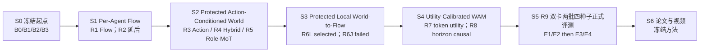
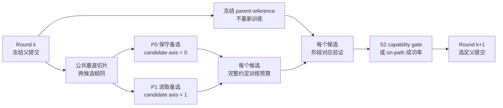

# P1 多机器人 World-Action Flow Matching 技术路线 V3.3（ICRA Fast Track）

> 文档更新：2026-08-02
> 工程起点：当前 `feat/model-improvements` 分支
> 投稿目标：ICRA 2027，[官方 Call for Papers](https://2027.ieee-icra.org/contribute/call-for-icra-2027-papers-now-accepting-submissions/) 截稿时间为 2026-09-15 11:59 PM PST
> 当前状态：M0、M1、S0、S1-R1、S2、S3-R6 已完成；R1 选择 `rectified_flow_cold` F1，R3 选择 own-action-conditioned W1，R5 选择 Protected Shared P0；R6L-P1 五任务宏平均 `39% > 29%` 通过并经 merge commit `7308f5e` 晋级 `feat/model-improvements`，R6J-P1 在可证明上界 `38% < 40%` 后提前停止且不合并；旧 R7a/R7b/R7m 的原设置、`closed/not-run` 结果和关闭报告完整冻结于 8.4，旧 R8 保留于 8.5；执行编号由新 R7（Round 1：Token-Preserving World Utility Coupling）和新 R8（Round 2：Horizon-Causal Action Conditioning）接续，正式多种子复现顺延为 S5-R9
> 评测原则：闭环成功率是最终质量指标；新 R7/R8 还必须用 gate-zero/future-shuffle/action-prefix 干预证明改进确实来自 world branch；S2 predictor 严格 off-path，因此按预测能力与因果门槛推进
> 相关长期方案：[Intent-Grounded Decentralized World-Action Models 多机器人协作研究方案](20260724_INTENT_GROUNDED_DECENTRALIZED_WORLD_ACTION_MODELS_MULTI_ROBOT_COLLABORATION_RESEARCH_PLAN_V2.0_ZH.md)

## 1. 本次路线调整的结论

ICRA 截稿临近，后续不再按旧版 M3–M11 的长串行路线推进。当前分支直接作为工程起点，压缩成一条可以在约七周内形成论文闭环的主线：

> 按机器人组织固定第三人称 RGB 上下文，用 Rectified Flow / Flow Matching 生成每台机器人的动作；以已经验收合并的 R6L-P1 为可精确回退的父方案，先保留 future 的 source/horizon/spatial token 并用下游 Flow 误差校准其效用，再把 world predictor 的动作条件从“整段 100 步平均”改为严格 horizon-causal 的动作前缀。R6J 的直接 peer/shared 平均注入仍是失败消融；只有经 utility routing 重新证明有用的 future evidence 才能恢复为正向主张。

本次调整包含十项硬决策：

1. **当前分支就是起点。** 不重写已经验证的数据接口、DINOv3、按机器人视图、共享解码器、dense/MoE、时间集成、checkpoint 和闭环评测基础；现有 task-balanced sampler 保留为回归基线，新轮次只把其采样分布升级为层级均衡。
2. **最终目标是 World Action Model 与 Flow Matching。** 旧的 CVAE 动作分块模型仅保留为历史基线；论文标题、方法名和主张不以 ACT 为目标。
3. **每个候选只回答一个可归因问题。** R7/R8 允许先落一个两候选共用的公共垂直切片，再让两卡候选只沿一个轴分叉；公共切片、候选差异和 R6 parent reference 必须分别记录，不能把两项共同改动伪装成 P1 的单变量收益。
4. **使用两卡训练真正的备选路线。** R7 固定 `GPU0=token routing without WUC`、`GPU1=token routing + WUC`；R8 固定 `GPU0=horizon prefix mean`、`GPU1=causal prefix cross-attention`。每个候选独占一张卡并使用相同有效 batch、updates、sampler 和评测协议；候选被预注册止损规则淘汰后，释放的 GPU 立即转做 causal intervention、正式复现准备或保底分支评测，不把两卡绑成一个候选的 DDP。
5. **暂时舍弃 active-agent loss weighting。** 训练目标不再根据动作幅度、active/inactive 标签或机器人活跃比例调整权重。所有 agent 使用相同损失规则，activity 最多保留为 debugging log，不参与反向传播或候选选择。
6. **闭环成功率决定质量，因果干预决定 claim 是否成立。** R6 继续服从已经冻结的五任务宏平均规则；R7/R8 的 normal 闭环必须不低于 parent，同时严格优于 gate-zero/shuffled future，避免再次出现“有 world branch 但动作并不依赖它”。S2 predictor 严格 off-path，仍只用 held-out prediction、action/peer-action shuffle 与 action-equivalence smoke。
7. **own predictor 从软约束改为硬保护。** 旧 R4 已证明 multi-head、own residual gate、分组梯度裁剪和随机数流隔离都不能保证逐任务 own no-regression。新 R5 固定从同一个合格 P0 own checkpoint 出发，own tower 以 `eval + frozen + optimizer-excluded` 方式保持函数不变；peer/shared 只能单向读取 detached own 表示，不能反向改写 own 输出。
8. **完整吸收 Stereo-CoRE 的有效/无效结论，不移植其策略。** 保留 capability-only 路由、每 4 步强制分支反事实、router-only stop-gradient teacher、rank-32 低秩容量、层级均衡采样和正式优化规模；同时按其最终消融把 `relation/specialization/anchor` 永久设为 0，并修复 forced-train/top-2-test 错配。不复制代码、权重、腕部 RGB-D、深度分支或 policy expert；我们的路由对象是 world future evidence，不是动作专家。
9. **扩大训练以有效机器人样本为单位。** 同事正式配置的事实预算是 `batch 40 × 120,000 = 4.8M` 个本地机器人窗口；我们的一个 team window 平均含 `3.2` 台有效机器人，严格对齐预算定为 `effective team batch 12 × 125,000 updates × 3.2 = 4.8M`。禁止把 team batch 40 直接当作“持平”，因为那相当于约 128 个机器人窗口/更新并会改变比较口径。
10. **扩大预算时不能冻结欠训练的任务模块。** DINOv3、数据/PCA contract 与一份不可变 R6L 回退模型继续冻结；但正式 R7/R8 候选必须从已验收 checkpoint 创建 trainable clone，对 Flow、local/team future predictor 和旧 R6 adapter 做分阶段低学习率续训。`10k×team batch 1` 的 world modules 不能只因已经验收就永久冻结，再让新 router 单独吃满 4.8M 样本。

## 2. 论文目标与边界

### 2.1 暂定论文题目（R7-P1 胜出时）

**Utility-Calibrated Future Evidence for World-Conditioned Flow Matching in Multi-Robot Collaboration**

中文工作名：

**面向多机器人协作的效用校准未来证据条件 Flow Matching**

当前已验收方法固定为 `s3_r6l_protected_local_gated`，也是 R7 的不可变回退点。只有 `R7-P1 WUC` 被选中时，最终方法才命名为 **UC-WAM（Utility-Calibrated World-Action Model）**；若 R7-P0 胜出则使用 **Token-Preserving WAM**，R8 通过后再称 **Horizon-Causal WAM**，不得继续使用 “Utility-Calibrated”。若 R7 未通过，论文方法退回 R6L-P1 与旧题目；若 R7 通过而 R8 未通过，则以 R7 winner 作为最终方法，不为追求新名称牺牲已成立的闭环结果。

### 2.2 核心研究问题

论文在 R6 已回答的问题上追加两个递进问题：

> （1）不再平均 future token，并让路由权重与每组 future evidence 在强制单组条件下的下游 Flow 误差对齐，能否稳定超过 R6L-P1？（2）让每个预测 horizon 只读取对应动作前缀并进行有限联合微调，能否进一步提升 world model 的 action-awareness 与闭环成功率？

目标计算图为：

$$
\hat{\mathbf z}_{t+1:t+H}^{i}
=
W_{\phi,\mathrm{own}}
\left(
\mathbf h_t^{i},
\mathbf x_\tau^{i},
\tau
\right),
$$

$$
\mathbf v_\theta^i
=
F_\theta
\left(
\mathbf x_\tau^i,
\tau,
\mathbf h_t^i,
\hat{\mathbf z}_{t+1:t+H}^{i}
\right),
$$

R7/R8 将上述标量式注入扩展为：

$$
\mathbf v_{\mathrm{UC}}^{i,j}
=
\mathbf v_{\mathrm{R6}}^{i,j}
+
g^{i,j}
\sum_{m}\pi_{m}^{i,j}\,
\Delta\mathbf v_{m}^{i,j},
\qquad
m=(\mathrm{source},\mathrm{horizon}),
$$

其中 spatial token 不在 $m$ 内先行池化，而是在每个 source/horizon 组内由第 $j$ 个 action query 直接 cross-attend。这里：

- $\mathbf h_t^i$ 是第 $i$ 台机器人的视觉、状态、动作历史和任务上下文；
- $\mathbf x_\tau^i$ 是 Flow 中间状态或候选动作；
- $W_{\phi,\mathrm{own}}$ 根据第 $i$ 台机器人的候选动作预测其受保护本地未来 latent；
- $F_\theta$ 预测第 $i$ 台机器人的速度场，R6 通过有界、零初始化 gate 显式读取自己的预测未来；
- $\pi_m^{i,j}$ 是 R7 新增的 future-evidence dense routing，不是 policy expert 的 top-2 router；
- $g^{i,j}=0$ 时动作必须逐元素退化为已合并 R6L-P1，而不是只近似退化到另一个重训基线；
- 推理时只能向动作路径输入**预测未来**，不能输入真实未来。

如果未来分支只作为辅助损失、没有回到速度场，它只能叫 `Flow + auxiliary future prediction`，不能作为最终 WAM 主张。R6J 已经说明“加入 peer/shared future”本身不保证闭环收益：其五任务最好上界仍低于控制，因此跨智能体 future coupling 不进入最终正向主张。

### 2.3 截至 2026-08-02 的新颖性研判

**结论：宽泛的 cross-agent world-to-flow 目标未被 R6 的直接平均注入支持；收紧后的 protected local-future gated residual 已获得单轮五任务正向证据。新 R7/R8 不推翻这个结论，而是检验失败是否来自 token/horizon 平均与缺乏下游效用监督；最终仍需 S5-R9 多种子复现才能形成论文结论。**

代码已经通过通用 `CrossAgentWorldConditionedFlow` backend 实现 local/team 两种 future scope 和 gated velocity residual；但“实现了接口”不等于“实验支持主张”。五任务闭环只支持 local scope，team/shared scope 的最好上界低于控制。因此当前主线只能把 `s3_r6l_protected_local_gated` 称为晋级方法，cross-agent scope 必须作为失败消融，不能用类名或 capability 指标替代闭环证据。

以下组件不能单独作为论文贡献：

| 路线组件 | 最接近工作与碰撞 | 判断 |
|---|---|---|
| Flow Matching 动作生成 | [$\pi_0$](https://arxiv.org/abs/2410.24164) 等已有 Flow action expert | 非新颖基础组件 |
| previous-chunk warm start | [Streaming Flow Policy](https://arxiv.org/abs/2505.21851) 从上一动作附近的窄高斯出发并流式积分 | 只作为工程候选 |
| latent future 进入 action generation | [LaWAM](https://arxiv.org/abs/2606.15768) 已用动作条件 latent world model 预测视觉 subgoal 并条件化动作生成；[AGRA](https://arxiv.org/abs/2606.12217) 已研究 world-action 表示接口并使用因果干预诊断 | 直接碰撞，不能泛称首创 |
| 只在训练期使用未来表示 | [Being-H0.7](https://arxiv.org/abs/2605.00078) 以未来 posterior 对齐部署 prior；[Fast-WAM](https://arxiv.org/abs/2603.16666) 质疑测试时显式未来预测的必要性 | auxiliary future 不足以支撑 WAM 主张 |
| 生成候选并由 world model 评分 | [Cortex 2.0](https://arxiv.org/abs/2604.20246) 在视觉 latent 空间生成、评分并选择候选未来 | 移出 ICRA 主线 |
| 多机器人 Flow 轨迹/动作协同 | [GCo](https://arxiv.org/abs/2511.10874) 已做多机器人接触与轨迹 Flow co-generation；[Flow-Opt](https://arxiv.org/abs/2510.09204) 已做带置换不变编码的集中式多机器人 Flow 轨迹优化 | “multi-robot + Flow” 本身不新颖 |
| action-conditioned multiview world model | [A2World](https://arxiv.org/abs/2606.29501) 已建模动作驱动的多视角场景演化 | 多视角预测不是核心贡献 |

在本轮检索到的最接近工作中，原计划关注以下完整机制：

> **对联合候选 action chunk 建模其跨 agent 与共享对象的后果，再将“自己的未来 + peer 后果 + shared-object 后果”逐 Flow step 注入共享参数、按 agent 分解的速度场，并以跨 agent 因果干预证明该耦合改善闭环协作。**

R6J 的闭环验收没有支持上述完整 cross-agent 机制，因此不能再把它作为已经成立的论文贡献。截至 R6，已成立的贡献收敛为：

1. **方法贡献：** `candidate action → protected local future → zero-init gated velocity residual`，并在 gate 为零或 future 无效时精确回退到 base Flow；
2. **受保护耦合证据：** 在 R6 阶段 own predictor 始终冻结、optimizer-excluded 且逐元素等价，只有 adapter/gate 改变动作路径；
3. **闭环证据：** R6L-P1 在相同五任务、seeds 与 pair-exact fresh Flow 下宏平均提高 `10pp`，同时完整披露 LongPipelineDelivery 的 `-15pp` 与 R6J team/shared 注入失败，避免把负结果包装成 cross-agent 提升。

若新轮次通过，再追加两项条件贡献：R7 的 token-preserving future-evidence utility coupling，以及 R8 的 horizon-causal、有限联合微调 world model；未通过就不写入正向贡献。投稿前不得使用 “first” 或 “首次”。R7/R8 的因果干预既约束工程验收，也约束最终 claim，不能用更低的训练 loss 替代。

### 2.4 Stereo-CoRE 的吸收边界与证据等级

以下事实来自同事冻结代码、`docs/METHOD.md`、`docs/RESULTS.md`、最终 `configs/stereo_core/checkpoint_120000.json` 与对应评测 JSON，而不是从腕部视角结果反推机制。最终 Stereo-CoRE 是 **Stereo-ACT + Local-ARCA + capability-only CoRE**；FFN-MoE 只完成了容量验证，没有叠加进最终方法。正式训练使用单机器人本地样本 `batch_size=40`、`updates=120000`、总预算 `4,800,000`；输入严格是单机腕部 RGB-D 与 own qpos，不含 task/agent ID、语言、通信、global/peer view 或 peer action。其冻结 SR@1 为 `99/100、100/100、99/100、94/100、29/100`，宏平均 `84.2%`；这些数字只证明同事路线在其输入协议下有效，与本路线的固定第三人称 RGB 结果不作数值横比。

证据入口固定为本仓库 `docs/peer/P3｜多机协作(1).pdf`、`docs/peer/Stereo-CoRE｜导师汇报(1).pdf`，以及同级冻结 release 的 `docs/METHOD.md`、`docs/RESULTS.md`、`stereo_core/pair_route_model.py`、`stereo_core/stereo_decoder_variants.py`、`stereo_core/five_task_contract.py`、`stereo_core/train_pair_route_single_b40_120k.py` 与 `configs/stereo_core/checkpoint_120000.json`。若报告中的阶段数字与 release 最终冻结数字不同，以最终 config、SR@1 JSON 和 release docs 为准。

同事最终消融给出的结论必须按“正结论直接吸收、负结论明确禁用、协议差异做等价改写”处理，而不能只模糊借鉴一个 MoE 名称：

| 同事冻结结论（事实） | 本路线的工程决策 | 落地轮次/配置 |
|---|---|---|
| 无约束 Local-ARCA router 接近均匀且语义不稳定；普通 imitation/balance loss 不足以形成能力分工 | router 必须直接由“该分支能否降低动作误差”监督，不能把 attention weight 自动解释成 utility | R7-P1 `utility_coupling_weight=0.05` |
| 每 4 个 optimizer updates，对一个样本依次强制 4 个 expert，按逐 action-query MSE 形成 stop-gradient capability target | 每 4 个 updates 对一个 team sample 依次强制 12 个 `source×horizon` evidence groups；逐 agent、逐 action-query 计算 Flow velocity error | R7 公共 forced-evidence audit；P1 反传 WUC，P0 只记录 |
| capability target 已 detach，只监督 router；正常 imitation 负责训练 policy/expert，避免 winner-take-all 自强化 | `q_util`、Flow query 与 evidence summary 在 WUC 分支全部 detach；WUC 只能更新 `FutureEvidenceRouter`，正常 Flow loss 才更新低秩 evidence adapters、router 与 residual gate | R7 trainer 的梯度白名单与单元测试 |
| 最终 capability-only 配置把 `relation/specialization/anchor` 全设为 0；同规模 full variant 虽路由更尖锐，但 LPD first20 为 `1/20`，capability-only 为 `19/20` | R7/R8 正式配置都锁死 `relation_weight=0`、`specialization_weight=0`、`anchor_weight=0`；不加 partner-intent teacher、route entropy 奖励或旧模型 anchor | R7/R8 pair checker 必须拒绝非零值 |
| 更尖锐、更可解释的 routing 不等于 expert 真有能力 | 不用 route entropy、top-1 占比或可视化分离度选 winner；只认 held-out error、因果干预与闭环成功率 | R7/R8 验收 |
| 最终 weighted-items 按 `task→episode→local arm→time` 分配采样概率，sampling label 不进入 policy | 改成 `task→episode→time→all-valid-agent`：team window 必须整体保留，agent 轴用 team 内等权 mean 实现，不把 task label 输入模型 | R7/R8 共用 sampler |
| Local-ARCA 在 7 层 decoder 中使用 4 个 rank-32 role adapter，证明低秩分支足以承载差异化能力 | 独立实现 rank-32 future-evidence adapters；不复制 policy decoder/role 权重，路由对象改为 12 个 world-evidence groups | R7 公共结构 `evidence_rank=32` |
| counterfactual 训练强制单 expert，但正常推理 top-2；报告未覆盖所有 6 个 expert pair，是其已知限制 | 不继承这个错配：正常训练与推理都用相同 dense masked-softmax；强制单组仅生成 detached target/诊断 | R7 公共结构 `route_mode=dense` |
| relation teacher、team-belief distillation 没有形成稳定的本地可恢复协作增益 | 不引入同事 teacher、同步 team action target 或“显式伙伴意图”claim；peer/shared 证据只有通过 shuffle/utility gate 后才可写入贡献 | R7/R8 全程 |
| RGB→RGB-D/腕部视角是其最大感知增益来源之一，但 TakePhoto 仍只有 `29/100` | 按用户约束保持第三人称 RGB、无深度、不换相机；不能期待 capability routing 单独解决 TakePhoto，必须保留任务级失败分析 | 全程冻结输入协议 |
| 最终优化配方为 body LR `2e-4`、router LR `3e-4`、weight decay `1e-4`、clip `1.0`、workers `8`、500-step warmup + cosine、120k updates | 新模块沿用 `2e-4/3e-4`；旧 Flow/world clones 为防灾难性遗忘降到 `2e-5/5e-5`，但使用相同 warmup/cosine、样本量上限和 checkpoint 节奏 | 第 9.4 节 |

这里的“充分吸收”不是复制同事代码或把 policy expert 改名成 world expert，而是把已经被他消融支持的因果训练原则完整映射到本模型，并把已经被他否定的辅助目标从正式配置中删除。具体边界如下：

| 层级 | Stereo-CoRE | 本路线 R7/R8 | 处理结论 |
|---|---|---|---|
| 感知 | 腕部 RGB-D、本地 qpos | 固定第三人称 RGB、无深度、原 18D state | 不吸收，遵守输入约束 |
| 被路由对象 | 4 个 policy role/expert | own/peer/shared × 4 horizons 的 12 个 future-evidence groups | 吸收 capability routing，改写对象 |
| 低秩容量 | decoder 内 rank-32 role adapters | world-to-Flow 外挂 rank-32 evidence adapters | 吸收小参数分支原则，独立实现 |
| 能力监督 | 强制 expert 后的动作重建误差 | 强制 evidence group 后的 Flow velocity error | 直接吸收下游能力监督 |
| 推理 | top-2 expert | dense utility mixture + query-wise residual gate | 修复已知 train/inference mismatch |
| 训练数据 | local arm item | 含 2–4 agent 的完整 team window | 用层级采样与 team-mean 做等价适配 |
| 负结论 | relation/spec/anchor 不进入 final | 三项权重永久为 0 | 直接吸收失败消融 |
| 研究判断 | 优势可能同时来自 RGB-D、能力耦合、均衡采样和更大预算 | R7 隔离 capability-only，R8 隔离 action-aware dynamics | 必须由配对实验验证，不能当作既成结论 |

可证伪预测如下：

1. 若 R7-P1 的 dense router probability 与强制 evidence 的真实负误差在 held-out episode 上无正相关，说明 CoRE 原理没有成功迁移到 world evidence，应保留 R7-P0 或退回 R6；
2. 若 normal future 与 force-gate-zero/shuffled future 的闭环结果没有严格差异，则 world branch 仍可能只是相关旁路，R7 不得作为因果贡献；
3. 若 R8 的 action-prefix shuffle 不增加相应 horizon 的 future loss，或更改 $h$ 之后的动作会改变 horizon $h$ 输出，则新的 action conditioning 没有建立预期因果结构，R8 失败；
4. 若扩大预算只继续降低训练 loss 而 held-out future/Flow error 与闭环成功率在两个 milestone 内不改善，则判为过拟合并提前停止，不以“尚未跑满 4.8M”为由继续烧卡。

### 2.5 ICRA 快线不做什么

以下内容保留为长期方向，但不进入本次主线：

- 全分辨率视频生成式 world model；
- 任意机器人数量的严格理论泛化；
- 严格去中心化通信协议和真实网络部署；
- 大规模语言意图 grounding；
- 强化学习或在线探索；
- 5B/14B 模型扩展；
- 自建大量新任务或重新采集大规模数据。

本次使用低维、可验证的未来目标：未来 proprioceptive state、未来 DINO latent、物体或团队进度。论文价值来自“world prediction 如何进入 action flow”，不是视频生成规模。

## 3. 当前分支：保留什么，替换什么

### 3.1 直接保留

| 当前能力 | 快线中的位置 |
|---|---|
| RoboFactory 原生数据、状态/动作 mask、多任务 contract | 所有候选共用的数据基础 |
| 冻结 DINOv3 与完整 spatial patch tokens | 视觉上下文与未来视觉 latent 目标 |
| 18D 状态视图、8D 动作槽等按机器人数据视图 | agent factorization 起点 |
| 共享 decoder、dense 与 top-2 MoE 两种实现 | S1 并行结构候选 |
| temporal ensemble 与 latest-chunk 路径 | 统一推理协议及消融 |
| task-balanced sampler | 保留接口，S4 升级为 task→episode→time 层级均衡 |
| checkpoint、Gate20 与成功率统计工具 | 闭环迭代基础 |
| M2 中已有的 Rectified Flow、block-causal 上下文和未来预测代码 | 新 Flow/WAM 的实现参考 |

当前静态候选的初步闭环结果可以证明这条分支适合继续改，但不能直接作为论文结果。已有不同提交间的结果变化还混合了多项改动，正式表格必须从冻结的数据、评测种子和候选父提交重新跑。

### 3.2 必须替换

- CVAE posterior、KL 目标和直接动作 MSE 不再是最终动作生成目标；
- 旧类名及 `static_act` 路径只作为 legacy baseline，不作为新方法命名空间；
- 只预测未来但不影响动作的旁路结构不能作为最终方法；
- 固定拼接整队动作的单头输出要改成按 agent slot 组织、共享参数的 Flow expert；
- 旧 M2 不再因“还没完整跑完”阻塞论文快线。

### 3.3 active-agent loss weighting 决策

从 2026-07-28 起，所有快线训练使用与 activity 无关的损失约定：

$$
\mathcal L_b =
\frac{
\sum_{t,d} m_{btd}\,q_t\,e_{btd}
}{
\sum_{t,d} m_{btd}\,q_t
},
\qquad
\mathcal L = \frac{1}{B}\sum_b \mathcal L_b.
$$

其中 $m$ 只表示有效时间步和有效维度，$q_t$ 只允许表达对所有 agent 一致的 executed-prefix 等时序权重。禁止让 $q$ 依赖动作幅度、active/inactive 判定或 agent 身份。

具体约束：

- 删除训练配置中的 `active_agent_weight`、`active_delta_threshold`、`active_agent_loss_weight` 和 `active_agent_delta_threshold`；
- Flow velocity、部署端点、平滑项、未来状态和 legacy reconstruction loss 均不做 active-agent 重加权；
- 不记录会被误认为训练目标一部分的 `active_agent_fraction` loss metric；
- teacher-context 的 active/inactive 拆分最多保留为 debugging log，不进入 evidence board；
- ICRA 截稿前不把该机制重新加回主线。若以后重启，必须作为单独、受控且多随机种子的消融。

## 4. 快线总览



S0 是起点选择，不计作结构改进。S1–S4 由若干“两卡配对微轮次”组成。R7/R8 的 P0/P1 共享各自 round 的公共垂直切片，只在表中预注册的候选轴上分叉；两者还必须共同对照冻结的前一轮 winner：



当前服务器有两张卡，每轮优先保留两个完整备选，而不是用两卡 DDP 只训练一个候选：

```text
R7 GPU 0/1：token-preserving / token-preserving + WUC
R8 GPU 0/1：prefix-mean / causal-prefix-attention
R9 第一批 GPU 0/1：E1 / E2
R9 第二批 GPU 0/1：E3 / E4
```

如果 $\Delta_{\mathrm{decoder}}$ 与 $\Delta_{\mathrm{source\_prior}}$ 都没有造成成功率退步，可以启动组合闭环；组合相对其 P0 不退步即可进入下一阶段。

“单步改进”保持轻量：

1. 只回答一个研究假设；
2. 只改变一个配置轴或一条模型接口；
3. 数据、seed、训练预算、闭环协议和其他模型路径不变；
4. 可以通过一个 flag 或一个 commit 完整回退；
5. 尽量保持改动可独立回退。

结构例外有两项。第一项是 R1 的 `legacy action generator → cold-start Rectified Flow`：head、FM loss 和 ODE solver 必须作为一个可运行的原子垂直切片共同替换，但其研究变量只有 `action_generator`；上下文、decoder、数据、action chunk、ensemble 和评测协议全部保持不变。第二项是新 R4 的 hybrid checkpoint 诊断：它不训练、不拟合统计量、不产生可晋级模型，只验证“冻结 P0 own 路径 + 旧 P1 team 路径”是否在函数组合后已经满足 R5 的目标。

所有微轮次至少保留三条规则：

- P0/P1 使用相同数据 split、训练预算与阶段对应协议；
- 公共垂直切片、P0/P1 唯一差异与冻结 parent reference 分开记录；
- S2 采用 prediction/shuffle capability gate；R6 使用已经冻结的五任务宏平均规则；R7/R8 同时要求闭环不低于 parent 和 world branch 的 causal intervention 有效。主动停止的候选直接退出比较，不阻塞另一候选。

## 5. S0：冻结工程起点与协作任务（07-28）

### 5.1 四个并行参考方案

| 卡 | 方案 | 作用 |
|---|---|---|
| B0 | 当前 sparse MoE legacy chunk policy + temporal ensemble | 当前分支行为参考 |
| B1 | compute-matched dense legacy chunk policy + temporal ensemble | 判断 MoE 是否值得继续 |
| B2 | 现有 M2 Rectified Flow，关闭或旁路旧 future head | Flow 工程参考 |
| B3 | 当前 sparse MoE legacy chunk policy + latest chunk | 隔离 temporal ensemble 的实际贡献 |

四卡使用相同数据 manifest、DINO 权重、动作归一化、训练 update、推理频率和 Gate20 初始条件。B0 与 B3 允许复用同一公平训练 checkpoint，因为二者只改变推理聚合；其他结构不得复用 checkpoint。旧 checkpoint 只用于工程 smoke test。

S0 只建立参考坐标，不产生可外推的结构 winner：B1/B3 分别诊断 decoder 与推理聚合，B2 是旧 M2 工程参考。由于 B2 训练耗时超过 fast-track 预算，operator 决定在 Gate20 前主动终止 B2，并以已完成成功率评测的 B0 作为 R1 工程父方案。该处置不等于证明 legacy action generator 优于 Rectified Flow；正式 Flow 改进仍在 R1 中从 B0 父方案以原子垂直切片重新实现和验证。

#### 5.1.1 Vast.ai 四卡从零一键部署与运行

以下命令假设远程服务器已经自动进入唯一的永久 tmux session，且 `/workspace/fe-pc-wam` 不存在。命令不执行 `apt update`，也不允许通过 `export HF_TOKEN=...` 传递 Hugging Face token：

```bash
cd /workspace

# 1. 检查服务器必需命令；不执行 apt update。
for s0_cmd in git tmux jq python3 nvidia-smi flock df sha256sum; do
  command -v "${s0_cmd}" >/dev/null || {
    echo "缺少服务器命令：${s0_cmd}"
    exit 1
  }
done

# 2. 确认当前就在 Vast.ai 提供的永久 tmux session 中。
test -n "${TMUX:-}" || {
  echo "错误：当前终端不在 tmux session 中"
  exit 1
}

test "$(tmux list-sessions -F '#S' | wc -l)" -eq 1 || {
  echo "错误：服务器必须有且仅有一个 tmux session"
  tmux list-sessions
  exit 1
}

echo "当前 tmux session：$(tmux display-message -p '#S')"

# 3. 确认正好有四张 GPU。
nvidia-smi -L

test "$(nvidia-smi -L | wc -l)" -eq 4 || {
  echo "错误：没有检测到正好四张 GPU"
  exit 1
}

# 4. 检查磁盘空间。
df -h /workspace

# 5. 确保目标目录不存在，防止覆盖已有文件。
test ! -e /workspace/fe-pc-wam || {
  echo "错误：/workspace/fe-pc-wam 已存在，请不要覆盖"
  exit 1
}

# 6. 下载模型改进分支代码。
git clone \
  --branch feat/model-improvements \
  --single-branch \
  https://github.com/Jeong-zju/fe-pc-wam.git \
  /workspace/fe-pc-wam

cd /workspace/fe-pc-wam

# 7. 校验代码至少包含已验证的一键启动、B2 路由和安全终止能力。
git rev-parse --short HEAD

git merge-base --is-ancestor 2de5656 HEAD || {
  echo "错误：远程代码早于最低安全版本 2de5656"
  exit 1
}

test -x ./scripts/launch_s0_4gpu_tmux.sh
test -x ./scripts/stop_s0_4gpu_tmux.sh

# 8. 先检查一键部署计划；不会下载、训练或创建窗口。
./scripts/launch_s0_4gpu_tmux.sh \
  --run-id s0-round1 \
  --dry-run

# 9. 正式一键启动。
./scripts/launch_s0_4gpu_tmux.sh \
  --run-id s0-round1
```

正式启动时在隐藏提示中粘贴同时具备 DINOv3 gated 模型、两个训练数据集和 `RoboFactory_asset` 读取权限的 HF token。launcher 只在永久 session 中创建 `s0-round1-prepare`、`s0-round1-b0`、`s0-round1-b1`、`s0-round1-b2`、`s0-round1-b3` 和 `s0-round1-monitor`，不会创建、attach 或退出 tmux session。

#### 5.1.2 当前 S0 run 一键终止与窗口关闭

必须从永久 session 中不属于目标 run 的基础 `bash` window 执行。以下命令先核验工具、session、代码和 run manifest，打印只读终止计划，然后终止 `s0-round1` 的训练、验证、RoboFactory rollout server、dataloader 和 monitor 进程，最后关闭上述六个 window：

```bash
cd /workspace/fe-pc-wam

# 1. 检查终止器依赖；不执行 apt update。
for s0_stop_cmd in tmux jq grep nvidia-smi realpath sleep; do
  command -v "${s0_stop_cmd}" >/dev/null || {
    echo "缺少服务器命令：${s0_stop_cmd}"
    exit 1
  }
done

# 2. 确认仍在唯一的永久 tmux session 中。
test -n "${TMUX:-}" || {
  echo "错误：当前终端不在 tmux session 中"
  exit 1
}

test "$(tmux list-sessions -F '#S' | wc -l)" -eq 1 || {
  echo "错误：服务器必须有且仅有一个 tmux session"
  tmux list-sessions
  exit 1
}

cd /workspace/fe-pc-wam

# 3. 更新终止器并校验最低安全版本。
git switch feat/model-improvements
git pull --ff-only

git merge-base --is-ancestor 2de5656 HEAD || {
  echo "错误：代码不包含安全终止器 2de5656"
  exit 1
}

test -x ./scripts/stop_s0_4gpu_tmux.sh
test -f ./outputs/s0_runs/s0-round1/run_manifest.json

# 4. 只读检查：不发送信号、不关闭窗口。
./scripts/stop_s0_4gpu_tmux.sh \
  --run-id s0-round1 \
  --dry-run

# 5. 正式终止该 run 并关闭它创建的六个 window。
./scripts/stop_s0_4gpu_tmux.sh \
  --run-id s0-round1

# 6. 核对永久 session 仍存在，并查看是否还有 GPU 计算进程。
tmux list-windows \
  -F '#{window_index}: #{window_name} pane_dead=#{pane_dead}'

nvidia-smi \
  --query-compute-apps=pid,process_name,used_memory \
  --format=csv,noheader
```

终止器只匹配 manifest 中记录的 session/window 前缀，以及进程环境中与本轮绝对路径完全一致的 `S0_RUN_ROOT`。它先发送 Ctrl-C，等待 10 秒，再按需发送 SIGTERM 和 SIGKILL。它禁止从目标 run window 内自我终止，也不会调用 `tmux kill-session`，不会删除数据集、DINO/RoboFactory 权重、worktree、checkpoint、partial/resume checkpoint、日志、视频或 Gate JSON。

### 5.2 S0 Round 1 闭合决策（2026-07-28）

`s0-round1` 的 monitor 在 `2026-07-28T14:10:34.935096+00:00` 显示 B0、B1、B3 已完成 Gate20；冻结协议规定使用 seed `900–919`。B0/B1 均完成 80,000 updates，monitor 舍入后的末端 loss 均为 `0.002`；B3 按设计复用 B0 immutable checkpoint、只改变 chunk aggregation，因此其 `not started` 训练状态不是缺失实验。B2 在该快照中仅完成 `4,684/80,000` updates（5.9%）；因训练耗时过长，operator 已请求在 Gate20 前主动终止，不再等待其完成后才进入 R1。

| 候选 | LiftBarrier | LongPipelineDelivery | 相对 B0 | 阶段处置 |
|---|---:|---:|---|---|
| B0 sparse MoE + temporal ensemble | 17/20（85%） | 19/20（95%） | — | 选为 R1 工程父方案 |
| B1 compute-matched dense + temporal ensemble | 11/20（55%） | 0/20（0%） | `-30pp / -95pp` | 不替换 sparse MoE；待训练 seed 复验后再作架构级外推 |
| B2 Rectified Flow reference | — | — | 不可比较 | Gate20 前 operator stop；不作模型结论 |
| B3 B0 checkpoint + latest chunk | 6/20（30%） | 0/20（0%） | `-55pp / -95pp` | 否决 latest chunk；保留 temporal ensemble |

阶段判断如下：

- **B0 是后续 R1 的工程父方案。** 它是三条已完成分支中唯一在两个任务都有成功的坐标，因此 S0 不再等待 B2，可以进入下一阶段。该选择不是正式验收，也不构成 legacy action generator 普遍优于 Flow 的结论。
- **B2 记为主动停止，不记为模型失败。** 原因是训练 wall time 超出 fast-track 预算；它没有完成相同 update、没有 Gate20 成功率，因此不能按 0% 计分，也不能用于比较 B0 与 Flow。保留最后 progress、日志、partial/resume checkpoint 和 operator-stop 原因即可。
- **B0/B3 是本轮最干净的受控对比。** 冻结 manifest 与 launcher 要求 B3 复用 B0 checkpoint 和 paired seeds，且 B3 的 `not started` 与该协议一致；latest chunk 下 LPD 从 19/20 降至 0/20，说明 temporal ensemble 是有效策略的一部分，后续 legacy 对照保留 temporal ensemble。
- **B0/B1 明确否决当前 dense 替代方案，但结论强度低于 B0/B3。** 两者训练协议一致但 checkpoint 来自独立训练；当前结果足以作工程选型，不足以用单个训练 seed 声称 MoE 普遍优于 dense。
- **LPD 是更有区分力的回归任务。** B1/B3 在 LiftBarrier 尚有 11/20 和 6/20，却在 LPD 同时为 0/20；后续轮次不得用 LiftBarrier 单任务成功掩盖长时程协调与时序稳定性失败。
- **训练 loss 不参与闭环选型。** B0/B1 的 monitor 舍入末端 loss 同为 `0.002`，但 LiftBarrier 相差 30pp、LPD 相差 95pp；后续只按各任务闭环成功率选择候选。

monitor 中 `gate=pass` 对应 `gate_summary.passed=true`，`gate=done` 对应 gate 已完成但 `passed=false`。S0 已直接选择 B0 进入 R1，不再等待额外审计、正式 100-episode gate、checkpoint SHA 或 B2 结果。相关信息可以继续记录，但不阻塞推进。

### 5.3 S0 推进规则

S0 不再设置协作必要性审计或额外准入清单。B0 直接作为 R1 父方案；R6 以前进入动作路径的候选与 B0 或各自父方案比较闭环成功率，S2 off-path predictor 使用第 7 节的 capability gate，新 R7/R8 则执行第 9.5 节预注册的 world/action 因果门槛。

### 5.4 B0 进入 S1/R1

使用 `round/s0-b0-legacy-moe-ensemble` 作为 R1 工程父方案即可。除能够完成闭环并输出成功率外，不增加其他进入条件。

## 6. S1：Per-Agent Rectified Flow Action Expert（07-29）

统一 Flow 目标：

$$
\mathbf x_\tau=(1-\tau)\mathbf x_0+\tau\mathbf a^\star,
\qquad
\mathbf v^\star=\mathbf a^\star-\mathbf x_0,
$$

$$
\mathcal L_{\mathrm{FM}}
=
\operatorname{MaskedMean}
\left[
\left\|
\mathbf v_\theta-\mathbf v^\star
\right\|_2^2
\right].
$$

每个 agent 使用共享参数的 action expert，agent identity、task token 和本地/团队上下文通过显式 token 进入，输出保持按 agent slot 组织。

### 6.1 R1：只替换动作生成器（必做，两卡）

| 候选 | 相对父提交的唯一变量 | 固定不变 |
|---|---|---|
| R1-F0 | `action_generator=legacy_cvae`，父方案复跑 | 数据、context、当前 decoder、chunk、ensemble、训练预算 |
| R1-F1 | `action_generator=rectified_flow_cold` | 与 F0 相同 |

F1 的 head、FM loss 和 ODE solver 作为一个原子垂直切片共同实现；不得同时把 MoE 改成 dense、加入 warm start、改变 temporal ensemble 或接入 future latent。默认使用 4-step Euler，1-step Euler 与 2-step Heun 延后为冻结 checkpoint 上的推理消融。

R1 只比较 F0/F1 的同任务闭环成功率。若 F1 在每个任务都不低于 F0，则通过并进入后续阶段，成功率持平也算通过；若任一任务下降，则保留 F0。

#### 6.1.1 S1-R1 两分支与两卡隔离契约

S1-R1 从 `feat/model-improvements` 的同一公共基础设施提交创建两个分支：`s1/r1-f0-legacy` 只把 S0-B0 固化为 R1-F0 复跑坐标，`s1/r1-f1-flow-cold` 只完成 `legacy_cvae → rectified_flow_cold` 原子替换。两个分支分别使用 GPU 0/1、独立 worktree、独立 checkpoint/output/log，但通过符号链接只读共享模型改进分支中的 `datasets/` 与 `artifacts/`，并共享同一个 uv 环境、uv cache 和 RoboFactory 安装。F0/F1 都固定 80,000 updates、训练 seed 101、Gate20 seeds 900–919、sparse top-2 MoE、DINOv3、100-step chunk 和 temporal ensemble；F1 默认使用标准高斯 cold source、FM velocity MSE 和 4-step Euler，不开启 warm start、future path、dense decoder 或 active-agent weighting。

截至 2026-07-28，本轮公共父提交为 `65ad9de`，F0 实现提交为 `f0043ff`，F1 实现提交为 `00a29c6`。这三个提交只表示代码与运行契约已冻结，不表示 F1 已通过：只有远程训练结束后 F1 在 LiftBarrier 与 LongPipelineDelivery 的 Gate20 成功率都不低于 F0，R1 才能选择 Flow。

##### S1-R1 Round 2 结果与决策（2026-07-29）

`s1-r1-round2` 的 F0/F1 都完成 `80,000/80,000` updates；monitor 舍入后的末端 loss 分别为 `0.003` 和 `0.012`。相同 Gate20 协议下，F0 在 LiftBarrier/LongPipelineDelivery 分别为 `11/20`、`20/20`，F1 分别为 `13/20`、`20/20`。F1 在 LiftBarrier 提高 `2/20`（10 个百分点），在 LongPipelineDelivery 持平，因此满足“每个任务均不低于 F0”的 R1 推进规则，选择 F1 并将 `s1/r1-f1-flow-cold` 合入 `feat/model-improvements`。

| 候选 | 训练 | 末端 loss（monitor） | LiftBarrier | LongPipelineDelivery | R1 决策 |
|---|---:|---:|---:|---:|---|
| F0 legacy CVAE | 80,000/80,000 | 0.003 | 11/20（55%） | 20/20（100%） | 控制组 |
| F1 Rectified Flow cold | 80,000/80,000 | 0.012 | 13/20（65%） | 20/20（100%） | 通过并晋升 |

F1 monitor 的 `failed` 不是闭环失败：两个任务的 40 个 rollout 均已完成，退出码来自 `build_lpd_gate_summary.py` 只接受 `wam/static_act`、不接受 F1 的 `agent_flow` policy kind。合入后的汇总器已把 `agent_flow` 纳入文件型 checkpoint 路径；同步远程原始 rollout 后只需重建 `gate_summary.json`，不需要重新训练或重跑 40 个回合。在汇总 JSON、checkpoint 哈希与 episode-level 记录同步前，本节数字仍按 operator-reported Gate20 结果使用，不外推为正式 100 回合验收或统计显著性结论。

launcher 复用服务器已经存在的唯一永久 tmux session，只创建 `<run-id>-prepare`、`<run-id>-f0`、`<run-id>-f1` 和 `<run-id>-monitor` 四个 window，并为每个 window 设置 `remain-on-exit=on`；它不会创建、attach 或退出 tmux session。monitor 同时显示两条训练的 update/loss、两个闭环任务的成功数、候选 phase 和两张 GPU 的利用率/显存。训练或验证进程退出后 window 仍保留，便于查看日志。

#### 6.1.2 Vast.ai 两卡从零一键部署、训练、验证与监控

以下命令假设 Vast.ai 已经自动进入唯一的永久 tmux session，服务器恰好暴露两张 GPU，且 `/workspace/fe-pc-wam` 尚不存在。命令不会执行 `apt update`，HF token 只会通过隐藏输入和 mode-0600 FIFO 交给共享准备 window，不写进 shell export、tmux command 或 argv：

```bash
cd /workspace

for s1_cmd in git tmux jq python3 nvidia-smi flock df sha256sum; do
  command -v "${s1_cmd}" >/dev/null || {
    echo "缺少服务器命令：${s1_cmd}"
    exit 1
  }
done

test -n "${TMUX:-}" || {
  echo "错误：当前终端不在 Vast.ai 的永久 tmux session 中"
  exit 1
}

test "$(tmux list-sessions -F '#S' | wc -l)" -eq 1 || {
  echo "错误：服务器必须有且仅有一个 tmux session"
  tmux list-sessions
  exit 1
}

test "$(nvidia-smi -L | wc -l)" -eq 2 || {
  echo "错误：S1-R1 必须恰好暴露两张 GPU"
  nvidia-smi -L
  exit 1
}

df -h /workspace

test ! -e /workspace/fe-pc-wam || {
  echo "错误：/workspace/fe-pc-wam 已存在，请不要覆盖"
  exit 1
}

git clone \
  --branch feat/model-improvements \
  --single-branch \
  https://github.com/Jeong-zju/fe-pc-wam.git \
  /workspace/fe-pc-wam

cd /workspace/fe-pc-wam
git rev-parse --short HEAD

test -x ./scripts/launch_s1_r1_2gpu_tmux.sh
test -x ./scripts/stop_s1_r1_2gpu_tmux.sh

./scripts/launch_s1_r1_2gpu_tmux.sh \
  --run-id s1-r1-round1 \
  --dry-run

./scripts/launch_s1_r1_2gpu_tmux.sh \
  --run-id s1-r1-round1
```

正式启动时在隐藏提示中粘贴同时具备 DINOv3 gated 模型、两个训练数据集和 `RoboFactory_asset` 读取权限的 HF token。启动后 launcher 默认切到 `s1-r1-round1-monitor`；可随时从永久 session 的任意非目标 window 执行以下只读监测指令：

共享准备只调用官方基础下载命令 `hf download`：固定关闭 Xet，并用 `--max-workers 1` 串行走普通 HTTP，以避免云主机共享出口请求 `xet-read-token` 时出现 `429 Too Many Requests`。脚本不包含并发下载或重试封装；下载失败后，以新 run-id 重新启动会原地复用已完成文件并续传。

```bash
cd /workspace/fe-pc-wam

python3 scripts/s1_r1_runtime.py monitor \
  --once \
  --run-root outputs/s1_r1_runs/s1-r1-round1

tmux select-window \
  -t "$(tmux display-message -p '#S'):s1-r1-round1-monitor"
```

所有运行产物位于 `/workspace/fe-pc-wam/outputs/s1_r1_runs/s1-r1-round1/`。共享准备日志和哈希分别为 `prepare.log`、`shared_artifact_sha256.txt`；F0/F1 的训练进度、checkpoint、验证 JSON、视频和完整候选日志分别位于 `candidates/f0/` 与 `candidates/f1/`。monitor 中 Gate20 的 `lift=x/20`、`lpd=y/20` 是本轮唯一推进依据：只有 F1 两个任务都不低于 F0 才进入 R2。

共享准备完成后，两个候选还要分别完成数据 manifest/HDF5 身份校验、DINOv3 权重装载、模型与 optimizer 构建、resume 检查、DataLoader worker 启动和首批数据读取。两张 RTX 5090 的常见冷启动时间为 3–15 分钟；云盘较慢时可能达到 20–30 分钟。候选 window 在等待共享准备时每 30 秒打印一次心跳；训练器把上述子阶段写入 `candidates/<f0|f1>/train/stages.jsonl`。monitor 每 5 秒显示当前 startup 子阶段、该阶段持续时间以及 GPU 利用率，产生第一个 optimizer step 后自动切换为 `training` 并显示 update/loss。

#### 6.1.3 S1-R1 一键退出但保留永久 tmux 与全部产物

退出脚本必须从永久 session 中不属于 `s1-r1-round1-prepare/f0/f1/monitor` 的基础 `bash` window 执行。它只根据 run manifest 和进程环境中的绝对 `S1_R1_RUN_ROOT` 定位本轮进程，依次发送 Ctrl-C、SIGTERM、必要时 SIGKILL，再关闭本轮四个 window；不会调用 `tmux kill-session`，不会删除共享数据、DINO/RoboFactory 权重、worktree、checkpoint、resume、日志、视频或验证结果：

```bash
cd /workspace/fe-pc-wam

git switch feat/model-improvements
git pull --ff-only

test -f ./outputs/s1_r1_runs/s1-r1-round1/run_manifest.json
test -x ./scripts/stop_s1_r1_2gpu_tmux.sh

./scripts/stop_s1_r1_2gpu_tmux.sh \
  --run-id s1-r1-round1 \
  --dry-run

./scripts/stop_s1_r1_2gpu_tmux.sh \
  --run-id s1-r1-round1

tmux list-windows \
  -F '#{window_index}: #{window_name} pane_dead=#{pane_dead}'

nvidia-smi \
  --query-compute-apps=pid,process_name,used_memory \
  --format=csv,noheader
```

一键退出完成后，Vast.ai 的永久 tmux session 必须仍存在；若之后要恢复训练，保留的 `resume.pt` 会被各候选训练器读取，但为避免复用已经关闭的 window/run manifest，应使用新的 `--run-id` 启动并按需把对应 resume/checkpoint 放入新 run 的候选隔离目录。

若 `s1-r1-round1` 在共享下载阶段失败且尚未执行上述退出指令，应先切到永久 session 中任意非 S1-R1 基础 window，再执行：

```bash
cd /workspace/fe-pc-wam

./scripts/stop_s1_r1_2gpu_tmux.sh --run-id s1-r1-round1

git switch feat/model-improvements
git pull --ff-only

./scripts/launch_s1_r1_2gpu_tmux.sh --run-id s1-r1-round2
```

该流程只关闭 round1 的四个 window，不删除 `/workspace/fe-pc-wam/datasets`、`/workspace/fe-pc-wam/artifacts`、`/workspace/RoboFactory`、Hub 下载缓存或 round1 日志；round2 会继续使用这些已有内容。

若 F1 已完成 80,000 updates、仅在闭环握手、rollout 或汇总阶段失败，不得重新训练。应进入 F1 worktree，明确切换并更新 `s1/r1-f1-flow-cold`，然后用新的 retry-id 复用 round2 checkpoint，只重跑 F1 Gate20：

```bash
cd /workspace/worktrees/s1-r1-f1-flow-cold
git switch s1/r1-f1-flow-cold
git pull --ff-only origin s1/r1-f1-flow-cold

./scripts/retry_s1_r1_f1_gate.sh \
  --run-id s1-r1-round2 \
  --retry-id retry1
```

retry 输出写入 round2 的 `candidates/f1/validation/gate_s1-r1-round2_retry1/`，日志写入 `candidates/f1/logs/gate_s1-r1-round2_retry1.log`；已有 checkpoint、训练进度和首次失败的验证目录全部保留。

### 6.2 R2a/R2b：两个可选单变量微轮次（可四卡并行）

R1-F1 已通过并随合并提交 `ae7dc95` 进入 `feat/model-improvements`，冻结为后续阶段的 Flow 工程父方案 `P_flow`。以下两对候选可以同时租用四张卡：

| 微轮次 | P0 控制 | P1 单步改进 | 唯一变量 |
|---|---|---|---|
| R2a Decoder | 当前 `P_flow` decoder | 仅切换 `top-2 MoE ↔ dense FFN` | decoder family |
| R2b Source prior | Gaussian cold start | previous-chunk warm start | Flow source distribution |

R2a 不改变 source prior；R2b 不改变 decoder。每个 P1 只要各任务闭环成功率不低于对应 P0 就可以保留，持平也算通过。若两项都通过，可以直接进入组合闭环；组合方案相对组合父方案没有成功率退步即可继续。

**2026-07-30 决策：主路径不运行 R2。** R2a 在 S0 已有同方向证据：dense B1 相对 MoE B0 闭环明显退步，再花完整训练预算只会重复一个低信息量问题；R2b 的 previous-chunk warm start 改变 source distribution，既不是 S2 所需依赖，也会把跨回合分布漂移带入新的 world-model 对照。R2a 标记为跳过，R2b 移入非阻塞 backlog；以后若有空闲卡，R2b 只能作为独立 sidecar ablation，不能更换 S2 父方案或阻塞主线。

### 6.3 进入 S2

S2 固定从当前 `feat/model-improvements` 上的 F1 `rectified_flow_cold` 父方案进入；模型修改父提交为 `caa5ed3`，Flow checkpoint 优先采用已经完成 Gate20 的 R1-F1 checkpoint。S2 不再等待 R2a/R2b。正常情况下不增加 Flow 训练；若租用的新实例和持久盘都已经没有该 checkpoint，则 S2 launcher 会按已经晋升的冻结 F1 配方自动重建，而不是因缺文件永久阻塞。

## 7. S2：Agent-Factorized Action-Conditioned World Model（07-30 至 08-01，已完成）

本阶段冻结 F1 Flow 与 DINOv3，future predictor 严格保持在动作路径之外。S2 回答三个能力问题：local predictor 是否真正读取自己的候选 action chunk，team predictor 是否真正读取 peer action 并预测跨机器人/共享场景后果，以及 team capability 能否在结构上不改写合格的 own predictor。因为 predictor off-path 时不可能改变策略动作，S2 不用闭环成功率比较 W0/W1 或 P0/P1；只运行一次 predictor-disabled action-equivalence smoke，world-to-action 收益统一留到 S3。

### 7.1 S2.0：先建立 grouped trajectory contract

复用当前 manifest 与轨迹文件，不重采数据。新增 S2 专用 grouped adapter，保留 episode 内的 agent 维与共享视角；不得修改 S1 已冻结的 legacy `_local_batch` 语义。adapter 必须输出以下张量：

| 字段 | 固定 contract |
|---|---|
| current agent state | `[B, A, 18]` |
| executed/candidate action chunk | `[B, A, H, 8]` |
| agent-view observation | `[B, A, ...]` |
| global/shared-view observation | `[B, ...]`，与 agent slots 分开保留 |
| valid-agent mask | `[B, A]`，第一版 `A_max=4` |
| future targets/masks | `k ∈ {1, 25, 50, 100}`，越过 episode 边界的 target 必须 mask |

S2.0 必须先通过四类单元测试：group/agent/global shape 保持、future index 与 episode 边界 mask 正确、invalid-agent slot 对 loss 为零、predictor disabled 时 F1 输入动作与输出动作逐元素一致且 Flow/DINO checkpoint hash 不变。任一测试失败都不启动 R3。

### 7.2 Future representation 与损失

第一版不生成 RGB。每个 horizon 预测两类增量 target：归一化 proprioceptive state delta `s_{t+k}^i-s_t^i`，以及冻结 DINOv3 patch feature 的空间池化 latent delta。DINO feature 先按固定网格池化，再用仅在 train split 拟合的 PCA 从 1024 维压到 256 维；PCA basis、归一化统计、DINO checkpoint 与数据 manifest hash 都写入 checkpoint，验证/测试阶段不得重拟合。

state 使用 masked Smooth-L1，DINO delta 使用 masked cosine distance；两项先用 train split 统计量标准化，再固定等权相加：

$$
\mathcal L_{\mathrm{future}}
=
\mathcal L_{\mathrm{state}}
+
\mathcal L_{\mathrm{dino}}.
$$

真实 future 只能作为训练/验证 target，禁止作为 predictor 输入。local predictor 输出 own-state/own-view future；team predictor 额外输出所有 valid peer 的 state/view future 与 global/shared-view future。

### 7.3 Candidate-action contract

训练时使用数据中的归一化 executed action chunk 作为干净的 causal candidate。R3-W0 使用同构 action adapter，但 action 输入置零并 mask；R3-W1 输入自己的完整 action chunk。不能把单个 noisy $\mathbf x_\tau$ 作为唯一 action condition，因为早期 $\tau$ 的信号主要是噪声，容易把“模型没读动作”误判成 world model 不成立。

为 S3 预留的推理 contract 是：每个 solver step 先由冻结 base Flow 给出 provisional clean endpoint，再以 stop-gradient 方式连同 $\tau$ 送入 predictor：

$$
\hat{\mathbf a}_1^i
=
\operatorname{clip}
\left(
\mathbf x_\tau^i
+
(1-\tau)\,
\mathbf v_{\mathrm{base}}^i(\mathbf x_\tau,\tau,\mathbf h_t)
\right).
$$

local 模式只可读取本 agent 的 context 与 candidate action；team 模式可读取所有 valid agents 的 context/action 和 global slot，使用共享参数与显式 masks，不按 agent 数复制独立网络。

### 7.4 R3：Action conditioning capability（必做，两卡）

| 候选 | Predictor 输入 | Future target | 唯一变量 |
|---|---|---|---|
| R3-W0 | local context；action adapter 输入置零并 mask | own state + own DINO latent | 无候选动作信息 |
| R3-W1 | local context + own executed action chunk | 与 W0 完全相同 | `action_conditioning=on` |

W0/W1 必须从相同初始化开始，使用相同网络、target、horizon、width、参数量、训练更新、optimizer 与固定 held-out trajectory split。R3 只有同时满足以下条件才通过：

1. 每个任务上 W1 的 held-out composite future loss 都不高于 W0，且至少一个任务严格改善；
2. 每个任务分别做 paired action shuffle，`L_shuffled-L_normal>0`，episode-level paired bootstrap 的 95% 下界也必须大于 0；
3. predictor disabled 时通过 F1 action-equivalence smoke，且 Flow/DINO 无梯度、无参数或 buffer 变化。

若 action shuffle 不能稳定增大误差，结论是 predictor 没有利用候选动作；停止进入 R4，优先检查 action normalization、temporal alignment 与 adapter，再只允许一次修复重跑。不能用闭环持平把 W1 判为通过。

#### 7.4.1 S2-R3 两分支、五任务和两卡运行契约（2026-07-30）

S2.0 公共基础设施先落在 `feat/model-improvements`，再从同一个公共父提交创建 `s2/r3-w0-action-independent` 和 `s2/r3-w1-action-conditioned`。W0/W1 使用同一个 `LocalActionConditionedFuturePredictor` 类、相同参数量、seed `303`、10,000 updates、batch size `1`、optimizer、五任务 train/validation split、DINOv3/PCA 工件和 S1-R1 F1 checkpoint；分支配对检查器会删除候选 identity 与隔离输出路径后逐字段比较配置，除 `action_conditioning=false/true` 外存在任何差异都会拒绝启动。训练与验收白名单显式加入 `s2_r3_local_action_independent` 和 `s2_r3_local_action_conditioned`，未知 model kind fail closed。

五任务联合训练、联合 held-out 验证固定使用以下不可变 Hugging Face dataset revision，并通过同一个基础仓库下的 `datasets/robofactory_multitask/` 只读共享给两个 worktree：

| 任务 | Hugging Face dataset | revision | 本地目录 | 实际 RGB 相机 |
|---|---|---|---|---|
| LiftBarrier | `zeno-ai/robofactory-lift-barrier-multiview` | `6ab620091677e69370412f08cd7adecacc28c146` | `lift_barrier/` | `global, agent_0, agent_1` |
| LongPipelineDelivery | `zeno-ai/robofactory-long-pipeline-delivery-multiview` | `fee628311ff52a3ae0ddfddf82379c63d28f7533` | `long_pipeline_delivery/` | `global, agent_0..3` |
| TakePhoto | `zeno-ai/robofactory-take-photo-multiview` | `3966385a4c688a5610d4b6cde044150f6b73d320` | `take_photo/` | `global, agent_0, agent_1, agent_2, agent_3` |
| ThreeRobotsStackCube | `zeno-ai/robofactory-three-robots-stack-cube-multiview` | `d0ae346bf2ce63ec801af1f036c08a4a91faf366` | `three_robots_stack_cube/` | `global, agent_0, agent_1, agent_2` |
| CameraAlignment | `zeno-ai/robofactory-camera-alignment-multiview` | `e204af13f7191dfd86dab3da529316a51558f479` | `camera_alignment/` | `global, agent_0, agent_1, agent_2` |

补齐全部 agent 相机后，五仓库固定 revision 的 Hub `used_storage` 合计约 784 GiB。launcher 不再用不适用于原地升级的固定空闲门槛，而是按每个 revision 的目标字节数减去当前本地目录字节数计算净增长，再额外要求 32 GiB 单文件替换/续传余量；全新实例与旧 global-only 数据原地升级使用同一检查。2026-07-30 的服务器实测确认，关闭 Xet 且单 worker 时普通 HTTP 单连接只有约 `4.6 MiB/s`，而 LongPipelineDelivery 单个 HDF5 平均约 `2.37 GiB`；因此五个大型训练集恢复 S0 `9bf88ff` 的已验证传输策略：官方 `hf download` 保持 Xet 开启、不传 `--max-workers`（当前锁定 CLI 的默认值为 8）、失败后最多 5 次指数退避。DINOv3 仍关闭 Xet并固定 `--max-workers 1`。两类下载都固定不可变 revision、`HF_HUB_DOWNLOAD_TIMEOUT=600`、`HF_HUB_ETAG_TIMEOUT=60` 和最终 `--local-dir`，不调用 `snapshot_download`，也不创建第二份 snapshot。

网络抖动时官方客户端在同一本地 cache/`--local-dir` 恢复；只有 prepare 变为 `failed` 才是本轮失败。脚本每 15 秒把当前任务已完成的 episode 数写入 shared status。重启时不能只凭已经先行下载的 `training_manifest.json` 判定完成：快速完整性检查会确认该任务全部 150 个 HDF5、normalization 和 conversion manifest 均已落盘，否则继续复用已完成文件和本地 cache。S0 模式可能重新获取由普通 HTTP 留下但尚未完成的单文件 `.incomplete`，不得手工删除 cache 或已经完成的 HDF5。

grouped adapter 保留 current state `[B,4,18]`、candidate chunk `[B,4,100,8]`、五个固定相机槽位、独立 global RGB `[B,...]`、valid-agent mask `[B,4]` 和 `k={1,25,50,100}` future mask。五个正式数据集均保留 global 加全部实体 agent 相机，local predictor 的 current/future DINO target 只读取真实 agent-view；loader 的 canonical-prefix/global fallback 兼容路径仅供不完整数据诊断，正式 artifact preflight 会拒绝使用。DINOv3 patch feature 固定池化到 `2×2` 网格，再用只读取 train split 的 PCA 从 1024 维压到 256 维；PCA basis、projected std、state/DINO delta normalization、五个 manifest hash、每任务实际相机契约和 DINO hash 保存在 `artifacts/s2_r3/dino_pca_statistics.pt`，并完整嵌入候选 checkpoint。future state/RGB 只用于 target builder，不进入 predictor input。

正式五任务 R3/旧 R4 训练启动前，quick local verifier 还必须逐任务确认训练 manifest 的相机顺序严格等于 `global + 全部实体 agent`（LiftBarrier 2、LongPipelineDelivery/TakePhoto 4、ThreeRobotsStackCube/CameraAlignment 3）；只有 `global` 的过渡数据会在 DINO/PCA 之前 fail closed，不能产生正式 artifact。PCA/statistics 对 episode 边界的全 false future-view mask 作空批次跳过，绝不把零帧张量传入 DINO；若整个 horizon 最终没有任何有效 visual target，则以明确的 `empty horizon` 数据错误停止，而不是产生无效统计量。

R3 验收器不运行无区分力的成对闭环。它在每个 validation episode 固定选择 4 个时间窗，分别输出 normal 与 own-action-shuffle composite future loss，再按 episode 聚合并运行 10,000 次 paired bootstrap。`acceptance.json` 只有在五个任务上同时满足 W1 loss 不高于 W0、至少一个任务严格改善、W1 `L_shuffled-L_normal>0` 且 bootstrap 95% 下界大于 0时才通过；同时还要求 predictor-disabled F1 action output 逐元素相等、Flow/DINO 文件 hash 前后不变、predictor checkpoint 不含 Flow/DINO state。monitor 直接读取这套特殊规则，不把闭环成功率或 W0 的零 shuffle delta 误当作 R3 通过条件。

#### 7.4.2 S2-R3 正式验收结论（2026-07-31）

正式 run `s2-r3-round1-full-cameras` 已在两张 RTX 5090 上完成 W0/W1 各 10,000 updates、五任务 held-out 验证和成对 own-action shuffle 验收。两个训练进程退出码均为 0，501 个训练记录点中的 total/state/visual loss 与 gradient norm 均为有限值，无 NaN、OOM 或 Traceback。训练前 1,000 步与最后 1,000 步的均值如下：

| 候选 | 前 1,000 步 loss | 最后 1,000 步 loss | 最后 1,000 步 state loss | 最后 1,000 步 visual loss |
|---|---:|---:|---:|---:|
| R3-W0 | 1.092161 | 0.729984 | 0.146621 | 0.583363 |
| R3-W1 | 1.087506 | 0.721665 | 0.140173 | 0.581492 |

正式 `acceptance.json` 的五任务结果如下。`W1 改善` 为 `(W0-W1)/W0`；shuffle 指标为 W1 的 `L_shuffled-L_normal`，置信区间使用 15 个 episode、每 episode 4 个固定窗口和 10,000 次 episode-level paired bootstrap：

| 任务 | W0 held-out loss | W1 held-out loss | W1 改善 | W1 action-shuffle Δ | bootstrap 95% 下界 |
|---|---:|---:|---:|---:|---:|
| CameraAlignment | 0.776281 | 0.768086 | 1.06% | 0.005730 | 0.004727 |
| LiftBarrier | 1.019633 | 1.013257 | 0.63% | 0.004874 | 0.002807 |
| LongPipelineDelivery | 0.571899 | 0.565914 | 1.05% | 0.064856 | 0.060579 |
| TakePhoto | 0.749629 | 0.739450 | 1.36% | 0.033809 | 0.030487 |
| ThreeRobotsStackCube | 0.693697 | 0.683910 | 1.41% | 0.025696 | 0.023503 |
| **五任务宏平均** | **0.762228** | **0.754123** | **1.06%** | — | — |

正式验收的七项检查全部通过：

1. 任务集合严格等于预注册的五任务；
2. Flow 与 DINOv3 在训练/验证前后保持冻结且文件 hash 不变；
3. predictor disabled 时 F1 动作输出逐元素相等，最大绝对差为 `0.0`；
4. W0/W1 的初始化、模型预算、训练和验证选择契约相同，唯一研究变量是 `action_conditioning=false/true`；
5. 五任务 W1 action-shuffle 均值和 bootstrap 95% 下界全部大于 0；
6. 五任务 W1 held-out loss 均不高于 W0；
7. 至少一个任务严格改善；本次实际为五个任务全部严格改善。

额外的非门槛配对复核中，W1 held-out loss 优于 W0 的 episode 数分别为 CameraAlignment `14/15`、LiftBarrier `12/15`、LongPipelineDelivery `15/15`、TakePhoto `15/15`、ThreeRobotsStackCube `13/15`；对 W0-W1 episode 差重新 bootstrap 后，五任务探索性 95% 区间也均位于 0 以上。LiftBarrier 有 2/15 个 episode 的 action-shuffle delta 为负，但正式的任务聚合均值与预注册 episode-bootstrap 下界仍明确为正，因此不触发回退。

**正式结论：S2-R3 PASS，选择 R3-W1 作为当时旧 R4 的 local parent。** 该结论证明 local predictor 确实读取 own candidate action，并在同预算 held-out future prediction 上一致优于 action-independent W0；它不声称 off-path predictor 已提高闭环成功率，world-to-action 收益仍留到 S3 检验。当前证据来自固定 seed `303` 的一轮训练，后续可以补多 seed 作为论文稳健性分析，但不阻塞新 R4/R5 protected-own 路线。

正式产物：

- pair-level 验收：`outputs/s2_r3_runs/s2-r3-round1-full-cameras/acceptance.json`，decision=`pass_enter_r4`；
- W1 checkpoint：`outputs/s2_r3_runs/s2-r3-round1-full-cameras/candidates/w1/checkpoints/predictor.pt`；
- W1 checkpoint SHA256：`1a7fab018777b37803e4457406ed8893556e029fd331549a9f9ed51ffac524aa`；
- 五任务 PCA/statistics SHA256：`692abb2d5476091549a40c00e8653903089a3a4231da71aebe8472c833211e5e`。

candidate status 中 W0 的 detail 显示 `PASS: enter R4`、W1 显示 `pending peer evaluation` 仅由 W0 最后完成并负责写入 pair-level `acceptance.json` 导致，不表示 W0 获胜；最终选择以 `acceptance.json` 和本节的成对结果为准。

#### 7.4.3 两张 RTX 5090 一键部署、训练、验证与 monitor

以下命令假设服务器已经自动进入唯一的永久 tmux session，恰好暴露两张 RTX 5090，并能通过上述“缺失数据净增长 + 32 GiB”动态磁盘检查。S2 按以下顺序获取父 Flow：先使用有效的 `S2_R3_FLOW_CHECKPOINT`，再复用 `artifacts/s1_r1_f1/checkpoint_080000.pt`，然后搜索 `outputs/s1_r1_runs/*/candidates/f1/checkpoints/s1_r1_f1_flow_cold/checkpoint_080000.pt`；三处都不存在时，在五任务数据和 DINO 准备完成后自动用 GPU0 重训冻结的 S1-R1 F1 配方。恢复训练固定 seed `101`、batch size `4`、80,000 updates、标准高斯 cold source 和 4-step Euler；W0/W1 此时持续报告等待心跳，重训和验证完成后才分别占用 GPU0/GPU1。

自动恢复的完成 checkpoint 固定写到 `artifacts/s1_r1_f1/checkpoint_080000.pt`，每 1,000 updates 写入可跨 S2 run-id 复用的 `artifacts/s1_r1_f1/recovery/resume.pt`。中断后以新 run-id 启动会自动从该 resume 续训；训练完成后 resume 自动删除，并生成 `artifacts/s1_r1_f1/recovery/recovery_receipt.json`。receipt/验证器会 fail closed 地核对 checkpoint format、80k update、F1 method、模型/训练/DINO/generation 配置、config SHA256 以及原两任务 manifest SHA256。这里重建的是路线中已经完成 F0/F1 Gate20 并晋升的冻结 F1 配方，不重新开启 R1 模型选择，也不要求已经丢失的 F0 checkpoint。

```bash
cd /workspace

for s2_cmd in git tmux jq python3 nvidia-smi flock df sha256sum find sort grep; do
  command -v "${s2_cmd}" >/dev/null || {
    echo "缺少服务器命令：${s2_cmd}"
    exit 1
  }
done

test -n "${TMUX:-}" || {
  echo "错误：当前终端不在永久 tmux session 中"
  exit 1
}

test "$(tmux list-sessions -F '#S' | wc -l)" -eq 1 || {
  echo "错误：服务器必须有且仅有一个 tmux session"
  tmux list-sessions
  exit 1
}

test "$(nvidia-smi -L | wc -l)" -eq 2 || {
  echo "错误：S2-R3 必须恰好暴露两张 GPU"
  nvidia-smi -L
  exit 1
}

df -h /workspace

test ! -e /workspace/fe-pc-wam || {
  echo "错误：/workspace/fe-pc-wam 已存在，请不要覆盖"
  exit 1
}

git clone \
  --branch feat/model-improvements \
  --single-branch \
  https://github.com/Jeong-zju/fe-pc-wam.git \
  /workspace/fe-pc-wam

cd /workspace/fe-pc-wam
git rev-parse --short HEAD

test -x ./scripts/launch_s2_r3_2gpu_tmux.sh
test -x ./scripts/stop_s2_r3_2gpu_tmux.sh

./scripts/launch_s2_r3_2gpu_tmux.sh \
  --run-id s2-r3-round1 \
  --dry-run

./scripts/launch_s2_r3_2gpu_tmux.sh \
  --run-id s2-r3-round1
```

正式启动时只在隐藏提示中输入一次 HF token；token 通过 mode-0600 FIFO 交给 prepare window，不写入 shell export、tmux command、argv、manifest 或日志。launcher 复用当前唯一永久 session，只创建 `s2-r3-round1-prepare`、`s2-r3-round1-w0`、`s2-r3-round1-w1`、`s2-r3-round1-monitor` 四个 window，并全部设置 `remain-on-exit=on`；不会创建、attach、kill 或退出 tmux session。prepare 在需要时先使用 GPU0 恢复 S1-R1 F1，再使用 GPU0 完成 PCA/statistics；共享 ready 文件产生后两候选才开始分别占用 GPU0/GPU1。若操作员另有有效 checkpoint，仍可在启动前设置 `S2_R3_FLOW_CHECKPOINT=/absolute/path/checkpoint_080000.pt`，但它不是全新实例的一键启动前置条件。

monitor 每 5 秒显示 shared prepare 当前程序/阶段、20 秒共享心跳及其 age；触发 Flow 自动恢复时额外显示 startup 子阶段或 `S1-R1 F1 recovery update/80000、百分比、loss`。它还显示 W0/W1 当前程序、phase、各自心跳、update/total/loss、当前验证 task/batch/shuffle delta、两卡利用率/显存和 GPU process PID。两个 evaluation 都完成后还会逐任务显示 W0/W1 held-out loss、`W0-W1`、W1 shuffle delta、bootstrap 95% lower bound，以及每条特殊 gate 的 PASS/FAIL，明确给出 `PASS -> enter R4` 或 `FAIL -> stop before R4`。可随时从永久 session 的任意 window 执行只读查询：

```bash
cd /workspace/fe-pc-wam

python3 scripts/s2_r3_runtime.py monitor \
  --once \
  --run-root outputs/s2_r3_runs/s2-r3-round1

tmux select-window \
  -t "$(tmux display-message -p '#S'):s2-r3-round1-monitor"
```

若旧版本 prepare 使用关闭 Xet的单 worker，单个 episode 的预计时间持续升高，先从本轮四个 window 之外的基础 window 安全停止旧 run，再拉取 S0 加速传输修复并使用新 run-id。不得删除 `datasets/robofactory_multitask/*/.cache/huggingface/`、任何 `.incomplete` 或已经完成的 HDF5；新 run 会复用全部已完成文件与本地 cache：

```bash
cd /workspace/fe-pc-wam

./scripts/stop_s2_r3_2gpu_tmux.sh \
  --run-id s2-r3-round1

git switch feat/model-improvements
git pull --ff-only origin feat/model-improvements

./scripts/launch_s2_r3_2gpu_tmux.sh \
  --run-id s2-r3-round1-resume1
```

所有 run 产物位于 `outputs/s2_r3_runs/s2-r3-round1/`：`prepare.log`、`prepare_progress.jsonl`、自动恢复触发时的 `flow_recovery_{stages,progress}.jsonl`、`shared_artifact_sha256.txt`、`candidates/<w0|w1>/train/{stages,progress}.jsonl`、candidate checkpoint/resume、`candidates/<w0|w1>/validation/{progress.jsonl,evaluation.json}` 和最终 `acceptance.json`。跨 run 保留的 Flow checkpoint/resume/receipt 位于 `artifacts/s1_r1_f1/`。心跳超过 75 秒会显示 `STALE`；这表示当前程序没有健康回报，应先看对应 candidate/prepare log 和 GPU process，而不是把最后一个 loss 当作仍在运行。

#### 7.4.4 一键退出但永久 tmux 和全部数据/结果必须保留

从永久 session 中不属于本轮四个目标 window 的基础 `bash` window 执行：

```bash
cd /workspace/fe-pc-wam

test -f ./outputs/s2_r3_runs/s2-r3-round1/run_manifest.json

./scripts/stop_s2_r3_2gpu_tmux.sh \
  --run-id s2-r3-round1 \
  --dry-run

./scripts/stop_s2_r3_2gpu_tmux.sh \
  --run-id s2-r3-round1

tmux list-windows \
  -F '#{window_index}: #{window_name} pane_dead=#{pane_dead}'

nvidia-smi \
  --query-compute-apps=pid,process_name,used_memory \
  --format=csv,noheader
```

退出脚本只定位进程环境中绝对匹配 `S2_R3_RUN_ROOT` 的本轮进程，依次发送 Ctrl-C、SIGTERM、必要时 SIGKILL，再关闭本轮四个 window；禁止调用 `tmux kill-session`，也不删除共享五任务数据、Hub 原地下载缓存、DINO/PCA/Flow、worktree、checkpoint、resume、日志或验证 JSON。中断后使用新的 `--run-id` 重启；Flow 自动恢复会直接读取共享 `artifacts/s1_r1_f1/recovery/resume.pt`。W0/W1 candidate trainer 的 resume 仍属于 run 隔离目录，如需续训，应先把保留的 candidate `resume.pt` 放入新 run 对应 candidate checkpoint 目录，禁止复用已关闭 run 的 manifest/window 名。

### 7.5 新 R4：零训练 hybrid checkpoint 诊断（必做，单卡即可）

#### 7.5.1 旧 R4 的实验结论与路线变更依据

旧 R4 从同一个 R3-W1 parent 分别训练 Local P0 与 Team+shared P1。P1 已在五个任务上通过 peer/shared persistence baseline 与 peer-action-shuffle 因果门槛，说明模型已经具备跨 agent/shared future capability；但 P1 在 `LiftBarrier` 和 `ThreeRobotsStackCube` 的 own-target no-regression 门槛失败，因此不能晋级。

针对 own 回归已依次完成三项隔离诊断：

| 隔离项 | 结果 | 排除的解释 |
|---|---|---|
| 将旧 P1 checkpoint 的 `own_residual_gate` 临时置零后重评估，不训练 | 五个任务 own loss 全部变差；以 `P0 loss - P1 loss` 计，LiftBarrier/ThreeRobotsStackCube 分别恶化到 `-0.004902/-0.006259`，peer/shared 结果基本不变 | own residual 不是回归根因，当前 gate 实际在补偿 own 预测 |
| local 与 team/shared 参数分组裁剪，避免全模型 gradient norm 耦合 | 仍未满足逐任务 own no-regression | 全局梯度裁剪不是充分原因 |
| team dropout 使用独立 RNG 作用域，不再消耗 local dropout 序列 | 重新训练后仍未满足逐任务 own no-regression | 随机数流串扰不是充分原因 |

**实验事实：** 当前 shared/multi-head P1 可以学习 peer/shared consequence，但不能可靠地在逐任务层面同时保持 own predictor。该结论只否定当前结构与训练配方，不证明 own 与 team prediction 在任务本质上不可兼得。

因此旧 R4 不再继续做第四次软隔离修补，而是拆为：

1. **新 R4：** 不训练的 hybrid checkpoint 诊断，验证硬保护路径能否直接复用现有 team 能力；
2. **R5：** 从共同 protected-own parent 正式训练 Protected Role-MoT，建立可以晋级的结构与公平对照。

#### 7.5.2 Hybrid 组成与不可训练 contract

新 R4 只组合两个已经完成的 checkpoint：

- `own source`：旧 R4-P0 Local checkpoint，作为唯一 own state/view 输出来源；
- `team source`：旧 R4-P1 的 team encoder、peer decoder 与 shared decoder；旧 P1 的 local/own 输出和 `own_residual_gate` 一律丢弃。

前向依赖必须是单向的：

```text
own context/action ──> frozen P0 own tower ──> own prediction
                              |
                         detach K/V
                              v
all-agent context/action + global slot ──> old P1 team tower ──> peer/shared prediction
```

实现必须满足：

1. 全模型 `eval()`，不创建 optimizer/scheduler，不执行 backward，不更新 buffer，不重新拟合 PCA/normalization；
2. own prediction 直接返回 P0 输出，禁止经过旧 P1 own head、team residual 或可学习 gate；
3. team tower 只能读取 `detach()` 后的 P0 feature；shape/schema 不兼容时 fail closed，禁止静默退回旧 P1 local feature；
4. hybrid checkpoint 只保存组合 manifest 或轻量引用，不复制和改写两个 source checkpoint；必须记录两者 SHA256、model kind、PCA/manifest hash 与代码提交；
5. 固定 validation episode/window、normalization、persistence baseline、shuffle 配对和 bootstrap seed，完全复用旧 R4 验收协议。

#### 7.5.3 R4 诊断规则

R4 同时报告四项结果，但不产生正式 winner：

1. **protected-own 等价：** 固定窗口上 hybrid own state/view 张量与 P0 逐元素一致，`max_abs_diff == 0`，逐任务 own loss 也必须完全相等；
2. **team capability：** peer/shared loss 在每个任务上优于 persistence/context-only baseline；
3. **cross-agent causality：** own action 保持不变、只 shuffle peer action 后，peer/shared composite loss 增大，且每任务 episode-level paired bootstrap 95% 下界大于 0；
4. **off-path 安全：** predictor disabled 时 F1 action-equivalence 仍为逐元素一致，Flow/DINO/source checkpoint hash 不变。

诊断解释固定如下：

| R4 结果 | 结论 | R5 动作 |
|---|---|---|
| own 精确等价，team/shuffle 全通过 | 现有 team tower 与 protected P0 表示兼容，硬隔离足以保留两类能力 | 仍进入 R5；hybrid 只证明可行性，不作为正式训练候选 |
| own 精确等价，team 或 shuffle 失败 | own 保护已解决，但旧 team tower 依赖其原训练轨迹中的 local 表示 | R5 从 protected P0 重新训练 team 模块，不能复用旧 P1 team 权重作为正式结果 |
| own 不精确等价 | hybrid 接线或状态管理错误 | 停止 R5，先修复加载、dropout/buffer 或输出旁路 |

`outputs/s2_r4_hybrid/<run-id>/hybrid_diagnostic.json` 必须包含逐任务结果、source hash、exact-equivalence 最大差值和最终诊断；monitor 需要显示当前程序、当前 task/window、心跳与 age、已完成比例、own max-abs-diff、peer/shared loss、persistence、peer-action-shuffle delta/CI，以及上述三种结论之一。R4 不需要占用两张 GPU，也不得因为服务器有两张卡就启动任何训练。

#### 7.5.4 新 R4 远程零训练诊断结果（2026-08-01）

新 R4 已从本地分支 `s2/r4-hybrid-diagnostic` 提交 `30c1729` 实现、推送后在远程服务器更新代码，并在永久 tmux `ssh_tmux` 中运行 `s2-r4-hybrid-round1`。launcher 只创建 `prepare/evaluate/monitor` 三个 `remain-on-exit` window，评估进程仅看到物理 GPU0，GPU1 全程空闲；组合 manifest 明确记录 `training_performed=false`、`optimizer_created=false`、`statistics_fitted=false`，没有训练或重新拟合统计量。

本轮 source 与固定协议如下：

- protected P0 SHA256：`c04f8ea12c5b6d8f7c04992d7dd4a8c0a33aa7d0058987679e6553b17e410a2f`；
- old P1 team SHA256：`8edeac6a7825a7658ca9ece24b4c894236f351072e6a181cfe40d46d15ac5f2e`；
- PCA/statistics SHA256：`a0d236540b2fbe58b2771573f0d5674ac39ff4a6a65b16e2b39691de186483b9`；
- validation selection SHA256：`5cd7d23998eaba7535b7242706591a273f672b572475bef3be8565dae115285d`；
- 每个 episode 固定 4 个窗口，paired bootstrap `10,000` 次，seed `40404`；
- 完整结果：`/workspace/fe-pc-wam/outputs/s2_r4_hybrid/s2-r4-hybrid-round1/hybrid_diagnostic.json`。

| 任务 | P0/hybrid own loss | own max-abs-diff | hybrid peer/shared | persistence | peer shuffle Δ | bootstrap 95% lower | 单任务结论 |
|---|---:|---:|---:|---:|---:|---:|---|
| CameraAlignment | `0.679914 / 0.679914` | `0` | `1.471217` | `2.123150` | `+0.009684` | `+0.007828` | 通过 |
| LiftBarrier | `0.931190 / 0.931190` | `0` | `1.757456` | `2.279464` | `+0.001628` | `-0.002375` | **失败：CI 跨零** |
| LongPipelineDelivery | `0.497391 / 0.497391` | `0` | `1.237946` | `1.485248` | `+0.125985` | `+0.120350` | 通过 |
| TakePhoto | `0.674406 / 0.674406` | `0` | `1.455406` | `1.893244` | `+0.054611` | `+0.051215` | 通过 |
| ThreeRobotsStackCube | `0.552356 / 0.552356` | `0` | `1.222832` | `2.055176` | `+0.057249` | `+0.049337` | 通过 |

额外不变量全部通过：五任务 own state/view 与 loss 均逐元素精确相等；predictor-disabled F1 action output 的 `maximum_absolute_difference=0`；Flow/DINO/P0/P1 文件 SHA256 在评估前后不变；hybrid manifest 与 predictor checkpoint 都不包含 Flow/DINO 参数。monitor 最终显示 `75/75 (100%)`、`status=complete`、独立 heartbeat、当前程序/任务、两卡利用率与完整特殊 gate。

**正式结论：新 R4 FAIL，诊断为 `fail_old_team_incompatible_with_protected_own`。** 失败不是 own 硬保护、team 绝对预测能力或 source 安全问题：它只来自 LiftBarrier 的 peer-action-shuffle episode-bootstrap 95% 下界 `-0.002375 < 0`。这说明把旧 P1 team tower 事后接到 protected P0 projections 后，LiftBarrier 的跨机器人动作因果依赖不再稳定；不能用正的均值 `+0.001628` 或优于 persistence 掩盖该特殊门槛失败。按预注册路线进入 R5，从同一个 protected P0 parent 重新训练 team modules，旧 P1 team 权重不作为 R5 初始化或正式结果。

### 7.6 R5：Protected Role-MoT team predictor（必做，两卡）

#### 7.6.1 为什么不是再加一个 multi-head 或普通 MoE

旧 P1 已经有独立 own/peer/shared 输出头；失败说明只分 decoder 不能隔离前面的表示和优化轨迹。普通 top-k MoE 依赖学习路由，仍可能让 own 与 team 共享同一可训练专家，因此也不能提供严格 no-regression。

R5 采用 role-level hard routing：借鉴 [Mixture-of-Transformers](https://arxiv.org/abs/2411.04996) 将 Attention、FFN 与 LayerNorm 按语义角色拆开，同时借鉴 [TwinBrainVLA](https://arxiv.org/abs/2601.14133) 的冻结通用分支/可训练专用分支和单向信息读取。这里按 `own/peer/shared` 角色分专家，而不是按五个任务或固定机器人编号分专家；第一版不使用 learned top-k router、load-balancing loss 或大规模稀疏专家。

#### 7.6.2 Protected Role-MoT 结构 contract

```text
                                      ┌─> exact own state/view
P0 own checkpoint ──> Protected Own ──┤
        frozen/eval                    └─> detached own tokens (K/V only)
                                                   |
all valid agent context/action ──> shared agent encoder ──> team tokens ─┬─> Peer Role Transformer ──> peer future
global/shared slot ──────────────> shared-slot encoder ───> shared token └─> Shared Role Transformer ──> shared future
```

硬约束如下：

1. **Protected Own Tower：** 两个候选都加载同一个旧 R4-P0 checkpoint；参数与 buffer 冻结、固定 `eval()`、不进入 optimizer/EMA/gradient clipping，own 输出直接旁路返回；
2. **单向读取：** Peer/Shared query 可以 cross-attend 到 detached own tokens，但 own tower 不能读取任何 team token，team loss 不允许反向进入 own tower；
3. **Role-MoT：** peer 与 shared 分别拥有私有 Attention、FFN、LayerNorm 和 decoder；可以共享输入投影与 agent encoder，但共享部分只服务 team 路径；
4. **agent 等变性：** 所有实体 agent slot 共享 encoder 参数，通过 `self/peer/shared` role embedding、valid-agent mask 与 pairwise query 保留身份，禁止为 `agent_0..3` 各复制一套网络；
5. **优化隔离：** team optimizer、gradient clipping、dropout RNG、checkpoint state 与 heartbeat 独立；protected own forward 使用确定性路径；
6. **禁止 own residual：** R5 不包含 team-to-own residual。以后若研究 team 信息改善 own，必须另开可回退轮次，不能修改本阶段 parent；
7. **checkpoint 身份：** 显式记录 `protected_own_sha256`、`protected_own_exact=true`、`team_mixer`、role blocks、trainable parameter names、PCA/manifest hash 和 team-training budget。

#### 7.6.3 两卡公平候选与训练范围

先把旧 R4 中已经验证的 grouped/team 数据、模型加载、训练/验收和运行基础设施以公共提交落回 `feat/model-improvements`，不把 P0/P1 candidate identity 或 checkpoint 写入 Git。新 R4 从该公共提交创建单独诊断分支；R4 结论写回公共文档后，再从同一个 `feat/model-improvements` 提交创建 R5 两个正式分支。两分支都通过显式 checkpoint path/hash 加载同一个 protected P0 parent，禁止从彼此分支创建：

| 候选 | protected own | 可训练 team mixer | 唯一变量 |
|---|---|---|---|
| R5-P0 Protected Shared | 同一 P0，冻结且直接输出 | peer/shared 共用一个 team Transformer，decoder 分开 | `team_mixer=shared` |
| R5-P1 Protected Role-MoT | 同一 P0，冻结且直接输出 | peer/shared 私有 Attention/FFN/LN，单向读取 own K/V | `team_mixer=role_mot` |

P0/P1 使用相同数据、固定 split、team 输入输出 contract、active depth/width、每样本激活 FLOPs、seed、updates、optimizer、batch size、normalization、validation windows 和 bootstrap。Role-MoT 因私有 block 复制允许拥有更多静态参数，但每个 role token 只走一个 hard-routed block；必须同时报告总参数、激活参数和实测吞吐，不能把它表述为严格 parameter-matched。只训练 team modules；两者的 protected own 前向和输出必须完全相同。R4 hybrid 的结果用于判断旧 team 表示是否可复用和定位风险，但旧 P1 team 权重不作为正式 R5 winner；正式 R5 必须从共同 parent 按上述配对协议训练。

训练、验证、checkpoint loader 和验收白名单必须加入并只接受以下新 model kind，未知值继续 fail closed：

- `s2_r4_protected_hybrid_diagnostic`，仅 evaluate，trainer 必须明确拒绝；
- `s2_r5_protected_shared_team`；
- `s2_r5_protected_role_mot_team`。

#### 7.6.4 R5 验收与选择

每个候选先独立满足：

1. protected own checkpoint hash 不变，固定窗口 own 输出逐元素等于 P0，`max_abs_diff == 0`；
2. 每个任务 peer/shared loss 优于 persistence/context-only baseline；
3. 每个任务 peer-action-shuffle delta 与 bootstrap 95% 下界大于 0；
4. predictor disabled 时 F1 action-equivalence 与 Flow/DINO 冻结检查通过。

选择规则：只有一个候选通过全部门槛时选择该候选；两个都通过时选择五任务 macro peer/shared held-out loss 更低者，差值相等时选择结构更简单的 R5-P0；两个都失败则停止进入 S3，优先检查 team target、agent 对齐和表示容量，不允许用 own 精确等价掩盖 team capability 失败。任何一个任务未通过都不能用 macro 平均抵消。

R5 monitor 除训练 loss、update/total、GPU/PID、当前程序和心跳外，必须把 `protected own exact` 单列为结构不变量，并按旧 R4 的特殊规则显示每任务 persistence、peer-action-shuffle delta/CI 与最终 R5 winner。数据、Hugging Face 下载、共享 cache、DINO/PCA/Flow/P0 artifact 和永久 tmux 规则继续完整复用 S0、7.4.3 与旧 R4 最近一版脚本；不得改回 `snapshot_download`，不得删除 `.cache/huggingface/`、`.incomplete` 或已完成 HDF5。

#### 7.6.5 一键部署、monitor 与退出脚本约束

R4/R5 实现时继续沿用 7.4.3 的分层：外层一键 Bash 只做依赖、唯一永久 tmux、GPU 数量、仓库 origin、磁盘和 dry-run 检查；仓库/worktree 检测、缺失项补齐、source checkpoint 定位、共享数据/artifact 链接、断点恢复、窗口修复和最终验收全部放入版本化 `.sh`。所有新 Bash/`.sh` 都禁止使用 `set -euo pipefail`，错误必须显式打印到当前终端和对应日志后再返回非零状态。

计划脚本固定为：

```text
scripts/launch_s2_r4_hybrid_tmux.sh
scripts/stop_s2_r4_hybrid_tmux.sh
scripts/launch_s2_r5_existing_server.sh
scripts/launch_s2_r5_2gpu_tmux.sh
scripts/stop_s2_r5_2gpu_tmux.sh
scripts/s2_r4_hybrid_runtime.py
scripts/s2_r5_runtime.py
```

R4 在当前唯一永久 session 中创建 `prepare/evaluate/monitor` 窗口；R5 创建 `prepare/p0/p1/monitor` 窗口，P0/P1 分别固定 GPU0/GPU1，全部 `remain-on-exit=on`。已有服务器必须先自动识别仓库、旧 R4 source、数据、Hub cache、DINO/PCA/Flow、有效 run/checkpoint/resume 和 monitor，只补齐缺失部分；数据与不可变 artifact 在 worktree 间只读共享，checkpoint/output/log 保持 run 隔离。停止脚本只能停止本 run 并关闭本轮窗口，禁止 `tmux kill-session`，不得删除数据、Hub cache、source checkpoint、resume、日志或验收 JSON。

Hugging Face 下载继续保持 S0 约定：token 只经 mode-0600 FIFO 进入 prepare，不写 export/argv/tmux/log；dataset 使用固定 revision、官方 `hf download`、Xet 开启与默认并发，DINOv3 使用 Xet 关闭和单 worker；下载中断复用原位 cache 与 `.incomplete`。R4/R5 monitor 的心跳超时继续使用 75 秒，`STALE` 必须同时提示当前程序、最后心跳 age、日志路径和 GPU PID，不能把最后一个 loss 当作仍在运行。

R4 不重新拟合视觉子空间：`artifacts/s2_r4/dino_pca_statistics.pt` 必须复用 R3 train-only artifact 的不可变 DINO `1024→256` PCA、local state/view 统计和五任务 manifest identity，只在同一批 train-only 固定窗口上新增 global shared-view delta 的独立 mean/std。P0/P1 共同记录这个扩展 artifact 的 hash；P1 的 shared target 与 persistence baseline 都使用 shared-view 统计，禁止把 local camera 分布的 mean/std 套到 global slot，也禁止用 validation 数据拟合归一化。

基础仓库只保存一份约 784 GiB 的五任务数据和一份 `artifacts/`；P1 worktree 通过只读语义的符号链接共享 `datasets/` 与 `artifacts/`，候选 checkpoint/output/log 则全部写入 run 隔离目录。P0 固定 GPU0、P1 固定 GPU1。prepare 需要 GPU0 时先恢复缺失的 S1-R1 F1 Flow、PCA/statistics 或 R3-W1 parent，两候选在此期间每 20 秒持续等待心跳；共享 ready 后才同时占用两卡训练。

#### 7.6.6 R5 实现、分支身份与两卡一键运行

R5 公共基础设施已经先在本地落到 `feat/model-improvements` 提交 `f2b8da1` 并推送。该提交包含 protected-own 模型、team-only trainer、固定窗口 evaluator、特殊验收器、fail-closed model-kind 白名单、配对配置校验、共享准备、两卡 launcher、常驻 monitor 和保留产物的 stop 脚本，但不包含 P0/P1 候选配置；随后提交 `22dd49e` 补齐受限远程 ref 的显式抓取，`1944058` 使已完成任务的 heartbeat 稳定显示 `finished` 而不是误报 `STALE`。两个正式分支都直接从同一个 `f2b8da1` 创建，不从彼此创建：

| 分支 | 提交 | model kind | 唯一变量 | GPU |
|---|---|---|---|---:|
| `s2/r5-p0-protected-shared` | `f551ceb` | `s2_r5_protected_shared_team` | `team_mixer=shared` | 0 |
| `s2/r5-p1-protected-role-mot` | `094613d` | `s2_r5_protected_role_mot_team` | `team_mixer=role_mot` | 1 |

配对校验器会在创建任何 GPU 任务前，拒绝 data/split、seed、10,000 updates、optimizer、batch size、normalization、validation windows、bootstrap 或 protected P0 路径的任何漂移。两个候选每个样本都执行两次同形状 role mixer：P0 两次复用同一 Transformer 参数，P1 分别硬路由到 peer/shared 私有 Transformer，因此 active depth/width 和 mixer 调用数一致；checkpoint 同时报告总参数、每角色激活参数和实测 updates/s，不宣称静态参数严格匹配。protected tower 永久 `eval()`、不在 optimizer/gradient clipping/checkpoint team state 中，team loss 不会回传到 P0，且没有 team-to-own residual。

已有服务器的一键更新、检查和启动如下。launcher 会自动找到最新有效 R4-P0，复用唯一永久 tmux、共享五任务数据和 `artifacts/`，创建或修复 `<run-id>-prepare/p0/p1/monitor`，并对已有 checkpoint/resume/evaluation 只补齐缺失步骤：

```bash
cd /workspace/fe-pc-wam
git fetch --no-tags origin \
  +refs/heads/feat/model-improvements:refs/remotes/origin/feat/model-improvements \
  +refs/heads/s2/r5-p0-protected-shared:refs/remotes/origin/s2/r5-p0-protected-shared \
  +refs/heads/s2/r5-p1-protected-role-mot:refs/remotes/origin/s2/r5-p1-protected-role-mot
git switch feat/model-improvements
git merge --ff-only origin/feat/model-improvements

bash scripts/launch_s2_r5_2gpu_tmux.sh \
  --run-id s2-r5-round1 --dry-run
bash scripts/launch_s2_r5_existing_server.sh \
  --run-id s2-r5-round1 --no-focus-monitor
```

若已有服务器确实缺少 HF 数据或 DINO artifact，只在最后一条启动命令追加 `--prepare-from-s0`，然后在隐藏提示中输入 token。该路径直接调用已验证的 S0 下载链：token 只经 mode-0600 FIFO；dataset 固定 revision、使用官方 `hf download`、Xet 开启和默认并发；DINO 关闭 Xet 且单 worker；原位复用 Hub cache 与 `.incomplete`。现有 asset 完整时不请求也不传 token。

任意非本轮窗口可执行以下只读 monitor；它每 5 秒显示 shared prepare、P0/P1 当前程序和 phase、20 秒心跳及 age、update/total/loss、验证 task/batch、两卡利用率/显存和 GPU PID。75 秒无心跳标为 `STALE`，同时显示最后程序、heartbeat PID 和 candidate log。两项 evaluation 完成后，它逐候选单列 `protected own exact`，逐任务显示 peer/shared、persistence、shuffle delta/CI lower 和 PASS/FAIL，最后显示 R5 winner；不会把最后一个 loss 或单纯训练完成误报为验收通过。

```bash
cd /workspace/fe-pc-wam
python3 scripts/s2_r5_runtime.py monitor --once \
  --run-root /workspace/fe-pc-wam/outputs/s2_r5_runs/s2-r5-round1
tmux select-window -t "$(tmux display-message -p '#S'):s2-r5-round1-monitor"
```

需要中止本轮但保留所有可恢复信息时，从永久 session 的非本轮窗口执行：

```bash
cd /workspace/fe-pc-wam
bash scripts/stop_s2_r5_2gpu_tmux.sh s2-r5-round1
```

stop 只终止该 run 的进程并关闭该 run 的四个窗口；不会 `tmux kill-session`，不会删除共享数据、Hub cache、DINO/PCA/Flow/P0、checkpoint、resume、日志、evaluation 或 acceptance JSON。永久 tmux session 必须继续存在。

#### 7.6.7 远程 `s2-r5-round1` 正式结果（2026-08-01）

本轮严格按“本地修改与测试 → 推送 → 远程 fast-forward → 永久 tmux 自主运行 → 结果分析 → 文档回写”执行。远程 run root 为 `/workspace/fe-pc-wam/outputs/s2_r5_runs/s2-r5-round1`；`ssh_tmux` 中的 `prepare/p0/p1/monitor` 四个 window 全部 `remain-on-exit=on`，训练结束后 session 和结果窗口仍保留。prepare 自动复用约 784 GiB 的单份五任务数据、DINO/PCA/Flow 和旧 R4-P0，没有触发 HF 下载，也没有使用或落盘 token。run 从 `2026-07-31T17:52:02Z` 到 acceptance `2026-07-31T19:21:41Z`，P0/P1 分别固定 GPU0/GPU1；两者都完成 10,000 updates、五任务 75 个 validation batches、10,000 次 episode bootstrap 和 action-equivalence 检查。

固定比较身份完全一致：training seed `505`、batch size `1`、validation selection SHA256 `5cd7d23998eaba7535b7242706591a273f672b572475bef3be8565dae115285d`、R4 train-only PCA/statistics SHA256 `a0d236540b2fbe58b2771573f0d5674ac39ff4a6a65b16e2b39691de186483b9`、protected P0 checkpoint SHA256 `c04f8ea12c5b6d8f7c04992d7dd4a8c0a33aa7d0058987679e6553b17e410a2f`。两个 candidate 在训练终点同一 update 的 own monitor loss 完全一致，固定验证上 own state/view 逐元素精确相等，`maximum_absolute_difference=0`；protected checkpoint hash 和 model hash 前后不变、P0 不在 optimizer 中。predictor-disabled F1 action output 也逐元素相等且 `maximum_absolute_difference=0`，Flow/DINO 文件 hash 稳定，checkpoint 不含 Flow/DINO state。

| 任务 | persistence | P0 peer/shared | P0 shuffle Δ | P0 CI95 lower | P1 peer/shared | P1 shuffle Δ | P1 CI95 lower |
|---|---:|---:|---:|---:|---:|---:|---:|
| CameraAlignment | 2.123150 | 1.449888 | 0.011614 | 0.009701 | 1.452008 | 0.012267 | 0.009953 |
| LiftBarrier | 2.279464 | 1.734023 | 0.008674 | 0.005269 | 1.736676 | 0.008584 | 0.005387 |
| LongPipelineDelivery | 1.485248 | 1.223233 | 0.125159 | 0.120173 | 1.229281 | 0.142079 | 0.136959 |
| TakePhoto | 1.893244 | 1.432410 | 0.069215 | 0.065682 | 1.435911 | 0.074079 | 0.069543 |
| ThreeRobotsStackCube | 2.055176 | 1.191338 | 0.063531 | 0.055491 | 1.208192 | 0.065140 | 0.057289 |

两候选在五个任务上均同时满足 `peer/shared < persistence`、shuffle mean `>0` 和 episode-bootstrap 95% lower `>0`，因此都通过独立 special gate。P0 五任务 macro peer/shared loss 为 `1.4061783383`，P1 为 `1.4124135508`；按预注册选择规则，P0 更低 `0.0062352125`，选择 `s2_r5_protected_shared_team` 进入 S3。该选择不是依赖训练 loss，也没有用 macro 掩盖单任务失败；P0 在五个单任务的绝对 peer/shared loss 上也都略低于 P1。

| 候选 | 总参数 | protected 参数 | trainable team 参数 | active peer/shared 参数 | 实测 updates/s | macro peer/shared | R5 决策 |
|---|---:|---:|---:|---:|---:|---:|---|
| P0 Protected Shared | 10,621,784 | 6,173,254 | 4,448,530 | 4,201,362 / 4,045,824 | 3.0776 | 1.406178 | **PASS / winner** |
| P1 Protected Role-MoT | 14,170,712 | 6,173,254 | 7,997,458 | 4,201,362 / 4,045,824 | 3.0981 | 1.412414 | PASS / not selected |

Role-MoT 增加约 3.55M 静态参数，但每角色激活参数、active depth/width 与每样本两次 mixer 调用和 P0 相同；本轮吞吐没有实质劣化。P1 在四个任务上得到略大的 shuffle delta/CI，但没有转化成更低的 held-out predictive loss。因而本结果支持“在当前五任务、seed `505` 和 10k team-only 预算下，共享 team Transformer 已足够，额外 role 私有化不值得作为正式 parent”，不外推为 Role-MoT 在多 seed、更大数据或进入闭环后的普遍劣势。

正式产物与哈希：P0 checkpoint `fcc0af76c2acd6805750f12e828a1249eb91e466e51f4aa77c118b6e9d330c67`、P0 evaluation `8a636942f7d96a9cb0365bad36555a51f471fc67fe2ea9d51412ecf1df8fd8a0`；P1 checkpoint `58f2997c6625a6421a07d8805054a66c75101b897fd15640080622dbe42ffc78`、P1 evaluation `7989444828dbcad2b0eb59ac70f964d25b351a895cead9c36993fd5828632cf1`；最终 `acceptance.json` SHA256 为 `2c7778ecfe7f0b53ff2ffb29ceebe0f62313850ff3dea54427f6b517049289e0`，结论为 `pass_select_p0_enter_s3`。monitor 最终显示两个 candidate `complete/finished`、`own-exact=yes`、`peer-CI+=5/5`、两套逐任务特殊 gate 和 `PASS -> select P0, enter S3`，GPU 进程为 none；永久 `ssh_tmux` 未退出。

**正式结论：S2-R5 PASS，选择 R5-P0 Protected Shared 作为 S3 的 team parent。** 新 R4 暴露的 LiftBarrier 因果不稳定已经被“从 protected P0 重新训练 team modules”修复：LiftBarrier 的 P0 shuffle mean/CI lower 从 hybrid 的 `0.001628/-0.002375` 提升到 `0.008674/0.005269`，同时保持 own 严格不变。S2 的结论仍只证明 off-path future prediction 与跨机器人动作因果依赖，不声称闭环动作收益；下一阶段必须用 gate 初始为零、可关闭且可回退的 world-to-Flow residual 在闭环中验证价值。

工程晋级已完成：正式 winner 分支 `s2/r5-p0-protected-shared` 通过 merge commit `b59cc9e` 合并回 `feat/model-improvements`，保留其独立分支历史；P0 的 config、candidate env 与 candidate card 现已成为模型改进主线的一部分。S3 必须从该主线创建分支并固定本节记录的 P0 checkpoint/hash，不允许从未入选的 P1 分支继续派生。

### 7.7 S2 产物与进入 S3 的硬门槛

S2 必须产出 R3-W1、旧 R4-P0 protected-own、R4 hybrid 诊断和 R5 protected team predictor，对应配置、固定 validation split、normal/action-shuffle/peer-action-shuffle episode-level JSON、target normalization/PCA artifact 及其 hash。R3 与 R5 的全部门槛通过，且 protected own 精确等价成立后，才能把 protected-own/R5 team predictor 作为 S3 的 local/team parents。R4 hybrid 是诊断，不是可晋级 checkpoint。

以下任一情况直接判 S2 无效：predictor disabled 后动作不再与 F1 等价；Flow/DINO/protected-own 任一参数或 buffer 改变；future target 泄漏进输入；action shuffle 不增大 local error；peer-action shuffle 不增大 peer/shared error；R5 own 输出不能逐元素复现 P0。S2 不声称闭环提升，也不因 off-path 闭环持平而晋升模型；S3 才检验预测未来是否改善动作。

## 8. S3：让受保护的联合未来真正调制 Flow（08-01 至 08-02，已完成）

本阶段固定数据、Flow、world target、future representation、R5 protected-own 与 R5 team predictor，先只增加一个可关闭的 world-to-flow 接口。S3 可以改变动作生成，但永远不能解冻或旁路 protected own predictor。注入必须是基础 Flow 的受控残差，而不是替换原有动作路径：

$$
\mathbf v_{\mathrm{new}}^i
=
\mathbf v_{\mathrm{base}}^i
+
g^i
\Delta \mathbf v^i
\left(
\mathbf h_t^i,
\hat{\mathbf z}_{\mathrm{own}},
\hat{\mathbf z}_{\mathrm{peer}},
\hat{\mathbf z}_{\mathrm{shared}}
\right),
\qquad
g_{\mathrm{init}}=0.
$$

实现时使用有界 gate，例如 $g=g_{\max}\tanh(\alpha)$ 且 $\alpha_{\mathrm{init}}=0$；future 无效或全部被 mask 时强制 $g=0$。这里的 gate 只控制 **world-to-Flow velocity residual**，与旧 R4 已废弃的 `own_residual_gate` 不是同一个参数。`gate=0` 时必须退化为冻结的 S1 Flow。第一版不允许用直接 cross-attention 覆盖所有 action layers，不做 proposal scoring 或 energy guidance；这些高跨度方案移到 ICRA 后。

### 8.1 R6L/R6J：只增加 gated residual injection（双卡两两执行）

使用 S2 冻结的 protected-own parent 与 R5 team parent，各启动一个两卡微轮次：

| 微轮次 | P0 控制 | P1 单步改进 | 固定范围 |
|---|---|---|---|
| R6L Protected Local | protected own predictor off-path，`injection=off` | 只用 own future 加入 residual adapter，gate 初始化为 0 | Flow、protected own 与 team predictor 均冻结 |
| R6J Protected Team | R5 predictor off-path，`injection=off` | 用 own + peer + shared future 加入同构 residual adapter，gate 初始化为 0 | Flow、protected own 与 team predictor 均冻结 |

P1 只训练 adapter 与 velocity gate。两组使用相同 adapter 宽度、初始化、优化器、训练更新、solver 和闭环协议，因此 `R6J-P1 vs R6L-P1` 只反映 future scope，`P1 vs P0` 只反映 injection。R6J 中的 own latent 必须来自 protected P0 路径，peer/shared latent 来自 R5 team tower；不得恢复旧 P1 own head 或 team-to-own residual。

#### 8.1.1 四分支实现、双卡两两排程与白名单（2026-08-01）

S3-R6 公共基础设施已先在本地写入 `feat/model-improvements` 提交 `50d64bd`、完成相关回归测试并推送；五任务全量重训、分支 head 记录与 action-horizon 修复随后落在公共 head `b0e2532`。公共实现包含 `CrossAgentWorldConditionedFlow`、同构 local/team residual adapter、有界 `max_gate*tanh(alpha)` velocity gate、训练/闭环 inference、四分支矩阵校验器、S3 特殊验收器、常驻 monitor、S0 下载复用、双卡两两 launcher 和保留产物的 stop 脚本；不包含候选身份配置。四个分支全部直接从同一个公共父提交创建，不从彼此派生。2026-08-01 的重置指令进一步要求四个候选各自从随机初始化完整训练五任务 Flow，不再复用旧两任务 S1 Flow：

| 执行批次 | GPU | 分支 | 候选身份提交 / 当前 head | model kind | 训练 |
|---|---:|---|---|---|---|
| 1 | 0 | `s3/r6l-p0-protected-local-aux` | `b61ee77` / `8e95778` | `s3_r6l_protected_local_aux` | fresh 五任务 Flow 80,000；off-path 控制 |
| 1 | 1 | `s3/r6l-p1-protected-local-gated` | `1479aa3` / `a4faf38` | `s3_r6l_protected_local_gated` | fresh 五任务 Flow 80,000 + adapter/gate 10,000 |
| 2 | 0 | `s3/r6j-p0-protected-team-offpath` | `21e36fa` / `18b84d1` | `s3_r6j_protected_team_offpath` | fresh 五任务 Flow 80,000；off-path 控制 |
| 2 | 1 | `s3/r6j-p1-protected-team-gated` | `84db555` / `a4901cc` | `s3_r6j_protected_team_gated` | fresh 五任务 Flow 80,000 + adapter/gate 10,000 |

训练、checkpoint loader、闭环服务端和验收器的 fail-closed 白名单只增加上表四个 kind；未知 kind、kind 与 `micro_round/candidate_id/future_scope/injection` 不一致、R6J 不是 accepted R5-P0 Shared team parent、protected-own/R5-P0 hash 漂移时均在创建有效结果前失败。四个候选都使用 `s3_r6_flow_five_task.yaml` 的相同五任务 manifest、seed `606`、80,000 updates、optimizer、标准高斯 cold source 和 4-step Euler，从 update 0 独立训练 Flow；S3 模式强制 deterministic algorithms，pair 内完成 Flow 的 model-state SHA256 必须精确相同，否则结构验收失败。P1 随后使用 adapter seed `60606` 训练 10,000 updates，P0 只形成同一 fresh Flow 上的 off-path 控制。accepted protected-own/R5-P0 与 PCA 继续只读共享，因为它们本身已在 S2 用五任务训练并且是本阶段需要保护的固定研究变量。

实现按每次 velocity evaluation 计算 `clean_action = x_tau + (1-tau)*v_base`，以 stop-gradient clean action 调用冻结 future predictor；Euler 的每一步都重新预测，Heun 若以后启用则 predictor/corrector 两次 evaluation 都重新预测。`injection=false` 完全不执行 future predictor；`injection=true` 时只 adapter 与 gate 进入 optimizer、gradient clipping、resume 和 S3 checkpoint，Flow、DINO、protected-own 与 team predictor 参数不写入 S3 trainable state。gate 精确为零时动作与 base Flow 逐元素相等会记录为诊断，但按 8.2 不被错误提升为额外候选门槛。

双卡 launcher 会在永久 tmux 中创建 `<run-id>-prepare`、四个 candidate 和 `<run-id>-monitor` 六个 `remain-on-exit` window。R6L-P0/P1 先分别占用 GPU0/GPU1，各自训练 fresh 五任务 Flow；P1 再训练 adapter/gate，之后两路跑五任务 Gate20。R6J 两个 window 在不占 GPU 的 queued 状态持续报告 20 秒心跳，拿到完整 R6L pair acceptance 后才同样从 update 0 分别使用 GPU0/GPU1。数据集、Hub cache、DINO/PCA/R4-P0/R5-P0 只在基础仓库保存一份；Flow checkpoint/resume、S3 checkpoint/resume、日志、闭环视频和结果按 candidate 隔离，禁止指向旧 run 或共享旧 Flow。

已有双 5090 服务器从零检查、更新和一键启动如下；正式 launcher 会自动发现现有约 784 GiB 五任务数据及最新 accepted R4-P0/R5-P0，只补齐缺失 worktree、parent link、run、resume、window 或 monitor：

```bash
cd /workspace/fe-pc-wam
git fetch --no-tags origin \
  +refs/heads/feat/model-improvements:refs/remotes/origin/feat/model-improvements
git switch feat/model-improvements
git merge --ff-only origin/feat/model-improvements

bash scripts/launch_s3_r6_2gpu_tmux.sh \
  --run-id s3-r6-five-task-retrain-round1 --dry-run
bash scripts/launch_s3_r6_existing_server.sh \
  --run-id s3-r6-five-task-retrain-round1 --no-focus-monitor
```

`launch_s3_r6_existing_server.sh` 会同时检查五任务数据、DINO 与 `/workspace/RoboFactory` 的 Python/scene asset；RoboFactory 缺失时自动追加 `--prepare-from-s0` 并在当前终端做一次隐藏 token 提示，手动调用底层 launcher 时也可显式追加该参数。提交 `ea93741` 将 RoboFactory 纳入 shared-ready 条件，并让同一次隐藏输入在进程内依次经两个 mode-0600 FIFO 复用 S0 环境准备和必要的五任务/PCA 补齐；token 不进入 export、argv、tmux command、manifest、普通文件或日志。dataset 仍使用固定 revision、官方 `hf download`、Xet 开启与默认并发，DINOv3/RoboFactory asset 使用 Xet 关闭和单 worker，中断后原位复用 Hub cache 与 `.incomplete`；已有完整五任务/PCA 时不重算也不复制。accepted S2 parent checkpoint 不是 HF 数据，缺失时必须显式提供 `--protected-own PATH --protected-team PATH`，不能静默重训或换 parent。`--flow` 与 `S3_R6_FLOW_SOURCE` 在本轮 fail closed 禁用，防止旧两任务 Flow 被重新接入。

monitor 每 5 秒显示 shared prepare 与四个 candidate 的当前程序、queued/waiting/startup/training/validating/accepting/complete 状态、20 秒心跳及 age、update/10,000、loss、gate、当前闭环 task/episode/step/success/stage、两卡利用率/显存和 GPU process PID。提交 `8dd88e0` 进一步让 rollout 从环境初始化、等待 inference、连接到每 25 step 都原子更新进度，因此第 0 个 episode 也不会回退成旧训练阶段。75 秒没有新心跳标记 `STALE`，同时显示最后程序和 candidate log；最后一个 loss 绝不被当作仍在运行。R6L/R6J 结果产生后，monitor 单列五任务宏平均 `P0/P1/delta/PASS|FAIL` 硬门槛，并逐任务显示 `P0 success、P1 success、delta`，明确标记为 `report-only`；protected-own 结构不变量仍为模型加载硬约束，zero/noise/shuffle/fallback 和 gate-zero 诊断不会变成额外准入 gate。只读查看：

```bash
cd /workspace/fe-pc-wam
python3 scripts/s3_r6_runtime.py monitor --once \
  --run-root /workspace/fe-pc-wam/outputs/s3_r6_runs/s3-r6-five-task-retrain-round1
tmux select-window -t "$(tmux display-message -p '#S'):s3-r6-five-task-retrain-round1-monitor"
```

需要停止本轮时只能从永久 session 的非本轮窗口执行：

```bash
cd /workspace/fe-pc-wam
bash scripts/stop_s3_r6_2gpu_tmux.sh s3-r6-five-task-retrain-round1
```

stop 只终止本 run 的进程并关闭上述六个 window；禁止 `tmux kill-session`，不会删除共享数据、Hub cache、父 checkpoint、candidate checkpoint/resume、日志、视频、Gate summary 或 acceptance JSON。永久 tmux session 始终保留。

#### 8.1.2 正式远程结果（2026-08-01 至 2026-08-02）

旧 run `s3-r6-round1` 使用了两任务 S1 Flow，并曾产生 R6L-P0/P1 的 LiftBarrier/LongPipelineDelivery `5/20,19/20` 与 `12/20,16/20`；之后补跑五任务时 TakePhoto 尚在第 3 回合。2026-08-01 operator 明确要求全部重新训练，已终止远程全部项目进程、销毁永久 tmux 中除 index 0 外的所有窗口并确认 GPU process 为 0。该 run 的 checkpoint、resume、partial rollout 和旧 acceptance 仅保留作失败审计，全部标记 superseded，不得被新训练、汇总或论文结果复用。

正式重跑 `s3-r6-five-task-retrain-round1` 于 `2026-08-01T09:53:27Z` 创建。四个候选都从 update 0 训练独立五任务 Flow，R6L 完成 pair acceptance 后才自动启动 R6J；P1 再训练 adapter/gate，P0 形成 off-path 控制。双卡两两排程、共享数据、单份 Hub cache/DINO/PCA/protected parent 与 candidate 隔离输出均按 8.1.1 执行。Hugging Face 下载继续原样复用 S0 的固定 revision、官方 `hf download`、受保护 token FIFO、Xet/worker 分流与 `.incomplete` 原位恢复方案，本轮没有另建下载路径或把 token 写入环境、参数、manifest、日志。

四个 Flow 均完成 `80,000/80,000`；最终记录完全相同：flow-matching loss `0.0252816416`、total loss `0.0254137516`、router aux `1.0132110119`，model-state SHA256 均为 `78cc8a56b4201f40e97d826c0e48d0e477e8c01895967972794f4fb20d4071d4`。checkpoint 文件 hash 因 candidate identity/path metadata 不同而允许不同；pair gate 比较 model-state hash。R6L-P1 与 R6J-P1 又分别完成 10,000 adapter/gate updates，最终 gate 为 `-0.0145405652` 与 `-0.0132108815`。训练日志无 NaN、OOM 或 Traceback；四个 policy 的 `protected_own_elementwise_exact`、`protected_parent_model_hashes_unchanged`、`parent_files_unchanged`、`parents_excluded_from_optimizer` 与 `gate_zero_base_action_elementwise_exact` 全为 `true`。

R6L 在五个任务上完成相同 seeds `900–919` 的 Gate20，正式结果如下；每任务列是附加报告，唯一硬门槛是最后一行宏平均：

| 任务 | R6L-P0 | R6L-P1 | P1-P0 | 准入作用 |
|---|---:|---:|---:|---|
| LiftBarrier | `4/20 = 20%` | `5/20 = 25%` | `+5pp` | report-only |
| LongPipelineDelivery | `17/20 = 85%` | `14/20 = 70%` | `-15pp` | report-only |
| TakePhoto | `0/20 = 0%` | `5/20 = 25%` | `+25pp` | report-only |
| ThreeRobotsStackCube | `0/20 = 0%` | `0/20 = 0%` | `0pp` | report-only |
| CameraAlignment | `8/20 = 40%` | `15/20 = 75%` | `+35pp` | report-only |
| **五任务宏平均** | **`29%`** | **`39%`** | **`+10pp`** | **PASS，`pass_r6l_p1`** |

R6L pair acceptance 在 `2026-08-01T23:21:15Z` 生成，`paired_five_task_flow_model_exact=true` 且两候选结构不变量通过。P1 的主要收益来自 CameraAlignment 与 TakePhoto，足以覆盖 LongPipelineDelivery 的下降；这正是本阶段采用宏平均而不是逐任务 no-regression 后的预期判定。R6L-P1 晋级，不能把 LongPipelineDelivery 单项下降隐去。

R6J-P0 完成全部五任务 Gate20；R6J-P1 完成前三任务和 ThreeRobotsStackCube 后进入 CameraAlignment。2026-08-02 operator 在结果已数学不可逆失败后授权中断剩余 eval；正式和中断结果如下：

| 任务 | R6J-P0 | R6J-P1 已完成结果 | P1-P0 / 状态 |
|---|---:|---:|---:|
| LiftBarrier | `4/20 = 20%` | `4/20 = 20%` | `0pp`，report-only |
| LongPipelineDelivery | `16/20 = 80%` | `16/20 = 80%` | `0pp`，report-only |
| TakePhoto | `4/20 = 20%` | `0/20 = 0%` | `-20pp`，report-only |
| ThreeRobotsStackCube | `0/20 = 0%` | `0/20 = 0%` | `0pp`，report-only |
| CameraAlignment | `16/20 = 80%` | 已跑 `6/20`：`4` 成功、`2` 失败；其余 `14` 未运行 | operator early-stop |
| **五任务宏平均/上界** | **`40/100 = 40%`** | **最多 `(20+4+14)/100 = 38%`** | **FAIL，P1 不可能满足 `>=40%`** |

R6J-P1 CameraAlignment 已完成 seeds `900–905`：seed `900/905` 各跑满 1,500 steps 失败，seed `901–904` 在 `91–95` steps 成功。由于前三个完整任务加堆叠合计只有 `20` 次成功，即使未运行的 14 个相机回合全部成功，最终也最多 `38/100`，严格小于 P0 的 `40/100`。因此 `2026-08-02T13:14:39Z` 向 candidate window 发送 `Ctrl-C`，status 正确记录为 `phase=failed, exit_code=130`，partial rollout summary 记录 `completed=false`、`episodes_completed=6`、`fatal_error.type=KeyboardInterrupt`。这是有上界证明且经 operator 授权的节省算力 early-stop，不是训练崩溃，也不伪造五任务完整 `r6j_acceptance.json`；按第 14 节规则 R6J-P1 退出本轮、不晋级，保留 R6J-P0。

结果与审计路径/哈希：

- run root：`/workspace/fe-pc-wam/outputs/s3_r6_runs/s3-r6-five-task-retrain-round1`；
- R6L acceptance：`pairs/r6l_acceptance.json`，SHA256 `81ac4acb895adce2e6a936200d4ccd8ca26a176aab8a5b5bddd88b096c0b9042`；
- R6J-P0 Gate summary：`candidates/r6j_p0/validation/gate_s3-r6-five-task-retrain-round1/gate_summary.json`，SHA256 `1c903d746a0e499f791ba6b477958a5c0d85419ca9ff8b16519b051706ab4ae2`；
- R6J-P1 partial CameraAlignment summary：`candidates/r6j_p1/validation/gate_s3-r6-five-task-retrain-round1/camera_alignment/rollout_summary.json`，SHA256 `8faca7a513175839287f1a256bf877b647b67020fae8784f73a02830f48082b1`；
- policy SHA256：R6L-P0 `93c574624e4b46abfc72b6c55a8b83e4322a94e7c4e0c7a20b02952b53822e77`，R6L-P1 `5f3a05628563a0b2e26ea62941cda6ae49a6f161739d26abb351cdc483a18fc9`，R6J-P0 `3320897428b40f588e760f10882f16433361c7dce2d4b34fa8d8f1586126dc63`，R6J-P1 `c83b3c2198d4264acec60745464eb7bf3c5659a3ed553e14f512d8028d88d1ef`。

中断后 R6J-P1 的 RoboFactory、inference 和 Gate 进程全部退出，`nvidia-smi` 无 compute PID；永久 `ssh_tmux`、index 0 和 monitor window 保留，candidate window 以 130 留作审计。提交 `0c0765f` 让 monitor 把该候选显示为终态 `failed/finished`，从 partial summary 显示 `camera_alignment episode=6/20 success=4 reason=KeyboardInterrupt`，并且只在 `exit_code=130`、P0 五任务 Gate 完整且 partial summary 确认人工中断时计算保守上界；本轮实际显示 `observed=24/100 max=0.38 < P0=0.4` 和 `FINAL: R6L pass P1; R6J early-stop fail retain P0`，不会误报为待运行、心跳过期或完整 pair acceptance。后续如需重跑，应使用新的 run id，不能在本 run 上补写一个貌似完整的 R6J acceptance。

#### 8.1.3 工程晋级与主路线收敛（2026-08-02）

正式 winner 分支 `s3/r6l-p1-protected-local-gated` 已通过 merge commit `7308f5e` 合并回 `feat/model-improvements`，merge 的两个 parent 分别为主线 `69fbe52` 与候选 head `a4faf38`，因此独立实验历史仍可审计。主线新增获胜候选的 `configs/wam_flow/s3_r6.yaml`、`experiments/wam_flow/s3_r6/candidate.env` 和 `candidate_card.yaml`；candidate card 已按真实实验修正为 pair-exact fresh 五任务 Flow 和五任务宏平均假设，不再声称冻结旧 S1 两任务 Flow 或逐任务均不下降。

R6L-P0、R6J-P0 和 R6J-P1 都不合并：两个 P0 是控制/回退身份，不是新增改进；R6J-P1 未通过硬门槛。它们的远程分支、checkpoint、Gate/partial summary 与 hash 继续保留作负结果和复现实验审计，但不得成为 `feat/model-improvements` 的 parent。S3 正式选型固定为 R6L-P1 policy SHA256 `5f3a05628563a0b2e26ea62941cda6ae49a6f161739d26abb351cdc483a18fc9`；合并的是可复现代码与候选身份，不把远程大 checkpoint 提交进 Git。

R6 原路线据此停止横向解冻：旧 R7a/R7b 原本只允许从通过的 R6J-P1 解冻 team 或 Flow，前提已经失败；旧 R8 又依赖该冻结方案。因此旧 R7a、R7b、R7m 与 future-dropout R8 永久记为 `closed/not-run`，不从 R6L-P1 偷换 parent。2026-08-02 的新路线不复活这些分支，而是用新的 R7/R8 编号从已合并 R6L-P1 向前：先把 R6 中被整体平均的 future evidence 做 token-preserving utility coupling，再只在通过后修复 world predictor 内部的 action-horizon 因果结构。正式四种子评测相应顺延为 S5-R9。

每个 solver step 必须重新执行：

1. 用冻结 base Flow 从当前 $\mathbf x_\tau^{1:N}$ 计算 base velocity 与 provisional clean action $\hat{\mathbf a}_1^{1:N}$；
2. 按 S2 的 candidate-action contract，用 stop-gradient 的 $\hat{\mathbf a}_1^{1:N}$、$\tau$ 与上下文预测 future latent；
3. 计算 gated residual correction；
4. 更新 $\mathbf x_\tau$。

不能直接用 raw $\mathbf x_\tau$ 代替 clean action contract，也不能缓存一个与 $\mathbf x_\tau$ 无关的 future summary，却声称 world model 正在评估候选动作。

### 8.2 闭环保持规则

R6L/R6J 的 P1 分别与对应 P0 在 LiftBarrier、LongPipelineDelivery、TakePhoto、ThreeRobotsStackCube、CameraAlignment 五个任务上使用相同 Gate20 seeds `900–919`。令每任务成功率为 $s_t$，阶段唯一闭环硬门槛为宏平均：

$$
\frac{1}{5}\sum_t s_t(P1) \ge \frac{1}{5}\sum_t s_t(P0).
$$

持平也算通过。每任务成功数、总数、成功率和 P1-P0 delta 必须作为附加结果完整输出，但单个任务下降不强制判失败；不得用 micro average 按 episode 数重新加权，也不得遗漏困难任务。`gate=0` 等价性、zero/noise、mask、fallback 和数值诊断不再作为额外准入门槛；protected own hash/输出等价属于模型加载不变量，不是可以被宏平均持平豁免的候选指标。

### 8.3 实现说明

真实未来只用于训练 target，部署动作路径使用模型预测的 future latent。R6L-P1 已按第 8.2 节规则通过并成为 S3 winner；R6J-P1 的可证明上界低于 R6J-P0，因此“把 joint/team future 做全局平均后直接注入”的路线终止。新 R7 只能把 R5 已有 own/peer/shared 预测当作带 source 标签的候选 evidence，并通过 forced-evidence utility test 重新取得使用资格，不能把 R6J 的失败 checkpoint 当 parent。

### 8.4 历史 R7 完整档案：设置、结果与报告永久保留

本节是 R6 验收合并时冻结的**原 R7 实验档案**。新 R7 只覆盖后续执行编号，不删除、改名或重解释这里的设置、结果和报告。原 R7 的前置条件是 R6J-P1 通过后将其冻结为 `P_inject`；其研究问题是分别检验 team tower adaptation 与 Flow adaptation，而不是 token-preserving utility routing。

#### 8.4.1 原 R7 设置

| 微轮次 | P0 控制 | P1 单步改进 | 唯一变量 |
|---|---|---|---|
| R7a Team adaptation | R5 team tower 冻结 | 仅以小学习率解冻 peer/shared Role-MoT team modules | team gradient scope |
| R7b Flow adaptation | Flow 冻结 | 仅以小学习率解冻 Flow | Flow gradient scope |

原分支和配置身份继续按原名称保留：

| 身份 | 原名称 | 状态 |
|---|---|---|
| R7a branch | `s3/r7a-p1-unfreeze-team` | `closed/not-run` |
| R7b branch | `s3/r7b-p1-unfreeze-flow` | `closed/not-run` |
| R7 merge branch | `s3/r7m-verified-merge` | `closed/not-run` |
| R7a config | `s3_r7a_unfreeze_team.yaml` | 原计划配置名，未创建正式运行产物 |
| R7b config | `s3_r7b_unfreeze_flow.yaml` | 原计划配置名，未创建正式运行产物 |
| R7m config | `s3_r7m_unfreeze_team_flow.yaml` | 原计划配置名，未创建正式运行产物 |

原计划的固定 parent 必须是验收通过的 R6J-P1；不允许把 parent 偷换为 R6L-P1 后继续运行，因为这会同时改变 future scope 与梯度范围，破坏原单变量配对。原路线没有在前置条件失败前冻结新的 batch、updates、learning rate 数值，因此不得事后把新 R7 的 `effective batch 12 / 125k` 回填成旧 R7 设置。

#### 8.4.2 原 R7 实际结果

原 R7 的正式结果是 `closed/not-run`，而不是“结果被删除”或“训练失败”：

- R6J-P1 在四个完整任务及 CameraAlignment 6 个回合后，观测成功 `24/100`，剩余回合全部成功时的最终上界仍只有 `38/100=38%`；
- R6J-P0 已完成五任务并得到 `40/100=40%`；因此 R6J-P1 无法满足进入原 R7 所需的宏平均 no-regression 条件；
- 原 R7a/R7b/R7m 没有创建正式训练分支 head、checkpoint、resume、Gate20、acceptance JSON 或 merge commit；这些 artifact 的“缺失”是预注册前置条件生效的结果；
- 原 R7 不得借用新 R7 的 checkpoint 或结果补写成已运行实验，论文中只能报告为 planned-but-closed route。

#### 8.4.3 原 R7 关闭报告与证据

关闭决定冻结于 `2026-08-02`，其直接证据全部保留在 R6 正式 run：

- run root：`/workspace/fe-pc-wam/outputs/s3_r6_runs/s3-r6-five-task-retrain-round1`；
- R6J-P0 Gate summary：`candidates/r6j_p0/validation/gate_s3-r6-five-task-retrain-round1/gate_summary.json`，SHA256 `1c903d746a0e499f791ba6b477958a5c0d85419ca9ff8b16519b051706ab4ae2`；
- R6J-P1 partial CameraAlignment summary：`candidates/r6j_p1/validation/gate_s3-r6-five-task-retrain-round1/camera_alignment/rollout_summary.json`，SHA256 `8faca7a513175839287f1a256bf877b647b67020fae8784f73a02830f48082b1`；
- R6J-P1 policy SHA256：`c83b3c2198d4264acec60745464eb7bf3c5659a3ed553e14f512d8028d88d1ef`；
- monitor 终态报告：`observed=24/100 max=0.38 < P0=0.4`，`FINAL: R6L pass P1; R6J early-stop fail retain P0`；
- 主线只通过 merge commit `7308f5e` 合并 R6L-P1；没有原 R7 merge。

因此原 R7a、R7b 和 R7m 的结论永久保持 `closed/not-run`。下文新 R7 使用新的 S4 分支身份，不能覆盖本节的历史名称、空产物结论或关闭依据。

### 8.5 旧 R8 Future Dropout：关闭，不执行，编号由新 R8 覆盖

Future dropout 原本是 R6/旧 R7 冻结后、仍有余量时的可选微轮次。当前正向证据只支持 R6L-P1，且 LongPipelineDelivery 已有 `-15pp` 单任务代价；继续增加这一正则化变量不能补足 world model 的 action-awareness。因此旧 R8 状态为 `closed/not-run`，future dropout 移回 ICRA 后研究列表；下文新 R8 专指 Horizon-Causal Action Conditioning。

## 9. S4：Utility-Calibrated WAM 两轮改进（新 R7–R8，08-03 至 08-22）

R7/R8 只从 merge commit `7308f5e` 对应的 R6L-P1 出发，不读取 R6J-P1 权重，不改变固定第三人称 RGB、DINOv3、无深度、4-step Euler、100-step action chunk 和 temporal ensemble。两轮的目标不是把 Stereo-CoRE policy 移进现有系统，而是把它最有价值的训练原则改写成 world-model 语言：**future evidence 只有在能降低下游 action-flow error 时才应获得更大权重。**

### 9.1 两轮共用的数据、表示与回退契约

扩大训练前先按“有效机器人窗口”审计现有模块，而不是把 `frozen` 当作质量标签：

| 组件 | 既有训练量（事实） | 相对 4.8M | R7/R8 决策 |
|---|---:|---:|---|
| DINOv3 | 大规模预训练；本项目始终只作特征抽取 | 不按 RoboFactory 窗口比较 | **继续冻结**；小数据解冻风险高且违背当前单变量边界 |
| PCA basis / normalization / 数据 contract | 在固定五任务 artifact 上拟合/审计 | 非 optimizer 模块 | **继续冻结**；只审计层级采样后的均值/方差漂移，不换 basis |
| Base Flow | `80k × team batch 4 × 3.2 ≈ 1.024M` | `21.3%` | **正式候选中低 LR 续训 clone**；新 run 前 26,667 updates 冻结，余下 98,333 updates 正好把累计曝光补到约 4.8M |
| Local future predictor | `10k × team batch 1 × 3.2 ≈ 0.032M` | `0.67%` | **必须从 update 1 续训 clone**，否则是最明显的 upstream bottleneck |
| R5-P0 team future provider | `10k × team batch 1 × 3.2 ≈ 0.032M` | `0.67%` | **必须从 update 1 续训 clone**，继续保留 source/mask 契约 |
| R6 world-to-Flow adapter/gate | `10k × team batch 1 × 3.2 ≈ 0.032M` | `0.67%` | **必须续训 active clone**；不可变 R6L 副本仍保留回退 |
| R7/R8 新模块 | 0 | 0 | 按 125k/4.8M 正式训练 |

因此本节以后“冻结 parent”专指**不可变 reference/rollback 实例**，不再表示 active candidate 复用同一组欠训练参数且永不更新。每个正式候选有两个逻辑路径：`legacy_reference` 从 merge `7308f5e` 载入并全冻结；`scale_aligned_candidate` 从相同 checkpoint clone 后按白名单续训。训练时只把 active clone 放在 GPU；exact legacy audit/回退通过独立加载冻结 checkpoint 完成，避免同时驻留两份模型耗尽显存。

1. **层级均衡 sampler：** 先在 `S2GroupedTrajectoryDataset.__init__` 构建 `task_id → episode_index → [dataset_index by decision_t]` 索引；每个 micro-batch item 使用独立 RNG 依次均匀采 `task → episode → time`，再一次取出该 team 的全部有效 agent。当前 `_TaskBalancedBatchSampler` 的 `task → flattened window` 会让长 episode 占更大概率，R7 开始禁止继续使用。resume key 固定为 `(seed, optimizer_update, accumulation_index, item_index)`，恢复后必须产生完全相同的 dataset indices。
2. **agent 等权而不拆 team：** 同事 sampler 的 local-arm 层不能原样照搬，因为 peer/shared world target 必须保留同步 team window。等价实现是 loss 先在每个 agent 的有效 action horizon/dimension 内求 mean，再对 team 内有效 agent 求 mean，最后对 batch 求 mean；4-agent task 不得仅因 agent 更多而获得 2-agent task 两倍权重。日志同时写入 `team_windows_seen` 与 `valid_agent_windows_seen=sum(valid_agent_mask)`。
3. **token contract：** future evidence 统一 pad 成 `[B, focal_agent, source=3, source_agent=4, future_horizon=4, token=5, dim=384]` 和同形无 `dim` 的 bool mask。`source={own,peer,shared}`；`future_horizon={1,25,50,100}`；`token=0` 是 state，`token=1..4` 是 `2×2` visual grid。own 仅开放 focal 对应的 source-agent slot；peer 只开放其他有效 agent，明确 mask 掉 `source_agent==focal_agent`；shared 只开放一个公共 slot 且 state token 无效。路由 group 仍固定为 `m=(source,horizon)` 共 12 组，peer group 内保留各 source-agent 与 spatial token，不先平均。
4. **scale-aligned evidence provider：** R7 的初始化 parent 是 merge `7308f5e` 的 R6L-P1，它只含 own/local future；peer/shared 初始化另取 R5-P0 Protected Shared checkpoint。`S4WorldEvidenceProvider` 记录 `r6l_parent_sha256`、`r5_team_provider_sha256` 与 PCA artifact hash；active clone 的 own 只初始化自 R6L local predictor，peer/shared heads/mixer 只初始化自 R5-P0，禁止重复 own。active team path 复用 trainable local clone 的 state/visual/action projections，不调用 legacy `ProtectedTeamFuturePredictor.load_protected_own()` 的 `eval()+no_grad()` 保护逻辑；旧类和 legacy reference 仍保持原行为。普通 Flow/future loss 可以更新 active clone；WUC 仍不得更新它。
5. **两级回退与两种干预：** `legacy_reference` 始终逐元素复现已合并 R6L-P1；active candidate 内的 `world_evidence_gate=0` 只关闭新 world evidence residual，返回**同一规模续训后的 active Flow/旧 R6 adapter path**。前者回答“能否安全退回已验收系统”，后者回答“当前成功是否因新 world evidence 而来”，两者不能再混写成一个 flag。任何 candidate checkpoint 都不得覆盖 legacy 文件。
6. **推理一致：** 正常训练与部署都对 12 个有效 groups 使用同一个 dense masked-softmax；不在训练时强制单组、推理时突然改成 top-2。强制单组只用于每 4 updates 构造 stop-gradient utility target 和 causal audit，不进入常规 rollout。
7. **共同初始化与独立满预算重训：** R6L-P1 只作为冻结 reference，不在两张卡上原位修改。R7/R8 的 P0/P1 从完全相同的 parent/provider hashes 创建 active clones，只加载 model weights，不加载旧 optimizer/scheduler state；新 round 的 optimizer、warmup 和 counters 从 0 开始。pair checker 删除 `candidate_id`、`utility_weight` 或 `action_aggregator` 这一项预注册差异后，逐字段核对 trainable-name list、数据 indices、阶段解冻点、预算、optimizer、solver、sampler 与评测协议。R8 只继承 R7 winner 的**方法设置**，不继承其已训练 125k 权重；它从相同已验收 ancestors 重新训练 125k，避免累计成 250k 后再与 125k 的 R7 假比较。

### 9.2 新 R7 / Round 1：Token-Preserving World Utility Coupling

R6 当前的 `WorldToFlowResidualAdapter.forward()` 在 `cross_agent_world_conditioned_flow.py` 中对 future horizon、visual grid 和 peer agent 连续求 mean，随后把一个 `[B,A,D]` 向量复制到 100 个 action queries；`LocalActionConditionedFuturePredictor.encode_context()` 又在更上游把 100 个 action tokens 先平均。R7 先只改变前一种 world-to-action 压缩结构：第 $j$ 个 Flow query 直接读取带 source/agent/horizon/token embedding 的 future tokens，输出 dense evidence mixture 与零初始化 residual。为消除旧 10k×batch1 的欠训练瓶颈，active Flow/world/旧 R6 adapter clones 同时做规模对齐续训；但 action→world 仍保留旧整段平均，严格留给 R8，避免一轮同时改变两个结构假设。

#### 9.2.1 对 Stereo-CoRE 结论的本轮映射

| 同事有效结论 | R7 的等价实现 | 明确不做 |
|---|---|---|
| 低秩 role adapter 足以形成多能力分支 | 12 个 `source×horizon` group 各有 rank-32 Q/K/V/O evidence adapter；共享 R6 Flow 主干 | 不复制 4 个 policy role、7 层 decoder 或任何权重 |
| router 要读取当前状态/观察与 action query | router 读取 detached Flow query 和 detached group summary，并加 learned group prototype | 不输入 task label 或语义 agent identity；仅保留现有 padded slot position，不输入真实 future |
| capability-only CoRE 是最终有效设置 | forced evidence 的 velocity error 形成 `q_util`，KL 权重 `0.05` | `relation/spec/anchor/entropy-balance` 全为 0 |
| capability target 只训 router | WUC 分支 detach target、query、evidence；梯度白名单只有 `FutureEvidenceRouter.*` | 不用 forced winner 反向更新 evidence adapter |
| 正常 imitation 训练 policy/expert | 正常 Flow/future loss 训练 scale-aligned Flow/world clones、evidence adapter、router、residual head/gate | 不把 counterfactual loss 当第二个 Flow/future loss |
| top-2 mismatch 是未验证限制 | normal train/inference 均用 dense masked-softmax | 不加 top-k 或 noisy routing |

#### 9.2.2 模块、张量和初始化规格

新增 `models/wam_multimodal/world_evidence_router.py`，至少包含下列四个组件；命名可以调整，但 checkpoint keys 和 tensor contract 不得变：

| 组件 | 输入 | 输出 / 必须实现的行为 |
|---|---|---|
| `S4WorldEvidenceProvider` | 当前 state/local/shared visual、active clean action、valid masks | 从 R6L/R5-P0 初始化的 trainable clones 取 own/peer/shared；返回 `tokens [B,A,3,4,4,5,384]`、`token_mask [B,A,3,4,4,5]` |
| `LowRankEvidenceAdapterBank` | Flow query `q [B,A,100,384]`、上述 tokens/mask | 12 个 group 分别做 rank-32 cross-attention，返回 `z [B,A,100,12,384]`；禁止在 attention 前平均 source-agent 或 token 轴 |
| `FutureEvidenceRouter` | `stopgrad(q)`、每组 masked summary、12 个 learned prototypes | logits/`pi [B,A,100,12]`；无效 group 在 softmax 前置 `-inf`；WUC 输入和普通 Flow 输入共享同一 router 参数 |
| `UtilityCalibratedResidual` | `q`、`z`、`pi` | `sum_m(pi*z)` 后输出 `[B,A,100,8]`；query-wise gate `[B,A,100,1]` 以全部 weight/bias 为 0 初始化并限制到 `[-0.25,0.25]` |

每个 group 的低秩读取固定为：

$$
\mathbf z_{j,m}
=
W^O_m\operatorname{softmax}
\left(
\frac{(W^Q_m\mathbf q_j)(W^K_m\mathbf T_m)^\top}{\sqrt{32}}
\right)W^V_m\mathbf T_m,
$$

其中 $W^Q_m,W^K_m,W^V_m:\mathbb R^{384}\rightarrow\mathbb R^{32}$、$W^O_m:\mathbb R^{32}\rightarrow\mathbb R^{384}$。own/peer state 先各自 `18→384`，visual 各自 `256→384`；加 learned `source + source_agent + horizon + token_type/grid_position` embedding 后再送入 adapter。`source_agent==focal_agent` 的 peer token 必须 mask，shared 的 state token 必须 mask。不能为了方便退回当前 `mean(dim=...)`。

新增 `models/wam_multimodal/utility_calibrated_world_flow.py::UtilityCalibratedWorldFlow`，创建 R6L/R5-P0 的 active clones，不原位改写任何旧 checkpoint。先对 `CrossAgentWorldConditionedFlow.velocity()` 做无数值变化重构，使 active path 可选返回 cache：`active_parent_velocity [B,A,100,8]`、`flow_features [B,A,100,384]`、`clean_actions [B,A,100,8]` 与 local futures；默认 legacy API 和旧 checkpoint load 行为保持不变。R7 velocity 为：

$$
\mathbf v^{R7}_{i,j}
=
\mathbf v^{\mathrm{scale}}_{i,j}
+g_{i,j}\,W_{out}\!\left[
\mathbf q_{i,j};\sum_m\pi_{i,j,m}\mathbf z_{i,j,m}
\right].
$$

其中 $\mathbf v^{\mathrm{scale}}$ 是从 R6L checkpoint 初始化、按本节白名单续训后的 active Flow + 旧 R6 adapter 输出，不冒充冻结 R6L。新 adapter/router 使用独立随机初始化，只有 query gate 精确零初始化。`world_evidence_gate=0` 必须在 evidence provider 执行和不执行两种情况下都返回同一 active-parent tensor，最大绝对差为 0；另行加载 `legacy_reference` 时必须逐元素复现原 R6L。

两张卡的公共结构完全相同，只比较 utility supervision：

| GPU | 候选 | 公共改动 | 唯一候选轴 | 训练范围 |
|---:|---|---|---|---|
| 0 | `R7-P0 Token-Preserving` | scale-aligned active clones + query→future token cross-attention + dense conditional gate | `utility_coupling_weight=0` | 按共同白名单续训 active clones 与新模块 |
| 1 | `R7-P1 WUC` | 与 P0 完全相同 | `utility_coupling_weight=0.05` | 与 P0 相同；WUC 额外只更新 router |

共同 trainable 白名单为 active clone 的 `base_flow.*`、local future predictor、R5 team modules、旧 R6 adapter，以及 `LowRankEvidenceAdapterBank + FutureEvidenceRouter + UtilityCalibratedResidual`；DINO、PCA 和外部 `legacy_reference` 永不进入 optimizer。updates `1..26667` 暂时冻结 `base_flow.*`，先让欠训练的 world clones 与 zero-init residual 稳定；从 update `26668` 起才以 `2e-5` 解冻 Flow，余下 98,333 steps 使其既有 1.024M 加新增约 3.776M，累计约 4.8M。P0/P1 初始化 RNG、阶段解冻点和除 `utility_coupling_weight` 外的 config 必须相同。

#### 9.2.3 forced-evidence 与梯度路径

每 4 个 optimizer updates，从当前 effective batch 以 `(update/4) mod effective_batch` 轮换选一个 team sample，缓存 parent Flow query 与 future tokens。在 `eval()` dropout 状态下，对每个有效 evidence group $m=(source,horizon)$ 强制 `pi_m=1`、其他为 0；peer group 内的全部合法 source-agent 与 spatial tokens 仍完整保留。计算逐 focal agent、逐 action-query 的 velocity error：

$$
\ell_{i,j,m}
=
\frac{1}{D_a}
\left\|
\mathbf v_{i,j,m}-\mathbf u_{i,j}
\right\|_2^2,
\qquad
T_{i,j}=\operatorname{std}_{m}(\operatorname{stopgrad}\ell_{i,j,m}).\operatorname{clamp\_min}(10^{-3}),
\qquad
q_{i,j,m}^{\mathrm{util}}
=
\operatorname{softmax}_m
\left(
-\frac{\operatorname{stopgrad}\ell_{i,j,m}}{T_{i,j}}
\right).
$$

令 $\pi^{\mathrm{route}}_{i,j,m}$ 为 router 用 `stopgrad(q,evidence)` 重新计算的 dense distribution，则只在 valid agent、valid action query 和至少两个有效 groups 上计算：

$$
\mathcal L_{\mathrm{WUC}}
=
\operatorname{masked\ mean}_{i,j}
D_{\mathrm{KL}}
\left(
q_{i,j}^{\mathrm{util}}
\parallel
\pi^{\mathrm{route}}_{i,j}
\right).
$$

R7 不再让 active world clones 只靠 Flow residual 的间接梯度学习；使用与第 9.3 节相同定义的 own/peer/shared state/visual target，固定：

$$
\mathcal L_{R7}
=\mathcal L_{Flow}
+0.25\mathcal L_{state}
+0.25\mathcal L_{visual}
+\lambda_u\mathcal L_{WUC},
\qquad
\lambda_u\in\{0,0.05\}.
$$

所有项使用第 9.1 节 per-agent→per-team→batch mean；active clean action 在进入 future predictor 前 detach，future target 不反向更新 Flow。forced velocity forward 全程 `torch.no_grad()`；`q_util` 完全 detach；`pi_route` 的 inputs detach、router parameters 不 detach。因此 P1 的 WUC-only backward 后必须满足：router gradient norm `>0`，active Flow/world clones、旧 R6 adapter、evidence adapter/residual/gate、legacy reference 与 DINO 的梯度 norm 全部 `==0`。正常 `L_flow+L_state+L_visual` backward 则要求对应 active clone、新 adapter/router/residual 都存在非零梯度。两个 gradient-scope test 是开训前硬门槛。

P0 也每 4 updates 运行相同 forced audit 并写入 `ell/q_util/pi`，只是 `utility_coupling_weight=0`，避免候选间诊断数据不对称。peer/shared evidence 只有在 learned `pi` 与 forced utility 排名一致，且 peer/shared shuffle 使表现变差时才能进入正向主张；若它们被稳定压低，这是对 R6J 负结果的机制解释，不强迫“多机器人信息一定有用”。

#### 9.2.4 需要实际修改/新增的文件与配置

| 文件 | 明确改动 |
|---|---|
| `train/s2_grouped_trajectory.py` | 缓存 task/episode/time hierarchy，暴露 `hierarchical_indices()`；保持原 `grouped_s2_batch()` tensor contract |
| `train/s4_hierarchical_team_sampler.py`（新增） | 实现 resume-exact `task→episode→time` sampler、gradient-accumulation key 与 agent-window counters |
| `models/wam_multimodal/cross_agent_world_conditioned_flow.py` | 只增加 `return_cache`/cache dataclass，不改变默认 forward 数值 |
| `models/wam_multimodal/world_evidence_router.py`（新增） | 实现 provider、rank-32 adapter bank、dense router、mask 与 zero-init query gate |
| `models/wam_multimodal/utility_calibrated_world_flow.py`（新增） | 创建 scale-aligned active clones，组合 active parent velocity 与新 residual；legacy reference 只用于独立 audit/rollback |
| `scripts/train_s4_r7_world_utility.py`（新增） | effective batch 12、Flow/future/WUC 联合损失、10k 阶段解冻、每 4 updates forced audit、resume/checkpoint |
| `scripts/evaluate_s4_r7_causal.py`（新增） | normal/new-gate-zero/future-shuffle、forced ranking、Spearman + episode bootstrap |
| `train/s3_model_registry.py` 或新 `train/s4_model_registry.py` | 注册 `s4_r7_token_preserving` 与 `s4_r7_world_utility_coupling`，拒绝未知 auxiliary weights |

两份 YAML 都必须显式包含以下字段；pair checker 只允许 `candidate_id`、`model_kind` 和 `utility_coupling_weight` 不同：

```yaml
model:
  evidence_sources: [own, peer, shared]
  evidence_horizons: [1, 25, 50, 100]
  evidence_rank: 32
  route_mode: dense
  new_gate_max: 0.25
training:
  effective_team_batch: 12
  micro_team_batch: 2
  gradient_accumulation: 6
  updates: 125000
  counterfactual_every: 4
  counterfactual_team_samples: 1
  flow_unfreeze_update: 26667
  flow_learning_rate: 2.0e-5
  future_body_learning_rate: 5.0e-5
  future_head_learning_rate: 1.0e-4
  legacy_adapter_learning_rate: 1.0e-4
  evidence_adapter_learning_rate: 2.0e-4
  router_learning_rate: 3.0e-4
  flow_loss_weight: 1.0
  future_state_loss_weight: 0.25
  future_visual_loss_weight: 0.25
  utility_coupling_weight: 0.0  # P1 only changes to 0.05
  relation_weight: 0.0
  specialization_weight: 0.0
  anchor_weight: 0.0
  warmup_updates: 500
  flow_warmup_updates: 500
  scheduler: warmup_cosine
  weight_decay: 1.0e-4
  gradient_clip_norm: 1.0
  num_workers: 8
```

### 9.3 新 R8 / Round 2：Horizon-Causal Action Conditioning

R8 只在 R7 至少一个候选通过后启动。它修复两处已经在代码中定位的 action 信息压缩：

- `local_future_predictor.py::LocalActionConditionedFuturePredictor.encode_context()` 当前以 `action_tokens.mean(dim=2)` 把 100 步压成一个 token，再让四个 future horizons 共用同一个 context；
- `protected_team_future_predictor.py::ProtectedTeamFuturePredictor.forward()` 当前以 `action_token.mean(dim=3)` 把 `[focal,target,100,D]` 压成 `[focal,target,D]`，peer/shared 四个 horizons 同样共用一个 team context。

因此只改 local 路径并不完整；R8-P0/P1 都必须同时替换 own 和 peer/shared 两条 action-summary 路径。对每个 horizon 构造严格前缀：

$$
\mathcal A_h = \{\hat{\mathbf a}_{1},\ldots,\hat{\mathbf a}_{h}\},
\qquad h\in\{1,25,50,100\},
$$

并让 horizon $h$ 的 world query 只能读取 $\mathcal A_h$。两张卡比较保守与高容量两条备选：

| GPU | 候选 | horizon action aggregator | 优点 / 风险 |
|---:|---|---|---|
| 0 | `R8-P0 Prefix-Mean` | 对每个 $\mathcal A_h$ 分别 masked mean，再加 horizon embedding | 最少参数、直接消除 future leakage；仍可能丢失前缀内部顺序 |
| 1 | `R8-P1 Causal-Prefix-Attn` | `prefix_mean + zero-init rank-32 causal-attention residual` | step 0 与 P0 精确同值，随后可学习关键动作与顺序；容量稍高 |

#### 9.3.1 对 Stereo-CoRE 结论的本轮映射

| 同事结论 | R8 如何吸收 |
|---|---|
| 最终收益依赖动作 query 级能力，而不是一个 trajectory 全局 router | own/peer/shared 的每个 future horizon 读取各自 action prefix，R7 router 仍逐 100 个 Flow queries 计算，不退回全局 gate |
| rank-32 adapter 已足够，不需要为候选差异扩大整个 decoder | P1 相对 P0 只加 rank-32 temporal residual；两边共同的 scale-aligned clone 训练范围完全相同 |
| capability-only 胜过 relation/spec/anchor | R8 继承 WUC（若 R7-P1 胜出），三类辅助项继续严格为 0；不因为联合微调重新加入 anchor |
| sharper routing 不代表能力 | P1 不因 attention 更尖锐而晋级；仍只按 prefix causal test、held-out error 与闭环选择 |
| 训练/部署都只能用可获得本地输入 | future target 只算 loss；rollout 仅使用当前第三人称 RGB/state 和候选 action prefix，不读取真实 future |

#### 9.3.2 own 与 team 两条路径的精确张量改法

新增 `models/wam_multimodal/horizon_causal_future_predictor.py`。R8 不在已经训练 125k 的 R7 winner 上再追加 125k；它读取 R7 winner 冻结的方法设置（WUC 开/关），但从与 R7 相同的 R6L/R5-P0 ancestors 新建 active Flow/world/adapter clones，并从 update 0 独立训练 125k。这样 R7 winner 与 R8 candidate 都只见过 4.8M 新样本，差异不是 `125k vs 250k`。active path 按以下步骤计算：

1. `action_projection(candidate_actions)+action_position` 得到 `X [B,A,100,384]`；对 team 分支的 `actions_by_focal` 得到 `X_team [B,focal,target,100,384]`。
2. P0 用 prefix cumulative sum 除以 `[1,25,50,100]`，一次性生成 `S [B,A,4,384]` 与 `S_team [B,focal,target,4,384]`，禁止 Python 循环逐 token 求 mean。
3. P1 先复用完全相同的 prefix mean，再加 `R_h=WO_h Attn(WQ_h q_h, WK_h X_{≤h}, WV_h X_{≤h})`。Q/K/V bottleneck 为 32，`WO_h` 全零初始化，因此 step 0 的 P1 输出必须与 P0 逐元素一致；attention mask 是下三角 prefix mask，不能只在文档中声称 causal。
4. own 路径针对每个 horizon 拼接 `state token + 4 visual tokens + S_h`，reshape 为 `[B*A*4,6,384]` 后复用 local `context_encoder`；输出恢复为 `[B,A,4,384]`，每个 horizon 的 state/visual head 只读对应 context。
5. team 路径用 `S_team[:,:,target,h]` 替换原单个 `action_token`，把 horizon 轴并入 batch，形成 `[B*focal*4,1+target_agents,384]` 后复用 `shared_mixer`；peer/shared heads 分别输出 `[B,focal,target,4,...]` 与 `[B,focal,4,...]`。peer self-slot 和无效 agent mask 沿用第 9.1 节契约。

永久冻结：DINO、PCA/data contract、外部 R6L legacy reference 与外部 R7 winner reference。active candidate 的允许训练白名单固定为：

- own future clone：完整 `state_projection/visual_projection/action_projection/action_position/context_encoder`，body LR `5e-5`，state/visual heads LR `1e-4`；
- team future clone：完整 shared/team projections、team mixer、peer/shared heads与独立 action projection，body LR `5e-5`、heads LR `1e-4`；
- active action path：旧 R6 adapter LR `1e-4`，R7 `LowRankEvidenceAdapterBank/UtilityCalibratedResidual` LR `2e-4`，`FutureEvidenceRouter/query gate` LR `3e-4`；
- active base Flow：updates `1..26667` 冻结，update `26668` 起完整解冻，LR `2e-5`；
- R8 aggregator：P0 prefix mean 无额外参数；P1 rank-32 temporal residual 跟 future heads 使用 `1e-4`。optimizer name audit 出现白名单外 key 立即失败。

#### 9.3.3 联合损失和梯度隔离

两个候选共同继承 R7 winner 的 `utility_coupling_weight` 和 dense-route 方法定义，但新 adapter/router 参数从共同 ancestors/fresh seed 重建，不载入 R7 的 125k optimizer/model state。Flow matching forward 使用当前 noisy action 得到 active clean endpoint；该 endpoint 在进入 world predictor 前 detach，避免 future loss 通过 action estimate 反向更新 Flow。future target 仍由数据中的真实后继 state/DINO latent 构造，只用于训练损失，不进入 action forward。定义所有 loss 都按 per-agent→per-team→batch mean：

$$
\begin{aligned}
\mathcal L_{state}
&=\tfrac12(\mathcal L_{own\ state}+\mathcal L_{peer\ state}),\\
\mathcal L_{visual}
&=\tfrac13(\mathcal L_{own\ visual}+\mathcal L_{peer\ visual}+\mathcal L_{shared\ visual}),\\
\mathcal L_{R8}
&=\mathcal L_{Flow}
+0.25\mathcal L_{state}
+0.25\mathcal L_{visual}
+\lambda_u\mathcal L_{WUC}.
\end{aligned}
$$

若 R7-P1 胜出则 `lambda_u=0.05`，若 R7-P0 胜出则为 0；除此之外不得因方法 parent 不同改 R8 配方。正式配置显式锁死 `relation_weight=0`、`specialization_weight=0`、`anchor_weight=0`。稳定性来自不可变 rollback checkpoint、按累计曝光量在 26,668 延迟解冻 Flow、分组低学习率、zero-init temporal residual 与 gradient clip，不再使用同事已否定的 premature anchor。WUC 继续遵守 R7 的 router-only 梯度规则；normal Flow/future losses 才更新各自白名单模块。

各参数组使用上一段固定 LR；update 1 启用的参数组共享最初 `500 updates linear warmup + cosine`，Flow 在 update 26668 解冻后使用自己的 500-update warmup，再接剩余步数 cosine。统一 `weight_decay=1e-4`、global `gradient_clip_norm=1.0`。

#### 9.3.4 需要实际修改/新增的文件与配置

| 文件 | 明确改动 |
|---|---|
| `models/wam_multimodal/horizon_causal_future_predictor.py`（新增） | 实现 P0 cumulative prefix mean、P1 zero-init rank-32 causal residual、own/team horizon-batched forward 与 fallback switch |
| `models/wam_multimodal/local_future_predictor.py` | 抽出可复用 `encode_static_tokens/project_action_tokens/decode_horizon_context`；legacy `forward()` 数值保持不变 |
| `models/wam_multimodal/protected_team_future_predictor.py` | 抽出可复用 state/visual/team mixing helpers；legacy protected-own 与旧 checkpoint contract 不变 |
| `models/wam_multimodal/utility_calibrated_world_flow.py` | 从共同 ancestors 构建 R8 active clones；外部 R7 winner 只作同预算 reference/rollback |
| `scripts/train_s4_r8_horizon_causal.py`（新增） | 独立 125k 重训、分组 optimizer、update 26668 Flow 解冻、Flow+future+继承 WUC、resume/parameter audit |
| `scripts/evaluate_s4_r8_causal.py`（新增） | prefix shuffle、suffix invariance exact test、normal/new-path-off/future-shuffle Gate20 |
| `tests/test_horizon_causal_future_predictor.py`（新增） | 覆盖 P1 step-0==P0、修改 suffix 不改变 horizon h、外部 legacy loader exact、active gate-zero、mask/shape/gradient scope |

两份配置的公共关键字段为：

```yaml
model:
  future_horizons: [1, 25, 50, 100]
  action_prefix_aggregator: prefix_mean  # P1 only: causal_prefix_attention
  action_prefix_rank: 32
  temporal_residual_zero_init: true
training:
  effective_team_batch: 12
  micro_team_batch: 2
  gradient_accumulation: 6
  updates: 125000
  flow_loss_weight: 1.0
  future_state_loss_weight: 0.25
  future_visual_loss_weight: 0.25
  utility_coupling_weight: inherit_r7
  relation_weight: 0.0
  specialization_weight: 0.0
  anchor_weight: 0.0
  flow_unfreeze_update: 26667
  flow_learning_rate: 2.0e-5
  future_body_learning_rate: 5.0e-5
  future_head_learning_rate: 1.0e-4
  legacy_adapter_learning_rate: 1.0e-4
  evidence_learning_rate: 2.0e-4
  router_learning_rate: 3.0e-4
  warmup_updates: 500
  flow_warmup_updates: 500
  scheduler: warmup_cosine
  weight_decay: 1.0e-4
  gradient_clip_norm: 1.0
  num_workers: 8
```

R8 开始后，R5 的 `protected-own exact` 只作为 frozen-ancestor provenance，不再声称 active clone 与 R5 逐元素相同。真正的回退是重新加载冻结 R7 winner checkpoint；active candidate 内的 `world_evidence_gate=0` 只作同规模因果干预，不能伪称精确复现 R7。P0/P1 唯一候选轴是 `action_prefix_aggregator`，P1 的额外 temporal residual 在 `eval()/FP32/update=0` 为零，避免候选初始函数不同。

### 9.4 与同事设置对齐的训练规模

批量单位必须先统一。Stereo-CoRE 的 `batch=40` 是 40 个本地机器人窗口；本路线配置中的 `batch_size` 是 team windows。五任务按 task-uniform 采样时有效机器人数量为 `(2+4+4+3+3)/5=3.2`，因此定义：

$$
N_{\mathrm{agent}}
=
N_{\mathrm{updates}}
\times B_{\mathrm{team,eff}}
\times 3.2.
$$

| 配置 | optimizer updates | effective team batch | 约合 local-agent batch | 有效机器人窗口 |
|---|---:|---:|---:|---:|
| 同事 Stereo-CoRE 正式配置（事实） | `120,000` | 不适用 | `40` | `4.800M` |
| 当前 R6 fresh Flow | `80,000` | `4` | `12.8` | `1.024M` |
| 当前 R6 adapter | `10,000` | `1` | `3.2` | `0.032M` |
| **新 R7/R8 严格对齐上限** | **`125,000`** | **`12`** | **`38.4`** | **`4.800M`** |

这里“严格对齐”只指有效机器人窗口总量：我们的 team-mean objective、第三人称大图 DINO、world predictor 和 forced-evidence 额外 forward 与 Stereo-CoRE 不同，因此不声称 FLOPs、wall time 或梯度统计完全相等。它是比名义 batch 更可信的预算坐标，不是成功率可比性声明。

R7/R8 均把 `125,000 updates` 作为正式上限，保存 `10k/20k/40k/60k/80k/100k/125k`。每个 update 指完成 gradient accumulation 后的一次 optimizer step。单卡先尝试 `micro_team_batch=2, grad_accum=6`；若固定 200-step preflight OOM 或显存余量不足 2 GiB，才允许成对降为 `micro=1, accum=12`。P0/P1 必须使用相同有效 batch；不得让一张卡以更小 batch 获得更多 optimizer noise 后仍声称配对。

双卡执行矩阵冻结如下，四个候选都不是 DDP，同一时刻每张 GPU 独占一个完整备选路线：

| Round | GPU0 | GPU1 | 两卡共同预算 | 唯一差异 |
|---|---|---|---|---|
| R7 | P0 Token-Preserving | P1 WUC | `effective team batch 12 × 125k`、每 4 步 forced audit | `utility_coupling_weight: 0 vs 0.05` |
| R8 | P0 Prefix-Mean | P1 Causal-Prefix-Attn | 从共同 ancestors 独立训练 `effective team batch 12 × 125k`，只继承同一 R7 方法设置 | `action_prefix_aggregator` |

200-step preflight 除显存外必须产出：P0/P1 相同 dataset-index 序列 hash、有效 agent 数直方图、update 1 与模拟 update 26668 的 optimizer parameter-name hashes、每组 learning-rate 曲线、forward/backward 峰值显存、updates/s、forced audit 额外耗时与一次 resume 后 next-batch exact test。任一 pair-exact 项失败时不得启动 125k 正式训练。`num_workers=8` 是首选；若 HDF5 file-handle 或 host RAM preflight 失败，允许两卡共同降为 4，但必须在 pair card 中记录，不能只改一边。

R7/R8 使用相同 scale-aligned 参数组：Flow `2e-5`（update 26668 起解冻）、future body `5e-5`、future heads/旧 R6 adapter `1e-4`、新 evidence adapter/residual `2e-4`、utility router/query gate `3e-4`。update 1 已启用的组使用全局 `500-update linear warmup + cosine`；Flow 在 update 26668 启用自己的 500-update warmup/cosine。统一 `weight_decay=1e-4`、`gradient_clip_norm=1.0`。扩大 effective batch 后不做线性学习率放大，因为 task-specific modules 都是从已验收权重低 LR 续训，不是从头训练同事的 policy。P0/P1 的 scheduler、解冻点与 loss normalization 必须逐字段相同。

每个 R7 或 R8 candidate 的 125k 是一次**独立的总预算**，不是串行累加：future/adapter clones 在该候选中获得约 4.8M 新窗口；Flow 从 update 26668 起获得约 `98,333×12×3.2≈3.776M` 新窗口，加既有 1.024M 后约 4.8M。R8 不载入 R7 的 125k weights，因此不会暗中变成 9.6M；R7/R8 的成功率差异仍可在相同累计曝光量下解释。

这个预算相对 R6 adapter 的有效样本量放大 150 倍，因此是上限而不是必须无视证据跑满的宗教数字。止损只依据预注册证伪信号：在 `20k` 后每个 milestone 做固定 held-out/offline causal audit；若连续两个 milestone 同时满足“held-out Flow/future loss 无改善、normal 对 zero/shuffle 无正 gap、utility ranking 无改善”，该候选停止并保留最后与最佳 checkpoint；`utility_coupling_weight=0` 的候选忽略第三项，但仍须前两项同时成立。训练 loss 单独下降不能解除止损。周二汇报只使用 `20k` checkpoint 的 Gate5/causal screen，并明确写 `screen-only`；Gate20 只在预先按 held-out 指标选定的 checkpoint 上运行一次，禁止看多个闭环 checkpoint 后挑最好者。

### 9.5 R7/R8 验收、因果门槛与 winner 选择

每个 round 的两候选使用相同五任务、Gate20 seeds `900–919`，并与冻结 parent 在相同初始条件下比较。验收顺序如下：

1. **结构门槛：** 独立加载的 `legacy_reference` 与原 R6L-P1 逐元素一致，且其文件 hash 不变；active `world_evidence_gate=0` 与同一 candidate 的 scale-aligned parent tensor 逐元素一致，但不要求等于旧 R6L；R8-P1 在 `eval()/FP32/update=0` 与 R8-P0 输出逐元素一致。两轮均要求 DINO/legacy reference optimizer-excluded、`relation/spec/anchor=0`、没有 depth/wrist input、真实 future 不进入部署输入。
2. **world/action 因果门槛：** 每个 candidate 跑 normal、`world_evidence_gate=0`（同预算 scaled parent）、`all_world_gates=0`（同预算 Flow-only）、within-task/different-episode shuffled predicted future 四路 paired Gate20；normal 的五任务宏平均必须不低于冻结 legacy reference，且严格高于同候选的 new-gate-zero 与 shuffle。R7 还分别报告 `shuffle-own`、`shuffle-peer`、`shuffle-shared`，只有产生正 gap 的 source 才能声称被有效利用；三类 source 的联合 shuffle 用于正式准入。
3. **R7-P1 专属门槛：** held-out episode 上，dense router `pi_{i,j,m}` 与 forced evidence 的负 velocity error 的 Spearman 相关系数必须为正，episode bootstrap 95% 下界也大于 0；同时 WUC-only gradient audit 必须只有 router 非零。未通过时 P1 失败，但不连带淘汰 P0。
4. **R8 专属门槛：** 对 own、peer、shared 每种有效 target 与每个 horizon，shuffle 其合法 action prefix 必须增加对应 future loss；宏平均 episode-bootstrap 95% 下界大于 0。`eval()/FP32` 下只修改 action step `h+1..100` 时，horizon $h$ 的 own/peer/shared 输出最大绝对差必须为 0；修改合法 prefix 后输出必须非零变化，防止模型用“完全不读 action”伪造 causal。
5. **winner：** 先淘汰未通过上述门槛者，再以 normal Gate20 五任务宏平均选高者；持平时 R7 优先更简单的 P0，除非 P1 的 utility calibration 门槛通过且 held-out Flow error 更低；R8 持平时优先 Prefix-Mean P0。两个都失败就精确回退 parent，不追加第三个训练 round。

Gate5 只用于 `20k` 首次可运行性与灾难性回归筛查，不产生 winner；它与 held-out causal audit 的结果必须标记 `screen-only`，不能混入 Gate20 主表。整个快线最多新增 R7、R8 两个模型选择 round，满足“可以重训但不能修改太多轮”的约束。

每轮必须交付可直接核对的报告，而不是只给最终成功率：

| Round | 必需产物 |
|---|---|
| R7 | `pair_exact.json`、`parameter_gradient_audit.json`、`module_exposure.json`、`forced_evidence_errors.npz`、`router_utility_spearman.json`、`source_shuffle_gate20.json`、`legacy_scaled_zero_shuffle_gate20.json`、完整配置/checkpoint/resume hashes |
| R8 | 上述继承产物、`prefix_suffix_exact.json`、`prefix_shuffle_by_source_horizon.json`、`p0_p1_step0_exact.json`、`trainable_clone_provenance.json`、`legacy_scaled_zero_shuffle_gate20.json` |

所有报告必须带 task、episode、decision time、有效 agent/source/horizon mask 与 checkpoint SHA256；禁止只保存全局平均后丢掉失败任务，尤其单列 LongPipelineDelivery 和 TakePhoto。

### 9.6 R7 已实现运行链、双分支与一键操作（2026-08-02）

R7 已按“本地实现与测试 → 推送公共父提交 → 从公共父提交创建两个候选分支 → 远程 fast-forward → 永久 tmux 自主训练/验证 → 特殊验收 → 结果回写”的顺序实现。公共父分支为 `feat/model-improvements`，两个候选分支固定为：

| GPU | 分支 | model kind | 唯一候选轴 |
|---:|---|---|---|
| 0 | `s4/r7-p0-token-preserving-evidence` | `s4_r7_token_preserving` | `utility_coupling_weight=0` |
| 1 | `s4/r7-p1-world-utility-coupling` | `s4_r7_world_utility_coupling` | `utility_coupling_weight=0.05` |

公共实现包含层级 team sampler、per-agent→per-team→batch 联合损失、scale-aligned active clones、12 组 token-preserving rank-32 adapter、dense utility router、每 4 updates forced-evidence audit、router-only WUC、update 26668 Flow 解冻、精确 resume、逐模块有效 agent-window exposure、训练/闭环 inference 白名单、八条件 Gate20、episode-bootstrap utility gate、成对验收、共享准备、常驻 monitor 和精确 stop。`pair_exact.json` 会把候选轴移除后逐字段比较 config，并核对 200-step dataset-index/hash、两个 phase 的 trainable-name hash、LR 曲线、显存、吞吐、forced overhead 与 resume-next-batch；任一候选 OOM 或余量低于 2 GiB 时只允许两边共同切到 `micro=1/accum=12` 后使用新 run，禁止单边自动降配。

正式 candidate runner 的顺序固定为：共享 ancestor/data hash ready → 各自 200-step preflight → 等待并验证 pair exact → 各自 125,000 optimizer updates → 离线 forced-evidence/router utility 审计 → 依次运行 `normal`、`legacy_reference`、`world_evidence_gate_zero`、`all_world_gates_zero`、`shuffle_all`、`shuffle_own`、`shuffle_peer`、`shuffle_shared` 五任务 Gate20 → 等待另一候选 → 应用 9.5 的特殊验收。normal 先生成 within-task/different-episode predicted-future donor bank，四个 shuffle 条件不得读取环境真实 future。`all_world_gates_zero` 只报告，不成为准入 gate；P1 的 Spearman、episode bootstrap 下界与 WUC-only 梯度范围是独立硬门槛。

已有双 RTX 5090 服务器的一键更新、只读预检和启动如下。launcher 只复用已经存在的永久 `ssh_tmux`，创建或修复 `s4-r7-round1-prepare/p0/p1/monitor` 四个 `remain-on-exit=on` window；P0/P1 分别只看到物理 GPU0/GPU1，不使用 DDP。五任务数据、Hub cache、DINO/PCA 和 R6L/R5 ancestors 只在基础仓库保存一份，两个 worktree 只建只读符号链接，checkpoint/resume/log/video/report 按 candidate 隔离：

```bash
cd /workspace/fe-pc-wam
git fetch --no-tags origin \
  +refs/heads/feat/model-improvements:refs/remotes/origin/feat/model-improvements \
  +refs/heads/s4/r7-p0-token-preserving-evidence:refs/remotes/origin/s4/r7-p0-token-preserving-evidence \
  +refs/heads/s4/r7-p1-world-utility-coupling:refs/remotes/origin/s4/r7-p1-world-utility-coupling
git switch feat/model-improvements
git merge --ff-only origin/feat/model-improvements

bash scripts/launch_s4_r7_2gpu_tmux.sh \
  --run-id s4-r7-round1 --dry-run
bash scripts/launch_s4_r7_existing_server.sh \
  --run-id s4-r7-round1 --no-focus-monitor
```

默认复用现有数据与缓存时不会请求 HF token。只有缺少 RoboFactory/HF 资产时，existing-server wrapper 才自动追加 `--prepare-from-s0`；此路径完整保留 S0 规则：token 只从当前终端隐藏读取并经 mode-0600 FIFO 交付，不进入 export、argv、tmux command、manifest 或日志；dataset 继续使用固定 revision 的官方 `hf download`、Xet 与默认并发，DINO/RoboFactory 关闭 Xet 且单 worker，中断后原位复用 Hub cache 和 `.incomplete`，禁止改用 `snapshot_download`。

monitor 每 5 秒显示 shared 与 P0/P1 的当前 phase、正在运行的程序、detail、runner/child/GPU PID、20 秒心跳与 age、GPU 利用率/显存、preflight 状态、micro/accum/effective batch、optimizer update、team/有效 agent windows、Flow 冻结/解冻、milestone、loss/grad/LR，以及验证 condition/task/episode/step。超过 75 秒没有心跳明确标记 `STALE`；进程正常退出、异常退出和外部 SIGTERM 分别显示为不同终态。特殊验收区直接推导 pair structure、梯度、normal/legacy/new-gate-zero/shuffle gap、source gap、P1 utility CI 和最终 winner，不以一个泛化的 `passed=true` 代替规则。只读查看命令为：

```bash
cd /workspace/fe-pc-wam
python3 scripts/s4_r7_runtime.py monitor --once \
  --run-root /workspace/fe-pc-wam/outputs/s4_r7_runs/s4-r7-round1
tmux select-window -t ssh_tmux:s4-r7-round1-monitor
```

需要一键退出时，必须从永久 session 的非本轮 window 执行：

```bash
cd /workspace/fe-pc-wam
bash scripts/stop_s4_r7_2gpu_tmux.sh \
  --run-id s4-r7-round1 --dry-run
bash scripts/stop_s4_r7_2gpu_tmux.sh \
  --run-id s4-r7-round1
tmux has-session -t ssh_tmux
```

stop 只按 manifest 中的精确 run root、四个 window 名和进程环境标签终止本轮，先 `SIGINT`、再限时 `SIGTERM/SIGKILL`；绝不调用 `tmux kill-session`，也不删除共享数据/cache/ancestors、worktree、checkpoint/resume、日志、视频或验收报告。若训练或验收报错，必须在本地修复并测试、推送对应公共/候选分支，再在远程 fast-forward 并以保留的 resume 重启；不得直接在服务器 worktree 做不可追踪修补。

R7 正式结果产生后，本节继续追加两候选 checkpoint/report SHA256、逐任务八条件 Gate20、utility CI、验收结论和唯一 merge commit。只有 `acceptance.json.r8_may_start=true` 时才把胜出分支合并回 `feat/model-improvements` 并创建 R8 两分支；R8 将使用独立 run root 和 R8 专用 launcher/monitor/stop，重复同一代码处理与文档回写流程，不载入 R7 的 125k model/optimizer state。

## 10. S5-R9：正式训练、评测与统计（08-23 至 09-04）

### 10.1 双卡两两正式复现

R7/R8 结束后冻结最后一个通过的方案；若两轮都失败则冻结 R6L-P1。四个正式随机种子分两批执行，每批两卡并行：

| 批次 | GPU0 | GPU1 | 作用 |
|---|---|---|---|
| 1 | E1 / seed `101` | E2 / seed `202` | 正式复现 1–2 |
| 2 | E3 / seed `303` | E4 / seed `404` | 正式复现 3–4 |

R9 不再选择结构。四个 seed 都从同一组已验收 R6L/R5-P0 ancestor hashes 创建 active clones，以各自 seed 独立训练选定 recipe 125k；不复用 R7/R8 选型 checkpoint。四个 seed 复用同一五任务数据、分层 sampler、阶段解冻点、有效训练预算与评测协议；共享数据和 Hub cache 仍只有一份，checkpoint、日志和验证结果按 seed 隔离。冻结 R6L 只作为 legacy quality/rollback reference；主表必须另列每个 formal candidate 自身的 `world_evidence_gate=0` scale-matched control，不能把旧 80k/10k R6 与 scale-aligned 125k final method 的全部差异都归因于新结构。

### 10.2 主表

1. 当前分支最佳 legacy per-agent chunk baseline；
2. R1/R2 冻结的 Per-Agent Flow；
3. Joint/team-context Flow without world prediction，隔离“多机器人联合建模”本身；
4. R5 winner：Protected own + Team/Role-MoT world prediction，不注入 velocity；
5. R6L-P1：Protected local-future gated residual injection；
6. Scale-aligned active control：同一 formal candidate、相同续训预算，`world_evidence_gate=0`；
7. R7 winner：Token-Preserving future evidence，标明是否使用 WUC；
8. **最终方法（仅当通过）：** R8 Horizon-Causal WAM；仅当其 R7 方法设置来自 P1 时写作 Horizon-Causal UC-WAM；
9. centralized joint policy，作为信息上限而不是最终方法。

R6J-P1 不进入正向主表 winner 行；它与 R6J-P0 的完整/partial 结果进入失败消融，明确报告直接 team/shared 平均注入的最好宏平均上界 `38% < 40%`。

### 10.3 核心消融

- R6 pooled future vs R7 token-preserving future；
- R7 no-WUC vs WUC；
- R8 horizon prefix mean vs causal prefix attention；
- normal vs force-new-gate-zero vs within-task shuffled predicted future；
- local-only evidence vs utility-gated own/peer/shared evidence；
- shared team Transformer vs peer/shared Role-MoT；
- auxiliary-only vs world-to-flow coupling；
- temporal ensemble on/off；
- 1-step Euler、4-step Euler、2-step Heun。

active-agent loss weighting、旧 R7 解冻和旧 R8 future dropout 不进入主表和消融表。上述主表和消融按时间选择执行，不阻塞阶段推进。

### 10.4 唯一最终质量指标：闭环成功率

每个任务记录成功 episode 数、总 episode 数、闭环成功率及 paired initial conditions 下的逐回合结果。R9 不再进行架构选型，也不因某个 seed 的结果临时切换回失败分支。正式报告逐任务、逐 seed、四种子均值与五任务宏平均；paired test 和区间估计用于论文不确定性说明，不新增方法准入门槛。只有运行故障、产物损坏或协议偏离才重跑对应 seed。

## 11. 远程 GPU 多分支闭环迭代协议

### 11.1 Round 定义

R6 以前的训练微轮次使用 `P0=父方案复跑` 与 `P1=父方案+一个 Δ`。新 R7/R8 改为“冻结 parent reference + 两候选公共垂直切片 + 一个 candidate axis”，因为两张卡都需要训练成可用备选，而不是让一张卡再次训练已经冻结的 parent。round 至少记录：

- round ID、parent commit/checkpoint hash、公共切片与 P0/P1 唯一差异；
- micro/effective batch、gradient accumulation、optimizer updates、有效机器人窗口预算、sampler；
- milestone、best-checkpoint 选择规则、闭环任务与 seeds；
- parent/P0/P1 逐任务成功率及 zero/shuffle causal intervention；
- trainable/frozen module list 和精确回退测试。

新 R4 仍是不训练、不选 winner 的单分支 checkpoint 诊断，不适用训练配对约束。

### 11.2 远程运行

1. 每个 round 从同一个公共实现提交创建 P0/P1 两个 worktree/分支，分别固定 GPU0/GPU1；
2. P0/P1 必须使用相同有效 batch、updates、sampler、optimizer family、数据 hash、checkpoint milestones 和闭环协议；
3. 两个候选各自保留 resume、best/final checkpoint、held-out/causal audit、Gate20、训练吞吐和 GPU peak-memory；
4. launcher 在 GPU task 前 fail closed 校验 candidate axis，monitor 同时显示 `micro_batch/accum/effective_batch` 与 `agent_windows_seen/4.8M`，不能只显示 update；
5. 被止损的候选保留产物且不自动换成第三条路线；空出的 GPU 用于该轮 intervention 或下一阶段准备。

### 11.3 On-path 以闭环为质量主指标；R7/R8 追加因果 gate

从 S3 起，候选完成训练后跑与父方案相同的闭环任务并输出成功率。S3-R6 必须覆盖全部五任务并按 8.2 的宏平均特殊规则验收；R7/R8 按 9.5 同时检查闭环和 causal intervention，因为其研究问题正是 world evidence 是否真正影响动作。原则上必须完成全部五任务；唯一可接受的闭环提前终止是已完成结果加剩余回合全胜仍不能达到 parent，并保留 partial summary、保守上界和人工中断记录，如 R6J-P1。训练阶段则只允许按 9.4 的 milestone 证伪规则止损。S2 predictor 严格 off-path，继续按第 7 节 capability gate。

### 11.4 选择一个或多个 winner

R6 已完成轮次的规则是：

$$
\forall\,\text{task},\quad
\operatorname{SuccessRate}(P1,\text{task})
\ge
\operatorname{SuccessRate}(P0,\text{task}).
$$

**S3-R6 是上式的阶段特例：**使用第 8.2 节五任务宏平均公式，单任务下降只报告、不强制失败。R7/R8 不沿用“只看闭环、不看因果”的旧规则，改用第 9.5 节：先过精确回退、future/action causal gate 和 parent macro no-regression，再在两候选间选 winner。S2 不适用闭环公式，按第 7 节 capability gate 执行。

### 11.5 多分支组合不是直接 Git 合并

R6L/R6J 只有 R6L-P1 通过，因此不创建组合分支，Git 也只合并 R6L-P1。新 R7/R8 是严格串行的两轮：R8 只能从一个已经验收的 R7 winner 出发，不能把 R7-P0/P1 权重事后混合，也不能把失败 R6J checkpoint 拼入最终模型。两候选都通过时仍只按 9.5 选择一个 parent，避免新增第三个 merge round。

### 11.6 分支与产物命名

候选命名建议：

```text
round/s0-b0-legacy-moe-ensemble
round/s0-b1-legacy-dense-ensemble
round/s0-b2-flow-reference
round/s0-b3-legacy-moe-latest
s1/r1-f0-legacy
s1/r1-f1-flow-cold
s1/r2a-p0-decoder-current
s1/r2a-p1-decoder-alternative
s1/r2b-p0-cold
s1/r2b-p1-warm
s1/r2m-verified-merge
s2/r3-w0-action-independent-local
s2/r3-w1-action-conditioned-local
s2/r4-p0-local                         # 历史旧 R4 source
s2/r4-p1-team-shared                   # 历史旧 R4 source
s2/r4-hybrid-diagnostic
s2/r5-p0-protected-shared
s2/r5-p1-protected-role-mot
s3/r6l-p0-protected-local-aux
s3/r6l-p1-protected-local-gated             # selected, merged as 7308f5e
s3/r6j-p0-protected-team-offpath
s3/r6j-p1-protected-team-gated              # failed, audit only
s3/r7a-p1-unfreeze-team                     # 历史原名，closed/not-run，见 8.4
s3/r7b-p1-unfreeze-flow                     # 历史原名，closed/not-run，见 8.4
s3/r7m-verified-merge                       # 历史原名，closed/not-run，见 8.4
s3/r8-p1-future-dropout                     # 历史原名，closed/not-run，见 8.5
s4/r7-p0-token-preserving-evidence
s4/r7-p1-world-utility-coupling
s4/r8-p0-horizon-prefix-mean
s4/r8-p1-causal-prefix-attention
s5/r9-e1-seed101
s5/r9-e2-seed202
s5/r9-e3-seed303
s5/r9-e4-seed404
```

每轮至少保留选定 parent、public-slice hash、candidate axis、checkpoint、配置、有效样本预算、causal audit 和成功率摘要。

## 12. 代码落地顺序

当前分支保留为可运行参考，新主线不要继续堆进 legacy 类：

```text
models/wam_multimodal/
  agent_factorized_flow_wam.py
  action_conditioned_world_model.py
  protected_role_mot_world_model.py
  cross_agent_world_conditioned_flow.py
  token_preserving_world_utility_adapter.py
  horizon_causal_world_model.py

train/
  agent_factorized_flow_training.py
  grouped_future_dataset.py
  action_conditioned_world_training.py
  world_action_flow_training.py
  hierarchical_team_sampler.py
  world_utility_coupling_training.py

scripts/
  train_action_conditioned_world_model.py
  evaluate_action_conditioning.py
  compose_s2_r4_hybrid_checkpoint.py
  evaluate_s2_r4_hybrid_checkpoint.py
  train_s2_r5_protected_role_mot.py
  train_s4_r7_world_utility.py
  evaluate_s4_r7_causal_interventions.py
  train_s4_r8_horizon_causal.py

tests/
  test_s2_grouped_future_dataset.py
  test_s2_action_conditioned_world_model.py
  test_s2_r4_hybrid_checkpoint.py
  test_s2_r5_protected_role_mot.py
  test_s4_hierarchical_team_sampler.py
  test_s4_token_preserving_world_utility.py
  test_s4_horizon_causal_world_model.py

experiments/wam_flow/
  round_manifest.schema.yaml
  candidate_card.schema.yaml
  evidence_board.schema.yaml

configs/wam_flow/
  s1_r1_f0_legacy.yaml
  s1_r1_f1_flow_cold.yaml
  s1_r2a_decoder_current.yaml
  s1_r2a_decoder_alternative.yaml
  s1_r2b_cold.yaml
  s1_r2b_warm.yaml
  s1_r2m_verified_merge.yaml
  s2_r3_action_independent_local.yaml
  s2_r3_action_conditioned_local.yaml
  s2_r4_hybrid_diagnostic.yaml
  s2_r5_protected_shared.yaml
  s2_r5_protected_role_mot.yaml
  s3_r6l_protected_local_aux.yaml
  s3_r6l_protected_local_gated.yaml
  s3_r6j_protected_team_offpath.yaml
  s3_r6j_protected_team_gated.yaml
  s3_r7a_unfreeze_team.yaml                  # 历史原名，closed/not-run
  s3_r7b_unfreeze_flow.yaml                  # 历史原名，closed/not-run
  s3_r7m_unfreeze_team_flow.yaml             # 历史原名，closed/not-run
  s3_r8_future_dropout.yaml                  # 历史原名，closed/not-run
  s4_r7_p0_token_preserving.yaml
  s4_r7_p1_world_utility_coupling.yaml
  s4_r8_p0_horizon_prefix_mean.yaml
  s4_r8_p1_causal_prefix_attention.yaml
```

实现顺序：

1. 抽取当前 per-agent token、DINO、decoder 和 inference contract；
2. 完成 R1 原子垂直切片：保持 rollout API 与其他路径不变，只把 action generator 替换为 cold-start Rectified Flow；
3. R1 通过后跳过 R2a，将 R2b 移入非阻塞 backlog，并冻结 `caa5ed3` 与 F1 checkpoint 作为 S2 父方案；
4. 新增 grouped trajectory adapter 与 future target builder，保留 `[B,A,...]`、global slot、future masks，并先完成 S2.0 contract tests；
5. 建立 off-path local future predictor；R3 只打开 own candidate-action adapter，以 held-out error 与 action shuffle 选择 W1；
6. 记录旧 R4 team capability 通过但 own no-regression 在 gate、gradient clipping、RNG 三项隔离后仍失败；不再继续软修补；
7. 新 R4 组合旧 P0 own 与旧 P1 team source，只做 exact-own、persistence 和 peer-action-shuffle 诊断，禁止训练和晋级；
8. R5 从共同 protected P0 parent 建立 Protected Shared/Protected Role-MoT 两卡候选；own 硬旁路，peer/shared 单向读取 detached own K/V；
9. 训练、验证、加载与验收白名单加入 R4 evaluate-only 和两个 R5 model kind；trainer 必须拒绝 hybrid kind；
10. 建立通用 world-conditioned residual adapter，并只将 velocity gate 初始化为 0；R6 只训练 adapter/gate，Flow 与全部 world predictor 冻结；
11. R6L-P1 通过后合并 local scope；R6J-P1 失败后关闭旧 R7 team/Flow 解冻与旧 R8 future dropout；
12. 把 task-balanced sampler 升级为 `task→episode→time→all-valid-agent` 层级 sampler，并增加 per-team mean、有效机器人窗口计数和现有各模块 exposure audit；
13. 建立不可变 `legacy_reference` loader 与 scale-aligned active clone builder；测试 legacy hash/exact output、active `world_evidence_gate=0` 和 `all_world_gates=0` 三种身份不混淆；
14. 实现 R7 token contract、query-conditioned dense adapter、forced-evidence utility audit及 Flow/future/WUC 联合损失；WUC-only gradient 只能进入 router；
15. 建立 R7-P0/P1 配置对，锁定 `utility_coupling_weight` 为唯一候选轴，加入 125k/有效 batch 12、update 26668 Flow 解冻、分组 LR、milestone、resume 和逐模块 exposure monitor；
16. R7 通过后实现 R8 的 prefix-mean 与 causal-prefix-attention；只继承 R7 方法设置，从共同 ancestors 独立重训 125k，不累计 R7 权重；`relation/spec/anchor` 明确保持 0；
17. checkpoint schema 追加 `ancestor_sha256`、`legacy_reference_sha256`、`trainable_name_sha256_by_phase`、`effective_team_batch`、`gradient_accumulation`、`agent_windows_seen_by_module`、`evidence_sources/horizons/grid`、`utility_weight`、`action_aggregator` 与 causal-audit hash；
18. normal/scale-gate-zero/all-world-zero/shuffle、forced-evidence ranking、action-prefix shuffle 使用版本化脚本生成 paired JSON；legacy checkpoint 只通过 legacy loader 读取，禁止静默加载到 active clone。

## 13. 时间表与论文并行

| 日期 | 工程主线 | 论文主线 |
|---|---|---|
| 07-28 | S0 起点/任务冻结；远程 round 基础设施 | 写问题、近邻碰撞图、实验协议 |
| 07-29 | S1 R1：legacy vs cold Flow 两卡完整闭环 | 写方法 1：agent factorization + Flow |
| 07-30 | S2.0：grouped adapter、future target/PCA、contract tests | 写方法 2：future representation 与 causal action contract |
| 07-30–07-31 | S2 R3 已完成：action-independent vs action-conditioned local future | 写 local action-conditioned dynamics 与干预协议 |
| 07-31–08-01 | 旧 R4 已完成且未晋级：team capability 通过、own no-regression 失败并完成三项隔离诊断 | 固化负结果和结构转向依据 |
| 08-01–08-02 | 新 R4 已完成：own 精确等价，但 LiftBarrier peer-shuffle CI 跨零，按特殊规则失败并进入 R5 | 记录旧 R4 三项隔离反证、hybrid 负结果与 protected-own 动机 |
| 08-01 | R5 已完成：Protected Shared 与 Protected Role-MoT 均通过，按 macro peer/shared loss 选择 P0 | 写单向 role routing、exact-own contract 与 cross-agent/shared future |
| 08-01–08-02 | S3 R6L/R6J 双卡两两完成；选择并合并 R6L-P1，关闭旧 R7/R8 | 收缩 R6 主张，记录 R6J 负结果 |
| 08-03 | 落地层级 sampler、有效样本计数、R7 public slice 与 200-step batch/吞吐 preflight | 写 Stereo-CoRE→UC-WAM 原理吸收边界与预算换算 |
| 08-03–08-10 | 新 R7 两卡并行：P0 token-preserving、P1 WUC；20k milestone 提供周二 screen-only 汇报，之后按预注册规则续训/止损 | 写 token utility coupling、forced-evidence 与 causal protocol |
| 08-11–08-18 | R7 通过后启动新 R8 两卡并行：prefix-mean vs causal-prefix-attention | 写 horizon-causal action conditioning 与联合损失 |
| 08-19–08-22 | 完成 R7/R8 Gate20、causal audit 和唯一 winner 冻结；不再新增第三轮 | 冻结方法名、主图和贡献表述 |
| 08-23–09-04 | S5-R9 两批双卡完成 seeds 101/202/303/404 正式训练与五任务闭环 | 成功率主表与统计脚本 |
| 09-05–09-09 | 只补主表必需基线、已冻结消融和失败分析 | 完整初稿、图表、附录与 supplementary video |
| 09-10–09-14 | 禁止新增方法 | 压缩到 8 页、内部审稿、最终检查 |
| 09-15 | 只做提交检查 | 提交 |

写作从 S0 同时开始，不能等实验全部结束再写。

## 14. 简化推进与回退规则

1. S2 off-path predictor 按第 7 节推进：R3 验证 own-action dependence，R4 只做零训练 hybrid 诊断，R5 同时要求 protected-own 精确等价和 team capability；action/peer-action shuffle 无效时停止，不能用闭环持平替代。
2. S3-R6 使用五任务宏平均特殊规则：P1 宏平均不低于对应 P0 即通过，持平也通过；每任务结果必须报告但不单独卡验收。
3. 新 R7/R8 按第 9.5 节推进：normal macro 不低于冻结 legacy reference，且严格高于同预算 active `world_evidence_gate=0`/shuffle；任何阶段特例必须在运行前冻结，不能看完结果后修改。
4. On-path 闭环候选只有在“剩余回合全部成功仍失败”的保守上界已成立时才能提前终止并判失败；训练候选只允许按 9.4 的两个连续 milestone 证伪条件止损。
5. R6J-P1 已失败，因此旧 R7a/R7b/R7m 与旧 R8 future-dropout 全部关闭；新 R7/R8 不继承这些权重、分支或 claim。
6. R7/R8 都只保证外部 legacy ancestor checkpoint/hash/输出冻结不变；active Flow、own/team future 与旧 R6 adapter 明确按白名单续训，不能再声称 active own predictor 逐元素不变。回退通过重新加载冻结 winner/reference，candidate 内 gate-zero 只是同预算因果干预；`anchor_weight=0`。
7. 若 R7 两候选都失败，跳过 R8 并回退 R6L-P1；若 R8 两候选都失败，回退 R7 winner；无论结果如何都不新增第三个模型选择 round。

## 15. 从现在开始的执行清单

1. **已完成：** 结束 B2，使用 B0 作为 R1 父方案。
2. **已完成：** 建立 R1-F0/F1，完成训练并运行相同闭环任务。
3. **已完成：** F1 在两个任务上均不低于 F0，已晋升为 `P_flow`。
4. **已决策：** 跳过 R2a，将 R2b 延后为非阻塞 sidecar；S2 固定使用 `caa5ed3` 与 R1-F1 checkpoint。
5. **已完成：** 实现 S2.0 grouped adapter、future target builder 与四类 contract tests，完成五任务 PCA/statistics。
6. **已完成：** R3 用 own-action shuffle 验证 action dependence，五任务 gate 全部通过并选择 W1。
7. **已完成但未晋级：** 旧 R4-P1 通过五任务 peer/shared persistence 与 peer-action-shuffle 门槛，但 own no-regression 失败；gate 置零、分组梯度裁剪、team dropout RNG 隔离三项诊断均未改变结论。
8. **已完成但未通过：** 新 R4 零训练 hybrid 在五任务保持 protected-own 精确等价、team loss 优于 persistence、source/action-equivalence 不变；仅 LiftBarrier peer-action-shuffle bootstrap 95% 下界为 `-0.002375`，按特殊规则判定旧 team tower 与 protected P0 表示不兼容。
9. **已完成并通过：** R5 从共同 protected P0 parent 建立 `s2/r5-p0-protected-shared` 与 `s2/r5-p1-protected-role-mot`；两者 own 精确等价、五任务 persistence/shuffle CI、action-equivalence 与 frozen-parent gate 全部通过，按 macro peer/shared loss `1.406178 < 1.412414` 选择 P0。
10. **已完成并部分通过：** S3-R6 旧 run 已终止且不得复用；新 run 四候选均完成 fresh 五任务 Flow 80k，两个 P1 均完成 adapter/gate 10k。R6L-P1 以宏平均 `39% > 29%` 通过；R6J-P1 在四个完整任务及 CameraAlignment 6 回合后可证明最终上界 `38% < 40%`，经 operator 授权停止剩余 eval，不晋级并保留 R6J-P0。
11. **已完成工程晋级：** `s3/r6l-p1-protected-local-gated` 通过 merge commit `7308f5e` 合并到 `feat/model-improvements`；R6L-P0、R6J-P0、R6J-P1 均不合并，只保留分支与远程产物供审计。
12. **旧路线已关闭：** 旧 R7a/R7b/R7m 与旧 R8 future-dropout 不运行，不再沿失败 R6J checkpoint 解冻 team/Flow。
13. **下一步 R7：** 在公共 scale-aligned active clone + token-preserving adapter 上建立 `P0 no-WUC / P1 WUC` 两卡候选；先实现层级 sampler、逐模块 exposure、legacy/active 双回退和 forced-evidence audit，再启动 `effective team batch 12 × 125k` 上限训练。
14. **条件下一步 R8：** 根据 R7 winner 冻结 WUC 方法设置，从共同 ancestors 独立建立 `P0 horizon-prefix-mean / P1 causal-prefix-attention` 并各自重训 125k，不复用 R7 的 125k weights；验证 action-prefix 因果性。
15. **最终 R9：** 冻结最后一个通过的 recipe，用两张 GPU 分两批从共同 ancestors 独立训练 seeds `101/202/303/404` 的 active clones，完成五任务闭环、scale-matched intervention 与统计；R7/R8 都失败则正式复现 R6L-P1。
