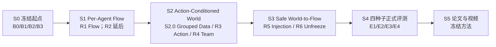
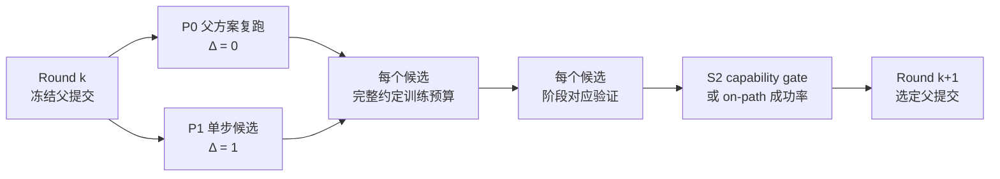

# P1 多机器人 World-Action Flow Matching 技术路线 V2.8（ICRA Fast Track）

> 文档更新：2026-07-30
> 工程起点：当前 `feat/model-improvements` 分支
> 投稿目标：ICRA 2027，[官方 Call for Papers](https://2027.ieee-icra.org/contribute/call-for-icra-2027-papers-now-accepting-submissions/) 截稿时间为 2026-09-15 11:59 PM PST
> 当前状态：M0、M1、S0、S1-R1 已完成；R1 选择 `rectified_flow_cold` F1 并合入 `feat/model-improvements`；R2a 跳过、R2b 延后，当前直接进入 S2
> 评测原则：进入动作路径的候选按闭环成功率推进；S2 predictor 严格 off-path，因此按预测能力与因果干预门槛推进
> 相关长期方案：[Intent-Grounded Decentralized World-Action Models 多机器人协作研究方案](20260724_INTENT_GROUNDED_DECENTRALIZED_WORLD_ACTION_MODELS_MULTI_ROBOT_COLLABORATION_RESEARCH_PLAN_V2.0_ZH.md)

## 1. 本次路线调整的结论

ICRA 截稿临近，后续不再按旧版 M3–M11 的长串行路线推进。当前分支直接作为工程起点，压缩成一条可以在约七周内形成论文闭环的主线：

> 按机器人组织多模态上下文，用 Rectified Flow / Flow Matching 生成每台机器人的动作；再用动作条件的多机器人未来表示显式调制 Flow 速度场，使预测未来真正参与协作动作生成。

本次调整包含六项硬决策：

1. **当前分支就是起点。** 不重写已经验证的数据、DINOv3、按机器人视图、共享解码器、dense/MoE、时间集成、采样、checkpoint 和闭环评测基础。
2. **最终目标是 World Action Model 与 Flow Matching。** 旧的 CVAE 动作分块模型仅保留为历史基线；论文标题、方法名和主张不以 ACT 为目标。
3. **每个候选只做一个单步改进。** 相对冻结父提交，只允许改变一个研究变量、回答一个假设，并能用一个 flag 或一个 commit 完整回退；禁止同时改变数据、表示、损失、模型接口和推理协议中的多个维度。
4. **使用两卡微轮次和远程 GPU 并行验证。** 一个微轮次固定为 `P0=父方案复跑` 与 `P1=父方案+一个 Δ` 两个候选；两个互不依赖的微轮次可以四卡同时运行。P0/P1 使用相同训练预算与阶段对应验证：S2 比较 held-out capability，进入动作路径后比较同协议闭环成功率。
5. **暂时舍弃 active-agent loss weighting。** 训练目标不再根据动作幅度、active/inactive 标签或机器人活跃比例调整权重。所有 agent 使用相同损失规则，activity 最多保留为 debugging log，不参与反向传播或候选选择。
6. **进入动作路径后只用闭环成功率决定推进。** P1 与对应 P0/父方案跑相同任务；只要每个任务的闭环成功率都不低于父方案，P1 就通过并可进入下一阶段，持平也算通过。S2 是唯一例外：predictor 尚未进入动作路径，闭环输出理论上应与冻结 F1 完全相同，因此 S2 只用 held-out prediction 与 action/peer-action shuffle 证明其能力，并用 action-equivalence smoke 排除误接线；从 S3 起恢复闭环唯一选型规则。

## 2. 论文目标与边界

### 2.1 暂定论文题目

**Cross-Agent World-Conditioned Flow Matching for Multi-Robot Collaboration**

中文工作名：

**面向多机器人协作的跨智能体世界条件 Flow Matching**

最终方法类建议命名为 `CrossAgentFlowWAM`。`AgentFactorizedFlowWAM` 可以保留为 S1 纯 Flow 基类，避免把旧类名直接改包装后当作新方法。

### 2.2 核心研究问题

论文只回答一个主要问题：

> 候选联合动作所诱导的跨机器人未来后果，能否直接调制按机器人分解的 Rectified Flow 速度场，并提高真实协作任务的闭环成功率？

目标计算图为：

$$
\hat{\mathbf z}_{t+1:t+H}^{1:N,\mathrm{shared}}
=
W_\phi
\left(
\mathbf h_t^{1:N},
\mathbf x_\tau^{1:N},
\tau
\right),
$$

$$
\mathbf v_\theta^i
=
F_\theta
\left(
\mathbf x_\tau^i,
\tau,
\mathbf h_t^i,
\hat{\mathbf z}_{t+1:t+H}^{i},
\hat{\mathbf z}_{t+1:t+H}^{-i,\mathrm{shared}}
\right),
$$

其中：

- $\mathbf h_t^i$ 是第 $i$ 台机器人的视觉、状态、动作历史和任务上下文；
- $\mathbf x_\tau^i$ 是 Flow 中间状态或候选动作；
- $W_\phi$ 根据整队候选动作预测各 agent 与共享对象的联合未来 latent；
- $F_\theta$ 预测第 $i$ 台机器人的速度场，并显式读取自己的未来、其他 agent 的后果和共享对象后果；
- 推理时只能向动作路径输入**预测未来**，不能输入真实未来。

如果未来分支只作为辅助损失、没有回到速度场，它只能叫 `Flow + auxiliary future prediction`，不能作为最终 WAM 主张。

### 2.3 截至 2026-07-28 的新颖性研判

**结论：当前宽泛目标不具备足够新颖性；收紧后的核心目标具有条件性的新颖性，但尚未被实验建立。**

代码现状也支持这一判断：当前 `block_causal_transformer.py` 明确禁止 action query 读取 future query，Flow solver 又以 `include_future=False` 调用 velocity model。因此当前分支实现的是 S0/S1 工程起点和近似 R5-P0 的 `Flow + auxiliary future prediction`，**还没有实现本文拟主张的 cross-agent world-to-flow coupling**。目前能评价的是最终目标的潜在新颖性，不能把现有代码直接称为新方法。

以下组件不能单独作为论文贡献：

| 路线组件 | 最接近工作与碰撞 | 判断 |
|---|---|---|
| Flow Matching 动作生成 | [$\pi_0$](https://arxiv.org/abs/2410.24164) 等已有 Flow action expert | 非新颖基础组件 |
| previous-chunk warm start | [Streaming Flow Policy](https://arxiv.org/abs/2505.21851) 从上一动作附近的窄高斯出发并流式积分 | 只作为工程候选 |
| latent future 进入 action generation | [LaWAM](https://arxiv.org/abs/2606.15768) 已用动作条件 latent world model 预测视觉 subgoal 并条件化动作生成；[AGRA](https://arxiv.org/abs/2606.12217) 已研究 world-action 表示接口并使用因果干预诊断 | 直接碰撞，不能泛称首创 |
| 只在训练期使用未来表示 | [Being-H0.7](https://arxiv.org/abs/2605.00078) 以未来 posterior 对齐部署 prior；[Fast-WAM](https://arxiv.org/abs/2603.16666) 质疑测试时显式未来预测的必要性 | auxiliary future 不足以支撑 WAM 主张 |
| 生成候选并由 world model 评分 | [Cortex 2.0](https://arxiv.org/abs/2604.20246) 在视觉 latent 空间生成、评分并选择候选未来 | 移出 ICRA 主线 |
| 多机器人 Flow 轨迹/动作协同 | [GCo](https://arxiv.org/abs/2511.10874) 已做多机器人接触与轨迹 Flow co-generation；[Flow-Opt](https://arxiv.org/abs/2510.09204) 已做带置换不变编码的集中式多机器人 Flow 轨迹优化 | “multi-robot + Flow” 本身不新颖 |
| action-conditioned multiview world model | [A2World](https://arxiv.org/abs/2606.29501) 已建模动作驱动的多视角场景演化 | 多视角预测不是核心贡献 |

在本轮检索到的最接近工作中，尚未发现与以下完整机制相同的公开方案：

> **对联合候选 action chunk 建模其跨 agent 与共享对象的后果，再将“自己的未来 + peer 后果 + shared-object 后果”逐 Flow step 注入共享参数、按 agent 分解的速度场，并以跨 agent 因果干预证明该耦合改善闭环协作。**

因此论文贡献必须收敛为：

1. **方法贡献：** `joint candidate action → cross-agent future consequences → factorized velocity fields` 的可变 agent-slot 结构，而不是 WAM 或 Flow Matching 的简单组合；
2. **因果证据：** 对 peer action、peer future、agent slot 和共享对象 future 做 zero/shuffle/intervention，并用干预前后的闭环成功率验证这些输入是否必要；
3. **闭环证据：** 在必须同步或交接的任务中，优于 `joint Flow without world`、`local-future WAM` 和 `auxiliary-only future` 三类公平基线，并同时报告 centralized joint policy 信息上限。

新颖性与因果分析只用于最终论文表述，不再设置工程阶段门槛。投稿前不得使用 “first” 或 “首次”；最终 claim 根据已有闭环结果收缩，但不阻塞模型迭代。

### 2.4 ICRA 快线不做什么

以下内容保留为长期方向，但不进入本次主线：

- 全分辨率视频生成式 world model；
- 任意机器人数量的严格理论泛化；
- 严格去中心化通信协议和真实网络部署；
- 大规模语言意图 grounding；
- 强化学习或在线探索；
- 5B/14B 模型扩展；
- 自建大量新任务或重新采集大规模数据。

本次使用低维、可验证的未来目标：未来 proprioceptive state、未来 DINO latent、物体或团队进度。论文价值来自“world prediction 如何进入 action flow”，不是视频生成规模。

## 3. 当前分支：保留什么，替换什么

### 3.1 直接保留

| 当前能力 | 快线中的位置 |
|---|---|
| RoboFactory 原生数据、状态/动作 mask、多任务 contract | 所有候选共用的数据基础 |
| 冻结 DINOv3 与完整 spatial patch tokens | 视觉上下文与未来视觉 latent 目标 |
| 18D 状态视图、8D 动作槽等按机器人数据视图 | agent factorization 起点 |
| 共享 decoder、dense 与 top-2 MoE 两种实现 | S1 并行结构候选 |
| temporal ensemble 与 latest-chunk 路径 | 统一推理协议及消融 |
| task-balanced sampler | 多任务训练公平性 |
| checkpoint、Gate20 与成功率统计工具 | 闭环迭代基础 |
| M2 中已有的 Rectified Flow、block-causal 上下文和未来预测代码 | 新 Flow/WAM 的实现参考 |

当前静态候选的初步闭环结果可以证明这条分支适合继续改，但不能直接作为论文结果。已有不同提交间的结果变化还混合了多项改动，正式表格必须从冻结的数据、评测种子和候选父提交重新跑。

### 3.2 必须替换

- CVAE posterior、KL 目标和直接动作 MSE 不再是最终动作生成目标；
- 旧类名及 `static_act` 路径只作为 legacy baseline，不作为新方法命名空间；
- 只预测未来但不影响动作的旁路结构不能作为最终方法；
- 固定拼接整队动作的单头输出要改成按 agent slot 组织、共享参数的 Flow expert；
- 旧 M2 不再因“还没完整跑完”阻塞论文快线。

### 3.3 active-agent loss weighting 决策

从 2026-07-28 起，所有快线训练使用与 activity 无关的损失约定：

$$
\mathcal L_b =
\frac{
\sum_{t,d} m_{btd}\,q_t\,e_{btd}
}{
\sum_{t,d} m_{btd}\,q_t
},
\qquad
\mathcal L = \frac{1}{B}\sum_b \mathcal L_b.
$$

其中 $m$ 只表示有效时间步和有效维度，$q_t$ 只允许表达对所有 agent 一致的 executed-prefix 等时序权重。禁止让 $q$ 依赖动作幅度、active/inactive 判定或 agent 身份。

具体约束：

- 删除训练配置中的 `active_agent_weight`、`active_delta_threshold`、`active_agent_loss_weight` 和 `active_agent_delta_threshold`；
- Flow velocity、部署端点、平滑项、未来状态和 legacy reconstruction loss 均不做 active-agent 重加权；
- 不记录会被误认为训练目标一部分的 `active_agent_fraction` loss metric；
- teacher-context 的 active/inactive 拆分最多保留为 debugging log，不进入 evidence board；
- ICRA 截稿前不把该机制重新加回主线。若以后重启，必须作为单独、受控且多随机种子的消融。

## 4. 快线总览



S0 是起点选择，不计作结构改进。S1–S3 由若干“两卡单变量微轮次”组成：



两个独立微轮次可以占用四张卡并行。例如：

```text
卡 0/1：P vs P + Δdecoder
卡 2/3：P vs P + Δsource_prior
```

如果 $\Delta_{\mathrm{decoder}}$ 与 $\Delta_{\mathrm{source\_prior}}$ 都没有造成成功率退步，可以启动组合闭环；组合相对其 P0 不退步即可进入下一阶段。

“单步改进”保持轻量：

1. 只回答一个研究假设；
2. 只改变一个配置轴或一条模型接口；
3. 数据、seed、训练预算、闭环协议和其他模型路径不变；
4. 可以通过一个 flag 或一个 commit 完整回退；
5. 尽量保持改动可独立回退。

唯一例外是 R1 的 `legacy action generator → cold-start Rectified Flow`。head、FM loss 和 ODE solver 必须作为一个可运行的原子垂直切片共同替换，但其研究变量只有 `action_generator`；上下文、decoder、数据、action chunk、ensemble 和评测协议全部保持不变。

所有微轮次只保留两条规则：

- P0/P1 使用相同数据 split、训练预算与阶段对应协议；
- S2 采用 prediction/shuffle capability gate；从 S3 起 P1 各任务成功率不低于 P0 就可以继续。主动停止的候选直接退出比较，不阻塞其他候选。

## 5. S0：冻结工程起点与协作任务（07-28）

### 5.1 四个并行参考方案

| 卡 | 方案 | 作用 |
|---|---|---|
| B0 | 当前 sparse MoE legacy chunk policy + temporal ensemble | 当前分支行为参考 |
| B1 | compute-matched dense legacy chunk policy + temporal ensemble | 判断 MoE 是否值得继续 |
| B2 | 现有 M2 Rectified Flow，关闭或旁路旧 future head | Flow 工程参考 |
| B3 | 当前 sparse MoE legacy chunk policy + latest chunk | 隔离 temporal ensemble 的实际贡献 |

四卡使用相同数据 manifest、DINO 权重、动作归一化、训练 update、推理频率和 Gate20 初始条件。B0 与 B3 允许复用同一公平训练 checkpoint，因为二者只改变推理聚合；其他结构不得复用 checkpoint。旧 checkpoint 只用于工程 smoke test。

S0 只建立参考坐标，不产生可外推的结构 winner：B1/B3 分别诊断 decoder 与推理聚合，B2 是旧 M2 工程参考。由于 B2 训练耗时超过 fast-track 预算，operator 决定在 Gate20 前主动终止 B2，并以已完成成功率评测的 B0 作为 R1 工程父方案。该处置不等于证明 legacy action generator 优于 Rectified Flow；正式 Flow 改进仍在 R1 中从 B0 父方案以原子垂直切片重新实现和验证。

#### 5.1.1 Vast.ai 四卡从零一键部署与运行

以下命令假设远程服务器已经自动进入唯一的永久 tmux session，且 `/workspace/fe-pc-wam` 不存在。命令不执行 `apt update`，也不允许通过 `export HF_TOKEN=...` 传递 Hugging Face token：

```bash
cd /workspace

# 1. 检查服务器必需命令；不执行 apt update。
for s0_cmd in git tmux jq python3 nvidia-smi flock df sha256sum; do
  command -v "${s0_cmd}" >/dev/null || {
    echo "缺少服务器命令：${s0_cmd}"
    exit 1
  }
done

# 2. 确认当前就在 Vast.ai 提供的永久 tmux session 中。
test -n "${TMUX:-}" || {
  echo "错误：当前终端不在 tmux session 中"
  exit 1
}

test "$(tmux list-sessions -F '#S' | wc -l)" -eq 1 || {
  echo "错误：服务器必须有且仅有一个 tmux session"
  tmux list-sessions
  exit 1
}

echo "当前 tmux session：$(tmux display-message -p '#S')"

# 3. 确认正好有四张 GPU。
nvidia-smi -L

test "$(nvidia-smi -L | wc -l)" -eq 4 || {
  echo "错误：没有检测到正好四张 GPU"
  exit 1
}

# 4. 检查磁盘空间。
df -h /workspace

# 5. 确保目标目录不存在，防止覆盖已有文件。
test ! -e /workspace/fe-pc-wam || {
  echo "错误：/workspace/fe-pc-wam 已存在，请不要覆盖"
  exit 1
}

# 6. 下载模型改进分支代码。
git clone \
  --branch feat/model-improvements \
  --single-branch \
  https://github.com/Jeong-zju/fe-pc-wam.git \
  /workspace/fe-pc-wam

cd /workspace/fe-pc-wam

# 7. 校验代码至少包含已验证的一键启动、B2 路由和安全终止能力。
git rev-parse --short HEAD

git merge-base --is-ancestor 2de5656 HEAD || {
  echo "错误：远程代码早于最低安全版本 2de5656"
  exit 1
}

test -x ./scripts/launch_s0_4gpu_tmux.sh
test -x ./scripts/stop_s0_4gpu_tmux.sh

# 8. 先检查一键部署计划；不会下载、训练或创建窗口。
./scripts/launch_s0_4gpu_tmux.sh \
  --run-id s0-round1 \
  --dry-run

# 9. 正式一键启动。
./scripts/launch_s0_4gpu_tmux.sh \
  --run-id s0-round1
```

正式启动时在隐藏提示中粘贴同时具备 DINOv3 gated 模型、两个训练数据集和 `RoboFactory_asset` 读取权限的 HF token。launcher 只在永久 session 中创建 `s0-round1-prepare`、`s0-round1-b0`、`s0-round1-b1`、`s0-round1-b2`、`s0-round1-b3` 和 `s0-round1-monitor`，不会创建、attach 或退出 tmux session。

#### 5.1.2 当前 S0 run 一键终止与窗口关闭

必须从永久 session 中不属于目标 run 的基础 `bash` window 执行。以下命令先核验工具、session、代码和 run manifest，打印只读终止计划，然后终止 `s0-round1` 的训练、验证、RoboFactory rollout server、dataloader 和 monitor 进程，最后关闭上述六个 window：

```bash
cd /workspace/fe-pc-wam

# 1. 检查终止器依赖；不执行 apt update。
for s0_stop_cmd in tmux jq grep nvidia-smi realpath sleep; do
  command -v "${s0_stop_cmd}" >/dev/null || {
    echo "缺少服务器命令：${s0_stop_cmd}"
    exit 1
  }
done

# 2. 确认仍在唯一的永久 tmux session 中。
test -n "${TMUX:-}" || {
  echo "错误：当前终端不在 tmux session 中"
  exit 1
}

test "$(tmux list-sessions -F '#S' | wc -l)" -eq 1 || {
  echo "错误：服务器必须有且仅有一个 tmux session"
  tmux list-sessions
  exit 1
}

cd /workspace/fe-pc-wam

# 3. 更新终止器并校验最低安全版本。
git switch feat/model-improvements
git pull --ff-only

git merge-base --is-ancestor 2de5656 HEAD || {
  echo "错误：代码不包含安全终止器 2de5656"
  exit 1
}

test -x ./scripts/stop_s0_4gpu_tmux.sh
test -f ./outputs/s0_runs/s0-round1/run_manifest.json

# 4. 只读检查：不发送信号、不关闭窗口。
./scripts/stop_s0_4gpu_tmux.sh \
  --run-id s0-round1 \
  --dry-run

# 5. 正式终止该 run 并关闭它创建的六个 window。
./scripts/stop_s0_4gpu_tmux.sh \
  --run-id s0-round1

# 6. 核对永久 session 仍存在，并查看是否还有 GPU 计算进程。
tmux list-windows \
  -F '#{window_index}: #{window_name} pane_dead=#{pane_dead}'

nvidia-smi \
  --query-compute-apps=pid,process_name,used_memory \
  --format=csv,noheader
```

终止器只匹配 manifest 中记录的 session/window 前缀，以及进程环境中与本轮绝对路径完全一致的 `S0_RUN_ROOT`。它先发送 Ctrl-C，等待 10 秒，再按需发送 SIGTERM 和 SIGKILL。它禁止从目标 run window 内自我终止，也不会调用 `tmux kill-session`，不会删除数据集、DINO/RoboFactory 权重、worktree、checkpoint、partial/resume checkpoint、日志、视频或 Gate JSON。

### 5.2 S0 Round 1 闭合决策（2026-07-28）

`s0-round1` 的 monitor 在 `2026-07-28T14:10:34.935096+00:00` 显示 B0、B1、B3 已完成 Gate20；冻结协议规定使用 seed `900–919`。B0/B1 均完成 80,000 updates，monitor 舍入后的末端 loss 均为 `0.002`；B3 按设计复用 B0 immutable checkpoint、只改变 chunk aggregation，因此其 `not started` 训练状态不是缺失实验。B2 在该快照中仅完成 `4,684/80,000` updates（5.9%）；因训练耗时过长，operator 已请求在 Gate20 前主动终止，不再等待其完成后才进入 R1。

| 候选 | LiftBarrier | LongPipelineDelivery | 相对 B0 | 阶段处置 |
|---|---:|---:|---|---|
| B0 sparse MoE + temporal ensemble | 17/20（85%） | 19/20（95%） | — | 选为 R1 工程父方案 |
| B1 compute-matched dense + temporal ensemble | 11/20（55%） | 0/20（0%） | `-30pp / -95pp` | 不替换 sparse MoE；待训练 seed 复验后再作架构级外推 |
| B2 Rectified Flow reference | — | — | 不可比较 | Gate20 前 operator stop；不作模型结论 |
| B3 B0 checkpoint + latest chunk | 6/20（30%） | 0/20（0%） | `-55pp / -95pp` | 否决 latest chunk；保留 temporal ensemble |

阶段判断如下：

- **B0 是后续 R1 的工程父方案。** 它是三条已完成分支中唯一在两个任务都有成功的坐标，因此 S0 不再等待 B2，可以进入下一阶段。该选择不是正式验收，也不构成 legacy action generator 普遍优于 Flow 的结论。
- **B2 记为主动停止，不记为模型失败。** 原因是训练 wall time 超出 fast-track 预算；它没有完成相同 update、没有 Gate20 成功率，因此不能按 0% 计分，也不能用于比较 B0 与 Flow。保留最后 progress、日志、partial/resume checkpoint 和 operator-stop 原因即可。
- **B0/B3 是本轮最干净的受控对比。** 冻结 manifest 与 launcher 要求 B3 复用 B0 checkpoint 和 paired seeds，且 B3 的 `not started` 与该协议一致；latest chunk 下 LPD 从 19/20 降至 0/20，说明 temporal ensemble 是有效策略的一部分，后续 legacy 对照保留 temporal ensemble。
- **B0/B1 明确否决当前 dense 替代方案，但结论强度低于 B0/B3。** 两者训练协议一致但 checkpoint 来自独立训练；当前结果足以作工程选型，不足以用单个训练 seed 声称 MoE 普遍优于 dense。
- **LPD 是更有区分力的回归任务。** B1/B3 在 LiftBarrier 尚有 11/20 和 6/20，却在 LPD 同时为 0/20；后续轮次不得用 LiftBarrier 单任务成功掩盖长时程协调与时序稳定性失败。
- **训练 loss 不参与闭环选型。** B0/B1 的 monitor 舍入末端 loss 同为 `0.002`，但 LiftBarrier 相差 30pp、LPD 相差 95pp；后续只按各任务闭环成功率选择候选。

monitor 中 `gate=pass` 对应 `gate_summary.passed=true`，`gate=done` 对应 gate 已完成但 `passed=false`。S0 已直接选择 B0 进入 R1，不再等待额外审计、正式 100-episode gate、checkpoint SHA 或 B2 结果。相关信息可以继续记录，但不阻塞推进。

### 5.3 S0 推进规则

S0 不再设置协作必要性审计或额外准入清单。B0 直接作为 R1 父方案；后续进入动作路径的候选只需与 B0 或各自父方案比较闭环成功率，S2 off-path predictor 使用第 7 节的 capability gate。

### 5.4 B0 进入 S1/R1

使用 `round/s0-b0-legacy-moe-ensemble` 作为 R1 工程父方案即可。除能够完成闭环并输出成功率外，不增加其他进入条件。

## 6. S1：Per-Agent Rectified Flow Action Expert（07-29）

统一 Flow 目标：

$$
\mathbf x_\tau=(1-\tau)\mathbf x_0+\tau\mathbf a^\star,
\qquad
\mathbf v^\star=\mathbf a^\star-\mathbf x_0,
$$

$$
\mathcal L_{\mathrm{FM}}
=
\operatorname{MaskedMean}
\left[
\left\|
\mathbf v_\theta-\mathbf v^\star
\right\|_2^2
\right].
$$

每个 agent 使用共享参数的 action expert，agent identity、task token 和本地/团队上下文通过显式 token 进入，输出保持按 agent slot 组织。

### 6.1 R1：只替换动作生成器（必做，两卡）

| 候选 | 相对父提交的唯一变量 | 固定不变 |
|---|---|---|
| R1-F0 | `action_generator=legacy_cvae`，父方案复跑 | 数据、context、当前 decoder、chunk、ensemble、训练预算 |
| R1-F1 | `action_generator=rectified_flow_cold` | 与 F0 相同 |

F1 的 head、FM loss 和 ODE solver 作为一个原子垂直切片共同实现；不得同时把 MoE 改成 dense、加入 warm start、改变 temporal ensemble 或接入 future latent。默认使用 4-step Euler，1-step Euler 与 2-step Heun 延后为冻结 checkpoint 上的推理消融。

R1 只比较 F0/F1 的同任务闭环成功率。若 F1 在每个任务都不低于 F0，则通过并进入后续阶段，成功率持平也算通过；若任一任务下降，则保留 F0。

#### 6.1.1 S1-R1 两分支与两卡隔离契约

S1-R1 从 `feat/model-improvements` 的同一公共基础设施提交创建两个分支：`s1/r1-f0-legacy` 只把 S0-B0 固化为 R1-F0 复跑坐标，`s1/r1-f1-flow-cold` 只完成 `legacy_cvae → rectified_flow_cold` 原子替换。两个分支分别使用 GPU 0/1、独立 worktree、独立 checkpoint/output/log，但通过符号链接只读共享模型改进分支中的 `datasets/` 与 `artifacts/`，并共享同一个 uv 环境、uv cache 和 RoboFactory 安装。F0/F1 都固定 80,000 updates、训练 seed 101、Gate20 seeds 900–919、sparse top-2 MoE、DINOv3、100-step chunk 和 temporal ensemble；F1 默认使用标准高斯 cold source、FM velocity MSE 和 4-step Euler，不开启 warm start、future path、dense decoder 或 active-agent weighting。

截至 2026-07-28，本轮公共父提交为 `65ad9de`，F0 实现提交为 `f0043ff`，F1 实现提交为 `00a29c6`。这三个提交只表示代码与运行契约已冻结，不表示 F1 已通过：只有远程训练结束后 F1 在 LiftBarrier 与 LongPipelineDelivery 的 Gate20 成功率都不低于 F0，R1 才能选择 Flow。

##### S1-R1 Round 2 结果与决策（2026-07-29）

`s1-r1-round2` 的 F0/F1 都完成 `80,000/80,000` updates；monitor 舍入后的末端 loss 分别为 `0.003` 和 `0.012`。相同 Gate20 协议下，F0 在 LiftBarrier/LongPipelineDelivery 分别为 `11/20`、`20/20`，F1 分别为 `13/20`、`20/20`。F1 在 LiftBarrier 提高 `2/20`（10 个百分点），在 LongPipelineDelivery 持平，因此满足“每个任务均不低于 F0”的 R1 推进规则，选择 F1 并将 `s1/r1-f1-flow-cold` 合入 `feat/model-improvements`。

| 候选 | 训练 | 末端 loss（monitor） | LiftBarrier | LongPipelineDelivery | R1 决策 |
|---|---:|---:|---:|---:|---|
| F0 legacy CVAE | 80,000/80,000 | 0.003 | 11/20（55%） | 20/20（100%） | 控制组 |
| F1 Rectified Flow cold | 80,000/80,000 | 0.012 | 13/20（65%） | 20/20（100%） | 通过并晋升 |

F1 monitor 的 `failed` 不是闭环失败：两个任务的 40 个 rollout 均已完成，退出码来自 `build_lpd_gate_summary.py` 只接受 `wam/static_act`、不接受 F1 的 `agent_flow` policy kind。合入后的汇总器已把 `agent_flow` 纳入文件型 checkpoint 路径；同步远程原始 rollout 后只需重建 `gate_summary.json`，不需要重新训练或重跑 40 个回合。在汇总 JSON、checkpoint 哈希与 episode-level 记录同步前，本节数字仍按 operator-reported Gate20 结果使用，不外推为正式 100 回合验收或统计显著性结论。

launcher 复用服务器已经存在的唯一永久 tmux session，只创建 `<run-id>-prepare`、`<run-id>-f0`、`<run-id>-f1` 和 `<run-id>-monitor` 四个 window，并为每个 window 设置 `remain-on-exit=on`；它不会创建、attach 或退出 tmux session。monitor 同时显示两条训练的 update/loss、两个闭环任务的成功数、候选 phase 和两张 GPU 的利用率/显存。训练或验证进程退出后 window 仍保留，便于查看日志。

#### 6.1.2 Vast.ai 两卡从零一键部署、训练、验证与监控

以下命令假设 Vast.ai 已经自动进入唯一的永久 tmux session，服务器恰好暴露两张 GPU，且 `/workspace/fe-pc-wam` 尚不存在。命令不会执行 `apt update`，HF token 只会通过隐藏输入和 mode-0600 FIFO 交给共享准备 window，不写进 shell export、tmux command 或 argv：

```bash
cd /workspace

for s1_cmd in git tmux jq python3 nvidia-smi flock df sha256sum; do
  command -v "${s1_cmd}" >/dev/null || {
    echo "缺少服务器命令：${s1_cmd}"
    exit 1
  }
done

test -n "${TMUX:-}" || {
  echo "错误：当前终端不在 Vast.ai 的永久 tmux session 中"
  exit 1
}

test "$(tmux list-sessions -F '#S' | wc -l)" -eq 1 || {
  echo "错误：服务器必须有且仅有一个 tmux session"
  tmux list-sessions
  exit 1
}

test "$(nvidia-smi -L | wc -l)" -eq 2 || {
  echo "错误：S1-R1 必须恰好暴露两张 GPU"
  nvidia-smi -L
  exit 1
}

df -h /workspace

test ! -e /workspace/fe-pc-wam || {
  echo "错误：/workspace/fe-pc-wam 已存在，请不要覆盖"
  exit 1
}

git clone \
  --branch feat/model-improvements \
  --single-branch \
  https://github.com/Jeong-zju/fe-pc-wam.git \
  /workspace/fe-pc-wam

cd /workspace/fe-pc-wam
git rev-parse --short HEAD

test -x ./scripts/launch_s1_r1_2gpu_tmux.sh
test -x ./scripts/stop_s1_r1_2gpu_tmux.sh

./scripts/launch_s1_r1_2gpu_tmux.sh \
  --run-id s1-r1-round1 \
  --dry-run

./scripts/launch_s1_r1_2gpu_tmux.sh \
  --run-id s1-r1-round1
```

正式启动时在隐藏提示中粘贴同时具备 DINOv3 gated 模型、两个训练数据集和 `RoboFactory_asset` 读取权限的 HF token。启动后 launcher 默认切到 `s1-r1-round1-monitor`；可随时从永久 session 的任意非目标 window 执行以下只读监测指令：

共享准备只调用官方基础下载命令 `hf download`：固定关闭 Xet，并用 `--max-workers 1` 串行走普通 HTTP，以避免云主机共享出口请求 `xet-read-token` 时出现 `429 Too Many Requests`。脚本不包含并发下载或重试封装；下载失败后，以新 run-id 重新启动会原地复用已完成文件并续传。

```bash
cd /workspace/fe-pc-wam

python3 scripts/s1_r1_runtime.py monitor \
  --once \
  --run-root outputs/s1_r1_runs/s1-r1-round1

tmux select-window \
  -t "$(tmux display-message -p '#S'):s1-r1-round1-monitor"
```

所有运行产物位于 `/workspace/fe-pc-wam/outputs/s1_r1_runs/s1-r1-round1/`。共享准备日志和哈希分别为 `prepare.log`、`shared_artifact_sha256.txt`；F0/F1 的训练进度、checkpoint、验证 JSON、视频和完整候选日志分别位于 `candidates/f0/` 与 `candidates/f1/`。monitor 中 Gate20 的 `lift=x/20`、`lpd=y/20` 是本轮唯一推进依据：只有 F1 两个任务都不低于 F0 才进入 R2。

共享准备完成后，两个候选还要分别完成数据 manifest/HDF5 身份校验、DINOv3 权重装载、模型与 optimizer 构建、resume 检查、DataLoader worker 启动和首批数据读取。两张 RTX 5090 的常见冷启动时间为 3–15 分钟；云盘较慢时可能达到 20–30 分钟。候选 window 在等待共享准备时每 30 秒打印一次心跳；训练器把上述子阶段写入 `candidates/<f0|f1>/train/stages.jsonl`。monitor 每 5 秒显示当前 startup 子阶段、该阶段持续时间以及 GPU 利用率，产生第一个 optimizer step 后自动切换为 `training` 并显示 update/loss。

#### 6.1.3 S1-R1 一键退出但保留永久 tmux 与全部产物

退出脚本必须从永久 session 中不属于 `s1-r1-round1-prepare/f0/f1/monitor` 的基础 `bash` window 执行。它只根据 run manifest 和进程环境中的绝对 `S1_R1_RUN_ROOT` 定位本轮进程，依次发送 Ctrl-C、SIGTERM、必要时 SIGKILL，再关闭本轮四个 window；不会调用 `tmux kill-session`，不会删除共享数据、DINO/RoboFactory 权重、worktree、checkpoint、resume、日志、视频或验证结果：

```bash
cd /workspace/fe-pc-wam

git switch feat/model-improvements
git pull --ff-only

test -f ./outputs/s1_r1_runs/s1-r1-round1/run_manifest.json
test -x ./scripts/stop_s1_r1_2gpu_tmux.sh

./scripts/stop_s1_r1_2gpu_tmux.sh \
  --run-id s1-r1-round1 \
  --dry-run

./scripts/stop_s1_r1_2gpu_tmux.sh \
  --run-id s1-r1-round1

tmux list-windows \
  -F '#{window_index}: #{window_name} pane_dead=#{pane_dead}'

nvidia-smi \
  --query-compute-apps=pid,process_name,used_memory \
  --format=csv,noheader
```

一键退出完成后，Vast.ai 的永久 tmux session 必须仍存在；若之后要恢复训练，保留的 `resume.pt` 会被各候选训练器读取，但为避免复用已经关闭的 window/run manifest，应使用新的 `--run-id` 启动并按需把对应 resume/checkpoint 放入新 run 的候选隔离目录。

若 `s1-r1-round1` 在共享下载阶段失败且尚未执行上述退出指令，应先切到永久 session 中任意非 S1-R1 基础 window，再执行：

```bash
cd /workspace/fe-pc-wam

./scripts/stop_s1_r1_2gpu_tmux.sh --run-id s1-r1-round1

git switch feat/model-improvements
git pull --ff-only

./scripts/launch_s1_r1_2gpu_tmux.sh --run-id s1-r1-round2
```

该流程只关闭 round1 的四个 window，不删除 `/workspace/fe-pc-wam/datasets`、`/workspace/fe-pc-wam/artifacts`、`/workspace/RoboFactory`、Hub 下载缓存或 round1 日志；round2 会继续使用这些已有内容。

若 F1 已完成 80,000 updates、仅在闭环握手、rollout 或汇总阶段失败，不得重新训练。应进入 F1 worktree，明确切换并更新 `s1/r1-f1-flow-cold`，然后用新的 retry-id 复用 round2 checkpoint，只重跑 F1 Gate20：

```bash
cd /workspace/worktrees/s1-r1-f1-flow-cold
git switch s1/r1-f1-flow-cold
git pull --ff-only origin s1/r1-f1-flow-cold

./scripts/retry_s1_r1_f1_gate.sh \
  --run-id s1-r1-round2 \
  --retry-id retry1
```

retry 输出写入 round2 的 `candidates/f1/validation/gate_s1-r1-round2_retry1/`，日志写入 `candidates/f1/logs/gate_s1-r1-round2_retry1.log`；已有 checkpoint、训练进度和首次失败的验证目录全部保留。

### 6.2 R2a/R2b：两个可选单变量微轮次（可四卡并行）

R1-F1 已通过并随合并提交 `ae7dc95` 进入 `feat/model-improvements`，冻结为后续阶段的 Flow 工程父方案 `P_flow`。以下两对候选可以同时租用四张卡：

| 微轮次 | P0 控制 | P1 单步改进 | 唯一变量 |
|---|---|---|---|
| R2a Decoder | 当前 `P_flow` decoder | 仅切换 `top-2 MoE ↔ dense FFN` | decoder family |
| R2b Source prior | Gaussian cold start | previous-chunk warm start | Flow source distribution |

R2a 不改变 source prior；R2b 不改变 decoder。每个 P1 只要各任务闭环成功率不低于对应 P0 就可以保留，持平也算通过。若两项都通过，可以直接进入组合闭环；组合方案相对组合父方案没有成功率退步即可继续。

**2026-07-30 决策：主路径不运行 R2。** R2a 在 S0 已有同方向证据：dense B1 相对 MoE B0 闭环明显退步，再花完整训练预算只会重复一个低信息量问题；R2b 的 previous-chunk warm start 改变 source distribution，既不是 S2 所需依赖，也会把跨回合分布漂移带入新的 world-model 对照。R2a 标记为跳过，R2b 移入非阻塞 backlog；以后若有空闲卡，R2b 只能作为独立 sidecar ablation，不能更换 S2 父方案或阻塞主线。

### 6.3 进入 S2

S2 固定从当前 `feat/model-improvements` 上的 F1 `rectified_flow_cold` 父方案进入；模型修改父提交为 `caa5ed3`，Flow checkpoint 优先采用已经完成 Gate20 的 R1-F1 checkpoint。S2 不再等待 R2a/R2b。正常情况下不增加 Flow 训练；若租用的新实例和持久盘都已经没有该 checkpoint，则 S2 launcher 会按已经晋升的冻结 F1 配方自动重建，而不是因缺文件永久阻塞。

## 7. S2：Agent-Factorized Action-Conditioned World Model（07-30 至 08-10）

本阶段冻结 F1 Flow 与 DINOv3，future predictor 严格保持在动作路径之外。S2 只回答两个能力问题：local predictor 是否真正读取自己的候选 action chunk，以及 team predictor 是否真正读取 peer action 并预测跨机器人/共享场景后果。因为 predictor off-path 时不可能改变策略动作，S2 不用闭环成功率比较 W0/W1 或 P0/P1；只运行一次 predictor-disabled action-equivalence smoke，world-to-action 收益统一留到 S3。

### 7.1 S2.0：先建立 grouped trajectory contract

复用当前 manifest 与轨迹文件，不重采数据。新增 S2 专用 grouped adapter，保留 episode 内的 agent 维与共享视角；不得修改 S1 已冻结的 legacy `_local_batch` 语义。adapter 必须输出以下张量：

| 字段 | 固定 contract |
|---|---|
| current agent state | `[B, A, 18]` |
| executed/candidate action chunk | `[B, A, H, 8]` |
| agent-view observation | `[B, A, ...]` |
| global/shared-view observation | `[B, ...]`，与 agent slots 分开保留 |
| valid-agent mask | `[B, A]`，第一版 `A_max=4` |
| future targets/masks | `k ∈ {1, 25, 50, 100}`，越过 episode 边界的 target 必须 mask |

S2.0 必须先通过四类单元测试：group/agent/global shape 保持、future index 与 episode 边界 mask 正确、invalid-agent slot 对 loss 为零、predictor disabled 时 F1 输入动作与输出动作逐元素一致且 Flow/DINO checkpoint hash 不变。任一测试失败都不启动 R3。

### 7.2 Future representation 与损失

第一版不生成 RGB。每个 horizon 预测两类增量 target：归一化 proprioceptive state delta `s_{t+k}^i-s_t^i`，以及冻结 DINOv3 patch feature 的空间池化 latent delta。DINO feature 先按固定网格池化，再用仅在 train split 拟合的 PCA 从 1024 维压到 256 维；PCA basis、归一化统计、DINO checkpoint 与数据 manifest hash 都写入 checkpoint，验证/测试阶段不得重拟合。

state 使用 masked Smooth-L1，DINO delta 使用 masked cosine distance；两项先用 train split 统计量标准化，再固定等权相加：

$$
\mathcal L_{\mathrm{future}}
=
\mathcal L_{\mathrm{state}}
+
\mathcal L_{\mathrm{dino}}.
$$

真实 future 只能作为训练/验证 target，禁止作为 predictor 输入。local predictor 输出 own-state/own-view future；team predictor 额外输出所有 valid peer 的 state/view future 与 global/shared-view future。

### 7.3 Candidate-action contract

训练时使用数据中的归一化 executed action chunk 作为干净的 causal candidate。R3-W0 使用同构 action adapter，但 action 输入置零并 mask；R3-W1 输入自己的完整 action chunk。不能把单个 noisy $\mathbf x_\tau$ 作为唯一 action condition，因为早期 $\tau$ 的信号主要是噪声，容易把“模型没读动作”误判成 world model 不成立。

为 S3 预留的推理 contract 是：每个 solver step 先由冻结 base Flow 给出 provisional clean endpoint，再以 stop-gradient 方式连同 $\tau$ 送入 predictor：

$$
\hat{\mathbf a}_1^i
=
\operatorname{clip}
\left(
\mathbf x_\tau^i
+
(1-\tau)\,
\mathbf v_{\mathrm{base}}^i(\mathbf x_\tau,\tau,\mathbf h_t)
\right).
$$

local 模式只可读取本 agent 的 context 与 candidate action；team 模式可读取所有 valid agents 的 context/action 和 global slot，使用共享参数与显式 masks，不按 agent 数复制独立网络。

### 7.4 R3：Action conditioning capability（必做，两卡）

| 候选 | Predictor 输入 | Future target | 唯一变量 |
|---|---|---|---|
| R3-W0 | local context；action adapter 输入置零并 mask | own state + own DINO latent | 无候选动作信息 |
| R3-W1 | local context + own executed action chunk | 与 W0 完全相同 | `action_conditioning=on` |

W0/W1 必须从相同初始化开始，使用相同网络、target、horizon、width、参数量、训练更新、optimizer 与固定 held-out trajectory split。R3 只有同时满足以下条件才通过：

1. 每个任务上 W1 的 held-out composite future loss 都不高于 W0，且至少一个任务严格改善；
2. 每个任务分别做 paired action shuffle，`L_shuffled-L_normal>0`，episode-level paired bootstrap 的 95% 下界也必须大于 0；
3. predictor disabled 时通过 F1 action-equivalence smoke，且 Flow/DINO 无梯度、无参数或 buffer 变化。

若 action shuffle 不能稳定增大误差，结论是 predictor 没有利用候选动作；停止进入 R4，优先检查 action normalization、temporal alignment 与 adapter，再只允许一次修复重跑。不能用闭环持平把 W1 判为通过。

#### 7.4.1 S2-R3 两分支、五任务和两卡运行契约（2026-07-30）

S2.0 公共基础设施先落在 `feat/model-improvements`，再从同一个公共父提交创建 `s2/r3-w0-action-independent` 和 `s2/r3-w1-action-conditioned`。W0/W1 使用同一个 `LocalActionConditionedFuturePredictor` 类、相同参数量、seed `303`、10,000 updates、batch size `1`、optimizer、五任务 train/validation split、DINOv3/PCA 工件和 S1-R1 F1 checkpoint；分支配对检查器会删除候选 identity 与隔离输出路径后逐字段比较配置，除 `action_conditioning=false/true` 外存在任何差异都会拒绝启动。训练与验收白名单显式加入 `s2_r3_local_action_independent` 和 `s2_r3_local_action_conditioned`，未知 model kind fail closed。

五任务联合训练、联合 held-out 验证固定使用以下不可变 Hugging Face dataset revision，并通过同一个基础仓库下的 `datasets/robofactory_multitask/` 只读共享给两个 worktree：

| 任务 | Hugging Face dataset | revision | 本地目录 | 实际 RGB 相机 |
|---|---|---|---|---|
| LiftBarrier | `zeno-ai/robofactory-lift-barrier-multiview` | `6ab620091677e69370412f08cd7adecacc28c146` | `lift_barrier/` | `global, agent_0, agent_1` |
| LongPipelineDelivery | `zeno-ai/robofactory-long-pipeline-delivery-multiview` | `fee628311ff52a3ae0ddfddf82379c63d28f7533` | `long_pipeline_delivery/` | `global, agent_0..3` |
| TakePhoto | `zeno-ai/robofactory-take-photo-multiview` | `df3a98acde2453ca17e3121594faf150f3c33023` | `take_photo/` | `global` |
| ThreeRobotsStackCube | `zeno-ai/robofactory-three-robots-stack-cube-multiview` | `e3f07c9625ac0047d680794fdbd6bd9124f3a54b` | `three_robots_stack_cube/` | `global` |
| CameraAlignment | `zeno-ai/robofactory-camera-alignment-multiview` | `f56fe728e24f9074aa7db318705bd13455b1da73` | `camera_alignment/` | `global` |

五仓库当前合计约 470 GiB，launcher 在缺数据时要求至少 550 GiB 可用空间。2026-07-30 的服务器实测确认，关闭 Xet 且单 worker 时普通 HTTP 单连接只有约 `4.6 MiB/s`，而 LongPipelineDelivery 单个 HDF5 平均约 `2.37 GiB`；因此五个大型训练集恢复 S0 `9bf88ff` 的已验证传输策略：官方 `hf download` 保持 Xet 开启、不传 `--max-workers`（当前锁定 CLI 的默认值为 8）、失败后最多 5 次指数退避。DINOv3 仍关闭 Xet并固定 `--max-workers 1`。两类下载都固定不可变 revision、`HF_HUB_DOWNLOAD_TIMEOUT=600`、`HF_HUB_ETAG_TIMEOUT=60` 和最终 `--local-dir`，不调用 `snapshot_download`，也不创建第二份 snapshot。

网络抖动时官方客户端在同一本地 cache/`--local-dir` 恢复；只有 prepare 变为 `failed` 才是本轮失败。脚本每 15 秒把当前任务已完成的 episode 数写入 shared status。重启时不能只凭已经先行下载的 `training_manifest.json` 判定完成：快速完整性检查会确认该任务全部 150 个 HDF5、normalization 和 conversion manifest 均已落盘，否则继续复用已完成文件和本地 cache。S0 模式可能重新获取由普通 HTTP 留下但尚未完成的单文件 `.incomplete`，不得手工删除 cache 或已经完成的 HDF5。

grouped adapter 保留 current state `[B,4,18]`、candidate chunk `[B,4,100,8]`、五个固定相机槽位、独立 global RGB `[B,...]`、valid-agent mask `[B,4]` 和 `k={1,25,50,100}` future mask。每个来源任务只需声明实际存在的 canonical 相机前缀，loader 再显式 pad 到固定槽位；不能把缺失的 agent 相机伪造为真实 target。对只有 `global` 的三个新任务，当前 global RGB 作为每个有效 agent 的只读视觉 context fallback，local future RGB mask 保持 false，因此它们参与 per-agent state/action future loss 和 action-shuffle 验收，但不产生虚构的 local visual loss；LiftBarrier/LongPipelineDelivery 仍使用真实 agent 相机并同时训练 state/visual target。DINOv3 patch feature 固定池化到 `2×2` 网格，再用只读取 train split 的 PCA 从 1024 维压到 256 维；PCA basis、projected std、state/DINO delta normalization、五个 manifest hash、每任务实际相机契约和 DINO hash 保存在 `artifacts/s2_r3/dino_pca_statistics.pt`，并完整嵌入候选 checkpoint。future state/RGB 只用于 target builder，不进入 predictor input。

R3 验收器不运行无区分力的成对闭环。它在每个 validation episode 固定选择 4 个时间窗，分别输出 normal 与 own-action-shuffle composite future loss，再按 episode 聚合并运行 10,000 次 paired bootstrap。`acceptance.json` 只有在五个任务上同时满足 W1 loss 不高于 W0、至少一个任务严格改善、W1 `L_shuffled-L_normal>0` 且 bootstrap 95% 下界大于 0时才通过；同时还要求 predictor-disabled F1 action output 逐元素相等、Flow/DINO 文件 hash 前后不变、predictor checkpoint 不含 Flow/DINO state。monitor 直接读取这套特殊规则，不把闭环成功率或 W0 的零 shuffle delta 误当作 R3 通过条件。

#### 7.4.2 两张 RTX 5090 一键部署、训练、验证与 monitor

以下命令假设服务器已经自动进入唯一的永久 tmux session，恰好暴露两张 RTX 5090，并有至少 550 GiB 空闲磁盘。S2 按以下顺序获取父 Flow：先使用有效的 `S2_R3_FLOW_CHECKPOINT`，再复用 `artifacts/s1_r1_f1/checkpoint_080000.pt`，然后搜索 `outputs/s1_r1_runs/*/candidates/f1/checkpoints/s1_r1_f1_flow_cold/checkpoint_080000.pt`；三处都不存在时，在五任务数据和 DINO 准备完成后自动用 GPU0 重训冻结的 S1-R1 F1 配方。恢复训练固定 seed `101`、batch size `4`、80,000 updates、标准高斯 cold source 和 4-step Euler；W0/W1 此时持续报告等待心跳，重训和验证完成后才分别占用 GPU0/GPU1。

自动恢复的完成 checkpoint 固定写到 `artifacts/s1_r1_f1/checkpoint_080000.pt`，每 1,000 updates 写入可跨 S2 run-id 复用的 `artifacts/s1_r1_f1/recovery/resume.pt`。中断后以新 run-id 启动会自动从该 resume 续训；训练完成后 resume 自动删除，并生成 `artifacts/s1_r1_f1/recovery/recovery_receipt.json`。receipt/验证器会 fail closed 地核对 checkpoint format、80k update、F1 method、模型/训练/DINO/generation 配置、config SHA256 以及原两任务 manifest SHA256。这里重建的是路线中已经完成 F0/F1 Gate20 并晋升的冻结 F1 配方，不重新开启 R1 模型选择，也不要求已经丢失的 F0 checkpoint。

```bash
cd /workspace

for s2_cmd in git tmux jq python3 nvidia-smi flock df sha256sum find sort grep; do
  command -v "${s2_cmd}" >/dev/null || {
    echo "缺少服务器命令：${s2_cmd}"
    exit 1
  }
done

test -n "${TMUX:-}" || {
  echo "错误：当前终端不在永久 tmux session 中"
  exit 1
}

test "$(tmux list-sessions -F '#S' | wc -l)" -eq 1 || {
  echo "错误：服务器必须有且仅有一个 tmux session"
  tmux list-sessions
  exit 1
}

test "$(nvidia-smi -L | wc -l)" -eq 2 || {
  echo "错误：S2-R3 必须恰好暴露两张 GPU"
  nvidia-smi -L
  exit 1
}

df -h /workspace

test ! -e /workspace/fe-pc-wam || {
  echo "错误：/workspace/fe-pc-wam 已存在，请不要覆盖"
  exit 1
}

git clone \
  --branch feat/model-improvements \
  --single-branch \
  https://github.com/Jeong-zju/fe-pc-wam.git \
  /workspace/fe-pc-wam

cd /workspace/fe-pc-wam
git rev-parse --short HEAD

test -x ./scripts/launch_s2_r3_2gpu_tmux.sh
test -x ./scripts/stop_s2_r3_2gpu_tmux.sh

./scripts/launch_s2_r3_2gpu_tmux.sh \
  --run-id s2-r3-round1 \
  --dry-run

./scripts/launch_s2_r3_2gpu_tmux.sh \
  --run-id s2-r3-round1
```

正式启动时只在隐藏提示中输入一次 HF token；token 通过 mode-0600 FIFO 交给 prepare window，不写入 shell export、tmux command、argv、manifest 或日志。launcher 复用当前唯一永久 session，只创建 `s2-r3-round1-prepare`、`s2-r3-round1-w0`、`s2-r3-round1-w1`、`s2-r3-round1-monitor` 四个 window，并全部设置 `remain-on-exit=on`；不会创建、attach、kill 或退出 tmux session。prepare 在需要时先使用 GPU0 恢复 S1-R1 F1，再使用 GPU0 完成 PCA/statistics；共享 ready 文件产生后两候选才开始分别占用 GPU0/GPU1。若操作员另有有效 checkpoint，仍可在启动前设置 `S2_R3_FLOW_CHECKPOINT=/absolute/path/checkpoint_080000.pt`，但它不是全新实例的一键启动前置条件。

monitor 每 5 秒显示 shared prepare 当前程序/阶段、20 秒共享心跳及其 age；触发 Flow 自动恢复时额外显示 startup 子阶段或 `S1-R1 F1 recovery update/80000、百分比、loss`。它还显示 W0/W1 当前程序、phase、各自心跳、update/total/loss、当前验证 task/batch/shuffle delta、两卡利用率/显存和 GPU process PID。两个 evaluation 都完成后还会逐任务显示 W0/W1 held-out loss、`W0-W1`、W1 shuffle delta、bootstrap 95% lower bound，以及每条特殊 gate 的 PASS/FAIL，明确给出 `PASS -> enter R4` 或 `FAIL -> stop before R4`。可随时从永久 session 的任意 window 执行只读查询：

```bash
cd /workspace/fe-pc-wam

python3 scripts/s2_r3_runtime.py monitor \
  --once \
  --run-root outputs/s2_r3_runs/s2-r3-round1

tmux select-window \
  -t "$(tmux display-message -p '#S'):s2-r3-round1-monitor"
```

若旧版本 prepare 使用关闭 Xet的单 worker，单个 episode 的预计时间持续升高，先从本轮四个 window 之外的基础 window 安全停止旧 run，再拉取 S0 加速传输修复并使用新 run-id。不得删除 `datasets/robofactory_multitask/*/.cache/huggingface/`、任何 `.incomplete` 或已经完成的 HDF5；新 run 会复用全部已完成文件与本地 cache：

```bash
cd /workspace/fe-pc-wam

./scripts/stop_s2_r3_2gpu_tmux.sh \
  --run-id s2-r3-round1

git switch feat/model-improvements
git pull --ff-only origin feat/model-improvements

./scripts/launch_s2_r3_2gpu_tmux.sh \
  --run-id s2-r3-round1-resume1
```

所有 run 产物位于 `outputs/s2_r3_runs/s2-r3-round1/`：`prepare.log`、`prepare_progress.jsonl`、自动恢复触发时的 `flow_recovery_{stages,progress}.jsonl`、`shared_artifact_sha256.txt`、`candidates/<w0|w1>/train/{stages,progress}.jsonl`、candidate checkpoint/resume、`candidates/<w0|w1>/validation/{progress.jsonl,evaluation.json}` 和最终 `acceptance.json`。跨 run 保留的 Flow checkpoint/resume/receipt 位于 `artifacts/s1_r1_f1/`。心跳超过 75 秒会显示 `STALE`；这表示当前程序没有健康回报，应先看对应 candidate/prepare log 和 GPU process，而不是把最后一个 loss 当作仍在运行。

#### 7.4.3 一键退出但永久 tmux 和全部数据/结果必须保留

从永久 session 中不属于本轮四个目标 window 的基础 `bash` window 执行：

```bash
cd /workspace/fe-pc-wam

test -f ./outputs/s2_r3_runs/s2-r3-round1/run_manifest.json

./scripts/stop_s2_r3_2gpu_tmux.sh \
  --run-id s2-r3-round1 \
  --dry-run

./scripts/stop_s2_r3_2gpu_tmux.sh \
  --run-id s2-r3-round1

tmux list-windows \
  -F '#{window_index}: #{window_name} pane_dead=#{pane_dead}'

nvidia-smi \
  --query-compute-apps=pid,process_name,used_memory \
  --format=csv,noheader
```

退出脚本只定位进程环境中绝对匹配 `S2_R3_RUN_ROOT` 的本轮进程，依次发送 Ctrl-C、SIGTERM、必要时 SIGKILL，再关闭本轮四个 window；禁止调用 `tmux kill-session`，也不删除共享五任务数据、Hub 原地下载缓存、DINO/PCA/Flow、worktree、checkpoint、resume、日志或验证 JSON。中断后使用新的 `--run-id` 重启；Flow 自动恢复会直接读取共享 `artifacts/s1_r1_f1/recovery/resume.pt`。W0/W1 candidate trainer 的 resume 仍属于 run 隔离目录，如需续训，应先把保留的 candidate `resume.pt` 放入新 run 对应 candidate checkpoint 目录，禁止复用已关闭 run 的 manifest/window 名。

### 7.5 R4：Team + shared future capability（必做，两卡）

当前两个闭环任务都是双机器人，因此 `bounded_peers` 与 `all valid peers` 在现有数据上等价；S2 不再拆成 R4a/R4b，也不为不可辨识的 scope 差异消耗四卡。R4 从通过的 R3-W1 local checkpoint 建立一对同预算候选：

| 候选 | 可见输入 | 输出 target | 唯一变量 |
|---|---|---|---|
| R4-P0 Local | own context + own action | own state/view future | local scope |
| R4-P1 Team+shared | all valid agent context/action + global slot | own + peer + shared future | team/shared slots enabled |

R4-P1 只有同时满足以下条件才通过：

1. 每个任务上 own-target loss 不高于 R4-P0；
2. peer/shared target loss 优于同一 held-out split 上的 persistence/context-only baseline；
3. 保持 own action 不变并 shuffle peer action 后，peer/shared composite loss 增大，episode-level paired bootstrap 95% 下界在每个任务上大于 0；
4. predictor disabled 时 F1 action-equivalence 与冻结参数检查继续通过。

若 peer-action shuffle 不改变误差，不能声称学到了 cross-agent consequence；保留 R3 local predictor，停止进入 cross-agent R5J，并检查 agent 对齐、共享对象 target 与任务是否真的包含可观测的交互。`bounded_peers` 只在加入至少三机器人任务后作为独立消融恢复。

### 7.6 S2 产物与进入 S3 的硬门槛

S2 必须产出 local 与 team+shared 两个 predictor checkpoint、对应配置、固定 validation split、normal/action-shuffle/peer-action-shuffle 的 episode-level JSON、target normalization/PCA artifact 及其 hash。R3 与 R4 的全部门槛通过后，才能把这两个 predictor 作为 S3 的 local/team parents。

以下任一情况直接判 S2 无效：predictor disabled 后动作不再与 F1 等价；Flow/DINO 任一参数或 buffer 改变；future target 泄漏进输入；action shuffle 不增大 local error；peer-action shuffle 不增大 peer/shared error。S2 不声称闭环提升，也不因 off-path 闭环持平而晋升模型；S3 才检验预测未来是否改善动作。

## 8. S3：让预测未来真正调制 Flow（08-11 至 08-21）

本阶段固定数据、Flow、world target 和 future representation，先只增加一个可关闭的 world-to-flow 接口。注入必须是基础 Flow 的受控残差，而不是替换原有动作路径：

$$
\mathbf v_{\mathrm{new}}^i
=
\mathbf v_{\mathrm{base}}^i
+
g^i
\Delta \mathbf v^i
\left(
\mathbf h_t^i,
\hat{\mathbf z}_{\mathrm{own}},
\hat{\mathbf z}_{\mathrm{peer}},
\hat{\mathbf z}_{\mathrm{shared}}
\right),
\qquad
g_{\mathrm{init}}=0.
$$

实现时使用有界 gate，例如 $g=g_{\max}\tanh(\alpha)$ 且 $\alpha_{\mathrm{init}}=0$；future 无效或全部被 mask 时强制 $g=0$。`gate=0` 时必须退化为冻结的 S1 Flow。第一版不允许用直接 cross-attention 覆盖所有 action layers，不做 proposal scoring 或 energy guidance；这些高跨度方案移到 ICRA 后。

### 8.1 R5L/R5J：只增加 gated residual injection（四卡并行）

使用 S2 冻结的 local parent 与 team+shared parent，各启动一个两卡微轮次：

| 微轮次 | P0 控制 | P1 单步改进 | 固定范围 |
|---|---|---|---|
| R5L Local | local predictor off-path，`injection=off` | 加入 residual adapter，并将 gate 初始化为 0 | Flow 与 world predictor 均冻结 |
| R5J Team+shared | team+shared predictor off-path，`injection=off` | 加入同构 residual adapter，并将 gate 初始化为 0 | Flow 与 world predictor 均冻结 |

P1 只训练 adapter 与 gate。两组使用相同 adapter 宽度、初始化、优化器、训练更新、solver 和闭环协议，因此 `R5J-P1 vs R5L-P1` 只反映 future scope，`P1 vs P0` 只反映 injection。

每个 solver step 必须重新执行：

1. 用冻结 base Flow 从当前 $\mathbf x_\tau^{1:N}$ 计算 base velocity 与 provisional clean action $\hat{\mathbf a}_1^{1:N}$；
2. 按 S2 的 candidate-action contract，用 stop-gradient 的 $\hat{\mathbf a}_1^{1:N}$、$\tau$ 与上下文预测 future latent；
3. 计算 gated residual correction；
4. 更新 $\mathbf x_\tau$。

不能直接用 raw $\mathbf x_\tau$ 代替 clean action contract，也不能缓存一个与 $\mathbf x_\tau$ 无关的 future summary，却声称 world model 正在评估候选动作。

### 8.2 闭环保持规则

R5L/R5J 的 P1 分别与对应 P0 比较。只要 P1 在每个任务的闭环成功率都不低于 P0，就可以继续，持平也算通过。`gate=0` 等价性、zero/noise、mask、fallback 和数值诊断不再作为额外准入门槛。

### 8.3 实现说明

真实未来只用于训练 target，部署动作路径使用模型预测的 future latent。zero/shuffle intervention 可以作为论文分析，但不决定候选能否继续。R5J-P1 只要相对 R5J-P0 没有闭环成功率退步，就可以进入 R6；与 R5L-P1 的比较只用于结果说明。

### 8.4 R6a/R6b：逐模块解冻（可选，四卡并行）

R5J-P1 通过后，将其冻结为 `P_inject`，再运行两个独立微轮次：

| 微轮次 | P0 控制 | P1 单步改进 | 唯一变量 |
|---|---|---|---|
| R6a World adaptation | world predictor 冻结 | 仅以小学习率解冻 world predictor | world gradient scope |
| R6b Flow adaptation | Flow 冻结 | 仅以小学习率解冻 Flow | Flow gradient scope |

两轮都保留同一 gated residual。每个 P1 只要相对 P0 的各任务闭环成功率没有退步即可保留；若两个都通过，可以直接进行组合闭环，组合没有成功率退步即可继续。

### 8.5 R7：Future dropout（可选，两卡）

只有 R5/R6 已冻结且仍有时间时，比较 `future_dropout=off` 与 `future_dropout=on`。P1 闭环成功率不低于 P0 即可保留；R7 不阻塞主路径。

## 9. S4：正式训练、评测与统计（08-22 至 08-31）

### 9.1 四卡并行方式

冻结模型后，四张卡不再训练新结构，而是并行训练同一正式方案的四个随机种子：

| 卡 | 训练随机种子 | 作用 |
|---|---:|---|
| E1 | 101 | 正式复现 1 |
| E2 | 202 | 正式复现 2 |
| E3 | 303 | 正式复现 3 |
| E4 | 404 | 正式复现 4 |

S4 使用 S3 中最近一个闭环成功率没有退步的方案。存在组合分支时先跑一次组合闭环；不退步就使用组合，否则使用其 P0。随后四张卡用于该方案的四个正式种子。

### 9.2 主表

1. 当前分支最佳 legacy per-agent chunk baseline；
2. R1/R2 冻结的 Per-Agent Flow；
3. Joint/team-context Flow without world prediction，隔离“多机器人联合建模”本身；
4. R5J-P0：Team+shared world prediction，不注入 velocity；
5. R5L-P1：Local-future gated residual injection，隔离单机器人 latent WAM；
6. R5J-P1 或 R6/R7 verified winner：Team+Shared World-Conditioned Action Flow；
7. centralized joint policy，作为信息上限而不是最终方法。

### 9.3 核心消融

- dense vs top-2 MoE；
- local future vs joint/peer-conditioned future；
- joint/team-context Flow without world vs cross-agent world-conditioned Flow；
- auxiliary-only vs world-to-flow coupling；
- zero-init gate 的 residual injection：`gate=0` 等价性；
- frozen base vs 仅解冻 world vs 仅解冻 Flow；
- normal vs zero vs shuffled predicted future；
- own action/future 不变时，normal vs zero/shuffled peer action 和 peer future；
- temporal ensemble on/off；
- 1-step Euler、4-step Euler、2-step Heun。

active-agent loss weighting 不进入主表和消融表。

上述主表和消融按时间选择执行，不阻塞阶段推进。

### 9.4 唯一评测指标：闭环成功率

至少覆盖两类协作关系，例如同步搬运与顺序交接。每个任务只记录：

- 成功 episode 数、总 episode 数和闭环成功率；
- paired initial conditions 下的逐回合结果。

推进时直接比较同任务成功率。候选相对父方案在所有任务都没有下降即可通过；Wilson 区间、paired test、多随机种子和其他统计均为可选报告项，不构成准入条件。

## 10. 远程 GPU 多分支闭环迭代协议

### 10.1 Round 定义

每个微轮次固定包含 `P0=父方案复跑` 与 `P1=父方案+一个 Δ`。round 只需记录：

- round ID、P0/P1 分支和 P1 改动；
- 训练预算、闭环任务与 seeds；
- P0/P1 各任务成功率。

其他环境、hash、provenance 和审计信息按需记录，不作为闭环推进条件。

### 10.2 远程运行

1. 每个微轮次从同一个父提交创建 P0/P1 两个本地 worktree/分支；并行两个微轮次时共四个分支；
2. P0/P1 尽量使用相同训练预算与闭环协议；
3. 回传 checkpoint 和成功率结果即可，其他运行信息不阻塞选择。

### 10.3 On-path 候选只需闭环；S2 使用 capability gate

从 S3 起，候选完成训练后跑与父方案相同的闭环任务并输出成功率。主动早停或没有闭环结果的候选退出本轮，不阻塞其他候选；不再要求额外 smoke、reload、provenance 或 artifact 审计才能进入选择。S2 predictor 严格 off-path，是此规则的唯一例外：R3/R4 按 7.4/7.5 的 held-out prediction 与 shuffle 门槛选择，只做一次 action-equivalence smoke，不进行没有区分力的成对闭环选型。

### 10.4 选择一个或多个 winner

唯一规则是：

$$
\forall\,\text{task},\quad
\operatorname{SuccessRate}(P1,\text{task})
\ge
\operatorname{SuccessRate}(P0,\text{task}).
$$

对于进入动作路径的候选，满足即通过，持平也通过；任一任务下降则保留 P0。无需显著性、置信区间、正式 episode 数、其他指标或额外审计。两个并行 P1 都通过时可以进入组合闭环。S2 不适用该公式，按第 7 节 capability gate 执行。

### 10.5 多分支组合不是直接 Git 合并

多个通过候选可以建立组合分支。组合分支相对其 P0 在所有任务的成功率都不下降即可继续，持平也通过；无需兼容性表、Pareto 条件或额外 artifact 审计。

### 10.6 分支与产物命名

候选命名建议：

```text
round/s0-b0-legacy-moe-ensemble
round/s0-b1-legacy-dense-ensemble
round/s0-b2-flow-reference
round/s0-b3-legacy-moe-latest
s1/r1-f0-legacy
s1/r1-f1-flow-cold
s1/r2a-p0-decoder-current
s1/r2a-p1-decoder-alternative
s1/r2b-p0-cold
s1/r2b-p1-warm
s1/r2m-verified-merge
s2/r3-w0-action-independent-local
s2/r3-w1-action-conditioned-local
s2/r4-p0-local
s2/r4-p1-team-shared
s3/r5l-p0-local-aux
s3/r5l-p1-local-gated
s3/r5j-p0-team-shared-offpath
s3/r5j-p1-team-shared-gated
s3/r6a-p1-unfreeze-world
s3/r6b-p1-unfreeze-flow
s3/r6m-verified-merge
s3/r7-p1-future-dropout
```

每轮保留选定 parent、checkpoint、配置和成功率摘要即可；其他信息按需记录，不作为推进条件。

## 11. 代码落地顺序

当前分支保留为可运行参考，新主线不要继续堆进 legacy 类：

```text
models/wam_multimodal/
  agent_factorized_flow_wam.py
  action_conditioned_world_model.py
  cross_agent_world_conditioned_flow.py

train/
  agent_factorized_flow_training.py
  grouped_future_dataset.py
  action_conditioned_world_training.py
  world_action_flow_training.py

scripts/
  train_action_conditioned_world_model.py
  evaluate_action_conditioning.py

tests/
  test_s2_grouped_future_dataset.py
  test_s2_action_conditioned_world_model.py

experiments/wam_flow/
  round_manifest.schema.yaml
  candidate_card.schema.yaml
  evidence_board.schema.yaml

configs/wam_flow/
  s1_r1_f0_legacy.yaml
  s1_r1_f1_flow_cold.yaml
  s1_r2a_decoder_current.yaml
  s1_r2a_decoder_alternative.yaml
  s1_r2b_cold.yaml
  s1_r2b_warm.yaml
  s1_r2m_verified_merge.yaml
  s2_r3_action_independent_local.yaml
  s2_r3_action_conditioned_local.yaml
  s2_r4_local.yaml
  s2_r4_team_shared.yaml
  s3_r5l_local_aux.yaml
  s3_r5l_local_gated.yaml
  s3_r5j_team_shared_offpath.yaml
  s3_r5j_team_shared_gated.yaml
  s3_r6a_unfreeze_world.yaml
  s3_r6b_unfreeze_flow.yaml
  s3_r6m_unfreeze_world_flow.yaml
  s3_r7_future_dropout.yaml
```

实现顺序：

1. 抽取当前 per-agent token、DINO、decoder 和 inference contract；
2. 完成 R1 原子垂直切片：保持 rollout API 与其他路径不变，只把 action generator 替换为 cold-start Rectified Flow；
3. R1 通过后跳过 R2a，将 R2b 移入非阻塞 backlog，并冻结 `caa5ed3` 与 F1 checkpoint 作为 S2 父方案；
4. 新增 grouped trajectory adapter 与 future target builder，保留 `[B,A,...]`、global slot、future masks，并先完成 S2.0 contract tests；
5. 建立 off-path local future predictor；R3 只打开 own candidate-action adapter，以 held-out error 与 action shuffle 选择 W1；
6. R3 通过后，R4 只打开 team/shared slots，以 peer/shared target 与 peer-action shuffle 选择 team parent；
7. 建立 `CrossAgentFlowWAM` residual adapter，并只将 gate 初始化为 0；R5 只训练 adapter/gate，Flow 与 world predictor 冻结；
8. R5 通过后才允许 R6 分别解冻 world predictor 或 Flow；future dropout 单独放在 R7；
9. checkpoint schema 显式记录 `action_generator`、`future_scope`、`injection`、`trainable_modules`、gate、solver、target normalization/PCA 与 manifest hash；
10. 加入 peer-action/future zero/shuffle intervention 和 joint-Flow-without-world baseline；
11. legacy checkpoint 只通过 legacy loader 读取，禁止静默加载到新方法。

## 12. 时间表与论文并行

| 日期 | 工程主线 | 论文主线 |
|---|---|---|
| 07-28 | S0 起点/任务冻结；远程 round 基础设施 | 写问题、近邻碰撞图、实验协议 |
| 07-29 | S1 R1：legacy vs cold Flow 两卡完整闭环 | 写方法 1：agent factorization + Flow |
| 07-30–08-02 | S2.0：grouped adapter、future target/PCA、contract tests | 写方法 2：future representation 与 causal action contract |
| 08-03–08-06 | S2 R3：action-independent vs action-conditioned local future | 写 local action-conditioned dynamics 与干预协议 |
| 08-07–08-10 | S2 R4：local vs team+shared future | 写 cross-agent/shared future |
| 08-11–08-17 | S3 R5L/R5J：local/team+shared 注入四卡并行 | 完成方法图与首轮闭环结果 |
| 08-18–08-21 | S3 R6 可选逐模块解冻；R7 不得阻塞；冻结模型 | 根据成功率整理主张 |
| 08-22–08-31 | S4 四种子正式训练与闭环 | 成功率主表与统计脚本 |
| 09-01–09-07 | 必要消融与补跑 | 完整初稿、图表和附录 |
| 09-08–09-09 | 只修关键缺口 | 完成 supplementary video |
| 09-10–09-14 | 禁止新增方法 | 压缩到 8 页、内部审稿、最终检查 |
| 09-15 | 只做提交检查 | 提交 |

写作从 S0 同时开始，不能等实验全部结束再写。

## 13. 简化推进与回退规则

1. S2 off-path predictor 按第 7 节 capability gate 推进；action/peer-action shuffle 无效时停止，不能用闭环持平替代。
2. 从 S3 起，P1 在所有任务的闭环成功率都不低于 P0：P1 通过，持平也通过。
3. 从 S3 起，P1 任一任务成功率低于 P0：该轮保留 P0，后续阶段仍可从 P0 继续。
4. On-path 候选主动早停或没有闭环结果：跳过该候选，不阻塞其他分支。
5. 可选轮次来不及完成：直接跳过，不阻塞主路径。
6. 除 S2 已明确定义的 capability/equivalence 检查外，不再增加其他审计或额外准入清单阻塞推进。

## 14. 从现在开始的执行清单

1. **已完成：** 结束 B2，使用 B0 作为 R1 父方案。
2. **已完成：** 建立 R1-F0/F1，完成训练并运行相同闭环任务。
3. **已完成：** F1 在两个任务上均不低于 F0，已晋升为 `P_flow`。
4. **已决策：** 跳过 R2a，将 R2b 延后为非阻塞 sidecar；S2 固定使用 `caa5ed3` 与 R1-F1 checkpoint。
5. **下一步：** 先实现 S2.0 grouped adapter、future target builder 与四类 contract tests；通过后再启动 R3-W0/W1。
6. R3 用 own-action shuffle 验证 action dependence；R4 用 peer-action shuffle 验证 cross-agent consequence；两者通过后才进入 S3。
