# P1 多机器人协作模型结构与动作生成技术路线 V2.0

> 文档更新：2026-07-25  
> 当前进度：M0、M1 已完成；M2 正在进行，尚未完成正式训练和物理闭环验证。  
> 对应研究方向：P1“多机器人协作模型结构与动作生成”。  
> 相关研究方案：[Intent-Grounded Decentralized World-Action Models 多机器人协作研究方案](20260724_INTENT_GROUNDED_DECENTRALIZED_WORLD_ACTION_MODELS_MULTI_ROBOT_COLLABORATION_RESEARCH_PLAN_V2.0_ZH.md)

## 1. 路线目标

本路线以当前 M2 的多模态 Block-Causal WAM 为起点，逐步研究下面的问题：

> 怎样把集中读取整队信息、一次生成整队动作的模型，改造成每台机器人根据本地信息和协作相关信息生成自身动作的模型，并让这些信息真正影响动作和团队结果？

因此，M3 以后不再以“把模型从 180M 扩到 1B、5B 和 14B”为主线。模型规模可以在研究需要明确后再调整，但 P1 首先比较模型怎样组织多机器人信息、怎样生成相互配合的动作，以及未来预测能否帮助动作选择。

这条路线遵循六个原则：

1. **先完成 M2。** 代码能够运行不等于模型已经学会任务；正式训练、直接动作闭环和多次重复实验完成后，M2 才能作为后续基线。
2. **每个阶段只解决一个主要变化。** 先拆分机器人表示，再限制本地输入，再加入协作信息，最后研究联合未来，避免同时修改过多部分。
3. **集中式模型只作为参考上限。** 它可以帮助判断任务是否可学，但不能代替去中心化执行结果。
4. **协作相关信息必须接到动作生成路径。** 只增加一个预测头、只提高表示准确率或只画出注意力权重，都不足以说明它参与了决策。
5. **优先看物理闭环中的团队表现。** 离线动作误差、未来预测误差和表示分析用于解释结果，不能代替闭环成功率。
6. **P1 只规定模型接口，不替 P2 和 P3 预先作结论。** P2 可以研究团队任务和队友相关表示，P3 可以研究视觉、深度和空间信息；P1 研究这些结果怎样进入动作模型。

## 2. 当前 M2 代码提供了什么

### 2.1 当前模型的形式

当前 M2 大致学习下面的集中式策略：

$$
\mathbf U_t^{1:N}
\sim
\pi_{\mathrm{M2}}
\left(
\cdot\mid
\mathbf S_{\le t}^{1:N},
\mathbf V_{\le t}^{1:N},
g,
N
\right).
$$

其中：

- $N$ 是当前任务中的机器人数量；
- $\mathbf S_{\le t}^{1:N}$ 是截至时刻 $t$ 的整队状态历史；
- $\mathbf V_{\le t}^{1:N}$ 是全局相机和各机器人相机的图像历史；
- $g$ 是任务文本或任务编号；
- $\mathbf U_t^{1:N}$ 是模型一次生成的整队动作序列。

这一路径适合建立集中式参考结果，但它不是去中心化策略。当前实现把所有机器人的状态和动作按固定顺序拼接，动作头一次输出所有机器人的动作；运行时也需要在一个模型实例中读取整队输入。

### 2.2 可以继续使用的代码

| 当前部分 | 已有实现 | 在 P1 中的用途 |
|---|---|---|
| 多模态数据 | RoboFactory 轨迹、状态、动作、全局相机和机器人相机 | 保留为联合轨迹来源 |
| 视觉编码 | 冻结 DINOv3 和分批图像编码 | 继续作为视觉特征入口 |
| 时间模型 | Block-Causal Transformer | 继续作为集中式基线和后续共享主干的初始实现 |
| 动作生成 | Rectified Flow 动作序列生成 | 先保留动作生成方式，避免过早同时更换主干和生成方法 |
| 未来预测 | 未来状态和未来视觉特征预测 | 后续改造成按机器人组织的联合未来模型 |
| 多任务处理 | 不同机器人数量、状态和动作维度的 mask | 为可变团队规模提供基础 |
| 运行接口 | RoboFactory 服务端、模型客户端、直接动作和视频保存 | 后续扩展为每台机器人独立决策 |

### 2.3 当前实现还缺少什么

当前代码还没有提供以下 P1 能力：

- 状态、历史动作和动作查询仍然是整队拼接表示，不是按机器人分别建模；
- `embodiment_embedding` 只说明机器人数量，没有表示每台机器人在当前任务中的独立状态和关系；
- 多视角图像已经有相机和所属机器人编号，但这些视觉信息最终仍进入同一个集中式动作模型；
- 还没有只读取机器人本地信息的运行模式；
- 还没有通信消息或协作相关表示的输入接口；
- 还没有证明团队任务信息或队友信息会改变动作；
- 当前未来分支不能在同一次前向计算中反向影响动作分支，因此不能声称“模型先预测未来，再根据未来选择动作”；
- 当前训练数据主要是成功的规划器轨迹，不足以直接研究失败恢复、错误协作模式或不同动作带来的结果差异。

这些缺口决定了 M3 以后的顺序。

## 3. 总体阶段图

```mermaid
flowchart LR
    M0["M0 多模态数据<br/>已完成"]
    M1["M1 视觉条件模型<br/>已完成"]
    M2["M2 集中式多机器人 WAM<br/>进行中"]
    M3["M3 协作任务检查<br/>与集中式参考结果"]
    M4["M4 按机器人组织<br/>模型输入与输出"]
    M5["M5 本地数据视图<br/>与独立运行接口"]
    M6["M6 共享参数的<br/>本地动作基线"]
    M7["M7 协作信息<br/>接入动作生成"]
    M8["M8 相互配合的<br/>多机器人动作生成"]
    M9["M9 联合未来<br/>参与动作选择"]
    M10["M10 延迟、缺失信息<br/>和团队规模变化"]
    M11["M11 P1 论文实验<br/>与结果整理"]

    M0 --> M1 --> M2 --> M3 --> M4 --> M5 --> M6 --> M7 --> M8 --> M9 --> M10 --> M11
```



M3 到 M11 是当前的初步安排。实验结果如果否定某一步的主要假设，可以停在较早阶段形成论文，也可以删除没有带来价值的模块。

## 4. M0：多模态数据基础（已完成）

M0 已经完成多模态数据、图像与状态时间关系、相机信息和视觉必要任务的基础验证。它在本路线中的作用是证明：

- 图像能够进入真实的训练和运行流程；
- 可以通过改变图像检查策略是否真的使用视觉；
- 旧的纯状态模型仍可作为比较对象。

M0 使用的自建视觉任务不属于当前 M2 的训练数据。后续 P1 可以复用它们检查视觉输入，但不能把 M0 结果直接当作多机器人协作结果。

## 5. M1：视觉条件 Latent WAM（已完成）

M1 已完成冻结 DINOv3、视觉特征压缩、状态与视觉融合、未来视觉特征预测和闭环运行。它为 P1 保留三项能力：

1. 当前图像确实参与动作生成；
2. 视觉特征可以与状态历史一起进入模型；
3. 未来视觉特征可以作为训练目标。

M1 的结果来自较小的视觉任务，不能说明多机器人动作已经实现去中心化，也不能说明未来预测已经改善协作。

## 6. M2：集中式多机器人 WAM（正在进行）

M2 的任务是先得到一个可以稳定训练和闭环运行的集中式多机器人基线。它回答“当前数据和模型能否学会任务”，不回答“每台机器人能否独立决策”。

### 6.1 当前实现状态

当前代码已经具备：

- 180M 级 Block-Causal Transformer 配置；
- 可变机器人数量和动作维度的 mask；
- 全局相机与机器人相机的固定槽位；
- LiftBarrier 和 LongPipelineDelivery 两任务联合配置；
- 未来状态、未来视觉特征和动作序列的联合训练；
- 训练保存、严格重载、RoboFactory 模型服务和直接动作运行接口。

当前正在把数据流程从单个全局相机改成
`global, agent_0, agent_1, agent_2, agent_3`
五个固定相机槽。LiftBarrier 使用全局相机和两台机器人相机，LongPipelineDelivery 使用全局相机和四台机器人相机，其余槽位通过 mask 关闭。

M2 尚未完成的主要工作不是继续增加模型模块，而是把下面的训练和闭环流程跑通。

### 6.2 M2 后续任务

#### M2.1 统一数据和模型约定

- 以两任务多视角配置作为当前主配置；
- 确认采集、转换、数据加载、训练和运行端使用相同的相机顺序；
- 确认每个机器人对应的状态、动作和相机编号没有错位；
- 确认不存在的机器人和相机只由 mask 关闭，不被模型当成有效输入；
- 保留原始时间戳和同一次任务执行中的机器人对应关系。

完成条件：同一批数据可以连续通过转换、窗口读取、前向计算、保存重载和运行端输入检查。

#### M2.2 先完成两任务小规模训练

- 先分别完成 LiftBarrier 和 LongPipelineDelivery 的小数据拟合；
- 再训练两任务联合模型；
- 先使用一个训练随机种子排除数据、维度和动作解码问题；
- 确认模型输出的每一段动作都来自模型本身，不使用旧策略补动作。

完成条件：训练集样本可以被模型学会，损失稳定下降，两个任务都能进入物理闭环。

#### M2.3 完成两任务直接动作闭环

- 分别运行训练中出现过的初始条件、验证初始条件和新的初始条件；
- 保存每次运行的视频、任务、随机种子、动作来源、耗时和成功结果；
- 先运行少量回合，确认动作方向、机器人顺序和终止条件正确；
- 少量回合没有明显问题后，再扩大评测次数。

当前脚本中的两任务检查可以继续作为工程检查，但正式研究结果需要更多重复运行，不能只用少数回合得出结论。

#### M2.4 比较快速动作路径和未来预测路径

当前动作分支不能读取本次前向计算得到的未来预测，因此这里比较的是：

- 只运行动作分支；
- 训练目标不变，但运行时同时输出未来状态和未来视觉特征。

这项比较用于测量运行开销和检查两个路径的动作是否一致，不能被写成“未来预测在线帮助动作选择”。

#### M2.5 扩展到多任务和多个训练随机种子

两任务流程稳定后，再逐步加入其他 RoboFactory 原生任务。建议按下面的顺序增加：

1. 先加入一个机器人数量不同但动作较短的任务；
2. 再加入动作时间较长的任务；
3. 最后扩展到不少于 8 个任务，并尽量覆盖现有 11 个任务；
4. 对正式配置训练多个随机种子，完整保留失败结果。

每次只增加少量任务。如果新任务加入后旧任务明显下降，先检查采样比例、动作长度和机器人维度，不直接扩大模型。

### 6.3 M2 完成条件

只有同时满足下面的条件，M2 才标记为完成：

- 至少一个正式训练模型完成保存和严格重载；
- 两个代表性多机器人任务完成直接动作物理闭环；
- 模型动作覆盖率为 100%，没有旧策略或手写动作替代；
- 多任务训练完成多个随机种子，并报告不同任务的结果；
- 快速动作路径和未来预测路径使用相同模型、任务和初始条件进行比较；
- 训练、运行和视频结果能够从配置与模型文件重新得到；
- 文档明确写出：M2 是集中式联合策略，不是去中心化策略。

## 7. M3：检查任务是否真的需要协作

M2 能够完成多机器人任务，不代表任务一定需要协作。P1 在改模型之前，需要先确认任务中存在真正的多机器人关系。

### 7.1 需要做的比较

对每个候选任务，从尽量相同的初始条件出发，比较：

- 完整团队执行；
- 其中一台机器人保持不动或安全停止；
- 一台机器人的动作整体提前或延后；
- 各机器人分别使用独立策略，不读取协作相关信息；
- 集中式 M2 使用完整信息执行。

这些比较分别检查成员是否必要、时间关系是否重要，以及集中式模型能够达到什么水平。

### 7.2 任务选择

LiftBarrier 和 LongPipelineDelivery 先作为候选任务，而不是自动当作 P1 的正式任务。若一台机器人不参与时任务仍能稳定完成，或者各机器人只需独立执行固定动作，任务更适合作为工程测试，不适合作为主要协作实验。

正式 P1 任务集至少应包含两种不同关系，例如：

- 同一物体上的空间和时间配合；
- 一台机器人维持某个状态，另一台机器人继续推进；
- 不同位置的同步动作；
- 独立并行任务，作为不需要强协作的比较对象。

具体任务名称根据 RoboFactory 现有能力和小规模实验结果确定，不在本路线中提前固定。

### 7.3 M3 交付结果

- 一张任务表，说明每个任务需要几台机器人、需要怎样的时间或空间配合；
- 完整团队、移除成员、动作错时和独立策略的闭环结果；
- 集中式 M2 在同一批任务上的参考结果；
- 选出后续 P1 使用的主要任务和比较任务。

如果现有任务不能显示明显的协作关系，应先调整任务或另选任务，不进入 M4。

## 8. M4：把拼接表示改成按机器人组织的表示

M4 仍然允许模型看到整队信息，只改变模型怎样表示机器人。这样可以单独判断“按机器人拆分表示”是否有价值。

### 8.1 数据形式

把当前拼接的状态和动作改写为：

$$
\mathbf S\in\mathbb R^{B\times T\times N\times d_s},
\qquad
\mathbf A\in\mathbb R^{B\times T\times N\times d_a}.
$$

其中：

- $B$ 是一个训练批次中的样本数量；
- $T$ 是历史或未来的时间长度；
- $N$ 是最大机器人数量；
- $d_s$ 是每台机器人的状态维度；
- $d_a$ 是每台机器人的动作维度。

需要同时保存 `agent_valid_mask`，说明某个样本中哪些机器人真实存在。

### 8.2 模型变化

- 每台机器人分别生成状态、历史动作和视觉表示；
- 给每台机器人加入可交换的身份或角色表示；
- 每个机器人拥有自己的动作查询；
- 动作头按机器人输出 $\mathbf U_t^i$，再按环境要求组合成整队动作；
- 未来状态也按机器人输出，不再使用一个无法区分机器人的长向量；
- 同构机器人优先共享参数。

M4 可以继续使用当前 DINOv3、任务编码器、Transformer 主干和 Flow 动作头。先不加入通信、意图或新的世界模型。

### 8.3 需要检查的性质

- 调换两台同构机器人的输入顺序时，输出动作也应以相同方式调换；
- 增加被 mask 的空机器人槽位不应改变有效机器人的动作；
- 单台、两台、三台和四台机器人可以使用同一份模型代码；
- 同数据条件下，与拼接式 M2 比较闭环表现、训练稳定性和运行时间。

M4 的目标不是一定超过 M2，而是在不明显损失任务表现的前提下，得到后续可拆成本地策略的模型形式。

## 9. M5：建立每台机器人的本地数据视图和运行接口

M5 只改变“每台机器人能够看到什么”，先不加入新的协作模块。

### 9.1 本地历史

机器人 $i$ 的本地历史写为

$$
h_t^i=
\left(
o_{\le t}^i,\,
p_{\le t}^i,\,
a_{<t}^i,\,
g,\,
m_{\le t}^{\rightarrow i}
\right).
$$

其中：

- $o_{\le t}^i$ 是机器人 $i$ 到时刻 $t$ 为止能够获得的图像或空间观测；
- $p_{\le t}^i$ 是本机状态；
- $a_{<t}^i$ 是本机已经执行的动作；
- $g$ 是共享任务或分配给本机的任务条件；
- $m_{\le t}^{\rightarrow i}$ 是在动作生成前已经送达本机的消息；M5 先设为空。

### 9.2 从联合轨迹生成本地样本

同一次多机器人执行保留为一条联合记录，同时为每台机器人生成一个本地训练视图：

- 输入只包含本机可用的状态、相机和历史动作；
- 目标只包含本机的未来动作；
- 其他机器人完整状态、全局相机和联合结果可以保留为训练分析信息，但不能进入本地策略；
- 每个本地样本保留原 episode、时间和机器人编号，后续仍能恢复联合关系。

### 9.3 运行方式

- 每台机器人维护自己的历史缓存；
- 同一份共享参数模型可以按机器人逐个运行，也可以把多个本地样本组成一个批次运行；
- 每个模型实例只输出本机动作；
- 环境在模型外部组合整队动作并执行；
- 日志记录每台机器人实际读取的输入和动作来源。

### 9.4 M5 完成条件

- 改变只在训练时可见的完整状态时，本机动作不发生变化；
- 本地策略运行时不读取全局相机或其他机器人的完整状态；
- 每台机器人都能独立重置、更新历史和生成动作；
- M4 集中式模型和 M5 本地输入模式可以在同一任务、同一初始条件下比较。

## 10. M6：共享参数的本地动作基线

M6 训练第一版真正的本地动作策略：

$$
\mathbf u_t^i
\sim
\pi_{\theta}^{\mathrm{local}}
\left(
\cdot\mid h_t^i
\right),
$$

其中 $\mathbf u_t^i$ 是机器人 $i$ 的动作序列，$\theta$ 是所有同构机器人共享的模型参数。

### 10.1 训练顺序

1. 使用 M4 的按机器人表示和 M5 的本地数据视图训练动作模仿；
2. 保留当前 Flow 动作生成方式；
3. 先在单个任务上检查本地策略能否学会动作；
4. 再训练多任务共享模型；
5. 在同一批任务上与集中式 M4 比较。

集中式 M4 可以作为教师提供训练帮助，但运行时不能向本地策略传入完整状态。

### 10.2 这一阶段要回答的问题

- 仅依靠本地视觉、本机状态和共享任务条件，机器人能完成多少任务；
- 集中式与本地策略之间的差距主要出现在哪些协作阶段；
- 失败来自看不到队友、无法判断团队阶段，还是多个本地动作选择了不相容的执行方式。

M6 不追求立即达到集中式结果。它的主要交付物是一个清楚、可重复的本地动作基线，以及对集中式到去中心化性能差距的分类。

## 11. M7：把协作相关信息接入动作生成

M7 开始研究 P1 的第一项核心问题：协作相关信息通过什么模型结构进入本机动作生成。

### 11.1 两类输入接口

为与研究方案保持一致，先保留两个独立接口：

$$
c_{t,\mathrm{task}}^i,
\qquad
c_{t,\mathrm{peer}}^i.
$$

其中：

- $c_{t,\mathrm{task}}^i$ 表示与机器人 $i$ 当前团队任务有关的信息；
- $c_{t,\mathrm{peer}}^i$ 表示与队友状态或短期行为有关的信息。

这两个量只表示 P1 的模型输入接口，不在本路线中规定它们必须采用什么标签、网络或具体含义。初期可以使用仿真中可控的简单信息检查模型结构；进入去中心化闭环时，只能使用本地感知得到的信息或动作生成前已经送达的消息。P2 的研究结果成熟后，再替换成学习得到的表示。来自 P3 的深度或空间表示也通过独立接口接入。

### 11.2 动作模型

本地动作模型改为

$$
\mathbf u_t^i
\sim
\pi_{\theta}
\left(
\cdot\mid
h_t^i,\,
c_{t,\mathrm{task}}^i,\,
c_{t,\mathrm{peer}}^i
\right).
$$

两类协作信息不应只接到辅助预测头。它们需要直接进入动作查询、动作 Flow 主干或动作输出前的控制层。

### 11.3 实施顺序

1. 先实现“直接拼接”基线，确认数据和维度正确；
2. 再实现两条分开的输入路径，使团队任务信息和队友信息不会在进入模型前混成一个向量；
3. 比较在动作查询处加入、在主干中加入和在动作输出前加入的差别；
4. 保持动作模型、训练数据和参数量尽量一致；
5. 分别移除两类输入，观察动作和闭环结果；
6. 在其他输入不变时替换其中一类信息，观察动作是否产生合理变化。

### 11.4 完成条件

M7 至少需要三层证据：

- **模型层：** 能指出协作信息进入动作生成的具体连接；
- **动作层：** 改变协作信息后，本机动作在相关阶段发生可解释的变化；
- **团队层：** 使用正确信息相对移除或错误信息能够改善闭环团队结果。

如果协作信息预测得更准，但动作和团队结果都没有变化，只能说明表示学习有效，不能作为 P1 的主要结论。

## 12. M8：生成相互配合的多机器人动作

独立的本地 Flow 模型可能分别生成合理动作，却选择了彼此不相容的动作方式。例如两台机器人都在等待、同时改变搬运方向，或选择不同的交接时刻。

### 12.1 候选模型

一种可以研究的形式是：

$$
p\!\left(
\mathbf U_t^{1:N}
\mid
H_t^{1:N}
\right)
=
\int
p(q_t\mid C_t^{\mathrm{common}})
\prod_{i=1}^{N}
p\!\left(
\mathbf u_t^i
\mid
h_t^i,c_t^i,q_t
\right)
dq_t.
$$

其中：

- $H_t^{1:N}$ 表示整队在时刻 $t$ 可用于形成共同信息的历史；
- $C_t^{\mathrm{common}}$ 表示动作生成前各机器人都能获得的共同信息；
- $c_t^i$ 合并机器人 $i$ 已获得的协作相关输入；
- $q_t$ 是多台机器人共享的协调变量；
- 每台机器人仍只生成自己的动作 $\mathbf u_t^i$。

$q_t$ 可以来自明确的共享任务信息、已经送达的消息或各机器人都能得到的共同随机量。它不能在运行时偷偷读取只在训练中存在的完整状态。P2 可以进一步研究它是否应表示某种意图，P1 只研究这种共同条件是否能让动作更一致。

### 12.2 比较顺序

1. 各机器人使用独立动作噪声和独立动作生成；
2. 只共享动作噪声，但不加入学习得到的协调变量；
3. 加入共享协调变量；
4. 加入队友信息后再使用协调变量；
5. 与集中式 M4 的联合动作生成比较。

### 12.3 主要观察内容

- 时间同步误差；
- 共同物体上的相对动作和受力是否一致；
- 交接、等待和继续执行的时机；
- 各机器人动作单独看是否合理，组合后是否仍然合理；
- 团队成功率是否提高，而不是只降低离线动作误差。

如果共享变量没有改善动作一致性，可以删除该模块，保留 M7 的直接条件动作模型。

## 13. M9：让联合未来真正参与动作选择

当前 M2 的未来分支主要提供训练帮助和运行时输出。动作分支不能读取同一次前向计算产生的未来结果，因此 M9 需要单独建立“未来预测到动作选择”的连接。

### 13.1 第一步：按机器人预测联合未来

给定多台机器人的候选动作，预测：

- 每台机器人的未来状态；
- 共享物体或关键环境状态；
- 队友可能的响应；
- 团队进度、成功或明显失败。

先使用 latent 或低维状态，不急于生成完整视频。只有低维未来已经有用时，再考虑视频未来。

### 13.2 第二步：先验证预测是否可信

- 在真实联合轨迹上检查未来状态和关键事件；
- 比较只预测本机未来与同时预测队友未来；
- 检查更好的未来预测是否与更好的闭环结果相关；
- 检查模型在接触、遮挡和动作错时阶段是否失效。

### 13.3 第三步：把未来接到动作

按实现难度从低到高比较：

1. 未来预测只作为训练辅助；
2. 生成少量本机动作方案，用联合未来模型比较后选择；
3. 使用团队结果估计直接调整 Flow 动作生成。

先完成第 2 种方式，再决定是否需要第 3 种方式。这样可以清楚看到未来预测究竟怎样改变了最终动作。

### 13.4 训练数据规则

当模型评估示范动作时，可以使用该示范对应的真实未来作为目标。当模型生成的动作与示范动作不同时，不能继续把示范未来当作该动作的真实结果。此时应：

- 在仿真中执行模型动作并重新记录结果；或
- 只把该样本用于不需要真实未来标签的训练项；或
- 使用经过单独验证的模型结果作为弱监督，并明确它不是环境真值。

### 13.5 M9 完成条件

- 能从日志中恢复“生成了哪些动作方案、预测了什么结果、最终选择了哪一个”；
- 使用未来选择相对只做辅助训练，能够改善至少一类协作任务的闭环结果；
- 改善不是来自更多数据、更大模型或额外完整状态；
- 增加的运行时间仍允许控制系统及时更新动作。

如果未来预测只改善离线误差，不改善动作和团队结果，则它保留为训练辅助，不作为 P1 的主要贡献。

## 14. M10：研究现实信息条件下的稳定性

在 M7、M8 或 M9 中选出最有效的模型后，再逐步加入现实中常见的信息变化：

1. 队友消息延迟；
2. 消息随机丢失；
3. 本地相机短时遮挡；
4. 一台机器人动作执行变慢；
5. 机器人数量变化；
6. 同构机器人顺序或角色变化；
7. 训练中未出现的队友动作方式。

每次只改变一种条件，并与无变化条件比较。需要同时报告团队结果、本机动作变化、消息年龄和动作生成时间。

如果模型在缺少消息时需要降级，应明确降级到等待、安全停止还是只依靠本地策略，不能在后台改用集中式完整状态。

## 15. M11：形成 P1 子课题论文

P1 不需要把 M3 到 M10 的所有内容放进同一篇论文。更合理的做法是从已经得到稳定结果的部分形成一个清楚的主张。

### 15.1 优先考虑的主张

第一优先级：

> 按机器人组织的模型和独立协作信息路径，能够在去中心化输入条件下生成更合适的本机动作，并改善强协作任务。

如果 M8 结果稳定，可以增加：

> 共享协调变量或有条件关联的动作生成，能够减少多个本地策略之间的动作冲突。

只有 M9 明确改善闭环结果时，才增加：

> 动作条件下的联合未来预测能够帮助本地策略选择动作。

### 15.2 主要比较

- M2：拼接输入、联合输出的集中式基线；
- M4：按机器人组织的集中式模型；
- M6：不使用显式协作信息的本地动作模型；
- M7：协作信息直接进入动作生成；
- M8：带动作协调的本地生成模型；
- M9：联合未来参与动作选择。

比较时使用相同任务、数据范围、视觉输入、动作长度和训练次数。若模型参数量不同，需要同时提供接近参数量的比较。

## 16. 各阶段需要怎样组织数据

| 阶段 | 是否需要同一次执行中的多机器人对齐数据 | 是否可加入打散的单机器人数据 | 原因 |
|---|---|---|---|
| M2–M4 | 需要 | 可少量用于视觉预训练 | 需要学习整队动作和按机器人对应关系 |
| M5–M6 | 本地动作训练可拆成单机窗口，但必须保留原 episode 和时间编号 | 可以 | 主要学习本地输入到本机动作 |
| M7 | 需要 | 只能用于不涉及队友关系的部分 | 需要知道协作信息与当时动作的对应关系 |
| M8 | 需要 | 不适合主要目标 | 需要比较多台机器人同时生成的动作是否相容 |
| M9 | 必须需要 | 只能用于视觉或状态编码预训练 | 需要候选动作、队友响应和团队结果之间的对应关系 |
| M10 | 需要保留各自时间戳，不应先强制改成完全同步 | 可以作为补充 | 需要研究延迟和异步执行 |

在所有阶段中，同一次执行或高度相关的执行不能同时进入训练集和测试集。

## 17. 主要评测内容

### 17.1 团队结果

- 任务成功率和完成进度；
- 完成时间；
- 共同物体是否掉落、碰撞或失稳；
- 各机器人是否在需要时参与，是否出现无意义等待。

### 17.2 动作配合

- 多台机器人动作的时间差；
- 相对方向、速度和接触时机；
- 动作方案之间是否发生冲突；
- 改变团队任务或队友信息后，动作是否在相关阶段发生变化。

### 17.3 模型和运行

- 每台机器人实际读取了哪些输入；
- 动作是否全部由目标模型产生；
- 动作生成的 P50、P95 和最长时间；
- 不同机器人数量下的显存和运行时间；
- 未来预测是否真实参与最终动作选择。

正式比较使用多个训练随机种子和成对的评测初始条件。具体运行次数、统计方法和提升要求在 M3 小规模实验后确定，不在模型尚未完成时提前写死。

## 18. 代码调整顺序

建议按下面的顺序增加代码，避免直接重写当前 M2：

```text
现有代码
  models/wam_multimodal/block_causal_transformer.py
  train/robofactory_multitask_dataset.py
  policies/robofactory_m2.py

M4
  agent_factorized_transformer.py
  agent_factorized_dataset.py

M5–M6
  local_agent_dataset.py
  local_agent_policy.py

M7
  collaboration_conditioning.py

M8
  coordinated_action_flow.py

M9
  multi_agent_future_model.py
  future_guided_policy.py
```

文件名只是当前建议，可以根据实际实现调整。更重要的是保留以下边界：

- M2 集中式基线可继续运行；
- M4 只改变机器人表示；
- M5/M6 只改变信息范围和本地运行；
- M7 才加入协作信息；
- M8 才改变多机器人动作之间的关联；
- M9 才让未来预测参与动作选择。

## 19. 模型规模和外部模型的位置

P1 的前半段优先复用当前 180M 级主干，或使用结构相同的缩小模型做快速比较。只有出现下面的情况时才增加模型规模：

- 所有训练设置都无法拟合任务；
- 按机器人拆分后模型容量明显不足；
- 更多任务加入后，小模型在训练集和验证集都同时欠拟合；
- 已经证明目标结构有效，需要检查它是否随规模继续改善。

Fast-WAM、GigaWorld、DreamZero、LingBot-VA 和其他开源 WAM 可以作为结构参考或外部比较，但不再对应固定的 M3、M4、M5 阶段。适配 5B 或 14B 模型只有在 P1 的结构问题已经明确、并且当前模型容量成为主要限制时才考虑。

## 20. 停止和回退条件

1. **M2 不能稳定完成闭环：** 停留在 M2，先解决数据、动作顺序和训练问题。
2. **候选任务不需要协作：** 回到 M3 调整任务，不用更复杂的模型掩盖任务问题。
3. **按机器人组织明显弱于拼接模型：** 检查参数共享、机器人身份和注意力结构；问题未解决前不进入本地策略。
4. **本地观测不足以完成任务：** 明确缺少什么信息，再由通信、P2 或 P3 提供；不直接放回完整状态。
5. **协作信息不改变动作：** 删除无效连接，重新检查它进入动作生成的位置。
6. **动作改变但团队结果不改善：** 检查信息本身是否正确，以及动作变化是否发生在真正需要协作的阶段。
7. **共享协调变量没有减少动作冲突：** 保留 M7，停止 M8 分支。
8. **未来预测不改善动作选择：** 将未来模型保留为训练辅助，不继续增加视频生成规模。

## 21. 当前应立即执行的任务

在开始 M3 前，当前工作只需要按下面的顺序进行：

1. 完成 LiftBarrier 和 LongPipelineDelivery 多视角数据采集与转换；
2. 确认两任务联合配置、五相机槽位、机器人顺序和 mask 完全一致；
3. 完成小数据拟合和一个训练随机种子的两任务联合训练；
4. 运行训练初始条件、验证初始条件和新初始条件的直接动作闭环；
5. 修复明显问题后，完成多个训练随机种子；
6. 整理 M2 的分任务结果、视频、动作来源和运行时间；
7. M2 完成后，进入 M3 的协作任务检查。

运行命令继续以 [Phase M2 外部终端指令](../runbooks/20260722_FE_PC_WAM_M2_COMMANDS_ZH.md) 为准。该运行手册描述当前 M2 操作；本文件描述 P1 后续阶段和各阶段之间的关系。
